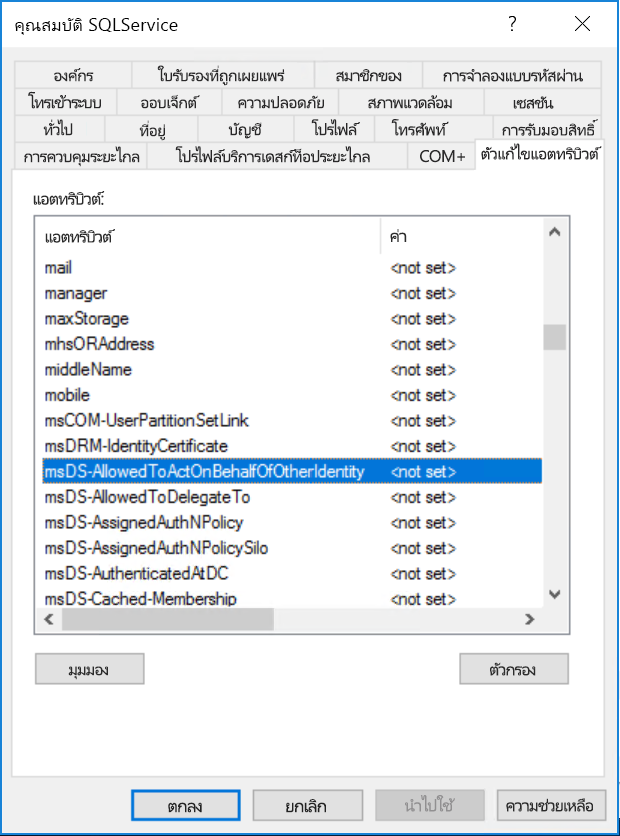

# <a name="configure-kerberos-based-sso-from-power-bi-service-to-on-premises-data-sources"></a>ใช้ Kerberosสำหรับ SSO จากPower BI ไปยังแหล่งข้อมูลภายในองค์กร

ใช้ [การมอบสิทธิ์แบบจำกัดของ Kerberos](/windows-server/security/kerberos/kerberos-constrained-delegation-overview) เพื่อเปิดใช้งานการเชื่อมต่อการลงชื่อเข้าใช้ครั้งเดียว (SSO) แบบไร้รอยต่อ การเปิดใช้งาน SSO ทำให้รายงาน Power BI และแดชบอร์ดสามารถรีเฟรชข้อมูลจากแหล่งข้อมูลภายในองค์กรได้อย่างง่ายดาย ในขณะที่ยังเป็นไปตามสิทธิ์ระดับผู้ใช้ที่กำหนดค่าไว้บนแหล่งข้อมูลเหล่านั้น

จะต้องกำหนดค่าหลายรายการ เพื่อให้การมอบหมายที่มีข้อจำกัดของ Kerberos ทำงานได้อย่างถูกต้อง ซึ่งรวมถึง_ชื่อบริการหลัก_ (SPN) และการตั้งค่าการมอบหมายบนบัญชีบริการ

### <a name="prerequisite-1-install-and-configure-the-microsoft-on-premises-data-gateway"></a>ข้อกำหนดเบื้องต้น 1: ติดตั้งและกำหนดค่าเกตเวย์ข้อมูลภายในองค์กร Microsoft

เกตเวย์ข้อมูลภายในองค์กรรองรับการอัปเกรดแบบแทนที่ และ_การแทนที่การตั้งค่า_ของเกตเวย์เดิม

### <a name="prerequisite-2-run-the-gateway-windows-service-as-a-domain-account"></a>ข้อกำหนดเบื้องต้น 2: เรียกใช้บริการ Windows ของเกตเวย์ด้วยบัญชีโดเมน

ในการติดตั้งแบบมาตรฐาน เกตเวย์จะทำงานด้วยบัญชีบริการภายในเครื่อง (ซึ่งก็คือ _NT Service\PBIEgwService_) เช่นที่แสดงในรูปต่อไปนี้:


เมื่อต้องการเปิดใช้งานการมอบสิทธิ์แบบจำกัดของ Kerberos เกตเวย์ต้องทำงานเป็นบัญชีโดเมน เว้นแต่ว่าอินสแตนซ์ Azure Active Directory (Azure AD) ของคุณได้ซิงโครไนซ์กับอินสแตนซ์ Active Directory ภายในเครื่องของคุณแล้ว (โดยใช้ Azure AD DirSync/Connect) เมื่อต้องการสลับไปยังบัญชีโดเมน ให้ดู [เปลี่ยนบัญชีบริการเกตเวย์](/data-integration/gateway/service-gateway-service-account)

> [!NOTE]
> ถ้ามีการกำหนดค่า Azure AD Connect และบัญชีผู้ใช้ซิงโครไนซ์ บริการเกตเวย์ไม่จำเป็นต้องดำเนินการภายใน Azure AD ค้นหาในขณะทำงาน แต่คุณสามารถใช้บริการ SID ภายในเครื่องสำหรับบริการเกตเวย์เพื่อทำการกำหนดค่าที่จำเป็นทั้งหมดใน Azure Active Directory ให้เสร็จสมบูรณ์ ขั้นตอนการกำหนดค่า การมอบสิทธิ์แบบจำกัดของ Kerberos ที่ระบุไว้ในบทความนี้เหมือนกับการกำหนดค่าที่จำเป็นในบริบท Azure Active Directory โดยแค่นำไปใช้กับอ็อปเจ็กต์ (ตามที่ได้ระบุโดย SID ของบริการภายในเครื่อง) คอมพิวเตอร์ของเกตเวย์ใน Azure AD แทนบัญชีโดเมน

### <a name="prerequisite-3-have-domain-admin-rights-to-configure-spns-setspn-and-kerberos-constrained-delegation-settings"></a>ข้อกำหนดเบื้องต้น 3: มีสิทธิ์ผู้ดูแลระบบโดเมนเพื่อกำหนดค่า SPN (SetSPN) และการตั้งค่าการมอบหมายที่มีข้อจำกัดของ Kerberos

เราไม่แนะนำให้ผู้ดูแลระบบโดเมนอนุญาตให้บุคคลอื่นมีสิทธิ์กำหนดการตั้งค่าค่า SPN และการมอบสิทธิ์ของ Kerberos เป็นการชั่วคราวหรือถาวร โดยไม่ต้องขอสิทธิ์ของผู้ดูแลระบบโดเมนคนนั้น ในส่วนต่อไปนี้ มีรายละเอียดเพิ่มเติมเกี่ยวกับขั้นตอนการกำหนดค่าที่แนะนำ

## <a name="configure-kerberos-constrained-delegation-for-the-gateway-and-data-source"></a>กำหนดค่าการมอบสิทธิ์แบบจำกัดของ Kerberos สำหรับเกตเวย์และแหล่งข้อมูล

ในฐานะผู้ดูแลระบบโดเมน ให้กำหนดค่า SPN สำหรับบัญชีโดเมนของบริการเกตเวย์ (ถ้าจำเป็น) และกำหนดค่าการตั้งค่าการมอบสิทธิ์บนบัญชีโดเมนของบริการเกตเวย์

### <a name="configure-an-spn-for-the-gateway-service-account"></a>กำหนดค่า SPN สำหรับบัญชีของบริการเกตเวย์

ขั้นแรก ตรวจสอบว่ามีการสร้าง SPN สำหรับบัญชีโดเมน ที่จะใช้เป็นบัญชีของบริการเกตเวย์ ไว้แล้วหรือไม่:

1. ในฐานะผู้ดูแลโดเมน ให้เรียกใช้งาน **Active Directory Users and Computers**

2. คลิกขวาบนโดเมน เลือก **ค้นหา** และป้อนชื่อบัญชีของบัญชีบริการเกตเวย์

3. ในผลลัพธ์การค้นหา คลิกขวาบนบัญชีบริการเกตเวย์ แล้วเลือก **คุณสมบัติ**

4. ถ้าเห็นแท็บ**การรับมอบสิทธิ์** ในกล่องโต้ตอบ**คุณสมบัติ** แสดงว่า SPN ได้ถูกสร้างขึ้นแล้ว และคุณสามารถข้ามไปยังหัวข้อย่อยถัดไปเรื่อง[การกำหนดค่าการรับมอบสิทธิ์ของ Kerberos ที่ใช้ทรัพยากรหรือมาตรฐาน](#decide-on-resource-based-or-standard-kerberos-constrained-delegation)

    ถ้าไม่มีแท็บ**การมอบสิทธิ์**บนกล่องโต้ตอบ**คุณสมบัติ** คุณสามารถสร้าง SPN บนบัญชีผู้ใช้นั้นด้วยตนเองเพื่อเปิดการใช้งาน ใช้ [เครื่องมือ setspn](https://technet.microsoft.com/library/cc731241.aspx) ที่มาพร้อมกับ Windows (คุณจำเป็นต้องมีสิทธิ์ผู้ดูแลระบบโดเมนเพื่อสร้าง SPN)

    ยกตัวอย่าง สมมติว่าบัญชีผู้ใช้บริการเกตเวย์คือ **Contoso\GatewaySvc** และชื่อของเครื่องที่บริการเกตเวย์ทำงานชื่อว่า **MyGatewayMachine** เพื่อตั้งค่า SPN สำหรับบัญชีบริการเกตเวย์ คุณจะเรียกใช้คำสั่งต่อไปนี้:

    

    คุณยังสามารถตั้งค่า SPN โดยใช้สแน็ปอินผู้ใช้ของ Active Directory และคอมพิวเตอร์ MMC (คอนโซลการจัดการ Microsoft) ได้

### <a name="decide-on-resource-based-or-standard-kerberos-constrained-delegation"></a>ตัดสินใจในการรับมอบสิทธิ์ที่มีการจำกัด Kerberos ของทรัพยากรหรือมาตรฐาน

การตั้งค่าการรับมอบสิทธิ์สามารถกำหนดค่าสำหรับ_ทั้ง_การรับมอบสิทธิ์ Kerberos แบบที่จำกัดของทรัพยากรหรือการรับมอบสิทธิ์ของ kerberos ที่จำกัดมาตรฐานของ Kerberos ใช้การรับมอบสิทธิ์ตามทรัพยากรถ้าแหล่งข้อมูลของคุณเป็นของโดเมนอื่นนอกเหนือจากเกตเวย์ของคุณแต่โปรดทราบว่าวิธีนี้จำเป็นต้องใช้ Windows Server 2012 หรือใหม่กว่า ดู[หน้าภาพรวมของการรับมอบสิทธิ์](/windows-server/security/kerberos/kerberos-constrained-delegation-overview)สำหรับข้อมูลเพิ่มเติมเกี่ยวกับความแตกต่างระหว่างสองวิธีในการรับมอบสิทธิ์

 เมื่อคุณตัดสินใจว่าคุณต้องการใช้วิธีใดให้ดำเนินการต่อไปยัง_ทั้ง_ [บัญชีบริการเกตเวย์สำหรับการมอบหมายที่มีข้อจำกัดของ Kerberos มาตรฐาน](#configure-the-gateway-service-account-for-standard-kerberos-constrained-delegation)_หรือ_ส่วนของการตั้งค่าบริการเกตเวย์ [บัญชีสำหรับการมอบหมายที่มีข้อจำกัดของ Kerberos ที่มีการรับมอบสิทธิ์](#configure-the-gateway-service-account-for-resource-based-kerberos-constrained-delegation) ไม่เสร็จสมบูรณ์ทั้งส่วนย่อยทั้งสอง

## <a name="configure-the-gateway-service-account-for-standard-kerberos-constrained-delegation"></a>กำหนดค่าบัญชีผู้ใช้บริการเกตเวย์สำหรับการมอบหมายที่มีข้อจำกัดของ Kerberos มาตรฐาน

> [!NOTE]
> ทำตามขั้นตอนในส่วนนี้ให้เสร็จสมบูรณ์ถ้าคุณต้องการเปิดใช้งานการมอบหมายที่มีข้อจำกัดของ Kerberos มาตรฐาน ถ้าคุณต้องการเปิดใช้งานการมอบหมายที่มีข้อจำกัดของ Kerberos ทรัพยากรเสร็จสมบูรณ์ขั้นตอนในส่วนย่อยทั้งสองของ [การตั้งค่า บัญชีบริการเกตเวย์สำหรับการรับมอบสิทธิ์ที่มีข้อจำกัดของ Kerberos ที่มีการรับมอบสิทธิ์](#configure-the-gateway-service-account-for-resource-based-kerberos-constrained-delegation)

เราจะไม่ตั้งค่ากำหนดค่า การรับมอบสิทธิ์ ในบัญชีโดเมนของบริการเกตเวย์ มีเครื่องมือหลายตัวที่คุณสามารถใช้เพื่อดำเนินการขั้นตอนเหล่านี้ ในที่นี้ เราจะใช้ ผู้ใช้และคอมพิวเตอร์ Active Directory ซึ่งเป็นสแนปอิน Microsoft Management Console (MMC) ไปยังผู้ดูแลระบบและเผยแพร่ข้อมูลในไดเรกทอรี ซึ่งพร้อมใช้งานบนตัวควบคุมโดเมนตามค่าเริ่มต้นนอกจากนี้ คุณยังสามารถเปิดใช้งานผ่านทางการกำหนดค่า คุณลักษณะของ Windows บนเครื่องอื่นๆ ได้

เราจำเป็นต้องกำหนดค่าการมอบสิทธิ์แบบจำกัดของ Kerberos ด้วยเปลี่ยนโพรโทคอล สำหรับการรับมอบสิทธิ์ที่บังคับ คุณต้องมีความชัดเจนว่าบริการใดที่คุณต้องการอนุญาตให้เกตเวย์นำเสนอข้อมูลประจำตัวที่ได้รับมอบสิทธิ์ ตัวอย่างเช่น เฉพาะ SQL Server หรือเซิร์ฟเวอร์ SAP HANA ของคุณเท่านั้นที่ยอมรับการเรียกรับสิทธิ์จากบัญชีบริการเกตเวย์

ส่วนนี้ถือว่า คุณได้กำหนดค่า SPN สำหรับแหล่งข้อมูลพื้นฐานของคุณ (เช่น SQL Server, SAP HANA,SAP BW Teradata และ Spark) ถ้าต้องการเรียนรู้วิธีการกำหนดค่า SPN ของเซิร์ฟเวอร์แหล่งข้อมูลเหล่านั้น โปรดดูคู่มือทางเทคนิคสำหรับเซิร์ฟเวอร์ฐานข้อมูลที่เกี่ยวข้อง นอกจากนี้คุณยังสามารถดูส่วนหัว *SPN ใดที่แอปของคุณจำเป็นต้องใช้*นการโพสต์บล็อก[รายการตรวจสอบ Kerberos ของฉัน](https://techcommunity.microsoft.com/t5/SQL-Server-Support/My-Kerberos-Checklist-8230/ba-p/316160)

ในขั้นตอนต่อไปนี้ เราสมมติว่าสภาพแวดล้อมในองค์กรที่มีสองเครื่องในโดเมนที่เหมือนกัน: เครื่องเกตเวย์และเซิร์ฟเวอร์ฐานข้อมูลที่เรียกใช้ SQL Server ที่ได้รับการกำหนดค่าสำหรับ SSO ที่ใช้ Kerberos อยู่แล้ว ขั้นตอนนี้สามารถนำมาใช้ได้กับแหล่งข้อมูลที่ได้รับการสนับสนุนอีกหนึ่งรายการดังนั้นตราบใดที่แหล่งข้อมูลได้รับการกำหนดค่าไว้สำหรับการลงชื่อเข้าใช้แบบครั้งเดียวที่ใช้ Kerberos เพื่อใช้ตัวอย่างนี้ เราจะสมมติการตั้งค่าและชื่อต่อไปนี้:

* Active Directory Domain (Netbios): **Contoso**
* ชื่อเครื่องเกตเวย์: **MyGatewayMachine**
* บัญชีบริการเกตเวย์: **Contoso\GatewaySvc**
* ชื่อเครื่องแหล่งข้อมูล SQL Server: **TestSQLServer**
* บัญชีบริการแหล่งข้อมูล SQL Server: **Contoso\SQLService**

นี่คือวิธีการกำหนดค่าการตั้งค่าการมอบสิทธิ์:

1. ด้วยสิทธิ์ผู้ดูแลระบบโดเมน ให้เปิด **ผู้ใช้และคอมพิวเตอร์ Active Directory**

2. คลิกขวาบนบัญชีบริการเกตเวย์ (**Contoso\GatewaySvc**) แล้วเลือก **คุณสมบัติ**

3. เลือกแถบ **การมอบหมาย**

4. เลือก **เชื่อถือคอมพิวเตอร์เครื่องนี้สำหรับการมอบหมายบริการที่ระบุเท่านั้น** > **ใช้โพรโทคอลการรับรองความถูกต้องใด ๆ**

5. ภายใต้ **บริการที่บัญชีผู้ใช้นี้สามารถใช้ข้อมูลประจำตัวที่ได้รับมอบหมาย:** เลือก **เพิ่ม**

6. ในกล่องโต้ตอบใหม่ เลือก **ผู้ใช้หรือคอมพิวเตอร์**

7. ใส่บัญชีบริการสำหรับแหล่งข้อมูล ตัวอย่างเช่น แหล่งข้อมูล SQL Server อาจมีบัญชีผู้ใช้บริการเช่น **Contoso\SQLService** ควรตั้งค่า SPN ที่เหมาะสมสำหรับแหล่งข้อมูลในบัญชีนี้แล้ว เมื่อมีการเพิ่มบัญชีแล้ว ให้เลือก**ตกลง**

8. เลือก SPN ที่คุณสร้างขึ้นสำหรับเซิร์ฟเวอร์ฐานข้อมูล ในตัวอย่างของเรา SPN จะเริ่มต้นด้วย **MSSQLSvc** ถ้าคุณเพิ่มทั้ง FQDN และ NetBIOS SPN สำหรับบริการฐานข้อมูลของคุณ ให้เลือกทั้งสองอย่าง คุณอาจเห็นเพียงหนึ่งรายการเท่านั้น

9. เลือก**ตกลง** ขณะนี้คุณควรเห็น SPN ในรายการของบริการ ซึ่งบัญชีบริการเกตเวย์สามารถแสดงข้อมูลประจำตัวที่ได้รับมอบหมายได้

    

ในตอนนี้ให้ข้ามไปยัง [การอนุญาต สิทธิ์ของนโยบายภายในของบัญชีบริการเกตเวย์บนเครื่องเกตเวย์](#grant-the-gateway-service-account-local-policy-rights-on-the-gateway-machine) เพื่อดำเนินกระบวนการตั้งค่าต่อไป

## <a name="configure-the-gateway-service-account-for-resource-based-kerberos-constrained-delegation"></a>กำหนดค่าบัญชีผู้ใช้บริการเกตเวย์สำหรับการมอบหมายที่มีข้อจำกัดของ Kerberos ที่ใช้ทรัพยากร

> [!NOTE]
> ทำตามขั้นตอนในส่วนนี้ให้เสร็จสมบูรณ์ถ้าคุณต้องการเปิดใช้งานการมอบหมายที่มีข้อจำกัดของ Kerberos ที่ใช้ทรัพยากร ถ้าคุณต้องการเปิดใช้งานการมอบหมายที่มีข้อจำกัดของ Kerberos มาตรฐานทรัพยากรเสร็จสมบูรณ์ขั้นตอนในส่วนย่อยทั้งสองของ [การตั้งค่า บัญชีบริการเกตเวย์สำหรับการรับมอบสิทธิ์ที่มีข้อจำกัดของ Kerberos มาตรฐานที่มีการรับมอบสิทธิ์](#configure-the-gateway-service-account-for-standard-kerberos-constrained-delegation)

ใช้[การมอบหมายที่มีข้อจำกัดของ Kerberos ตามทรัพยากร](/windows-server/security/kerberos/kerberos-constrained-delegation-overview)เพื่อเปิดใช้งานการเชื่อมต่อการลงชื่อเข้าระบบครั้งเดียวสำหรับ Windows Server 2012 และเวอร์ชันที่ใหม่กว่า เพื่ออนุญาตให้บริการหน้าสุดและปลายสุดมีโดเมนที่แตกต่างกัน สำหรับขั้นตอนนี้ โดเมนของบริการปลายสุดจำเป็นต้องเชื่อถือโดเมนของบริการหน้าสุด

ในขั้นตอนต่อไปนี้เราสมมติว่าสภาพแวดล้อมในองค์กรที่มีสองเครื่องในโดเมนที่ต่างกัน: เครื่องเกตเวย์และเซิร์ฟเวอร์ฐานข้อมูลที่เรียกใช้ SQL Server ที่ได้รับการกำหนดค่าสำหรับ SSO ที่ใช้ Kerberos อยู่แล้ว ขั้นตอนนี้สามารถนำมาใช้ได้กับแหล่งข้อมูลที่ได้รับการสนับสนุนอีกหนึ่งรายการดังนั้นตราบใดที่แหล่งข้อมูลได้รับการกำหนดค่าไว้สำหรับการลงชื่อเข้าใช้แบบครั้งเดียวที่ใช้ Kerberos เพื่อใช้ตัวอย่างนี้ เราจะสมมติการตั้งค่าและชื่อต่อไปนี้:

* ระบบโดเมนส่วนหน้าของ Active Directory (Netbios): **ContosoFrontEnd**
* ระบบโดเมนส่วนหลังของ Active Directory (Netbios): **ContosoBackEnd**
* ชื่อเครื่องเกตเวย์: **MyGatewayMachine**
* บัญชีบริการเกตเวย์: **ContosoFrontEnd\GatewaySvc**
* ชื่อเครื่องแหล่งข้อมูล SQL Server: **TestSQLServer**
* บัญชีบริการแหล่งข้อมูล SQL Server: **ContosoBackEnd\SQLService**

จากตัวอย่างชื่อและการตั้งค่าที่ให้มา ให้ทำขั้นตอนการกำหนดค่าต่อไปนี้ให้เสร็จสิ้น:

1. บนตัวควบคุมโดเมนสำหรับโดเมน **ContosoFront-end** ตรวจสอบให้แน่ใจว่าไม่มีการปรับใช้การตั้งค่าการมอบหมายสำหรับบัญชีผู้ใช้บริการเกตเวย์ใช้ **Active Directory Users and Computers** ซึ่งเป็น Microsoft Management Console (MMC) snap-in

    

2. ใช้ **Active Directory Users and Computers** บนตัวควบคุมโดเมนสำหรับโดเมน **ContosoBack-end** ตรวจสอบให้แน่ใจว่าไม่มีการปรับใช้การตั้งค่าการมอบหมายสำหรับบัญชีบริการปลายสุด

    

3. นอกจากนี้ ตรวจสอบให้แน่ใจว่าแอตทริบิวต์ **msDS-AllowedToActOnBehalfOfOtherIdentity**สำหรับบัญชีนี้ยังไม่ได้ตั้งค่า คุณสามารถค้นหา**แอตทริบิวต์นี้ใน "ตัวแก้ไขแอตทริบิวต์"** ดังที่แสดงในรูปภาพต่อไปนี้:

    

4. สร้างกลุ่มใน **Active Directory Users and Computers** บนตัวควบคุมโดเมนสำหรับโดเมน **ContosoBackEnd** เพิ่มบัญชีผู้ใช้บริการเกตเวย์ไปยังกลุ่มนี้ดังที่แสดงในรูปภาพต่อไปนี้ รูปภาพจะแสดงกลุ่มใหม่เรียกว่า _ResourceDelGroup_ และบัญชีผู้ใช้บริการเกตเวย์ **GatewaySvc** ที่เพิ่มลงในกลุ่มนี้

    

5. เปิดพร้อมท์คำสั่งและเรียกใช้คำสั่งต่อไปนี้ในตัวควบคุมโดเมนสำหรับโดเมน **ContosoBackEnd** เพื่ออัปเดตแอตทริบิวต์ **msDS-AllowedToActOnBehalfOfOtherIdentity** ของบัญชีบริการปลายสุด:

    ```powershell
    $c = Get-ADGroup ResourceDelGroup
    Set-ADUser SQLService -PrincipalsAllowedToDelegateToAccount $c
    ```

6. คุณสามารถตรวจสอบว่าการอัปเดตจะแสดงอยู่ในแท็บ "ตัวแก้ไขแอตทริบิวต์" ในคุณสมบัติสำหรับบัญชีบริการปลายสุดใน **Active Directory Users and Computers** ควรกำหนด **msDS-AllowedToActOnBehalfOfOtherIdentity** แล้วในตอนนี้

## <a name="grant-the-gateway-service-account-local-policy-rights-on-the-gateway-machine"></a>การอนุญาต สิทธิ์ของนโยบายภายในของบัญชีบริการเกตเวย์บนเครื่องเกตเวย์

สุดท้าย บนเครื่องที่มีบริการเกตเวย์ทำงาน (**MyGatewayMachine** ในตัวอย่างของเรา) คุณต้องให้นโยบายภายในเครื่อง **เลียนแบบไคลเอ็นต์หลังจากการรับรองความถูกต้องแก่บัญชีบริการเกตเวย์** และ**ทำหน้าที่เป็นส่วนหนึ่งของระบบปฏิบัติการ (SeTcbPrivilege)** คุณสามารถดำเนินการและตรวจสอบการกำหนดค่านี้ได้ด้วยตัวแก้ไขนโยบายกลุ่มภายใน (**gpedit**)

1. บนเครื่องเกตเวย์ เรียกใช้: *gpedit.msc*

2. ไปยัง **นโยบายคอมพิวเตอร์ภายใน** &gt;  **การกำหนดค่าคอมพิวเตอร์** &gt; **การตั้งค่า Windows** &gt; **การตั้งค่าความปลอดภัย** &gt; **นโยบายภายในเครื่อง** &gt; **การกำหนดสิทธิ์ของผู้ใช้**

    

3. ภายใต้ **การกำหนดสิทธิ์ของผู้ใช้** จากรายการนโยบาย ให้เลือก **เลียนแบบไคลเอ็นต์หลังจากการรับรองความถูกต้อง**

    

    คลิกขวา และเปิด **คุณสมบัติ** ตรวจสอบรายการของบัญชี ซึ่งต้องมีบัญชีบริการเกตเวย์ (**Contoso\GatewaySvc** หรือ **ContosoFrontEnd\GatewaySvc** ทั้งนี้ขึ้นอยู่กับประเภทของการมอบหมายที่ จำกัด)

4. ภายใต้ **การกำหนดสิทธิ์ของผู้ใช้** จากรายการของนโยบาย เลือก **ทำหน้าที่เป็นส่วนหนึ่งของระบบปฏิบัติการ (SeTcbPrivilege)** ตรวจสอบให้แน่ใจว่า บัญชีบริการเกตเวย์รวมอยู่ในรายการของบัญชีผู้ใช้นี้เช่นกัน

5. รีสตาร์ต **เกตเวย์ข้อมูลในองค์กร**

### <a name="set-user-mapping-configuration-parameters-on-the-gateway-machine-if-required"></a>ตั้งพารามิเตอร์การกำหนดค่าการแมปผู้ใช้ในเครื่องเกตเวย์ถ้าจำเป็น

ถ้าคุณไม่ได้กำหนดค่า Azure AD Connect ไว้ ให้ทำตามขั้นตอนเหล่านี้เพื่อแมปผู้ใช้ของบริการ Power BI ทุกรายเข้ากับผู้ใช้ Azure AD ผู้ใช้ Active Directory แต่ละคนที่ถูกแมปด้วยวิธีนี้จะต้องมีสิทธิ์ SSO สำหรับแหล่งข้อมูลของคุณ สำหรับข้อมูลเพิ่มเติม[โปรดดูที่คนในคิวบ์วิดีโอ](https://www.youtube.com/watch?v=NG05PG9aiRw)

1. เปิดไฟล์การกำหนดค่าเกตเวย์หลัก `Microsoft.PowerBI.DataMovement.Pipeline.GatewayCore.dll` ตามค่าเริ่มต้น ไฟล์นี้จะถูกเก็บไว้ที่ C:\Program Files\On-premises data gateway

1. ตั้งค่า **ADUserNameLookupProperty** ไปยังแอตทริบิวต์ Active Directory ที่ไม่ได้ใช้งาน เราจะถือว่า `msDS-cloudExtensionAttribute1` ถูกใช้ในขั้นตอนที่ติดตามแต่แอตทริบิวต์นี้จะพร้อมใช้งานใน Windows Server 2012 และรุ่นที่ใหม่กว่าเท่านั้น ตั้งค่า **ADUserNameReplacementProperty** ถึง `SAMAccountName` บันทึกไฟล์การกำหนดค่า

1. จากแท็บ **บริการ** ของตัวจัดการงาน ให้คลิกขวาบริการเกตเวย์ แล้วเลือก **รีสตาร์ท**

    

1. สำหรับผู้ใช้บริการของ Power BI แต่ละคนที่คุณต้องการเปิดใช้งาน Kerberos SSO สำหรับตั้งค่าคุณสมบัติ `msDS-cloudExtensionAttribute1` ของผู้ใช้ Active Directory ภายในเครื่อง (ด้วยสิทธิ์ SSO กับแหล่งข้อมูลของคุณ) ไปยังชื่อผู้ใช้แบบเต็ม (ซึ่งก็คือ UPN) ของบริการของ Power BI ตัวอย่างเช่นถ้าคุณเข้าสู่ระบบบริการของ Power BI เป็น `test@contoso.com` และคุณต้องการแมปผู้ใช้รายนี้ไปยังผู้ใช้ Active Directory ภายในเครื่องที่มีสิทธิ์ SSO ให้พูดว่า `test@LOCALDOMAIN.COM` ตั้งค่าแอตทริบิวต์`test@LOCALDOMAIN.COM` ของ`msDS-cloudExtensionAttribute1`  เป็น `test@contoso.com`

    คุณยังสามารถตั้งค่า`msDS-cloudExtensionAttribute1`คุณสมบัติโดยใช้สแน็ปอินผู้ใช้ของ Active Directory และคอมพิวเตอร์ MMC (คอนโซลการจัดการ Microsoft) ได้:
    
    1. ในฐานะผู้ดูแลโดเมน ให้เรียกใช้งานผู้ใช้และคอมพิวเตอร์ Active Directory
    
    1. คลิกขวาบนโดเมนเลือกค้นหาและพิมพ์ชื่อบัญชีผู้ใช้ของ local Active Directory ที่คุณต้องการแมปไปยัง
    
    1. เลือกแท็บ **ตัวแก้ไขแอตทริบิวต์**
    
        วางตำแหน่งคุณสมบัติ `msDS-cloudExtensionAttribute1` แล้วดับเบิลคลิก ตั้งค่าให้กับชื่อผู้ใช้เต็ม (ซึ่งก็คือ UPN) ของผู้ใช้ที่คุณใช้ในการลงชื่อเข้าใช้บริการ Power BI
    
    1. เลือก**ตกลง**
    
        
    
    1. เลือก**นำไปใช้** ตรวจสอบว่ามีการตั้งค่าที่ถูกต้องในคอลัมน์ **Value** หรือไม่

## <a name="complete-data-source-specific-configuration-steps"></a>ทำตามขั้นตอนการกำหนดค่าเฉพาะแหล่งข้อมูล

SAP Hana และ SAP BW มีข้อกำหนดการกำหนดค่าเฉพาะแหล่งข้อมูลเพิ่มเติมและข้อกำหนดเบื้องต้นที่จำเป็นต้องได้รับการตอบสนองก่อนที่คุณสามารถสร้างการเชื่อมต่อ SSO ผ่านเกตเวย์ไปยังแหล่งข้อมูลเหล่านี้ได้ ดู[หน้าการกำหนดค่า SAP Hana](service-gateway-sso-kerberos-sap-hana.md) และ [SAP BW-CommonCryptoLib (sapcrypto.dll)](service-gateway-sso-kerberos-sap-bw-commoncryptolib.md) สำหรับรายละเอียด นอกจากนี้ยังสามารถ [configure SAP สำหรับใช้กับ gx64krb5 ของไลบรารีเอ็นซีที](service-gateway-sso-kerberos-sap-bw-gx64krb.md) แต่ไลบรารีนี้ไม่ได้รับการแนะนำโดย Microsoft เนื่องจากไม่มีการสนับสนุนจาก SAP อีกต่อไป คุณควรใช้ CommonCryptoLib _หรือ_ gx64krb5 เป็นไลบรารีของคุณ ไม่ต้องทำขั้นตอนการกำหนดค่าสำหรับทั้งสองไลบรารี

> [!NOTE]
> นอกจากนี้ไลบรารีของการรวมกันอื่นๆ อาจทำงานกับความต้องการของคุณ SSO แต่ไม่ได้รับการสนับสนุนจาก Microsoft อย่างเป็นทางการ

## <a name="run-a-power-bi-report"></a>เปิดใช้รายงาน Power BI

หลังจากดำเนินการขั้นตอนการกำหนดค่าทั้งหมดเสร็จสิ้นแล้ว คุณสามารถใช้หน้า **จัดการเกตเวย์** ใน Power BI เพื่อกำหนดค่าแหล่งข้อมูลคุณจะต้องใช้สำหรับ SSO ถ้าคุณมีเกตเวย์หลายแห่งให้ตรวจสอบให้แน่ใจว่าคุณเลือกเกตเวย์ที่กำหนดค่าไว้สำหรับ Kerberos SSO ภายใต้ **การตั้งค่าขั้นสูง** สำหรับแหล่งข้อมูล ตรวจสอบให้แน่ใจว่ามีการเลือก**ใช้ SSO ผ่าน Kerberos สำหรับแบบสอบถาม DirectQuery**


 เผยแพร่รายงาน **ที่ใช้ DirectQuery** จาก Power BI Desktop รายงานนี้ต้องใช้ข้อมูลที่สามารถเข้าถึงได้กับผู้ใช้ที่ถูกแมปกับผู้ใช้ Azure Active Directory ที่ลงชื่อในบริการของ Power BI คุณต้องใช้ DirectQuery แทนการนำเข้าเนื่องจากวิธีการการรีเฟรช เมื่อมีการรีเฟรชรายงานตามการนำเข้า เกตเวย์จะใช้ข้อมูลประจำตัวที่คุณใส่ลงในเขตข้อมูล**ชื่อผู้ใช้**และ**รหัสผ่าน**เมื่อคุณสร้างแหล่งข้อมูล อีกอย่างหนึ่ง Kerberos SSO **ไม่ได้**ถูกนำมาใช้งาน นอกจากนี้เมื่อมีการเผยแพร่ ตรวจสอบให้แน่ใจว่าคุณเลือกเกตเวย์ที่กำหนดค่าไว้สำหรับ  SSO ถ้าคุณมีหลายเกตเวย์ ในบริการของ Power BI ตอนนี้คุณควรสามารถรีเฟรชรายงานหรือสร้างรายงานใหม่โดยยึดตามชุดข้อมูลที่เผยแพร่แล้ว

กำหนดค่านี้ทำงานในกรณีส่วนใหญ่ อย่างไรก็ตาม การใช้งานกับ Kerberos อาจต้องมีการตั้งค่าที่แตกต่างกันออกไป ขึ้นอยู่กับสภาพแวดล้อมของคุณ ถ้ายังไม่สามารถโหลดรายงานได้ ให้ติดต่อผู้ดูแลระบบโดเมนของคุณเพื่อตรวจสอบเพิ่มเติม ถ้าแหล่งข้อมูลของคุณคือ SAP magsafe คุณยังสามารถอ้างอิงถึงส่วนการแก้ไขปัญหาของหน้าการกำหนดค่าเฉพาะแหล่งข้อมูลสำหรับ [CommonCryptoLib](service-gateway-sso-kerberos-sap-bw-commoncryptolib.md#troubleshooting) และ [2gx64krb5/gsskrb5 ](service-gateway-sso-kerberos-sap-bw-gx64krb.md#troubleshooting) ได้ โดยขึ้นอยู่กับไลบรารี SNC ที่คุณเลือกไว้แล้ว

## <a name="next-steps"></a>ขั้นตอนถัดไป

สำหรับข้อมูลเพิ่มเติมเกี่ยวกับ**เกตเวย์ข้อมูลภายในองค์กร**และ **DirectQuery** ลองดูแหล่งข้อมูลต่อไปนี้:

* [เกตเวย์ข้อมูลภายในองค์กรคืออะไร](/data-integration/gateway/service-gateway-onprem)
* [DirectQuery ใน Power BI](desktop-directquery-about.md)
* [แหล่งข้อมูลที่สนับสนุนโดย DirectQuery](desktop-directquery-data-sources.md)
* [DirectQuery และ SAP BW](desktop-directquery-sap-bw.md)
* [DirectQuery และ SAP HANA](desktop-directquery-sap-hana.md)
