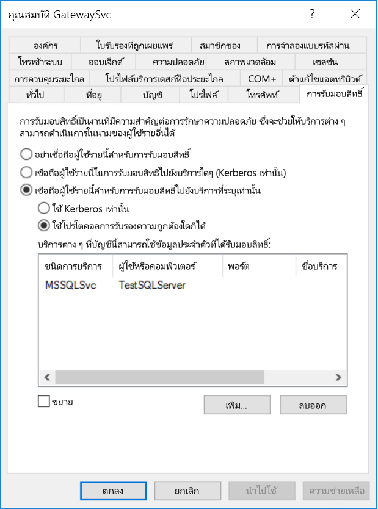
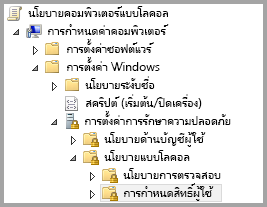
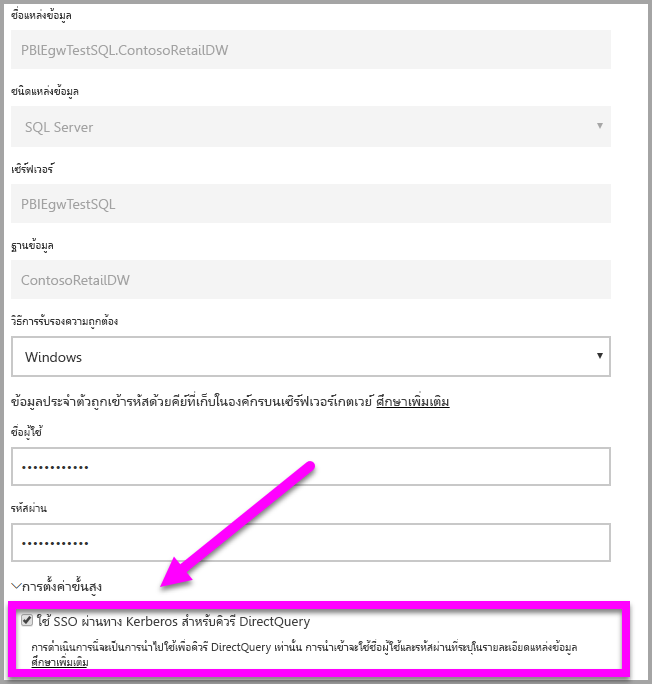
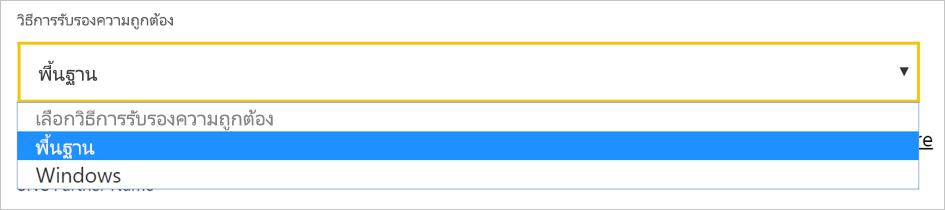
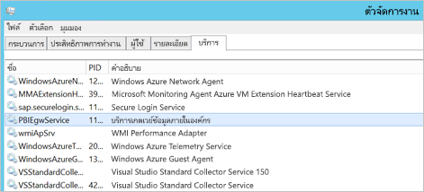
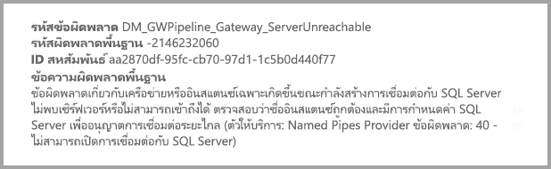

# <a name="use-kerberos-for-single-sign-on-sso-from-power-bi-to-on-premises-data-sources"></a>ใช้ Kerberos สำหรับลงชื่อเข้าใช้ครั้งเดียว (SSO) จาก Power BI ไปยังแหล่งข้อมูลภายในองค์กร

ใช้ [การมอบสิทธิ์แบบจำกัดของ Kerberos](/windows-server/security/kerberos/kerberos-constrained-delegation-overview) เพื่อเปิดใช้งานการเชื่อมต่อการลงชื่อเข้าใช้ครั้งเดียว (SSO) แบบไร้รอยต่อ เปิดใช้งาน SSO สำหรับรายงาน Power BI และแดชบอร์ดเพื่อรีเฟรชข้อมูลจากแหล่งข้อมูลภายในองค์กรอย่างง่ายดาย

## <a name="supported-data-sources"></a>แหล่งข้อมูลที่ได้รับการสนับสนุน

ขณะนี้เราสนับสนุนแหล่งข้อมูลต่อไปนี้:

* SQL Server
* SAP HANA
* SAP BW
* Teradata
* Spark
* Impala

เรายังสนับสนุน SAP HANA ด้วย [Security Assertion Markup Language (SAML)](service-gateway-sso-saml.md)

### <a name="sap-hana"></a>SAP HANA

เพื่อเปิดใช้งาน SSO สำหรับ SAP HANA ให้ทำตามขั้นตอนต่อไปนี้ก่อน:

* ตรวจสอบให้แน่ใจว่า เซิร์ฟเวอร์ SAP HANA ทำงานด้วยเวอร์ชันขั้นต่ำ ซึ่งขึ้นอยู่กับระดับเซิร์ฟเวอร์แพลตฟอร์ม SAP HANA ของคุณ:
  * [HANA 2 SPS 01 Rev 012.03](https://launchpad.support.sap.com/#/notes/2557386)
  * [HANA 2 SPS 02 Rev 22](https://launchpad.support.sap.com/#/notes/2547324)
  * [HANA 1 SP 12 Rev 122.13](https://launchpad.support.sap.com/#/notes/2528439)
* บนเครื่องเกตเวย์ ติดตั้งโปรแกรมควบคุม HANA ODBC ล่าสุดของ SAP  เวอร์ชันขั้นต่ำคือ HANA ODBC เวอร์ชัน 2.00.020.00 ที่ออกเดือน สิงหาคม 2017

สำหรับข้อมูลเพิ่มเติมเกี่ยวกับการตั้งค่า SSO สำหรับ SAP HANA โดยใช้ Kerberos โปรดดู [ลงชื่อเข้าระบบครั้งเดียวโดยใช้ Kerberos](https://help.sap.com/viewer/b3ee5778bc2e4a089d3299b82ec762a7/2.0.03/1885fad82df943c2a1974f5da0eed66d.html) ในคู่มือการรักษาความปลอดภัย SAP HANA โปรดดูลิงก์จากหน้านั้น โดยเฉพาะอย่างยิ่ง SAP Note 1837331 – HOWTO HANA DBSSO Kerberos/Active Directory

## <a name="prepare-for-kerberos-constrained-delegation"></a>เตรียมเพื่อการมอบสิทธิ์แบบจำกัดของ Kerberos

คุณต้องกำหนดค่าหลายรายการ เพื่อให้การมอบสิทธิ์แบบจำกัดของ Kerberos ทำงานได้อย่างถูกต้อง ซึ่งรวมถึง*ชื่อบริการหลัก* (SPN) และการตั้งค่าการมอบสิทธิ์บนบัญชีบริการ

### <a name="prerequisite-1-install-and-configure-the-microsoft-on-premises-data-gateway"></a>ข้อกำหนดเบื้องต้น 1: ติดตั้งและกำหนดค่าเกตเวย์ข้อมูลภายในองค์กร Microsoft

เกตเวย์ข้อมูลภายในองค์กรรุ่นนี้สนับสนุนการอัปเกรดแบบแทนที่ ตลอดจน การแทนที่ค่าที่ตั้งไว้ของเกตเวย์ที่มีอยู่

### <a name="prerequisite-2-run-the-gateway-windows-service-as-a-domain-account"></a>ข้อกำหนดเบื้องต้น 2: เรียกใช้บริการ Windows ของเกตเวย์ด้วยบัญชีโดเมน

ในการติดตั้งแบบมาตรฐาน เกตเวย์จะทำงานด้วยบัญชีบริการภายในเครื่อง (ซึ่งก็คือ *NT Service\PBIEgwService*)


เมื่อต้องการเปิดใช้งานการมอบสิทธิ์แบบจำกัดของ Kerberos เกตเวย์ต้องทำงานเป็นบัญชีโดเมน เว้นแต่ว่าอินสแตนซ์ Azure Active Directory (Azure AD) ของคุณได้ซิงโครไนซ์กับอินสแตนซ์ Active Directory ภายในเครื่องของคุณแล้ว (โดยใช้ Azure AD DirSync/Connect) เมื่อต้องการสลับไปยังบัญชีโดเมน ให้ดู [เปลี่ยนบัญชีบริการเกตเวย์](/data-integration/gateway/service-gateway-service-account)

> [!NOTE]
> ถ้ามีการกำหนดค่า Azure AD Connect และบัญชีผู้ใช้ซิงโครไนซ์ บริการเกตเวย์ไม่จำเป็นต้องดำเนินการภายใน Azure AD ค้นหาในขณะทำงาน คุณสามารถใช้ SID ของบริการภายในเครื่อง (แทนการใช้บัญชีโดเมน) สำหรับบริการเกตเวย์ ขั้นตอนการกำหนดค่า การมอบสิทธิ์แบบจำกัดของ Kerberos ที่ระบุไว้ในบทความนี้เหมือนกับการกำหนดค่านั้น โดยแค่นำไปใช้กับอ็อปเจ็กต์คอมพิวเตอร์ของเกตเวย์ใน Azure AD แทนบัญชีโดเมน

### <a name="prerequisite-3-have-domain-admin-rights-to-configure-spns-setspn-and-kerberos-constrained-delegation-settings"></a>ข้อกำหนดเบื้องต้น 3: มีสิทธิ์ผู้ดูแลระบบโดเมนเพื่อกำหนดค่า SPN (SetSPN) และการตั้งค่าการมอบหมายที่มีข้อจำกัดของ Kerberos

เราไม่แนะนำให้ผู้ดูแลระบบโดเมนอนุญาตให้บุคคลอื่นมีสิทธิ์กำหนดค่า SPN และการมอบสิทธิ์ของ Kerberos เป็นการชั่วคราวหรือถาวร โดยไม่ต้องขอสิทธิ์ของผู้ดูแลระบบโดเมน ในส่วนต่อไปนี้ มีรายละเอียดเพิ่มเติมเกี่ยวกับขั้นตอนการกำหนดค่าที่แนะนำ

## <a name="configure-kerberos-constrained-delegation-for-the-gateway-and-data-source"></a>กำหนดค่าการมอบสิทธิ์แบบจำกัดของ Kerberos สำหรับเกตเวย์และแหล่งข้อมูล

ในฐานะผู้ดูแลระบบโดเมน ให้กำหนดค่า SPN สำหรับบัญชีโดเมนของบริการเกตเวย์ และกำหนดค่าการตั้งค่าการมอบสิทธิ์บนบัญชีโดเมนของบริการเกตเวย์

### <a name="configure-an-spn-for-the-gateway-service-account"></a>กำหนดค่า SPN สำหรับบัญชีของบริการเกตเวย์

ขั้นแรก ตรวจสอบว่ามีการสร้าง SPN สำหรับบัญชีโดเมน ที่จะใช้เป็นบัญชีของบริการเกตเวย์ ไว้แล้วหรือไม่:

1. ในฐานะผู้ดูแลระบบโดเมน ให้เรียกใช้งาน **ผู้ใช้และคอมพิวเตอร์ Active Directory**

2. คลิกขวาบนโดเมน เลือก **ค้นหา** และป้อนชื่อบัญชีของบัญชีบริการเกตเวย์

3. ในผลลัพธ์การค้นหา คลิกขวาบนบัญชีบริการเกตเวย์ แล้วเลือก **คุณสมบัติ**

4. ถ้าแท็บ**การมอบสิทธิ์**ปรากฏอยู่บนกล่องโต้ตอบ**คุณสมบัติ** แสดงว่า SPN ถูกสร้างขึ้นแล้ว คุณสามารถข้ามไปกำหนดการตั้งค่าการมอบสิทธิ์

    ถ้าไม่มีแท็บ**การมอบสิทธิ์**บนกล่องโต้ตอบ**คุณสมบัติ** คุณสามารถสร้าง SPN บนบัญชีผู้ใช้นั้นด้วยตนเองได้ การดำเนินการนี้จะเพิ่มแท็บ **การมอบสิทธิ์** ใช้ [เครื่องมือ setspn](https://technet.microsoft.com/library/cc731241.aspx) ที่มาพร้อมกับ Windows (คุณจำเป็นต้องมีสิทธิ์ผู้ดูแลระบบโดเมนเพื่อสร้าง SPN)

    ยกตัวอย่าง สมมุติว่า บัญชีของบริการเกตเวย์คือ "PBIEgwTest\GatewaySvc" และเครื่องที่บริการเกตเวย์ทำงานชื่อว่า **Machine1** หากต้องการตั้งค่า SPN สำหรับบัญชีบริการเกตเวย์ สำหรับเครื่องในตัวอย่างนี้ ให้เรียกใช้คำสั่งต่อไปนี้:

    

    เมื่อเสร็จขั้นตอนนี้ เราจะไปกำหนดค่าการรับมอบสิทธิ์กันต่อ

### <a name="configure-delegation-settings-on-the-gateway-service-account"></a>กำหนดค่า การรับมอบสิทธิ์ ในบัญชีโดเมนของบริการเกตเวย์

สิ่งที่ต้องกำหนดค่าอย่างที่สองคือ การตั้งค่าการรับมอบสิทธิ์ในบัญชีผู้ใช้บริการเกตเวย์ มีเครื่องมือหลายตัวที่คุณสามารถใช้เพื่อดำเนินการขั้นตอนเหล่านี้ ในที่นี้ เราจะใช้ ผู้ใช้และคอมพิวเตอร์ Active Directory ซึ่งเป็นสแนปอิน Microsoft Management Console (MMC) ไปยังผู้ดูแลระบบและเผยแพร่ข้อมูลในไดเรกทอรี ซึ่งปกติติดตั้งอยู่ในตัวควบคุมโดเมนอยู่แล้ว นอกจากนี้ คุณยังสามารถเปิดใช้งานผ่านทางการกำหนดค่า คุณลักษณะของ Windows บนเครื่องอื่นๆ ได้

เราจำเป็นต้องกำหนดค่าการมอบสิทธิ์แบบจำกัดของ Kerberos ด้วยเปลี่ยนโพรโทคอล สำหรับการรับมอบสิทธิ์ที่บังคับ คุณต้องมีความชัดเจนว่าบริการใดที่คุณต้องการมอบหมาย ตัวอย่างเช่น เฉพาะ SQL Server หรือเซิร์ฟเวอร์ SAP HANA ของคุณเท่านั้นที่ยอมรับการเรียกรับสิทธิ์จากบัญชีบริการเกตเวย์

ส่วนนี้ถือว่า คุณได้กำหนดค่า SPN สำหรับแหล่งข้อมูลพื้นฐานของคุณ (เช่น SQL Server, SAP HANA, Teradata และ Spark) ถ้าต้องการเรียนรู้วิธีการกำหนดค่า SPN ของเซิร์ฟเวอร์แหล่งข้อมูลเหล่านั้น โปรดดูคู่มือทางเทคนิคสำหรับเซิร์ฟเวอร์ฐานข้อมูลที่เกี่ยวข้อง นอกจากนี้คุณยังสามารถดูส่วนหัว *SPN ใดที่แอปของคุณจำเป็นต้องใช้*นการโพสต์บล็อก[รายการตรวจสอบ Kerberos ของฉัน](https://techcommunity.microsoft.com/t5/SQL-Server-Support/My-Kerberos-Checklist-8230/ba-p/316160)

ในขั้นตอนต่อไป เราจะสมมติสภาพแวดล้อมในองค์กรที่มีสองเครื่องคือ เครื่องเกตเวย์และเซิร์ฟเวอร์ฐานข้อมูลที่ทำงานบน SQL Server เพื่อใช้ตัวอย่างนี้ เราจะสมมติการตั้งค่าและชื่อต่อไปนี้:

* ชื่อเครื่องเกตเวย์: **PBIEgwTestGW**
* บัญชีบริการเกตเวย์: **PBIEgwTest\GatewaySvc** (ชื่อที่แสดงบัญชี: ตัวเชื่อมต่อเกตเวย์)
* ชื่อเครื่องแหล่งข้อมูล SQL Server: **PBIEgwTestSQL**
* บัญชีบริการแหล่งข้อมูล SQL Server: **PBIEgwTest\SQLService**

นี่คือวิธีการกำหนดค่าการตั้งค่าการมอบสิทธิ์:

1. ด้วยสิทธิ์ผู้ดูแลระบบโดเมน ให้เปิด **ผู้ใช้และคอมพิวเตอร์ Active Directory**

2. คลิกขวาบนบัญชีบริการเกตเวย์ (**PBIEgwTest\GatewaySvc**) แล้วเลือก **คุณสมบัติ**

3. เลือกแถบ **การมอบหมาย**

4. เลือก **เชื่อถือคอมพิวเตอร์เครื่องนี้สำหรับการมอบหมายบริการที่ระบุเท่านั้น** > **ใช้โพรโทคอลการรับรองความถูกต้องใด ๆ**

5. ภายใต้ **บริการที่บัญชีผู้ใช้นี้สามารถใช้ข้อมูลประจำตัวที่ได้รับมอบหมาย:** เลือก **เพิ่ม**

6. ในกล่องโต้ตอบใหม่ เลือก **ผู้ใช้หรือคอมพิวเตอร์**

7. ใส่บัญชีบริการสำหรับแหล่งข้อมูล ตัวอย่างเช่น แหล่งข้อมูล SQL Server อาจมีบัญชีผู้ใช้บริการเช่น **PBIEgwTest\SQLService** เมื่อมีการเพิ่มบัญชีแล้ว ให้เลือก**ตกลง**

8. เลือก SPN ที่คุณสร้างขึ้นสำหรับเซิร์ฟเวอร์ฐานข้อมูล ในตัวอย่างของเรา SPN จะเริ่มต้นด้วย **MSSQLSvc** ถ้าคุณเพิ่มทั้ง FQDN และ NetBIOS SPN สำหรับบริการฐานข้อมูลของคุณ ให้เลือกทั้งสองอย่าง คุณอาจเห็นเพียงหนึ่งรายการเท่านั้น

9. เลือก**ตกลง** คุณควรเห็น SPN ในรายการแล้วตอนนี้

    หรือ คุณอาจเลือก **ขยาย** เพื่อแสดงทั้ง FQDN และ NetBIOS SPN กล่องโต้ตอบมีลักษณะคล้ายกับรายการต่อไปนี้หากคุณเลือก **ขยาย** เลือก**ตกลง**

    

สุดท้าย บนเครื่องที่มีบริการเกตเวย์ทำงาน (**PBIEgwTestGW** ในตัวอย่างของเรา) คุณต้องให้นโยบายภายในเครื่อง **เลียนแบบไคลเอ็นต์หลังจากการรับรองความถูกต้องแก่บัญชีบริการเกตเวย์** และ**ทำหน้าที่เป็นส่วนหนึ่งของระบบปฏิบัติการ (SeTcbPrivilege)** คุณสามารถดำเนินการและตรวจสอบการกำหนดค่านี้ได้ด้วยตัวแก้ไขนโยบายกลุ่มภายใน (**gpedit**)

1. บนเครื่องเกตเวย์ เรียกใช้: *gpedit.msc*

1. ไปยัง**นโยบายคอมพิวเตอร์แบบโลคอล** > **กำหนดค่าคอมพิวเตอร์** > **ตั้งค่า Windows** > **ตั้งค่าการรักษาความปลอดภัย** > **นโยบายภายในเครื่อง** > **การกำหนดสิทธิ์ของผู้ใช้**

    

1. ภายใต้ **การกำหนดสิทธิ์ของผู้ใช้** จากรายการนโยบาย ให้เลือก **เลียนแบบไคลเอ็นต์หลังจากการรับรองความถูกต้อง**

    

    คลิกขวา และเปิด **คุณสมบัติ** ตรวจสอบรายการของบัญชี จะต้องมีบัญชีผู้ใช้บริการเกตเวย์ (**PBIEgwTest\GatewaySvc**) แสดงอยู่ข้างใน

1. ภายใต้ **การกำหนดสิทธิ์ของผู้ใช้** จากรายการของนโยบาย เลือก **ทำหน้าที่เป็นส่วนหนึ่งของระบบปฏิบัติการ (SeTcbPrivilege)** ตรวจสอบให้แน่ใจว่า บัญชีบริการเกตเวย์รวมอยู่ในรายการของบัญชีผู้ใช้นี้เช่นกัน

1. รีสตาร์ต **เกตเวย์ข้อมูลในองค์กร**

หากคุณกำลังใช้ SAP HANA เราขอแนะนำให้ปฏิบัติตามขั้นตอนต่อไปนี้ซึ่งอาจทำให้การปรับปรุงประสิทธิภาพน้อยลง

1. ในไดเรกทอรีการติดตั้งเกตเวย์ ค้นหาและเปิดไฟล์ที่มีการกำหนดค่าตามนี้: *Microsoft.PowerBI.DataMovement.Pipeline.GatewayCore.dll.config*.

1. ค้นหาคุณสมบัติ *FullDomainResolutionEnabled* และเปลี่ยนค่าเป็น *จริง*

    ```xml
    <setting name=" FullDomainResolutionEnabled " serializeAs="String">
          <value>True</value>
    </setting>
    ```

## <a name="run-a-power-bi-report"></a>เปิดใช้รายงาน Power BI

หลังจากดำเนินการขั้นตอนการกำหนดค่าทั้งหมดเสร็จสิ้นแล้ว คุณสามารถใช้หน้า **จัดการเกตเวย์** ใน Power BI เพื่อกำหนดค่าแหล่งข้อมูล จากนั้น ภายใต้ **การตั้งค่าขั้นสูง** เปิดใช้งาน SSO และเผยแพร่รายงานและชุดข้อมูลที่ผูกกับแหล่งข้อมูลนั้น



กำหนดค่านี้ทำงานในกรณีส่วนใหญ่ อย่างไรก็ตาม การใช้งานกับ Kerberos อาจต้องมีการตั้งค่าที่แตกต่างกันออกไป ขึ้นอยู่กับสภาพแวดล้อมของคุณ ถ้ายังไม่สามารถโหลดรายงานได้ ให้ติดต่อผู้ดูแลระบบโดเมนของคุณเพื่อตรวจสอบเพิ่มเติม

## <a name="configure-sap-bw-for-sso-using-commoncryptolib"></a>กำหนดค่า SAP BW สำหรับ SSO โดยใช้ CommonCryptoLib

เมื่อคุณเข้าใจว่า Kerberos ทำงานร่วมกับเกตเวย์อย่างไร คุณสามารถกำหนดค่า SSO สำหรับ SAP Business Warehouse (SAP BW) ได้ ขั้นตอนต่อไปนี้ถือว่าคุณได้ [เตรียมพร้อมสำหรับการมอบหมายที่มีข้อจำกัดของ Kerberos](#prepare-for-kerberos-constrained-delegation) เรียบร้อยแล้วตามที่อธิบายไว้ก่อนหน้าในบทความนี้

> [!NOTE]
> คำแนะนำเหล่านี้ครอบคลุมการตั้งค่า SSO สำหรับเซิร์ฟเวอร์**แอปพลิเคชัน** SAP BW ขณะนี้ Microsoft ไม่สนับสนุนการเชื่อมต่อ SSO ไปยังเซิร์ฟเวอร์**ข้อความ**ของ SAP BW

1. ตรวจสอบให้แน่ใจว่าเซิร์ฟเวอร์ BW ได้รับการกำหนดค่าสำหรับ Kerberos SSO อย่างถูกต้อง ถ้าเป็นเช่นนั้น คุณควรสามารถใช้ SSO ในการเข้าถึงเซิร์ฟเวอร์ BW ด้วยเครื่องมือ SAP เช่น SAP GUI สำหรับข้อมูลเพิ่มเติมเกี่ยวกับขั้นตอนการตั้งค่า ให้ดู[ SAP แบบลงชื่อเข้าระบบเพียงครั้งเดียว: รับรองความถูกต้องด้วย Kerberos/SPNEGO](https://blogs.sap.com/2017/07/27/sap-single-sign-on-authenticate-with-kerberosspnego/) เซิร์ฟเวอร์ BW จะต้องใช้ CommonCryptoLib เป็นไลบรารีของ SNC และมีชื่อ SNC ที่เริ่มต้นด้วย "CN =" เช่น "CN = BW1" สำหรับข้อมูลเพิ่มเติมเกี่ยวกับข้อกำหนดของชื่อ SNC ให้ดู[พารามิเตอร์ SNC สำหรับการกำหนดค่า Kerberos ](https://help.sap.com/viewer/df185fd53bb645b1bd99284ee4e4a750/3.0/en-US/360534094511490d91b9589d20abb49a.html) (snc/ข้อมูลประจำตัว/เป็นพารามิเตอร์)

1. ถ้าคุณยังไม่ได้ดำเนินการดังกล่าว ให้ทำตามขั้นตอนภายใต้ [เตรียมการมอบสิทธิ์แบบจำกัดของ Kerberos](https://docs.microsoft.com/power-bi/service-gateway-sso-kerberos#prepare-for-kerberos-constrained-delegation) ตรวจสอบให้แน่ใจว่าผู้ใช้บริการเกตเวย์ได้รับการกำหนดค่าให้แสดงข้อมูลประจำตัวที่กำหนดไว้สำหรับผู้ใช้บริการที่แสดงถึงเซิร์ฟเวอร์แอปพลิเคชัน BW ในสภาพแวดล้อม Active Directory ของคุณ

1. หากคุณยังไม่ได้ดำเนินการดังกล่าว ให้ติดตั้งเวอร์ชั่น x64 ของ [SAP .NET Connector](https://support.sap.com/en/product/connectors/msnet.html) บนคอมพิวเตอร์ที่มีการติดตั้งเกตเวย์ไว้แล้ว คุณสามารถตรวจสอบว่ามีการติดตั้งคอมโพเนนต์โดยพยายามเชื่อมต่อกับเซิร์ฟเวอร์ BW ใน Power BI Desktop หรือไม่ ถ้าคุณไม่สามารถเชื่อมต่อโดยใช้การดำเนินการ 2.0 คุณจะไม่สามารถติดตั้ง .NET Connector

1. ตรวจสอบให้แน่ใจว่า SAP Secure Login Client (SLC) ไม่ได้ทำงานบนคอมพิวเตอร์ที่มีการติดตั้งเกตเวย์ SLC จะแคชตั๋ว Kerberos ในลักษณะที่อาจรบกวนความสามารถของเกตเวย์เพื่อใช้ Kerberos สำหรับ SSO ถ้ามีการติดตั้ง SLC ให้ถอนการติดตั้งหรือตรวจสอบให้แน่ใจว่าคุณได้ออกจาก SAP Secure Login Client: คลิกขวาที่ไอคอนในถาดระบบและเลือกออกจากระบบและออกก่อนที่จะพยายามเชื่อมต่อ SSO โดยใช้เกตเวย์ SLC ไม่ได้รับการสนับสนุนสำหรับการใช้งานบนเครื่องเซิร์ฟเวอร์ของ Windows สำหรับข้อมูลเพิ่มเติม ให้ดู [SAP Note 2780475](https://launchpad.support.sap.com/#/notes/2780475) (ต้องมีผู้ใช้ s)

    

    ถ้าคุณถอนการติดตั้ง SLC หรือเลือก **ออกจากระบบ** และ**ออก** ให้เปิดหน้าต่าง cmd และใส่ `klist purge` เพื่อล้างตั๋ว Kerberos ที่แคชไว้ก่อนที่จะพยายามเชื่อมต่อ SSO ผ่านเกตเวย์

1. ดาวน์โหลด CommonCryptoLib (sapcrypto) เวอร์ชั่น **8.5.25 หรือมากกว่า**จาก SAP Launchpad และคัดลอกไปยังโฟลเดอร์บนเครื่องเกตเวย์ของคุณ ในไดเรกทอรีเดียวกันกับที่คุณคัดลอก sapcrypto สร้างไฟล์ที่ชื่อ sapcrypto ด้วยเนื้อหาต่อไปนี้:

    ```
    ccl/snc/enable_kerberos_in_client_role = 1
    ```

    ไฟล์ .ini มีข้อมูลการกำหนดค่าที่จำเป็นโดย CommonCryptoLib เพื่อเปิดใช้งาน SSO ในสถานการณ์เกตเวย์

    > [!NOTE]
    > ไฟล์เหล่านี้จะต้องถูกจัดเก็บไว้ในตำแหน่งที่ตั้งเดียวกัน อีกอย่างหนึ่ง _/path/to/sapcrypto/_ ควรมีทั้ง sapcrypto.ini และ sapcrypto.dll

    ทั้งผู้ใช้บริการเกตเวย์และผู้ใช้ Active Directory (AD) ที่ผู้ใช้บริการจะเลียนแบบจำเป็นต้องอ่านและใช้สิทธิ์สำหรับทั้งสองไฟล์ เราขอแนะนำการให้สิทธิ์ทั้งไฟล์. ini และ. dll กับกลุ่มผู้ใช้ที่ได้รับการรับรองความถูกต้อง สำหรับวัตถุประสงค์ในการทดสอบ คุณยังสามารถมอบสิทธิ์เหล่านี้ให้กับทั้งผู้ใช้บริการเกตเวย์และผู้ใช้ที่ถูกเลียนแบบได้อย่างชัดเจน ในภาพหน้าจอด้านล่าง เราได้ให้สิทธิ์กับกลุ่มผู้ใช้ที่ได้รับการรับรองความถูกต้องในการ **อ่าน&amp; ใช้** สำหรับ sapcrypto.dll:

    

1. ถ้าคุณไม่มีแหล่งข้อมูลเซิร์ฟเวอร์ SAP Business Warehouse บนหน้า **จัดการเกตเวย์** ในบริการของ Power BI ให้เพิ่มแหล่งข้อมูล ถ้าคุณมีแหล่งข้อมูล BW ที่เชื่อมโยงกับเกตเวย์ที่คุณต้องการให้การเชื่อมต่อ SSO ไปยังโฟลว์เสร็จแล้ว ให้เตรียมเพื่อแก้ไข

    สำหรับ **ไลบรารี SNC** ให้เลือกตัวแปรสภาพแวดล้อม **SNC\_LIB หรือ SNC\_LIB\_64** หรือ **กำหนดเอง** หากคุณเลือกตัวเลือก **SNC\_LIB** คุณต้องตั้งค่าของตัวแปรสภาพแวดล้อม SNC\_LIB\_64 บนเครื่องเกตเวย์ไปยังเส้นทางสัมบูรณ์ของสำเนา sapcrypto.dll บนเครื่องเกตเวย์ เช่น C:\Users\Test\Desktop\sapcrypto.dll หากคุณเลือก **กำหนดเอง** วางเส้นทางสัมบูรณ์ไปยัง sapcrypto .dll ไว้ในเขตข้อมูลเส้นทางไลบรารี SNC ที่ปรากฎบนหน้า **จัดการเกตเวย์**

    ภายใต้ **การตั้งค่าขั้นสูง** ตรวจสอบให้แน่ใจว่ามีการเลือกกล่องกาเครื่องหมาย**ใช้ SSO ผ่าน Kerberos สำหรับ**คิวรี DirectQuery ชื่อผู้ใช้ที่คุณป้อนเท่านั้นที่จะต้องมีสิทธิ์ในการเชื่อมต่อกับเซิร์ฟเวอร์ BW และถูกใช้เพื่อทดสอบการเชื่อมต่อแหล่งข้อมูลเป็นหลักหลังจากที่คุณได้สร้างขึ้น นอกจากนี้ยังใช้ผู้ใช้ในการรีเฟรชรายงานที่สร้างขึ้นจากชุดข้อมูลตามการนำเข้าถ้าคุณมี ถ้าคุณเลือกการรับรองความถูกต้อง**เบื้องต้น** คุณต้องระบุผู้ใช้ BW หากคุณเลือกการรับรองความถูกต้องของ **Windows** คุณต้องระบุผู้ใช้ Windows Active Directory ที่จะถูกแมปเข้ากับผู้ใช้ BW ผ่านทรานแซคชัน SU01 ใน SAP GUI ส่วนที่เหลือของเขตข้อมูล **(หมายเลขระบบ **,** รหัสไคลเอ็นต์ **,** ชื่อคู่ค้าของ SNC** และอื่นๆ) ต้องตรงกับข้อมูลที่คุณจะใส่ลงใน Power BI Desktop เพื่อเชื่อมต่อกับเซิร์ฟเวอร์ BW ผ่าน SSO เลือก**นำไปใช้**และตรวจสอบให้แน่ใจว่าการเชื่อมต่อทดสอบสำเร็จ

    

1. สร้างตัวแปรสภาพแวดล้อมระบบ CCL\_PROFILE และชี้ที่ตัวแปรที่ sapcrypto.ini:

    

    โปรดทราบว่าไฟล์ sapcrypto .dll และ .ini ต้องอยู่ในตำแหน่งเดียวกัน ในตัวอย่างที่แสดงอยู่ข้างต้นที่ sapcrypto1.ini อยู่บนเดสก์ท็อป sapcrypto.dll ควรจะอยู่บนเดสก์ท็อปเช่นกัน

1. รีสตาร์ทบริการเกตเวย์:

    

1. เผยแพร่รายงาน ฺBW **ที่ใช้ DirectQuery** จาก Power BI Desktop รายงานนี้ต้องใช้ข้อมูลที่สามารถเข้าถึงได้กับผู้ใช้ ฺBW ที่ถูกแมปกับผู้ใช้ Azure Active Directory (AAD) ที่ลงชื่อในบริการของ Power BI คุณต้องใช้ DirectQuery แทนการนำเข้าเนื่องจากวิธีการการรีเฟรช เมื่อมีการรีเฟรชรายงานตามการนำเข้า เกตเวย์จะใช้ข้อมูลประจำตัวที่คุณใส่ลงในเขตข้อมูล**ชื่อผู้ใช้**และ**รหัสผ่าน**เมื่อคุณสร้างแหล่งข้อมูล BW อีกอย่างหนึ่ง Kerberos SSO **ไม่ได้**ถูกนำมาใช้งาน นอกจากนี้เมื่อมีการเผยแพร่ ตรวจสอบให้แน่ใจว่าคุณเลือกเกตเวย์ที่กำหนดค่าไว้สำหรับ BW SSO ถ้าคุณมีหลายเกตเวย์ ในบริการของ Power BI ตอนนี้คุณควรสามารถรีเฟรชรายงานหรือสร้างรายงานใหม่โดยยึดตามชุดข้อมูลที่เผยแพร่แล้ว

### <a name="troubleshooting"></a>การแก้ไขปัญหา

ถ้าคุณไม่สามารถรีเฟรชรายงานในบริการของ Power BI คุณสามารถใช้การติดตามเกตเวย์ การติดตาม CPIC และการติดตาม CommonCryptoLib เพื่อช่วยในการวินิจฉัยปัญหาได้ การติดตาม CPIC และ CommonCryptoLib เป็นผลิตภัณฑ์ของ SAP ดังนั้น Microsoft จึงไม่สามารถให้การสนับสนุนโดยตรงได้ สำหรับผู้ใช้ Active Directory ที่จะได้รับสิทธิ์การเข้าถึงแบบ SSO ใน BW การกำหนดค่า Active Directory บางอย่างอาจจำเป็นต้องมีผู้ใช้ที่เป็นสมาชิกของกลุ่มผู้ดูแลระบบบนเครื่องที่มีการติดตั้งเกตเวย์

1. **รายการบันทึกเกตเวย์:** เพียงแค่สร้างปัญหาขึ้นมาใหม่ เปิด [แอปเกตเวย์](https://docs.microsoft.com/data-integration/gateway/service-gateway-app), ไปที่แท็บ **การวินิจฉัย**, และเลือก **ส่งออกรายการบันทึก** :

    

1. **การติดตาม CPIC:** เมื่อต้องการเปิดใช้งานการติดตาม CPIC ให้ตั้งค่าตัวแปรสภาพแวดล้อมสองรายการ: CPIC\_TRACE and CPIC\_TRACE\_DIR. ตัวแปรแรกตั้งค่าระดับการติดตามและตัวแปรที่สองตั้งค่าไดเรกทอรีไฟล์การติดตาม ไดเรกทอรีต้องอยู่ในตำแหน่งที่สมาชิกของกลุ่มผู้ใช้ที่ได้รับการรับรองความถูกต้องสามารถเขียนถึงได้ ตั้งค่า CPIC\_TRACE เป็น 3 และ CPIC\_TRACE\_DIR เป็นไดเรกทอรีใดก็ได้ที่คุณต้องการติดตามไฟล์ที่เขียนถึง

    

    สร้างปัญหาขึ้นมาใหม่และตรวจสอบว่า CPIC\_TRACE\_DIR มีไฟล์การติดตาม

1. **การติดตาม CommonCryptoLib:** เปิดการติดตาม CommonCryptoLib โดยการเพิ่มสองบรรทัดลงในไฟล์ sapcrypto.ini ที่คุณสร้างไว้ก่อนหน้านี้:

    ```
    ccl/trace/level=5
    ccl/trace/directory=<drive>:\logs\sectrace
    ```

    ตรวจสอบให้แน่ใจเพื่อเปลี่ยนตัวเลือก _ccl/trace/directory_ เป็นสมาชิกในตำแหน่งของกลุ่มผู้ใช้ที่ได้รับการรับรองความถูกต้องสามารถเขียนถึง อีกวิธีหนึ่งคือสร้างไฟล์ .ini ใหม่เพื่อเปลี่ยนลักษณะการทำงานนี้ ในไดเรกทอรีเดียวกันกับ sapcrypto.ini และ sapcrypto.dll ให้สร้างไฟล์ที่ชื่อ sectrace ด้วยเนื้อหาต่อไปนี้  แทนที่ตัวเลือกไดเรกทอรีด้วยตำแหน่งบนเครื่องของคุณที่ผู้ใช้ที่ได้รับการรับรองความถูกต้องสามารถเขียนถึง:

    ```
    LEVEL = 5
    
    DIRECTORY = <drive>:\logs\sectrace
    ```

    ในตอนนี้สร้างปัญหาขึ้นมาใหม่ และตรวจสอบว่าตำแหน่งที่ชี้ไปตามไดเรกทอรีมีไฟล์การติดตาม ตรวจสอบให้แน่ใจว่าได้ปิดใช้งานการติดตาม CPIC และ CCL เมื่อคุณดำเนินการเสร็จแล้ว

    สำหรับข้อมูลเพิ่มเติมเกี่ยวกับการติดตาม CommonCryptoLib ให้ดู [SAP Note 2491573](https://launchpad.support.sap.com/#/notes/2491573) (ต้องมีผู้ใช้ s)

## <a name="configure-sap-bw-for-sso-using-gsskrb5gx64krb5"></a>กำหนดค่า SAP BW สำหรับ SSO โดยใช้ gsskrb5/gx64krb5

ถ้าคุณไม่สามารถใช้ CommonCryptoLib เป็นไลบรารี SNC คุณสามารถใช้ gsskrb5/gx64krb5 แทนได้ อย่างไรก็ตาม ขั้นตอนการตั้งค่ามีความซับซ้อนมากขึ้นและ SAP ไม่ได้ให้การสนับสนุนสำหรับ gsskrb5 อีกต่อไป

คู่มือนี้จะพยายามครอบคลุมให้ได้มากที่สุด ถ้าคุณได้ทำขั้นตอนบางขั้นตอนเหล่านี้เสร็จสิ้นแล้ว คุณอาจข้ามขั้นตอนเหล่านั้นไปได้: ตัวอย่าง คุณอาจสร้างผู้ใช้บริการสำหรับเซิร์ฟเวอร์ SAP BW ของคุณแล้ว และแมป SPN แล้ว หรือคุณอาจติดตั้ง `gsskrb5`ไลบรารี แล้ว

### <a name="set-up-gsskrb5gx64krb5-on-client-machines-and-the-sap-bw-server"></a>ตั้งค่า gsskrb5/gx64krb5 บนเครื่องไคลเอ็นต์และเซิร์ฟเวอร์ SAP BW

> [!NOTE]
> `gsskrb5/gx64krb5` ไม่ได้รับการรองรับโดย SAP อีกต่อไป สำหรับข้อมูลเพิ่มเติม ให้ดู [SAP Note 352295](https://launchpad.support.sap.com/#/notes/352295) นอกจากนี้โปรดทราบว่า `gsskrb5/gx64krb5` ไม่อนุญาตการเชื่อมต่อ SSO จากเกตเวย์ข้อมูลไปยังเซิร์ฟเวอร์ข้อความ SAP BW สามารถทำการเชื่อมต่อกับเซิร์ฟเวอร์แอปพลิเคชัน SAP BW ได้เท่านั้น ในตอนนี้ คุณสามารถใช้ sapcrypto/CommonCryptoLib เป็นไลบรารี SNC ที่ทำให้กระบวนการตั้งค่าง่ายขึ้น 

`gsskrb5` ต้องใช้ทั้งไคลเอ็นต์และเซิร์ฟเวอร์เพื่อเสร็จสิ้นการเชื่อมต่อ SSO ผ่านเกตเวย์

1. ดาวน์โหลด`gsskrb5`หรือ`gx64krb5`ขึ้นอยู่กับจำนวนบิตที่คุณต้องการจาก [SAP Note 2115486](https://launchpad.support.sap.com/) (SAP ที่ผู้ใช้ต้องการ) ตรวจสอบให้แน่ใจว่าคุณมีเวอร์ชัน 1.0.11.x เป็นอย่างน้อย

1. วางไลบรารีไว้ในตำแหน่งบนเครื่องเกตเวย์ของคุณซึ่งสามารถเข้าถึงได้โดยอินสแตนซ์ของเกตเวย์ (และโดย SAP GUI ถ้าคุณต้องการทดสอบการเชื่อมต่อ SSO โดยใช้ SAP Logon)

1. ใส่สำเนาอื่นในเครื่องเซิร์ฟเวอร์ SAP BW ของคุณในตำแหน่งที่เข้าถึงได้โดยเซิร์ฟเวอร์ SAP BW

1. บนเครื่องไคลเอ็นต์และเซิร์ฟเวอร์ ให้ตั้งค่าตัวแปรสภาพแวดล้อม `SNC_LIB` หรือ`SNC_LIB_64` ไปเป็นตำแหน่งที่ตั้งของ gsskrb5.dll หรือ gx64krb5.dll ตามลำดับ โปรดทราบว่าคุณจะต้องมีเพียงหนึ่งไลบรารีเหล่านี้เท่านั้น ไม่ใช่ทั้งสองอย่าง

### <a name="create-a-sap-bw-service-user-and-enable-snc-communication"></a>สร้างผู้ใช้บริการ SAP BW และเปิดใช้งานการสื่อสาร SNC

นอกเหนือจากการกำหนดค่าเกตเวย์ที่คุณได้ดำเนินการแล้ว ยังมีขั้นตอนเพิ่มเติมอีกเล็กน้อยเกี่ยวกับ SAP BW การตั้งค่า [กำหนดค่าการมอบสิทธิ์ ในส่วนของบัญชีบริการเกตเวย์](#configure-delegation-settings-on-the-gateway-service-account) ของเอกสารถือว่าคุณกำหนดค่า SPN สำหรับแหล่งข้อมูลพื้นฐานของคุณไว้แล้ว เพื่อกำหนดค่าสำหรับ SAP BW ให้เสร็จสมบูรณ์:

1. ในเซิร์ฟเวอร์ Active Directory Domain Controller ให้สร้างผู้ใช้บริการ (เริ่มต้นเป็นเพียงแค่ผู้ใช้ Active Directory ธรรมดา) สำหรับ SAP BW Application Server ของคุณในสภาพแวดล้อม Active Directory ของคุณ จากนั้นให้กำหนด SPN ไปยังผู้ใช้บริการ

    SAP จะแนะนำให้เริ่ม SPN ด้วย `SAP/` แต่ก็ต้องสามารถใช้คำนำหน้าอื่นได้ด้วย เช่น `HTTP/` สิ่งที่เกิดขึ้นหลังจาก `SAP/` ขึ้นอยู่กับคุณ ทางเลือกหนึ่งคือการใช้ชื่อผู้ใช้ของผู้ใช้บริการเซิร์ฟเวอร์ SAP BW ตัวอย่าง ถ้าคุณสร้าง`BWServiceUser@\<DOMAIN\>`เป็นผู้ใช้บริการของคุณ คุณสามารถใช้ SPN`SAP/BWServiceUser` ได้ วิธีหนึ่งในการตั้งค่าการแมป SPN คือคำสั่ง setspn ตัวอย่างเช่น หากต้องการตั้งค่า SPN บนผู้ใช้บริการที่เราเพิ่งสร้างขึ้น คุณต้องเรียกใช้คำสั่งต่อไปนี้จากหน้าต่าง cmd บนเครื่อง Domain Controller: `setspn -s SAP/ BWServiceUser DOMAIN\ BWServiceUser` สำหรับข้อมูลเพิ่มเติม โปรดดูเอกสารประกอบ SAP BW

1. ให้ผู้ใช้บริการเข้าถึง SAP BW Application Server ของคุณ:

    1. บนเครื่องเซิร์ฟเวอร์ SAP BW เพิ่มผู้ใช้บริการลงในกลุ่มผู้ดูแลระบบภายในเครื่องสำหรับเซิร์ฟเวอร์ SAP BW ของคุณ เปิดโปรแกรมจัดการคอมพิวเตอร์ และดับเบิลคลิกที่กลุ่มผู้ดูแลระบบภายในเครื่องสำหรับเซิร์ฟเวอร์ของคุณ

        

    1. ดับเบิลคลิกกลุ่มผู้ดูแลระบบภายในเครื่อง แล้วเลือก **เพิ่ม** เพื่อเพิ่มผู้ใช้บริการของคุณไปยังกลุ่ม เลือก **ตรวจสอบชื่อ** เพื่อให้แน่ใจว่าคุณได้ป้อนชื่อถูกต้อง เลือก**ตกลง**

1. ตั้งค่าผู้ใช้บริการของเซิร์ฟเวอร์ SAP BW เป็นผู้ใช้ที่เริ่มต้นบริการเซิร์ฟเวอร์ SAP BW บนเครื่องเซิร์ฟเวอร์ SAP BW

    1. เปิด **เรียกใช**้ แล้วป้อน “Services.msc” มองหาบริการที่สอดคล้องกับอินสแตนซ์ SAP BW Application Server ของคุณ คลิกขวา แล้วเลือก **คุณสมบัติ**

        

    1. สลับไปยังแท็บ **เข้าสู่ระบบ** และเปลี่ยนผู้ใช้เป็นผู้ใช้บริการ SAP BW ของคุณ ป้อนรหัสผ่านของผู้ใช้ แล้วเลือก **ตกลง**

1. ลงชื่อเข้าใช้เซิร์ฟเวอร์ของคุณใน SAP Logon และตั้งค่าพารามิเตอร์โปรไฟล์ต่อไปนี้โดยใช้ทรานแซคชัน RZ10:

    1. ตั้งค่าพารามิเตอร์โปรไฟล์ snc/identity/ เป็น p:\<ผู้ใช้บริการ SAP BW ที่คุณสร้างขึ้น\> เช่น p:BWServiceUser@MYDOMAIN.COM โปรดทราบว่า p: นำหน้า UPN ของผู้ใช้บริการ ไม่ใช่ p:CN= เช่นเมื่อใช Common Crypto Lib เป็นไลบรารี SNC

    1. ตั้งค่าพารามิเตอร์โปรไฟล์ snc/gssapi\_lib เพื่อสร้างเส้นทาง \< ไปยัง gsskrb5.dll/gx64krb5.dll บนเครื่องเซิร์ฟเวอร์ (ไลบรารีที่คุณใช้ขึ้นอยู่กับบิตของระบบปฏิบัติการ)\> อย่าลืมใส่ไลบรารีในตำแหน่งที่ SAP BW Application Server สามารถเข้าถึงได้

    1. ตั้งค่าพารามิเตอร์โปรไฟล์เพิ่มเติมต่อไปนี้ โดยเปลี่ยนค่าตามต้องการเพื่อให้เหมาะกับความต้องการของคุณ โปรดทราบว่าตัวเลือกห้าตัวท้ายช่วยให้ไคลเอ็นต์สามารถเชื่อมต่อกับเซิร์ฟเวอร์ SAP BW ได้โดยใช้ SAP Logon โดยไม่ต้องกำหนดค่า SNC

        | **การตั้งค่า** | **ค่า** |
        | --- | --- |
        | snc/data\_protection/max | 3 |
        | snc/data\_protection/min | 1 |
        | snc/data\_protection/use | 9 |
        | snc/accept\_insecure\_cpic | 1 |
        | snc/accept\_insecure\_gui | 1 |
        | snc/accept\_insecure\_r3int\_rfc | 1 |
        | snc/accept\_insecure\_rfc | 1 |
        | snc/permit\_insecure\_start | 1 |

    1. ตั้งค่าคุณสมบัติ snc/enable เป็น 1

1. หลังจากตั้งค่าพารามิเตอร์โปรไฟล์เหล่านี้แล้ว ให้เปิด SAP Management Console บนเครื่องเซิร์ฟเวอร์และรีสตาร์ทอินสแตนซ์ SAP BW ถ้าเซิร์ฟเวอร์ไม่เริ่มทำงาน ให้ยืนยันว่า คุณได้ตั้งค่าพารามิเตอร์โปร์ไฟล์อย่างถูกต้อง สำหรับข้อมูลเพิ่มเติมเกี่ยวกับการตั้งค่าพารามิเตอร์โปรไฟล์ โปรดดู [เอกสารประกอบ SAP](https://help.sap.com/saphelp_nw70ehp1/helpdata/en/e6/56f466e99a11d1a5b00000e835363f/frameset.htm) นอกจากนี้คุณยังสามารถดูส่วนการแก้ปัญหาของเราได้ในภายหลังหากคุณประสบปัญหา

### <a name="map-a-sap-bw-user-to-an-active-directory-user"></a>แมปผู้ใช้ SAP BW ไปยังผู้ใช้ Active Directory

แมปผู้ใช้ Active Directory ไปยังผู้ใช้ SAP BW Application Server และทดสอบการเชื่อมต่อ SSO ใน SAP Logon

1. ลงชื่อเข้าใช้เซิร์ฟเวอร์ SAP BW ของคุณ โดยใช้ SAP Logon เรียกใช้ทรานแซคชัน SU01

1. สำหรับ **ผู้ใช้** ให้ป้อนผู้ใช้ SAP BW ที่คุณต้องการเปิดใช้งานการเชื่อมต่อ SSO (ในภาพหน้าจอก่อนหน้า เรากำลังตั้งค่าสิทธิ์สำหรับ BIUSER) เลือกไอคอน **แก้ไข** (ภาพปากกา) ใกล้กับด้านบนซ้ายของหน้าต่าง SAP Logon

    

1. เลือกแท็บ **SNC** ในช่องใส่ชื่อ SNC ให้ป้อน p:\<ผู้ใช้ Active Directory ของคุณ\>@\<โดเมนของคุณ\> หมายเหตุ p: ที่เป็นข้อบังคับ ซึ่งต้องนำหน้า UPN ของผู้ใช้ Active Directory ผู้ใช้ Active Directory ที่คุณระบุต้องเป็นบุคคลหรือองค์กรที่คุณต้องการเปิดใช้งาน SSO เพื่อเข้าถึง SAP BW Application Server ตัวอย่างเช่น ถ้าคุณต้องการเปิดใช้การเข้าถึง SSO สำหรับผู้ใช้ testuser\@TESTDOMAIN.COM ให้ป้อน p:testuser@TESTDOMAIN.COM

    

1. เลือกไอคอน **บันทึก** (ภาพฟล็อปปี้ดิสก์) ใกล้กับมุมซ้ายบนของหน้าจอ

### <a name="test-sign-in-by-using-sso"></a>ทดสอบลงชื่อเข้าใช้ โดยใช้ SSO

ตรวจสอบว่า คุณสามารถลงชื่อเข้าใช้ไปยังเซิร์ฟเวอร์ ใช้เข้าสู่ระบบ SAP ผ่าน SSO เป็นผู้ใช้ Active Directory ที่คุณเพิ่งเปิดใช้งานการเข้าถึง SSO

1. ในฐานะผู้ใช้ Active Directory ที่คุณเพิ่งเปิดใช้งานการเข้าถึง SSO ให้ลงชื่อเข้าใช้ในเครื่องที่ติดตั้ง SAP Logon ไว้ เปิดใช้งาน SAP Logon และสร้างการเชื่อมต่อใหม่

1. ในหน้าจอ **สร้างรายการระบบใหม่** ให้เลือก **ระบบที่ผู้ใช้ระบุ** > **ถัดไป**

    

1. กรอกรายละเอียดที่เหมาะสมในหน้าจอถัดไป รวมทั้งเซิร์ฟเวอร์แอปพลิเคชัน หมายเลขอินสแตนซ์ และ ID ของระบบ จากนั้น เลือก **เสร็จสิ้น**

1. คลิกขวาที่การเชื่อมต่อใหม่ แล้วเลือก **คุณสมบัติ** เลือกแท็บ **เครือข่าย** ในกล่องข้อความ **ชื่อ SNC** ให้ป้อน p: \<UPN ของผู้ใช้บริการ SAP BW\> เช่น p:BWServiceUser@MYDOMAIN.COM จากนั้นเลือก **ตกลง**

    

1. ดับเบิลคลิกที่การเชื่อมต่อที่คุณเพิ่งสร้างขึ้นเพื่อลองเชื่อมต่อ SSO ไปยังเซิร์ฟเวอร์ SAP BW ของคุณ หากการเชื่อมต่อนี้ประสบความสำเร็จ ให้ดำเนินการขั้นตอนถัดไป มิเช่นนั้นให้ตรวจสอบขั้นตอนก่อนหน้าในเอกสารนี้เพื่อให้มั่นใจว่าได้ดำเนินการเสร็จสิ้นอย่างถูกต้องแล้ว หรือตรวจสอบส่วนการแก้ปัญหาด้านล่าง โปรดทราบว่าถ้าคุณไม่สามารถเชื่อมต่อกับเซิร์ฟเวอร์ SAP BW ผ่าน SSO ในบริบทนี้ คุณจะไม่สามารถเชื่อมต่อกับเซิร์ฟเวอร์ SAP BW โดยใช้ SSO ในบริบทเกตเวย์ได้

### <a name="troubleshoot-installation-and-connections"></a>แก้ไขปัญหาการติดตั้งและการเชื่อมต่อ

ถ้าคุณพบปัญหาใด ๆ ให้ทำตามขั้นตอนเหล่านี้เพื่อแก้ไขปัญหาการติดตั้ง gsskrb5 และการเชื่อมต่อ SSO จาก SAP Logon

* การดูไฟล์บันทึกของเซิร์ฟเวอร์ (…work\dev\_w0 บนเครื่องเซิร์ฟเวอร์) จะมีประโยชน์ในการแก้ปัญหาข้อผิดพลาดที่คุณพบในการดำเนินการตามขั้นตอนการตั้งค่า gsskrb5 นี่เป็นความจริงโดยเฉพาะอย่างยิ่งถ้าเซิร์ฟเวอร์ SAP BW ไม่เริ่มทำงานหลังจากที่พารามิเตอร์โปรไฟล์ได้รับการเปลี่ยนแปลง

* หากคุณไม่สามารถเริ่มต้นบริการ SAP BW เนื่องจากความล้มเหลวในการเข้าสู่ระบบ คุณอาจระบุรหัสผ่านไม่ถูกต้องเมื่อตั้งค่าผู้ใช้ "เริ่มต้นเป็น" สำหรับ SAP BW ตรวจสอบรหัสผ่านโดยการล็อกอินเข้าสู่เครื่องในสภาพแวดล้อม Active Directory ของคุณในฐานะผู้ใช้บริการ SAP BW

* ถ้าคุณได้รับข้อผิดพลาดเกี่ยวกับข้อมูลประจำตัว SQL ที่ป้องกันไม่ให้เซิร์ฟเวอร์เริ่มทำงาน ให้ตรวจสอบว่าคุณได้ให้สิทธิ์การเข้าถึงฐานข้อมูล SAP BW แก่ผู้ใช้บริการแล้ว

* คุณอาจได้รับข้อความต่อไปนี้: "(GSS-API) ระบุเป้าหมายเป็นไม่รู้จัก หรือไม่สามารถเข้าถึงได้" ซึ่งมักจะหมายความว่า คุณระบุชื่อ SNC ไม่ถูกต้อง ต้องตรวจสอบให้แน่ใจว่าคุณใช้ "p:" เท่านั้นไม่ใช่ "p:CN=" หรือสิ่งอื่นใดในแอปพลิเคชันฝั่งไคลเอ็นต์นอกเหนือจาก UPN ของผู้ใช้บริการ

* คุณอาจได้รับข้อความต่อไปนี้: "(GSS-API) มีการให้ชื่อไม่ถูกต้อง" ตรวจสอบให้แน่ใจว่า "p:" อยู่ในค่าของพารามิเตอร์โปรไฟล์ข้อมูลประจำตัวของ SNC ของเซิร์ฟเวอร์

* คุณอาจได้รับข้อความต่อไปนี้: "(ข้อผิดพลาด SNC) ไม่พบมอดูลที่ระบุ" ซึ่งมักเกิดจากการวาง `gsskrb5.dll/gx64krb5.dll` ในตำแหน่งที่ต้องการสิทธิ์ระดับสูง (สิทธิ์ระดับผู้ดูแลระบบ) เพื่อเข้าถึง

### <a name="add-registry-entries-to-the-gateway-machine"></a>เพิ่มรายการรีจิสทรีไปยังเครื่องเกตเวย์

เพิ่มรายการรีจิสทรีที่จำเป็นลงในรีจิสทรีของเครื่องที่มีการติดตั้งเกตเวย์ เช่นเดียวกับเครื่องที่ต้องการเชื่อมต่อจาก Power BI Desktop นี่คือคำสั่งเพื่อเรียกใช้:

1. REG ADD HKLM\SOFTWARE\Wow6432Node\SAP\gsskrb5 /v ForceIniCredOK /t REG\_DWORD /d 1 /f

1. REG ADD HKLM\SOFTWARE\SAP\gsskrb5 /v ForceIniCredOK /t REG\_DWORD /d 1 /f

### <a name="set-configuration-parameters-on-the-gateway-machine"></a>ตั้งพารามิเตอร์การกำหนดค่าในเครื่องเกตเวย์

มีตัวเลือกในการตั้งค่าพารามิเตอร์การกำหนดค่าอยู่สองตัวเลือก แล้วแต่ว่าคุณได้กำหนดค่า Azure AD Connect ไว้เพื่อให้ผู้ใช้ลงชื่อเข้าใช้บริการของ Power BI ในฐานะผู้ใช้ Azure AD ไว้แล้วหรือไม่

ถ้าคุณได้กำหนดค่า Azure AD Connect ไว้แล้ว ให้ทำตามขั้นตอนเหล่านี้

1. เปิดไฟล์การกำหนดค่าเกตเวย์หลัก `Microsoft.PowerBI.DataMovement.Pipeline.GatewayCore.dll` ตามค่าเริ่มต้น ไฟล์นี้จะถูกเก็บไว้ที่ C:\Program Files\On-premises data gateway

1. ให้แน่ใจว่าคุณสมบัติ **FullDomainResolutionEnabled** ถูกตั้งค่าเป็น **จริง** และ **SapHanaSsoRemoveDomainEnabled** ถูกตั้งค่าเป็น **เท็จ**

1. บันทึกไฟล์การกำหนดค่า

1. จากแท็บ **บริการ** ของตัวจัดการงาน ให้คลิกขวาบริการเกตเวย์ แล้วเลือก **รีสตาร์ท**

    

ถ้าคุณไม่ได้กำหนดค่า Azure AD Connect ไว้ ให้ทำตามขั้นตอนเหล่านี้สำหรับผู้ใช้ของบริการ Power BI ทุกรายที่คุณต้องการแมปไปยังผู้ใช้ Azure AD ขั้นตอนเหล่านี้เชื่อมโยงด้วยตนเองกับผู้ใช้ของบริการ Power BI ไปยังผู้ใช้ Active Directory ที่ได้รับอนุญาตให้ลงชื่อเข้า SAP BW

1. เปิดไฟล์การกำหนดค่าเกตเวย์หลัก `Microsoft.PowerBI.DataMovement.Pipeline.GatewayCore.dll` ตามค่าเริ่มต้น ไฟล์นี้จะถูกเก็บไว้ที่ C:\Program Files\On-premises data gateway

1. ตั้งค่า **ADUserNameLookupProperty** เป็น `msDS-cloudExtensionAttribute1` และ **ADUserNameReplacementProperty** เป็น `SAMAccountName` บันทึกไฟล์การกำหนดค่า

1. จากแท็บ **บริการ** ของตัวจัดการงาน ให้คลิกขวาบริการเกตเวย์ แล้วเลือก **รีสตาร์ท**

    

1. ตั้งค่าคุณสมบัติ `msDS-cloudExtensionAttribute1` ของผู้ใช้ Active Directory นี่คือผู้ใช้ที่คุณแมปกับผู้ใช้ SAP BW ตั้งค่าคุณสมบัติไปยังผู้ใช้บริการ Power BI ที่คุณต้องการเปิดใช้งาน Kerberos SSO วิธีหนึ่งในการตั้งค่าคุณสมบัติ `msDS-cloudExtensionAttribute1` คือการใช้ผู้ใช้ Active Directory และคอมพิวเตอร์ MMC สแนปอิน (คุณยังสามารถใช้วิธีการอื่น ๆ)

    1. ลงชื่อเข้าใช้เครื่อง Domain Controller ในฐานะผู้ดูแลระบบ

    1. เปิดโฟลเดอร์ **ผู้ใช้** ในหน้าต่างสแนปอินและดับเบิลคลิกที่ผู้ใช้ Active Directory ที่คุณแมปกับผู้ใช้ SAP BW

    1. เลือกแท็บ **ตัวแก้ไขแอตทริบิวต์**

        หากคุณไม่เห็นแท็บนี้ คุณจะต้องค้นหาแนวทางเกี่ยวกับวิธีเปิดใช้งานหรือใช้วิธีอื่นในการตั้งค่าคุณสมบัติ เลือกหนึ่งในแอตทริบิวต์จากนั้นคลิกที่ปุ่ม M เพื่อไปยังคุณสมบัติของ Active Directory ที่ขึ้นต้นด้วยตัวอักษร m วางตำแหน่งคุณสมบัติ `msDS-cloudExtensionAttribute1` แล้วดับเบิลคลิก ตั้งค่าให้กับชื่อผู้ใช้ที่คุณใช้ลงชื่อเข้าบริการ Power BI ได้ในแบบฟอร์มYourUser@YourDomain

    1. เลือก**ตกลง**

        

    1. เลือก**นำไปใช้** ตรวจสอบว่ามีการตั้งค่าที่ถูกต้องในคอลัมน์ **Value** หรือไม่

### <a name="add-a-new-sap-bw-application-server-data-source-to-the-power-bi-service"></a>เพิ่มแหล่งข้อมูล SAP BW Application Server ใหม่ลงในบริการ Power BI

เพิ่มแหล่งข้อมูล SAP BW ไปยังเกตเวย์ของคุณ โดยทำตามคำแนะนำก่อนหน้าในบทความนี้เกี่ยวกับ [การเรียกใช้รายงาน](#run-a-power-bi-report)

1. ในหน้าต่างการกำหนดค่าแหล่งข้อมูล ให้ป้อน **ชื่อโฮสต์** **หมายเลขระบบ** และ **ID ไคลเอ็นต์** ของ Application Server ตามที่คุณต้องการเพื่อลงชื่อเข้าใช้เซิร์ฟเวอร์ SAP BW จาก Power BI Desktop

1. ในเขตข้อมูล **ชื่อหุ้นส่วน SNC** ใส่ p: \<SPN ที่คุณแมปไปยังผู้ใช้ของบริการ SAP BW\> ตัวอย่างเช่น ถ้า SPN คือ SAP/BWServiceUser@MYDOMAIN.COM คุณควรใส่ p:SAP/BWServiceUser@MYDOMAIN.COM ในเขตข้อมูล **ชื่อหุ้นส่วน SNC**

1. สำหรับไลบรารี SNC ให้เลือก **SNC_LIB** หรือ **SNC_LIB_64** ใช้**SNC_LIB**สำหรับสถานการณ์ 32 บิตและ **SNC_LIB_64**  สำหรับสถานการณ์ 64 บิต ตรวจสอบให้แน่ใจว่าตัวแปรสภาพแวดล้อมเหล่านี้ชี้ไปยัง gsskrb5 หรือ gx64krb5 ตามลำดับโดยขึ้นอยู่กับจำนวนบิตของคุณ

1. ถ้าคุณได้เลือก**Windows**สำหรับ**วิธีการรับรองความถูกต้อง** **ชื่อผู้ใช้** และ**รหัสผ่าน**ควรเป็นชื่อผู้ใช้และรหัสผ่านของผู้ใช้ Active Directory ที่มีสิทธิ์ในการลงชื่อเข้าใช้บนเซิร์ฟเวอร์ SAP แบบ SSO หรืออีกนัยหนึ่งคือ สิ่งเหล่านี้ควรเป็นของผู้ใช้ Active Directory ที่ถูกแมปไปยังผู้ใช้ SAP BW ผ่านทางทรานเซคชัน SU01 แล้ว ถ้าคุณได้เลือก**พื้นฐาน** **ชื่อผู้ใช้** และ**รหัสผ่าน** ควรได้รับการตั้งค่าเป็นชื่อและรหัสผ่านของ SAP BW ตามลำดับ ข้อมูลประจำตัวเหล่านี้จะถูกใช้เมื่อไม่ได้ทำเครื่องหมายเลือกบนกล่อง **ใช้ SSO ผ่านทาง Kerberos สำหรับคิวรี DirectQuery** เท่านั้น

1. เลือกกล่อง **ใช้ SSO ผ่าน Kerberos สำหรับคิวรี DirectQuery** แล้วเลือก **ปรับใช้** หากการเชื่อมต่อทดสอบไม่สำเร็จ ให้ตรวจสอบว่าขั้นตอนการตั้งค่าและการกำหนดค่าก่อนหน้าเสร็จสมบูรณ์อย่างถูกต้องหรือไม่

    เกตเวย์จะใช้ข้อมูลประจำตัวแบบพิมพ์เข้าเสมอเพื่อเผยแพร่การทดสอบการเชื่อมต่อไปยังเซิร์ฟเวอร์ และเพื่อทำการรีเฟรชตามกำหนดการของรายงานจากการนำเข้า เกตเวย์จะพยายามเผยแพร่การเชื่อมต่อ SSO ก็ต่อเมื่อมีการเลือก**ใช้ SSO ผ่าน Kerberos สำหรับคิวรี DirectQuery** และผู้ใช้นั้นเข้าถึงรายงานหรือชุดข้อมูลจาก Direct Query

### <a name="test-your-setup"></a>ทดสอบการตั้งค่าของคุณ

หากต้องการทดสอบการตั้งค่าของคุณ ให้เผยแพร่รายงาน DirectQuery จาก Power BI Desktop ไปยังบริการ Power BI ตรวจสอบให้แน่ใจว่า คุณได้ลงชื่อเข้าใช้บริการของ Power BI เป็นผู้ใช้ Azure AD หรือผู้ใช้ที่คุณได้แมปไปยังคุณสมบัติ `msDS-cloudExtensionAttribute1` ของผู้ใช้ Azure AD หากการตั้งค่าเสร็จสมบูรณ์ คุณจะสามารถสร้างรายงานจากชุดข้อมูลที่เผยแพร่ในบริการ Power BI นอกจากนี้คุณยังควรสามารถดึงข้อมูลผ่านวิชวลในรายงานได้

### <a name="troubleshoot-gateway-connectivity-issues"></a>แก้ไขปัญหาการเชื่อมต่อเกตเวย์

1. ตรวจสอบไฟล์บันทึกเกตเวย์ เปิดแอปพลิเคชันการกำหนดค่าเกตเวย์ แล้วเลือก **การวินิจฉัย**  >  **ส่งออกไฟล์บันทึก** ข้อผิดพลาดล่าสุดอยู่ที่ด้านล่างของไฟล์บันทึกที่คุณตรวจสอบ

    

1. เปิดการติดตาม SAP BW และตรวจดูไฟล็บันทึกที่สร้างขึ้น มีการติดตาม SAP BW หลายประเภทที่คุณสามารถใช้งานได้ ดูเอกสารประกอบ SAP สำหรับข้อมูลเพิ่มเติม

## <a name="errors-from-an-insufficient-kerberos-configuration"></a>ข้อผิดพลาดจากการกำหนดค่า Kerberos ไม่เพียงพอ

ถ้าเซิร์ฟเวอร์ฐานข้อมูลพื้นฐาน และเกตเวย์ ไม่ได้กำหนดค่าอย่างเหมาะสมสำหรับการมอบสิทธ์แบบจำกัดของ Kerberos คุณอาจได้รับข้อความสำหรับข้อผิดพลาดต่อไปนี้เกี่ยวกับการโหลดข้อมูลล้มเหลว:


รายละเอียดทางเทคนิคที่เกี่ยวข้องกับข้อความสำหรับข้อผิดพลาด (DM_GWPipeline_Gateway_ServerUnreachable) อาจเป็นดังต่อไปนี้:



ผลคือเกตเวย์ไม่สามารถเลียนแบบเป็นผู้ใช้งานเดิมได้อย่างถูกต้อง ทำให้การเชื่อมต่อฐานข้อมูลล้มเหลว

## <a name="next-steps"></a>ขั้นตอนถัดไป

สำหรับข้อมูลเพิ่มเติมเกี่ยวกับ**เกตเวย์ข้อมูลภายในองค์กร**และ **DirectQuery** ลองดูแหล่งข้อมูลต่อไปนี้:

* [เกตเวย์ข้อมูลภายในองค์กรคืออะไร](/data-integration/gateway/service-gateway-onprem)
* [DirectQuery ใน Power BI](desktop-directquery-about.md)
* [แหล่งข้อมูลที่สนับสนุนโดย DirectQuery](desktop-directquery-data-sources.md)
* [DirectQuery และ SAP BW](desktop-directquery-sap-bw.md)
* [DirectQuery และ SAP HANA](desktop-directquery-sap-hana.md)
