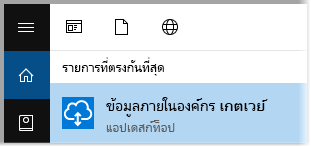
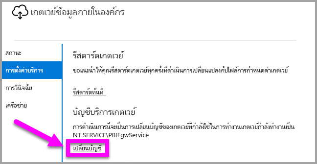

# <a name="use-kerberos-for-single-sign-on-sso-from-power-bi-to-on-premises-data-sources"></a>ใช้ Kerberos สำหรับลงชื่อเข้าใช้ครั้งเดียว (SSO) จาก Power BI ไปยังแหล่งข้อมูลภายในองค์กร

ใช้ [การมอบหมายที่มีข้อจำกัดของ Kerberos](/windows-server/security/kerberos/kerberos-constrained-delegation-overview) เพื่อเปิดใช้งานการเชื่อมต่อการลงชื่อเข้าใช้ครั้งเดียวแบบไร้ร้อยต่อ เปิดใช้งาน SSO สำหรับรายงาน Power BI และแดชบอร์ดเพื่อรีเฟรชข้อมูลจากแหล่งข้อมูลภายในองค์กรอย่างง่ายดาย

## <a name="supported-data-sources"></a>แหล่งข้อมูลที่ได้รับการสนับสนุน

ขณะนี้เราสนับสนุนแหล่งข้อมูลต่อไปนี้:

* SQL Server
* SAP HANA
* SAP BW
* Teradata
* Spark
* Impala

เรายังสนับสนุน SAP HANA ด้วย [Security Assertion Markup Language (SAML)](service-gateway-sso-saml.md)

### <a name="sap-hana"></a>SAP HANA

เพื่อเปิดใช้งาน SSO สำหรับ SAP HANA ให้ทำตามขั้นตอนต่อไปนี้ก่อน:

* ตรวจสอบให้แน่ใจว่า เซิร์ฟเวอร์ SAP HANA ทำงานด้วยเวอร์ชันขั้นต่ำ ซึ่งขึ้นอยู่กับระดับเซิร์ฟเวอร์แพลตฟอร์ม SAP Hana ของคุณ:
  * [HANA 2 SPS 01 Rev 012.03](https://launchpad.support.sap.com/#/notes/2557386)
  * [HANA 2 SPS 02 Rev 22](https://launchpad.support.sap.com/#/notes/2547324)
  * [HANA 1 SP 12 Rev 122.13](https://launchpad.support.sap.com/#/notes/2528439)
* บนเครื่องเกตเวย์ ติดตั้งโปรแกรมควบคุม HANA ODBC ล่าสุดของ SAP  เวอร์ชันขั้นต่ำคือ HANA ODBC เวอร์ชัน 2.00.020.00 ที่ออกเดือน สิงหาคม 2017

สำหรับข้อมูลเพิ่มเติมเกี่ยวกับการตั้งค่าและกำหนดค่าการลงชื่อเข้าระบบครั้งเดียวสำหรับ SAP HANA โดยใช้ Kerberos ดูที่หัวข้อ[การลงชื่อเข้าระบบครั้งเดียวโดยใช้ Kerberos](https://help.sap.com/viewer/b3ee5778bc2e4a089d3299b82ec762a7/2.0.03/en-US/1885fad82df943c2a1974f5da0eed66d.html) ในคู่มือความปลอดภัยของ SAP HANA และการเชื่อมโยงจากหน้านั้น โดยเฉพาะอย่างยิ่ง SAP Note 1837331 – HOWTO HANA DBSSO Kerberos/Active Directory]

## <a name="preparing-for-kerberos-constrained-delegation"></a>การเตรียม การมอบหมายที่มีข้อจำกัดของ Kerberos

จะต้องกำหนดค่าหลายรายการ เพื่อให้การมอบหมายที่มีข้อจำกัดของ Kerberos ทำงานได้อย่างถูกต้อง ซึ่งรวมถึง*ชื่อบริการหลัก* (SPN) และการตั้งค่าการรับมอบสิทธิ์บนบัญชีบริการ

### <a name="prerequisite-1-install--configure-the-on-premises-data-gateway"></a>ข้อกำหนดเบื้องต้น 1: ติดตั้งและกำหนดค่าเกตเวย์ข้อมูลภายในองค์กร

เกตเวย์ข้อมูลในองค์กร รุ่นนี้รองรับการอัปเกรดแบบแทนที่ ตลอดจนการแทนที่ค่าที่ตั้งไว้ของเกตเวย์เดิม

### <a name="prerequisite-2-run-the-gateway-windows-service-as-a-domain-account"></a>ข้อกำหนดเบื้องต้น 2: เรียกใช้บริการ Windows ของเกตเวย์ด้วยบัญชีโดเมน

ในการติดตั้งแบบมาตรฐาน เกตเวย์จะทำงานด้วยบัญชีบริการภายในเครื่อง (ซึ่งก็คือ *NT Service\PBIEgwService*) เช่นที่แสดงในรูปต่อไปนี้:


จะเปิดใช้งาน **การมอบหมายที่มีข้อจำกัดของ Kerberos** เกตเวย์ต้องดำเนินงานด้วยบัญชีโดเมน เว้นแต่ว่า Azure AD ของคุณได้ซิงโครไนซ์กับ Active Directory ของคุณในเครื่องอยู่แล้ว (ด้วย Azure AD DirSync/Connect) ถ้าคุณต้องการสลับบัญชีไปเป็นบัญชีโดเมน โปรดดู[ การสลับเกตเวย์ไปยังบัญชีโดเมน](#switching-the-gateway-to-a-domain-account) ภายหลังในบทความนี้

> [!NOTE]
> ถ้ามีการกำหนดค่าของ Azure AD DirSync / Connect และบัญชีผู้ใช้มีการซิงโครไนซ์ บริการเกตเวย์ก็ไม่ต้องดำเนินการค้นหา AD ในเครื่องระหว่างที่ทำงาน และคุณสามารถใช้ SID ของบริการในเครื่อง (แทนที่จะต้องใช้บัญชีโดเมน) สำหรับบริการเกตเวย์ ขั้นตอนการกำหนดค่าการมอบหมายที่มีข้อจำกัดของ Kerberos ที่แสดงในบทความนี้จะเหมือนกับการกำหนดค่านั้น (จะใช้กับวัตถุคอมพิวเตอร์ของเกตเวย์ใน Active Directory แทนที่จะใช้บัญชีโดเมน)

### <a name="prerequisite-3-have-domain-admin-rights-to-configure-spns-setspn-and-kerberos-constrained-delegation-settings"></a>ข้อกำหนดเบื้องต้น 3: มีสิทธิ์ผู้ดูแลระบบโดเมนเพื่อกำหนดค่า SPN (SetSPN) และการตั้งค่าการมอบหมายที่มีข้อจำกัดของ Kerberos

ถึงแม้ว่า ผู้ดูแลโดเมน สามารถให้บุคคลอื่น มีสิทธิ์กำหนดค่า SPN และการมอบหมายของ Kerberos เป็นการชั่วคราวหรือถาวรได้ โดยไม่ต้องได้สิทธิ์ของผู้ดูแลโดเมน แต่เป็นวิธีที่ไม่แนะนำ ในส่วนต่อไปนี้ เราจะแสดงขั้นตอนที่จำเป็นในการกำหนดค่าตาม **ข้อกำหนดเบื้องต้น 3** โดยละเอียด

## <a name="configuring-kerberos-constrained-delegation-for-the-gateway-and-data-source"></a>กำหนดค่า การมอบหมายที่มีข้อจำกัดของ Kerberos สำหรับเกตเวย์และแหล่งข้อมูล

ในการกำหนดค่าระบบที่ถูกต้อง เราต้องกำหนดค่า หรือการตรวจสอบ สองเรื่องต่อไปนี้:

1. ถ้าจำเป็น ให้กำหนดค่า SPN สำหรับบัญชีโดเมนของบริการเกตเวย์

2. กำหนดค่า การรับมอบสิทธิ์ ในบัญชีโดเมนของบริการเกตเวย์

โปรดทราบว่า คุณต้องเป็นผู้ดูแลโดเมน ถึงจะทำสองขั้นตอนนี้ได้

ส่วนต่อไปนี้ จะอธิบายขั้นแต่ละขั้นตอนตามลำดับ

### <a name="configure-an-spn-for-the-gateway-service-account"></a>กำหนดค่าการ SPN สำหรับบัญชีของบริการเกตเวย์

ขั้นแรก ตรวจสอบว่ามีการสร้าง SPN สำหรับบัญชีโดเมน ที่จะใช้เป็นบัญชีของบริการเกตเวย์ ไว้แล้วหรือไม่ โดยทำตามขั้นตอนเหล่านี้:

1. ในฐานะผู้ดูแลโดเมน ให้เรียกใช้งาน **Active Directory Users and Computers**

2. คลิกขวาบนโดเมน เลือก **ค้นหา** และพิมพ์ชื่อบัญชีผู้ใช้ของบัญชีบริการเกตเวย์

3. ในผลลัพธ์การค้นหา คลิกขวาบนบัญชีบริการเกตเวย์ แล้วเลือก **คุณสมบัติ**

4. ถ้าเห็นแท็บ**การรับมอบสิทธิ์** ในกล่องโต้ตอบ**คุณสมบัติ** แสดงว่า SPN ได้ถูกสร้างขึ้นแล้ว และคุณสามารถข้ามไปยังหัวข้อย่อยถัดไปเรื่อง การกำหนดค่าการรับมอบสิทธิ์

    ถ้าไม่มีแท็บ**การรับมอบสิทธิ์** ในกล่องโต้ตอบ**คุณสมบัติ** คุณจะต้องสร้าง SPN บนบัญชีผู้ใช้นั้น ซึ่งซึ่งจะเพิ่มแท็บ**การรับมอบสิทธิ์** (ซึ่งเป็นวิธีง่ายที่สุดในการ กำหนดค่าการรับมอบสิทธิ์) การสร้าง SPN สามารถทำได้โดยใช้[เครื่องมือ setspn](https://technet.microsoft.com/library/cc731241.aspx)ที่มาพร้อมกับ Windows (คุณต้องมีสิทธิ์ผู้ดูแลโดเมนในการสร้าง SPN)

    ยกตัวอย่าง สมมุติว่า บัญชีของบริการเกตเวย์คือ "PBIEgwTest\GatewaySvc" และเครื่องที่บริการเกตเวย์ทำงานชื่อว่า **Machine1** เพื่อตั้งค่า SPN สำหรับบัญชีบริการเกตเวย์ สำหรับคอมพิวเตอร์ในตัวอย่าง คุณจะเรียกใช้คำสั่งต่อไปนี้:

    

    เมื่อเสร็จขั้นตอนนี้ เราจะไปกำหนดค่าการรับมอบสิทธิ์กันต่อ

### <a name="configure-delegation-settings-on-the-gateway-service-account"></a>กำหนดค่า การรับมอบสิทธิ์ ในบัญชีโดเมนของบริการเกตเวย์

สิ่งที่ต้องกำหนดค่าอย่างที่สองคือ การตั้งค่าการรับมอบสิทธิ์ในบัญชีผู้ใช้บริการเกตเวย์ มีเครื่องมือหลายตัวที่คุณสามารถใช้เพื่อดำเนินการขั้นตอนเหล่านี้ ในบทความนี้ เราจะใช **้ผู้ใช้และคอมพิวเตอร์ Active Directory** ซึ่งเป็นสแนปอิน Microsoft Management Console (MMC) ที่คุณใช้จัดการและเผยแพร่ข้อมูลในไดเรกทอรี ซึ่งปกติติดตั้งอยู่ในตัวควบคุมโดเมนอยู่แล้ว สำหรับคอมพิวเตอร์เครื่องอื่น ๆ คุณสามารถเปิดใช้งานผ่าน **คุณลักษณะของ Windows**

เราจำเป็นต้องกำหนดค่า**การมอบหมายที่มีข้อจำกัดของ Kerberos** ที่มีการเปลี่ยนโพรโทคอล สำหรับการรับมอบสิทธิ์ที่บังคับ คุณต้องมีความชัดเจนว่าบริการใดที่คุณต้องการมอบหมาย ตัวอย่างเช่น เฉพาะ SQL Server หรือเซิร์ฟเวอร์ SAP HANA ของคุณเท่านั้นที่จะยอมรับการเรียกรับสิทธิ์จากบัญชีบริการเกตเวย์

ในส่วนนี้ถือว่า คุณได้กำหนดค่า SPN สำหรับแหล่งข้อมูลพื้นฐานของคุณ (เช่น SQL Server, SAP HANA, Teradata, Spark และอื่นๆ) เอาไว้แล้ว ถ้าต้องการเรียนรู้วิธีการกำหนดค่า SPN ของเซิร์ฟเวอร์แหล่งข้อมูลเหล่านั้น โปรดดูคู่มือทางเทคนิคสำหรับเซิร์ฟเวอร์ฐานข้อมูลที่เกี่ยวข้อง คุณยังสามารถดูโพสต์ในบล็อกที่อธิบาย [ *SPN อะไรบ้างที่จำเป็นสำหรับแอปของคุณ?*](https://blogs.msdn.microsoft.com/psssql/2010/06/23/my-kerberos-checklist/)

ในขั้นตอนต่อไป เราจะสมมติสภาพแวดล้อมในองค์กรที่มีสองเครื่องคือ เครื่องเกตเวย์และเซิร์ฟเวอร์ฐานข้อมูลที่ทำงานบน SQL Server เพื่อใช้ตัวอย่างนี้ เราจะสมมติการตั้งค่าและชื่อต่อไปนี้:

* ชื่อเครื่องเกตเวย์: **PBIEgwTestGW**
* บัญชีบริการเกตเวย์: **PBIEgwTest\GatewaySvc** (ชื่อที่แสดงบัญชี: ตัวเชื่อมต่อเกตเวย์)
* ชื่อเครื่องแหล่งข้อมูล SQL Server: **PBIEgwTestSQL**
* บัญชีบริการแหล่งข้อมูล SQL Server: **PBIEgwTest\SQLService**

จากตัวอย่างชื่อและการตั้งค่าที่ให้มา ขั้นตอนในการกำหนดค่ามีดังต่อไปนี้:

1. ด้วยสิทธิ์ระดับผู้ดูแลโดเมน เรียกใช้ **ผู้ใช้และคอมพิวเตอร์ Active Directory**

2. คลิกขวาบนบัญชีบริการเกตเวย์ (**PBIEgwTest\GatewaySvc**) แล้วเลือก **คุณสมบัติ**

3. เลือกแท็บ **การรับมอบสิทธิ์**

4. เลือก **เชื่อถือคอมพิวเตอร์เครื่องนี้สำหรับการรับมอบสิทธิ์ไปยังบริการที่ระบุเท่านั้น**

5. เลือก**ใช้โพรโทคอลรับรองความถูกต้องใดก็ได้**

6. ภายใต้**บริการที่บัญชีผู้ใช้นี้สามารถใช้ข้อมูลประจำตัวที่ได้รับมอบหมาย:** เลือก**เพิ่ม**

7. ในกล่องโต้ตอบใหม่ เลือก **ผู้ใช้หรือคอมพิวเตอร์**

8. ใส่บัญชีบริการ สำหรับบริการฐานข้อมูล SQL Server (**PBIEgwTest\SQLService**) แล้วเลือก**ตกลง**

9. เลือก SPN ที่คุณสร้างขึ้นสำหรับเซิร์ฟเวอร์ฐานข้อมูล ในตัวอย่างของเรา SPN จะเริ่มต้นด้วย**MSSQLSvc** ถ้าคุณเพิ่มทั้ง FQDN และ NetBIOS SPN สำหรับบริการฐานข้อมูลของคุณ ให้เลือกทั้งสองอย่าง คุณอาจเห็นแค่อย่างเดียวเท่านั้น

10. เลือก**ตกลง** คุณควรเห็น SPN ในรายการแล้วตอนนี้

11. หรือ คุณอาจเลือก **ขยาย** เพื่อแสดงทั้ง FQDN และ NetBIOS SPN

12. กล่องโต้ตอบจะมีลักษณะคล้ายกับข้อความต่อไปนี้หากคุณเลือก **ขยาย** เลือก**ตกลง**

    

สุดท้าย บนเครื่องที่มีบริการเกตเวย์ทำงาน (**PBIEgwTestGW**ในตัวอย่างของเรา) คุณต้องให้นโยบาย "เลียนแบบไคลเอ็นต์หลังจากการรับรองความถูกต้อง" กับบัญชีของบริการเกตเวย์ คุณสามารถกำหนด/ตรวจสอบด้วย ตัวแก้ไขนโยบายกลุ่มภายใน (**gpedit**) ได้

1. บนเครื่องเกตเวย์ เรียกใช้: *gpedit.msc*

1. ไปยัง **นโยบายคอมพิวเตอร์ภายใน > การกำหนดค่าคอมพิวเตอร์ > การตั้งค่า Windows > การตั้งค่าความปลอดภัย > นโยบายภายใน > การกำหนดสิทธิ์ของผู้ใช้** ดังที่แสดงในรูปต่อไปนี้

    

1. จากรายการของนโยบายภายใต้ **การกำหนดสิทธิ์ของผู้ใช้** เลือก**เลียนแบบไคลเอ็นต์หลังจากการรับรองความถูกต้อง**

    

    คลิกขวา และเปิดตัว**คุณสมบัติ**สำหรับ**เลียนแบบไคลเอ็นต์หลังจากการรับรองความถูกต้อง** และตรวจสอบรายการบัญชีผู้ใช้ จะต้องมีบัญชีผู้ใช้บริการเกตเวย์ (**PBIEgwTest\GatewaySvc**) แสดงอยู่ข้างใน

1. จากรายการของนโยบายภายใต้**การกำหนดสิทธิ์ของผู้ใช้** เลือก**ทำหน้าที่เป็นส่วนหนึ่งของระบบปฏิบัติการ (SeTcbPrivilege)** ให้แน่ใจว่า บัญชีบริการเกตเวย์รวมอยู่ในรายการของบัญชีผู้ใช้นี้เช่นกัน

1. รีสตาร์ต **เกตเวย์ข้อมูลในองค์กร**

หากคุณกำลังใช้ SAP HANA เราขอแนะนำให้ปฏิบัติตามขั้นตอนต่อไปนี้ซึ่งอาจทำให้การปรับปรุงประสิทธิภาพน้อยลง

1. ในไดเรกทอรีการติดตั้งเกตเวย์ ค้นหาและเปิดไฟล์ที่มีการกำหนดค่าตามนี้: *Microsoft.PowerBI.DataMovement.Pipeline.GatewayCore.dll.config*.

1. ค้นหาคุณสมบัติ *FullDomainResolutionEnabled* และเปลี่ยนค่าเป็น *จริง*

    ```xml
    <setting name=" FullDomainResolutionEnabled " serializeAs="String">
          <value>True</value>
    </setting>
    ```

## <a name="running-a-power-bi-report"></a>การเรียกใช้รายงาน Power BI

หลังจากเสร็จขั้นตอนการกำหนดค่าที่อธิบายไว้ก่อนหน้านี้ในบทความนี้แล้ว คุณสามารถใช้หน้า **จัดการเกตเวย์** ใน Power BI เพื่อกำหนดค่าแหล่งข้อมูล จากนั้น ภายใน **การตั้งค่าขั้นสูง** เปิดใช้งาน SSO จากนั้นก็เผยแพร่รายงานและชุดข้อมูลที่ผูกกับแหล่งข้อมูลนั้น


การกำหนดค่านี้ใช้ได้ในกรณีส่วนใหญ่ อย่างไรก็ตาม การใช้งานกับ Kerberos อาจต้องมีการตั้งค่าที่แตกต่างกันออกไป ขึ้นอยู่กับสภาพแวดล้อมของคุณ ถ้ายังไม่สามารถโหลดรายงานได้ คุณต้องติดต่อผู้ดูแลโดเมนของคุณเพื่อตรวจสอบเพิ่มเติม

## <a name="switching-the-gateway-to-a-domain-account"></a>การสลับเกตเวย์ไปยังบัญชีโดเมน

ก่อนหน้านี้ในบทความ เราได้กล่าวถึงการสลับเกตเวย์จากบัญชีบริการภายในเครื่อง ให้เรียกใช้จากบัญชีโดเมนแทน โดยใช้ ส่วนติดต่อผู้ใช้ของ**เกตเวย์ข้อมูลภายในองค์กร** นี่คือขั้นตอนที่ต้องทำ

1. เปิดใช้เครื่องมือการกำหนดค่าของ **เกตเวย์ข้อมูลภายในองค์กร**

   

2. เลือกปุ่ม**ลงชื่อเข้าใช้**บนหน้าหลัก และลงชื่อเข้าใช้ ด้วยบัญชี Power BI ของคุณ

3. หลังจากลงชื่อเข้าใช้เสร็จสมบูรณ์ เลือกแท็บ**การตั้งค่าบริการ**

4. เลือก **เปลี่ยนบัญชี** เพื่อเริ่มต้นตรวจดูรายละอียดที่แนะนำโดยทำตามภาพต่อไปนี้

   

## <a name="configuring-sap-bw-for-sso"></a>การกำหนดค่า SAP BW สำหรับ SSO

เมื่อคุณเข้าใจว่า Kerberos ทำงานร่วมกับเกตเวย์อย่างไร คุณสามารถกำหนดค่า SSO สำหรับ SAP Business Warehouse (SAP BW) ได้ ขั้นตอนต่อไปนี้ถือว่าคุณได้ [เตรียมพร้อมสำหรับการมอบหมายที่มีข้อจำกัดของ Kerberos](#preparing-for-kerberos-constrained-delegation) เรียบร้อยแล้วตามที่อธิบายไว้ก่อนหน้าในบทความนี้

คู่มือนี้จะพยายามครอบคลุมให้ได้มากที่สุด ถ้าคุณได้ทำขั้นตอนบางขั้นเสร็จสิ้นไปแล้ว คุณอาจข้ามขั้นตอนเหล่านั้นไปได้: ยกตัวอย่างเช่น คุณได้สร้างผู้ใช้ของบริการสำหรับเซิร์ฟเวอร์ BW และได้แมป SN ไว้แล้ว หรือคุณได้ติดตั้งไลบรารี gsskrb5 แล้ว

### <a name="setup-gsskrb5-on-client-machines-and-the-bw-server"></a>ตั้งค่า gsskrb5 ในเครื่องไคลเอ็นต์และเซิร์ฟเวอร์ BW

ต้องมีการใช้ gsskrb5 ทั้งในไคลเอ็นต์และในเซิร์ฟเวอร์เพื่อเสร็จสิ้นการเชื่อมต่อ SSO ผ่านเกตเวย์ Common Crypto Library (sapcrypto) ยังไม่รองรับในขณะนี้

1. ดาวน์โหลด gsskrb5/gx64krb5 จาก [SAP Note 2115486](https://launchpad.support.sap.com/) (ต้องใช้ SAP s-user) ตรวจสอบให้แน่ใจว่าคุณมี gsskrb5.dll และ gx64krb5.dll เวอร์ชัน 1.0.11.x เป็นอย่างน้อย

1. วางไลบรารีไว้ในตำแหน่งบนเครื่องเกตเวย์ของคุณซึ่งสามารถเข้าถึงได้โดยอินสแตนซ์ของเกตเวย์ (และโดย SAP GUI ถ้าคุณต้องการทดสอบการเชื่อมต่อ SSO โดยใช้ SAP GUI / Logon)

1. ใส่สำเนาอื่นในเครื่องเซิร์ฟเวอร์ BW ของคุณในตำแหน่งที่เข้าถึงได้โดยเซิร์ฟเวอร์ BW

1. บนเครื่องไคลเอ็นต์และเซิร์ฟเวอร์ ให้ตั้งค่าตัวแปรสภาพแวดล้อม SNC\_LIB และ SNC\_LIB\_64 ไปเป็นตำแหน่งที่ตั้งของ gsskrb5.dll และ gx64krb5.dll ตามลำดับ

### <a name="create-a-bw-service-user-and-enable-snc-communication-using-gsskrb5-on-the-bw-server"></a>สร้างผู้ใช้ของบริการ BW และเปิดใช้งานการสื่อสาร SNC โดยใช้ gsskrb5 บนเซิร์ฟเวอร์ BW

นอกเหนือจากการกำหนดค่าเกตเวย์ที่คุณได้ดำเนินการแล้ว ยังมีขั้นตอนเพิ่มเติมเกี่ยวกับ SAP BW อีกนิดหน่อย [**กำหนดการตั้งค่าการรับมอบสิทธิ์สำหรับบัญชีบริการเกตเวย์**](#configure-delegation-settings-on-the-gateway-service-account) ของเอกสารถือว่าคุณกำหนดค่า SPN สำหรับแหล่งข้อมูลพื้นฐานของคุณไว้แล้ว เพื่อกำหนดค่าสำหรับ SAP BW ให้เสร็จสมบูรณ์:

1. ใน Active Directory Domain Controller ให้สร้างผู้ใช้ของบริการ (เริ่มต้นเป็นเพียงแค่ผู้ใช้ Active Directory ธรรมดา) สำหรับ BW Application Server ของคุณในสภาพแวดล้อม Active Directory ของคุณ จากนั้นให้กำหนด SPN ไปยังผู้ใช้บริการ

    SAP จะแนะนำให้เริ่ม SPN ด้วย SAP/ แต่ก็ต้องสามารถใช้คำนำหน้าอื่นได้ด้วย เช่น HTTP/ สิ่งที่เกิดขึ้นหลังจาก SAP/ ขึ้นอยู่กับคุณ ทางเลือกหนึ่งคือการใช้ชื่อผู้ใช้บริการของเซิร์ฟเวอร์ BW ตัวอย่างเช่น หากคุณสร้าง BWServiceUser@\<DOMAIN\> เป็นผู้ใช้บริการของคุณ คุณสามารถใช้ SPN SAP/BWServiceUser ได้ วิธีหนึ่งในการตั้งค่าการแมป SPN คือคำสั่ง setspn ตัวอย่างเช่น ในการตั้งค่า SPN ให้กับผู้ใช้บริการที่เราเพิ่งสร้างขึ้น คุณจะต้องดำเนินการคำสั่งต่อไปนี้จากหน้าต่าง cmd ในเครื่อง Domain Controller: `setspn -s SAP/ BWServiceUser DOMAIN\ BWServiceUser` สำหรับข้อมูลเพิ่มเติม โปรดดูเอกสารประกอบ SAP BW

1. ให้ผู้ใช้ของบริการเข้าถึงเซิร์ฟเวอร์แอปพลิเคชัน BW:

    1. ในเครื่องเซิร์ฟเวอร์ BW ให้เพิ่มผู้ใช้บริการในกลุ่ม Local Admin สำหรับเซิร์ฟเวอร์ BW ของคุณ: เปิดโปรแกรม Computer Management และดับเบิลคลิกที่กลุ่ม Local Admin สำหรับเซิร์ฟเวอร์ของคุณ

        

    1. ดับเบิลคลิกที่กลุ่ม Local Admin แล้วเลือก **เพิ่ม** เพื่อเพิ่มผู้ใช้บริการ BW ของคุณไปยังกลุ่ม ใช้ปุ่ม **ตรวจสอบชื่อ** เพื่อให้แน่ใจว่าคุณพิมพ์ชื่อถูกต้อง เลือก**ตกลง**

1. ตั้งค่าผู้ใช้บริการเซิร์ฟเวอร์ BW เป็นผู้ใช้ที่เริ่มต้นบริการเซิร์ฟเวอร์ BW บนเครื่องเซิร์ฟเวอร์ BW

    1. เปิดโปรแกรม "เรียกใช้" และพิมพ์ "Services.msc" ค้นหาบริการที่ตรงกับอินสแตนซ์ BW Application Server ของคุณ: คลิกขวา แล้วเลือก **คุณสมบัติ**

        

    1. เปลี่ยนไปยังแท็บ **เข้าสู่ระบบ** และเปลี่ยนผู้ใช้เป็นผู้ใช้บริการ BW ตามที่ระบุไว้ด้านบน ใส่รหัสผ่านของผู้ใช้ และเลือก **ตกลง**

1. ลงชื่อเข้าใช้เซิร์ฟเวอร์ของคุณใน SAP GUI / Logon และตั้งค่าพารามิเตอร์โปรไฟล์ต่อไปนี้โดยใช้ทรานแซคชัน RZ10:

    1. ตั้งค่าพารามิเตอร์โปรไฟล์ snc/identity/as เป็น p:\<ผู้ใช้บริการ BW ที่คุณสร้างขึ้น \> เช่น p:BWServiceUser@MYDOMAIN.COM โปรดทราบว่า p: ที่อยู่ข้างหน้า UPN ของผู้ใช้ของบริการ ไม่ใช่ p:CN= อย่างเช่นเมื่อมีการใช้ Common Crypto Lib เป็นไลบรารี SNC

    1. ตั้งค่าพารามิเตอร์โปรไฟล์ snc/gssapi\_lib เพื่อสร้างเส้นทาง \< ไปยัง gsskrb5.dll/gx64krb5.dll บนเครื่องเซิร์ฟเวอร์ (ไลบรารีที่คุณใช้ขึ้นอยู่กับบิตของระบบปฏิบัติการ)\> อย่าลืมใส่ไลบรารีในตำแหน่งที่ BW Application Server สามารถเข้าถึงได้

    1. ตั้งค่าพารามิเตอร์โปรไฟล์เพิ่มเติมต่อไปนี้ โดยเปลี่ยนค่าตามต้องการเพื่อให้เหมาะกับความต้องการของคุณ โปรดทราบว่าตัวเลือกห้าตัวท้ายช่วยให้ไคลเอ็นต์สามารถเชื่อมต่อกับเซิร์ฟเวอร์ BW ได้ด้วย SAP Logon / GUI โดยไม่ต้องกำหนดค่า SNC

        | **การตั้งค่า** | **ค่า** |
        | --- | --- |
        | snc/data\_protection/max | 3 |
        | snc/data\_protection/min | 1 |
        | snc/data\_protection/use | 9 |
        | snc/accept\_insecure\_cpic | 1 |
        | snc/accept\_insecure\_gui | 1 |
        | snc/accept\_insecure\_r3int\_rfc | 1 |
        | snc/accept\_insecure\_rfc | 1 |
        | snc/permit\_insecure\_start | 1 |

    1. ตั้งค่าคุณสมบัติ snc/enable เป็น 1

1. หลังจากตั้งค่าพารามิเตอร์โปรไฟล์เหล่านี้แล้ว ให้เปิด SAP Management Console บนเครื่องเซิร์ฟเวอร์และรีสตาร์ทอินสแตนซ์ BW หากเซิร์ฟเวอร์ไม่เริ่มทำงาน ให้ตรวจสอบอีกครั้งว่าคุณได้ตั้งค่าพารามิเตอร์โปรไฟล์อย่างถูกต้องแล้ว สำหรับข้อมูลเพิ่มเติมเกี่ยวกับการตั้งค่าพารามิเตอร์โปรไฟล์ โปรดดู [เอกสารประกอบ SAP](https://help.sap.com/saphelp_nw70ehp1/helpdata/en/e6/56f466e99a11d1a5b00000e835363f/frameset.htm) นอกจากนี้คุณยังสามารถดูส่วนการแก้ปัญหาของเราได้หากคุณประสบปัญหา

### <a name="map-a-bw-user-to-an-active-directory-user"></a>แมปผู้ใช้ BW ไปยังผู้ใช้ Active Directory

แมปผู้ใช้ Active Directory ไปยังผู้ใช้ SAP BW Application Server และทดสอบการเชื่อมต่อ SSO ใน SAP GUI / Logon

1. ลงชื่อเข้าใช้เซิร์ฟเวอร์ BW โดยใช้ SAP GUI / Logon ดำเนินการทรานแซคชัน SU01

1. สำหรับ **ผู้ใช้** ให้ป้อนผู้ใช้ BW ที่คุณต้องการเปิดใช้งานการเชื่อมต่อ SSO (ในภาพหน้าจอด้านบนที่เรากำลังตั้งค่าสิทธิ์สำหรับ BIUSER) เลือกไอคอน **แก้ไข** ที่ด้านบนซ้ายของหน้าต่าง SAP Logon (ภาพปากกา)

    

1. เลือกแท็บ **SNC** ในช่องใส่ชื่อ SNC ให้ป้อน p:\<ผู้ใช้ active directory ของคุณ\>@\<โดเมนของคุณ\> หมายเหตุ p: ที่เป็นข้อบังคับ ซึ่งต้องนำหน้า UPN ของผู้ใช้ Active Directory ผู้ใช้ Active Directory ที่คุณระบุต้องเป็นบุคคลหรือองค์กรที่คุณต้องการเปิดใช้งาน SSO เพื่อเข้าถึง BW Application Server ตัวอย่างเช่น ถ้าคุณต้องการเปิดใช้การเข้าถึง SSO สำหรับผู้ใช้ [testuser@TESTDOMAIN.COM](mailto:testuser@TESTDOMAIN.COM) ให้ป้อน p:testuser@TESTDOMAIN.COM

    

1. เลือกไอคอนบันทึก (ฟล็อปปี้ดิสก์ใกล้กับมุมซ้ายบนของหน้าจอ)

### <a name="test-sign-in-using-sso"></a>ทดสอบการลงชื่อเข้าใช้ด้วย SSO

ตรวจสอบว่าคุณสามารถลงชื่อเข้าใช้เซิร์ฟเวอร์โดยใช้ SAP Logon / SAP GUI ผ่าน SSO ในฐานะผู้ใช้ Active Directory ที่คุณเพิ่งเปิดใช้งานการเข้าถึง SSO ได้หรือไม่

1. ลงชื่อเข้าใช้เครื่องที่ติดตั้ง SAP Logon *ในฐานะผู้ใช้ Active Directory ที่คุณเพิ่งเปิดใช้งานการเข้าถึง SSO สำหรับ*  และเปิดใช้งาน SAP GUI/Logon สร้างการเชื่อมต่อใหม่

1. ในหน้าต่าง **สร้างรายการระบบใหม่** ให้เลือก **ระบบที่ระบุโดยผู้ใช้** และเลือก **ถัดไป**

    

1. กรอกรายละเอียดที่เหมาะสมในหน้าถัดไป รวมทั้งเซิร์ฟเวอร์แอปพลิเคชัน หมายเลขอินสแตนซ์ และ ID ของระบบ จากนั้นเลือก **เสร็จสิ้น**

1. คลิกขวาที่การเชื่อมต่อใหม่ แล้วเลือก **คุณสมบัติ** เลือกแท็บ **เครือข่าย** ในหน้าต่าง **ชื่อ SNC** ให้ป้อน p:\<UPN ของผู้ใช้ของบริการ BW\> เช่น p:BWServiceUser@MYDOMAIN.COM จากนั้นเลือก **ตกลง**

    

1. ดับเบิลคลิกที่การเชื่อมต่อที่คุณเพิ่งสร้างขึ้นเพื่อลองเชื่อมต่อ SSO ไปยังเซิร์ฟเวอร์ BW หากการเชื่อมต่อนี้ประสบความสำเร็จ ให้ดำเนินการขั้นตอนถัดไป มิเช่นนั้นให้ตรวจสอบขั้นตอนก่อนหน้าในเอกสารนี้เพื่อให้มั่นใจว่าได้ดำเนินการเสร็จสิ้นอย่างถูกต้องแล้ว หรือตรวจสอบส่วนการแก้ปัญหาด้านล่าง โปรดทราบว่าถ้าคุณไม่สามารถเชื่อมต่อกับเซิร์ฟเวอร์ BW ผ่าน SSO ในบริบทนี้ คุณจะไม่สามารถเชื่อมต่อกับเซิร์ฟเวอร์ BW โดยใช้ SSO ในบริบทเกตเวย์ได้

### <a name="troubleshoot-installation-and-connections"></a>แก้ไขปัญหาการติดตั้งและการเชื่อมต่อ

หากคุณพบปัญหาใด ๆ ให้ทำตามขั้นตอนต่อไปนี้เพื่อแก้ปัญหาการติดตั้ง gsskrb5 และการเชื่อมต่อ SSO จาก SAP GUI / Logon

1. การดูไฟล์บันทึกของเซิร์ฟเวอร์ (…work\dev\_w0 บนเครื่องเซิร์ฟเวอร์) จะมีประโยชน์ในการแก้ปัญหาข้อผิดพลาดที่คุณพบในการดำเนินการตามขั้นตอนการตั้งค่า gsskrb5 โดยเฉพาะอย่างยิ่งถ้าเซิร์ฟเวอร์ BW จะไม่เริ่มทำงานหลังจากที่พารามิเตอร์โปรไฟล์ได้รับการเปลี่ยนแปลง

1. หากคุณไม่สามารถเริ่มต้นบริการ BW เนื่องจาก "ความล้มเหลวในการเข้าสู่ระบบ" ที่คุณอาจระบุรหัสผ่านไม่ถูกต้องเมื่อตั้งค่าผู้ใช้ "เริ่มต้นเป็น" สำหรับ BW ตรวจสอบรหัสผ่านโดยการล็อกอินเข้าสู่เครื่องในสภาพแวดล้อม Active Directory ของคุณในฐานะผู้ใช้บริการ BW

1. ถ้าคุณได้รับข้อผิดพลาดเกี่ยวกับข้อมูลประจำตัว SQL ที่ป้องกันไม่ให้เซิร์ฟเวอร์เริ่มทำงาน ให้ตรวจสอบว่าคุณได้ให้สิทธิ์การเข้าถึงฐานข้อมูล BW แก่ผู้ใช้บริการแล้ว

1. "เป้าหมายที่ระบุ (GSS-API) ไม่เป็นที่รู้จักหรือไม่สามารถเข้าถึงได้": โดยปกติแล้วหมายความว่าคุณกำหนดชื่อ SNC ผิด ต้องแน่ใจว่าคุณใช้ "p:" เท่านั้นไม่ใช่ "p:CN=" หรือสิ่งอื่นใดในแอปพลิเคชันฝั่งไคลเอ็นต์นอกเหนือจาก UPN ของผู้ใช้บริการ

1. "(GSS-API) มีชื่อที่ไม่ถูกต้อง": ตรวจสอบว่า "p:" อยู่ในค่าของพารามิเตอร์โปรไฟล์ข้อมูลประจำตัว SNC ของเซิร์ฟเวอร์

1. (ข้อผิดพลาด SNC) ไม่พบโมดูลที่ระบุ": โดยปกติแล้วจะเกิดจากการวางไฟล์ gsskrb5.dll/gx64krb5.dll ในตำแหน่งที่ต้องการสิทธิ์ระดับสูง (สิทธิ์ของผู้ดูแลระบบ) เพื่อเข้าถึง

### <a name="add-registry-entries-to-the-gateway-machine"></a>เพิ่มรายการรีจิสทรีไปยังเครื่องเกตเวย์

เพิ่มรายการรีจิสทรีที่จำเป็นลงในรีจิสทรีของเครื่องที่ติดตั้งเกตเวย์ไว้

1. ดำเนินการคำสั่งต่อไปนี้ในหน้าต่าง cmd:

    1. REG ADD HKLM\SOFTWARE\Wow6432Node\SAP\gsskrb5 /v ForceIniCredOK /t REG\_DWORD /d 1 /f

    1. REG ADD HKLM\SOFTWARE\SAP\gsskrb5 /v ForceIniCredOK /t REG\_DWORD /d 1 /f

### <a name="set-configuration-parameters-on-the-gateway-machine"></a>ตั้งพารามิเตอร์การกำหนดค่าในเครื่องเกตเวย์

มีตัวเลือกในการตั้งค่าพารามิเตอร์การกำหนดค่าอยู่สองตัวเลือก แล้วแต่ว่าคุณได้กำหนดค่า Azure AD DirSync ไว้เพื่อให้ผู้ใช้ลงชื่อเข้าใช้บริการของ Power BI ในฐานะผู้ใช้ Azure Ad ไว้แล้วหรือไม่

ถ้าคุณได้กำหนดค่า Azure AD DirSync ไว้แล้ว ให้ทำตามขั้นตอนเหล่านี้

1. เปิดไฟล์การกำหนดค่าเกตเวย์หลัก *Microsoft.PowerBI.DataMovement.Pipeline.GatewayCore.dll* ตามค่าเริ่มต้น ไฟล์นี้จะถูกเก็บไว้ที่ *C:\Program Files\On-premises data gateway*

1. ยืนยันว่าคุณสมบัติ **FullDomainResolutionEnabled** ตั้งค่าเป็น True และ **SapHanaSsoRemoveDomainEnabled** ตั้งค่าเป็น False

1. บันทึกไฟล์การกำหนดค่า

1. รีสตาร์ทบริการเกตเวย์ใหม่ผ่านทางแท็บบริการของตัวจัดการงาน (คลิกขวา, รีสตาร์ท)

    

ถ้าคุณไม่ได้กำหนดค่า Azure AD DirSync ไว้ ให้ทำตามขั้นตอนเหล่านี้กับ**ผู้ใช้ของบริการ Power BI ทุกรายที่คุณต้องการแมปไปยังผู้ใช้ Azure AD** ขั้นตอนเหล่านี้เชื่อมโยงด้วยตนเองกับผู้ใช้ของบริการ Power BI ไปยังผู้ใช้ Active Directory ที่ได้รับอนุญาตให้ลงชื่อเข้า BW

1. เปิดไฟล์การกำหนดค่าเกตเวย์หลัก Microsoft.PowerBI.DataMovement.Pipeline.GatewayCore.dll ตามค่าเริ่มต้น ไฟล์นี้จะถูกเก็บไว้ที่ C:\Program Files\On-premises data gateway

1. ตั้งค่า **ADUserNameLookupProperty** ไปยัง msDS-cloudExtensionAttribute1 และ **ADUserNameReplacementProperty** ไปยัง SAMAccountName บันทึกไฟล์การกำหนดค่า

1. รีสตาร์ทบริการเกตเวย์ใหม่ผ่านทางแท็บ **Services** ของ Task Manager (คลิกขวา, **Restart**)

    

1. ตั้งค่าคุณสมบัติ msDS-cloudExtensionAttribute1 ของผู้ใช้ Active Directory ที่คุณแมปไปยังผู้ใช้ BW ไปยังผู้ใช้ของบริการ Power BI ที่คุณต้องการให้เปิดใช้ Kerberos SSO วิธีหนึ่งในการตั้งค่าคุณสมบัติ msDS-cloudExtensionAttribute1 คือตั้งค่าผ่านทางสแน็ปอินผู้ใช้ Active Directory Users และ Computers MMC (โปรดทราบว่าสามารถใช้วิธีอื่นได้)

    1. ลงชื่อเข้าใช้เครื่อง Domain Controller ในฐานะผู้ดูแลระบบ

    1. เปิดโฟลเดอร์ **ผู้ใช้** ในหน้าต่างสแนปอินและดับเบิลคลิกที่ผู้ใช้ Active Directory ที่คุณแมปกับผู้ใช้ BW

    1. เลือกแท็บ **ตัวแก้ไขแอตทริบิวต์**

        หากคุณไม่เห็นแท็บนี้ คุณจะต้องค้นหาแนวทางเกี่ยวกับวิธีเปิดใช้งานหรือใช้วิธีอื่นในการตั้งค่าคุณสมบัติ msDS-cloudExtensionAttribute1 เลือกหนึ่งในแอตทริบิวต์จากนั้นคลิกที่ปุ่ม 'm' เพื่อไปยังคุณสมบัติของ Active Directory ที่ขึ้นต้นด้วย 'm' ค้นหาคุณสมบัติ msDS-cloudExtensionAttribute1 และดับเบิลคลิกที่คุณสมบัตินั้น ตั้งค่าให้กับชื่อผู้ใช้ที่คุณใช้ลงชื่อเข้าบริการ Power BI ได้ในแบบฟอร์มYourUser@YourDomain

    1. เลือก**ตกลง**

        

    1. เลือก**นำไปใช้** ตรวจสอบว่ามีการตั้งค่าที่ถูกต้องในคอลัมน์ Value หรือไม่

### <a name="add-a-new-bw-application-server-data-source-to-the-power-bi-service"></a>เพิ่มแหล่งข้อมูล BW Application Server ใหม่ลงในบริการ Power BI

เพิ่มแหล่งข้อมูล BW ลงในเกตเวย์ของคุณ: ทำตามคำแนะนำในบทความนี้ที่ [การเรียกใช้รายงาน](#running-a-power-bi-report)

1. ในหน้าต่างการกำหนดค่าแหล่งข้อมูล ให้ป้อน **ชื่อโฮสต์**, **หมายเลขระบบ** และ **ID ไคลเอ็นต์** ของ Application Server ตามที่คุณต้องการเพื่อลงชื่อเข้าใช้เซิร์ฟเวอร์ BW จาก Power BI Desktop สำหรับ **วิธีการรับรองความถูกต้อง** ให้เลือก **Windows**

1. ในเขตข้อมูล **ชื่อหุ้นส่วน SNC** ใส่ p: \<SPN ที่คุณแมปไปยังผู้ใช้ของบริการ BW\> ตัวอย่างเช่น ถ้า SPN คือ SAP/BWServiceUser@MYDOMAIN.COM คุณควรใส่ p:SAP/BWServiceUser@MYDOMAIN.COM ในเขตข้อมูล **ชื่อหุ้นส่วน SNC**

1. สำหรับไลบรารี SNC ให้เลือก SNC\_LIB หรือ SNC\_LIB\_64

1. **ชื่อผู้ใช้** และ **รหัสผ่าน** ควรเป็นชื่อผู้ใช้และรหัสผ่านของผู้ใช้ Active Directory ที่ได้รับอนุญาตให้ลงชื่อเข้าใช้เซิร์ฟเวอร์ BW ผ่านทาง SSO (ผู้ใช้ Active Directory ที่ถูกแมปไปยังผู้ใช้ BW ผ่านทรานแซคชัน SU01) ข้อมูลประจำตัวเหล่านี้จะถูกใช้เมื่อ*ไม่ได้*ทำเครื่องหมายเลือกบนกล่อง **Use SSO via Kerberos for DirectQuery queries**

1. เลือกกล่อง**ใช้ SSO ผ่าน Kerberos สำหรับคิวรี DirectQuery** แล้วเลือก **ปรับใช้** หากการเชื่อมต่อทดสอบไม่สำเร็จ ให้ตรวจสอบว่าขั้นตอนการตั้งค่าและการกำหนดค่าก่อนหน้าเสร็จสมบูรณ์อย่างถูกต้องหรือไม่

    เกตเวย์จะใช้ข้อมูลประจำตัวแบบพิมพ์เข้าเสมอเพื่อเผยแพร่การทดสอบการเชื่อมต่อไปยังเซิร์ฟเวอร์ และเพื่อทำการรีเฟรชตามกำหนดการของรายงานจากการนำเข้า เกตเวย์จะพยายามเผยแพร่การเชื่อมต่อ SSO ก็ต่อเมื่อมีการเลือก**ใช้ SSO ผ่าน Kerberos สำหรับคิวรี DirectQuery** และผู้ใช้นั้นเข้าถึงรายงานหรือชุดข้อมูลจาก Direct Query

### <a name="test-your-setup"></a>ทดสอบการตั้งค่าของคุณ

เผยแพร่รายงาน DirectQuery จาก Power BI Desktop ไปยังบริการ Power BI เพื่อทดสอบการตั้งค่าของคุณ ตรวจสอบให้แน่ใจว่าคุณได้ลงชื่อเข้าใช้บริการ Power BI ในฐานะผู้ใช้ Azure AD หรือผู้ใช้ที่คุณได้แมปไปยังคุณสมบัติ msDS-cloudExtensionAttribute1 ของผู้ใช้ Azure AD หากการตั้งค่าเสร็จสมบูรณ์ คุณจะสามารถสร้างรายงานตามชุดข้อมูลที่เผยแพร่ในบริการ Power BI และดึงข้อมูลผ่านวิชวลในรายงานได้

### <a name="troubleshooting-gateway-connectivity-issues"></a>แก้ไขปัญหาการเชื่อมต่อเกตเวย์

1. ตรวจสอบไฟล์บันทึกเกตเวย์ เปิดแอปพลิเคชันการกำหนดค่าเกตเวย์ เลือก **การวินิจฉัย** และเลือก **ส่งออกไฟล์บันทึก** ข้อผิดพลาดล่าสุดจะอยู่ที่ด้านล่างของไฟล์บันทึกที่คุณตรวจสอบ

    

1. เปิดการติดตาม BW และตรวจดูไฟล์บันทึกที่สร้างขึ้น มีการติดตาม BW หลายประเภทที่คุณสามารถใช้งานได้ ดูเอกสารประกอบ SAP สำหรับข้อมูลเพิ่มเติม

## <a name="errors-from-an-insufficient-kerberos-configuration"></a>ข้อผิดพลาดจากการกำหนดค่า Kerberos ไม่เพียงพอ

ถ้าเซิร์ฟเวอร์ฐานข้อมูลพื้นฐาน และเกตเวย์ ไม่ได้กำหนดค่าอย่างเหมาะสมสำหรับ**การมอบหมายที่มีข้อจำกัดของ Kerberos** คุณอาจได้รับข้อผิดพลาดต่อไปนี้:


และรายละเอียดทางเทคนิคสำหรับข้อผิดพลาด (DM_GWPipeline_Gateway_ServerUnreachable) อาจเป็นดังต่อไปนี้:


ผลคือเกตเวย์ไม่สามารถเลียนแบบเป็นผู้ที่ใช้งานได้ถูกต้อง ทำให้การเชื่อมต่อฐานข้อมูลล้มเหลว

## <a name="next-steps"></a>ขั้นตอนถัดไป

สำหรับข้อมูลเพิ่มเติมเกี่ยวกับการ**เกตเวย์ข้อมูลในองค์กร**และ **DirectQuery** ลองดูบทความต่อไปนี้:

* [เกตเวย์ข้อมูลภายในองค์กร](service-gateway-onprem.md)
* [DirectQuery ใน Power BI](desktop-directquery-about.md)
* [แหล่งข้อมูลที่สนับสนุนโดย DirectQuery](desktop-directquery-data-sources.md)
* [DirectQuery และ SAP BW](desktop-directquery-sap-bw.md)
* [DirectQuery และ SAP HANA](desktop-directquery-sap-hana.md)