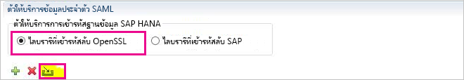
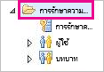
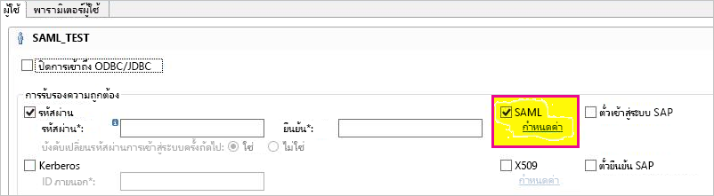
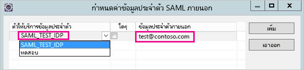
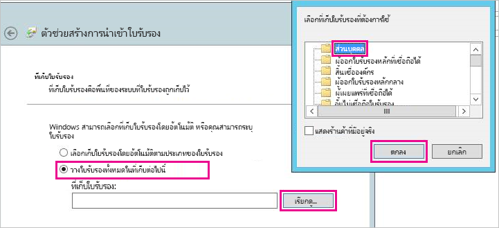
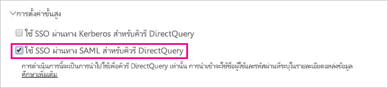

# <a name="use-security-assertion-markup-language-saml-for-sso-from-power-bi-to-on-premises-data-sources"></a>ใช้ Assertion Markup Language (SAML) สำหรับการลงชื่อเข้าระบบครั้งเดียว (SSO) จาก Power BI กับแหล่งข้อมูลภายในองค์กร

ใช้ [Security Assertion Markup Language (SAML)](https://www.onelogin.com/pages/saml) เพื่อเปิดใช้งานการเชื่อมต่อการลงชื่อเข้าใช้ครั้งเดียวแบบไร้ร้อยต่อ การเปิดใช้งาน SSO ทำให้รายงาน Power BI และแดชบอร์ดสามารถรีเฟรชข้อมูลจากแหล่งข้อมูลภายในองค์กรได้อย่างง่ายดาย ในขณะที่ยังเป็นไปตามสิทธิ์ระดับผู้ใช้ที่กำหนดค่าไว้บนแหล่งข้อมูลเหล่านั้น

## <a name="supported-data-sources"></a>แหล่งข้อมูลที่ได้รับการสนับสนุน

ขณะนี้เราสนับสนุน SAP HANA ที่มี SAML สำหรับข้อมูลเพิ่มเติมเกี่ยวกับการตั้งค่าและกำหนดค่าการลงชื่อเข้าใช้ครั้งเดียวสำหรับ SAP HANA โดยใช้ SAML ดูหัวข้อ [SAML SSO for BI Platform to HANA](https://wiki.scn.sap.com/wiki/display/SAPHANA/SAML+SSO+for+BI+Platform+to+HANA) ในเอกสารประกอบ SAP HANA

เราสนับสนุนแหล่งข้อมูลเพิ่มเติม (รวมถึง HANA) ด้วย [Kerberos](service-gateway-sso-kerberos.md)

โปรดทราบว่าสำหรับ HANA นั้นเราขอแนะนำเป็น**อย่างยิ่ง**ให้เปิดใช้การเข้ารหัสก่อนที่จะสร้างการเชื่อมต่อ SAML SSO (นั่นคือคุณควรกำหนดค่าเซิร์ฟเวอร์ HANA เพื่อยอมรับการเชื่อมต่อที่เข้ารหัสและกำหนดค่าเกตเวย์ให้ใช้การเข้ารหัสเมื่อสื่อสารกับเซิร์ฟเวอร์ HANA ของคุณ) ไดรเวอร์ HANA ODBC **ไม่**สามารถเข้ารหัสการยืนยัน SAML โดยค่าเริ่มต้นและไม่มีการเข้ารหัสที่เปิดอยู่ การยืนยัน SAML ที่ลงชื่อแล้วจะถูกส่งจากเกตเวย์ไปยังเซิร์ฟเวอร์ HANA ในลักษณะที่ "ชัดเจน" และเสี่ยงต่อการถูกสกัดกั้นและใช้ซ้ำโดยบุคคลที่สาม ดู[การเปิดใช้งานการเข้ารหัสของ SAP HANA](/power-bi/desktop-sap-hana-encryption) สำหรับคำแนะนำเกี่ยวกับวิธีการเปิดใช้งานการเข้ารหัสสำหรับ HANA โดยใช้ไลบรารี OpenSSL

## <a name="configuring-the-gateway-and-data-source"></a>กำหนดค่าแหล่งข้อมูลและเกตเวย์

หากต้องการใช้ SAML คุณต้องสร้างความสัมพันธ์ที่เชื่อถือได้ระหว่างเซิร์ฟเวอร์ HANA ที่คุณต้องการเปิดใช้งาน SSO และเกตเวย์ซึ่งทำหน้าที่เป็น SAML Identity Provider (IdP) ในสถานการณ์สมมตินี้ มีแนวทางมากมายในการสร้างความสัมพันธ์นี้ เช่น การนำเข้าใบรับรอง x509 ของ Gateway IdP ไปยังร้านค้าที่เชื่อถือได้ของเซิร์ฟเวอร์ HANA หรือโดยการมีใบรับรอง X509 ของเกตเวย์ที่ลงนามโดยผู้ให้บริการออกใบรับรองลำดับชั้นบนสุด (CA) ที่เซิร์ฟเวอร์ HANA เชื่อถือ) เราอธิบายแนวทางถัดมาในคู่มือนี้ แต่คุณอาจใช้วิธีการอื่นหากสะดวกกว่า

โปรดทราบว่าในขณะที่คู่มือนี้ใช้ OpenSSL เป็นผู้ให้บริการเข้ารหัสของเซิร์ฟเวอร์ HANA แต่ทว่า SAP ได้แนะนำให้ใช้ SAP Cryptographic Library (หรือที่เรียกว่า CommonCryptoLib หรือ sapcrypto) แทน OpenSSL เพื่อทำตามขั้นตอนการตั้งค่าที่เชื่อถือได้ โปรดดูเอกสารประกอบ SAP อย่างเป็นทางการสำหรับข้อมูลเพิ่มเติม

ขั้นตอนต่อไปนี้อธิบายวิธีการสร้างความสัมพันธ์ที่เชื่อถือได้ระหว่างเซิร์ฟเวอร์ HANA และ Gateway IdP โดยการลงนามใบรับรอง X509 ของ Gateway IdP โดยใช้ CA ลำดับชั้นบนสุดที่เซิร์ฟเวอร์ HANA เชื่อถือ คุณจะสร้าง Root CA นี้

1. สร้างใบรับรอง X509 และกุญแจส่วนตัวของ CA ลำดับชั้นบนสุด ตัวอย่างเช่น ในการสร้างใบรับรอง X509 และกุญแจส่วนตัวของ CA ลำดับชั้นบนสุดในรูปแบบ .pem:

   ```
   openssl req -new -x509 -newkey rsa:2048 -days 3650 -sha256 -keyout CA_Key.pem -out CA_Cert.pem -extensions v3_ca
   ```

    ตรวจสอบให้แน่ใจว่ากุญแจส่วนตัวของ CA ลำดับชั้นบนสุดได้รับการรักษาความปลอดภัยอย่างถูกต้อง - ถ้าบุคคลที่สามได้รับซึ่งสามารถใช้เพื่อเข้าถึงเซิร์ฟเวอร์ HANA ได้โดยไม่ได้รับอนุญาต

    เพิ่มใบรับรอง (ตัวอย่างเช่น CA_Cert.pem) ไปยัง Trust Store ของเซิร์ฟเวอร์ HANA เพื่อให้เซิร์ฟเวอร์ HANA เชื่อถือใบรับรองที่ลงนามโดย CA ลำดับชั้นบนสุดที่คุณเพิ่งสร้างขึ้น คุณสามารถพบที่ตั้งของ Trust Store ของเซิร์ฟเวอร์ HANA ได้โดยตรวจสอกการกำหนดค่า **ssltruststore** หากคุณได้ปฏิบัติตามเอกสาร SAP ที่ครอบคลุมถึงวิธีการกำหนดค่า OpenSSL เซิร์ฟเวอร์ HANA ของคุณอาจไว้วางใจ CA ลำดับชั้นบนสุดของคุณที่สามารถนำมาใช้ซ้ำได้ ดูที่ [วิธีการกำหนดค่า Open SSL สำหรับ SAP HANA Studio กับเซิร์ฟเวอร์ SAP HANA](https://archive.sap.com/documents/docs/DOC-39571) สำหรับรายละเอียด หากคุณมีเซิร์ฟเวอร์ HANA หลายตัวที่คุณต้องการเปิดใช้งาน SAML SSO สำหรับตรวจสอบให้แน่ใจว่าแต่ละเซิร์ฟเวอร์เชื่อถือ CA ลำดับชั้นบนสุดนี้

1. สร้างใบรับรอง X509 ของ Gateway IdP ตัวอย่างเช่น ในการสร้างการร้องขอการลงนามใบรับรอง (IdP_Req.pem) และกุญแจส่วนตัว (IdP_Key.pem) ที่ถูกต้องสำหรับหนึ่งปี ให้รันคำสั่งต่อไปนี้:

   ```
   openssl req -newkey rsa:2048 -days 365 -sha256 -keyout IdP_Key.pem -out IdP_Req.pem -nodes
   ```

   ลงนามการสร้างการร้องขอการลงนามใบรับรองโดยใช้ CA ลำดับชั้นบนสุดที่คุณกำหนดค่าเซิร์ฟเวอร์ HANA ของคุณให้เชื่อถือ ตัวอย่างเช่น เมื่อต้องการลงนาม IdP_Req.pem โดยใช้ CA_Cert.pem และ CA_Key.pem (ใบรับรองและกุญแจของ CA ลำดับชั้นบนสุด) ให้รันคำสั่งต่อไปนี้:

   ```
   openssl x509 -req -days 365 -in IdP_Req.pem -sha256 -extensions usr_cert -CA CA_Cert.pem -CAkey CA_Key.pem -CAcreateserial -out IdP_Cert.pem
   ```

ใบรับรอง IdP ที่เกิดขึ้นจะมีผลเป็นเวลาหนึ่งปี (ดูตัวเลือก - วัน) ขณะนี้ให้นำเข้าใบรับรองของ IdP ใน HANA Studio เพื่อสร้าง SAML Identity Provider ใหม่

1. ใน SAP HANA Studio คลิกขวาที่เซิร์ฟเวอร์ SAP HANA จากนั้นไปที่ **การรักษาความปลอดภัย** &gt; **เปิดคอนโซลการรักษาความปลอดภัย** &gt; **ตัวให้บริการข้อมูลประจำตัว SAML** &gt; **ไลบรารีเข้ารหัสลับ OpenSSL**

    

1. เลือก **นำเข้า** ไปที่ IdP_Cert.pem แล้วนำเข้า

1. ใน SAP HANA Studio ให้เลือกโฟลเดอร์ **การรักษาความปลอดภัย**

    

1. ขยาย **ผู้ใช้** จากนั้นเลือกผู้ใช้ที่คุณต้องการแมปไปยังผู้ใช้ Power BI

1. เลือก **SAML** แล้ว **กำหนดค่า**

    

1. เลือกตัวให้บริการข้อมูลประจำตัวที่คุณสร้างในขั้นตอนที่ 2 สำหรับ**ข้อมูลประจำตัวภายนอก** ให้ใส่ UPN ของผู้ใช้ Power BI (ซึ่งก็คืออีเมลแอดเดรสที่ผู้ใช้เข้าสู่ระบบ Power BI) จากนั้นเลือก**เพิ่ม** โปรดทราบว่าถ้าคุณได้กำหนดค่าเกตเวย์ของคุณให้ใช้ตัวเลือกการกำหนดค่า *ADUserNameReplacementProperty* คุณควรป้อนค่าที่จะแทนที่ UPN เดิมของผู้ใช้ Power BI ตัวอย่างเช่น ถ้าคุณตั้ง*ค่า* ADUserNameReplacementProperty **เป็น** SAMAccountName คุณควรป้อน **SAMAccountName** ของผู้ใช้

    

เมื่อคุณมีใบรับรองและข้อมูลประจำตัวของเกตเวย์ที่กำหนดค่าแล้ว คุณจะต้องแปลงใบรับรองเป็นรูปแบบ pfx และกำหนดค่าเกตเวย์เพื่อใช้ใบรับรอง

1. แปลงใบรับรองเป็นรูปแบบ pfx โดยเรียกใช้คำสั่งต่อไปนี้ โปรดทราบว่าคำสั่งนี้ตั้งชื่อไฟล์ผลลัพธ์ .pfx file samlcert.pfx และกำหนดให้ "root" เป็นรหัสผ่าน

    ```
    openssl pkcs12 -export -out samltest.pfx -in IdP_Cert.pem -inkey IdP_Key.pem -passin pass:root -passout pass:root
    ```

1. คัดลอกไฟล์ pfx ไปยังเครื่องเกตเวย์:

    1. ดับเบิลคลิกที่ samltest.pfx จากนั้นเลือก **เครื่องเฉพาะที่** &gt; **ถัดไป**

    1. ป้อนรหัสผ่าน จาก นั้นเลือก **ถัดไป**

    1. เลือก **วางใบรับรองทั้งหมดในที่เก็บต่อไปนี้** จากนั้น **เรียกดู** &gt; **ส่วนบุคคล** &gt; **ตกลง**

    1. เลือก **ถัดไป** แล้ว **เสร็จสิ้น**

    

1. กำหนดสิทธิ์การเข้าถึงบัญชีบริการเกตเวย์ให้กับคีย์ส่วนตัวของใบรับรอง:

    1. ในเครื่องเกตเวย์ ให้เรียกใช้งาน Microsoft Management Console (MMC)

        

    1. ภายใต้ **ไฟล์** เลือก **เพิ่ม/ลบสแน็ปอิน**

        

    1. เลือก **ใบรับรอง** &gt; **เพิ่ม** จากนั้นจึงเลือก **บัญชีคอมพิวเตอร์** &gt; **ถัดไป**

    1. เลือก **คอมพิวเตอร์เฉพาะที่** &gt; **เสร็จสิ้น** &gt; **ตกลง**

    1. ขยาย **ใบรับรอง** &gt; **ส่วนบุคคล** &gt; **ใบรับรอง** และค้นหาใบรับรอง

    1. คลิกขวาที่ใบรับรอง และไปยัง **งานทั้งหมด** &gt; **จัดการกุญแจส่วนตัว**

        

    1. เพิ่มบัญชีบริการเกตเวย์ลงในรายการ ตามค่าเริ่มต้น บัญชีคือ **NT SERVICE\PBIEgwService.** คุณสามารถดูว่าบัญชีใดที่ใช้งานบริการเกตเวย์โดยใช้ **services.msc** และค้นหา **บริการเกตเวย์ข้อมูลภายในองค์กร**

        

ขั้นสุดท้าย ให้ทำตามขั้นตอนต่อไปนี้เพื่อเพิ่มรหัสประจำตัวใบรับรองลงในการกำหนดค่าเกตเวย์

1. เรียกใช้คำสั่ง PowerShell ต่อไปนี้เพื่อแสดงรายการใบรับรองบนเครื่องของคุณ

    ```powershell
    Get-ChildItem -path cert:\LocalMachine\My
    ```

1. คัดลอกรหัสประจำตัวสำหรับใบรับรองที่คุณสร้างขึ้น

1. ไปที่ไดเรกทอรีเกตเวย์ซึ่งค่าเริ่มต้นคือ *C:\Program Files\On-premises data gateway*

1. เปิด **PowerBI.DataMovement.Pipeline.GatewayCore.dll.config** และค้นหาส่วน *SapHanaSAMLCertThumbprint* วางในรหัสประจำตัวที่คุณคัดลอก

1. รีสตาร์ทบริการเกตเวย์

## <a name="running-a-power-bi-report"></a>การเรียกใช้รายงาน Power BI

ตอนนี้คุณสามารถใช้หน้า **จัดการเกตเวย์** ใน Power BI เพื่อกำหนดค่าSAP HANA แหล่งข้อมูลและใน **การตั้งค่าขั้นสูง** และเปิดใช้งาน SSO จากนั้นคุณสามารถเผยแพร่รายงานและชุดข้อมูลที่เชื่อมโยงกับแหล่งข้อมูลดังกล่าวได้



## <a name="troubleshooting"></a>การแก้ไขปัญหา

หลังจากกำหนดค่า SSO คุณอาจเห็นข้อผิดพลาดต่อไปนี้ในพอร์ทัล Power BI: *“ไม่สามารถใช้ข้อมูลประจำตัวที่แสดงไว้สำหรับแหล่งที่มา SapHana”* ข้อผิดพลาดนี้ระบุว่าข้อมูลประจำตัว SAML ถูกปฏิเสธ โดย SAP HANA

การติดตามการรับรองความถูกต้องฝั่งเซิร์ฟเวอร์มีข้อมูลโดยละเอียดสำหรับการแก้ไขปัญหาข้อมูลประจำตัวบน SAP HANA ทำตามขั้นตอนเหล่านี้เพื่อกำหนดค่าการติดตามสำหรับเซิร์ฟเวอร์ SAP HANA ของคุณ

1. บนเซิร์ฟเวอร์ SAP HANA เปิดใช้งานการติดตามการรับรองความถูกต้องโดยการเรียกใช้คิวรีต่อไปนี้

    ```
    ALTER SYSTEM ALTER CONFIGURATION ('indexserver.ini', 'SYSTEM') set ('trace', 'authentication') = 'debug' with reconfigure 
    ```

1. ทำซ้ำปัญหาที่คุณประสบ

1. ใน HANA Studio เปิดคอนโซลดูแลระบบและไปที่แท็บ **ไฟล์การวินิจฉัย**

1. เปิดการติดตาม indexserver ล่าสุดและค้นหา SAMLAuthenticator.cpp

    คุณควรค้นหาข้อความแสดงข้อผิดพลาดโดยละเอียดที่ระบุสาเหตุหลัก เหมือนกับตัวอย่างต่อไปนี้

    ```
    [3957]{-1}[-1/-1] 2018-09-11 21:40:23.815797 d Authentication   SAMLAuthenticator.cpp(00091) : Element '{urn:oasis:names:tc:SAML:2.0:assertion}Assertion', attribute 'ID': '123123123123123' is not a valid value of the atomic type 'xs:ID'.
    [3957]{-1}[-1/-1] 2018-09-11 21:40:23.815914 i Authentication   SAMLAuthenticator.cpp(00403) : No valid SAML Assertion or SAML Protocol detected
    ```

1. เมื่อการแก้ไขปัญหาเสร็จสมบูรณ์ ปิดใช้งานการติดตามการรับรองความถูกต้องโดยการเรียกใช้คิวรีต่อไปนี้

    ```
    ALTER SYSTEM ALTER CONFIGURATION ('indexserver.ini', 'SYSTEM') UNSET ('trace', 'authentication');
    ```

## <a name="next-steps"></a>ขั้นตอนถัดไป

สำหรับข้อมูลเพิ่มเติมเกี่ยวกับ**เกตเวย์ข้อมูลภายในองค์กร**และ **DirectQuery** ลองดูแหล่งข้อมูลต่อไปนี้:

* [เกตเวย์ข้อมูลภายในองค์กรคืออะไร](/data-integration/gateway/service-gateway-onprem)
* [DirectQuery ใน Power BI](desktop-directquery-about.md)
* [แหล่งข้อมูลที่สนับสนุนโดย DirectQuery](desktop-directquery-data-sources.md)
* [DirectQuery และ SAP BW](desktop-directquery-sap-bw.md)
* [DirectQuery และ SAP HANA](desktop-directquery-sap-hana.md)
