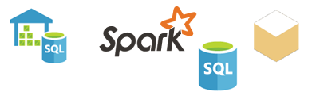

# แหล่งข้อมูลสำหรับบริการ Power BI
ข้อมูลเป็นหัวใจสำคัญของ Power BI หากคุณกำลังสำรวจข้อมูล คุณอาจทำได้โดยการสร้างแผนภูมิและแดชบอร์ด หรือการถามคำถามด้วย**ถามตอบ**ได้ การจัดรูปแบบการแสดงข้อมูลและคำตอบที่คุณเห็นจะได้รับข้อมูลเบื้องต้นจากชุดข้อมูล แตชุดข้อมูลนั้นมาจากไหน ใช่แล้ว ชุดข้อมูลมาจากแหล่งข้อมูล

ในบทความนี้ เรากำลังจะพูดถึงประเภทของแหล่งข้อมูลที่คุณสามารถเชื่อมต่อกับจากบริการของ Power BI ได้ โปรดทราบว่ายังมีแหล่งข้อมูลชนิดอื่น ๆ อีกมากมายที่คุณสามารถรับข้อมูลมาได้ด้วยเช่นกัน ถ้าคุณเลือกแหล่งข้อมูลเหล่านี้ คุณอาจจำเป็นต้องใช้ Power BI Desktop หรือคิวรีข้อมูลขั้นสูงของ Excel และคุณลักษณะแบบจำลองก่อน เราจะอธิบายเรื่องเหล่านั้นในภายหลัง ในตอนนี้ มาดูประเภทของแหล่งข้อมูลที่ใช้ได้จากไซต์ Power BI ของคุณ

คุณสามารถรับข้อมูลจากแหล่งข้อมูลใดก็ได้ใน Power BI โดยการเลือก**รับข้อมูล**ที่มุมล่างซ้ายของหน้าได้

 

หลังจากที่คุณเลือก**รับข้อมูล** คุณสามารถเลือกข้อมูลที่ต้องการเข้าถึง

## ค้นพบเนื้อหา

ส่วน **ชุดเนื้อหา** ประกอบด้วยข้อมูลและรายงานทั้งหมดที่คุณต้องการแล้วเตรียมพร้อมสำหรับคุณ ใน Power BI มีชุดเนื้อหาสองชนิด: องค์กรและบริการ 

**องค์กร**: ถ้าคุณและผู้ใช้อื่นในองค์กรของคุณมีบัญชี Power BI Pro คุณสามารถสร้าง แชร์ และใช้ชุดเนื้อหาได้ เมื่อต้องการเรียนรู้เพิ่มเติม ดู [บทนำเกี่ยวกับชุดเนื้อหาระดับองค์กร](service-organizational-content-pack-introduction.md)

**บริการ**: มีบริการพร้อมด้วยชุดเนื้อหาเยอะแยะมากมายสำหรับ Power BI และรายละเอียดเพิ่มเติมจะถูกเพิ่มในทุกครั้ง บริการส่วนใหญ่จำเป็นต้องใช้บัญชีผู้ใช้ เมื่อต้องการเรียนรู้เพิ่มเติม ดู[เชื่อมต่อกับบริการที่คุณใช้กับ Power BI](service-connect-to-services.md)

## สร้างเนื้อหาใหม่

ส่วน **สร้างเนื้อหาใหม่** ประกอบด้วยตัวเลือกสำหรับการสร้าง และการนำเข้าเนื้อหาด้วยตนเอง ใน Power BI มีสองวิธีในการสร้างหรือนำเข้าเนื้อหาของคุณเอง: ไฟล์และฐานข้อมูล 

### ไฟล์

**Excel** ( *.xlsx*, *.xlsm*) - ใน Excel เวิร์กบุ๊กอาจมีชนิดข้อมูลต่างกัน ตัวอย่างเช่น สามารถรวมข้อมูลที่คุณใส่ลงในแผ่นงานด้วยตนเอง ซึ่งอาจมีข้อมูลที่คุณทำการคิวรีและโหลดจากแหล่งข้อมูลภายนอก โดยใช้ Power Query Power Query จะพร้อมใช้งานผ่านฟังก์ชัน **รับและแปลง** ใน Excel 2016 หรือ Power Pivot คุณอาจนำเข้าข้อมูลจากตารางในแผ่นงาน หรือนำเข้าข้อมูลจากแบบจำลองข้อมูล เมื่อต้องการเรียนรู้เพิ่มเติม ดู [รับข้อมูลจากไฟล์สำหรับ Power BI](service-get-data-from-files.md)

**Power BI Desktop** ( *.pbix*) - คุณสามารถใช้ Power BI Desktop เพื่อทำการคิวรี และโหลดข้อมูลจากแหล่งข้อมูลภายนอก และสร้างรายงานได้ นอกจากนี้ คุณยังสามารถขยายแบบจำลองข้อมูลของคุณด้วยหน่วยวัดและความสัมพันธ์ หรือนำเข้าไฟล์ Power BI Desktop ลงในไซต์ Power BI ของคุณ Power BI Desktop จะเหมาะสมสำหรับผู้ใช้ขั้นสูงมากขึ้น โดยทั่วไปแล้ว ผู้ใช้เหล่านี้เป็นบุคคลที่มีความเข้าใจที่ดีเกี่ยวกับแหล่งข้อมูลของตน นอกจากนี้ พวกเขายังมีความเข้าใจการคิวรีข้อมูล และการแปลงข้อมูล รวมถึงแนวคิดการจำลองข้อมูล เมื่อต้องการเรียนรู้เพิ่มเติม ดู[มุมมองความสัมพันธ์ใน Power BI Desktop](desktop-connect-to-data.md)

**ค่าที่คั่นด้วยเครื่องหมายจุลภาค**( *.csv*) - ไฟล์เป็นไฟล์ข้อความอย่างง่ายพร้อมด้วยแถวของข้อมูล แถวแต่ละรายการอาจประกอบด้วยค่าอย่างน้อยหนึ่งค่าหรือมากกว่า แต่ละรายการโดยคั่นด้วยเครื่องหมายจุลภาค ตัวอย่างเช่น *.csv* ที่มีข้อมูลชื่อและที่อยู่อาจมีแถวจำนวนมากได้ แต่ละแถวอาจมีค่าสำหรับชื่อ นามสกุล อยู่ เมือง สถานะ และอื่น ๆ คุณไม่สามารถนำเข้าข้อมูลลงในไฟล์ *.csv* ได้ แต่หลายแอปพลิเคชัน เช่น Excel สามารถบันทึกข้อมูลในตารางอย่างง่ายเป็นไฟล์ *.csv*

สำหรับไฟล์ชนิดอื่น ๆ เช่นตาราง XML ( *.xml*) หรือไฟล์ข้อความ ( *.txt*) คุณสามารถใช ้**รับและแปลง** เพื่อคิวรี แปลง และโหลดข้อมูลนั้นลงในไฟล์ Excel หรือ Power BI Desktop ก่อนได้ จากนั้นคุณสามารถนำเข้าไฟล์ Excel หรือ Power BI Desktop ลงใน Power BI

ตำแหน่งที่คุณจัดเก็บไฟล์ของคุณทำให้มีความแตกต่างมากเกินไป OneDrive for Business มีจำนวนยืดหยุ่นและรวมกับ Power BI การเก็บไฟล์บนไดรฟ์ภายในเครื่องสามารถทำได้ แต่ถ้าคุณต้องการรีเฟรชข้อมูลของคุณ มีขั้นตอนเพิ่มเติม สำหรับข้อมูลเพิ่มเติม โปรดดูลิงก์บทความด้านล่าง:

### ฐานข้อมูล

**ฐานข้อมูลในระบบคลาวด์**-จากบริการของ Power BI คุณสามารถเชื่อมต่อสด:

* ฐานข้อมูล Azure SQL
* คลังข้อมูล Azure SQL
* Spark บน Azure HDInsight

การเชื่อมต่อจาก Power BI กับฐานข้อมูลเหล่านี้เป็นการเชื่อมต่อสด หากคุณเชื่อมต่อกับฐานข้อมูล SQL Azure แล้วคุณเริ่มการสำรวจข้อมูลโดยการสร้างรายงานใน Power BI เมื่อใดก็ตามที่คุณแบ่งส่วนข้อมูลของคุณหรือเพิ่มเขตข้อมูลอื่นลงในการจัดรูปแบบการแสดงข้อมูล Power BI จะสร้างคิวรีที่เหมาะสมสำหรับฐานข้อมูล เมื่อต้องการเรียนรู้เพิ่มเติม ดู [Azure และ Power BI](service-azure-and-power-bi.md)

**ฐานข้อมูลภายในองค์กร** - จากบริการของ Power BI คุณสามารถเชื่อมต่อโดยตรงกับแบบจำลองฐานข้อมูลแบบตารางของ SQL Server Analysis Services ได้ เมื่อต้องการทำเช่นนั้น คุณจะต้องใช้เกตเวย์ Power BI Enterprise ถ้าคุณไม่แน่ใจเกี่ยวกับวิธีการเชื่อมต่อกับฐานข้อมูลแบบจำลองแบบตารางขององค์กร ให้ตรวจสอบกับผู้ดูแลระบบหรือแผนก IT ของคุณ เมื่อต้องการเรียนรู้เพิ่มเติม ดู [ข้อมูลสดของ SQL Server Analysis Services ใน Power BI](sql-server-analysis-services-tabular-data.md)

สำหรับฐานข้อมูลชนิดอื่น ๆ ในองค์กร คุณจะต้องใช้ Power BI Desktop หรือ Excel เพื่อเชื่อมต่อ คิวรี และโหลดข้อมูลลงในแบบจำลองข้อมูล จากนั้นคุณสามารถนำเข้าไฟล์ของคุณลงใน Power BI ที่สร้างชุดข้อมูล ถ้าคุณกำหนดค่ารีเฟรชตามกำหนดการ Power BI จะใช้ข้อมูลการกำหนดค่าและการเชื่อมต่อจากไฟล์เพื่อเชื่อมต่อโดยตรงไปยังแหล่งข้อมูลและคิวรีสำหรับการอัปเดต จากนั้น Power BI โหลดอัปเดตเหล่านั้นลงในชุดข้อมูล เมื่อต้องการเรียนรู้เพิ่มเติม ดู[มุมมองความสัมพันธ์ใน Power BI Desktop](desktop-connect-to-data.md)

## เกิดอะไรขึ้นถ้าข้อมูลมาจากแหล่งข้อมูลที่แตกต่างกัน
มีแหล่งข้อมูลอยู่เป็นหลายร้อยแหล่งที่คุณสามารถนำมาใช้กับ Power BI ไม่ว่าคุณจะได้รับข้อมูลจากที่ใด ข้อมูลนั้นจะต้องอยู่ในรูปแบบที่บริการของ Power BI สามารถใช้ได้ ด้วยข้อมูลที่สามารถใช้ได้ บริการของ Power BI สามารถสร้างรายงานและแดชบอร์ด ตอบคำถามด้วย**ถามตอบ**ฯลฯ ได้

บางแหล่งข้อมูลมีข้อมูลที่จัดรูปแบบไว้แล้วสำหรับบริการของ Power BI แหล่งข้อมูลเหล่านี้จะเหมือนกับชุดเนื้อหาจากผู้ให้บริการเช่น Google Analytics และ Twilio แบบจำลองฐานข้อมูลแบบตารางของ SQL Server Analysis Services ก็พร้อมใช้งานเช่นกัน นอกจากนี้ คุณยังสามารถเชื่อมต่อแบบสดกับฐานข้อมูลในระบบคลาวด์เช่น ฐานข้อมูล SQL Azure และ Spark บน HDInsight

ในกรณีอื่น ๆ คุณอาจจำเป็นเพื่อสอบถาม และโหลดข้อมูลคุณต้องลงในไฟล์ ตัวอย่างเช่น หากคุณมีข้อมูลลอจิสติกส์ในองค์กรของคุณ คุณสามารถเก็บข้อมูลดังกล่าวในฐานข้อมูลคลังข้อมูลบนเซิร์ฟเวอร์ได้ ในบริการของ Power BI คุณไม่สามารถเชื่อมต่อกับฐานข้อมูลนั้นโดยตรง และเริ่มการสำรวจข้อมูล (ยกเว้นว่าเป็นฐานข้อมูลแบบจำลองแบบตาราง) แต่คุณสามารถใช้ Power BI Desktop หรือ Excel เพื่อคิวรีและโหลดข้อมูลลอจิสติกส์นั้นลงในแบบจำลองข้อมูลแล้วบันทึกเป็นไฟล์ จากนั้นคุณสามารถนำเข้าไฟล์ของคุณลงใน Power BI ที่มีชุดข้อมูล

คุณอาจกำลังคิด - “แต่ว่าข้อมูลลอจิสติกส์นั้นบนฐานข้อมูลนั้นเปลี่ยนแปลงทุกวัน ฉันจะรีเฟรชชุดข้อมูล Power BI ได้อย่างไร" เมื่อคุณนำเข้าข้อมูลลงในชุดข้อมูล คุณจะนำเข้าข้อมูลการเชื่อมต่อจาก Power BI Desktop หรือไฟล์ Excel

หากคุณกำหนดค่าการรีเฟรชตามกำหนดการ หรือทำการรีเฟรชชุดข้อมูลด้วยตนเอง Power BI ใช้ข้อมูลการเชื่อมต่อจากชุดข้อมูล พร้อมกับการตั้งค่าอื่น ๆ สองรายการเพื่อเชื่อมต่อโดยตรงไปยังฐานข้อมูล จากนั้นจะทำการคิวรีสำหรับการอัปเดต และโหลดการอัปเดตเหล่านั้นลงในชุดข้อมูล ตามแนวโน้ม คุณอาจต้องใช้เกตเวย์ Power BI เพื่อรักษาความปลอดภัยการถ่ายโอนข้อมูลระหว่างเซิร์ฟเวอร์ภายในองค์กรกับ Power BI เมื่อการถ่ายโอนเสร็จสมบูรณ์ การจัดรูปแบบการแสดงข้อมูลใด ๆ ในรายงานและแดชบอร์ดจะรีเฟรชโดยอัตโนมัติ

คุณเห็นแม้ว่าคุณไม่สามารถเชื่อมต่อกับแหล่งข้อมูลโดยตรงจากบริการของ Power BI แต่คุณยังคงสามารถรับข้อมูลนั้นลงใน Power BI เพียงแค่อาจใช้เวลาขั้นตอนเพิ่มเติม และอาจบางความช่วยเหลือจากแผนก IT ของคุณ ดู[แหล่งข้อมูลใน Power BI Desktop](desktop-data-sources.md)เมื่อต้องการเรียนรู้เพิ่มเติม

## ดูรายละเอียดเพิ่มเติม
คุณจะเห็นชุดข้อมูลเงื่อนไข และแหล่งข้อมูลที่ถูกนำมาใช้มากใน Power BI แหล่งข้อมูลนั้นมักจะถูกนำมาใช้เหมือน ๆ กัน แต่จริง ๆ แล้วเป็นสองแหล่งข้อมูลที่แตกต่างกัน แม้จะมีความข้องเกี่ยวกันก็ตาม

คุณสามารถสร้าง **ชุดข้อมูล** โดยอัตโนมัติใน Power BI เมื่อคุณใช้ **รับข้อมูล** ด้วย **รับข้อมูล** คุณสามารถเชื่อมต่อและนำเข้าข้อมูลจากชุดเนื้อหา ไฟล์ หรือคุณเชื่อมต่อกับแหล่งข้อมูลสด ชุดข้อมูลประกอบด้วยข้อมูลเกี่ยวกับข้อมูลประจำตัวของแหล่งข้อมูลและแหล่งข้อมูล ในหลายกรณี ยังมีชุดย่อยของข้อมูลที่คัดลอกจากแหล่งข้อมูล เมื่อคุณสร้างการจัดรูปแบบการแสดงข้อมูลในรายงานและแดชบอร์ด คุณมักจะดูข้อมูลในชุดข้อมูล

**แหล่งข้อมูล** คือที่มาของข้อมูลที่คุณอัปโหลดลงในชุดข้อมูล ตัวอย่างเช่น ข้อมูลอาจมาจาก:

* บริการแบบออนไลน์เช่น Google Analytics หรือ QuickBooks
* ฐานข้อมูลในระบบคลาวด์เช่น ฐานข้อมูล Azure SQL
* ฐานข้อมูลหรือไฟล์บนคอมพิวเตอร์หรือเซิร์ฟเวอร์ในองค์กรของคุณเอง

## การรีเฟรชข้อมูล
บางทีคุณอาจบันทึกไฟล์ไดรฟ์ภายในเครื่องหรือไดรฟ์ที่ใดที่หนึ่งในองค์กรของคุณ คุณอาจต้องการเกตเวย์ Power BI เพื่อให้คุณสามารถรีเฟรชชุดข้อมูลใน Power BI คอมพิวเตอร์ที่จัดเก็บไฟล์จำเป็นต้องเปิดไว้เมื่อมีการรีเฟรชเกิดขึ้น คุณสามารถนำเข้าไฟล์หรือเผยแพร่จาก Excel หรือ Power BI Desktop แต่ตัวเลือกเหล่านั้นไม่ใช่กระบวนการอัตโนมัติ

ถ้าคุณบันทึกไฟล์บน OneDrive for Business หรือไซต์ทีม SharePoint คุณสามารถเชื่อมต่อหรือนำเข้าไฟล์เหล่านั้นไปยัง Power BI ได้ แล้ว ชุดข้อมูล รายงาน และแดชบอร์ดอัปเดตอยู่เสมอ เนื่องจากทั้ง OneDrive และ Power BI อยู่ในระบบคลาวด์ Power BI สามารถเชื่อมต่อโดยตรงไปยังไฟล์ที่บันทึกไว้ ซึ่งเชื่อมต่อประมาณหนึ่งครั้งในทุกชั่วโมงและตรวจหาการอัปเดต ชุดข้อมูลและการจัดรูปแบบการแสดงข้อมูลจะรีเฟรชโดยอัตโนมัติถ้ามีการอัปเดตใด ๆ

ชุดเนื้อหาจากบริการอัปเดตโดยอัตโนมัติ ในกรณีส่วนใหญ่ ชุดข้อมูลเหล่านั้นจะอัปเดตวันละครั้ง คุณสามารถรีเฟรชด้วยตนเองได้ แต่ถ้าคุณจะเห็นข้อมูลใด ๆ ที่อัปเดตแล้วจะขึ้นอยู่กับผู้ให้บริการ การอัปเดตชุดเนื้อหาจากบุคคลในองค์กรของคุณจะขึ้นอยู่กับแหล่งข้อมูลที่ใช้ นอกจากนี้ยังขึ้นอยู่กับวิธีการที่บุคคลที่สร้างชุดเนื้อหาได้กำหนดค่าการรีเฟรช

Azure SQL Database, Azure SQL Data Warehouse และ Spark บน Azure HDInsight คือแหล่งข้อมูลในระบบคลาวด์ นอกจากนี้ บริการของ Power BI ยังอยู่ในระบบคลาวด์ ดังนั้น Power BI สามารถเชื่อมต่อสดโดยใช้ **DirectQuery** สิ่งที่คุณเห็นใน Power BI จะได้รับการซิงค์อยู่เสมอ และไม่จำเป็นเมื่อต้องการตั้งค่าการรีเฟรชตามกำหนดการ

เมื่อคุณเชื่อมต่อกับ SQL Server Analysis Services จาก Power BI การเชื่อมต่อนี้เป็นการเชื่อมต่อแบบสดเช่นเดียวกับฐานข้อมูล Azure ในคลาวด์ ความแตกต่างคือฐานข้อมูลนั้นอยู่บนเซิร์ฟเวอร์ในองค์กรของคุณ การเชื่อมต่อประเภทนี้จำเป็นต้องใช้เกตเวย์ Power BI ซึ่งแผนก IT กำหนดค่า

การรีเฟรชข้อมูลสำคัญมากคือเป็นส่วนหนึ่งของ Power BI และมากเกินไปความลึกเพื่อให้ครอบคลุมที่นี่ ถ้าคุณต้องการทำความเข้าใจอย่างละเอียด โปรดแน่ใจว่าการเช็คเอาท์[รีเฟรชข้อมูลใน Power BI](refresh-data.md)

## ข้อควรพิจารณาและข้อจำกัด
สำหรับแหล่งข้อมูลทั้งหมดที่ใช้ในบริการของ Power BI ควรพิจารณาข้อจำกัดดังต่อไปนี้ มีข้อจำกัดอื่น ๆ ที่นำไปใช้กับคุณลักษณะเฉพาะ แต่รายการต่อไปนี้นำไปใช้กับบริการเต็มรูปแบบของ Power BI :

* **ขีดจำกัดขนาดของชุดข้อมูล**- มีขีดจำกัด 1 GB สำหรับแต่ละชุดข้อมูลที่เก็บไว้ในความจุที่สามารถแชร์ได้ในบริการของ Power BI ถ้าคุณต้องการชุดข้อมูลขนาดใหญ่ขึ้น คุณสามารถใช้  [Power BI Premium](service-premium-what-is.md) ได้

* **ค่าที่แตกต่างกันในคอลัมน์** -เมื่อแคชข้อมูลในชุดข้อมูล Power BI (บางครั้งเรียกว่า ' อิมพอร์ต ' โหมด), มีขีดจำกัด1,999,999,997 บนจำนวนของค่าที่แตกต่างกันที่สามารถจัดเก็บไว้ในคอลัมน์

* **การจำกัดแถว** -เมื่อใช้ **DirectQuery**  Power BI จะกำหนดการจำกัดของผลลัพธ์คิวรีที่ส่งไปยังแหล่งข้อมูลพื้นฐานของคุณ ถ้าคิวรีที่ส่งไปยังแหล่งข้อมูลถูกส่งกลับมากกว่า 1 ล้านแถวคุณจะเห็นข้อผิดพลาดและคิวรีล้มเหลว ข้อมูลเบื้องต้นของคุณยังคงสามารถมีได้มากกว่า 1 ล้านแถว คุณไม่จำเป็นต้องให้ระบบทำงานจนถึงขีดสุดนี้เพราะรายงานส่วนใหญ่จะรวมข้อมูลลงในชุดผลลัพธ์ที่มีขนาดเล็กลง

* **ขีดจำกัดของคอลัมน์**- จำนวนคอลัมน์สูงสุดที่ได้รับอนุญาตในชุดข้อมูล ระหว่างตารางทั้งหมดในชุดข้อมูล 16,000 คอลัมน์ ข้อจำกัดนี้นำไปใช้กับบริการของ Power BI และชุดข้อมูลที่ใช้ใน Power BI Desktop Power BI จะติดตามจำนวนแถวภายในและตารางในชุดข้อมูล ซึ่งหมายความว่า จำนวนคอลัมน์สูงสุดคือ 16,000 ลบหนึ่งสำหรับแต่ละตารางในชุดข้อมูล

