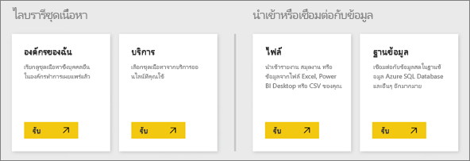

# แหล่งข้อมูลสำหรับบริการ Power BI
ข้อมูลเป็นหัวใจสำคัญของ Power BI เมื่อใดก็ตามที่คุณกำลังสำรวจข้อมูล สร้างแผนภูมิและแดชบอร์ด ถามคำถามด้วยการถามตอบ ภาพและคำตอบที่คุณเห็นทั้งหมดเหล่านั้นได้รับเอาข้อมูลพื้นฐานมาจากชุดข้อมูลหนึ่ง แตชุดข้อมูลนั้นมาจากไหน คำตอบคือ มันมาจากแหล่งข้อมูล

ในบทความนี้ เรากำลังจะมาดูแหล่งข้อมูลชนิดต่าง ๆ ที่คุณสามารถเชื่อมต่อกับจากบริการ Power BI ได้ จำไว้ว่า ยังมีแหล่งข้อมูลชนิดอื่น ๆ อีกมากมายที่คุณสามารถรับข้อมูลมาได้ด้วยเช่นกัน แต่แหล่งข้อมูลเหล่านั้นอาจจำเป็นต้องใช้ Power BI Desktop หรือแบบสอบถามข้อมูลขั้นสูงของ Excel และลักษณะการทำงานการสร้างโมเดลก่อน เราจะอธิบายเรื่องนั้นในภายหลัง ในตอนนี้ มาดูชนิดของแหล่งข้อมูลที่คุณสามารถเชื่อมต่อกับโดยตรงจากไซต์ Power BI ของคุณ

คุณสามารถรับข้อมูลจากแหล่งข้อมูลเหล่านี้ใน Power BI ก็ได้ โดยคลิกที่**My Workspace** > **รับข้อมูล**ได้

## ไฟล์

**Excel** (.xlsx, xlxm) - Excel จะไม่เหมือนใครตรงที่เวิร์กบุ๊กสามารถมีทั้งข้อมูลที่คุณป้อนลงในแผ่นงานด้วยตนเอง และคุณสามารถสร้างคิวรี่และโหลดข้อมูลจากแหล่งข้อมูลภายนอกโดยใช้ Power Query (รับและแปลงใน Excel 2016) หรือ Power Pivot คุณสามารถนำเข้าข้อมูลที่อยู่ในตารางในแผ่นงาน (ข้อมูล*ต้อง*อยู่ในตาราง), หรือนำเข้าข้อมูลที่โหลดลงในแบบจำลองข้อมูลได้ เมื่อต้องการเรียนรู้เพิ่มเติม ดู[รับข้อมูลจาก Excel](service-get-data-from-files.md)

**Power BI Desktop** (.pbix) - คุณสามารถใช้ Power BI Desktop เพื่อสอบถาม และโหลดข้อมูลจากแหล่งข้อมูลภายนอก ขยายแบบจำลองข้อมูลของคุณกับตัววัดและความสัมพันธ์ และสร้างรายงานได้ คุณสามารถนำเข้าไฟล์ Power BI Desktop ของคุณลงในไซต์ Power BI ของคุณ Power BI Desktop จะเหมาะสมสำหรับผู้ใช้ขั้นสูงเพิ่มเติมที่มีความเข้าใจที่ดีของแหล่งข้อมูลของพวกเขา แบบสอบถามข้อมูล และการแปลง และแนวคิดการจำลองข้อมูล เมื่อต้องการเรียนรู้เพิ่มเติม ดู[มุมมองความสัมพันธ์ใน Power BI Desktop](desktop-connect-to-data.md)

**ค่าที่คั่นด้วยเครื่องหมายจุลภาค**(.csv) - แฟ้มคือ แฟ้มข้อความอย่างง่าย ด้วยแถวของข้อมูล แถวแต่ละรายการสามารถประกอบด้วยค่าอย่าง น้อยหนึ่ง แต่ละรายการโดยคั่น ด้วยเครื่องหมายจุลภาค สำหรับตัวอย่าง ชื่อที่มี.csv และข้อมูลที่อยู่สามารถมีจำนวนแถวที่แต่ละแถวมีค่าสำหรับชื่อ นามสกุล ที่อยู่ เมือง รัฐ และอื่น ๆ คุณไม่สามารถนำเข้าข้อมูลลงในไฟล์.csv ได้หลายแอปพลิเคชัน เช่น Excel สามารถบันทึกข้อมูลในตารางอย่างง่ายเป็นไฟล์.csv

สำหรับไฟล์ชนิดอื่น ๆ เช่นตาราง XML (.xml) หรือไฟล์ข้อความ (.txt) คุณสามารถใช้รับ และแปลงแบบสอบถาม แปลง และโหลดข้อมูลนั้นลงในไฟล์ Excel หรือ Power BI Desktop ก่อนได้ จากนั้นคุณสามารถนำเข้าไฟล์ Excel หรือ Power BI Desktop ลงใน Power BI

ตำแหน่งที่คุณจัดเก็บไฟล์ของคุณทำให้มีความแตกต่างมากเกินไป OneDrive for Business มีจำนวนยืดหยุ่นและรวมกับ Power BI ถ้าคุณเก็บไฟล์ของคุณบนไดรฟ์ภายในเครื่องของคุณ ที่ถูกต้อง แต่ถ้าคุณต้องการรีเฟรชข้อมูลของคุณ ขั้นตอนเพิ่มเติมเกี่ยวข้อง รายละเอียดเพิ่มเติมจะมีอยู่ในบทความที่ลิงก์

## ชุดเนื้อหา

ชุดเนื้อหาประกอบด้วยทั้งหมดของข้อมูลและรายงานที่คุณต้องการแล้วเตรียมพร้อมสำหรับคุณ ใน Power BI มีอยู่สองชนิดของชุดเนื้อหา ที่มีอยู่จากบริการเช่น Google Analytics, Marketo หรือ Salesforce และที่สร้าง และแชร์ โดยผู้ใช้อื่นในองค์กรของคุณ

**บริการ** - มีบริการพร้อมด้วยชุดเนื้อหาเยอะแยะมากมายสำหรับ Power BI และเพิ่มเติมจะถูกเพิ่มในทุกครั้ง บริการส่วนใหญ่จำเป็นต้องใช้บัญชีผู้ใช้ เมื่อต้องการเรียนรู้เพิ่มเติม ดู[เชื่อมต่อกับบริการ](service-connect-to-services.md)

**องค์กร** - ถ้าคุณและผู้ใช้อื่นในองค์กรของคุณมีบัญชี Power BI Pro คุณสามารถสร้าง แชร์ และใช้ชุดเนื้อหาได้ เมื่อต้องการเรียนรู้เพิ่มเติม ดู [บทนำเกี่ยวกับชุดเนื้อหาระดับองค์กร](service-organizational-content-pack-introduction.md)

## ฐานข้อมูล

**ฐานข้อมูลในระบบคลาวด์** - จาก Power BI แบบบริการ คุณสามารถเชื่อมต่อแบบสดกับฐานข้อมูล SQL Azure, Azure SQL Data Warehouse, Spark บน Azure ข้อมูลเชิงลึก HD และ SQL Server Analysis Services ใช้ DirectQuery การเชื่อมต่อจาก Power BI ไปยังฐานข้อมูลเหล่านี้กำลังถ่ายทอดสด นั่นคือ เมื่อคุณเชื่อมต่อเพื่อระบุว่า ฐานข้อมูล SQL Azure และคุณเริ่มต้นสำรวจข้อมูล โดยการสร้างรายงานใน Power BI ทุกครั้งที่คุณแบ่งส่วนข้อมูลของคุณ หรือเพิ่มเขตข้อมูลอื่นลงในภาพ คิวรีจะถูกสร้างขึ้นไว้ตรงด้านข้างของฐานข้อมูล เมื่อต้องการเรียนรู้เพิ่มเติม ดู [Azure และ Power BI](service-azure-and-power-bi.md)

**ฐานข้อมูลภายในองค์กร** - จาก Power BI แบบบริการ ที่คุณสามารถเชื่อมต่อโดยตรงกับ SQL Server Analysis Services แบบจำลองฐานข้อมูลแบบตารางได้ เกตเวย์ Power BI องค์กรที่จำเป็น ถ้าคุณไม่แน่ใจเกี่ยวกับวิธีการเชื่อมต่อกับฐานข้อมูลแบบจำลองแบบตารางขององค์กรของคุณ ตรวจสอบกับผู้ดูแลระบบหรือแผนก IT ของคุณ เมื่อต้องการเรียนรู้เพิ่มเติม ดู[SQL Server Analysis ข้อมูลแบบตารางใน Power BI](sql-server-analysis-services-tabular-data.md)

สำหรับฐานข้อมูลชนิดอื่น ๆ ในองค์กรของคุณ คุณจะต้องใช้ Power BI Desktop หรือ Excel เพื่อเชื่อมต่อกับคิวรี และโหลดข้อมูลลงในแบบจำลองข้อมูล จากนั้นคุณสามารถนำเข้าไฟล์ของคุณลงใน Power BI ที่มีสร้างชุดข้อมูล ถ้าคุณกำหนดค่ารีเฟรชตามกำหนดการ Power BI จะใช้ข้อมูลการเชื่อมต่อจากไฟล์พร้อมกับตั้งค่าการรีเฟรชที่คุณกำหนดค่าการเชื่อมต่อโดยตรงไปยังแหล่งข้อมูลและแบบสอบถามการอัปเดต และอัปเดตเหล่านั้นจะโหลดลงในชุดข้อมูลใน Power BI เมื่อต้องการเรียนรู้เพิ่มเติม ดู[มุมมองความสัมพันธ์ใน Power BI Desktop](desktop-connect-to-data.md)

## เกิดอะไรขึ้นถ้าข้อมูลมาจากแหล่งข้อมูลที่แตกต่างกัน
มีแหล่งข้อมูลอยู่เป็นหลายร้อยแหล่งที่คุณสามารถนำมาใช้กับ Power BI ไม่ว่าคุณจะนำข้อมูลมาจากที่ใด ข้อมูลนั้นจะต้องอยู่ในรูปแบบที่บริการ Power BI สามารถใช้เพื่อสร้างรายงานและแดชบอร์ด ตอบคำถาม ด้วยการถามตอบ และอื่น ๆ

แหล่งข้อมูลบางแหล่งข้อมูลของพวกเขาที่มีอยู่แล้วในรูปแบบที่พร้อมให้บริการของ Power BI เช่นชุดเนื้อหาจากผู้ให้บริการเช่น Google Analytics และ Twilio SQL Server Analysis Services แบบจำลองฐานข้อมูลแบบตารางพร้อมใช้งานเช่นกัน และคุณสามารถเชื่อมต่อแบบสดกับฐานข้อมูลในระบบคลาวด์เช่นฐานข้อมูล SQL Azure และ Spark บน HDInsight

ในกรณีอื่น ๆ คุณอาจจำเป็นเพื่อสอบถาม และโหลดข้อมูลคุณต้องลงในไฟล์ ตัวอย่างเช่น หากคุณมีข้อมูลลอจิสติกส์ในฐานข้อมูลคลังข้อมูลบนเซิร์ฟเวอร์ในองค์กรของคุณ ในบริการ Power BI คุณไม่สามารถเชื่อมต่อกับฐานข้อมูลนั้นโดยตรง และเริ่มการสำรวจข้อมูล (ยกเว้นว่าเป็นฐานข้อมูลแบบจำลอง) คุณสามารถ อย่างไรก็ตาม ใช้ Power BI Desktop หรือ Excel เพื่อสอบถาม และโหลดข้อมูลลอจิสติกส์นั้นลงในแบบจำลองข้อมูลแล้วบันทึกเป็นไฟล์ จากนั้นคุณสามารถนำเข้าไฟล์ของคุณลงใน Power BI ที่มีสร้างชุดข้อมูล

คุณอาจกำลังคิด - แต่ว่าข้อมูลลอจิสติกส์นั้นบนฐานข้อมูลนั้น่เปลี่ยนแปลงทุกวัน ฉันจะแน่ใจได้อย่างไรว่ามีการรีเฟรชชุดข้อมูลของฉันใน Power BI หรือไม่? - ข้อมูลการเชื่อมต่อจาก Power BI Desktop หรือไฟล์ Excel จะถูกนำเข้าลงในชุดข้อมูลพร้อมกับข้อมูล ถ้าคุณกำหนดค่าการรีเฟรชตามกำหนดการ หรือทำการรีเฟรชชุดข้อมูลด้วยตนเอง Power BI จะใช้ข้อมูลการเชื่อมต่อจากชุดข้อมูล พร้อมกับการตั้งค่าอื่น ๆ อีก การเชื่อมต่อโดยตรงไปยังฐานข้อมูล แบบสอบถามการอัปเดต และโหลดการอัปเดตเหล่านั้นลงในชุดข้อมูล เกตเวย์ Power BI จะมีแนวโน้มว่าจะต้องใช้เพื่อรักษาความปลอดภัยใด ๆ ถ่ายโอนข้อมูลระหว่างเซิร์ฟเวอร์ภายในองค์กรของคุณและ Power BI การจัดรูปแบบการแสดงข้อมูลในรายงานและแดชบอร์ดจะได้รับการอัปเดตอยู่เสมอ

เห็นไหมว่า เพียงเพราะคุณไม่สามารถเชื่อมต่อกับขวาแหล่งข้อมูลของคุณจากบริการ Power BI ไม่หมายความว่า คุณไม่สามารถรับข้อมูลนั้นลงใน Power BI เพียงแค่อาจใช้เวลาขั้นตอนเพิ่มเติม และอาจบางความช่วยเหลือจากแผนก IT ของคุณ ดู[แหล่งข้อมูลใน Power BI Desktop](desktop-data-sources.md)เมื่อต้องการเรียนรู้เพิ่มเติม

## ดูรายละเอียดเพิ่มเติม
คุณจะเห็นชุดข้อมูลเงื่อนไข และแหล่งข้อมูลที่ถูกนำมาใช้มากใน Power BI แหล่งข้อมูลนั้นถูกนำมาใช้เหมือน ๆ กัน แต่จริง ๆ แล้วเป็นสองแหล่งข้อมูลที่แตกต่างกัน แม้จะมีความข้องเกี่ยวกันก็ตาม

ชุดข้อมูล***A***ถูกสร้างขึ้นโดยอัตโนมัติใน Power BI เมื่อคุณใช้รับข้อมูลการเชื่อมต่อกับ และนำเข้าข้อมูลจากชุดเนื้อหา แฟ้ม หรือคุณเชื่อมต่อกับแหล่งข้อมูลสด ชุดข้อมูลจะประกอบด้วยข้อมูลเกี่ยวกับแหล่งข้อมูล ข้อมูลประจำตัวของแหล่งข้อมูล และในกรณีส่วนใหญ่ ชุดย่อยของข้อมูลที่คัดลอกมาจากแหล่งข้อมูล ส่วนใหญ่เมื่อคุณสร้างการแสดงภาพในรายงานและแดชบอร์ด คุณกำลังดูข้อมูลในชุดข้อมูล

***แหล่งข้อมูล*** คือที่มาจริง ๆ ของข้อมูลที่คุณอัปโหลดลงในชุดข้อมูล ตัวอย่างเช่น บริการแบบออนไลน์เช่น Google Analytics หรือ QuickBooks ฐานข้อมูลในระบบคลาวด์เช่นฐาน ข้อมูล SQL Azure หรือฐานข้อมูล หรือไฟล์บนคอมพิวเตอร์หรือเซิร์ฟเวอร์ในองค์กรของคุณเอง

### การรีเฟรชข้อมูล
ถ้าคุณบันทึกไฟล์ของคุณบนไดรฟ์ภายในเครื่องของคุณ หรือไดรฟ์ที่ใดที่หนึ่งในองค์กรของคุณ เกตเวย์ Power BI อาจไม่จำเป็นต้องมีในใบสั่งรีเฟรชชุดข้อมูลใน Power BI และคอมพิวเตอร์เครื่องที่บันทึกไฟล์ต้องอยู่ในเมื่อมีการรีเฟรชเกิดขึ้น คุณสามารถนำเข้าไฟล์ของคุณอีกครั้ง หรือใช้ประกาศจาก Excel หรือ Power BI Desktop แต่ที่ไม่ใช่ค่ากระบวนการอัตโนมัติ

ถ้าคุณบันทึกไฟล์ของคุณบน OneDrive for Business หรือไซต์ทีม SharePoint และเชื่อมต่อไปยัง หรือนำเข้าไปยัง Power BI ชุดข้อมูลของคุณ รายงาน และแดชบอร์ดจะปรับเป็นปัจจุบันอยู่เสมอ เนื่องจากทั้ง OneDrive และ Power BI อยู่ในระบบคลาวด์ Power BI สามารถเชื่อมต่อโดยตรงไปยังแฟ้มบันทึก เกี่ยวกับชั่วโมงละครั้ง และตรวจสอบการอัปเดต หากพบการอัปเดตใด ๆ ชุดข้อมูลและแสดงภาพทุกอย่างจะได้รับการรีเฟรชโดยอัตโนมัติ

ชุดเนื้อหาจากบริการอัปเดตโดยอัตโนมัติ โดยมากจะเป็นวันละครั้ง คุณสามารถรีเฟรชด้วยตนเอง ได้หรือไม่คุณจะเห็นข้อมูลใด ๆ ที่ปรับปรุงจะขึ้นอยู่กับผู้ให้บริการ ชุดเนื้อหาจากผู้อื่นในองค์กรของคุณจะขึ้นอยู่กับแหล่งข้อมูลที่ใช้ และวิธีการรีเฟรชของบุคคลที่สร้างการตั้งค่าชุดเนื้อหา

Azure SQL Database, Azure SQL Data Warehouse และ Spark บน Azure HDInsight ไม่ซ้ำกันตรงที่มันมีแหล่งข้อมูลในระบบคลาวด์ เนื่องจากบริการ Power BI จะอยู่ในระบบคลาวด์ Power BI สามารถเชื่อมต่อไปยังสด ใช้ DirectQuery สิ่งที่คุณเห็นใน Power BI จะได้รับการซิงค์อยู่เสมอ และไม่จำเป็นเมื่อต้องการตั้งค่าการรีเฟรช

SQL Server Analysis Services ไม่ซ้ำกันในนั้นเมื่อคุณเชื่อมต่อจาก Power BI เชื่อมต่อสดเช่นเดียวกับฐานข้อมูล Azure ในระบบคลาวด์ ความปลอดภัย แต่ฐานข้อมูลนั้นอยู่บนเซิร์ฟเวอร์ในองค์กรของคุณ เชื่อมต่อนี้จำเป็นต้องใช้เกตเวย์ Power BI ซึ่งโดยปกติแล้วจะได้รับการกำหนดค่า โดยมีแผนก IT

การรีเฟรชข้อมูลสำคัญมากคือเป็นส่วนหนึ่งของ Power BI และมากเกินไปความลึกเพื่อให้ครอบคลุมที่นี่ ถ้าคุณต้องการทำความเข้าใจอย่างละเอียด โปรดแน่ใจว่าการเช็คเอาท์[รีเฟรชข้อมูลใน Power BI](refresh-data.md)

## ข้อควรพิจารณาและข้อจำกัด
สำหรับแหล่งข้อมูลทั้งหมดที่ใช้ในบริการ Power BI มีข้อควรพิจารณาและข้อจำกัดดังต่อไปนที่ต้องน้ำไปประยุกต์ใช้ มีข้อจำกัดอื่น ๆ ที่นำไปใช้กับคุณลักษณะเฉพาะ แต่รายการต่อไปนี้นำไปใช้กับบริการ Power BI โดยรวม:

* **ขีดจำกัดขนาดของชุดข้อมูล**- มีขีดจำกัด 1 GB สำหรับแต่ละชุดข้อมูลในบริการ Power BI
* **ขีดจำกัดแถว** -จำนวนสูงสุดในแถวชุดข้อมูลของคุณ (ตอนไม่ได้ใช้ DirectQuery) คือ 2 ล้านล้าน โดยมีการสงวนสามแถวนั้นไว้ (ผลคือ สามารถใช้แถวสูงสุดที่ 1,999,999,997 แถว) กล่าวคือ จำนวนสูงสุดของแถวในชุดข้อมูลของคุณเมื่อใช้ DirectQuery คือ 1 ล้านแถว
* **ขีดจำกัดคอลัมน์**- จำนวนสูงสุดของคอลัมน์ที่ได้รับอนุญาตในชุดข้อมูล ระหว่างตารางทั้งหมดในชุดข้อมูล 16000 คอลัมน์ ซึ่งนำไปใช้ ไปยังบริการ Power BI และชุดข้อมูลที่ใช้ใน Power BI Desktop Power BI ใช้คอลัมน์ตัวเลขแถวภายในสำหรับแต่ละตารางที่รวมอยู่ในชุดข้อมูล ซึ่งหมายความว่า จำนวนคอลัมน์สูงสุดคือ 16,000 ลบหนึ่งสำหรับแต่ละตารางที่ใช้ในชุดข้อมูล

