# บทช่วยสอน: เริ่มต้นใช้งานกับบริการ Power BI
บทช่วยสอนนี้เป็นการแนะนำคุณสมบัติการทำงานบางรายการของ*บริการของ Power BI* ในบทช่วยสอนนี้ คุณจะได้เชื่อมต่อกับข้อมูล สร้างรายงานและแดชบอร์ด และถามคำถามต่าง ๆ เกี่ยวกับข้อมูลของคุณ คุณสามารถทำสิ่งต่าง ๆ ได้มากมายด้วยบริการของ Power BI บทช่วยสอนนี้เป็นเพียงการทำงานเบื้องต้นสำหรับคุณเท่านั้น เพื่อทำความเข้าใจว่าบริการ Power BI นั้นเหมาะสมกับข้อเสนอ Power BI อื่นๆ อย่างไร เราขอแนะนำให้คุณอ่านเรื่อง [Power BI คืออะไร](fundamentals/power-bi-overview.md)

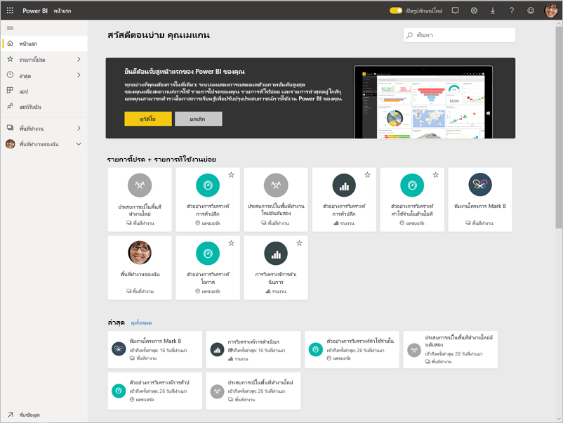

ในบทช่วยสอนนี้ คุณจะทำขั้นตอนต่อไปนี้ให้เสร็จสมบูรณ์:

> [!div class="checklist"]
> * ลงชื่อเข้าใช้บัญชีออนไลน์ Power BI ของคุณ หรือลงทะเบียน ถ้าคุณยังไม่มีบัญชี
> * เปิดบริการของ Power BI
> * รับข้อมูลบางอย่าง และเปิดในมุมมองรายงาน
> * ใช้ข้อมูลนั้นเพื่อสร้างการแสดงภาพ และบันทึกเป็นรายงาน
> * สร้างแดชบอร์ด โดยปักหมุดไทล์จากรายงาน
> * เพิ่มการแสดงภาพอื่น ๆ ที่แดชบอร์ดของคุณโดยใช้เครื่องมือการถามตอบตามภาษาธรรมชาติ
> * ปรับขนาด จัดเรียงใหม่ และโต้ตอบกับไทล์บนแดชบอร์ด
> * ล้างข้อมูล โดยการลบชุดข้อมูล รายงาน และแดชบอร์ด

> [!TIP]
> ต้องการหลักสูตรฝึกอบรมด้วยตนเองแบบฟรีแทนหรือไม่ [ลงทะเบียนในหลักสูตรการวิเคราะห์และแสดงข้อมูลบน EdX ของเรา](http://aka.ms/edxpbi)

## ลงชื่อออกจากบริการ Power BI
ถ้าคุณยังไม่มีบัญชี Power BI [ให้ลงทะเบียน Power BI Pro แบบทดลองใช้ฟรี](https://app.powerbi.com/signupredirect?pbi_source=web) ก่อนที่คุณจะเริ่มต้น

หลังจากที่คุณมีบัญชี ให้ใส่ *app.powerbi.com* ในเบราว์เซอร์ของคุณเพื่อเปิดบริการของ Power BI 

## ขั้นตอนที่ 1: รับข้อมูล

เมื่อคุณต้องการสร้างรายงาน Power BI บ่อยครั้งที่คุณมักจะเริ่มต้นใน Power BI Desktop แต่ครั้งนี้ เราจะเริ่มต้นจากการสร้างรายงานในบริการ Power BI

ในบทช่วยสอนนี้ เราจะได้รับข้อมูลจากไฟล์ CSV คุณต้องการทำตามหรือไม่ [ดาวน์โหลดไฟล์ CSV ตัวอย่างทางการเงิน](http://go.microsoft.com/fwlink/?LinkID=521962)

1. [ลงชื่อเข้าใช้ Power BI](http://www.powerbi.com/) ไม่มีบัญชีใช่หรือ ไม่ต้องกังวล คุณสามารถลงทะเบียนเพื่อทดลองใช้ฟรี
2. Power BI เปิดในเบราว์เซอร์ของคุณ เลือก**รับข้อมูล**ที่ด้านล่างของบานหน้าต่างนำทางด้านซ้ายมือ

    หน้า**รับข้อมูล**จะเปิดขึ้น   

3. ภายใต้ส่วน**สร้างเนื้อหาใหม่** ให้เลือก**ไฟล์** 
   
   
4.  เลือก**ไฟล์ภายในเครื่อง**
   
    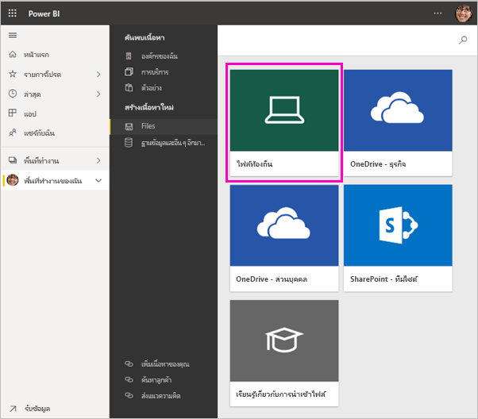

5. เรียกดูไฟล์บนคอมพิวเตอร์ของคุณ และเลือก**เปิด**

5. สำหรับบทช่วยสอนนี้ เราเลือก**นำเข้า**เพื่อเพิ่มไฟล์ Excel เป็นชุดข้อมูลที่เราสามารถใช้เพื่อสร้างรายงานและแดชบอร์ด ถ้าคุณเลือก**อัปโหลด** เวิร์กบุ๊ก Excel ทั้งหมดถูกอัปโหลดไปยัง Power BI ซึ่งคุณสามารถเปิด และแก้ไขใน Excel online
   
   
6. เมื่อชุดข้อมูลของคุณพร้อมแล้ว ให้เลือก**ชุดข้อมูล** จากนั้นจึงเลือก**สร้างรายงาน**ถัดจากชุดข้อมูล**ตัวอย่างการเงิน**เพื่อเปิดตัวแก้ไขรายงาน 

    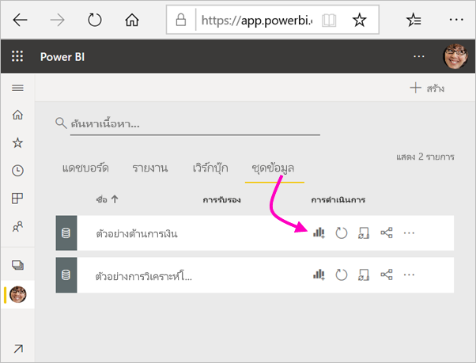

    พื้นที่ทำงานสำหรับรายงานว่างเปล่า เราจะเห็นหน้าต่าง**ตัวกรอง** **การแสดงภาพ** และ**เขตข้อมูล**ทางด้านขวา

    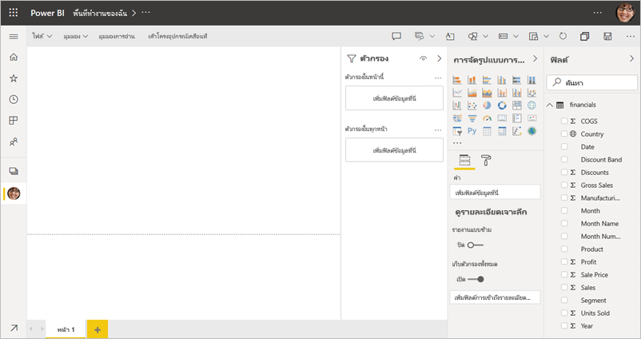

7. โปรดสังเกตว่ามีตัวเลือกสำหรับ**มุมมองการอ่าน**บนแถบนำทางด้านบน เนื่องจากคุณมีตัวเลือกนี้ นั่นหมายความว่าคุณกำลังอยู่ในมุมมองการแก้ไข วิธียอดเยี่ยมในการทำความคุ้นเคยกับตัวแก้ไขรายงานคือ[การแนะนำระบบ](service-the-report-editor-take-a-tour.md)

    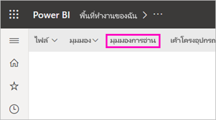

    ขณะอยู่ในมุมมองการแก้ไข คุณสามารถสร้างและปรับเปลี่ยนรายงานของคุณได ้เนื่องจากคุณเป็น*เจ้าของ*รายงาน นั่นคือคุณคือ*ผู้สร้าง* เมื่อคุณแชร์รายงานของคุณกับเพื่อนร่วมงาน พวกเขาเท่านั้นจะสามารถโต้ตอบกับรายงานในมุมมองการอ่าน เพื่อนร่วมงานของคุณเป็น*ผู้บริโภค* เรียนรู้เพิ่มเติมเกี่ยวกับ[มุมมองการอ่าน และมุมมองการแก้ไข](consumer/end-user-reading-view.md)

## ขั้นตอนที่ 2: สร้างแผนภูมิในรายงาน
หลังจากที่คุณเชื่อมต่อกับข้อมูลแล้ว เริ่มต้นสำรวจ  เมื่อคุณพบสิ่งที่น่าสนใจ คุณสามารถสร้างแดชบอร์ดเพื่อตรวจสอบ และดูการเปลี่ยนแปลงเมื่อเวลาผ่านไปได้ มาดูว่าทำงานอย่างไร
    
1. ในตัวแก้ไขรายงาน เราจะเริ่มต้นในบานหน้าต่าง**เขตข้อมูล**ทางด้านขวาของหน้าเพื่อสร้างรูปภาพ เลือกกล่องกาเครื่องหมาย**ยอดขายรวม**และ**วันที่**
   
   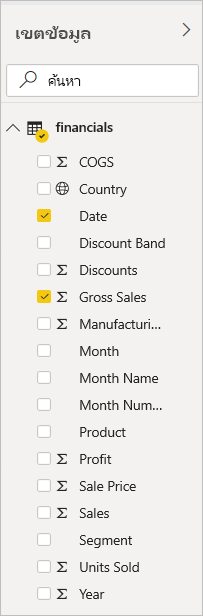

    Power BI วิเคราะห์ข้อมูลและสร้างรูปภาพ ถ้าคุณเลือก**วันที่**ก่อน คุณจะเห็นตาราง ถ้าคุณเลือก**ยอดขายรวม**ก่อน คุณจะเห็นแผนภูมิคอลัมน์ 

2. สลับไปยังวิธีการแสดงข้อมูลของคุณแบบอื่น มาดูข้อมูลนี้เป็นแผนภูมิเส้น เลือกไอคอนแผนภูมิเส้นจากบานหน้าต่าง **การแสดงภาพ**
   
   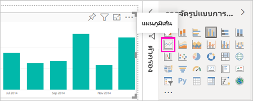

3. แผนภูมินี้น่าสนใจ ดังนั้นให้*ปักหมุด*ที่แดชบอร์ด วางเมาส์เหนือการแสดงภาพแล้วเลือกไอคอนปักหมุด เมื่อคุณปักหมุดการแสดงภาพนี้ ภาพจะถูกเก็บไว้ในแดชบอร์ดของคุณและจะอัปเดตอยู่เสมอเพื่อให้คุณสามารถติดตามค่าล่าสุดได้อย่างรวดเร็ว
   
   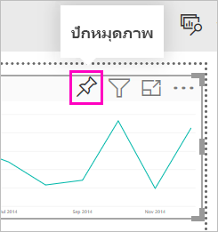

4. เนื่องจากเป็นรายงานใหม่ คุณจะได้รับแจ้งให้บันทึกก่อนที่คุณสามารถปักหมุดการแสดงภาพไปยังแดชบอร์ดได้ ตั้งชื่อรายงานของคุณ (ตัวอย่างเช่น *ยอดขายตามช่วงเวลา*) แล้วเลือก**บันทึก** 

5. เลือก**แดชบอร์ดใหม่** และตั้งชื่อเป็น*ตัวอย่างการเงินสำหรับบทช่วยสอน* 
   
   
   
6. เลือก**หมุด**
   
    ข้อความว่าสำเร็จแล้ว (ใกล้กับมุมบนขวา) ช่วยให้คุณทราบว่าได้เพิ่มการแสดงภาพเป็นไทล์ลงในแดชบอร์ดของคุณแล้ว
   
    

7. ให้เลือก**ไปยังแดชบอร์ด**เพื่อดูแดชบอร์ดใหม่ที่มีแผนภูมิเส้นที่คุณปักหมุดตามไทล์ 
   
   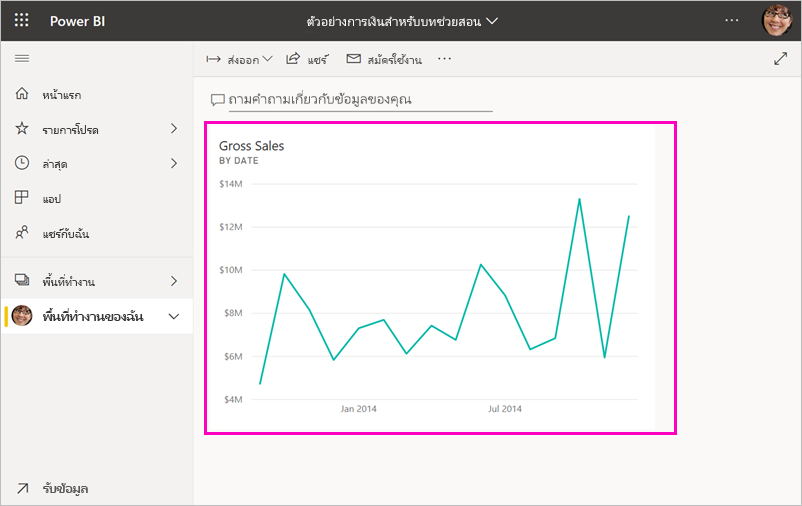
   
8. เลือกไทล์ใหม่บนแดชบอร์ดของคุณพื่อกลับไปยังรายงาน Power BI นำคุณกลับสู่รายงานในมุมมองการอ่าน 

1. เมื่อต้องการสลับกลับไปยังมุมมองการแก้ไข ให้เลือก**ตัวเลือกเพิ่มเติม** (...) จากแถบการนำทางด้านบน > **แก้ไข** เมื่อกลับไปที่มุมมองการแก้ไข คุณสามารถทำการสำรวจและปักหมุดไทล์ได้ต่อไป

    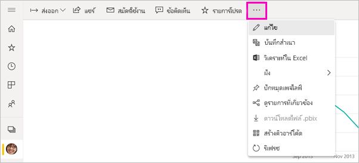

## ขั้นตอนที่ 3: สำรวจด้วยการถามตอบ

หากต้องการสำรวจข้อมูลอย่างรวดเร็ว ลองถามคำถามในกล่องการถามตอบ การถามตอบสร้างการสอบถามด้วยภาษาธรรมชาติเกี่ยวกับข้อมูลของคุณ ในแดชบอร์ด กล่องการถามตอบอยู่ที่ด้านบนสุด (**ถามคำถามเกี่ยวกับข้อมูลของคุณ**) ในรายงาน กล่องนี้อยู่ที่แถบการนำทางด้านบนสุด (**ถามคำถาม**)

1. ถ้าต้องการกลับไปยังแดชบอร์ด ให้เลือก**พื้นที่ทำงานของฉัน**ในแถบ **Power BI** สีดำ

    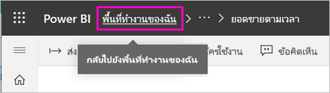

1. บนแท็บ**แดชบอร์ด** ให้เลือกแดชบอร์ดของคุณ

    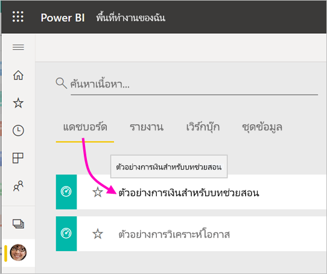

1. เลือก**ถามคำถามเกี่ยวกับข้อมูลของคุณ** การถามตอบนำเสนอคำแนะนำจำนวนมากโดยอัตโนมัติ

    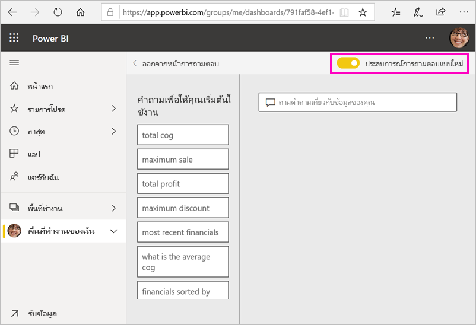

    > [!NOTE]
    > หากคุณไม่เห็นคำแนะนำ ให้เปิดใช้งาน**ประสบการณ์การถามตอบใหม่**

2. คำแนะนำบางอย่างจะเปลี่ยนกลับเป็นค่าเดียว ตัวอย่างเช่น เลือก**ยอดขาย**สูงสุด

    การถามตอบจะค้นหาคำตอบและแสดงในรูปแบบของการแสดงภาพ*การ์ด*

    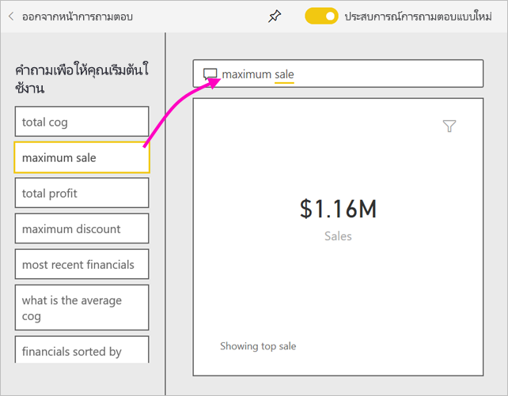

3. เลือกไอคอนหมุด  หากต้องการแสดงการแสดงภาพเกี่ยวกับตัวอย่างการเงินสำหรับแดชบอร์ดบทช่วยสอน

1. เลื่อนลงใน**คำถามเพื่อให้คุณเริ่มต้นระบุ**รายการและเลือก**เฟืองโดยเฉลี่ยสำหรับแต่ละเดือน** 

    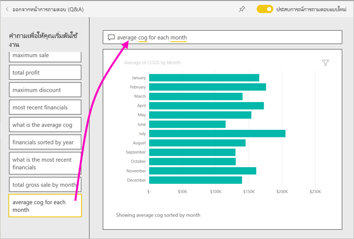

1. ปักหมุดแผนภูมิแท่งที่แดชบอร์ด**ตัวอย่างการเงินสำหรับบทช่วยสอน**ด้วย

1. วางเคอร์เซอร์ด้านหลัง*ตามเดือน*ในกล่องการถามตอบ และพิมพ์*เป็นเส้น* เลือก**เส้น (ประเภทการแสดงภาพ)** 

    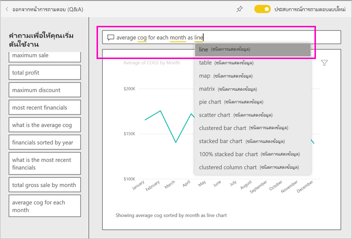

4. เลือก**ออกจากการถามตอบ**เพื่อกลับไปยังแดชบอร์ดของคุณ ซึ่งคุณจะเห็นไทล์ใหม่ที่คุณสร้างไว้ 

   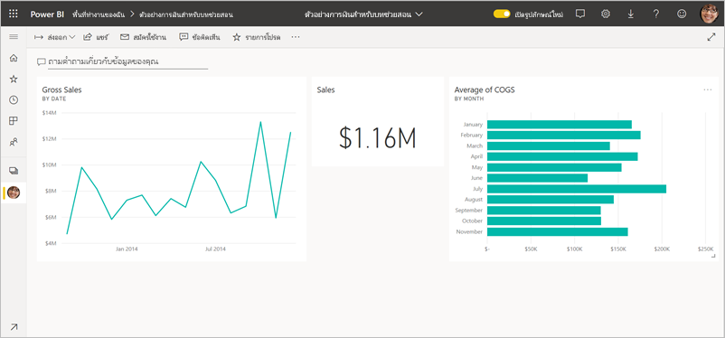

   แม้ว่าคุณจะเปลี่ยนแผนภูมิเป็นแผนภูมิเส้นแล้ว แต่คุณก็ยังมองเห็นได้ เนื่องจากไทล์ยังเป็นแผนภูมิแท่งตามรูปแบบที่คุณปักหมุดไว้ 

## ขั้นตอนที่ 4: การจัดตำแหน่งไทล์ใหม่

แดชบอร์ดกว้าง เราสามารถจัดเรียงไทล์ใหม่เพื่อทำให้การใช้งานพื้นที่แดชบอร์ดดียิ่งขึ้นได้

1. ลากมุมขวาล่างของไทล์แผนภูมิเส้น*ยอดขายรวม*ขึ้นไปด้านบน จนกว่าจะมีความสูงเท่ากับไทล์ยอดขาย จากนั้นจึงปล่อย

    

    ในตอนนี้ ทั้งสองไทล์จึงมีความสูงเท่ากัน

    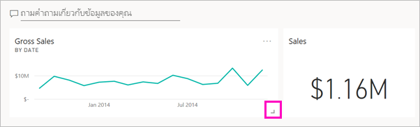

1. ลากไทล์แผนภูมิแท่ง*ค่าเฉลี่ย COGS* จนกว่าจะอยู่ที่ด้านล่างแผนภูมิเส้น*ยอดขายรวม*พอดี

    การจัดตำแหน่งช่วยให้ดูดีขึ้น

    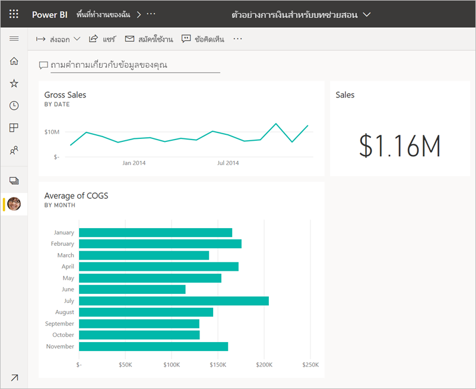

## ขั้นตอนที่ 5: โต้ตอบกับไทล์

ส่วนนี้คือหนึ่งในการโต้ตอบครั้งสุดท้ายที่จะต้องสังเกต ก่อนที่คุณจะเริ่มสร้างแดชบอร์ดและรายงานของคุณเอง การเลือกไทล์ที่แตกต่างกันให้ผลลัพธ์ที่แตกต่างกัน 

1. ขั้นตอนแรก ให้เลือกไทล์แผนภูมิเส้น*ยอดขายรวม*ที่คุณปักหมุดจากรายงาน 

    Power BI เปิดรายงานในมุมมองการอ่าน 

2. เลือกปุ่มย้อนกลับของเบราว์เซอร์ 

1. ตอนนี้ให้เลือกไทล์แผนภูมิแท่ง*ค่าเฉลี่ยของ COGS* ที่คุณสร้างขึ้นในการถามตอบ 

    Power BI ไม่เปิดรายงาน แต่การถามตอบจะเปิดรายงานแทน เนื่องจากคุณสร้างแผนภูมินี้ที่นั่น

## เพิ่มพื้นที่ทรัพยากร
ในตอนนี้ คุณสำเร็จบทช่วยสอนแล้ว คุณสามารถลบชุดข้อมูล รายงานและแดชบอร์ดได้ 

1. ในแถบนำทางด้านซ้าย ตรวจสอบให้แน่ใจว่าคุณอยู่ใน**พื้นที่ทำงานของฉัน**
2. เลือกแท็บ**ชุดข้อมูล**และค้นหาชุดข้อมูลที่คุณนำเข้าสำหรับบทช่วยสอนนี้  
3. เลือก **ตัวเลือกเพิ่มเติม** (...) > **ลบ**

    

    เมื่อคุณลบชุดข้อมูล คุณจะเห็นคำเตือนว่า**รายงานทั้งหมดและแดชบอร์ดที่มีข้อมูลจากชุดข้อมูลจะถูกลบออกไป**

4. เลือก**ลบ**

## ขั้นตอนถัดไป

ทำให้แดชบอร์ดของคุณดียิ่งขึ้นด้วยการเพิ่มไทล์การแสดงภาพเพิ่มเติม และ[การเปลี่ยนชื่อ การเปลี่ยนขนาด การสร้างลิงก์ และการจัดตำแหน่งใหม่](service-dashboard-edit-tile.md)

