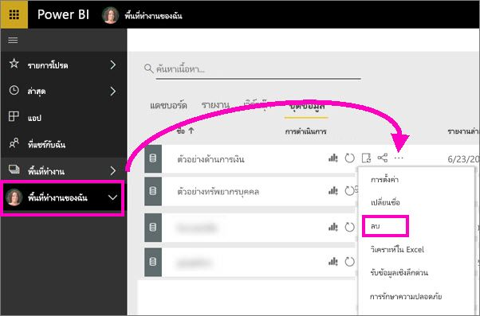

# บทช่วยสอน: เริ่มต้นใช้งานบริการ Power BI (app.powerbi.com)
บทเรียนนี้ช่วยให้คุณเริ่มต้นใช้งาน***Power BI service***  สำหรับทำความเข้าใจว่า Power BI service เหมาะสมกับข้อเสนอ Power BI อื่นๆอย่างไร เราขอแนะนำให้ คุณเริ่มต้นด้วยการอ่าน[Power BI คืออะไร](power-bi-overview.md)

ในบทช่วยสอนนี้ คุณจะทำขั้นตอนต่อไปนี้ให้เสร็จสมบูรณ์:

> [!div class="checklist"]
> * ค้นหาสิ่งอื่นๆ โดยเริ่มต้นใช้งานเนื้อหาของบริการ Power BI
> * ลงชื่อเข้าใช้บัญชี Power BI ของคุณ หรือลงทะเบียน ถ้าคุณยังไม่มีบัญชี
> * เปิดบริการ Power BI
> * รับข้อมูลบางอย่าง และเปิดในมุมมองรายงาน
> * ใช้ข้อมูลนั้นเพื่อสร้างการแสดงภาพ และบันทึกเป็นรายงาน
> * สร้างแดชบอร์ด โดยปักหมุดไทล์จากรายงาน
> * เพิ่มการแสดงภาพที่แดชบอร์ดของคุณโดยใช้ถามตอบเครื่องมือภาษาธรรมชาติ
> * ล้างข้อมูล โดยการลบชุดข้อมูล รายงาน และแดชบอร์ด

## ลงทะเบียนเพื่อใช้งานบริการของ Power BI
ถ้าคุณยังไม่ได้ลงทะเบียนเพื่อใช้ [Power BI Pro](https://app.powerbi.com/signupredirect?pbi_source=web) ลงทะเบียน Power BI Pro แบบทดลองใช้ฟรี ก่อนที่คุณจะเริ่มต้น

ถ้าคุณมีบัญชีผู้ใช้ เปิดเบราว์เซอร์ และพิมพ์ app.powerbi.com เพื่อเปิด Power BI service. 

ถ้าคุณกำลังมองหาความช่วยเหลือเกี่ยวกับ Power BI Desktop ให้ดู[เริ่มต้นใช้งานเดสก์ท็อป](desktop-getting-started.md) ถ้าคุณกำลังมองหาความช่วยเหลือเกี่ยวกับ Power BI สำหรับอุปกรณ์เคลื่อน ให้ดู[แอป Power BI สำหรับอุปกรณ์เคลื่อนที่](consumer/mobile/mobile-apps-for-mobile-devices.md)

> [!TIP]
> ต้องการหลักสูตรฝึกอบรมด้วยตนเองแบบฟรีแทนหรือไม่ [ลงทะเบียนในหลักสูตรการวิเคราะห์และแสดงข้อมูลบน EdX ของเรา](http://aka.ms/edxpbi)

เยี่ยมชม[เพลย์ลิสต์ของเราบน YouTube](https://www.youtube.com/playlist?list=PL1N57mwBHtN0JFoKSR0n-tBkUJHeMP2cP) เริ่มต้นด้วยวิดีโอดีๆที่แนะนำ Power BI servic
> 
> <iframe width="560" height="315" src="https://www.youtube.com/embed/B2vd4MQrz4M" frameborder="0" allowfullscreen></iframe>
> 

## บริการ Power BI คืออะไร
บริการ Microsoft Power BI ในบางครั้งเรียกว่า Power BI แบบออนไลน์หรือ app.powerbi.com Power BI ช่วยให้คุณรู้ข้อมูลทันสมัยที่สำคัญสำหรับคุณ  ด้วยบริการ Power BI ***แดชบอร์ด***ช่วยให้คุณสามารถเฝ้่าระหวังความเสี่ยงของธุรกิจของคุณได้  แดชบอร์ดของคุณแสดง***ไทล์***ที่คุณสามารถคลิกเพื่อเปิด***รายงาน***เพื่อดูเพิ่มเติม  เชื่อมต่อกับหลาย***ชุดข้อมูล***เมื่อต้องการนำข้อมูลเกี่ยวข้องทั้งหมดมารวมกันในที่เดียว ต้องการความช่วยเหลือในการทำความเข้าใจเกี่ยวกับบล็อกที่สร้าง Power BI หรือไม่  ดู[Power BI แนวคิดพื้นฐาน](consumer/end-user-basic-concepts.md)

ถ้าคุณมีข้อมูลที่สำคัญในไฟล์ Excel หรือ CSV คุณสามารถสร้างแดชบอร์ด Power BI เพื่อรับข่าวสารที่ใดก็ได้ และแชร์ข้อมูลเชิงลึกกับผู้อื่น  คุณได้การสมัครใช้งานแอปพลิเคชัน SaaS เช่น Salesforce หรือไม่  เริ่มต้นด้วยการเชื่อมต่อกับ Salesforce เพื่อสร้างแดชบอร์ดโดยอัตโนมัติจากข้อมูลนั้น หรือ[ดูแอป SaaS อื่น ๆ ทั้งหมด](service-get-data.md)ที่คุณสามารถเชื่อมต่อได้ ถ้าคุณเป็นส่วนหนึ่งขององค์กร ให้พิจารณาว่า[apps](service-create-distribute-apps.md)ใดเคยเผยแพร่ให้คุณหรือไม่

อ่านเกี่ยวกับวิธีอื่นๆทั้งหมด ในการ[เอาข้อมูลให้ Power BI](service-get-data.md)

## ขั้นตอนที่ 1: รับข้อมูล
นี่คือตัวอย่างของการรับข้อมูลจากไฟล์ CSV ต้องเรียนไปกับบทเรียนนี้ใช่หรือไม่ [ดาวน์โหลดไฟล์ CSV ตัวอย่างนี้](http://go.microsoft.com/fwlink/?LinkID=521962)

1. [ลงชื่อเข้าใช้ Power BI](http://www.powerbi.com/) ไม่มีบัญชีใช่หรือ ไม่ต้องกังวล คุณสามารถลงทะเบียนเพื่อทดลองใช้ฟรี
2. Power BI เปิดในเบราว์เซอร์ของคุณ เลือก**รับข้อมูล**ที่ด้านล่างของ บานหน้าต่างนำทางด้านซ้ายมือ
   
   
3. เลือก**ไฟล์** 
   
   
4. เรียกดูไฟล์บนคอมพิวเตอร์ของคุณ และเลือก**เปิด** ถ้าคุณบันทึกไว้ใน OneDrive for Business ให้เลือกตัวเลือกนั้น ถ้าคุณบันทึกไว้ในเครื่อง ให้เลือก**ไฟล์ภายในเครื่อง** 
   
   
5. สำหรับบทเรียนนี้ เราจะเลือก**นำเข้า**เมื่อต้องเพิ่มไฟล์ Excel ให้เป็นชุดข้อมูลที่เราสามารถใช้เพื่อสร้างรายงานและแดชบอร์ด ถ้าคุณเลือก**อัปโหลด**เวิร์กบุ๊ก Excel ทั้งหมดถูกอัปโหลดไปยัง Power BI ซึ่งคุณสามารถเปิด และแก้ไขใน Excel online
   
   
6. เมื่อชุดข้อมูลของคุณพร้อมแล้ว ให้เลือก**มุมมองชุดข้อมูล**เมื่อต้องเปิดในตัวแก้ไขรายงาน 

    

    เนื่องจากเรายังไม่ได้สร้างรูปภาพใดๆ พื้นที่รายงานจะว่างเปล่า

    

6. ดูที่แถบเมนูด้านบน และสังเกตเห็นว่า ไม่มีตัวเลือกสำหรับ**มุมมองการอ่าน** เนื่องจากคุณมีตัวเลือกสำหรับมุมมองการอ่าน ซึ่งหมายความว่า คุณกำลังอยู่ใน**มุมมองการแก้ไข** 

    

    ขณะอยู่ในมุมมองการแก้ไขคุณสามารถสร้างและปรับเปลี่ยนรายงานของคุณได ้เนื่องจากคุณเป็น*เจ้าของ*ของรายงาน คุณจะเป็น*ผู้สร้าง* เมื่อคุณแชร์รายงานของคุณกับเพื่อนร่วมงาน พวกเขาจะเท่านั้นจะสามารถโต้ตอบกับรายงานในมุมมองการอ่าน พวกเขาเป็น*ผู้บริโภค* เรียนรู้เพิ่มเติมเกี่ยวกับ[มุมมองการอ่าน และมุมมองการแก้ไข](consumer/end-user-reading-view.md)
    
    วิธียอดเยี่ยมในการทำความคุ้นเคยกับตัวแก้ไขรายงานคือการ[ชมระบบ](service-the-report-editor-take-a-tour.md)
   > 
 

## ขั้นตอนที่ 2 เริ่มต้นสำรวจชุดข้อมูลของคุณ
หลังจากที่คุณเชื่อมต่อกับข้อมูลแล้ว เริ่มต้นสำรวจ  เมื่อคุณพบสิ่งที่น่าสนใจ คุณสามารถสร้างแดชบอร์ดเพื่อตรวจสอบ และดูการเปลี่ยนแปลงเมื่อเวลาผ่านไปได้ มาดูว่าทำงานอย่างไร
    
1. ในตัวแก้ไขรายงาน เราจะใช้บานหน้าต่าง**เขตข้อมูล**ทางด้านขวาของหน้าเพื่อสร้างรูปภาพ  เลือกกล่องกาเครื่องหมายข้าง**ยอดขายรวม**และ**วัน**
   
   

2. Power BI วิเคราะห์ข้อมูลและสร้างรูปภาพ  ถ้าคุณเลือก**วัน**ก่อน คุณจะเห็นตาราง  ถ้าคุณเลือก**ยอดขายรวม**ก่อน คุณจะเห็นแผนภูมิ สลับไปยังวิธีการแสดงข้อมูลของคุณแบบอื่น มาดูข้อมูลนี้เป็นแผนภูมิเส้น เลือกไอคอนแผนภูมิเส้น (หรือที่เรียกว่าเทมเพลต) จาก**บานหน้าต่างการแสดงรูปภาพ**
   
   

3. สิ่วนี้น่าสนใจ ดังนั้นให้*ปักหมุด*ที่แดชบอร์ด เลืื่อนเคอร์เซอร์เหนือการแสดงรูปภาพและเลือกไอคอน**หมุด**  เมื่อคุณปักหมุดการแสดงภาพนี้ มันจะถูกเก็บไว้ในแดชบอร์ดของคุณและจะอัพเดตอยู่เสมอเพื่อให้คุณสามารถติดตามค่าล่าสุดได้อย่างรวดเร็ว
   
   

4. เนื่องจากเป็นรายงานใหม่ คุณจะได้รับการถามให้บันทึกก่อนที่คุณสามารถปักหมุดภาพที่แดชบอร์ด ตั้งชื่อรายงานของคุณ (เช่น*ยอดขายตามช่วงเวลา*) แล้วเลือก**บันทึกและดำเนินต่อ** 
   
   
   
5. ให้ปักหมุดแผนภูมิเส้นในแดชบอร์ดใหม่ และตั้งชื่อเป็น "ตัวอย่างการเงินสำหรับบทเรียน" 
   
   
   
1. เลือก**หมุด**
   
    ข้อความว่าสำเร็จแล้ว (ใกล้กับมุมบนขวา) ช่วยให้คุณทราบว่า การแสดงภาพถูกเพิ่ม เป็นไทล์ ลงในแดชบอร์ดของคุณ
   
    

6. ให้เลือก**ไปยังแดชบอร์ด**เพื่อดูแผน ภูมิปักหมุด ตามไทล์ แดชบอร์ดใหม่ของคุณ ทำให้แดชบอร์ดของคุณได้ดียิ่งขึ้น ด้วยการเพิ่มไทล์การแสดงภาพเพิ่มเติม และ[เปลี่ยนชื่อ ขนาด ลิงก์ และการจัดตำแหน่งใหม่ไทล์](service-dashboard-edit-tile.md)
   
   
   
   เลือกไทล์ใหม่บนแดชบอร์ดของคุณเมื่อต้องกลับไปยังรายงานเมื่อใดก็ Power BI พาคุณกลับสู่ตัวแก้ไขรายงานในมุมมองการอ่าน เมื่อต้องการสลับกลับไปยังมุมมองการแก้ไข ให้เลือก**แก้ไขรายงาน**จากแถบเมนูด้านบน มุมมองการแก้ไขหนึ่งครั้ง ดูต่อและปักหมุดไทล์ 

## ขั้นตอนที่ 3: สำรวจต่อไปด้วย Q&A (แบบสอบถามภาษาธรรมชาติ)
1. หากต้องการสำรวจข้อมูลอย่างรวดเร็ว ลองถามคำถามในกล่อง Q&A กล่อง Q&A จะอยู่ที่ด้านบนของแดชบอร์ดของคุณ (**ถามคำถามเกี่ยวกับข้อมูลของคุณ**) และ ในแถบเมนูด้านบนในรายงานของคุณ (**ถามคำถาม**) ตัวอย่างเช่น ลองพิมพ์ "เซกเมนต์ใดมีรายได้ส่วนใหญ่"
   
   

2. ถามตอบ ค้นหาคำตอบและแสดงในรูปแบบการแสดงรูปภาพ เลือกไอคอนหมุด  เพื่อแสดงแสดงภาพนี้บนแดชบอร์ดของคุณเช่นกัน
3. ปักหมุดการแสดงภาพที่แดชบอร์ด "ตัวอย่างการเงินสำหรับบทเรียน"
   
    

4. กลับไปยังแดชบอร์ดของคุณที่คุณจะเห็นไทล์ใหม่

   

## เพิ่มพื้นที่ทรัพยากร
ในตอนนี้ คุณสำเร็จบทช่วยสอนแล้ว คุณสามารถลบชุดข้อมูล รายงานและแดชบอร์ดได้ 

1. ในแถบนำทางด้านซ้าย ให้เลือก **พื้นที่ทำงานของฉัน**
2. เลือกแท็บ**ชุดข้อมูล**และค้นหาชุดข้อมูลที่คุณนำเข้าสำหรับบทช่วยสอนนี้  
3. เลือกจุดไข่ปลา (...) > **ลบ**

    

    การลบชุดข้อมูลจะลบรายงานและแดชบอร์ด 

## ขั้นตอนถัดไป
พร้อมที่จะลองเพิ่มหรือไม่  นี่เป็นวิธียอดเยี่ยมเพื่อสำรวจ Power BI

> [!div class="nextstepaction"]
> [เชื่อมต่อกับบริการออนไลน์ที่คุณใช้](consumer/end-user-connect-to-services.md)

