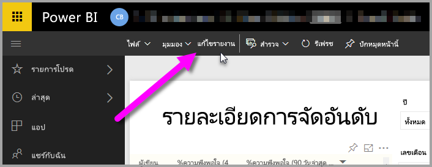
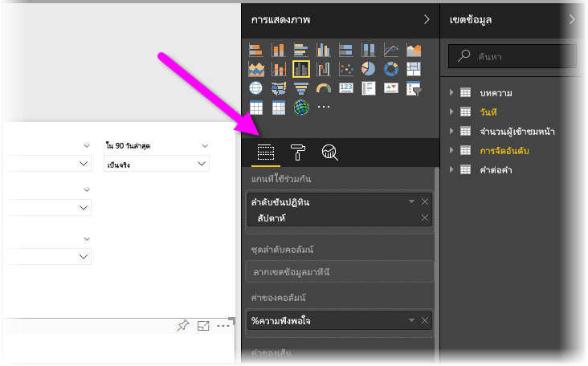
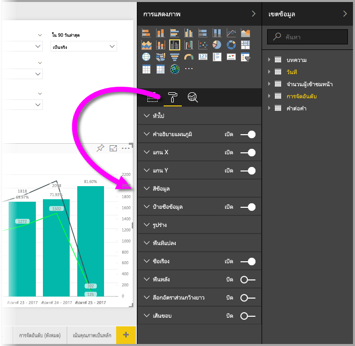
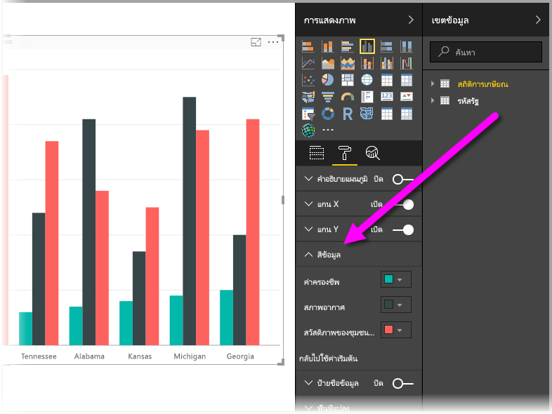
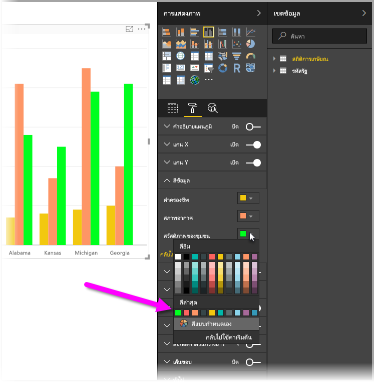
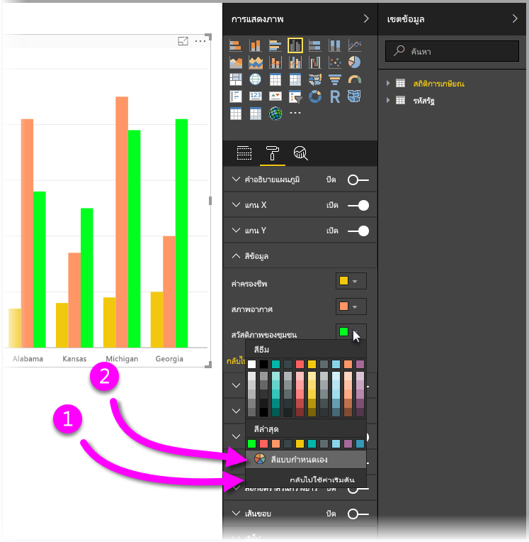
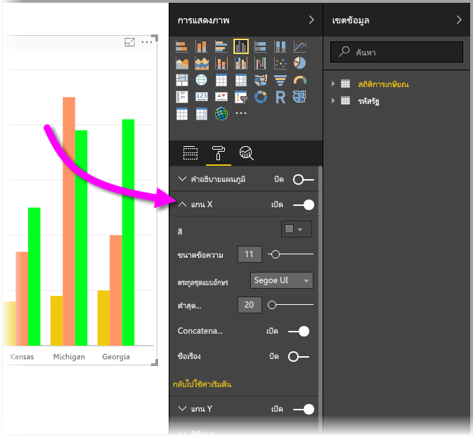

# เริ่มใช้งานด้วยคุณสมบัติแกนและการจัดรูปแบบสี
ใน**Power BI** คุณก็สามารถเปลี่ยนสีของชุดข้อมูล จุดข้อมูล และแม้แตพื้นหลังของการแสดงภาพได้ คุณยังสามารถเปลี่ยนวิธีการนำเสนอข้อมูลที่แกน X และแกน Y ซึ่งจะช่วยให้คุณสามารถจัดการลักษณะที่ปรากฏของแดชบอร์ดและรายงานของคุณได้อย่างเต็มที่

เมื่อต้องการเริ่มต้นใช้งาน ให้เลือก**รายงาน**จากบานหน้าต่าง **พื้นที่งานของฉัน** จากนั้นในส่วนพื้นที่เมนูด้านบน ให้เลือก**แก้ไขรายงาน**  

เมื่อคุณกำลังแก้ไขรายงาน และคุณมีการแสดงภาพที่เลือกไว้ บานหน้าต่าง**การแสดงภาพ**จะปรากฏขึ้น ซึ่งจะช่วยให้คุณสามารถเพิ่ม หรือเปลี่ยนแปลงการแสดงภาพได้ ไอคอนด้านล่างการแสดงภาพที่พร้อมใช้งานนี้ คือ ไอคอนสามไอคอน ได้แก่: ไอคอน**เขตข้อมูล** (แถบเรียงซ้อน) ไอคอน**รูปแบบ** (แปรงลูกกลิ้ง) และไอคอน**การวิเคราะห์**(แว่นขยาย) ในรูปด้านล่าง มีการเลือก**เขตข้อมูล**ไว้ โดยสังเกตได้จากแถบสีเหลืองที่อยู่ด้านล่างไอคอน

เมื่อคุณเลือก**รูปแบบ** พื้นที่ด้านล่างไอคอนก็จะแสดงการกำหนดรูปแบบสีและแกนแบบกำหนดเองที่พร้อมใช้งานสำหรับการแสดงภาพที่เลือกไว้ในปัจจุบัน  

คุณสามารถกำหนดองค์ประกอบของแต่ละการแสดงภาพเองได้อย่างมากมาย ได้แก่:

* คำอธิบายแผนภูมิ
* แกน X
* แกน Y
* สีข้อมูล
* ป้ายชื่อข้อมูล
* รูปร่าง
* พื้นที่การลงจุด
* ชื่อเรื่อง
* พื้นหลัง
* ล็อกอัตราส่วนกว้างยาว
* เส้นขอบ

> [!NOTE]
>  
> คุณจะไม่เห็นองค์ประกอบเหล่านี้ทั้งหมดรวมทั้งการแสดงภาพแต่ละชนิด การแสดงภาพที่คุณเลือกไว้จะมีผลต่อรูปแบบการกำหนดเองที่พร้อมใช้งาน ตัวอย่างเช่น คุณจะไม่เห็นแกน X ถ้าคุณมีแผนภูมิวงกลมที่เลือกไว้ เนื่องจากแผนภูมิวงกลมไม่มีแกน X
> 
> 

นอกจากนี้ โปรดทราบว่า ถ้าคุณไม่มีการแสดงภาพที่เลือกไว้ **ตัวกรอง**ก็จะปรากฏขึ้นแทนไอคอนซึ่งจะช่วยให้คุณสามารถนำตัวกรองไปใช้กับการแสดงภาพทั้งหมดในหน้าได้

ขอยกตัวอย่างสักสองตัวอย่าง ดังนี้: ตัวอย่างแรกคือการใช้งานแบบมีสีสัน และอีกตัวอย่างหนึ่งคือการเปลี่ยนแปลงคุณสมบัติของแกน ด้วยเหตุนี้ คุณจึงควรเตรียมพร้อมที่จะมีเวลามากพอตลอดทั้งวันในการกำหนดรูปแบบสี แกน และป้ายชื่อเอง

## การใช้งานแบบมีสีสัน
ลองทำตามขั้นตอนสำคัญที่จะต้องใช้ในการกำหนดรูปแบบสีในแผนภูมิ

1. ฉันเลือก**แผนภูมิกลุ่มคอลัมน์**จากพื้นทำงานสำหรับรายงาน
2. ถัดมา ฉันเลือกไอคอน**รูปแบบ** ที่จะแสดงการกำหนดเองที่พร้อมใช้งาน
3. จากนั้น ฉันเลือกลูกศรชี้ลงที่มีขนาดเล็กทางด้านซ้ายของการกำหนด**สีข้อมูล**เอง ซึ่งจะแสดงวิธีการที่ฉันสามารถกำหนดสีข้อมูลเอง โดยมีตัวเลือกที่จะใช้เฉพาะกับการแสดงภาพที่เลือกไว้
4. **สีข้อมูล**จะขยายลงด้านล่าง เพื่อแสดงการกำหนดสีข้อมูลเองที่พร้อมใช้งาน  
   

ลองทำการเปลี่ยนแปลงบางอย่าง ฉันสามารถเลือกลูกศรชี้ลงที่อยู่ถัดจากสี เพื่อทำการเปลี่ยนแปลงชุดข้อมูลที่พร้อมใช้งานแต่ละชุด ฉันจะกำหนดให้**ค่าครองชีพ**เป็นสีเหลือง**สภาพอากาศ**ฉันจะให้เป็นสีส้ม และ**สวัสดิภาพของชุมชน**จะเป็นสีเขียว หน้าจอต่อไปนี้จะปราฏกขึ้นในขั้นตอนสุดท้าย เพื่อทำการเปลียนแปลง**ค่าครองชีพ**  

การเปลี่ยนแปลงดังกล่าวจะแสดงอยู่ในรูปด้านล่าง ว้าว นั่นคือแผนภูมิที่ดูสดใส นี่คือองค์ประกอบที่มีประโยชน์บางส่วนที่ควรจะต้องทราบในการใช้งานด้วยสีต่างๆ ตัวเลขในรายการต่อไปนี้จะยังปรากฏอยู่ในหน้าจอต่อไปนี้ โดยจะระบุว่าคุณจะสามารถเข้าใข้งานหรือเปลี่ยนแปลงองค์ประกอบใดบ้างในองค์ประกอบที่มีประโยขน์เหล่านี้

1. คุณไม่ชอบสีสันใช่หรือไม่ ไม่มีปัญหา เพียงเลือก**แปลงกลับเป็นค่าเริ่มต้น**และสิ่งที่คุณเลือกจะเปลี่ยนกลับเป็นค่าเริ่มต้น คุณสามารถทำเช่นนั้นกับสีใดสีหนึ่ง หรือการแสดงภาพทั้งหมดได้
2. ต้องการสีที่คุณไม่เห็นในชุดแบบสีหรือไม่ เพียงเลือก**สีแบบกำหนดเอง** และเลือกจากแถบสเปกตรัมสี  
   

ไม่ได้ชื่นชอบกับการเปลี่ยนแปลงที่คุณเพิ่งทำใช่หรือไม่ ใช ้**CTRL + Z** เมื่อต้องการเลิกทำ ในลักษณะเดียวกับที่คุณใช้ดำเนินการ

## การเปลี่ยนแปลงคุณสมบัติแกน
มักจะมีประโยชน์ในการปรับเปลี่ยนแกน X หรือแกน Y คล้ายกับการใช้งานแบบมีสีสัน คุณสามารถปรับเปลี่ยนแกนได้โดยเลือกไอคอนลูกศรชี้ลงทางด้านซ้ายของแกนคุณต้องการเปลี่ยนแปลง ดังที่แสดงในรูปต่อไปนี้  

ถ้าคุณต้องการยุบตัวเลือก**แกน X** เพียงเลือกไอคอนลูกศรชี้ขึ้นที่อยู่ด้านข้าง**แกน X**

คุณสามารถเอาป้ายชื่อแกน X ทั้งหมดออกได้ โดยสลับปุ่มตัวเลือกที่อยู่ด้านข้าง**แกน X** ได้ คุณยังสามารถเลือกได้ว่าจะเปิดหรือปิดใช้งานชื่อแกนได้ โดยเลือกปุ่มตัวเลือกที่อยู่ถัดจาก**ชื่อเรื่อง**ได้  

มีทุกประเภทที่สามารถเลือกได้ และการกำหนดเองเพิ่มเติมจำนวนมากมายที่คุณสามารถนำไปใช้กับแดชบอร์ดและรายงาน Power BI ของคุณได้

> [!NOTE]
>  
> สี แกน และการกำหนดเองที่เกี่ยวข้องเหล่านี้จะพร้อมใช้งาน เมื่อเลือกไอคอน**รูปแบบ**ไว้ และพร้อมใช้งานใน Power BI Desktop
> 
> 

## ขั้นตอนถัดไป
สำหรับข้อมูลเพิ่มเติม โปรดดูบทความต่อไปนี้:  

* [คำแนะนำและเคล็ดลับในการจัดรูปแบบสีใน Power BI](service-tips-and-tricks-for-color-formatting.md)  

