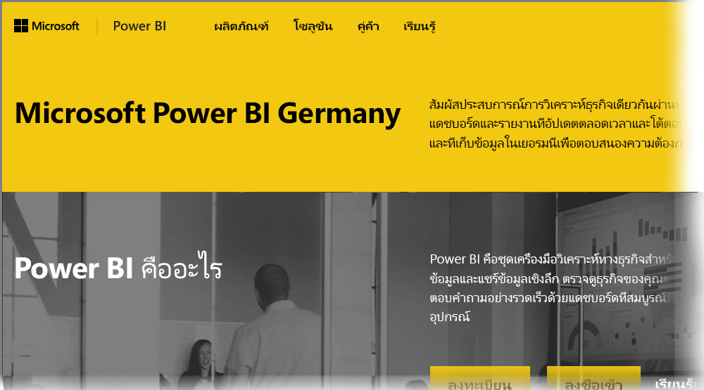

# ถามที่ถามบ่อยสำหรับ Power BI สำหรับลูกค้าระบบคลาวด์ประเทศเยอรมนี
**บริการ Power BI**มีเวอร์ชันที่พร้อมใช้งานสำหรับลูกค้าสหภาพยุโรป/ข้อตกลงการค้าเสรียุโรป/ยุโรป (EU/EFTA) มักจะอ้างอิงถึงเป็น Deutschland Microsoft Cloud (MCD) **บริการ Power BI**ในเวอร์ชันที่อธิบายไว้ในบทความนี้เป็นบริการเฉพาะสำหรับลูกค้า EU/EFTA และแยกต่างหากออกมา รวมทั้งแตกต่างจากเวอร์ชันเชิงพาณิชย์ของ**บริการ Power BI** หรือบริการ Power BI ที่จัดหาสำหรับลูกค้าภาครัฐบาล

## คำถามและคำตอบ

คำถามและคำตอบต่อไปนี้แสดงข้อมูลสำคัญสำหรับบริการ Power BI Pro ใน Microsoft Cloud Deutschland (MCD) ซึ่งก็คือ ระบบคลาวด์บริการ Power BI ที่จัดให้มีสำหรับลูกค้า EU/EFTA โดยเฉพาะ

1. **บริการ Power BI สำหรับระบบคลาวด์ประเทศเยอรมนี (Germany Cloud) คืออะไร?**
   
   บริการ Power BI สำหรับลูกค้าใน EU/EFTA ยังหมายถึง Microsoft Cloud Deutschland (MCD) ซึ่งเป็นระบบคลาวด์ที่เป็นไปตามกฎข้อบังคับ EU/EFTA ด้วยบริการ Power BI ที่จัดส่งจากศูนย์ข้อมูลของประเทศเยอรมนี ข้อมูลทั้งหมดของลูกค้าในบริการ Power BI สำหรับระบบคลาวด์ EU/EFTA จะได้รับการจัดเก็บอยู่ในประเทศเยอรมนีด้วย T-Systems ที่ทำงานเป็นผู้ดูแลข้อมูลอิสระของประเทศเยอรมนี และด้วยการเข้าถึงข้อมูลทั้งทางกายภาพและทางตรรกะที่ควบคุมโดยกฎหมายในประเทศเยอรมนี บริการ Power BI สำหรับระบบคลาวด์ EU/EFTA จำเป็นต้องมีบัญชีที่แตกต่างและแยกต่างหากจากเวอร์ชันเชิงพาณิชย์ของบริการ Power BI เรียนรู้เพิ่มเติมเกี่ยวกับ Microsoft Cloud Deutschland [ที่นี่](https://www.microsoft.com/trustcenter/cloudservices/nationalcloud)
2. **ฉันสามารถค้นหาราคาและลงทะเบียนข้อมูลบริการ Power BI สำหรับระบบคลาวด์ประเทศเยอรมนี (Germany Cloud) ได้จากที่ใด?**
   
   คุณจะพบข้อมูลมากมายบน[โฮมเพจ Power BI Germany Cloud ](https://powerbi.microsoft.com/power-bi-germany/)รวมถึงข้อมูลราคา นอกจากนี้ ในหน้านั้นคุณยังสามารถค้นหาลิงก์ไปยังการลงทะเบียนสำหรับ**บริการ Power BI Pro** เวอร์ชันทดลองใช้ 30 วันด้วย 25 สิทธิ์การใช้งานของผู้ใช้ด้วย คุณมีตัวเลือกในการซื้อหรือเพิ่มสิทธิ์การใช้งานเพิ่มเติมตามความจำเป็น โดยเป็นส่วนหนึ่งของการลงทะเบียนทดลองใช้ นอกจากนี้แล้ว เรายังมีข้อเสนอสำหรับ Enterprise Agreement (EA) ภาครัฐ และองค์กรไม่แสวงหาผลกำไรด้วย ติดต่อตัวแทนลูกค้าของ Microsoft ของคุณสำหรับรายละเอียดเพิ่มเติม
3. **ฉันมีผู้เช่า Germany Cloud เป็นส่วนหนึ่งของการสมัครใช้งาน Azure Germany และ/หรือ Office 365 Germany ฉันสามารถใช้ผู้เช่าที่มีอยู่เพื่อลงทะเบียนสำหรับ Power BI Germany ได้หรือไม่?**
   
   ใช่ คุณจะมีตัวเลือกในการเข้าสู่ระบบด้วยบัญชีผู้ดูแลระบบผู้เช่า Germany Cloud ที่มีอยู่ และเพิ่มสิทธิ์การใช้งานบริการ Power BI Pro ลงในผู้เช่าปัจจุบันของคุณในระบบ Cloud Germany ซึ่งนี่เป็นส่วนหนึ่งของกระบวนการการลงทะเบียน โปรดทราบว่าผู้เช่า Germany Cloud และบัญชีผู้ใช้จะแตกต่างจากบริการ Power BI สำหรับ Germany Cloud
4. **มีบริการฟรีในบริการ Power BI สำหรับ Germany Cloud หรือไม่?**
   
   หมายเลข เราไม่มีเวอร์ชันสิทธิ์การใช้งานฟรีในบริการ Power BI สำหรับ Germany Cloud อย่างไรก็ตาม เราขอแนะนำให้คุณลงทะเบียนสำหรับ[Power BI ฟรีที่นำเสนอในระบบคลาวด์สาธารณะของเรา](https://powerbi.microsoft.com/get-started/)ถ้าความต้องการทางธุรกิจของคุณตอบสนองด้วยข้อเสนอฟรีของ Power BI
5. **ฉันสามารถใช้ Power BI Desktop, Power BI Mobile เกตเวย์ข้อมูลภายในองค์กร และ Publisher สำหรับ Excel กับบริการ Power BI สำหรับ Germany Cloud ได้หรือไม่?**
   
   ใช่ เราได้ปรับปรุงผลิตภัณฑ์ Power BI ไคลเอ็นต์ของเราเพื่อให้ทำงานได้อย่างราบรื่นกับบริการ Power BI สำหรับ Germany Cloud กรุณาเข้าสู่ระบบด้วยบริการ Power BI ของคุณสำหรับบัญชีผู้ใช้ Germany Cloud เพื่อเริ่มใช้งานผลิตภัณฑ์ไคลเอ็นต์เดียวกันด้วยบริการ Power BI สำหรับ Germany Cloud คุณสามารถดาวน์โหลดผลิตภัณฑ์ไคลเอ็นต์เวอร์ชันล่าสุดได้จากตำแหน่งที่ตั้งต่อไปนี้:
   
   * [Power BI Desktop](https://powerbi.microsoft.com/desktop/)
   * [Power BI Mobile](https://powerbi.microsoft.com/mobile/)
   * [On-premises data gateway (เกตเวย์ข้อมูลภายในองค์กร)](https://powerbi.microsoft.com/gateway/)
   * [Power BI Publisher สำหรับ Excel](https://powerbi.microsoft.com/excel-dashboard-publisher/)
6. **มีข้อจำกัดใดหรือไม่สำหรับคุณลักษณะของบริการ Power BI สำหรับ Germany Cloud?**
   
   คุณลักษณะบริการต่อไปนี้ขณะนี้ไม่พร้อมใช้งานในบริการ Power BI สำหรับ Germany Cloud:
   
   * เผยแพร่บนเว็บ
   * ArcGIS maps โดยทาง Esri
   * Power BI Embedded (การให้สิทธิ์ใช้งานแยกต่างหากสำหรับ ISV จะนำเสนอผ่าน[Microsoft Azure Germany](https://azure.microsoft.com/overview/clouds/germany/)ในอนาคต)
7. **ฉันสามารถหาบริการ Power BI สำหรับข้อมูลการกำหนดค่าเฉพาะ Germany Cloud สำหรับใช้งานและการรวมในแอปพลิเคชันของฉันได้ที่ไหน?**
   
   เราได้ปรับปรุง[ตัวอย่าง SaaS แบบฝังสำหรับนักพัฒนา](https://github.com/Microsoft/PowerBI-Developer-Samples)ของเราด้วย ข้อมูลการกำหนดค่าเฉพาะของ Germany Cloud และระบบคลาวด์อื่น ๆ ของ Power BI ดูโฟลเดอร์ **Cloud Configs** ในตัวอย่างต่าง ๆ สำหรับจุดสิ้นสุดการกำหนดค่าเฉพาะระบบคลาวด์ ตารางต่อไปนี้แสดงรายการของจุดสิ้นสุดการกำหนดค่าต่าง ๆ สำหรับบริการ Power BI สำหรับ Germany Cloud (และระบบคลาวด์สาธารณะสำหรับการอ้างอิงข้าม)

| **ชื่อจุดสิ้นสุดและ/หรือการใช้งาน** | **บริการ Power BI สำหรับ URL ระบบคลาวด์ประเทศเยอรมนี (Germany Cloud)** | **URL ที่เทียบเท่าในระบบคลาวด์สาธารณะ (สำหรับการอ้างอิงข้าม)** |
| --- | --- | --- |
| โฮมเพจ การลงทะเบียน และการลงชื่อเข้าใช้ |[https://powerbi.microsoft.com/power-bi-germany/](https://powerbi.microsoft.com/power-bi-germany/) |[https://powerbi.microsoft.com/](https://powerbi.microsoft.com/) |
| การลงชื่อเข้าใช้บริการ Power BI โดยตรง |[https://app.powerbi.de/?noSignUpCheck=1](https://app.powerbi.de/?noSignUpCheck=1) |[https://app.powerbi.com/?noSignUpCheck=1](https://app.powerbi.com/?noSignUpCheck=1) |
| API บริการ |[https://api.powerbi.de/](https://api.powerbi.de/) |[https://api.powerbi.com/](https://api.powerbi.com/) |
| พอร์ทัล Office สำหรับการจัดการสิทธิ์การใช้งานผู้ใช้ สถานะสถานภาพบริการ และการสนับสนุนคำขอโดยผู้ดูแลระบบ |[https://portal.office.de/](https://portal.office.de/) |[https://portal.office.com/](https://portal.office.com/) |
| AAD Authority Uri |[https://login.microsoftonline.de/common/oauth2/authorize/](https://login.microsoftonline.de/common/oauth2/authorize/) |[https://login.microsoftonline.com/common/oauth2/authorize/](https://login.microsoftonline.com/common/oauth2/authorize/) |
| Power BI Service Resource Uri |[https://analysis.cloudapi.de/powerbi/api](https://analysis.cloudapi.de/powerbi/api) |[https://analysis.windows.net/powerbi/api](https://analysis.windows.net/powerbi/api) |
| ไลบรารี่วิชวล Power BI |[https://app.powerbi.de/visuals/](https://app.powerbi.de/visuals/) |[https://app.powerbi.com/visuals/](https://app.powerbi.com/visuals/) |
| ลงทะเบียนแอปพลิเคชันสำหรับ Power BI (สำหรับฝัง) |[https://app.powerbi.de/apps](https://app.powerbi.de/apps) |[https://app.powerbi.com/apps](https://app.powerbi.com/apps) |
| พอร์ทัล Azure (สำหรับแบบฝังตัว) |[https://portal.microsoftazure.de/](https://portal.microsoftazure.de/) |[https://portal.azure.com/](https://portal.azure.com/) |
| ชุมชน |[https://community.powerbi.com/](https://community.powerbi.com/) |[https://community.powerbi.com/](https://community.powerbi.com/) |

## ขั้นตอนถัดไป
มีหลากหลายสิ่งที่คุณสามารถทำได้ด้วย Power BI สำหรับข้อมูลและการเรียนรู้เพิ่มเติม รวมถึงบทความที่แสดงวิธีการลงทะเบียนใช้บริการ ให้ดูทรัพยากรต่อไปนี้

* [Guided learning สำหรับ Power BI](guided-learning/index.yml)
* [เริ่มต้นใช้งาน Power BI service](service-get-started.md)
* [Power BI Desktop คืออะไร](desktop-what-is-desktop.md)

