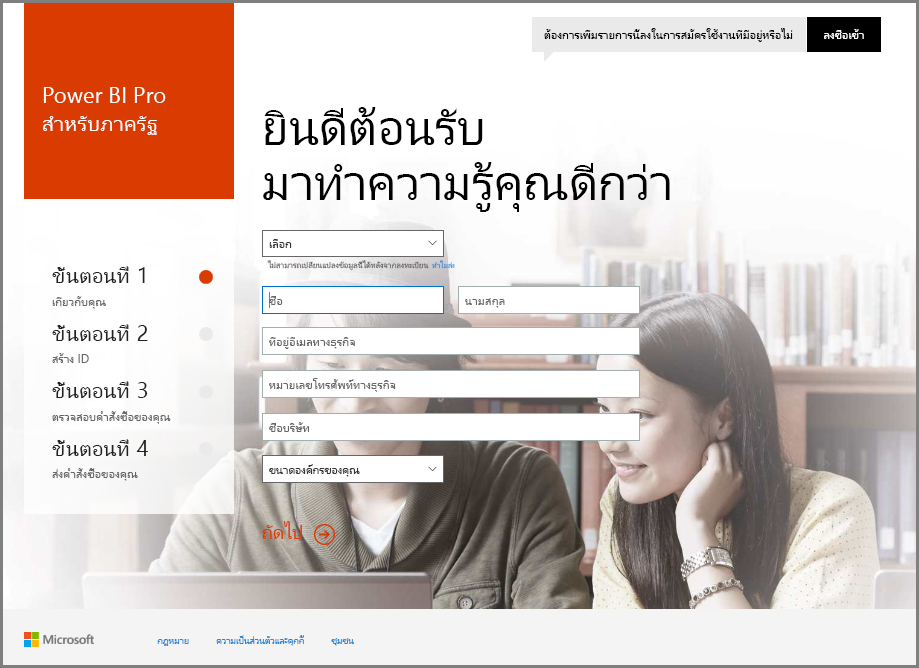
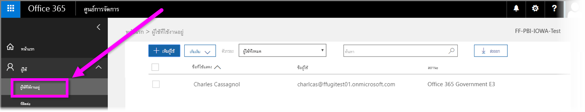

# ลงทะเบียนหน่วยราชการสหรัฐของคุณใน Power BI service
การ**บริการ Power BI**มีเวอร์ชันพร้อมใช้งานสำหรับลูกค้าส่วนราชการสหรัฐอเมริกา ซึ่งเป็นส่วนหนึ่งของการของการสมัครใช้งาน**ชุมชน Office 365 สำหรับส่วนราชการสหรัฐ** การ**บริการ Power BI**ในเวอร์ชันที่อธิบายไว้ในบทความนี้ถูกออกแบบมาสำหรับลูกค้าส่วนราชการสหรัฐและแยกต่างหากออกมา รวมทั้งแตกต่างจากเวอร์ชันเชิงพาณิชย์ของ**บริการ Power BI**

สำหรับข้อมูลเพิ่มเติมเกี่ยวกับการ**บริการ Power BI**สำหรับส่วนราชการสหรัฐ รวมทั้งฟีเจอร์และข้อจำกัด ให้ดู[Power BI สำหรับลูกค้าส่วนราชการสหรัฐ ภาพรวม](service-govus-overview.md)

> [!NOTE]
> บทความนี้มีไว้สำหรับผู้ดูแลระบบที่มีสิทธิ์ที่จะลงทะเบียนส่วนราชการสหรัฐสำหรับ Power BI ถ้าคุณเป็นผู้ใช้ปลายทาง ให้ติดต่อผู้ดูแลระบบของคุณเกี่ยวกับการรับการสมัครใช้งาน Power BI ส่วนราชการสหรัฐ
> 
> 

## เลือกกระบวนการลงทะเบียนขวาสำหรับส่วนราชการสหรัฐ
ส่วนราชการสหรัฐของคุณอาจจะใหม่กับ **Office Government Cloud** หรืออาจมีการสมัครใช้งานอยู่แล้วได้ ส่วนต่อไปนี้แสดงรายละเอียดขั้นตอนลงทะเบียนที่ยึดตามตำแหน่งที่คุณอยู่ด้วย Office Government Cloud และ Power BI นั้นจะแตกต่างกันขึ้นอยู่กับการสมัครใช้งานที่มีอยู่

เมื่อคุณได้ลง ทะเบียน Power BI US Government ฟีเจอร์บางอย่างอาจไม่ทำงานจนกระทั่ง เจ้าหน้าที่ฝ่ายขายหรือฝ่ายสนับสนุนจะเสร็จสิ้นกระบวนการเริ่มต้นใช้งานของคุณ เมื่อต้องการค้นหาข้อมูลฟีเจอร์เหล่านี้ ให้ดู[Power BI สำหรับลูกค้าส่วนราชการสหรัฐ ภาพรวม](service-govus-overview.md) เพื่อเสร็จสิ้นกระบวนการเริ่มต้นใช้งานเพื่อเปิดใช้งานฟีเจอร์เหล่านี้ ให้ติดต่อฝ่ายขายหรือเจ้าหน้าที่ฝ่ายสนับสนุนของคุณ

### ส่วนราชการสหรัฐที่เป็นลูกค้า Office Cloud ใหม่
ถ้าหน่วยงานของคุณเป็นลูกค้า **Office Government Cloud**ใหม่ ให้ทำตามขั้นตอนนี้

> [!NOTE]
> ขั้นตอนเหล่านี้ควรจะทำโดยผู้ดูแลพอร์ทัล
>

1. ไปที่ [https://products.office.com/government/office-365-web-services-for-government](https://products.office.com/government/office-365-web-services-for-government)

>[!NOTE]
>ถ้าคุณไม่ต้องการลงทะเบียน Office Government Cloud ในขณะนี้ โปรดติดต่อตัวแทนฝ่ายขายของคุณ
>

2. เลือก Office G3 และกรอกแบบฟอร์มสำหรับการทดลองใช้ Office
3. เมื่อคุณเป็นลูกค้า Office Cloud แล้ว ให้ทำขั้นตอนด้านล่างสำหรับ "ลูกค้า Office Government Cloud ที่มีอยู่"

### ลูกค้า Office Government Cloud ที่มีอยู่
ถ้าหน่วยงานของคุณเป็นลูกค้า**Office Government Cloud**อยู่แล้ว แต่คุณไม่ได้สมัครใช้งาน **Power BI**(ฟรีหรือไม่ก็ตาม) ให้ทำตามขั้นตอนเหล่านี้

> [!NOTE]
> ขั้นตอนเหล่านี้ควรจะทำโดยผู้ดูแลพอร์ทัล
> 
> 

1. เข้าสู่ระบบบัญชี Office Government Cloud ที่มีอยู่แล้วของคุณ แล้วไปที่พอร์ทัลของผู้ดูแล
2. เลือก**การเรียกเก็บเงิน**
3. เลือก**ซื้อบริการ**
4. เลือกตัวเลือก Power BI Pro Government และเลือกระหว่าง**ลอง**และ**ซื้อทันที**
5. จบการสั่งซื้อของคุณ
6. กำหนดบัญชีให้ผู้ใช้
   
   
7. เข้าสู่ระบบ **Power BI Service** สำหรับลูกค้าส่วนราชการสหรัฐอเมริกาที่ [https://app.powerbigov.us](https://app.powerbigov.us)

## ข้อมูลการลงทะเบียนเพิ่มเติม
ด้านล่างนี้คือข้อมูลเพิ่มเติมสำหรับการลงทะเบียน**Power BI US Government**ในกรณีโยกย้ายสิทธิ์การใช้งานต่าง ๆ

### เวอร์ชันทดลอง Direct Power BI สู่กระบวนการเริ่มต้นใช้งาน
* คลิกแล้วไปสู่การเรียกเก็บเงิน > ซื้อบริการ > Power BI Pro Gov และการเลือกซื้อและไม่ทดลองใช้่
* กรอกข้อมูลจำเป็นและได้รับสิทธิ์การใช้งาน
* ลบ Power BI Pro เวอร์ชันทดลองใช้ หรือลบสิทธิ์การใช้งานเก่า และมอบสิทธิ์ใหม่ให้กับผู้ใช้
* ลงชื่อเข้าใช้ใน [https://app.powerbigov.us](https://app.powerbigov.us)

### เวอร์ชันทดลอง Reseller Power BI Trial สู่กระบวนการเริ่มต้นใช้งาน
ไปยัง**การเรียกเก็บเงิน > การสมัครใช้งาน**และเลือกสมัครใช้งาน **Power BI Pro for Government** แล้วคุณจะเห็น

* พร้อมใช้งาน
* กำหนดแล้ว
* กำหนดลิงค์ผู้ใช้
* หากคุณยังคงได้รับสิทธิ์ทดลองใช้
  * คลิก**มอบหมาย**ภายใต้การสมัครใช้งานเวอร์ชันทดลองใช้และลบผู้ใช้ที่คุณต้องการเพิ่มแบบมีค่าใช้จ่าย
  * ไปที่การสมัครใช้งานแบบมีค่าใช้จ่ายและกำหนดให้ผู้ใช้เหล่านั้น

### คำแนะนำของการอนุญาตพิเศษ
*การอนุญาตพิเศษ*คือกระบวนการท่ีทีมวิศวกรรม Power BI ย้ายลูกค้าจากระบบคลาวด์เชิงพาณิชย์ไปยังระบบคลาวด์ของส่วนราชการที่มีความปลอดภัย ซึ่งทำให้แน่ใจว่ามีฟีเจอร์ที่พร้อมใช้งานในส่วนราชการตามที่คาดไว้ ลูกค้าส่วนราชการสหรัฐที่มีอยู่ (รวมลูกค้าใหม่)**Power BI**บริการเป็นครั้งแรก*ต้อง*เริ่มต้นรายการอนุญาตพิเศษต่อไปนี้ กระบวนการต้องทำก่อนที่จะตั้งค่าหรือการโยกย้ายไปยัง US Government **Power BI** services 

เมื่อต้องการ *อนุญาต* ผู้เช่าของคุณสำหรับระบบคลาวด์ของส่วนราชการสหรัฐอเมริกา ให้ติดต่อทีมบัญชี Microsoft สำหรับความช่วยเหลือในการอนุญาต มีเพียงผู้ดูแลระบบเท่านั้นที่สามารถร้องขอได้ ขั้นตอนสำหรับ*รายการอนุญาตของ*ใช้เวลาประมาณ 3 สัปดาห์ ระหว่างที่ทีมวิศวกรรมของ Power BI ทำการเปลี่ยนแปลงที่เหมาะสมเพื่อให้แน่ใจว่า ผู้เช่าของคุณทำงานได้อย่างถูกต้องใน US Government cloud

ลูกค้าที่กำลังโยกย้ายจาก Power BI สิทธิ์การใช้งาน**ฟรี**ให้**Power BI US Government** (และจากคำนิยาม การโยกย้ายเกี่ยวข้องกันสิทธิ์การใช้งาน**Pro**โดยมีคุณลักษณะที่อธิบายไว้ก่อนในบทความนี้ตอนก่อน) จะพบกับปัญหาอธิบายไว้ในส่วนต่อไปนี้ของบทความนี้ จนกว่าผู้เช่าของพวกเขาจะได้*อนุญาตพิเศษ*จากให้ทีมวิศวกรรมของ Power BI

### Mixed Free และสิทธิ์การใช้งาน Pro ของผู้เช่าส่วนราชการสหรัฐ
ถ้าคุณมีสิทธิ์การใช้ทั้งแบบฟรีและแบบ Pro ของส่วนราชการสหรัฐในตัวผู้เช่าของคุณ ทั้งมีสิทธิ์การใช้งานฟรีและสิทธิ์การใช้งาน Pro (ส่วนราชการสหรัฐ) จะยังคงอยู่ แต่สิทธิ์การใช้งานชนิดหนึ่งหรืออีกชนิดจะไม่ทำงานอย่างถูกต้อง ถ้าผู้เช่าของคุณผ่านระบบการให้*อนุญาตพิเศษ*แล้ว เกิดเรื่องต่อไปนี้ขึ้น

* ผู้ใช้สิทธิ์การใช้งานฟรีจะไม่สามารถเข้าสู่ระบบ Power BI โดยใช้ **Power BI Desktop**และจะประสบช่องว่างของฟังก์ชันการทำงานที่อธิบายไว้ในส่วนต่อไปนี้
* ลูกค้าทั้งหมดที่กำหนดให้มีสิทธิ์การใช้งาน Pro จะใช้งานได้ตามที่คาดหมาย รวมถึงการใช้เกตเวย์ Power BI Desktop และแอปสำหรับอุปกรณ์เคลื่อน

เมื่อใช้สลับระหว่างสิทธิ์การใช้งานฟรีกับ Pro สำหรับผู้เช่าแบบส่วนราชการสหรัฐ และดำเนินการตามระบบการ*อนุญาตพิเศษ* สิ่งต่อไปนี้สามารถเป็นไปได้

**ก่อน_การอนุญาตพิเศษ_** :

* ผู้ใช้ที่ มีสิทธิ์การใช้งานฟรีกำลังทำงานใน cloud เชิงพาณิชย์
* สิทธิ์การใช้งานส่วนราชการสหรัฐแบบ pro จะแสดงขึ้นในพอร์ทัล และผู้ดูแลระบบสามารถกำหนดสิทธิ์ให้ผู้ใช้เหล่านั้นได้ สิทธิ์การใช้งานส่วนราชการสหรัฐแบบ pro จะไม่สูญเสียข้อมูลจากสิทธิ์การใช้งานฟรีของพวกเขา เมื่อผู้ดูแลระบบกำหนดสิทธิ์การใช้งานของส่วนราชการสหรัฐแบบ pro ผู้ใช้ที่ถูกกำหนดให้มีการเข้าถึงฟีเจอร์ของ Power BI Pro สำหรับลูกค้าส่วนราชการสหรัฐ แต่รายกาแสดงหัวข้อต่อไปนี้ ได้แจงช่องว่างของฟังก์ชันการทำงานที่จะเกิดขึ้นจนกว่าผู้เช่าเสร็จจะได้รับ*อนุญาตพิเศษ*อย่างเรียบร้อย
  
  * เกตเวย์ อุปกรณ์เคลื่อนที่ และ Power BI Desktop ไม่สามารถรับรองตัวตนได้
  * คุณไม่สามารถเข้าถึงแหล่งข้อมูลเชิงพาณิชย์ของ Azure ได้
  * ไฟล์ PBIX ต้องถูกอัปโหลดด้วยตนเองจาก Power BI service เชิงพาณิชย์
  * แอป mobile ของ power BI จะใช้งานไม่ได้

**หลังจาก_การอนุญาตพิเศษ_** :

* ผู้ใช้ฟรีที่ทำงานในบริการ Power BI เชิงพาณิชย์สามารถดำเนินต่อเพื่อเรียกใช้ แต่พวกเขาจะหยุดการรับรองตัวตน ตามที่คาดไว้
* ผู้ใช้แบบ Pro ที่ทำงานใน cloud สำหรับส่วนราชการสหรัฐสามารถใช้บริการ**Power BI สำหรับลูกค้าส่วนราชการสหรัฐ**ตามที่คาดไว้ได้

เมื่อต้องการระบุผู้ใช้ในผู้เช่าของคุณที่กำลังใช้สิทธิ์การใช้งานฟรีของ Power BI ผู้ดูแลสามารถเรียกใช้รายงานสิทธิ์การใช้งาน หลังจากที่ผู้ใช้สิทธิ์การใช้งานฟรีแสดง**Power BI Standard**

## ขั้นตอนถัดไป
มีหลากหลายสิ่งที่คุณสามารถทำได้ด้วย Power BI สำหรับข้อมูลและการเรียนรู้เพิ่มเติม รวมถึงบทความที่แสดงวิธีการลงทะเบียนใช้บริการ ให้ดูทรัพยากรต่อไปนี้

* [ภาพรวมของ Power BI สำหรับส่วนราชการสหรัฐ](service-govus-overview.md)
* [Guided learning สำหรับ Power BI](guided-learning/index.md)
* [เริ่มต้นใช้งาน Power BI service](service-get-started.md)
* [Power BI Desktop คืออะไร](desktop-what-is-desktop.md)

