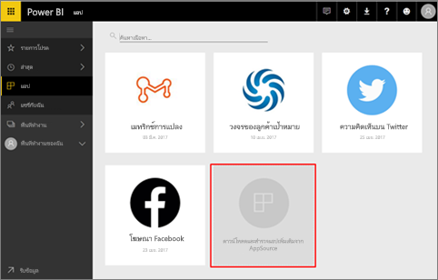
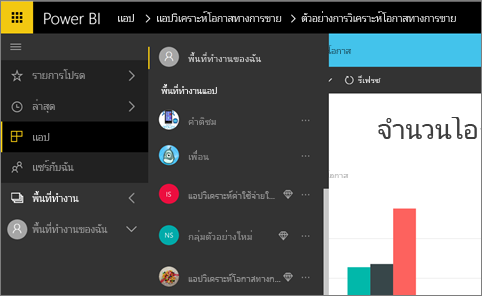
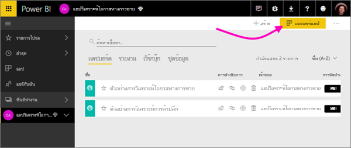
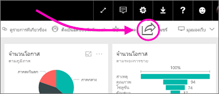

# วิธีการแชร์งานของคุณใน Power BI

คุณได้สร้างแดชบอร์ดและรายงานแล้ว คุณอาจอยากทำงานร่วมกับเพื่อนร่วมงานของคุณด้วย ตอนนี้ คุณต้องการให้ผู้อื่นมีสิทธิ์เข้าถึง อะไรคือวิธีดีที่สุดในการแจกจ่ายสิทธิ์นั้น?

ในบทความนี้ เราจะเปรียบเทียบตัวเลือกสำหรับการทำงานร่วมกัน และการแชร์ใน Power BI เหล่านี้:

* ทำงานร่วมกับเพื่อนร่วมงานเพื่อสร้างรายงานและแดชบอร์ดที่มีความหมาย ใน*พื้นที่ทำงาน*
* การรวมแดชบอร์ดและรายงานลงเหล่านั้นลงใน*แอป* และเผยแพร่กับกลุ่มที่ใหญ่ขึ้นหรือทั้งองค์กรของคุณ
* การแชร์แดชบอร์ดหรือรายงานกับบางคน จากบริการหรือแอป Power BI สำหรับอุปกรณ์เคลื่อนที่
* พิมพ์รายงาน
* ฝังรายงานในพอร์ทัลที่ปลอดภัยหรือเว็บไซต์สาธารณะ

ไม่ว่าคุณจะเลือกตัวเลือกไหนเพื่อแชร์แดชบอร์ด คุณต้องมี[สิทธิ์การใช้งาน Power BI Pro](service-features-license-type.md) หรือเนื้อหาจำเป็นต้องอยู่ใน[ความจุพรีเมียม](service-premium-what-is.md) ข้อกำหนดสิทธิ์การใช้งานสำหรับผู้ร่วมงานที่จะดูแดชบอร์ดของคุณ จะแตกต่างกันไป ขึ้นอยู่กับตัวเลือกที่คุณเลือก ส่วนต่อไปนี้คือรายละเอียด 

*แอปในบริการของ Power BI*

## ทำงานร่วมกับเพื่อนร่วมงานในพื้นที่ทำงาน

เมื่อทีมทำงานร่วมกัน พวกเขาต้องเข้าถึงเอกสารเดียวกันเพื่อให้สามารถร่วมมือกันได้อย่างรวดเร็ว ในพื้นที่ทำงาน Power BI ทีมมาร่วมกันแชร์ความเป็นเจ้าของและการจัดการของพวกเขาแดชบอร์ด รายงาน ชุดข้อมูล และสมุดงาน ในบางครั้ง ผู้ใช้ Power BI จัดระเบียบพื้นที่ทำงานของพวกเขาโดยยึดตามโครงสร้างองค์กร แต่บางครั้งพวกเขาสร้างพื้นที่ทำงานสำหรับโครงการเฉพาะ องค์กรอื่นๆ ยังคงใช้หลายพื้นที่ทำงานเพื่อจัดเก็บรายงานหรือแดชบอร์ดเวอร์ชั่นอื่นที่พวกเขาใช้ 

พื้นที่ทำงานให้บทบาทที่กำหนดว่าเพื่อนร่วมงานของคุณมีสิทธิ์ใด คุณสามารถใช้บทบาทเหล่านั้นกำหนดว่าใครสามารถจัดการพื้นที่ทำงานทั้งหมด หรือใครทำได้เพียงแค่ใส่เนื้อหาลงในนั้น

ผู้ใช้บางคนใส่เนื้อหาในพื้นที่ทำงานของฉันและแชร์พื้นที่ทำงานนั้น พื้นที่ทำงานเป็นการทำงานร่วมกันที่ดีกว่าพื้นที่ทำงานของฉันเนื่องจากให้ความเป็นเจ้าของร่วมในเนื้อหา คุณและทีมของคุณทั้งหมดสามารถอับเดตหรือ หรือให้ผู้อื่นเข้าถึงได้ง่าย พื้นที่ทำงานของฉันถูกใช้ โดยบุคคลต่างๆ เพียงครั้งเดียวหรือเพื่อเนื้อหาส่วนบุคคล

มาลองจินตนาการว่าคุณสร้างแดชบอร์ดที่คุณจำเป็นต้องใช้ร่วมกับเพื่อนร่วมงานของคุณเสร็จแล้ว วิธีที่ดีที่สุดในการให้พวกเขาสามารถเข้าถึงแดชบอร์ดคืออะไร? คำตอบขึ้นอยู่กับหลายปัจจัย 

- ถ้าเพื่อนร่วมงานต้องทำให้แดชบอร์ดเป็นปัจจุบัน หรือต้องการเข้าถึงเนื้อหาทั้งหมดในพื้นที่ทำงาน พิจารณาเพิ่มเข้าไปในพื้นที่ทำงาน 
- ถ้าเพื่อนร่วมงานเพียงแค่ต้องการดูแดชบอร์ดและเนื้อหาไม่ทั้งหมดในพื้นที่ทำงาน คุณอีกครั้งได้ทางเลือก 
- ถ้าแดชบอร์ดเป็นส่วนหนึ่งของชุดเนื้อหาที่ใหญ่กว่าที่คุณต้องแจกจ่ายให้กับเพื่อนร่วมงานหลายคน การเผยแพร่แอปน่าจะเป็นตัวเลือกที่ดีที่สุด 
- อย่างไรก็ตาม ถ้าเพื่อนร่วมงานเพียงแค่แดชบอร์ดที่ แชร์แดชบอร์ดนั้น อาจเป็นโซลูชันที่ดีที่สุด

อ่านเพิ่มเติมเกี่ยวกับ[การสร้างพื้นที่ทำงาน](service-create-workspaces.md)

**คุณทราบหรือไม่** Power BI มีประสบการณ์พื้นที่ทำงานใหม่ อ่าน[สร้างพื้นที่ทำงานใหม่](service-create-the-new-workspaces.md)เพื่อดูวิธีการเปลี่ยนแปลงพื้นที่ทำงาน 

## กระจายข้อมูลและข้อมูลเชิงลึก โดยการสร้างแอป

สมมุติว่า คุณต้องการแจกจ่ายแดชบอร์ดของคุณให้กับผู้ชมในวงกว้าง คุณและเพื่อนร่วมงานของคุณได้สร้าง*พื้นที่ทำงาน* จากนั้นจึงได้สร้างและกำหนดแดชบอร์ด รายงาน และชุดข้อมูลในพื้นที่ทำงาน ในตอนนี้คุณเลือกแดชบอร์ดและรายงานที่คุณต้องการ แล้วเผยแพร่เป็นแอป&#151;ไปยังกลุ่มหนึ่งหรือทั่วทั้งองค์กรของคุณ

สามารถค้นหาและติดตั้งแอปได้ง่าย ๆ ในบริการของ Power BI ([https://powerbi.com](https://powerbi.com)) คุณสามารถส่งลิงก์โดยตรงไปยังแอป ให้กับผู้ใช้ทางธุรกิจ หรือพวกเขาสามารถค้นหาได้ใน AppSource ถ้าผู้ดูแลระบบ Power BI ของคุณ ให้สิทธิ์แก่คุณ คุณสามารถติดตั้งแอปลงในบัญชีผู้ใช้ Power BI ของเพื่อนร่วมงานคุณโดยอัตโนมัติ อ่านเพิ่มเติมเกี่ยวกับ[การเผยแพร่แอปของคุณ](service-create-distribute-apps.md)

หลังจากที่พวกเขาติดตั้งแอปแล้ว พวกเขาสามารถดูแอปในเบราว์เซอร์หรืออุปกรณ์เคลื่อนที่ของพวกเขา

สำหรับผู้ใช้ที่จะดูแอปของคุณ พวกเขาจำเป็นต้องมีสิทธิ์การใช้งาน Power BI Pro ด้วย หรือแอปต้องเก็บไว้ในความจุ Power BI Premium อ่าน[Power BI Premium คืออะไร](service-premium-what-is.md)สำหรับรายละเอียด

คุณสามารถเผยแพร่แอปไปยังบุคคลภายนอกองค์กรของคุณ ด้วย พวกเขาสามารถดู และโต้ตอบกับเนื้อหาแอป แต่ไม่สามารถแชร์แอปกับผู้อื่นได้

## แชร์แดชบอร์ดและรายงาน

สมมติว่า คุณสร้างแดชบอร์ดและรายงานในพื้นที่ทำงานของฉันหรือในพื้นที่ทำงานเสร็จสมบูรณ์แล้ว และคุณต้องการให้บางคนสามารถเข้าถึงได้ วิธีหนึ่งคือการ*แชร์*ให้พวกเขา 

คุณต้องมีสิทธิ์การใช้งาน Power BI Pro เพื่อแชร์เนื้อหาของคุณ และบุคคลที่คุณแชร์ด้วยก็ต้องมีสิทธิ์ดังกล่าว หรือเนื้อหาจำเป็นต้องอยู่ในพื้นที่ทำงานใน[ความจุ Premium](service-premium-what-is.md) เมื่อคุณแชร์แดชบอร์ดหรือรายงาน ผู้รับสามารถดู และโต้ตอบกับข้อมูล แต่ไม่สามารถแก้ไขได้ พวกเขาจะเห็นข้อมูลเดียวกันกับที่คุณเห็นในแดชบอร์ดและรายงาน นอกจากว่าจะมีความปลอดภัยระดับแถว (RLS) ใช้กับชุดข้อมูลพื้นฐาน เพื่อนร่วมงานที่คุณแชร์ด้วย สามารถแชร์ต่อไปให้เพื่อนร่วมงานของพวกเขาอีกที ถ้าคุณอนุญาต 

คุณสามารถแชร์ให้กับบุคคลภายนอกองค์กรได้ด้วย พวกเขาสามารถดู และโต้ตอบกับแดชบอร์ด หรือรายงานได้ แต่ไม่สามารถแชร์ได้ 

อ่านเพิ่มเติมเกี่ยวกับ[การแชร์แดชบอร์ดและรายงาน](service-share-dashboards.md)จากบริการของ Power BI คุณยังสามารถเพิ่มตัวกรองเข้ากับลิงก์ และ[แชร์มุมมองที่กรองแล้วของรายงานคุณ](service-share-reports.md)ได้

## ใส่คำอธิบายประกอบ และแชร์จากแอป Power BI สำหรับอุปกรณ์เคลื่อนที่

ในแอป Power BI สำหรับอุปกรณ์เคลื่อนที่ สำหรับ iOS และ Android คุณสามารถใส่คำอธิบายประกอบไทล์ รายงาน หรือ วิชวล แล้วแชร์ให้กับใครก็ได้ผ่านทางอีเมล

คุณกำลังแชร์สแนปช็อตของไทล์ รายงาน หรือ วิชวล และผู้รับของคุณจะเห็นเหมือนกับตอนที่คุณส่งเมล เมลยังมีลิงก์ไปยังแดชบอร์ดหรือรายงาน ถ้าพวกเขามีสิทธิ์การใช้งาน Power BI Pro หรือเนื้อหาอยู่ใน[ความจุพรีเมียม](service-premium-what-is.md) และคุณได้แชร์วัตถุกับพวกเขาแล้ว พวกเขาสามารถเปิดดูได้ คุณสามารถส่งสแนปช็อตของไทล์ให้กับใครก็ได้ &#151; ไม่เพียงแต่ผู้ร่วมงานในโดเมนอีเมลเดียวกันเท่านั้น

อ่านเพิ่มเติมเกี่ยวกับ[การใส่คำอธิบายประกอบ และการแชร์ไทล์ รายงาน และวิชวล](consumer/mobile/mobile-annotate-and-share-a-tile-from-the-mobile-apps.md)จากแอปสำหรับอุปกรณ์เคลื่อนที่ Android และ iOS

คุณยังสามารถ[แชร์สแนปช็อตของไทล์](consumer/mobile/mobile-windows-10-phone-app-get-started.md)จากแอป Power BI สำหรับอุปกรณ์ที่ Windows 10 ได้

## พิมพ์ หรือบันทึกเป็น PDF หรือไฟล์แบบคงที่อื่น ๆ

คุณสามารถพิมพ์ หรือบันทึกเป็น PDF (หรือรูปแบบไฟล์แบบคงที่อื่น ๆ) สำหรับทั้งแดชบอร์ด ไทล์แดชบอร์ด หน้ารายงาน หรือการแสดงภาพจากบริการของ Power BI รายงานสามารถพิมพ์ออกมาทีละหน้าในแต่ละครั้งเท่านั้น -- คุณไม่สามารถพิมพ์รายงานทั้งหมดในครั้งเดียว อ่านเพิ่มเติมเกี่ยวกับ[การพิมพ์ หรือการบันทึกเป็นไฟล์แบบคงที่](consumer/end-user-print.md)

## ฝังรายงานในพอร์ทัลที่ปลอดภัยหรือเว็บไซต์สาธารณะ

คุณสามารถฝังรายงาน Power BI ในพอร์ทัลหรือเว็บไซต์ที่ผู้ใช้ของคุณควรจะเห็นได้  
**การฝังใน SharePoint Online**  และตัวเลือก **แบบฝัง** ในบริการ Power BI ช่วยให้คุณสามารถฝังรายงานสำหรับผู้ใช้ภายในของคุณได้อย่างปลอดภัย 

- **ฝังใน SharePoint Online**ทำงานกับ Power BI web part สำหรับ SharePoint Online จะให้ประสบการณ์การลงชื่อเข้าระบบครั้งเดียวควบคุมวิธีฝังรายงาน 
- **ฝัง**ทำงานกับเว็บไซต์หรือเว็บไซต์ที่สนับสนุนการฝังเนื้อหาโดยใช้ URL หรือ iFrame ใด ๆ 

ตัวเลือกใดที่คุณเลือก Power BI บังคับใช้สิทธิ์และความปลอดภัยของข้อมูลทั้งหมดก่อนที่ผู้ใช้สามารถดูเนื้อหา ผู้ที่ดูรายงานนั้นจำเป็นต้องมีใบอนุญาตที่เหมาะสม อ่านเพิ่มเติมเกี่ยวกับ[ฝังใน SharePoint Online](service-embed-report-spo.md)และ[ฝัง](service-embed-secure.md)ตัวเลือกใน Power BI

ด้วยตัวเลือก **เผยแพร่สู่เว็บ** คุณสามารถเผยแพร่รายงาน Power BI ไปยังทั้งอินเทอร์เน็ต โดยการฝังตัวการแสดงภาพลงในบล็อกโพสต์ เว็บไซต์ สื่อทางสังคม และการสื่อสารทางออนไลน์อื่น ๆ บนอุปกรณ์ใดก็ได้ ทุกคนบนอินเทอร์เน็ตสามารถดูรายงานของคุณ และคุณไม่สามารถควบคุมว่าใครสามารถดูสิ่งที่คุณได้เผยแพร่แล้ว พวกเขาไม่จำเป็นต้องมีใบอนุญาต Power BI การเผยแพร่ไปยังเว็บ มีเฉพาะรายงานที่คุณสามารถแก้ไขได้เท่านั้น คุณไม่สามารถเผยแพร่รายงานไปยังเว็บ ถ้ารายงานถูกแชร์มาให้คุณ หรือ ถ้ารายงานอยู่ในแอป อ่านเพิ่มเติมเกี่ยวกับ[การเผยแพร่ไปยังเว็บ](service-publish-to-web.md)

>[!Warning]
>ใช้[เผยแพร่ไปยังเว็บ](service-publish-to-web.md)เท่านั้นเมื่อต้องแชร์เนื้อหาต่อสาธารณะ ไม่ใช่เพื่อการแชร์ภายใน

## ขั้นตอนถัดไป

* [แชร์แดชบอร์ดกับเพื่อนร่วมงานและผู้อื่น](service-share-dashboards.md)
* [สร้างและเผยแพร่แอปใน Power BI](service-create-distribute-apps.md)
* [ฝังรายงานในพอร์ทัลความปลอดภัยหรือเว็บไซต์](service-embed-secure.md)

มีคำติชมหรือไม่? ไปที่[ไซต์ชุมชน Power BI](https://community.powerbi.com/) พร้อมกับคำแนะนำของคุณ

มีคำถามเพิ่มเติมหรือไม่? [ลองไปที่ชุมชน Power BI](http://community.powerbi.com/)
