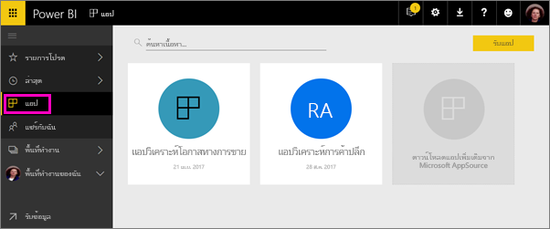
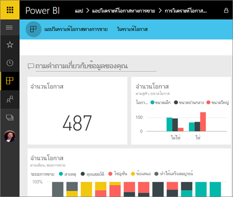
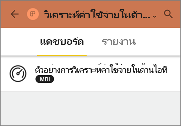
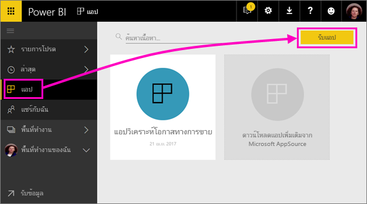
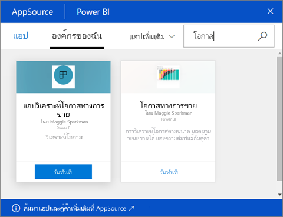
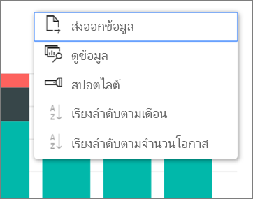

# ติดตั้งและใช้แอปกับแดชบอร์ดและรายงาน
ใน Power BI *แอป*รวมรายงานและแดชบอร์ดที่เกี่ยวข้องเข้าด้วยกัน ทั้งหมดในที่เดียว บุคคลในองค์กรของคุณสามารถสร้าง และเผยแพร่พร้อมกับข้อมูลทางธุรกิจที่สำคัญ [บริการภายนอก](service-connect-to-services.md)คุณอาจใช้่ เช่น Google Analytics และ Microsoft Dynamics CRM นอกจากนี้ยังนำเสนอแอป Power BI 

แอปค้นหาและติดตั้งใน Power BI service ([https://powerbi.com](https://powerbi.com)) ได้ง่าย หลังจากที่คุณติดตั้งแอป คุณไม่จำเป็นต้องจำชื่อของแดชบอร์ดต่าง ๆ มากมาย เนื่องจากพวกมันทั้งหมดอยู่รวมกันในแอป ในเบราว์เซอร์หรือบนอุปกรณ์เคลื่อนที่ของคุณ

ด้วยแอป เมื่อใดก็ตามที่ผู้สร้างแอปออกการอัปเดต คุณเห็นการเปลี่ยนแปลงโดยอัตโนมัติ ผู้เขียนยังควบคุมความถของการรีเฟรชข้อมูล ดังนั้นคุณไม่จำเป็นต้องกังวลเกี่ยวกับการทำให้ล่าสุด 

วางแผนเพื่อสร้างแอปหรือไม่ ดู[สร้างและเผยแพร่แอปใน Power BI](service-create-distribute-apps.md)สำหรับข้อมูลเพิ่มเติม

## รับแอปใหม่
คุณสามารถรับแอปในสองสามวิธีที่แตกต่างกัน ผู้เขียนแอปสามารถติดตั้งแอปโดยอัตโนมัติในบัญชี Power BI ของคุณหรือส่งคุณลิงก์โดยตรงไปยังแอป หรือคุณสามารถค้นหาได้ใน AppSource ที่คุณเห็นแอปทั้งหมดที่คุณสามารถเข้าถึงได้ ใน Power BI บนอุปกรณ์เคลื่อนที่ของคุณ คุณสามารถเติดตั้งได้ จากลิงก์โดยตรงเท่านั้น และไม่สามารถตัดตั้งจาก AppSource ถ้าผู้สร้างแอปติดตั้งแอปโดยอัตโนมัติ คุณจะเห็นได้ในรายการของแอป

### ติดตั้งแอปจากลิงก์โดยตรง
วิธีง่ายที่สุดในการติดตั้งแอปใหม่ด้วยตัวคุณเอง เพื่อรับลิงก์โดยตรงจากผู้เขียนแอป Power BI สร้างลิงค์ซึ่งผู้เขียนสามารถส่งให้กับคุณ

**บนคอมพิวเตอร์ของคุณ** 

เมื่อคุณคลิกลิงก์ในอีเมล Power BI service ([https://powerbi.com](https://powerbi.com)) เปิดขึ้นในเบราว์เซอร์ คุณยืนยันคุณต้องการติดตั้งแอป และจะเปิดไปยังเพจเริ่มต้นแอป

**บน iOS หรืออุปกรณ์เคลื่อนที่ Android ของคุณ** 

เมื่อคุณคลิกที่ลิงก์ในอีเมบนอุปกรณ์เคลื่อนที่ของคุณ แอปจะติดตั้งโดยอัตโนมัติ และเปิดรายการเนื้อหาของแอป 

### ดาวน์โหลดแอปจาก Microsoft AppSource
นอกจากนี้คุณยังสามารถค้นหา และติดตั้งแอปใด ๆ ที่คุณสามารถเข้าถึงจาก Microsoft AppSource 

1. เลือก**แอป**  > **รับแอป** 
   
     
2. ใน AppSource ภายใต้**องค์กรของฉัน**คุณสามารถค้นหาเพื่อจำกัดขอบเขตผลลัพธ์ และค้นหาแอปที่คุณกำลังค้นหาได้
   
     
3. เลือก**รับทันที**เพื่อเพิ่มลงในหน้าแอปของคุณ 

## โต้ตอบกับแดชบอร์ดและรายงานในแอป
ในตอนนี้ คุณสามารถสำรวจข้อมูลในแดชบอร์ดและรายงานในแอป คุณสามารถเข้าถึงโต้ตอบกับ Power BI แบบมาตรฐานทั้งหมดเช่นการกรอง เน้น เรียงลำดับ และดริลดาวน์ อ่านเกี่ยวกับ[โต้ตอบกับรายงานใน Power BI](service-reading-view-and-editing-view.md) 

คุณไม่สามารถบันทึกการเปลี่ยนแปลงที่คุณทำ แต่คุณสามารถ[ส่งออกข้อมูลไปยัง Excel](power-bi-visualization-export-data.md)จากตารางหรือภาพอื่น ๆ ในรายงานได้เสมอ

## ขั้นตอนถัดไป
* [สร้างและเผยแพร่แอปใน Power BI](service-create-distribute-apps.md)
* [แอป Power BI สำหรับบริการภายนอก](service-connect-to-services.md)
* มีคำถามหรือไม่ [ลองถามชุมชน Power BI](http://community.powerbi.com/)

