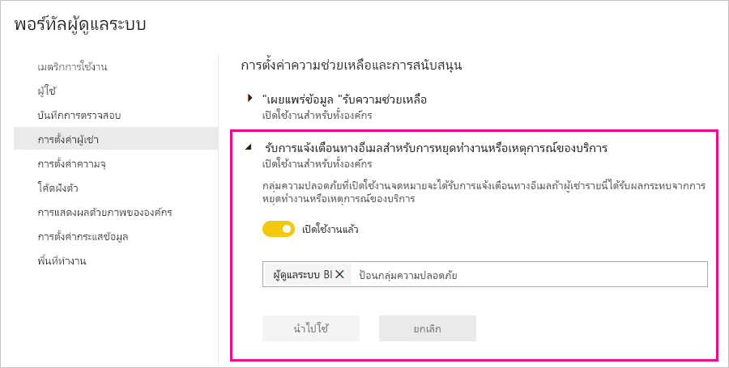

# การแจ้งเตือนการหยุดชะงักของบริการ

สิ่งสำคัญคือต้องมีข้อมูลเชิงลึกเกี่ยวกับความพร้อมใช้งานของแอปพลิเคชันทางธุรกิจที่สำคัญสำหรับภารกิจของคุณ Power BI มีการแจ้งเตือนเหตุการณ์เพื่อให้คุณสามารถเลือกรับอีเมลได้ถ้ามีการหยุดทำงานหรือการลดประสิทธิภาพของบริการ ในขณะที่ข้อตกลงระดับบริการของ Power BI (SLA) อยู่ที่ 99.9% ทำให้เกิดเหตุการณ์เหล่านี้ไม่บ่อย แต่เราต้องการให้แน่ใจว่าคุณได้รับแจ้งให้ทราบ หน้าจอต่อไปนี้แสดงชนิดของอีเมลที่คุณจะได้รับถ้าคุณเปิดใช้งานการแจ้งเตือน:

ในตอนนี้ เราจะส่งอีเมลสำหรับ_สถานการณ์ความน่าเชื่อถือ_ดังต่อไปนี้:

- เปิดความน่าเชื่อถือของรายงาน
- ความน่าเชื่อถือของการรีเฟรชแบบจำลอง
- ความน่าเชื่อถือของการรีเฟรชคิวรี

ตัวอย่างของการแจ้งเตือนเหล่านี้รวมถึงเมื่อผู้ใช้ประสบความล่าช้าในการดำเนินงาน เช่น การเปิดรายงาน การรีเฟรชชุดข้อมูล หรือการดำเนินการค้นหา หลังจากที่มีการแก้ไขปัญหาแล้ว คุณจะได้รับอีเมลการติดตามผล

> [!NOTE]
> ปัจจุบัน คุณลักษณะนี้พร้อมใช้งานสำหรับความจุเฉพาะใน Power BI Premium เท่านั้น ซึ่งไม่พร้อมใช้งานสำหรับความจุที่ใช้ร่วมกันหรือฝังไว้

## เปิดใช้งานการแจ้งเตือน

ผู้ดูแลระบบผู้เช่า Power BI จะเปิดใช้งานการแจ้งเตือนในพอร์ทัลผู้ดูแลระบบ:

1. ระบุหรือสร้างกลุ่มความปลอดภัยที่เปิดใช้งานอีเมลซึ่งควรได้รับการแจ้งเตือน

1. ในพอร์ทัลผู้ดูแลระบบ ให้เลือก**การตั้งค่าผู้เช่า** ภายใต้**วิธีใช้และการตั้งค่าการสนับสนุน** ขยาย**รับการแจ้งเตือนทางอีเมลสำหรับบริการขัดข้องหรือเหตุการณ์**

1. เปิดใช้งานการแจ้งเตือน ให้ใส่กลุ่มความปลอดภัยและเลือก **นำไปใช้**

    

> [!NOTE]
> Power BI ส่งการแจ้งเตือนจากบัญชีno-reply-powerbi@microsoft.com ตรวจสอบให้แน่ใจว่าบัญชีนี้ได้รับอนุญาตเพื่อมิให้การแจ้งเตือนถูกส่งไปยังสแปมหรือโฟลเดอร์ขยะ

## ขั้นตอนถัดไป

[ตัวเลือกการสนับสนุน Power BI Pro และ Power BI Premium](service-support-options.md)

มีคำถามเพิ่มเติมหรือไม่? [ลองไปที่ชุมชน Power BI](http://community.powerbi.com/)
