# การเรียนรู้ของเครื่องอัตโนมัติใน Power BI (ดูตัวอย่าง)

เรียนรู้ (AutoML) สำหรับ dataflows เครื่องอัตโนมัติช่วยให้นักวิเคราะห์ธุรกิจสามารถฝึก ตรวจสอบ และเรียกใช้ Machine Learning รูปแบบโดยตรงใน Power BI ซึ่งมีประสบการณ์การใช้งานง่ายสำหรับการสร้างแบบจำลองยใหม่ที่นักวิเคราะห์สามารถใช้ dataflows ของพวกเขาเพื่อระบุข้อมูลป้อนเข้าสำหรับการฝึกอบรมแบบจำลอง บริการโดยอัตโนมัติแยกคุณลักษณะเกี่ยวข้อง เลือกอัลกอริทึมที่เหมาะสม และปรับ และตรวจสอบแบบจำลองย หลังจากที่ได้รับแบบจำลองการฝึกฝน Power BI สร้างรายงานที่มีผลลัพธ์ของการตรวจสอบที่อธิบายประสิทธิภาพการทำงานและนักวิเคราะห์ผลลัพธ์ โดยอัตโนมัติ สามารถเรียกใช้แบบจำลองข้อมูลใหม่ หรืออัปเดใด ๆ ภายใน dataflow แล้ว

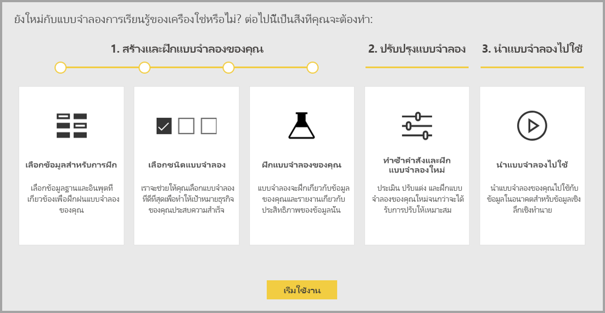

เรียนรู้เกี่ยวกับเครื่องอัตโนมัติจะพร้อมใช้งานสำหรับ dataflows ที่โฮสต์บน Power BI Premium และฝังความจุเฉพาะ ในตัวอย่างนี้ AutoML ช่วยให้คุณฝึกแบบจำลองการเรียนรู้เครื่องสำหรับแบบจำลองการคาด การณ์ไบนารี จัดประเภท และการถดถอย

## ทำงานกับ AutoML

[Power BI dataflows](service-dataflows-overview.md)เสนอเตรียมข้อมูลด้วยตนเองสำหรับข้อมูลขนาดใหญ่ AutoML ช่วยให้คุณสามารถใช้ประโยชน์จากความพยายามเตรียมข้อมูลของคุณสำหรับการสร้างแบบจำลองเรียนรู้เครื่อง ตรงภายใน Power BI

AutoML ใน Power BI ช่วยให้นักวิเคราะห์ข้อมูลการใช้ dataflows เพื่อสร้างแบบจำลองการเรียนรู้เครื่อง ด้วยประสบการณ์เรียบง่าย ใช้เพียงทักษะ Power BI ส่วนใหญ่วิทยาศาสตร์ข้อมูลเบื้องหลังการสร้างแบบจำลองยเป็นแบบอัตโนมัติ โดย Power BI ด้วย guardrails เพื่อให้แน่ใจว่า มีแบบจำลองที่มีคุณภาพดี และการมองเห็นเพื่อให้คุณรับข้อมูลเชิงลึกทั้งหมดในกระบวนใช้ในการสร้างแบบจำลองของคุณย

AutoML สนับสนุนการสร้าง**คาดการณ์ไบนารี**, **จัดประเภท**และ**ถดถอย**แบบจำลองสำหรับ dataflows นี่คือชนิดของเครื่อง supervised เรียนรู้แบบจำลอง ซึ่งหมายความ ว่า พวกเขาเรียนรู้จากผลทราบแล้วสังเกตผ่านมาเพื่อทำนายผลลัพธ์สังเกตอื่น ๆ ชุดข้อมูลป้อนเข้าสำหรับการฝึกอบรมแบบจำลอง AutoML คือ ชุดของระเบียนที่มี**มีป้ายชื่อ**กับผลลัพธ์ที่ทราบแล้ว

รวม AutoML ใน Power BI [อัตโนมัติย](https://docs.microsoft.com/azure/machine-learning/service/concept-automated-ml)จากการ[บริการ Azure Machine Learning](https://docs.microsoft.com/azure/machine-learning/service/overview-what-is-azure-ml)เพื่อสร้างแบบจำลองยของคุณ อย่างไรก็ตาม คุณไม่จำเป็นต้องสมัครใช้งาน Azure เพื่อใช้ AutoML ใน Power BI มีจัดการกระบวนการฝึกอบรมและการโฮสต์แบบจำลองย โดยบริการ Power BI ทั้งหมด

หลังจากที่มีฝึกแบบจำลองย AutoML สร้างรายงาน Power BI ที่อธิบายประสิทธิภาพแนวโน้มของแบบจำลองยของคุณโดยอัตโนมัติ AutoML เน้น explainability โดยเน้น influencers คีย์ระหว่างข้อมูลป้อนเข้าของคุณที่คาดการณ์ที่ส่งกลับ โดยแบบจำลองของคุณ รายงานยังมีเมตริกหลักสำหรับแบบจำลอง ขึ้นอยู่กับชนิดแบบจำลองย

หน้าอื่น ๆ ของรายงานที่สร้างแสดงข้อมูลสรุปสถิติของแบบจำลองและรายละเอียดการฝึกอบรม สรุปสถิติน่าสนใจสำหรับผู้ใช้ที่ต้องการดูหน่วยวัดวิทยาศาสตร์ข้อมูลมาตรฐานของประสิทธิภาพการทำงานสำหรับแบบจำลอง ได้ รายละเอียดการฝึกอบรมสรุปเกิดซ้ำทั้งหมดที่ถูกเรียกใช้เพื่อสร้างแบบจำลองของคุณ ด้วยพารามิเตอร์แบบจำลองที่เกี่ยวข้อง ซึ่งยังอธิบายวิธีการป้อนข้อมูลแต่ละถูกใช้เพื่อสร้างแบบจำลองย

คุณสามารถนำไปใช้แบบจำลองยของคุณกับข้อมูลของคุณสำหรับการให้คะแนนแล้ว เมื่อมีการรีเฟรช dataflow คาดการณ์จากแบบจำลองยของคุณจะนำไปใช้กับข้อมูลของคุณโดยอัตโนมัติ Power BI ยังมีคำอธิบายสำหรับแต่ละคะแนนคาดการณ์เฉพาะที่สร้างแบบจำลองยมาก ๆ

## สร้างแบบจำลองการเรียนรู้เครื่อง

ส่วนนี้อธิบายวิธีการสร้างแบบจำลองเรียนรู้ AutoML 

### เตรียมข้อมูลสำหรับการสร้างแบบจำลองย

เมื่อต้องสร้างแบบจำลองการเรียนรู้เครื่องใน Power BI คุณต้องสร้าง dataflow สำหรับข้อมูลกับผลลัพธ์ในอดีตข้อมูล ซึ่งใช้สำหรับการฝึกอบรมแบบจำลองยก่อน สำหรับรายละเอียดเกี่ยวกับการกำหนดค่าของคุณ dataflow ดู[เตรียมข้อมูลด้วยตนเองใน Power BI](service-dataflows-overview.md)

ในรุ่นปัจจุบัน Power BI ใช้ข้อมูลจากเฉพาะเอนทิตีเดียวในการฝึกแบบจำลองย ดังนั้น ถ้าข้อมูลของคุณในอดีตประกอบด้วยหลายเอนทิตี คุณต้องด้วยตนเองเข้าร่วมข้อมูลลงในเอนทิตี dataflow เดียว คุณควรจะเพิ่มคอลัมน์จากการคำนวณสำหรับใด ๆ เมตริกซ์ทางธุรกิจที่อาจ predictors คาดเดาได้ยากสำหรับผลลัพธ์คุณกำลังพยายามคาดการณ์

AutoML มีข้อกำหนดข้อมูลที่เฉพาะเจาะจงสำหรับการฝึกอบรมเครื่องเรียนรู้แบบจำลอง ข้อกำหนดเหล่านี้จะอธิบายไว้ในส่วนด้านล่าง ยึดตามชนิดแบบจำลองที่เกี่ยวข้อง

### กำหนดค่าการป้อนข้อมูลแบบจำลองย

เมื่อต้องสร้างแบบจำลอง AutoML เลือกไอคอนยในการ**การดำเนินการ**คอลัมน์ของเอนทิตี dataflow กับข้อมูลในอดีต และเลือก**เพิ่มแบบเรียนรู้เครื่อง**

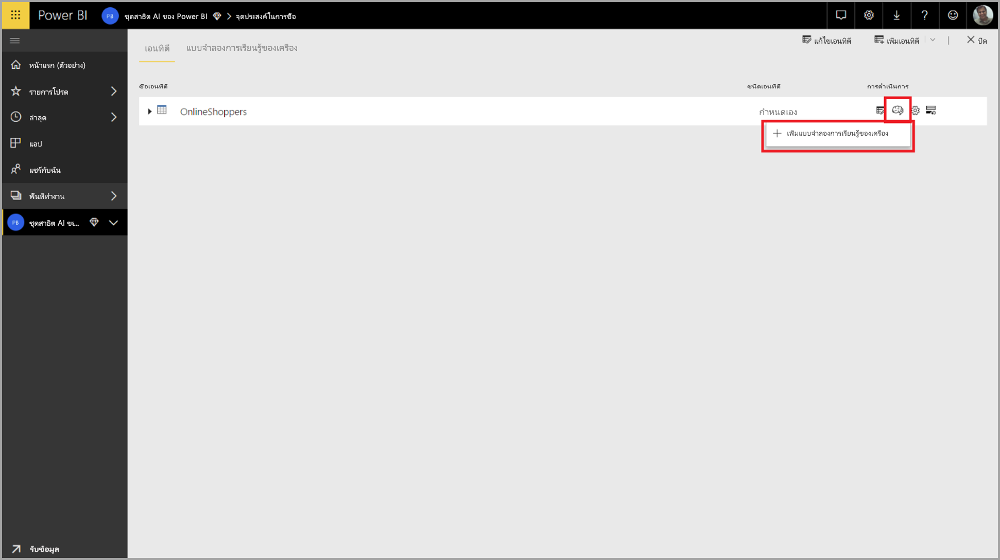

ประสบการณ์การใช้งานง่ายจะเริ่มทำงาน ประกอบด้วยตัวช่วยสร้างที่แนะนำคุณตลอดกระบวนการสร้างแบบจำลองย ตัวช่วยสร้างมีขั้นตอนง่าย ๆ ต่อไปนี้

1. เลือกเอนทิตี มีข้อมูลผลลัพธ์ในอดีต และเขตข้อมูลที่คุณต้องการคาดการณ์
2. เลือกชนิดแบบจำลองที่ยึดตามชนิดของการคาดการณ์ที่คุณต้องการดู
3. เลือกข้อมูลที่ป้อนเข้าคุณต้องการรูปแบบเพื่อใช้เป็นสัญญาณคาดการณ์
4. ชื่อแบบจำลองของคุณ และบันทึกการกำหนดค่า

เขตข้อมูลผลลัพธ์ในอดีตระบุแอตทริบิวต์ป้ายชื่อสำหรับการฝึกอบรมแบบจำลองย แสดงในรูปต่อไปนี้

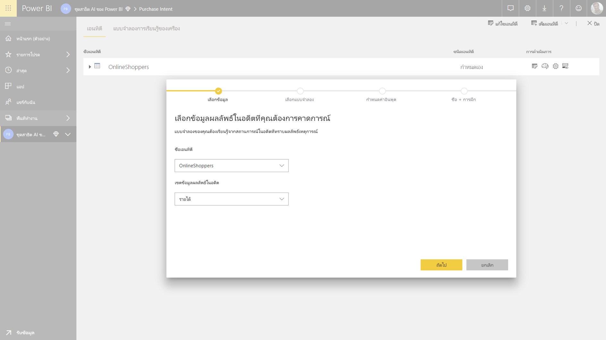

เมื่อคุณระบุเขตข้อมูลผลลัพธ์ในอดีต AutoML วิเคราะห์ข้อมูลป้ายชื่อเพื่อระบุชนิดของแบบจำลองยที่สามารถฝึกสำหรับข้อมูลนั้น และแนะนำชนิดแบบจำลองยยาวกว่าที่สามารถฝึก 

> [!NOTE]
> แบบจำลองบางชนิดอาจไม่ได้รับการสนับสนุนสำหรับข้อมูลที่คุณเลือก

AutoML ยังวิเคราะห์เขตข้อมูลทั้งหมดในเอนทิตีที่เลือกเพื่อแนะนำให้ป้อนข้อมูลที่ใช้ได้สำหรับการฝึกอบรมแบบจำลองย กระบวนการนี้คือโดยประมาณ และยึดวิเคราะห์ทางสถิติ ดังนั้นคุณควรตรวจทานข้อมูลป้อนเข้าใช้ ไม่ควรใช้ป้อนข้อมูลใด ๆ ที่ขึ้นอยู่กับเขตข้อมูลผลลัพธ์ในอดีต (หรือเขตข้อมูลป้ายชื่อ) สำหรับการฝึกอบรมแบบจำลองย เนื่องจากพวกเขาจะมีผลต่อประสิทธิภาพของ

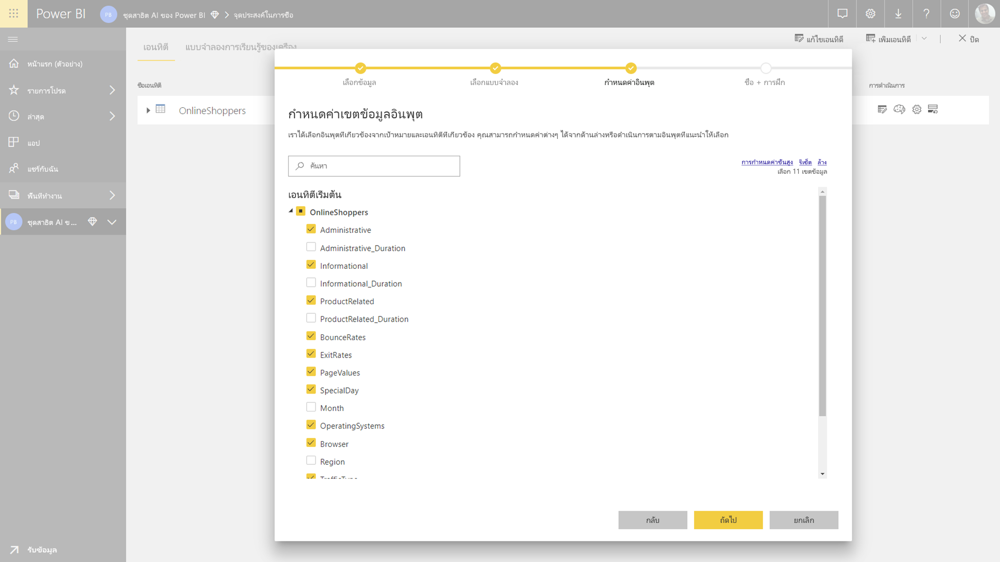

ในขั้นตอนสุดท้าย คุณสามารถตั้งชื่อแบบจำลอง และบันทึกการตั้งค่า

ในขั้นตอนนี้ คุณได้รับพร้อมท์ให้รีเฟรช dataflow ซึ่งเริ่มกระบวนการฝึกอบรมสำหรับแบบจำลองย

### การฝึกแบบจำลองย

การฝึกอบรมของแบบจำลอง AutoML เป็นส่วนหนึ่งของการรีเฟรช dataflow AutoML จัดเตรียมข้อมูลของคุณสำหรับการฝึกอบรมก่อน

AutoML แยกข้อมูลในอดีตที่คุณใส่ลงในการฝึกอบรมและการทดสอบชุดข้อมูล ชุดข้อมูลทดสอบคือ ชุด holdout ที่ใช้สำหรับการตรวจสอบประสิทธิภาพการทำงานแบบจำลองหลังจากการฝึกอบรม ต่อไปนี้จะรับรู้เป็น**การฝึกอบรม และการทดสอบ**เอนทิตีใน dataflow AutoML ใช้ตรวจสอบข้ามสำหรับการตรวจสอบแบบจำลอง

ถัดไป วิเคราะห์แต่ละเขตข้อมูลป้อนเข้า และ imputation ใช้ ซึ่งแทนค่าที่หายไป ด้วยค่าแทน สองกลยุทธ์ imputation แตกต่างกันจะใช้ โดย AutoML แล้ว สุ่มตัวอย่างที่จำเป็นและไลซ์ใด ๆ กับข้อมูลของคุณ

ใช้ AutoML หลายแปลงคือ แต่ละฟิลด์ป้อนข้อมูลที่เลือกขึ้นอยู่กับชนิดของข้อมูล และคุณสมบัติทางสถิติ AutoML ใช้การเปลี่ยนแปลงเหล่านี้เพื่อแยกคุณลักษณะสำหรับใช้ในการฝึกอบรมแบบจำลองของคุณย

กระบวนการฝึกอบรมสำหรับแบบจำลอง AutoML ประกอบด้วยการทำซ้ำสูงสุด 50 ด้วยอัลกอริทึมแบบจำลองที่แตกต่างกันและตั้งค่า hyperparameter เพื่อค้นหารูปแบบที่ มีประสิทธิภาพที่ดีที่สุด มีประเมินประสิทธิภาพของแต่ละรูปแบบเหล่านี้ โดยการตรวจสอบกับชุดข้อมูลทดสอบ holdout ในระหว่างขั้นตอนนี้การฝึกอบรม AutoML สร้างไปป์มากมายสำหรับการฝึกอบรมและการตรวจสอบเหล่านี้ซ้ำ กระบวนการในการประเมินประสิทธิภาพของแบบจำลองจะสามารถใช้เวลา ที่ใดก็ได้จากหลายนาทีในการสองสามชั่วโมง ขึ้นอยู่กับขนาดของชุดข้อมูลของคุณและทรัพยากรความจุเฉพาะพร้อมใช้งาน

ในบางกรณี รูปแบบขั้นสุดท้ายที่สร้างขึ้นอาจใช้ ensemble เรียนรู้ ที่ใช้โมเดลหลายรายการเพื่อมอบประสิทธิภาพการคาดการณ์ได้ดียิ่งขึ้น

### AutoML explainability แบบจำลอง

หลังจากที่ได้รับการฝึกแบบจำลอง AutoML วิเคราะห์ความสัมพันธ์ระหว่างคุณลักษณะการป้อนข้อมูลและผลลัพธ์แบบจำลอง Assesses มากและทิศทางของการเปลี่ยนแปลงไปยังผลลัพธ์รูปแบบสำหรับชุดข้อมูลทดสอบ holdout สำหรับแต่ละคุณลักษณะป้อนข้อมูล ซึ่งเรียกว่าการ*คุณลักษณะสำคัญ*

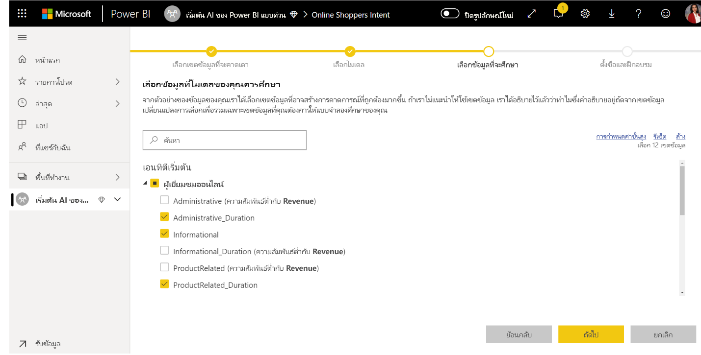

### AutoML แบบจำลองรายงาน

AutoML สร้างรายงาน Power BI ที่สรุปประสิทธิภาพการทำงานของแบบจำลองในระหว่างตรวจสอบ พร้อมกับความสำคัญคุณลักษณะส่วนกลาง รายงานสรุปผลลัพธ์จากการใช้แบบจำลองยข้อมูลทดสอบ holdout และเปรียบเทียบการคาดการณ์ ด้วยค่าผลลัพธ์ที่ทราบแล้ว

คุณสามารถตรวจสอบรายงานแบบจำลองการทำความเข้าใจประสิทธิภาพของ คุณยังสามารถตรวจสอบว่า influencers หลักของแบบจำลองสอดคล้องกับข้อมูลเชิงลึกทางธุรกิจเกี่ยวกับผลทราบแล้ว

แผนภูมิและหน่วยวัดที่ใช้อธิบายประสิทธิภาพการทำงานแบบจำลองในรายงานขึ้นอยู่กับชนิดแบบจำลอง แผนภูมิประสิทธิภาพการทำงานและหน่วยวัดเหล่านี้จะอธิบายไว้ในส่วนต่อไปนี้

หน้าเพิ่มเติมในรายงานอาจอธิบายหน่วยวัดทางสถิติเกี่ยวกับแบบจำลองจากเปอร์สเปคทีวิทยาศาสตร์ข้อมูล เช่น การ**คาดการณ์ไบนารี**รายงานรวมถึงแผนภูมิกำไรและเส้นโค้ง ROC สำหรับแบบจำลอง

รายงานมีการ**รายละเอียดการฝึกอบรม**หน้าที่มีคำอธิบายของวิธีแบบจำลองถูกฝึก และมีแผนภูมิที่อธิบายประสิทธิภาพการทำงานแบบจำลองผ่านการคำนวณซ้ำแต่ละทำงาน

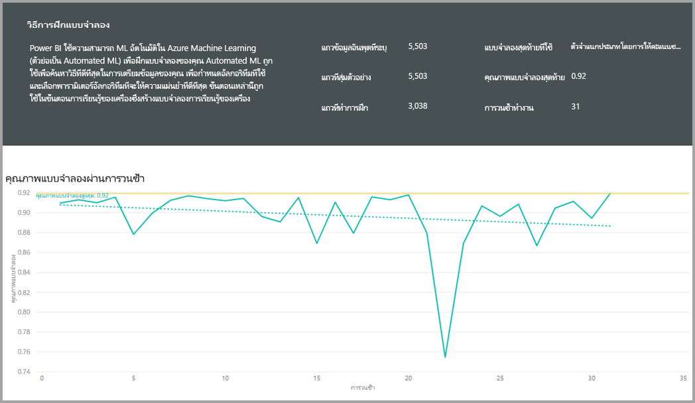

ส่วนอื่นบนหน้านี้อธิบายวิธี imputation ใช้วิธีการกรอกค่าหายไปสำหรับเขตข้อมูลป้อนเข้า ตลอดจนวิธีถูกแปลงแต่ละเขตข้อมูลป้อนเข้าเพื่อแยกคุณลักษณะที่ใช้ในแบบจำลอง และยังมีพารามิเตอร์ที่ใช้ โดยแบบจำลองขั้นสุดท้าย

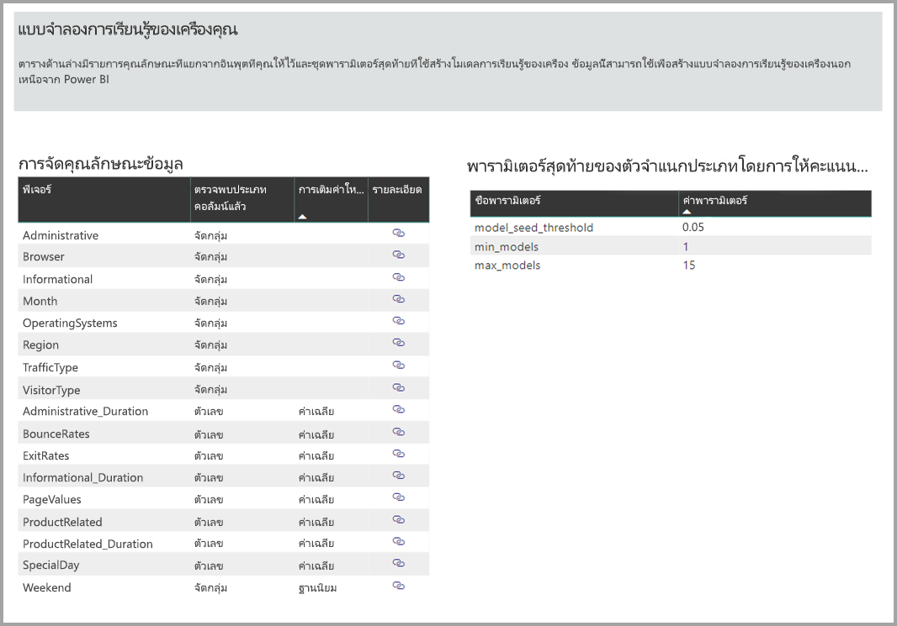

ถ้าแบบจำลองผลิตใช้เรียนรู้ ensemble นั้น**รายละเอียดการฝึกอบรม**หน้ายังมีส่วนอธิบายน้ำหนักของแต่ละรูปแบบส่วนประกอบต่าง ๆ ของใน ensemble ตลอดจนพารามิเตอร์

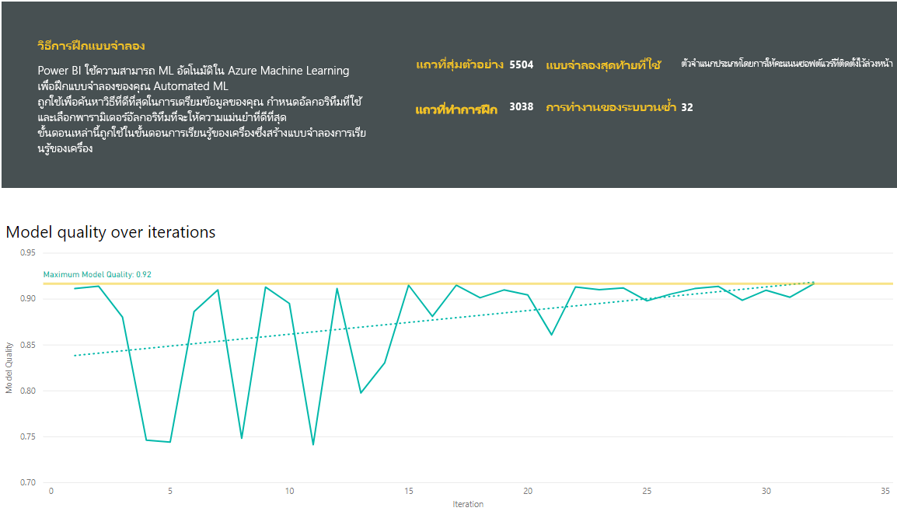

## นำไปใช้แบบจำลอง AutoML

ถ้าคุณพอใจกับประสิทธิภาพของแบบจำลองยสร้าง คุณสามารถนำไปใช้กับข้อมูลใหม่ หรือปรับปรุงเมื่อมีการรีเฟรช dataflow ของคุณ คุณสามารถทำได้จากรายงานแบบจำลอง โดย**นำไปใช้**ปุ่มที่มุมบนขวาได้

เมื่อต้องใช้แบบจำลองย คุณต้องระบุชื่อของเอนทิตีที่จะต้องใช้ และคำนำหน้าสำหรับคอลัมน์ที่จะเพิ่มลงในเอนทิตีนี้สำหรับแบบจำลองผลลัพธ์ คำนำหน้าค่าเริ่มต้นสำหรับชื่อคอลัมน์เป็นชื่อแบบจำลอง การ*นำไปใช้*ฟังก์ชันอาจรวมถึงพารามิเตอร์เพิ่มเติมที่เฉพาะเจาะจงกับชนิดแบบจำลองได้

นำไปใช้แบบจำลองยสร้างเอนทิตี dataflow ใหม่ ด้วยคำต่อท้าย**เลี่ยง < model_name >** เช่น ถ้าคุณใช้_PurchaseIntent_แบบจำลองไป_OnlineShoppers_เอนทิตี จะสร้างผลลัพธ์**OnlineShoppers เลี่ยง PurchaseIntent**

ในปัจจุบัน เอนทิตีผลลัพธ์ไม่สามารถใช้เพื่อแสดงตัวอย่างผลลัพธ์แบบจำลองยในตัวแก้ไข Power Query คอลัมน์ผลลัพธ์แสดงเสมอ null เป็นผลลัพธ์ เมื่อต้องดูผลลัพธ์ วินาทีผลลัพธ์เอนทิตี มีคำต่อท้าย**เลี่ยง < model_name > แสดงตัวอย่าง**ถูกสร้างขึ้นเมื่อมีใช้แบบจำลอง

คุณต้องการรีเฟรช dataflow การแสดงตัวอย่างผลลัพธ์ในตัวแก้ไขคิวรี

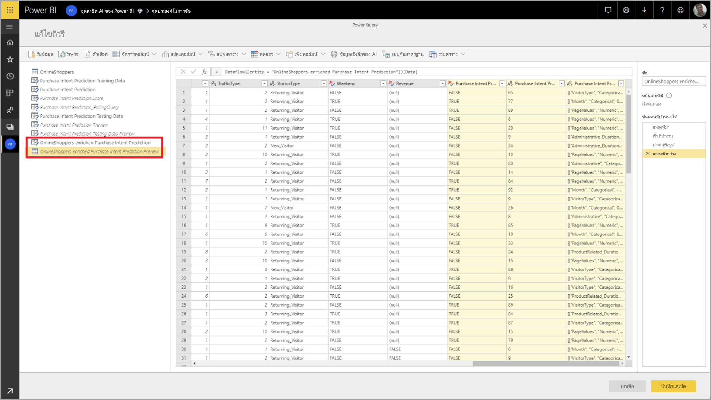

เมื่อคุณนำรูปแบบ AutoML เสมอทำให้การคาดการณ์ของคุณทันสมัยเมื่อมีการรีเฟรช dataflow

AutoML ยังมีคำอธิบายมาก ๆ สำหรับแต่ละแถวที่ได้คะแนนในเอนทิตีผลลัพธ์

ใช้ข้อมูลเชิงลึกและการคาดการณ์จากแบบจำลองยในรายงาน Power BI คุณสามารถเชื่อมต่อเอนทิตีผลลัพธ์จากการใช้ Power BI Desktop **dataflows**ตัวเชื่อมต่อได้

## แบบจำลองการคาดการณ์ไบนารี

แบบจำลองการคาดการณ์ไบนารี มากรู้จักอย่างเป็น**รูปแบบไบนารีจัดประเภท**ถูกใช้เพื่อจัดประเภทชุดข้อมูลลงในกลุ่มที่สอง พวกเขากำลังใช้เพื่อคาดการณ์เหตุการณ์ที่สามารถมีผลลัพธ์เป็นไบนารี เช่นว่าโอกาสทางการขายจะแปลง ไม่ว่าบัญชีผู้ใช้จะ churn ว่าจะชำระใบแจ้งหนี้เวลา ทรานแซคชันว่าลวง และอื่น ๆ

เนื่องจากผลลัพธ์เป็นไบนารี Power BI ต้องป้ายชื่อสำหรับแบบจำลองการคาดการณ์ไบนารีเป็น บูลีน กับผลลัพธ์ที่ทราบแล้วจะมีป้ายชื่อ**จริง**หรือ**false** เช่น ในแบบจำลองแปลงโอกาสทางการขาย โอกาสทางการขายชนะจะมีป้ายชื่อจริง เขตข้อมูลที่สูญหายเป็นป้ายชื่อ false และโอกาสทางการขายที่เปิดจะมีป้ายชื่อเป็น null

ผลลัพธ์ของแบบจำลองการคาดการณ์ไบนารีมีความน่าเป็นคะแนน ซึ่งระบุแนวโน้มว่า จะสามารถทำได้ผลลัพธ์ที่สอดคล้องกับค่าป้ายชื่อถูกจริง

### การฝึกอบรมแบบจำลองการคาดการณ์ไบนารี

เมื่อต้องสร้างแบบจำลองการคาดการณ์ไบนารี เอนทิตีป้อนข้อมูลที่ประกอบด้วยข้อมูลการฝึกอบรมของคุณต้องมีเขตข้อมูลบูลีนเป็นเขตข้อมูลผลลัพธ์ในอดีตเพื่อระบุผลทราบแล้วในอดีต

เบื้องต้น:

* ต้องใช้เขตข้อมูลบูลีนเป็นเขตข้อมูลผลลัพธ์ในอดีต
* อย่างน้อย 50 แถวของข้อมูลในอดีตจำเป็นสำหรับแต่ละชั้นเรียนของผลลัพธ์

โดยทั่วไป ถ้าผลผ่านมาจะถูกระบุ โดยเขตข้อมูลของชนิดข้อมูลอื่น คุณสามารถเพิ่มคอลัมน์จากการคำนวณเพื่อแปลงเหล่านี้เป็นบูลีนโดยใช้ Power Query

กระบวนการในการสร้างสำหรับแบบจำลองการคาดการณ์ไบนารีเดียวกันตามขั้นตอนอื่นโมเดล AutoML อธิบายในส่วน**กำหนดค่าการป้อนข้อมูลแบบจำลองย**ด้านบน

### รายงานแบบจำลองการคาดการณ์ไบนารี

แบบจำลองการคาดการณ์ไบนารีสร้างเป็นเอาท์พุทความน่าเป็นระเบียนจะบรรลุผลที่ได้กำหนดไว้ โดยค่าบูลีนป้ายชื่อที่เป็นจริง รายงานมีตัวแบ่งส่วนข้อมูลสำหรับความน่าเป็นค่าเกณฑ์ของมุม ซึ่งมีผลต่อวิธีการแปลความคะแนนด้านบน และด้าน ล่างความน่าเป็นค่าเกณฑ์ของมุม

รายงานอธิบายเกี่ยวกับประสิทธิภาพการทำงานของแบบจำลองในแง่ของ*ตรวจสอบผิดพลาดจริง*, *ตรวจสอบผิดพลาด False*, *ค่าลบจริง*และ*ค่าลบ False*. ตรวจสอบผิดพลาดจริงและค่าลบ True ได้ผลลัพธ์ที่คาดไว้อย่างถูกต้องสำหรับชั้นเรียนสองในข้อมูลผลลัพธ์ ตรวจสอบผิดพลาด false ได้ผลลัพธ์ที่มีป้ายชื่อบูลีนจริงของค่าเท็จ แต่ถูกทำนายเป็น True ในทางกลับกัน False ค่าลบได้ผลลัพธ์ที่ค่าป้ายชื่อบูลีนจริงเป็น True แต่ถูกทำนายเป็น False

หน่วยวัด เช่นความแม่นยำและเรียกคืน อธิบายผลของความน่าเป็นค่าเกณฑ์บนผลลัพธ์คาดไว้ คุณสามารถใช้ตัวแบ่งส่วนข้อมูลค่าเกณฑ์ของความน่าเป็นการเลือกค่าเกณฑ์ที่ได้รับไม่สมบูรณ์แบบสมดุลระหว่างความแม่นยำและเรียกคืน

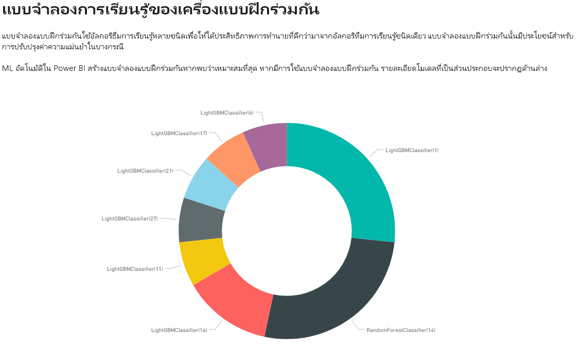

การ**รายงานความแม่นยำ**มีหน้าของรายงานแบบจำลอง*กำไรสะสม*แผนภูมิและ ROC เส้นโค้งสำหรับแบบจำลอง ต่อไปนี้คือการวัดประสิทธิภาพการทำงานแบบจำลองทางสถิติ รายงานมีคำอธิบายของแผนภูมิที่แสดง

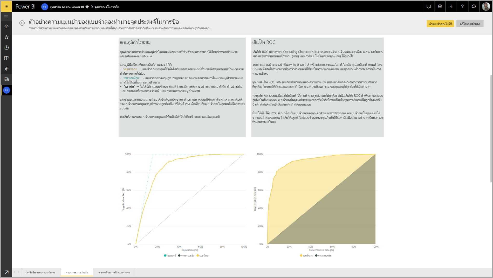

### นำไปใช้แบบจำลองการคาดการณ์ไบนารี

เมื่อต้องใช้แบบจำลองการคาดการณ์ไบนารี คุณต้องระบุเอนทิตีที่ มีข้อมูลที่คุณต้องการใช้การคาดการณ์จากแบบจำลองย พารามิเตอร์อื่น ๆ รวมถึงคำนำหน้าชื่อคอลัมน์ผลลัพธ์และขีดจำกัดความน่าเป็นสำหรับการจัดประเภทของผลลัพธ์คาดไว้

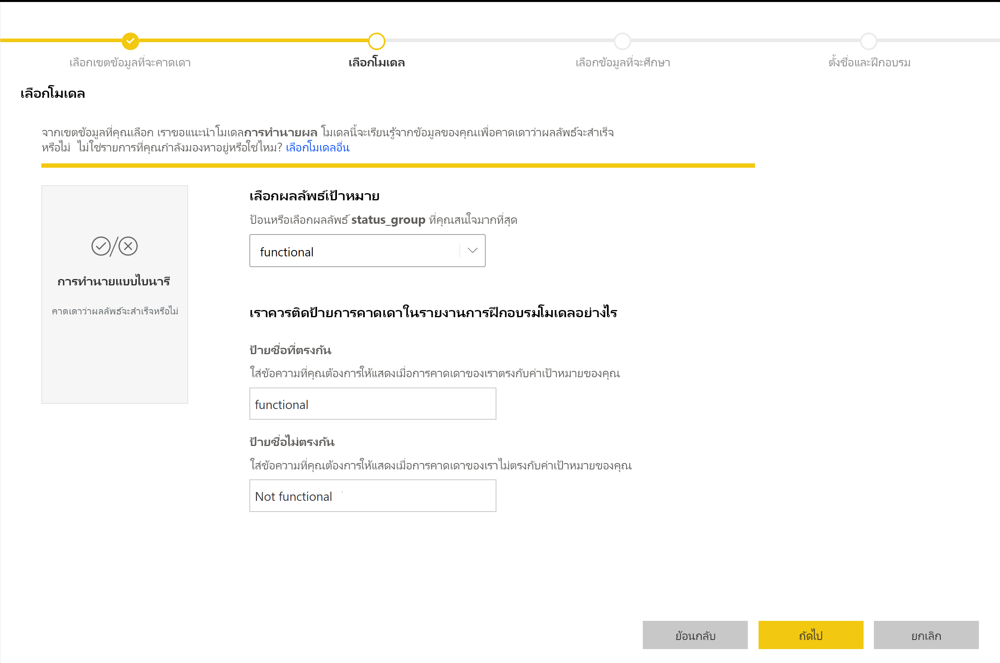

เมื่อมีใช้แบบจำลองการคาดการณ์ไบนารี จะเพิ่มผลลัพธ์สามคอลัมน์ลงในเอนทิตีผลลัพธ์ที่สมบูรณ์ ต่อไปนี้คือการ**PredictionScore**, **PredictionOutcome**และ**PredictionExplanation** ชื่อคอลัมน์ในเอนทิตีมีคำนำหน้าที่ระบุเมื่อมีใช้แบบจำลอง

การ**PredictionOutcome**คอลัมน์ประกอบด้วยป้ายชื่อของผลลัพธ์ที่คาดไว้ ระเบียนที่ มีความน่าจะเกินขีดจำกัดจะคาดการณ์ไว้เป็นแนวโน้มที่จะบรรลุผลลัพธ์ และที่ด้านล่างถูกทำนายเป็นน่าจะบรรลุผลลัพธ์

การ**PredictionExplanation**คอลัมน์ประกอบด้วยคำอธิบาย มีอิทธิพลเฉพาะที่มีคุณลักษณะการป้อนข้อมูลบนการ**PredictionScore** นี่คือคอลเลกชัน JSON ที่ถูกจัดรูปแบบของน้ำหนักของคุณลักษณะป้อนข้อมูลสำหรับการคาดการณ์

## แบบจำลองการจัดประเภท

แบบจำลองการจัดประเภทถูกใช้เพื่อจัดประเภทชุดข้อมูลลงในกลุ่มหรือชั้นเรียนหลายรายการ  พวกเขากำลังใช้เพื่อคาดการณ์เหตุการณ์ที่สามารถมีหนึ่งในหลายได้ผลลัพธ์ เช่นว่าลูกค้ามีแนวโน้มที่จะมีสูงมาก สูง ปานกลาง หรือค่าต่ำสุดที่อายุการใช้งาน ความเสี่ยงสำหรับค่าเริ่มต้นว่าสูง ปานกลาง ต่ำ หรือ ต่ำมาก และอื่น ๆ

ผลลัพธ์ของแบบจำลองการจัดประเภทเป็นความน่าเป็นคะแนน ซึ่งระบุแนวโน้มว่า ระเบียนจะบรรลุเกณฑ์สำหรับชั้นเรียนที่ระบุ

### การฝึกอบรมแบบจัดประเภท

เอนทิตีป้อนข้อมูลที่ประกอบด้วยข้อมูลการฝึกอบรมสำหรับแบบจำลองการจัดประเภทต้องมีสตริงหรือเขตข้อมูลตัวเลขเป็นผลลัพธ์ในอดีตฟิลด์ ซึ่งระบุผลทราบแล้วในอดีต

เบื้องต้น:

* อย่างน้อย 50 แถวของข้อมูลในอดีตจำเป็นสำหรับแต่ละชั้นเรียนของผลลัพธ์

กระบวนการในการสร้างสำหรับแบบจำลองการจัดประเภทเดียวกันตามขั้นตอนอื่นโมเดล AutoML อธิบายในส่วน**กำหนดค่าการป้อนข้อมูลแบบจำลองย**ด้านบน

### จัดประเภทแบบจำลองรายงาน

ทดสอบการสร้างแบบจำลองรายงาน โดยใช้แบบจำลองย holdout จัดประเภทข้อมูลและการเปรียบเทียบที่ทำนายสำหรับชั้นเรียนสำหรับระเบียนกับชั้นเรียนทราบจริง

รายงานแบบจำลองมีแผนภูมิที่มีการแบ่งย่อยของระเบียนอย่างถูกต้อง และไม่ถูกต้องแบ่งประเภทสำหรับแต่ละชั้นเรียนทราบ

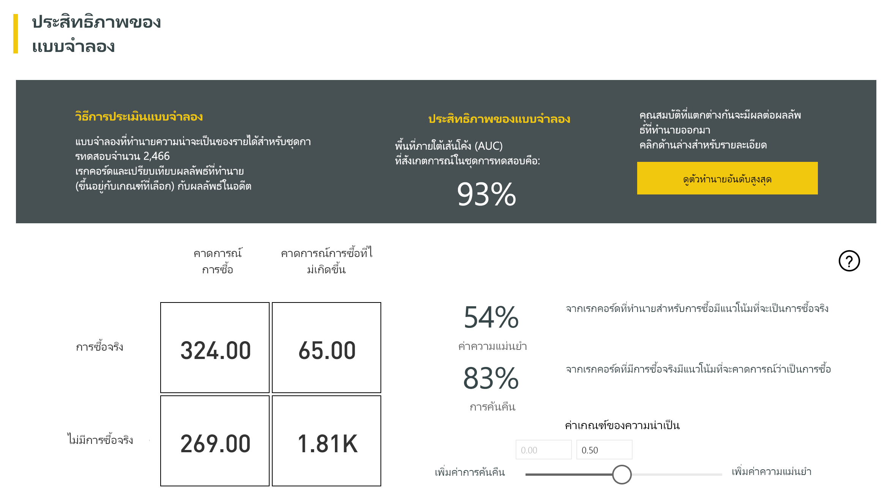

การเพิ่มเติมสำหรับชั้นเรียนเฉพาะเจาะลึกลงทำให้การวิเคราะห์ของวิธีกระจายการคาดการณ์สำหรับชั้นเรียนทราบ ซึ่งรวมถึงคลาอื่น ๆ ที่ระเบียนของที่รู้จักสำหรับชั้นเรียนซึ่งมักจะเป็นงาน

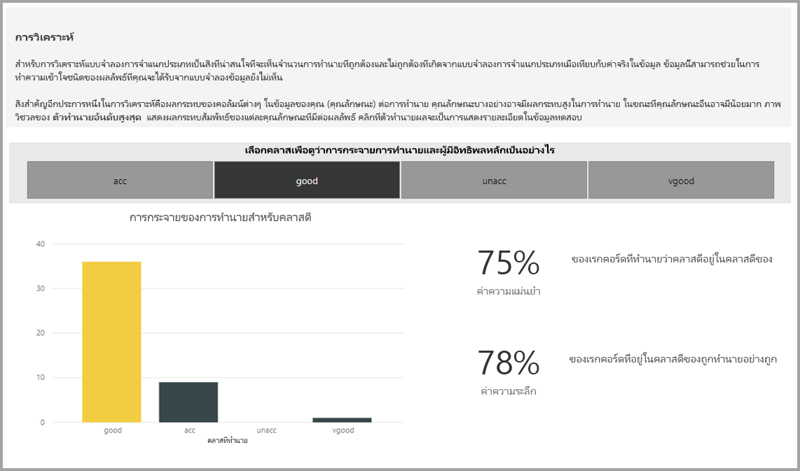

คำอธิบายแบบจำลองในรายงานยังมี predictors ด้านบนสำหรับแต่ละชั้นเรียน

จัดประเภทแบบจำลองรายงานยังมีหน้ารายละเอียดการฝึกอบรมคล้ายกับหน้าสำหรับชนิดแบบจำลองอื่น ๆ ตามที่อธิบายไว้ในส่วน**AutoML แบบจำลองรายงาน**ก่อนหน้าในบทความนี้

### นำไปใช้แบบจำลองการจัดประเภท

เมื่อต้องใช้แบบจำลองยจัดประเภท คุณต้องระบุเอนทิตีที่ มีข้อมูลป้อนเข้าและคำนำหน้าชื่อคอลัมน์ผลลัพธ์

เมื่อมีใช้แบบจำลองการจัดประเภท เพิ่มสามผลลัพธ์คอลัมน์ผลลัพธ์สมบูรณ์เอนทิตี ต่อไปนี้คือการ**PredictionScore**, **PredictionClass**และ**PredictionExplanation** ชื่อคอลัมน์ในเอนทิตีมีคำนำหน้าที่ระบุเมื่อมีใช้แบบจำลอง

การ**PredictionClass**คอลัมน์ประกอบด้วยคลาสทำนายโดยปกติสำหรับระเบียน การ**PredictionScore**คอลัมน์ประกอบด้วยรายการคะแนนความน่าเป็นสำหรับระเบียนสำหรับแต่ละชั้นเรียนที่เป็นไป

การ**PredictionExplanation**คอลัมน์ประกอบด้วยคำอธิบาย มีอิทธิพลเฉพาะที่มีคุณลักษณะการป้อนข้อมูลบนการ**PredictionScore** นี่คือคอลเลกชัน JSON ที่ถูกจัดรูปแบบของน้ำหนักของคุณลักษณะป้อนข้อมูลสำหรับการคาดการณ์

## แบบจำลองการถดถอย

แบบจำลองการถดถอยจะใช้การทำนายค่า เช่นรายได้แนวโน้มที่จะถูกรับรู้จากข้อเสนอขาย ค่าอายุการใช้งานของบัญชีผู้ใช้ จำนวนใบแจ้งหนี้ลูกหนี้ที่อาจจะต้องชำระ วันซึ่งอาจชำระเงินใบแจ้งหนี้ เรื่อย ๆ

ผลลัพธ์ของแบบจำลองการถดถอยคือ ค่าคาดไว้

### การฝึกอบรมแบบจำลองการถดถอย

เอนทิตีป้อนข้อมูลที่ประกอบด้วยข้อมูลการฝึกอบรมสำหรับแบบจำลองการถดถอยต้องมีเขตข้อมูลตัวเลขเป็นผลลัพธ์ในอดีตฟิลด์ ซึ่งระบุค่าผลลัพธ์ที่ทราบแล้วในอดีต

เบื้องต้น:

* ค่าสูงสุด 100 แถวของข้อมูลในอดีตจำเป็นสำหรับแบบจำลองการถดถอย

กระบวนการในการสร้างสำหรับแบบจำลองการถดถอยเดียวกันตามขั้นตอนอื่นโมเดล AutoML อธิบายในส่วน**กำหนดค่าการป้อนข้อมูลแบบจำลองย**ด้านบน

### รายงานแบบจำลองการถดถอย

เช่นอื่น ๆ AutoML แบบจำลองรายงาน รายงานถดถอยจะเป็นไปตามผลลัพธ์จากการใช้แบบจำลองข้อมูลทดสอบ holdout

รายงานแบบจำลองมีแผนภูมิที่เปรียบเทียบค่าที่ทำนายค่าจริง ในแผนภูมินี้ ระยะห่างจากทแยงมุมบ่งชี้ข้อผิดพลาดในการคาดการณ์

ข้อผิดพลาดส่วนที่เหลือแผนภูมิแสดงการแจกแจงของเปอร์เซ็นต์ของข้อผิดพลาดโดยเฉลี่ยสำหรับค่าต่าง ๆ ในชุดข้อมูลทดสอบ holdout แกนแนวนอนแสดงค่าเฉลี่ยของค่าจริงสำหรับกลุ่ม กับขนาดของฟองแสดงความถี่ในการนับจำนวนค่าในช่วงนั้น แกนตั้งมีข้อผิดพลาดส่วนที่เหลือโดยเฉลี่ย

รายงานแบบจำลองการถดถอยยังมีหน้ารายละเอียดการฝึกอบรมเช่นรายงานสำหรับแบบจำลองชนิดอื่น ๆ ตามที่อธิบายไว้ในส่วน**AutoML แบบจำลองรายงาน**ด้านบน

### นำไปใช้แบบจำลองการถดถอย

เมื่อต้องใช้แบบจำลองการถดถอยย คุณต้องระบุเอนทิตีที่ มีข้อมูลป้อนเข้าและคำนำหน้าชื่อคอลัมน์ผลลัพธ์

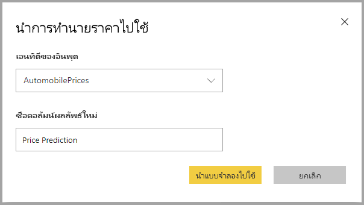

เมื่อมีใช้แบบจำลองการถดถอย จะเพิ่มสองคอลัมน์ผลลัพธ์ลงในเอนทิตีผลลัพธ์ที่สมบูรณ์ ต่อไปนี้คือการ**PredictionValue**และ**PredictionExplanation** ชื่อคอลัมน์ในเอนทิตีมีคำนำหน้าที่ระบุเมื่อมีใช้แบบจำลอง

การ**PredictionValue**คอลัมน์ประกอบด้วยค่าที่ทำนายสำหรับระเบียนที่ยึดตามเขตข้อมูลป้อนเข้า การ**PredictionExplanation**คอลัมน์ประกอบด้วยคำอธิบาย มีอิทธิพลเฉพาะที่มีคุณลักษณะการป้อนข้อมูลบนการ**PredictionValue** นี่คือคอลเลกชัน JSON ที่ถูกจัดรูปแบบของน้ำหนักของคุณลักษณะการป้อนข้อมูล

## ขั้นตอนถัดไป

บทความนี้ให้ภาพรวมของ Machine Learning อัตโนมัติสำหรับ Dataflows ในบริการ Power BI บทความต่อไปนี้อาจเป็นประโยชน์

* [บทช่วยสอน: สร้างแบบจำลอง Machine Learning ใน Power BI (ตัวอย่าง)](service-tutorial-build-machine-learning-model.md)
* [บทช่วยสอน: การใช้ Cognitive Services ใน Power BI](service-tutorial-use-cognitive-services.md)
* [บทช่วยสอน: เรียกใช้แบบจำลอง Machine Learning Studio ใน Power BI (ตัวอย่าง)](service-tutorial-invoke-machine-learning-model.md)
* [Cognitive Services ใน Power BI (ตัวอย่าง)](service-cognitive-services.md)
* [การรวม Azure Machine Learning ใน Power BI (ตัวอย่าง)](service-machine-learning-integration.md)

คุณสามารถอ่านบทความเหล่านี้สำหรับข้อมูลเพิ่มเติมเกี่ยวกับกระแสข้อมูลได้:
* [การสร้างและใช้กระแสข้อมูลใน Power BI](service-dataflows-create-use.md)
* [ใช้เอนทิตีที่มีการคำนวณใน Power BI Premium](service-dataflows-computed-entities-premium.md)
* [ใช้ dataflows กับแหล่งข้อมูลภายในองค์กร](service-dataflows-on-premises-gateways.md)
* [ทรัพยากรสำหรับนักพัฒนาสำหรับ dataflows Power BI](service-dataflows-developer-resources.md)
* [ การรวมกระแสข้อมูลและ Azure Data Lake (ตัวอย่าง)](service-dataflows-azure-data-lake-integration.md)

