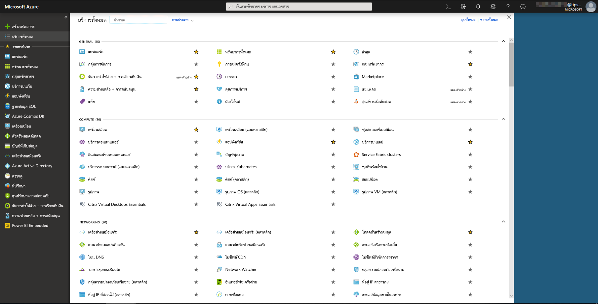
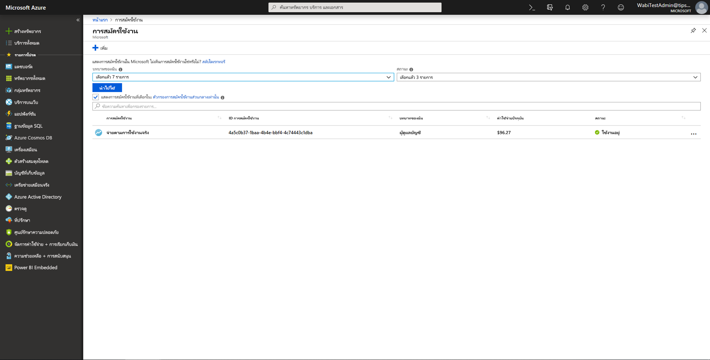
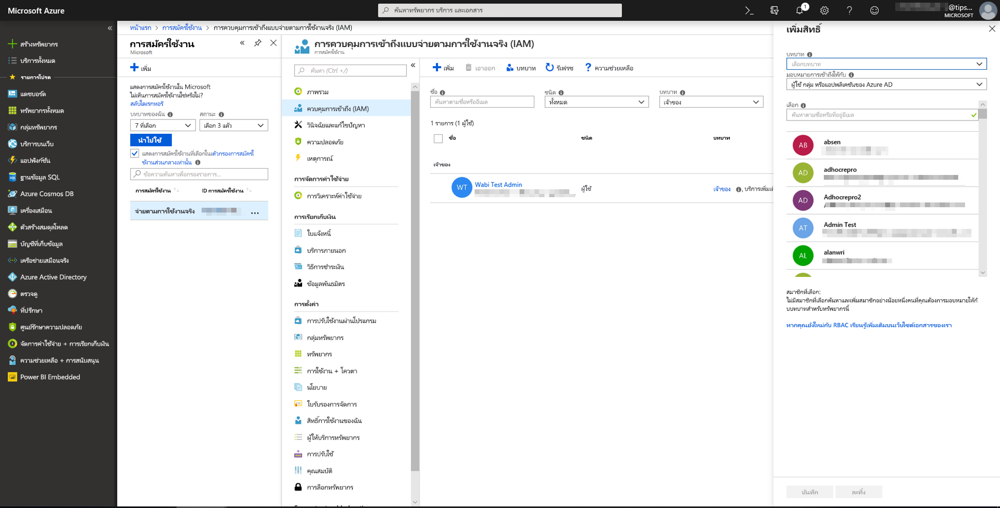
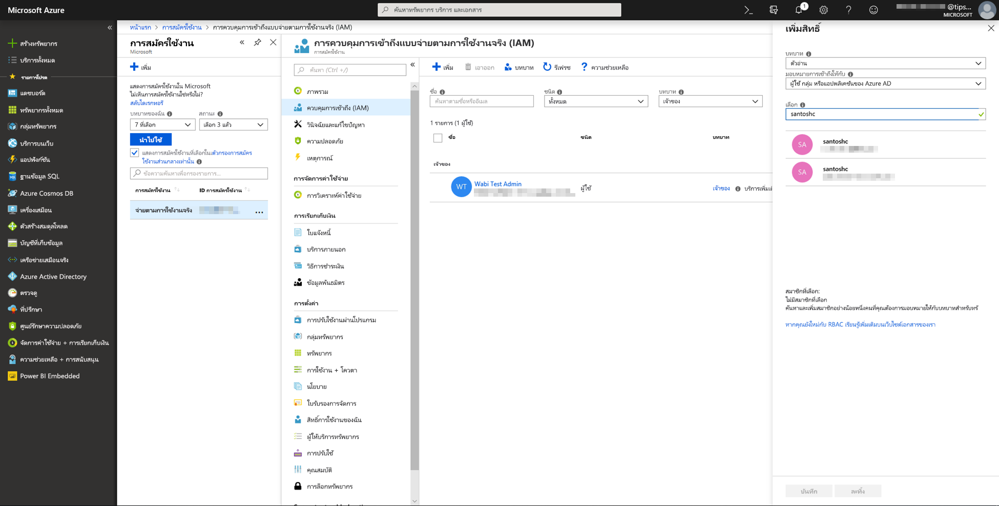
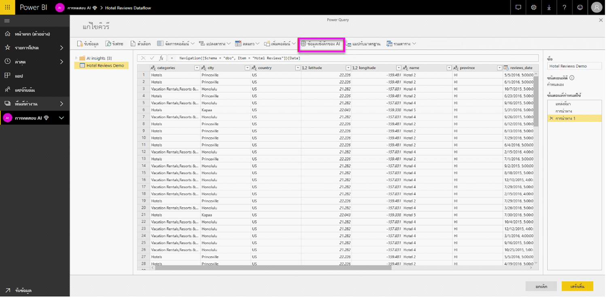
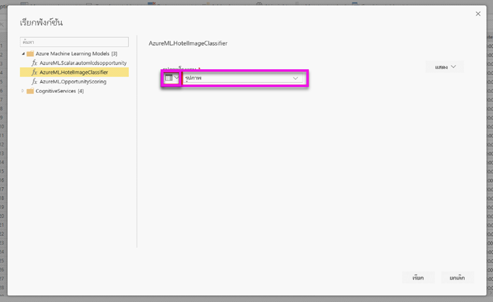
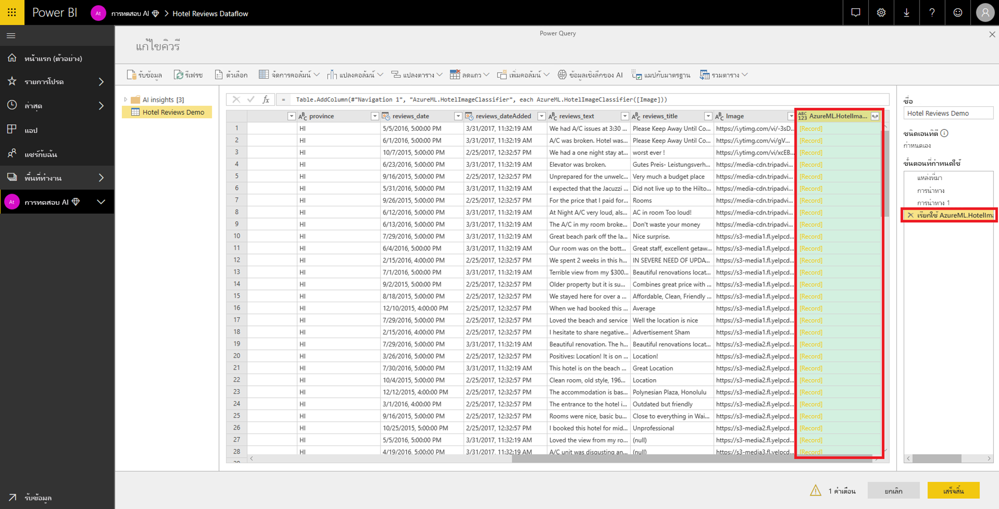
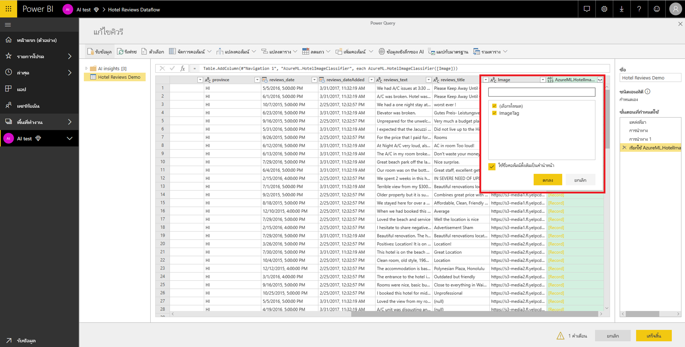

# การรวม Azure Machine Learning ใน Power BI

องค์กรมากมายใช้แบบจำลอง **Machine Learning** เพื่อข้อมูลเชิงลึกและการคาดการณ์เกี่ยวกับธุรกิจของตนเองที่ดีกว่า ความสามารถในการแสดงผลด้วยภาพจากแบบจำลองเหล่านี้ในรายงานและแดชบอร์ดรวมถึงการวิเคราะห์อื่นๆ ของคุณสามารถช่วยเผยแพร่ข้อมูลเชิงลึกเหล่านี้ให้แก่ผู้ใช้ทางธุรกิจที่ต้องการมากที่สุดได้  ขณะนี้ Power BI ช่วยให้การรวมข้อมูลเชิงลึกจากแบบจำลองที่โฮสต์บน Azure Machine Learning ได้อย่างง่ายดายโดยใช้ลักษณะการชี้และคลิกโดยตรง

หากต้องการใช้ความสามารถนี้ นักวิทยาศาสตร์ข้อมูลสามารถให้สิทธิ์เข้าถึงแบบจำลอง Azure ML ไปยังนักวิเคราะห์ BI โดยใช้พอร์ทัล Azure ได้อย่างง่ายดาย  จากนั้น ณ จุดเริ่มต้นของแต่ละเซสชัน Power Query จะค้นพบแบบจำลอง Azure MLทั้งหมดที่ผู้ใช้ได้เข้าถึง และแสดงเป็นฟังก์ชัน Power Query แบบไดนามิก  จากนั้นผู้ใช้จะสามารถเรียกใช้ฟังก์ชันเหล่านั้นโดยการเข้าถึงจาก Ribbon ในตัวแก้ไข Power Query หรือโดยการเรียกฟังก์ชัน M โดยตรง นอกจากนี้ Power BI ยังรวมคำขอการเข้าถึงโดยอัตโนมัติเมื่อเรียกแบบจำลอง Azure ML สำหรับชุดของแถวเพื่อบรรลุประสิทธิภาพการทำงานที่ดีกว่า

ฟังก์ชันนี้จะได้รับการรองรับเฉพาะกระแสข้อมูล Power BI และ Power Query แบบออนไลน์ในบริการของ Power BI

หากต้องการเรียนรู้เพิ่มเติมเกี่ยวกับกระแสข้อมูล โปรดดู [การเตรียมข้อมูลด้วยตนเองใน Power BI](service-dataflows-overview.md)

หากต้องการเรียนรู้เพิ่มเติมเกี่ยวกับ Azure Machine Learning โปรดดู:

- ภาพรวม:  [Azure Machine Learning คืออะไร](https://docs.microsoft.com/azure/machine-learning/service/overview-what-is-azure-ml)
- เริ่มต้นใช้งานด่วนและบทช่วยสอนสำหรับ Azure Machine Learning:  [เอกสารประกอบ Azure Machine Learning](https://docs.microsoft.com/azure/machine-learning/)

## การให้สิทธิ์เข้าถึงแบบจำลอง Azure ML แก่ผู้ใช้ Power BI

หากต้องการเข้าถึงแบบจำลอง Azure ML จาก Power BI ผู้ใช้จะต้องมีการสมัครใช้งาน Azure ที่มีการเข้าถึงแบบ **อ่าน**  นอกจากนี้:

- สำหรับแบบจำลอง Machine Learning Studio (คลาสสิก) ต้องใช้การเข้าถึงแบบ **อ่าน** สำหรับบริการบนเว็บ Machine Learning Studio (คลาสสิก)
- สำหรับแบบจำลอง Machine Learning ต้องใช้การเข้าถึงแบบ **อ่าน** สำหรับพื้นที่ทำงาน Machine Learning

ขั้นตอนในบทความนี้จะอธิบายวิธีให้สิทธิ์ใช้งานแก่ผู้ใช้ Power BI ในการเข้าถึงแบบจำลองที่โฮสต์บนบริการ Azure ML เพื่อให้ผู้ใช้สามารถเข้าถึงแบบจำลองนี้เป็นฟังก์ชัน Power Query  โปรดดู [จัดการการเข้าถึง RBAC และพอร์ทัล Azure](https://docs.microsoft.com/azure/role-based-access-control/role-assignments-portal) สำหรับรายละเอียดอื่นๆ

1. ลงชื่อเข้าใช้ไปยัง [พอร์ทัล Azure](https://portal.azure.com)

2. ไปที่หน้า **การสมัครใช้งาน** คุณสามารถค้นหาหน้า **การสมัครใช้งาน** ผ่านรายการ **บริการทั้งหมด** ในเมนูบานหน้าต่างนำทางของพอร์ทัล Azure

    

3. เลือกการสมัครใช้งานของคุณ

    

4. เลือก **ควบคุมการเข้าถึง (IAM)** แล้วเลือกปุ่ม **เพิ่ม**

    

5. เลือกบทบาทเป็น **ผู้อ่าน** เลือกผู้ใช้ Power BI ที่คุณต้องการให้สิทธิ์เข้าถึงแบบจำลอง Azure ML

    

6. เลือก**บันทึก**

7. ทำซ้ำขั้นตอนที่สามถึงหกเพื่อให้สิทธิ์การเข้าถึงแบบ **ผู้อ่าน** แก่ผู้ใช้สำหรับบริการบนเว็บ Machine Learning Studio (คลาสสิก) ที่เจาะจง *หรือ* พื้นที่ทำงาน Machine Learning ที่โฮสต์แบบจำลอง

## การค้นพบ Schema สำหรับแบบจำลอง Machine Learning

นักวิทยาศาสตร์ข้อมูลใช้ Python เป็นหลักเพื่อพัฒนาหรือแม้กระทั่งปรับใช้ แบบจำลองการเรียนรู้ของเครื่องของพวกเขาสำหรับ Machine Learning  ซึ่งต่างจาก Machine Learning Studio (คลาสสิก) ซึ่งช่วยให้งานการสร้างไฟล์ Schema สำหรับแบบจำลองเป็นไปโดยอัตโนมัติ ในกรณีของ Machine Learning นักวิทยาศาสตร์ข้อมูลต้องสร้างไฟล์ Schema อย่างชัดเจนโดยใช้ Python

ไฟล์ Schema นี้ต้องอยู่ในบริการเว็บที่ปรับใช้สำหรับแบบจำลอง Machine Learning หากต้องการสร้าง Schema สำหรับบริการเว็บโดยอัตโนมัติ คุณต้องใส่ตัวอย่างของอินพุท/เอาท์พุทในสคริปต์รายการสำหรับแบบจำลองที่ปรับใช้ โปรดดูที่หัวข้อย่อยเกี่ยวกับการสร้าง Schema ของ Swagger แบบอัตโนมัติ [(ไม่บังคับ) ในแบบจำลองการปรับใช้ด้วยเอกสารบริการ Azure Machine Learning](https://docs.microsoft.com/azure/machine-learning/service/how-to-deploy-and-where#optional-automatic-schema-generation) ลิงก์มีสคริปต์รายการตัวอย่างด้วยคำสั่งสำหรับการสร้าง Schema 

โดยเฉพาะ ฟังก์ชัน *\@input_schema* และ *\@output_schema* ในสคริปต์รายการอ้างอิงค่ารูปแบบตัวอย่างอินพุทและเอาท์พุทในตัวแปร *input_sample*และ *output_sample* และใช้ตัวอย่างเหล่านี้เพื่อสร้างข้อกำหนด OpenAPI (Swagger) สำหรับบริการเว็บในระหว่างการปรับใช้งาน

คำแนะนำเหล่านี้สำหรับการสร้าง Schema โดยการอัปเดตสคริปต์รายการจะต้องนำไปใช้กับแบบจำลองที่สร้างขึ้นโดยใช้การทดสอบการเรียนรู้ของเครื่องอัตโนมัติโดยใช้ Azure Machine Learning SDK

> [!NOTE]
> แบบจำลองที่สร้างขึ้นโดยใช้อินเทอร์เฟสการแสดงผลด้วยภาพของ Azure Machine Learning ปัจจุบันไม่รองรับการสร้าง Schema แต่จะรองรับในรุ่นต่อ ๆ มา 

## การเรียกแบบจำลอง Azure ML ใน Power BI

คุณสามารถเรียกแบบจำลอง Azure ML ใดๆ ที่คุณได้รับสิทธิ์เข้าถึงได้ โดยตรงจากตัวแก้ไข Power Query ในกระแสข้อมูลของคุณ หากต้องการเข้าถึงแบบจำลอง Azure ML ให้เลือกปุ่ม **แก้ไข** สำหรับเอนทิตีที่คุณต้องการเติมแต่งด้วยข้อมูลเชิงลึกจากแบบจำลอง Azure ML ของคุณดังที่แสดงในรูปภาพต่อไปนี้

การเลือกปุ่ม **แก้ไข** เพื่อเปิดตัวแก้ไข Power Query สำหรับเอนทิตีในกระแสข้อมูลของคุณ

เลือกปุ่ม **ข้อมูลเชิงลึกของ AI** ในริบบอน จากนั้นเลือกโฟลเดอร์ _แบบจำลอง Azure Machine Learning_ จากเมนูบานหน้าต่างนำทาง แบบจำลอง Azure ML ทั้งหมดที่คุณสามารถเข้าถึงได้จะแสดงที่นี่เป็นฟังก์ชัน Power Query นอกจากนี้ พารามิเตอร์ที่ป้อนเข้าสำหรับแบบจำลอง Azure ML จะแมปเป็นพารามิเตอร์ของฟังก์ชัน Power Query ที่สอดคล้องกันโดยอัตโนมัติ

หากต้องการเรียกแบบจำลอง Azure ML คุณสามารถระบุคอลัมน์ของเอนทิตีที่เลือกใดๆ ก็ได้ เป็นข้อมูลป้อนเข้าจากดรอปดาวน์ นอกจากนี้คุณยังสามารถระบุค่าคงที่เพื่อใช้เป็นข้อมูลป้อนเข้าได้ โดยสลับไอคอนคอลัมน์ไปทางซ้ายของกล่องโต้ตอบที่ป้อนเข้า

เลือก **การเรียก** เพื่อดูตัวอย่างผลลัพธ์ของแบบจำลอง Azure ML เป็นคอลัมน์ใหม่ในตารางเอนทิตี นอกจากนี้คุณจะเห็นการเรียกแบบจำลองเป็นขั้นตอนที่นำไปใช้สำหรับคิวรี

หากแบบจำลองส่งกลับพารามิเตอร์ผลลัพธ์หลายรายการ พารามิเตอร์เหล่านั้นจะถูกจัดกลุ่มเข้าด้วยกันเป็นระเบียนในคอลัมน์ผลลัพธ์ คุณสามารถขยายคอลัมน์เพื่อสร้างแต่ละพารามิเตอร์ผลลัพธ์ในคอลัมน์แยกต่างหากได้

เมื่อบันทึกกระแสข้อมูลของคุณแล้ว ระบบจะเรียกแบบจำลองโดยอัตโนมัติเมื่อมีการรีเฟรชกระแสข้อมูล สำหรับแถวใหม่หรือแถวที่ได้รับการอัปเดตใดๆ ในตารางเอนทิตี

## ขั้นตอนถัดไป

บทความนี้จะให้ภาพรวมของการรวม Machine Learning ลงในบริการ Power BI บทความต่อไปนี้อาจน่าสนใจและเป็นประโยชน์สำหรับคุณ 

* [บทช่วยสอน: เรียกใช้แบบจำลอง Machine Learning Studio (คลาสสิก) ใน Power BI](service-tutorial-invoke-machine-learning-model.md)
* [บทช่วยสอน: การใช้ Cognitive Services ใน Power BI](service-tutorial-use-cognitive-services.md)
* [Cognitive Services ใน Power BI](service-cognitive-services.md)

คุณสามารถอ่านบทความเหล่านี้สำหรับข้อมูลเพิ่มเติมเกี่ยวกับกระแสข้อมูลได้:
* [การสร้างและใช้กระแสข้อมูลใน Power BI](service-dataflows-create-use.md)
* [การใช้เอนทิตีที่คำนวณใน Power BI Premium](service-dataflows-computed-entities-premium.md)
* [การใช้กระแสข้อมูลกับแหล่งข้อมูลภายในองค์กร](service-dataflows-on-premises-gateways.md)
* [แหล่งข้อมูลของนักพัฒนาสำหรับกระแสข้อมูล Power BI](service-dataflows-developer-resources.md)
* [ การรวมกระแสข้อมูลและ Azure Data Lake (ตัวอย่าง)](service-dataflows-azure-data-lake-integration.md)

