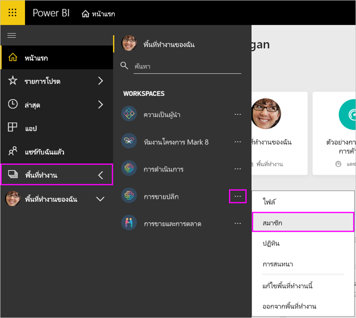

# จัดการพื้นที่ทำงานของแอปใน Power BI และ Office 365

ในฐานะผู้สร้างหรือผู้ดูแลระบบของ[พื้นที่ทำงานของแอปใน Power BI](service-create-distribute-apps.md)หรือใน Office 365 คุณจัดการบางส่วนของพื้นที่ทำงานใน Power BI ลักษณะอื่นๆ คุณจัดการใน Office 365

> [!NOTE]
> ตัวอย่างการใช้งานพื้นที่ทำงานใหม่จะเปลี่ยนความสัมพันธ์ระหว่างพื้นที่ทำงาน Power BI และกลุ่ม Office 365 คุณจะไม่สามารถสร้างกลุ่ม Office 365 โดยอัตโนมัติทุกครั้งที่คุณสร้างพื้นที่ทำงานใหม่ อ่านเกี่ยวกับ [สร้างพื้นที่ทำงานใหม่](service-create-the-new-workspaces.md)

ใน **Power BI** คุณสามารถ:

* เพิ่มหรือลบสมาชิกพื้นที่ทำงานในแอป รวมถึงการทำให้สมาชิกพื้นที่ทำงานผู้ดูแลระบบ
* แก้ไขชื่อพื้นที่ทำงานของแอป
* ลบพื้นที่ทำงานของแอป

ใน **Office 365** คุณสามารถ:

* เพิ่มหรือลบสมาชิกพื้นที่ทำงานในแอป รวมถึงการทำให้สมาชิกเป็นเจ้าของ
* แก้ไขชื่อกลุ่ม รูปภาพ คำอธิบาย และการตั้งค่าอื่นๆ
* ดูที่อยู่อีเมลของกลุ่ม
* ลบกลุ่ม

คุณจำเป็นต้องมี[สิทธิ์การใช้งาน Power BI Pro](service-features-license-type.md) ที่เป็นผู้ดูแลระบบหรือสมาชิกของพื้นที่ทำงานของแอป ผู้ใช้แอปของคุณต้องมสิทธิ์ใช้งาน Power BI Pro เช่นกัน ยกเว้นว่าพื้นที่ทำงานของแอปอยเป็นแบบ Power BI Premium อ่าน[Power BI Premium คืออะไร](service-premium-what-is.md)สำหรับรายละเอียด

## แก้ไขพื้นที่ทำงานของแอปใน Power BI

1. ใน Power BI service เลือกลูกศรถัดจาก**พื้นที่ทำงาน** > เลือกจุดไข่ปลา (...) ถัดจากชื่อพื้นที่ทำงานของคุณ > **แก้ไขพื้นที่ทำงาน**

   

   > [!NOTE]
   > คุณเห็นเฉพาะ **แก้ไขพื้นที่ทำงานนี้** ถ้าคุณเป็นผู้ดูแลระบบพื้นที่ทำงานของแอป

1. ที่นี่คุณสามารถเปลี่ยนชื่อพื้นที่ทำงาน เพิ่ม หรือลบสมาชิกออก หรือลบพื้นที่ทำงานได้

   

1. เลือก**บันทึก**หรือ**ยกเลิก**

## แก้ไขคุณสมบัติในพื้นที่ทำงานของแอป Power BI ใน Office 365

คุณยังสามารถแก้ไขลักษณะของพื้นที่ทำงานแอปได้โดยตรงใน Outlook สำหรับ Office 365

### แก้ไขสมาชิกของกลุ่มพื้นที่ทำงานแอป

1. ใน Power BI service เลือกลูกศรลงถัดจาก**พื้นที่ทำงาน** > เลือกจุดไข่ปลา (...) ถัดจากชื่อพื้นที่ทำงานของคุณ > **สมาชิก**

   

   สิ่งนี้เปิด Outlook สำหรับกลุ่มมุมมอง Office 365 ของพื้นที่ทำงานของแอป คุณอาจจำเป็นต้องลงชื่อเข้าใช้บัญชีขององค์กรของคุณ

1. เลือกบทบาทถัดจากชื่อเพื่อนร่วมทีมเพื่อให้บุคคลนั้นเป็น **สมาชิก** หรือ **เจ้าของ** เลือก **X** เพื่อลบบุคคลออกจากกลุ่ม

   

### เพิ่มรูปภาพ และตั้งค่าคุณสมบัติพื้นที่ทำงานอื่นๆ

เมื่อคุณเผยแพร่แอปของคุณจากพื้นที่ทำงานของแอป รูปภาพที่คุณเพิ่มที่นี่จะเป็นรูปภาพสำหรับแอปของคุณ ดูหัวข้อ [เพิ่มรูปภาพในพื้นที่ทำงานของแอป Office 365 (ไม่บังคับ)](service-create-workspaces.md#add-an-image-to-your-office-365-app-workspace-optional) ของบทความ **สร้างพื้นที่ทำงานใหม่**

1. ในมุมมอง Outlook for Office 365 ของพื้นที่ทำงานแอปของคุณ ให้ไปที่แท็บ **เกี่ยวกับ** แล้วเลือก **แก้ไข**

    
1. คุณสามารถแก้ไขชื่อ คำอธิบาย และภาษาสำหรับการแจ้งเตือนที่เกี่ยวข้องกับกลุ่มได้ คุณยังสามารถเพิ่มรูปภาพ และตั้งค่าคุณสมบัติอื่นได้ ที่นี่

   

1. เลือก**บันทึก**หรือ**ละทิ้ง**

## ขั้นตอนถัดไป

* [เผยแพร่แอปใน Power BI](service-create-distribute-apps.md)

* มีคำถามเพิ่มเติมหรือไม่? [ลองไปที่ชุมชน Power BI](http://community.powerbi.com/)
