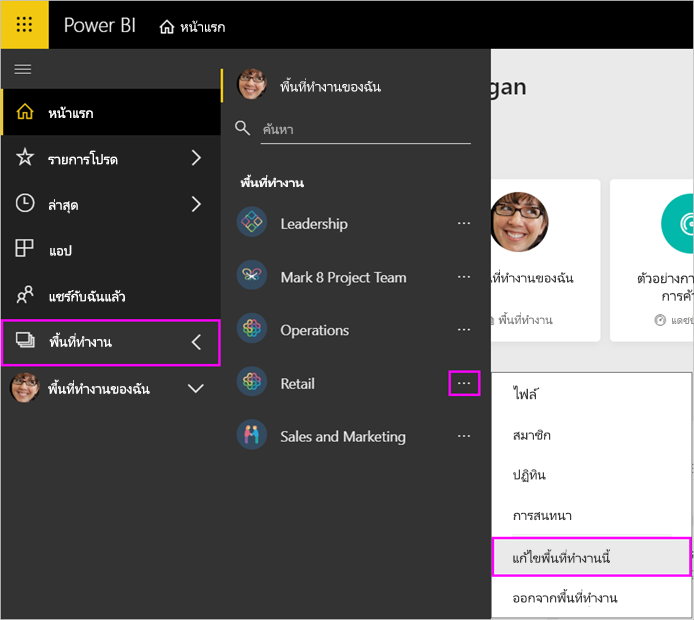
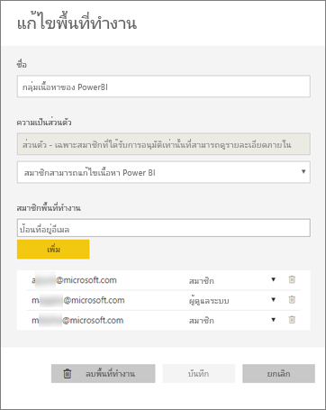
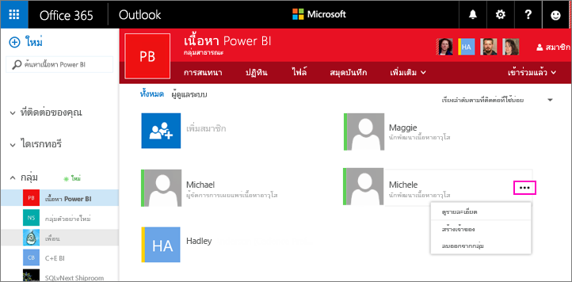
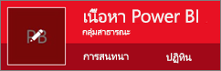
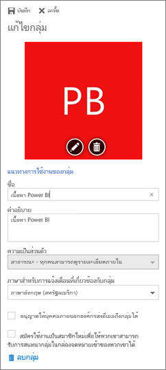

# จัดการพื้นที่ทำงานของแอปใน Power BI และ Office 365
ในฐานะผู้สร้างหรือผู้ดูแลระบบของ[พื้นที่ทำงานของแอปใน Power BI](service-create-distribute-apps.md)หรือใน Office 365 คุณจัดการบางส่วนของพื้นที่ทำงานใน Power BI ลักษณะอื่นๆ คุณจัดการใน Office 365 

> [!NOTE]
> ตัวอย่างการใช้งานพื้นที่ทำงานใหม่จะเปลี่ยนความสัมพันธ์ระหว่างพื้นที่ทำงาน Power BI และกลุ่ม Office 365 คุณจะไม่สามารถสร้างกลุ่ม Office 365 โดยอัตโนมัติทุกครั้งที่คุณสร้างพื้นที่ทำงานใหม่ อ่านเกี่ยวกับ[สร้างพื้นที่ทำงานใหม่ (ตัวอย่าง)](service-create-the-new-workspaces.md)

**ใน Power BI**คุณสามารถ

* เพิ่มหรือลบสมาชิกพื้นที่ทำงานในแอป รวมถึงการทำให้สมาชิกพื้นที่ทำงานผู้ดูแลระบบ
* แก้ไขชื่อพื้นที่ทำงานของแอป
* ลบพื้นที่ทำงานของแอป

**ใน Office 365**คุณสามารถ

* เพิ่มหรือลบสมาชิกพื้นที่ทำงานในแอป รวมถึงการทำให้สมาชิกเป็นผู้ดูแลระบบ
* แก้ไขชื่อกลุ่ม รูปภาพ คำอธิบาย และการตั้งค่าอื่นๆ
* ดูที่อยู่อีเมลของกลุ่ม
* ลบกลุ่ม

คุณจำเป็นต้องมี[สิทธิ์การใช้งาน Power BI Pro](service-features-license-type.md) ที่เป็นผู้ดูแลระบบหรือสมาชิกของพื้นที่ทำงานของแอป ผู้ใช้แอปของคุณต้องมสิทธิ์ใช้งาน Power BI Pro เช่นกัน ยกเว้นว่าพื้นที่ทำงานของแอปอยเป็นแบบ Power BI Premium อ่าน[Power BI Premium คืออะไร](service-premium.md)สำหรับรายละเอียด

## แก้ไขพื้นที่ทำงานของแอปใน Power BI
1. ใน Power BI service เลือกลูกศรถัดจาก**พื้นที่ทำงาน** > เลือกจุดไข่ปลา (**...** ) ถัดจากชื่อพื้นที่ทำงานของคุณ > **แก้ไขพื้นที่ทำงาน** 
   
   
   
   > [!NOTE]
   > คุณเห็นเฉพาะ**แก้ไขพื้นที่ทำงาน**ถ้าคุณเป็นผู้ดูแลระบบพื้นที่ทำงานของแอป
   > 
   > 
2. ที่นี่คุณสามารถเปลี่ยนชื่อ เพิ่ม หรือลบสมาชิกออก หรือลบพื้นที่ทำงานแอปได้ 
   
   
3. เลือก**บันทึก**หรือ**ยกเลิก**

## แก้ไขคุณสมบัติในพื้นที่ทำงานของแอป Power BI ใน Office 365
1. ใน Power BI service เลือกลูกศรลงถัดจาก**พื้นที่ทำงาน** > เลือกจุดไข่ปลา (**...** ) ถัดจากชื่อพื้นที่ทำงานของคุณ > **สมาชิก** 
   
   
   
   สิ่งนี้เปิด Outlook สำหรับกลุ่มมุมมอง Office 365 ของพื้นที่ทำงานของแอป
   
   คุณอาจจำเป็นต้องลงชื่อเข้าใช้บัญชีขององค์กรของคุณ
2. แตะที่จุดไข่ปลา (**...** ) ถัดจากชื่อของสมาชิกเพื่อทำให้สมาชิกเป็นผู้ดูแลระบบ หรือลบสมาชิกจากพื้นที่ทำงานของแอป 
   
   

## เพิ่มรูปภาพ และตั้งค่าคุณสมบัติพื้นที่ทำงานอื่นๆ ในกลุ่ม Office 365
เมื่อคุณเผยแพร่แอปของคุณจากพื้นที่ทำงานของแอป รูปภาพที่คุณเพิ่มที่นี่จะเป็นรูปภาพสำหรับแอปของคุณ ดูหัวข้อ[เพิ่มรูปภาพไปยังแอปของคุณ](service-create-workspaces.md#add-an-image-to-your-office-365-app-workspace-optional)ของบทความ[สร้างพื้นที่ทำงานใหม่](service-create-workspaces.md)

1. ใน Outlook สำหรับ Office 365 มุมมองพื้นที่ทำงานของแอป เลือกกลุ่มรูปภาพเมื่อต้องแก้ไขคุณสมบัติพื้นที่ทำงานของกลุ่ม
   
   
2. คุณสามารถแก้ไขชื่อ คำอธิบาย และภาษา เพิ่มรูปภาพ และตั้งค่าคุณสมบัติอื่นๆได้ที่นี่
   
   
3. เลือก**บันทึก**หรือ**ละทิ้ง**

## ขั้นตอนถัดไป
* [เผยแพร่แอปที่มีแดชบอร์ดและรายงานใน Power BI](service-create-distribute-apps.md)
* มีคำถามเพิ่มเติมหรือไม่? [ลองไปที่ชุมชน Power BI](http://community.powerbi.com/)

