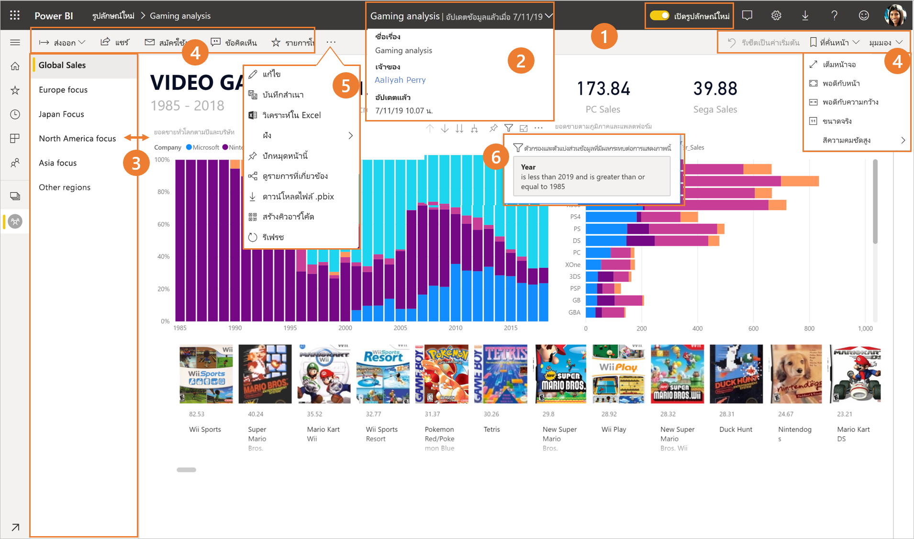
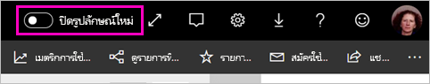
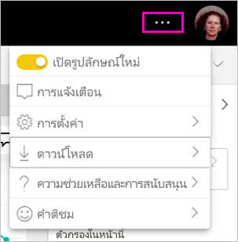
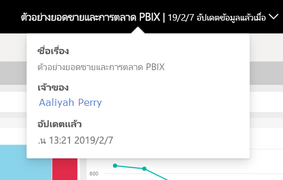
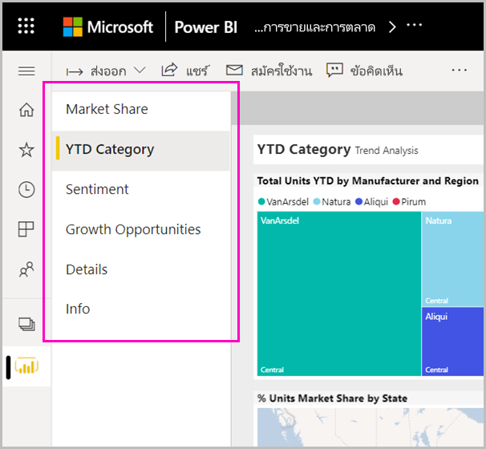
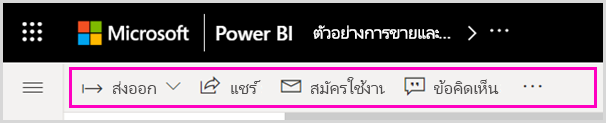
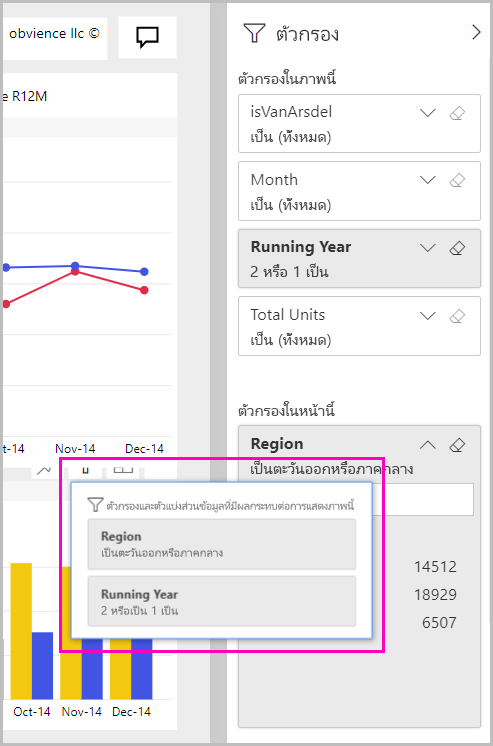

# 'รูปลักษณ์ใหม่' ของบริการของ Power BI

บริการของ Power BI (app.powerbi.com) มีรูปลักษณ์ใหม่ซึ่งช่วยให้การดูและการโต้ตอบกับรายงานของคุณนั้นง่ายขึ้น รูปลักษณ์ใหม่นั้นใช้งานได้ง่ายขึ้นและช่วยสร้างความคุ้นเคยกับผลิตภัณฑ์ Microsoft อื่น ๆ ในบริการ Power BI เราได้จัดทำเนื้อหารายงานเป็นจุดสนใจหลักโดยเปลี่ยนเป็นธีมสีอ่อนลงและอัปเดตไอคอน ต่อไปนี้คือภาพรวมของสิ่งที่เปลี่ยนไปในรูปลักษณ์ใหม่ ดูส่วนที่มีหมายเลขสำหรับรายละเอียดต่าง ๆ:

กำลังมองหาการดำเนินการที่เฉพาะเจาะจงหรือไม่ ดู ["รูปลักษณ์ใหม่": การดำเนินการไปที่ไหน](service-new-look-where-actions.md)

## การนำเสนอการเปลี่ยนแปลงแบบเร็ว

ภาพเคลื่อนไหวนี้แสดงการเปลี่ยนแปลงลักษณะของรายงานในการใช้งานจริง

## 1. เลือกรับสำหรับรูปลักษณ์ใหม่

ผู้ใช้บริการของ Power BI สามารถเลือกรับสำหรับรูปลักษณ์ใหม่ได้ เพียงแค่เลื่อนจาก **ปิดรูปลักษณ์ใหม่** เป็น **เปิดรูปลักษณ์ใหม่**

ถ้าคุณต้องการย้อนกลับไปยังรูปลักษณ์เก่า เพียงแค่เลื่อนกลับเพื่อ**ปิด** หากคุณไม่เห็นรายการดังกล่าว ให้เลือกเมนูจุดไข่ปลาที่มุมขวาบน

## 2. ดูรายละเอียดรายงาน 

ดูรายละเอียดต่าง ๆ เช่น วันที่รีเฟรชล่าสุดและข้อมูลติดต่อ ได้อย่างรวดเร็วและถูกต้องในแบนเนอร์ด้านบน  เปิดเมนูเพื่อดูรายละเอียดเพิ่มเติมเกี่ยวกับรายงาน คุณยังสามารถส่งอีเมลไปยังเจ้าของรายงานได้

## 3. รายการในแนวตั้งของหน้า 
ชื่อหน้ารายงานในขณะนี้อยู่ในรายการในบานหน้าต่างแนวตั้ง ซึ่งจะสะดุดตา มองเห็นได้ง่าย และคล้ายกับการนำทางใน Word และ PowerPoint คุณสามารถเพิ่มหรือลดส่วนที่เหลือของพื้นที่รายงานโดยการปรับขนาดบานหน้าต่างแนวตั้ง

## 4. แถบการดำเนินการแบบง่าย 

แถบการดำเนินการที่อัปเดตแล้วในคุณสมบัติที่เป็นที่นิยม คำสั่งที่เกี่ยวข้องมากที่สุด ด้านหน้าและศูนย์กลางสำหรับผู้ใช้รายงาน ซึ่งทำให้การส่งออก การสมัครใช้งาน การทำงานร่วมกับผู้อื่น และการค้นหาข้อมูลอย่างละเอียดผ่านตัวกรองและบุ๊กมาร์กง่ายขึ้น

## 5. คำสั่งรายงานอยู่ที่ไหน

เราไม่ได้ลบฟังก์ชันใด ๆ ออกจากรูปลักษณ์เก่า คุณสามารถค้นหาคำสั่งเพิ่มเติมเช่น แก้ไข บันทึกเป็นสำเนา และอื่นๆโดยการขยายจุดไข่ปลา (เมนู... ) ในแถบการดำเนินการ นอกจากนี้ คุณยังสามารถเข้าถึงเมตริกการใช้งานจากรายการเนื้อหาได้

### การดำเนินการของเมนูไฟล์อยู่ที่ใด

กำลังค้นหาการดำเนินการของเมนู**ไฟล์**อยู่ใช่หรือไม่ การดำเนินการที่ใช้อยู่ในเมนู**ไฟล์**ยังอยู่ในเมนู**ตัวเลือกเพิ่มเติม** (...) 

## 6. ประสบการณ์ใช้งานตัวกรองใหม่

การอัปเดตล่าสุดเช่น การดูตัวกรองที่นำไปใช้ และบานหน้าต่างตัวกรองใหม่จะพร้อมใช้งานตามค่าเริ่มต้นด้วยรูปลักษณ์ใหม่ แม้ว่านักออกแบบรายงานของคุณยังไม่ได้อัปเกรดเป็นประสบการณ์การใช้งานตัวกรองใหม่ แต่คุณก็จะเห็นบานหน้าต่างตัวกรองใหม่

## ประสบการณ์การใช้งาน ‘รูปลักษณ์ใหม่’ ของแดชบอร์ด 

นอกจากนี้ แดชบอร์ดยังมีแถบการดำเนินการแบบง่าย เช่นเดียวกับรายงานและแอป เพื่อประสบการณ์การใช้งานที่สอดคล้องกันในขณะที่ยังคงความแตกต่างในการใช้งาน ต่อไปนี้เป็นภาพรวมของการดำเนินการในแดชบอร์ด
 

## ไม่มีการเปลี่ยนแปลงในโหมดแก้ไข 

เรายังรักษาประสบการณ์ในการเขียนให้เหมือนกับประสบการณ์ใช้งานในเครื่องเดสก์ท็อป การเปลี่ยนแปลงรูปลักษณ์ใหม่จะนำไปใช้กับมุมมองการอ่านเท่านั้น

## ขั้นตอนถัดไป

[Power BI สำหรับผู้ใช้งาน](consumer/end-user-consumer.md)
