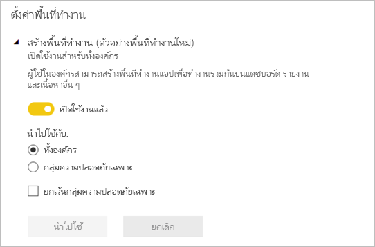

# จัดการงานในพื้นที่ทำงานใหม่ใน Power BI

 *พื้นที่ทำงาน*เป็นสถานที่ทำงานร่วมกับเพื่อนร่วมงานเพื่อสร้างคอลเลกชันของแดชบอร์ด รายงานและรายงานแบบแบ่งหน้า ประสบการณ์การใช้งานพื้นที่ทำงานใหม่ช่วยให้คุณจัดการการเข้าถึงเนื้อหาได้ดียิ่งขึ้น บทความนี้อธิบายถึงพื้นที่ทำงานใหม่และความแตกต่างจากพื้นที่ทำงานคลาสสิก  ด้วยพื้นที่ทำงานแบบคลาสสิก คุณยังคงใช้พื้นที่ทำงานเดิมเพื่อสร้างและเผยแพร่แอป อ่านเกี่ยวกับวิธีการ [สร้างประสบการณ์พื้นที่ทำงานใหม่](service-create-the-new-workspaces.md)

ประสบการณ์การใช้งานพื้นที่ทำงานใหม่สามารถใช้ความพร้อมใช้งานทั่วไป (GA), และกลายเป็นค่าเริ่มต้นของพื้นที่ทำงาน คุณยังสามารถสร้างและใช้[พื้นที่ทำงานแบบคลาสสิก](service-create-workspaces.md)ตามกลุ่ม Office 365 ได้ 

> [!NOTE]
> เมื่อต้องเสริมความปลอดภัยระดับแถว (RLS) สำหรับผู้ใช้ที่เรียกดูเนื้อหาในพื้นที่ทำงาน ให้เข้าใช้ในฐานะผู้ชม หากต้องการบังคับใช้ RLS โดยไม่ให้สิทธิ์การเข้าถึงพื้นที่ทำงาน ให้เผยแพร่แอป Power BI ไปยังผู้ใช้เหล่านั้น หรือใช้การแบ่งปันเพื่อกระจายเนื้อหา

ด้วยตัวอย่างพื้นที่ทำงานใหม่ ตอนนี้คุณสามารถ:

- กำหนดบทบาทพื้นที่ทำงานให้กับกลุ่มผู้ใช้: กลุ่มความปลอดภัย รายการการแจกจ่าย กลุ่ม Office 365 และบุคคลต่างๆ
- สร้างพื้นที่ทำงานใน Power BI โดยไม่ต้องสร้างกลุ่ม Office 365
- ใช้บทบาทพื้นที่ทำงานที่ละเอียดมากขึ้นในการจัดการสิทธิ์ที่ยืดหยุ่นขึ้นในพื้นที่ทำงาน
- ผู้ดูแลระบบ Power BI สามารถควบคุมว่าใครสามารถสร้างพื้นที่ทำงานใน Power BI

เมื่อคุณสร้างพื้นที่ทำงานใหม่ คุณไม่ได้กำลังสร้างกลุ่ม Office 365 พื้นฐานที่เกี่ยวข้อง การดูแลระบบพื้นที่ทำงานทั้งหมดอยู่ใน Power BI ไม่ได้อยู่ใน Office 365 ในพื้นที่ทำงานใหม่ ตอนนี้คุณสามารถเพิ่มกลุ่ม Office 365 ให้กับรายการที่สามารถเข้าถึงพื้นที่ทำงาน เพื่อจัดการผู้ใช้ที่จะเข้าถึงเนื้อหาผ่านทางกลุ่ม Office 365

## การควบคุมดูแลระบบพื้นที่ทำงานใหม่และการใช้งานพื้นที่ทำงานใหม่
การควบคุมดูแลระบบพื้นที่ทำงานใหม่และการใช้งานพื้นที่ทำงานใหม่อยู่ใน Power BI แล้ว ผู้ดูแลระบบ BI ที่มีอำนาจจะตัดสินใจว่าใครในองค์กรสามารถสร้างพื้นที่ทำงานได้ นอกจากนี้พวกเขายังสามารถจัดการและกู้คืนพื้นที่ทำงานโดยใช้พอร์ทัลผู้ดูแลระบบ Power BI หรือ PowerShell CmdLets สำหรับพื้นที่ทำงานแบบคลาสสิกตามกลุ่ม Office 365 การดูแลยังคงเกิดขึ้นในพอร์ทัลผู้ดูแลระบบ Office 365 และ Azure Active Directory

ใน **การตั้งค่าพื้นที่ทำงาน** ซึ่งอยู่ในพอร์ทัลผู้ดูแลระบบ ผู้ดูแลระบบสามารถตั้งค่าสร้างพื้นที่ทำงาน (ประสบการณ์พื้นที่ทำงานใหม่) เพื่ออนุญาตให้ทุกคนหรือคนนอกในองค์กรสามารถสร้างพื้นที่ทำงานใหม่ได้ พวกเขายังสามารถจำกัดการสร้างให้กับสมาชิกของกลุ่มความปลอดภัยที่เฉพาะเจาะจง

> [!NOTE]
> การตั้งค่าเริ่มต้นของการสร้างพื้นที่ทำงาน (ประสบการณ์พื้นที่ทำงานใหม่เป็นเพียงการอนุญาตให้ผู้ใช้สามารถสร้างกลุ่มของ Office 365 ในการสร้างพื้นที่ทำงานใหม่ใน Powe BI ตรวจสอบให้แน่ใจว่าได้ตั้งค่าในพอร์ทัลผู้ดูแลระบบ Power BI เพื่อให้แน่ใจว่า เป็นผู้ใช้ที่เหมาะสมที่สามารถสร้างพื้นที่ทำงานใหม่ประสบการณ์การใช้งานในพื้นที่ทำงานใหม่

[รายการพื้นที่ทำงานจะพร้อมใช้งาน](service-admin-portal.md#workspaces)ในพอร์ทัลผู้ดูแลระบบ Power BI 

## ใช้พื้นที่ทำงานใหม่ไปพร้อมๆ กันกับพื้นที่ทำงานแบบคลาสสิก

คุณสามารถสร้าง อัปเกรดพื้นที่ทำงานใหม่ไปพร้อมๆ กับใช้งานอยู่บนพื้นที่ทำงานแบบคลาสสิก ประสบการณ์การใช้งานพื้นที่ทำงานใหม่เป็นค่าเริ่มต้นของประเภทพื้นที่ทำงาน Power BI ยังคงจัดลำดับกลุ่มผู้ใช้ Office 365 ทั้งหมดที่เป็นสมาชิกของใน Power BI เพื่อหลีกเลี่ยงการเปลี่ยนเวิร์กโฟลว์ที่มีอยู่ เมื่อต้องการเรียนรู้วิธีการสร้างพื้นที่ทำงานใหม่ ให้อ่าน[สร้างพื้นที่ทำงานใหม่](service-create-the-new-workspaces.md) เมื่อต้องการเรียนรู้วิธีการสร้างพื้นที่ทำงานคลาสสิก ให้อ่าน[สร้างพื้นที่ทำงานคลาสสิก](service-create-workspaces.md)

## บทบาทในพื้นที่ทำงานใหม่

เมื่อต้องการให้สิทธิ์เข้าถึงพื้นที่ทำงานใหม่ เพิ่มบทบาทต่อไปนี้ให้บุคคลหรือกลุ่มผู้ใช้พื้นที่ทำงาน: ดูแลระบบ สมาชิก ผู้สนับสนุน หรือผู้ชม ทุกคนในกลุ่มผู้ใช้มีบทบาทตามที่คุณกำหนด ถ้าบุคคลอยู่ในกลุ่มผู้ใช้หลายกลุ่ม กลุ่มเหล่านั้นมีสิทธิ์ระดับสูงสุดที่กำหนดโดยบทบาทที่พวกเขาได้รับมอบหมาย

บทบาทช่วยให้คุณจัดการว่าใครสามารถทำอะไรในพื้นที่ทำงาน เพื่อให้ทีมสามารถทำงานร่วมกัน พื้นที่ทำงานใหม่ช่วยให้คุณสามารถกำหนดบทบาทให้ กับบุคคล และกลุ่มผู้ใช้: กลุ่มความปลอดภัย กลุ่ม Office 365 และรายการการแจกจ่าย 

เมื่อคุณกำหนดบทบาทให้กับกลุ่มผู้ใช้ บุคคลในกลุ่มจะสามารถเข้าถึงเนื้อหา ถ้าคุณให้สิทธิ์กลุ่มผู้ใช้ ผู้ใช้ทั้งหมดที่อยู่ในกลุ่มจะมีสิทธิ์

[!INCLUDE [power-bi-workspace-roles-table](includes/power-bi-workspace-roles-table.md)]

## สิทธิ์การใช้งาน
ทุกคนที่คุณเพิ่มลงในพื้นที่ทำงานที่แชร์ความจุต้องมีสิทธิ์การใช้งาน Power BI Pro ในพื้นที่ทำงาน ผู้ใช้เหล่านี้สามารถทำงานร่วมกันบนแดชบอร์ดและรายงานที่คุณวางแผนที่จะเผยแพร่ไปยังผู้ชมวงกว้างหรือแม้แต่ทั่วทั้งองค์กรของคุณ 

ถ้าคุณต้องการแจกจ่ายเนื้อหาให้กับบุคคลอื่นภายในองค์กรของคุณ คุณสามารถมอบหมายใบอนุญาต Power BI Pro ให้กับผู้ใช้เหล่านั้นหรือวางพื้นที่ทำงานในความสามารถของ Power BI Premium ได้

เมื่อพื้นที่ทำงานอยู่ในความจุ Power BI Premium ผู้ใช้ที่ มีบทบาทเป็นผู้ชมสามารถเข้าถึงพื้นที่ทำงานได้แม้ว่าพวกเขาไม่มีสิทธิ์การใช้งาน Power BI Pro อย่างไรก็ตาม ถ้าคุณกำหนดให้ผู้ใช้เหล่านี้มีตำแหน่งสูงกว่าบทบาทอย่างเช่น ผู้ดูแลระบบ สมาชิก หรือผู้ช่วยเหลือ พวกเขาจะได้รับแจ้งให้เริ่มต้นใช้งาน Pro รุ่นทดลองใช้ฟรี เมื่อพวกเขาพยายามเข้าถึงพื้นที่ทำงาน หากต้องการช่วยให้ผู้ใช้สามารถรับบทบาทเป็นผู้ชมโดยไม่ต้องมีสิทธิ์การใช้งาน Pro ต้องมั่นใจว่าผู้ชมคนนั้นๆ ไม่ได้อยู่ในบทบาทอื่นในพื้นที่ทำงานอื่น ไม่ว่าจะเป็นกลุ่มหรือเป็นผู้ใช้งานเดี่ยว 

> [!NOTE]
> การเผยแพร่รายงานไปยังประสบการณ์การใช้งานพื้นที่ทำงานใหม่มีบังคับใช้กฎสิทธิ์การใช้งานที่มีอยู่อย่างเข้มงวด ผู้ใช้ที่พยายามเผยแพร่จาก Power BI Desktop หรือเครื่องมือไคลเอ็นต์อื่นๆ โดยไม่มีสิทธิ์การใช้งาน Pro พวกเขาจะเห็นข้อความที่แสดงความผิดพลาดโดยกล่าวว่า "เฉพาะผู้ใช้ที่มีสิทธิ์การใช้งาน Power BI Pro เท่าที่สามารถเผยแพร่ไปยังพื้นที่ทำงานนี้"

## พื้นที่ทำงานใหม่มีความแตกต่างอย่างไร

ด้วยพื้นที่ทำงานใหม่ เราได้ออกแบบฟีเจอร์บางอย่างใหม่ นี่คือการเปลี่ยนแปลงที่คุณคาดว่าจะเป็นแบบถาวร 

* การสร้างพื้นที่ทำงานเหล่านี้จะไม่สร้างกลุ่ม Office 365 เหมือนอย่างที่พื้นที่ทำงานแบบคลาสสิกเคยทำ อย่างไรก็ตาม คุณสามารถใช้กลุ่ม Office 365 เพื่อให้ผู้ใช้สามารถเข้าถึงพื้นที่ทำงานของคุณด้วยการกำหนดบทบาท 
* ในพื้นที่ทำงานคลาสสิก คุณสามารถเพิ่มบุคคลให้กับรายการสมาชิกและรายการผู้ดูแลระบบ ในพื้นที่ทำงานใหม่ คุณสามารถเพิ่มกลุ่มความปลอดภัย AD หลายกลุ่ม รายการการแจกจ่าย หรือกลุ่ม Office 365 ไปยังรายการสมาชิกและรายการผู้ดูแลระบบเพื่อทำให้ง่ายต่อการจัดการผู้ใช้ 
- คุณสามารถสร้างชุดเนื้อหาระดับองค์กรจากพื้นที่ทำงานคลาสสิก แต่คุณไม่สามารถสร้างชุดเนื้อหาระดับองค์กรจากพื้นที่ทำงานใหม่
- คุณสามารถใช้ชุดเนื้อหาระดับองค์กรจากพื้นที่ทำงานคลาสสิก แต่คุณไม่สามารถใช้งานชุดเนื้อหาระดับองค์กรจากพื้นที่ทำงานใหม่

## รายการผู้ติดต่อของพื้นที่ทำงาน
ฟีเจอร์**รายการผู้ติดต่อ**ใหม่ช่วยให้คุณสามารถระบุผู้ใช้ที่ได้รับการแจ้งเตือนเกี่ยวกับปัญหาที่เกิดขึ้นในพื้นที่ทำงาน ตามค่าเริ่มต้น ผู้ใช้หรือกลุ่มใดๆ ที่ระบุเป็นพื้นที่ทำงานผู้ดูแลระบบจะได้รับแจ้ง แต่คุณสามารถปรับแต่งรายการได้ ผู้ใช้หรือกลุ่มที่แสดงอยู่ในรายการผู้ติดต่อจะแสดงในส่วนติดต่อผู้ใช้ (UI) เพื่อช่วยให้ผู้ใช้รับความช่วยเหลือที่เกี่ยวข้องกับพื้นที่ทำงาน 

อ่านเพิ่มเติมเกี่ยวกับการ[การตั้งค่ารายการผู้ติดต่อของพื้นที่ทำงาน](service-create-the-new-workspaces.md#workspace-contact-list)

## พื้นที่ทำงาน OneDrive
ฟีเจอร์ของพื้นที่ทำงาน OneDrive ช่วยให้คุณสามารถกำหนดค่าการเก็บไฟล์ SharePoint Document Library ในกลุ่ม Office 365 และจะพร้อมใช้งานให้ผู้ใช้พื้นที่ทำงาน กลุ่มจำเป็นต้องถูกสร้างขึ้นภายนอก Power BI 

Power BI จะไม่เชื่อมสิทธิ์ของผู้ใช้หรือกลุ่มผู้ใช้ที่มีการกำหนดค่าการเข้าถึงพื้นที่ทำงานเข้ากับสมาชิกกลุ่มผู้เป็นสมาชิกของ Office 365 วิธีที่ดีที่สุดคือการจัดการการเข้าถึงพื้นที่ทำงานผ่านทางเดี่ยวกับกลุ่ม Office 365 ที่คุณกำหนดค่าจัดเก็บไฟล์ในการตั้งค่านี้ 

อ่านเกี่ยวกับวิธีการ[ตั้งค่าและเข้าถึงพื้นที่ทำงานของ OneDrive](service-create-the-new-workspaces.md#workspace-onedrive)  

## การตรวจสอบ

กิจกรรมดังต่อไปนี้จะเป็นการตรวจสอบโดย Power BI สำหรับประสบการณ์การใช้งานพื้นที่ทำงานใหม่

| ชื่อที่เรียกง่าย | ชื่อการดำเนินการ |
|---|---|
| สร้างโฟลเดอร์ Power BI แล้ว | CreateFolder |
| ลบโฟลเดอร์ Power BI แล้ว | DeleteFolder |
| อัปเดตโฟลเดอร์ Power BI แล้ว | UpdateFolder |
| อัปเดตการเข้าถึงโฟลเดอร์ Power BI แล้ว| UpdateFolderAccess |

เรียนรู้เพิ่มเติมเกี่ยวกับ [รายงานการตรวจสอบ Power BI](service-admin-auditing.md)

## ผู้ใช้ที่เป็นแขก

ตามค่าเริ่มต้นแล้ว [ผู้ใช้ที่เป็นผู้เยี่ยมชมของ Azure AD B2B ](service-admin-azure-ad-b2b.md) ไม่สามารถเข้าถึงพื้นที่ทำงานได้ ผู้ดูแลระบบของ Power BI สามารถ [อนุญาตให้ผู้ใช้ที่เป็นผู้เยี่ยมชมสามารถแก้ไขและจัดการเนื้อหาในองค์กรได้](service-admin-azure-ad-b2b.md#guest-users-who-can-edit-and-manage-content) ผู้ใช้ที่เป็นผู้เยี่ยมชมที่ได้รับการเปิดใช้งานจะสามารถเข้าถึงพื้นที่ทำงานที่พวกเขามีสิทธิ์ได้

## ข้อจำกัดและข้อควรพิจารณา

ข้อจำกัดควรระวัง:

- พื้นที่ทำงานสามารถรองรับชุดข้อมูลได้สูงสุด 1000 ชุดหรือรายงาน 1000 ฉบับต่อหนึ่งชุดข้อมูล 
- บุคคลที่ได้รับสิทธิ์ให้ใช้งาน Power BI Pro สามารถเป็นสมาชิกของพื้นที่ทำงานได้มากที่สุด 1000 พื้นที่ทำงาน
- Power BI Publisher สำหรับ Excel ไม่รองรับ

## พื้นที่ทำงานมีการทำงานดังกล่าวแตกต่างกัน

ฟีเจอร์บางอย่างของพื้นที่ทำงานใหม่ทำงานแตกต่างจากพื้นที่ทำงานปัจจุบัน ความแตกต่างเหล่านี้เป็นความตั้งใจ ตามคำติชมที่เราได้รับจากลูกค้า และทำให้เกิดความยืดหยุ่นในการการทำงานร่วมกับพื้นที่ทำงาน

- ผลบังคับใช้สิทธิ์ของการใช้งาน: การเผยแพร่รายงานไปยังการใช้งานพื้นที่ทำงานใหม่เป็นการบังคับใช้กฎสิทธิ์การใช้งานที่มีอยู่ที่จำเป็นต้องมีสิทธิ์การใช้งาน Power BI Pro สำหรับผู้ใช้ที่ทำงานร่วมกันในพื้นที่ทำงาน หรือแชร์เนื้อหากับผู้อื่นในบริการ Power BI ผู้ใช้ที่ไม่มีสิทธิ์การใช้งาน Pro จะเห็นข้อความแสดงความผิดพลาดที่ระบุว่า "เฉพาะผู้ใช้ที่มีสิทธิ์การใช้งาน Power BI Pro เท่านั้นที่สามารถเผยแพร่ไปยังพื้นที่ทำงานนี้"
- สมาชิกสามารถหรือไม่สามารถแชร์ต่อ: ถูกแทนที่ ด้วยบทบาทผู้สนับสนุน
- พื้นที่ทำงานแบบอ่านอย่างเดียว: แทนที่จะอนุญาตให้ผู้ใช้เข้าถึงแบบอ่านอย่างเดียวในพื้นที่ทำงาน กำหนดผู้ใช้ให้มีบทบาทเป็นผู้ชมซึ่งอนุญาตให้เข้าถึงเนื้อหาในพื้นที่ทำงานได้แบบอ่านอย่างเดียวเหมือนกัน
- ผู้ใช้ที่ไม่มีสิทธิ์การใช้งาน Pro สามารถเข้าถึงพื้นที่ทำงานได้ถ้าพื้นที่ทำงานอยู่ในความจุ Power BI Premium แม้ว่าผู้ใช้จะมีบทบาทเป็นเพียงผู้ชมเท่านั้น
- หากต้องการอนุญาตให้ผู้ชมสามารถส่งออกข้อมูลได้ ต้องมั่นใจว่าผู้ชมคนนั้นๆ ได้รับอนุญาตอย่างถูกต้องในฐานข้อมูลซึ่งอยู่ในพื้นที่ทำงาน อ่านเพิ่มเติมเกี่ยวกับ[สิทธิในการสร้างสำหรับชุดข้อมูล](service-datasets-build-permissions.md)
- ไม่มีปุ่ม**ออกจากพื้นที่ทำงาน**

## คำถามที่ถามบ่อย

**ลิงก์ที่เชื่อมไปยังเนื้อหาจะได้รับผลกระทบจากพื้นที่ทำงานใหม่ GA หรือไม่**

หมายเลข ลิงก์ที่เชื่อมไปยังเนื้อหาในพื้นที่ทำงานคลาสสิกจะไม่ได้รับผลกระทบจากพื้นที่ทำงานใหม่  General Availability (GA) ของพื้นที่ทำงานใหม่จะเปลี่ยนเป็นค่าเริ่มต้นของพื้นที่ทำงานที่คุณสร้างแต่จะไม่เปลี่ยนพื้นที่ทำงานที่มีอยู่ 

**พื้นที่ทำงานที่มีอยู่อัปเกรดเป็นประสบการณ์พื้นที่ทำงานใหม่ด้วย GA พื้นที่ทำงานหรือไม่**

หมายเลข GA ของประสบการณ์การใช้งานพื้นที่ทำงานใหม่จะเปลี่ยนชนิดของพื้นที่ทำงานเริ่มต้นเป็นประสบการณ์การใช้งานพื้นที่ทำงานใหม่เท่านั้น พื้นที่ทำงานแบบคลาสสิกที่มีอยู่ยังจะยึดตามกลุ่ม Office 365 เหมือนเดิม

**พื้นที่ทำงานยังคงสร้างขึ้นสำหรับกลุ่ม Office 365 โดยอัตโนมัติหรือไม่**

ใช่ เนื่องจากเราสนับสนุนพื้นที่ทำงานทั้งสองแบบ เราจึงยังให้ผู้ใช้มีสิทธิ์เข้าถึงในรายการพื้นที่ทำงานสามารถเข้าถึง Office 365 ได้ 

## ขั้นตอนถัดไป
* [สร้างพื้นที่ทำงานใหม่ใน Power BI](service-create-the-new-workspaces.md)
* [สร้างพื้นที่ทำงานแบบคลาสสิก](service-create-workspaces.md)
* [ติดตั้งและใช้แอปฯใน Power BI](service-create-distribute-apps.md)
* มีคำถามหรือไม่ [ลองถามชุมชน Power BI](https://community.powerbi.com/)
