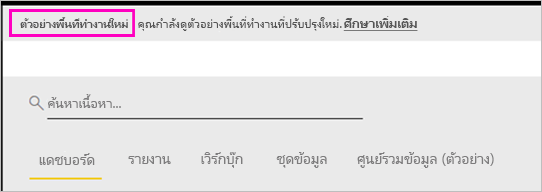

# จัดการงานในพื้นที่ทำงานใหม่ (ตัวอย่าง) ใน Power BI

พื้นที่ทำงานเป็นสถานที่ทำงานร่วมกับเพื่อนร่วมงานเพื่อสร้างคอลเลกชันของแดชบอร์ดและรายงานได้ จากนั้น คุณสามารถรวมคอลเลกชันเหล่านั้นเข้าด้วยกันเป็น*แอป* และแจกจ่ายให้กับทั้งองค์กรคุณหรือเฉพาะบุคคลหรือกลุ่ม Power BI แนะนำตัวอย่างการใช้งานพื้นที่ทำงานใหม่ 

ด้วยตัวอย่างพื้นที่ทำงานใหม่ ตอนนี้คุณสามารถ:

- กำหนดบทบาทพื้นที่ทำงานให้กับกลุ่มผู้ใช้: กลุ่มความปลอดภัย รายการการแจกจ่าย กลุ่ม Office 365 และบุคคลต่างๆ
- สร้างพื้นที่ทำงานใน Power BI โดยไม่ต้องสร้างกลุ่ม Office 365
- ใช้บทบาทพื้นที่ทำงานที่ละเอียดมากขึ้นในการจัดการสิทธิ์ที่ยืดหยุ่นขึ้นในพื้นที่ทำงาน

อ่านเกี่ยวกับวิธีการ [สร้างพื้นที่ทำงานใหม่หนึ่งพื้นที่](service-create-the-new-workspaces.md)
 
เมื่อคุณสร้างพื้นที่ทำงานใหม่ คุณไม่ได้กำลังสร้างกลุ่ม Office 365 พื้นฐานที่เกี่ยวข้อง การดูแลระบบพื้นที่ทำงานทั้งหมดอยู่ใน Power BI ไม่ได้อยู่ใน Office 365 คุณยังคงสามารถเพิ่มกลุ่ม Office 365 ให้กับพื้นที่ทำงาน เพื่อจัดการผู้ใช้ที่จะเข้าถึงเนื้อหาผ่านทางกลุ่ม Office 365 อย่างไรก็ตาม คุณยังสามารถใช้กลุ่มรักษาความปลอดภัย รายชื่อการแจกจ่ายและเพิ่มบุคคลได้โดยตรงภายใน Power BI เพื่อให้คุณสามารถเข้าถึงพื้นที่ทำงานได้อย่างมีความยืดหยุ่น เนื่องจากการจัดการพื้นที่ทำงานอยู่ใน Power BI แล้ว ผู้ดูแลระบบ BI ที่มีอำนาจจะตัดสินใจว่าใครในองค์กรสามารถสร้างพื้นที่ทำงานได้ ใน **การตั้งค่าพื้นที่ทำงาน** ในพอร์ทัลผู้ดูแลระบบ ผู้ดูแลระบบสามารถอนุญาตให้ทุกคนหรือไม่อนุญาตใครสักคนในองค์กรสร้างพื้นที่ทำงานได้ พวกเขายังสามารถจำกัดการสร้างให้กับสมาชิกของกลุ่มความปลอดภัยที่เฉพาะเจาะจง

อ่านเพิ่มเติมเกี่ยวกับ [พอร์ทัลผู้ดูแลระบบ Power BI](service-admin-portal.md)

## เผยแพร่พื้นที่ทำงานใหม่

ในระหว่างช่วงแสดงตัวอย่าง พื้นที่ทำงานใหม่ และเก่าสามารถอยู่ร่วมเคียงข้างกัน และคุณสามารถสร้างอันใดก็ได้ เมื่อตัวอย่างพื้นที่ทำงานใหม่สิ้นสุดและมีให้พร้อมใช้งาน พื้นที่ทำงานเก่าสามารถยังคงอยู่ในระยะหนึ่ง คุณจะไม่สามารถสร้างพื้นที่ทำงานเก่า และคุณต้องเตรียมโยกย้ายพื้นที่ทำงานของคุณไปยังโครงสร้างพื้นฐานของพื้นที่ทำงานใหม่ ไม่ต้องกังวล คุณจะมีเวลาหลายเดือนในการโยกย้ายให้เสร็จสมบูรณ์

## บทบาทในพื้นที่ทำงานใหม่

คุณสามารถเพิ่มบุคคลหรือกลุ่มผู้ใช้ให้กับพื้นที่ทำงานใหม่ในฐานะเป็นสมาชิก ผู้สนับสนุน หรือผู้ดูแลระบบ ทุกคนในกลุ่มผู้ใช้มีบทบาทตามที่คุณกำหนด ถ้าบุคคลอยู่ในกลุ่มผู้ใช้หลายกลุ่ม กลุ่มเหล่านั้นมีสิทธิ์ระดับสูงสุดที่กำหนดโดยบทบาท  ดู[บทบาทในพื้นที่ทำงานใหม่](#roles-in-the-new-workspaces)ในภายหลังในบทความนี้สำหรับคำอธิบายเรื่องบทบาทที่แตกต่างกัน

ทุกคนที่คุณเพิ่มลงในพื้นที่ทำงานต้องมีสิทธิ์การใช้งาน Power BI Pro ในพื้นที่ทำงาน ผู้ใช้เหล่านี้สามารถทำงานร่วมกันบนแดชบอร์ดและรายงานที่คุณวางแผนที่จะเผยแพร่ไปยังผู้ชมวงกว้างหรือแม้แต่ทั่วทั้งองค์กรของคุณ ถ้าคุณต้องการแจกจ่ายเนื้อหาให้กับบุคคลอื่นภายในองค์กรของคุณ คุณสามารถมอบหมายใบอนุญาต Power BI Pro ให้กับผู้ใช้เหล่านั้นหรือวางพื้นที่ทำงานในความสามารถของ Power BI Premium ได้

บทบาทช่วยให้คุณจัดการว่าใครสามารถทำอะไรในพื้นที่ทำงาน เพื่อให้ทีมสามารถทำงานร่วมกัน พื้นที่ทำงานใหม่ช่วยให้คุณสามารถกำหนดบทบาทให้ กับบุคคล และกลุ่มผู้ใช้: กลุ่มความปลอดภัย กลุ่ม Office 365 และรายการการแจกจ่าย 

เมื่อคุณกำหนดบทบาทให้กับกลุ่มผู้ใช้ บุคคลในกลุ่มจะสามารถเข้าถึงเนื้อหา ถ้าคุณให้สิทธิ์กลุ่มผู้ใช้ ผู้ใช้ทั้งหมดที่อยู่ในกลุ่มจะมีสิทธิ์ ผู้ใช้ที่อยู่ในกลุ่มผู้ใช้หลายกลุ่มในบทบาทต่างๆ จะได้รับสิทธิ์ระดับสูงสุดที่มอบให้พวกเขา 

พื้นที่ทำงานใหม่ให้สามบทบาท: ผู้ดูแลระบบ สมาชิก และผู้สนับสนุน

**ผู้ดูแลระบบสามารถ:**

- ปรับปรุง และลบพื้นที่ทำงาน 
- เพิ่ม/ลบบุคคล รวมถึงผู้ดูแลระบบอื่นๆ
- ทำสิ่งที่สมาชิกสามารถทำ

**สมาชิกสามารถ:** 

- เพิ่มสมาชิกหรือผู้อื่นให้มีสิทธิ์ที่ต่ำกว่า
- เผยแพร่ และอัปเดตแอป
- แชร์รายการหรือแชร์แอป
- อนุญาตให้ผู้อื่นแชร์รายการซ้ำ
- ทำทุกสิ่งที่ผู้สนับสนุนสามารถทำได้

**ผู้สนับสนุนสามารถ:** 

- สร้าง แก้ไข และลบเนื้อหาในพื้นที่ทำงาน 
- เผยแพร่รายงานไปยังพื้นที่ทำงาน ลบเนื้อหา
- ไม่สามารถให้บุคคลใหม่สามารถเข้าถึงเนื้อหาได้ พวกเขาไม่สามารถแชร์เนื้อหาใหม่ แต่สามารถแชร์เนื้อหากับบุคคลที่เคยได้รับการแชร์พื้นที่ทำงาน รายการ หรือแอปแล้ว 
- ไม่สามารถปรับเปลี่ยนสมาชิกของกลุ่ม
 
เรากำลังสร้างเวิร์กโฟลว์การขอการเข้าถึงทั่วทั้งบริการเพื่อให้ผู้ใช้ที่ไม่สามารถเข้าถึงสามารถร้องขอได้ เวิร์กโฟลว์การเข้าถึงคำขอมีอยู่สำหรับแดชบอร์ด รายงาน และแอป

## แปลงพื้นที่ทำงานเก่าเป็นพื้นที่ทำงานใหม่

ในระหว่างช่วงแสดงตัวอย่าง คุณไม่สามารถแปลงพื้นที่ทำงานเก่าของคุณเป็นพื้นที่ทำงานแอปใหม่ได้โดยอัตโนมัติิ อย่างไรก็ตาม คุณสามารถสร้างพื้นที่ทำงานใหม่ และเผยแพร่เนื้อหาไปยังที่ตั้งใหม่นั้น 

เมื่อพื้นที่ทำงานใหม่พร้อมใช้งานโดยทั่วไป (GA), คุณสามารถเลือกเข้าร่วมในการโยกย้ายพื้นที่ทำงานเก่าโดยอัตโนมัติ สักพักหลัง GA คุณจะต้องโยกย้ายพื้นที่ทำงานเก่า

## แอปฯ Power BI ถามที่ถามบ่อย

### พื้นที่ทำงานใหม่แตกต่างจากพื้นที่ทำงานปัจจุบันอย่างไร?

ด้วยพื้นที่ทำงานใหม่ เรากำลังออกแบบฟีเจอร์บางอย่างใหม่ นี่คือการเปลี่ยนแปลงที่คุณคาดว่าจะเป็นแบบถาวรพร้อมกับตัวอย่าง 

* การสร้างพื้นที่ทำงานจะไม่สร้างเอนทิตีอย่างเดียวกันใน Office 365 อย่างเช่นพื้นที่ทำงานปัจจุบันทำ (คุณยังสามารถเพิ่มกลุ่ม Office 365 ให้กับพื้นที่ทำงานของคุณ โดยการกำหนดบทบาทให้กับกลุ่มดังกล่าว) 
* ในพื้นที่ทำงานปัจจุบัน คุณสามารถเพิ่มบุคคลให้กับรายการสมาชิกและรายการผู้ดูแลระบบ ในพื้นที่ทำงานใหม่ คุณสามารถเพิ่มกลุ่มความปลอดภัย AD หลายกลุ่ม รายการการแจกจ่าย หรือกลุ่ม Office 365 ไปยังรายการสมาชิกและรายการผู้ดูแลระบบเพื่อทำให้ง่ายต่อการจัดการผู้ใช้ 
- คุณสามารถสร้างชุดเนื้อหาระดับองค์กรจากพื้นที่ทำงานปัจจุบัน แต่คุณไม่สามารถสร้างชุดเนื้อหาระดับองค์กรจากพื้นที่ทำงานใหม่
- คุณสามารถใช้ชุดเนื้อหาระดับองค์กรจากพื้นที่ทำงานปัจจุบัน แต่คุณไม่สามารถใช้งานชุดเนื้อหาระดับองค์กรจากพื้นที่ทำงานใหม่
- ในระหว่างการแสดงตัวอย่าง คุณลักษณะบางอย่างยังไม่เปิดใช้งานสำหรับพื้นที่ทำงานใหม่ ดูส่วนถัดไป [คุณลักษณะของพื้นที่ทำงานใหม่ที่วางแผนไว้](service-new-workspaces.md#planned-new-workspace-preview-features) สำหรับรายละเอียด

## ฟีเจอร์ของตัวอย่างพื้นที่ทำงานใหม่ที่วางแผนไว้

ในขณะที่เราเปิดตัวอย่าง เรายังคงพัฒนาคุณลักษณะของตัวอย่างพื้นที่ทำงานอื่นบางส่วนได้ แต่ยังไม่พร้อมใช้งาน:

- ไม่มีปุ่ม**ออกจากพื้นที่ทำงาน**
- เมตริกการใช้งานไม่ได้รับการสนับสนุน
- วิธีการทำงานของ Premium: คุณสามารถกำหนด และสร้างพื้นที่ทำงานในความจุระดับ Premium แต่เมื่อต้องย้ายพื้นที่ทำงานระหว่างความจุที่แตกต่างกัน ไปที่การตั้งค่าของพื้นที่ทำงาน
- การฝัง SharePoint web part ยังไม่ได้รับการสนับสนุน
- ไม่มีปุ่ม **OneDrive** สำหรับกลุ่ม Office 365 ใน รับข้อมูล/ไฟล์

## พื้นที่ทำงานมีการทำงานดังกล่าวแตกต่างกัน

ฟีเจอร์บางอย่างของพื้นที่ทำงานใหม่ทำงานแตกต่างจากพื้นที่ทำงานปัจจุบัน ความแตกต่างเหล่านี้เป็นความตั้งใจ ตามคำติชมที่เราได้รับจากลูกค้า และจะทำให้เกิดความยืดหยุ่นในการการทำงานร่วมกับพื้นที่ทำงาน

- สมาชิกสามารถหรือไม่สามารถแชร์ต่อ: ถูกแทนที่ ด้วยบทบาทผู้สนับสนุน
- พื้นที่ทำงานแบบอ่านอย่างเดียว: แทนที่จะอนุญาตให้ผู้ใช้เข้าถึงแบบอ่านอย่างเดียวในพื้นที่ทำงาน คุณจะกำหนดผู้ใช้ให้มีบทบาทเป็นผู้ดูที่กำลังจะเผยแพร่ ซึ่งอนุญาตให้เข้าถึงเนื้อหาในพื้นที่ทำงานได้แบบอ่านอย่างเดียวเหมือนกัน

## ปัญหาที่ทราบแล้ว

เนื่องจากคุณลักษณะนี้เป็นเพียงคุณลักษณะตัวอย่าง จึงมีบางข้อจำกัดที่คุณควรต้องระวัง ปัญหาต่อไปนี้เป็นเรื่องที่ทราบกันดี และการแก้ไขอยู่ในระหว่างการพัฒนา:

- ผู้ใช้หรือกลุ่มผู้ใช้ที่ถูกเพิ่มเป็นผู้รับอีเมล์จากการสมัครใช้งานอาจไม่ได้รับอีเมล์ แม้ว่าพวกเขาควรจะได้รับ ปัญหาเกิดขึ้นเมื่อหนึ่งในพื้นที่ทำงานใหม่อยู่ในความจุระดับ Premium แต่พื้นที่ทำงานของฉันของผู้ใช้ที่สร้างการสมัครใช้งานไม่ได้อยู่ในความจุระดับ Premium ถ้าพื้นที่ทำงานของฉันอยู่ในความจุระดับ Premium ผู้ใช้และกลุ่มผู้ใช้ฟรีจะได้รับอีเมล
- หลังจากพื้นที่ทำงานถูกย้ายจากความจุระดับ Premium ไปยังความจุที่แชร์ร่วมกัน ในบางกรณี ผู้ใช้และกลุ่มผู้ใช้ฟรีจะยังคงได้รับอีเมล์แม้ว่าไม่ควรได้รับก็ตาม ปัญหาเกิดขึ้นเมื่อพื้นที่ทำงานของฉันของผู้ใช้สร้างการสมัครใช้งานในความจุระดับ Premium

## ขั้นตอนถัดไป
* [สร้างพื้นที่ทำงานใหม่ (ตัวอย่าง) ใน Power BI](service-create-the-new-workspaces.md)
* [สร้างพื้นที่ทำงานปัจจุบัน](service-create-workspaces.md)
* [ติดตั้งและใช้แอปฯใน Power BI](service-create-distribute-apps.md)
* มีคำถามหรือไม่ [ลองถามชุมชน Power BI](http://community.powerbi.com/)
