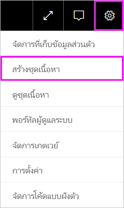
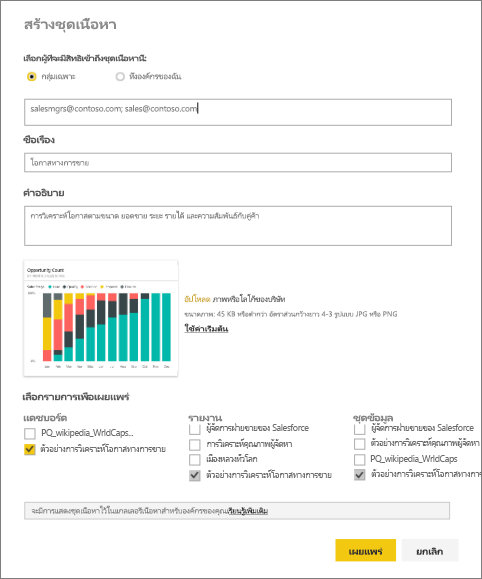
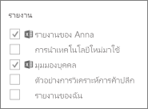
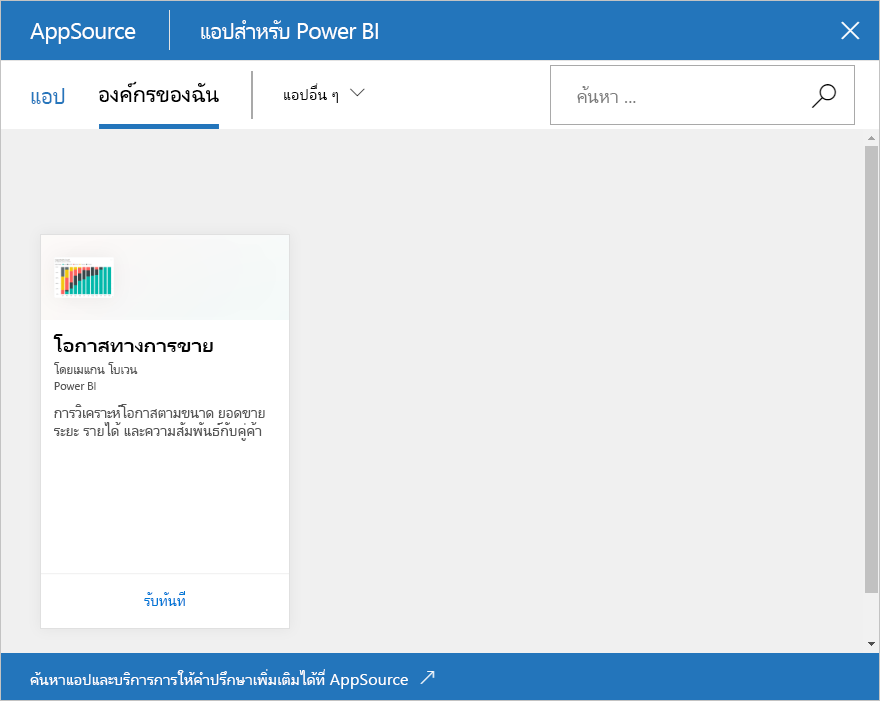

# สร้าง และเผยแพร่ชุดเนื้อหาองค์กร (บทเรียน)

ในบทเรียนนี้ คุณสร้างชุดเนื้อหาองค์กร จำกัดการเข้าถึงกลุ่มเฉพาะและเผยแพร่ลงในไลบรารีของชุดเนื้อหาขององค์กรของคุณใน Power BI

กำลังสร้างชุดเนื้อหาที่จะแตกต่างจากการแชร์แดชบอร์ดหรือการทำงานร่วมกันบนชุดเนื้อหาเหล่านั้นในกลุ่ม อ่าน[ฉันควรทำงานร่วมกันและแชร์แดชบอร์ดและรายงานอย่างไร](service-how-to-collaborate-distribute-dashboards-reports.md) เพื่อตัดสินใจเลือกตัวเลือกที่ดีที่สุดสำหรับสถานการณ์ของคุณ

สร้างแพ็คเนื้อหาขององค์กรต้องมี[บัญชี Power BI Pro](https://powerbi.microsoft.com/pricing)สำหรับคุณและเพื่อนร่วมงานของคุณ 

> [!NOTE]
> คุณไม่สามารถสร้าง หรือติดตั้งชุดเนื้อหาระดับองค์กรในตัวอย่างการใช้งานพื้นที่ทำงานใหม่ ตอนนี้ คือเวลาดีที่จะอัปเกรดชุดเนื้อหาของคุณไปยังแอป ถ้าคุณยังไม่ได้เริ่มต้น เรียนรู้[เพิ่มเติมเกี่ยวกับการใช้งานพื้นที่ทำงานใหม่](service-create-the-new-workspaces.md)
> 

สมมติว่า คุณเป็นผู้จัดการเผยแพร่ของ Contoso และคุณกำลังเตรียมตัววางชายผลิตภัณฑ์ใหม่  คุณได้สร้างแดชบอร์ดพร้อมรายงานซึ่งคุณต้องการแชร์กับพนักงานคนอื่นๆ โดยจัดการการเปิดใช้ คุณต้องการวิธีที่การแพคแดชบอร์ดและรายงานให้เป็นโซลูชันสำหรับเพื่อนร่วมงานของคุณจะได้ใช้ 

คุณต้องการทำตามหรือไม่ ใน[Power BI service](https://powerbi.com)ไปที่**รับข้อมูล > ตัวอย่าง > ตัวอย่างการวิเคราะห์โอกาส** > **เชื่อมต่อ**เพื่อรับสำเนาของคุณเอง 

1. ในบานหน้าต่างนำทางด้านซ้าย เลือกแดชบอร์ด**ตัวอย่างการวิเคราะห์โอกาส**
2. จากแถบนำทางด้านบน เลือกไอคอนเฟือง  >  **สร้างชุดเนื้อหา**    
   
3. ในหน้าต่าง **สร้างชุดเนื้อหา** ให้ใส่ข้อมูลต่อไปนี้  
   
   โปรดทราบว่าไลบรารีชุดเนื้อหาขององค์กรของคุณไม่สามารถสิ้นสุดที่หลายร้อยชุดเนื้อหาที่เผยแพรให้องค์กรหรือกลุ่มได้่ ใช้เวลาในการตั้งชื่อที่สื่อความหมายให้กับเนื้อหาของคุณ เพิ่มคำอธิบายที่ดีและเพื่อเลือกผู้ชมที่ใช่  ใช้คำที่จะทำให้ชุดเนื้อหาของคุณง่ายต่อการค้นหาผ่านเครืื่องมือค้นหา
   
   1. ให้เลือก**กลุ่มที่เฉพาะเจาะจง**และใส่อยู่อีเมลแบบเต็มสำหรับแต่ละบุคคล[กลุ่ม Office 365](https://support.office.com/article/Create-a-group-in-Office-365-7124dc4c-1de9-40d4-b096-e8add19209e9)กลุ่มการแจกจ่าย หรือกลุ่มความปลอดภัย ตัวอย่างเช่น
      
        salesmgrs@contoso.com; sales@contoso.com
      
      สำหรับบทเรียนนี้ ลองใช้อีเมลหรือกลุ่มที่อยู่อีเมลของของคุณ
   
   2. ชื่อชุดเนื้อหา**โอกาสทางการขาย**
   
      > [!TIP]
      > พิจารณารวมถึงชื่อของแดชบอร์ดในชื่อของชุดเนื้อหานี้ ด้วยวิธี เพื่อนร่วมงานของคุณจะค้นหาแดชบอร์ดได้ง่ายยิ่งขึ้นหลังจากที่พวกเขาเชื่อมต่อกับชุดเนื้อหาของคุณ
      > 
      > 
   
   3. เราขอแนะนำ ให้เพิ่มการ**คำอธิบาย** ซึ่งช่วยให้เพื่อนร่วมงานค้นหาชุดเนื้อหาเพิ่มเติมได้อย่างง่ายดายตามที่พวกเขาต้องการ นอกเหนือจากคำอธิบาย ให้เพิ่มคำสำคัญที่เพื่อนร่วมงานของคุณอาจใช้เพื่อค้นหาชุดเนื้อหานี้ รวมถึงข้อมูลที่ติดต่อในกรณีที่เพื่อนร่วมงานของคุณมีคำถาม หรือต้องการความช่วยเหลือ
   
   4. **อัปโหลดรูปภาพหรือโลโก้**เพื่อทำให้ง่ายสำหรับสมาชิกของกลุ่มเพื่อค้นหาชุดเนื้อหา&#151;ค้นหาด้วยรูปภาพจะรวดเร็วการค้นหาด้วยข้อความ เราใช้รูปภาพไทล์ของคอลัมน์ Opportunity Count 100% แผนภูมิในสกรีนช็อตด้านล่าง
   
   5. เลือกแดชบอร์ด**ตัวอย่างการวิเคราะห์โอกาส**เพื่อเพิ่มลงในชุดเนื้อหา  Power BI เพิ่มรายงานที่เกี่ยวข้องกับชุดข้อมูลโดยอัตโนมัติ คุณสามารถเพิ่มบุคคลอื่นได้ ถ้าคุณต้องการ
   
      > [!NOTE]
      >  ่แดชบอร์ด รายงาน ชุดข้อมูล และสมุดงานที่คุณสามารถแก้ไขได้เท่านั้นที่จะอยู่ในรายชื่อ ดังนั้น อะไรท่ีี่แชร์กับคุณจะไม่อยู่ในรายการ
      > 
      > 
   
       
   
   6. ถ้าคุณมีสมุดงาน Excel คุณเห็นค่าเหล่านั้นภายใต้รายงาน ที่มีไอคอน Excel คุณสามารถเพิ่มลงในชุดเนื้อหา เช่นกัน
   
      
   
      > [!NOTE]
      > ถ้าสมาชิกของกลุ่มไม่สามารถดูสมุดงาน Excel ได้ คุณอาจจำเป็นต้อง[แชร์เวิร์กบุ๊กกับบุคคลเหล่านั้นใน OneDrive for Business](https://support.office.com/en-us/article/Share-documents-or-folders-in-Office-365-1fe37332-0f9a-4719-970e-d2578da4941c)
      > 
      > 
4. เลือก**เผยแพร่**เมื่อต้องเพิ่มชุดเนื้อหาลงในไลบรารีแพ็คเนื้อหาขององค์กรของกลุ่ม  
   
   คุณเห็นข้อความสำเร็จเมื่อการเผยแพร่เรียบร้อยแล้ว 
5. เมื่อสมาชิกของกลุ่มของคุณไปยัง**รับข้อมูล > องค์กรของฉัน**พวกเขาแตะที่กล่องค้นหา แล้วพิมพ์ “โอกาสการขาย”
   
    
6. พวกเขาจะเห็นชุดเนื้อหาของคุณ  
    
   
   > [!TIP]
   > URL ที่ปรากฏในเบราว์เซอร์ของคุณคือที่อยู่ที่ไม่ซ้ำกันสำหรับชุดเนื้อหานี้  ต้องการบอกเพื่อนร่วมงานของคุณเกี่ยวกับชุดเนื้อหาใหม่นี้หรือไม่  วาง URL ลงในอีเมล
   > 
   > 
7. พวกเขาเลือก**เชื่อมต่อ**และในตอนนี้ พวกเขาสามารถ[ดูและทำงานกับชุดเนื้อหาของคุณ](service-organizational-content-pack-copy-refresh-access.md) 

### ขั้นตอนถัดไป
* [บทนำชุดเนื้อหาองค์กร](service-organizational-content-pack-introduction.md)  
* [จัดการ อัปเดต และลบชุดเนื้อหาองค์กร](service-organizational-content-pack-manage-update-delete.md)  
* [สร้างกลุ่มใน Power BI](service-create-distribute-apps.md)  
* [อะไรคือ OneDrive สำหรับธุรกิจ](https://support.office.com/en-us/article/What-is-OneDrive-for-Business-187f90af-056f-47c0-9656-cc0ddca7fdc2)
* มีคำถามเพิ่มเติมหรือไม่ [ลองไปที่ชุมชน Power BI](http://community.powerbi.com/)

