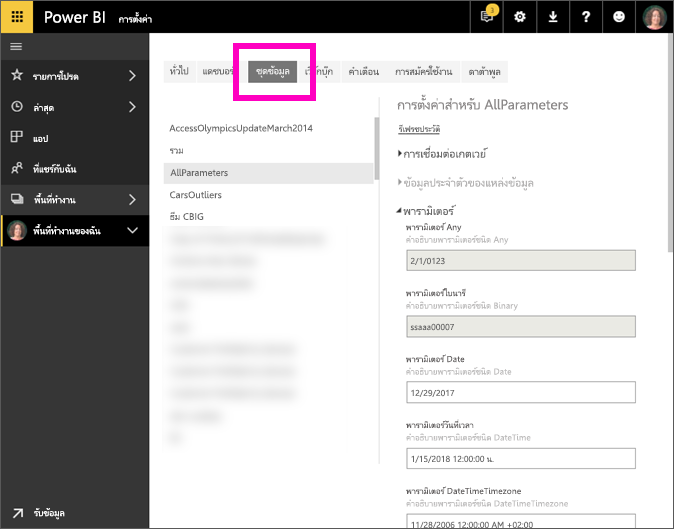

# แก้ไขการตั้งค่าพารามิเตอร์ในบริการ Power BI
ผู้สร้างรายงานเพิ่มพารามิเตอร์คิวรีลงในรายงานใน Power BI Desktop พารามิเตอร์อนุญาตให้ผู้สร้างสามารถรายงานสร้างส่วนต่าง ๆ ของรายงาน ที่ขึ้นอยู่กับพารามิเตอร์อย่างน้อยหนึ่ง*ค่า* ตัวอย่างเช่น ผู้สร้างรายงานอาจสร้างพารามิเตอร์ที่จำกัดข้อมูลไว้ที่ประเทศ/ภูมิภาคหนึ่ง ๆ หรือพารามิเตอร์ที่กำหนดรูปแบบที่ยอมรับได้สำหรับเขตข้อมูลเช่น วัน เวลา และข้อความ

## ตรวจสอบ และแก้ไขพารามิเตอร์ในบริการ Power BI

ในฐานะผู้สร้างรายงาน คุณสามารถกำหนดพารามิเตอร์ใน Desktop ได้ เมื่อคุณ [เผยแพร่รายงานนั้นไปยังบริการ Power BI](desktop-upload-desktop-files.md) การตั้งค่าและการเลือกพารามิเตอร์จะเดินทางไปด้วย คุณสามารถตรวจสอบและแก้ไขการตั้งค่าพารามิเตอร์บางอย่างได้ในบริการ Power BI - ไม่สามารถแก้ไขพารามิเตอร์ที่จำกัดข้อมูลพร้อมใช้งาน แต่สามารถแก้ไขพารามิเตอร์ที่กำหนดและอธิบายค่าที่ยอมรับได้

1. ในบริการ Power BI เลือกไอคอน cog เพื่อเปิด**ตั้งค่า**

2. เลือกแท็บสำหรับ**ชุดข้อมูล**และไฮไลต์ชุดข้อมูลในรายการ 
    
    

3. ขยาย**พารามิเตอร์**  ถ้าชุดข้อมูลที่เลือกไม่มีพารามิเตอร์ คุณจะเห็นข้อความที่มีลิงก์ไปยังเรียนรู้เพิ่มเติมเกี่ยวกับพารามิเตอรคิวรี แต่ถ้าชุดข้อมูลมีพารามิเตอร์ การขยายหัวข้อ**พารามิเตอร์**จะแสดงพารามิเตอร์เหล่านั้น 

    

    ตรวจสอบการตั้งค่าพารามิเตอร์ และทำการเปลี่ยนแปลงถ้าจำเป็น เขตข้อมูลสีเทาไม่สามารถแก้ไขได้ 

## ขั้นตอนถัดไป
วิธีเพิ่มพารามิเตอร์แบบง่ายคือ[ปรับเปลี่ยน URL](service-url-filters.md)