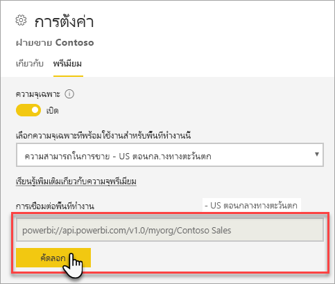
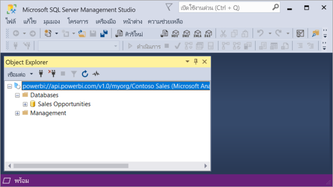

# เชื่อมต่อกับชุดข้อมูลที่มีแอปพลิเคชันไคลเอ็นต์และเครื่องมือ (ตัวอย่าง)

Power BI Premium รองรับพื้นที่ทำงานและชุดข้อมูล*แบบอ่านอย่างเดียว*เชื่อมต่อจาก Microsoft และแอปพลิเคชันไคลเอ็นต์ของบุคคลสาม และเครื่องมือ 

> [!NOTE]
> บทความนี้มีไว้เท่านั้นเพื่อแนะนำการเชื่อมต่อแบบอ่านอย่างเดียวไปยังพื้นที่ทำงาน Power BI Premium และชุดข้อมูล ซึ่ง*ไม่ใช่*ไว้เพื่อให้ข้อมูลเชิงลึกเกี่ยวกับ programmability เครื่องมือที่เฉพาะเจาะจง และแอปพลิเคชัน สถาปัตยกรรม และจัดการพื้นที่ทำงานและชุดข้อมูล หัวข้อที่อธิบายไว้ที่นี่จำเป็นต้องทำความเข้าใจเกี่ยวกับทึบสถาปัตยกรรมฐานข้อมูลแบบจำลองแบบตาราง Analysis Services และดูแลระบบ

## โปรโตคอล

Power BI Premium ใช้[XML สำหรับการวิเคราะห์](https://docs.microsoft.com/bi-reference/xmla/xml-for-analysis-xmla-reference)โพรโทคอล (XMLA) สำหรับการติดต่อสื่อสารระหว่างแอปพลิเคชันไคลเอ็นต์และเครื่องมือที่จัดการพื้นที่ทำงานและชุดข้อมูลของคุณ ติดต่อสื่อสารเหล่านี้จะผ่านอะไรจะมักเรียกว่าจุดสิ้นสุด XMLA XMLA คือ โพรโทคอติดต่อสื่อสารเดียวกันที่ใช้ โดย Microsoft Analysis Services engine ที่อยู่ภายใน มที่เรียกใช้ Power BI semantic โมเดล กำกับดูแล วงจรชีวิต และข้อมูลการจัดการ 

ส่วนใหญ่ของแอปพลิเคชันไคลเอ็นต์และเครื่องมือไม่ชัดเจนสื่อสารกับกลไกจัดการ โดยใช้จุดสิ้นสุด XMLA แทน พวกเขาใช้ไลบรารีไคลเอ็นต์เช่น MSOLAP, ADOMD และ AMO เป็นตัวกลางระหว่างแอปพลิเคชันไคลเอ็นต์และกลไกจัดการ การสื่อสาร โดยใช้ XMLA

## เครื่องมือที่ได้รับการสนับสนุน

เครื่องมือเหล่านี้สนับสนุนการเข้าถึงแบบอ่านอย่างเดียวกับพื้นที่ทำงาน Power BI Premium และชุดข้อมูล:

**SQL Server Management Studio (SSMS)** -คิวรี DAX สนับสนุน MDX, XMLA และ TraceEvent จำเป็นต้องใช้เวอร์ชัน 18.0 ดาวน์โหลด[นี่](https://docs.microsoft.com/sql/ssms/download-sql-server-management-studio-ssms) 

**ตัวสร้างโพรไฟล์ของ SQL Server** -มาพร้อมกับ 18.0 SSMS (ตัวอย่าง), เครื่องมือนี้มีการติดตาม และดีบักของเหตุการณ์เซิร์ฟเวอร์ คุณสามารถจับภาพ และบันทึกข้อมูลเกี่ยวกับแต่ละเหตุการณ์ไปยังไฟล์หรือตารางการวิเคราะห์ในภายหลัง ในขณะที่สนับสนุนอย่างเป็นทางสำหรับ SQL Server ตัวสร้างโพรไฟล์ยังคงอยู่ใน SSMS และยังคงได้รับการสนับสนุนสำหรับ Analysis Services และตอนนี้ Power BI Premium เมื่อต้องการเรียนรู้เพิ่มเติม ดู[SQL Server Profiler](https://docs.microsoft.com/sql/tools/sql-server-profiler/sql-server-profiler)

**DAX Studio** - นซอร์ส ชุมชนเครื่องมือสำหรับการดำเนินการ และวิเคราะห์ DAX คิวรีกับ Analysis Services จำเป็นต้องใช้เวอร์ชัน 2.8.2 หรือใหม่กว่า เมื่อต้องการเรียนรู้เพิ่มเติม ดู[daxstudio.org](https://daxstudio.org/)

**Pivottable ของ Excel** -จำเป็นต้องคลิก-ทู-รันเวอร์ชัน ของ Office 16.0.11326.10000 หรือด้านบน

**บริษัท**- รวมถึงแอปพลิเคชันแสดงภาพข้อมูลไคลเอ็นต์ และเครื่องมือที่สามารถเชื่อมต่อกับ คิว และใช้ชุดข้อมูลใน Power BI Premium เครื่องมือส่วนใหญ่จำเป็นต้องมีเวอร์ชันล่าสุดของไลบรารีไคลเอ็นต์ MSOLAP แต่บางอย่างอาจใช้ ADOMD

## ไลบรารีไคลเอ็นต์

ไลบรารีไคลเอ็นต์จำเป็นสำหรับแอปพลิเคชันไคลเอ็นต์และเครื่องมือการเชื่อมต่อกับพื้นที่ทำงาน Power BI Premium ไลบรารีไคลเอ็นต์เดียวกันที่ใช้ในการเชื่อมต่อกับ Analysis Services ยังได้รับการสนับสนุนใน Power BI Premium Microsoft แอปพลิเคชันไคลเอ็นต์เช่น Excel, SQL Server Management Studio (SSMS), และ SQL Server Data Tools (SSDT) ติดตั้งไลบรารีไคลเอ็นต์สามทั้งหมด และอัปเดพร้อมกับการปรับปรุงแอปพลิเคชันทั่วไป ในบางกรณี กับแอปพลิเคชันของบุคคลสามและเครื่องมือ โดยเฉพาะอย่างยิ่งคุณอาจจำเป็นต้องติดตั้งเวอร์ชันที่ใหม่กว่าของไลบรารีไคลเอ็นต์ ไลบรารีไคลเอ็นต์มีการปรับปรุงรายเดือน เมื่อต้องการเรียนรู้เพิ่มเติม ดู[ไลบรารีไคลเอ็นต์สำหรับการเชื่อมต่อกับ Analysis Services](https://docs.microsoft.com/azure/analysis-services/analysis-services-data-providers)

## เชื่อมต่อกับพื้นที่ทำงาน Premium

คุณสามารถเชื่อมต่อกับพื้นที่ทำงานที่มอบหมายให้กับกำลังการผลิตพรีเมียมเฉพาะ พื้นที่ทำงานที่มอบหมายให้กับความจุเฉพาะมีสตริเชื่อมต่อในรูปแบบ URL 

เมื่อต้องรับสายการเชื่อมต่อ พื้นที่ทำงานใน Power BI ใน**ตั้งค่าพื้นที่ทำงาน**บนการ**Premium**แท็บ ใน**เชื่อมต่อพื้นที่ทำงาน**คลิก**คัดลอก**.

เชื่อมต่อพื้นที่ทำงานใช้รูปแบบ URL ต่อไปนี้เพื่อจัดการพื้นที่ทำงานเหมือนกับเป็นชื่อเซิร์ฟเวอร์ Analysis Services:   
`powerbi://api.powerbi.com/v1.0/[tenant name]/[workspace name]` 

ตัวอย่าง `powerbi://api.powerbi.com/v1.0/contoso.com/Sales Workspace`
> [!NOTE]
> `[workspace name]` กรณีที่เป็นความลับ และสามารถใส่ช่องว่าง 

### การเชื่อมต่อใน SSMS

ใน**เชื่อมต่อกับเซิร์ฟเวอร์** > **ชนิด Server**เลือก**Analysis Services** ใน**ชื่อเซิร์ฟเวอร์**ใส่ URL ใน**รับรองความถูกต้อง**เลือก**Active Directory - สากล ด้วยการสนับสนุน MFA**และจากนั้นใน**ชื่อผู้ใช้**ใส่ id ผู้ใช้ขององค์กรของคุณ 

เมื่อเชื่อมต่อ พื้นที่ทำงานจะแสดงเป็นกับเซิร์ฟเวอร์ Analysis Services และชุดข้อมูลในพื้นที่ทำงานจะแสดงเป็นฐานข้อมูล  

### แค็ตตาล็อกเริ่มต้น

เครื่องมือ บางตัวเช่น SQL Server Profiler ที่คุณอาจจำเป็นต้องระบุการ*แค็ตตาล็อกเริ่มต้น*ได้ ระบุชุดข้อมูล (ฐานข้อมูล) ในพื้นที่ทำงานของคุณ ใน**เชื่อมต่อกับเซิร์ฟเวอร์**คลิก**ตัวเลือก** ในการ**เชื่อมต่อกับเซิร์ฟเวอร์**โต้ตอบ บนการ**คุณสมบัติการเชื่อมต่อ**แท็บ ใน**เชื่อมต่อกับฐานข้อมูล**ใส่ชื่อชุดข้อมูล

### ชื่อพื้นที่ทำงานที่ซ้ำกัน

เมื่อเชื่อมต่อกับพื้นที่ทำงานโดยใช้ชื่อเดียวกันกับพื้นที่ทำงานอื่น คุณอาจได้รับข้อผิดพลาดต่อไปนี้: **ไม่สามารถเชื่อมต่อกับ powerbi://api.powerbi.com/v1.0/ [ชื่อผู้เช่า] / [ชื่อพื้นที่ทำงาน] ได้**

เพื่อหลีกเลี่ยงข้อผิดพลาดนี้ นอกเหนือจากชื่อพื้นที่ทำงาน ระบุ ObjectIDGuid ซึ่งคุณสามารถคัดลอกจาก objectID พื้นที่ทำงานใน URL ผนวก objectID ที่ไปยัง URL ที่เชื่อมต่อ ตัวอย่าง 'powerbi://api.powerbi.com/v1.0/myorg/Contoso ขาย - 9d83d204-82a9-4b36-98f2-a40099093830'

### ชื่อชุดข้อมูลที่ซ้ำกัน

เมื่อเชื่อมต่อกับชุดข้อมูลที่มีชื่อเดียวกันเป็นชุดข้อมูลอื่นในพื้นที่ทำงานเดียวกัน ผนวก guid ชุดข้อมูลไปยังชื่อชุดข้อมูล คุณสามารถรับชื่อชุดข้อมูลทั้งสอง*และ*guid เมื่อเชื่อมต่อกับพื้นที่ทำงานใน SSMS ได้ 

### ความล่าช้าในชุดข้อมูลที่แสดง

เมื่อเชื่อมต่อกับพื้นที่ทำงาน เปลี่ยนแปลงจากชุดข้อมูลใหม่ ลบ และเปลี่ยนชื่อสามารถมีได้ถึง 5 นาทีปรากฏ 

### ชุดข้อมูลไม่รองรับ

ชุดข้อมูลต่อไปนี้จะไม่สามารถเข้าถึงได้ โดยใช้จุดสิ้นสุด XMLA ชุดข้อมูลเหล่านี้*จะไม่*ปรากฏภายใต้พื้นที่ทำงาน ใน SSMS หรือเครื่องมืออื่น ๆ: 

- ชุดข้อมูลที่ มีการเชื่อมต่อสดกับรูปแบบการ Analysis Services 
- ชุดข้อมูลที่ มีการส่งข้อมูลโดยใช้ REST API
- ชุดข้อมูลสมุดงาน Excel 

ชุดข้อมูลต่อไปนี้จะไม่ได้รับการสนับสนุนในบริการ Power BI:   

- ชุดข้อมูลที่ มีการเชื่อมต่อสดไปยังชุดข้อมูล Power BI

## บันทึกการตรวจสอบ 

เมื่อแอปพลิเคชันไคลเอ็นต์และเครื่องมือเชื่อมต่อกับพื้นที่ทำงาน เข้าถึงผ่านจุดสิ้นสุด XMLA ถูกบันทึกในบันทึกการตรวจสอบ Power BI ภายใต้การ**GetWorkspaces**ดำเนินการ เมื่อต้องการเรียนรู้เพิ่มเติม ดู[ตรวจสอบ Power BI](service-admin-auditing.md)

## ดูเพิ่มเติม

[Analysis Services อ้างอิง](https://docs.microsoft.com/bi-reference/#pivot=home&panel=home-all)   
[SQL Server Management Studio](https://docs.microsoft.com/sql/ssms/sql-server-management-studio-ssms)   
[SQL Server Analysis Services Tabular โพรโทคอล](https://docs.microsoft.com/openspecs/sql_server_protocols/ms-ssas-t/b98ed40e-c27a-4988-ab2d-c9c904fe13cf)   
[มุมมองการจัดการแบบไดนามิก (DMVs)](https://docs.microsoft.com/sql/analysis-services/instances/use-dynamic-management-views-dmvs-to-monitor-analysis-services)   

มีคำถามเพิ่มเติมหรือไม่? [ลองถามชุมชน Power BI](https://community.powerbi.com/)
