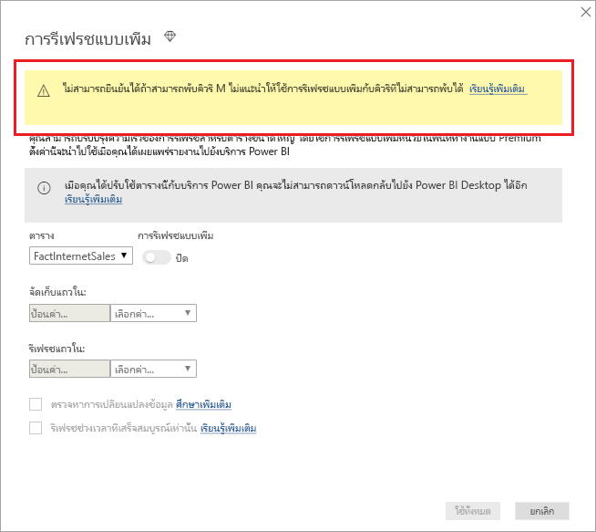

# <a name="incremental-refresh-in-power-bi"></a>การรีเฟรชแบบเพิ่มหน่วยใน Power BI

การรีเฟรชแบบเพิ่มหน่วยจะทำให้ชุดข้อมูลขนาดใหญ่ใน Power BI มีสิทธิประโยชน์ต่อไปนี้:

> [!div class="checklist"]
> * **การรีเฟรชเร็วกว่า**- เฉพาะข้อมูลที่มีความต้องการเปลี่ยนแปลงการรีเฟรช ตัวอย่าง รีเฟรชเฉพาะห้าวันของชุดข้อมูล 10 ปี
> * **การรีเฟรชน่าเชื่อถือมากขึ้น** - ตัวอย่างเช่น ไม่จำเป็นต้องรักษาการเชื่อมต่อระยะยาวกับระบบต้นทางที่ผันผวน
> * **ปริมาณการใช้ทรัพยากรลดลง** - เมื่อต้องรีเฟรชข้อมูลน้อยลง ทำให้ปริมาณการใช้โดยรวมของความจำและทรัพยากรอื่นๆ ลดลงด้วย

> [!NOTE]
> ขณะนี้ การรีเฟรชแบบเพิ่มหน่วยจะพร้อมใช้งานสำหรับ Power BI Pro, Premium และการสมัครสมาชิกและชุดข้อมูลที่ใช้ร่วมกัน 

## <a name="configure-incremental-refresh"></a>คิวรีการรีเฟรชแบบเพิ่มหน่วย

นโยบายการรีเฟรชแบบเพิ่มหน่วยจะถูกกำหนดใน Power BI Desktop และนำไปใช้เมื่อเผยแพร่ไปยังบริการ Power BI


### <a name="filter-large-datasets-in-power-bi-desktop"></a>กรองชุดข้อมูลขนาดใหญ่ใน Power BI Desktop

ชุดข้อมูลขนาดใหญ่ที่อาจมีแถวจำนวนพันล้านแถวอาจไม่เหมาะกับ Power BI Desktop เนื่องจากมีข้อจำกัดตามทรัพยากรที่พร้อมใช้งานบนพีซีเดสก์ท็อปของผู้ใช้ ชุดข้อมูลดังกล่าวจะผ่านการกรองเมื่อนำเข้าไปยัง Power BI Desktop การกรองชนิดนี้ใช้ไม่ว่าใช้การรีเฟรชแบบเพิ่มหน่วย หรือไม่ สำหรับการรีเฟรชแบบเพิ่มหน่วย คุณกรอง โดยใช้พารามิเตอร์วันที่/เวลา Power Query

#### <a name="rangestart-and-rangeend-parameters"></a>พารามิเตอร์ RangeStart และ RangeEnd

เมื่อต้องการใช้ประโยชน์จากการรีเฟรชแบบเพิ่มหน่วยในบริการ Power BI จะต้องกรองโดยใช้พารามิเตอร์วันที่/เวลาของ Power Query ที่มีชื่อที่จองไว้ โดยต้องตรงตามตัวพิมพ์เล็กใหญ่ **RangeStart** และ **RangeEnd** พารามิเตอร์เหล่านี้จะใช้ เพื่อกรองข้อมูลนำเข้าลงใน Power BI Desktop รวม ถึงแบบไดนามิกพาร์ติชันข้อมูลลงในช่วงที่หลังจากเผยแพร่ไปยังบริการ Power BI ค่าพารามิเตอร์จะแทน โดยบริการเพื่อกรองข้อมูลสำหรับแต่ละพาร์ติชัน ไม่จำเป็นต้องตั้งค่าพารามิเตอร์ในการตั้งค่าชุดข้อมูลในบริการ เมื่อเผยแพร่แล้ว ค่าพารามิเตอร์จะถูกเขียนทับโดยบริการ Power BI โดยอัตโนมัติ

เมื่อต้องกำหนดพารามิเตอร์ ด้วยค่าเริ่มต้น ใน Power Query Editor เลือก**จัดการพารามิเตอร์**


เมื่อกำหนดพารามิเตอร์ คุณสามารถนำตัวกรองไปใช้ได้โดยการเลือกตัวเลือกเมนู **ตัวกรองแบบกำหนดเอง** สำหรับคอลัมน์


ตรวจสอบให้แน่ใจว่าแถวได้รับการกรองที่ตำแหน่งที่ค่าคอลัมน์*อยู่หลังหรือเท่ากับ***RangeStart** และ*อยู่ก่อน***RangeEnd** การรวมตัวกรองอื่น ๆ อาจส่งผลให้มีการนับจำนวนแถวเป็นสองเท่า


> [!IMPORTANT]
> ตรวจสอบแบบสอบถามที่มีค่าเท่ากับ (=) บน **ช่วงเริ่มต้น** หรือ **ช่วงสิ้นสุด** หากมีค่าเท่ากับ (=) ในพารามิเตอร์ทั้งสอง แถวหนึ่งอาจเป็นไปตามเงื่อนไขสำหรับสองพาร์ติชัน ซึ่งอาจทำให้เกิดข้อมูลที่ซ้ำกันในแบบจำลองได้ ตัวอย่างเช่น  
> \#"แถวที่มีการกรอง" = Table.SelectRows(dbo_Fact, [OrderDate] แต่ละรายการ **>= ช่วงเริ่มต้น** และ [OrderDate] **<= ช่วงสิ้นสุด**) อาจส่งผลให้ข้อมูลซ้ำกันได้

> [!TIP]
> แม้ว่าชนิดข้อมูลของพารามิเตอร์จำเป็นต้องเป็นวันที่/เวลา แต่ก็สามารถแปลงให้ตรงกับความต้องการของแหล่งข้อมูล ตัวอย่างเช่น ฟังก์ชัน Power Query ต่อไปนี้จะแปลงค่าวันที่/เวลาให้กับคีย์ตัวแทนจำนวนของรูปแบบ *yyyymmdd* ซึ่งเป็นรูปแบบทั่วไปของคลังข้อมูล สามารถเรียกฟังก์ชันตามขั้นตอนการกรอง
>
> `(x as datetime) => Date.Year(x)*10000 + Date.Month(x)*100 + Date.Day(x)`

เลือก **ปิดและนำไปใช้** จาก Power Query Editor คุณควรมีชุดย่อยของชุดข้อมูลอยู่ใน Power BI Desktop

#### <a name="filter-date-column-updates"></a>กรองการปรับปรุงคอลัมน์วัน

ตัวกรองจะถูกใช้เพื่อพาร์ติชันข้อมูลเป็นช่วงในบริการ Power BI รีเฟรชแบบเพิ่มหน่วยไม่ได้ออกแบบมาเพื่อสนับสนุนกรณีที่มีการอัปเดคอลัมน์วันที่ถูกกรองในระบบต้นทาง การปรับปรุงจะถูกแปลเป็นการแทรกและลบ ไม่อัปเดจริง ถ้าการลบเกิดขึ้นในช่วงอดีตและไมใช่่ช่วงเพิ่มหน่วย ช่วงนั้นจะไม่ถูกเลือก ซึ่งอาจทำให้เกิดความเสียหายในการรีเฟรชข้อมูลเนื่องจากข้อขัดแย้งคีย์พาร์ติชัน

#### <a name="query-folding"></a>พับแบบสอบถาม

เป็นสิ่งสำคัญที่ตัวกรองจะถูกส่งไปยังระบบแหล่งข้อมูลเมื่อมีการส่งคิวรีให้ดำเนินการรีเฟรช การผลักดันการกรองข้อมูลลงไปหมายความว่า แหล่งข้อมูลควรสนับสนุน "query folding” แหล่งข้อมูลส่วนใหญ่ที่สนับสนุนคำคิวรี่ SQL จะสนับสนุน query folding ด้วย แหล่งข้อมูล เช่น ไฟล์ข้อมูลธรรมดา, blobs, เว็บและ OData feeds มักไม่มี ในกรณีที่ตัวกรองไม่สนับสนุนแหล่งข้อมูล backend จะไม่สามารถเก็บข้อมูลเข้ากองซ้อนได้ ในกรณีเช่นนี้ โปรแกรม mashup จะชดเชยและใช้ตัวกรองภายในเครื่องซึ่งอาจต้องเรียกชุดข้อมูลทั้งหมดจากแหล่งข้อมูล ซึ่งสามารถทำให้เกิดการรีเฟรชแบบเพิ่มหน่วยใช้เวลานานมาก และกระบวนการสามารถใช้ทรัพยากรหมดทั้งในบริการ Power BI หรือ ในเกตเวย์ข้อมูลภายในองค์กรถ้าใช้

เนื่องจากมีการสนับสนุน query folding หลายระดับในแหล่งข้อมูล ขอแนะนำให้คุณตรวจสอบว่าตรรกะตัวกรองรวมอยู่ในคิวรีแหล่งข้อมูล เพื่อทำให้ง่ายขึ้น Power BI Desktop พยายามดำเนินการตรวจสอบนี้สำหรับคุณ ถ้าไม่สามารถตรวจสอบ คำเตือนจะแสดงในกล่องโต้ตอบการรีเฟรชแบบเพิ่มหน่วยเมื่อกำหนดนโยบายการรีเฟรชแบบเพิ่มหน่วย SQL ตามแหล่งข้อมูลเช่น SQL, Oracle และ Teradata สามารถพึ่งพาคำเตือนนี้ แหล่งข้อมูลอื่น ๆ อาจไม่สามารถตรวจสอบโดยไม่ต้องการติดตามแบบสอบถาม ถ้า Power BI Desktop ไม่สามารถยืนยัน คำเตือนต่อไปนี้จะปรากฏขึ้น หากคุณมองเห็นคำเตือนนี้ และต้องการตรวจสอบว่าการพับคิวรีที่จำเป็นเกิดขึ้นหรือไม่ คุณสามารถใช้คุณลักษณะการวินิจฉัยคิวรี หรือติดตามคิวรีที่ได้รับจากฐานข้อมูลต้นทาง

 

### <a name="define-the-refresh-policy"></a>กำหนดนโยบายการรีเฟรช

การรีเฟรชแบบเพิ่มหน่วยจะพร้อมใช้งานบนเมนูบริบทสำหรับตาราง ยกเว้นสำหรับแบบจำลองการเชื่อมต่อสด


#### <a name="incremental-refresh-dialog"></a>กล่องโต้ตอบการรีเฟรชแบบเพิ่มหน่วย

กล่องโต้ตอบการรีเฟรชแบบเพิ่มหน่วยจะแสดงขึ้น ใช้ตัวสลับเพื่อเปิดใช้งานงานกล่องโต้ตอบ


> [!NOTE]
> ถ้านิพจน์ของ Power Query สำหรับตารางไม่ได้อ้างอิงไปยังพารามิเตอร์ที่มีชื่อที่จองไว้ ตัวสลับจะถูกปิดใช้งาน

ข้อความส่วนหัวจะอธิบายดังต่อไปนี้:

- นโยบายการรีเฟรชจะถูกกำหนดใน Power BI Desktop ซึ่งจะถูกนำไปใช้โดยการดำเนินการรีเฟรชในบริการ

- ถ้าคุณสามารถดาวน์โหลดไฟล์ PBIX ที่มีนโยบายการรีเฟรชแบบเพิ่มหน่วยจากบริการ Power BI ไฟล์ดังกล่าวจะไม่เปิดใน Power BI Desktop แม้ว่าจะมีการสนับสนุนในอนาคต ให้จำไว้ว่าชุดข้อมูลเหล่านี้สามารถเพิ่มขนาดขึ้นได้อย่างมาก จึงไม่สามารถดาวน์โหลดละเปิดบนพีซีเดสก์ท็อปทั่วไปได้

#### <a name="refresh-ranges"></a>รีเฟรชช่วง

ตัวอย่างต่อไปนี้กำหนดนโยบายการรีเฟรชเพื่อเก็บข้อมูลเป็นเวลาห้าปีปฏิทินเต็มรวมกับข้อมูลสำหรับปีปัจจุบันจนถึงวันที่ปัจจุบัน และจะรีเฟรชข้อมูลแบบเพิ่มหน่วย 10 วัน การดำเนินการรีเฟรชครั้งแรกจะโหลดข้อมูลในอดีตที่ผ่านมา การรีเฟรชครั้งต่อมาจะเป็นการรีเฟรชแบบเพิ่มหน่วย และ (หากกำหนดให้ทำงานทุกวัน) จะมีการดำเนินการต่อไปนี้

- เพิ่มข้อมูลของวันใหม่

- รีเฟรชข้อมูล 10 วันจนถึงวันที่ปัจจุบัน

- ลบปีปฏิทินที่เก่ากว่าห้าปีก่อนวันที่ปัจจุบัน ตัวอย่างเช่น หากวันที่ปัจจุบันคือ 1 มกราคม 2019 ปี 2013 จะถูกลบ

การรีเฟรชครั้งแรกในบริการ Power BI อาจใช้เวลานานในการนำเข้าข้อมูลทั้งหมดในห้าปีปฏิทินเต็ม การรีเฟรชครั้งต่อมาอาจเสร็จสิ้นในเวลาที่เร็วกว่านั้น


#### <a name="current-date"></a>วันที่ปัจจุบัน

*วันที่ปัจจุบัน* จะขึ้นอยู่กับวันที่ในระบบ ณ เวลาที่รีเฟรช หากการรีเฟรชตามกำหนดเวลาเปิดใช้งานสำหรับชุดข้อมูลในบริการของ Power BI โซนเวลาที่กำหนดจะถูกนำมาพิจารณาขณะพิจารณาวันที่ปัจจุบัน การรีเฟรชทั้งสองอย่างด้วยตนเองและการรีเฟรชตามกำหนดการจะสังเกตโซนเวลา ถ้ามี ตัวอย่างเช่น การรีเฟรชที่เกิดขึ้นในเวลา 20.00 น. Pacific Time (สหรัฐฯ และแคนาดา) ในโซนเวลาที่ระบุ จะกำหนดวันที่ปัจจุบันตาม Pacific Time ไม่ใช่ GMT (ซึ่งจะเป็นวันถัดไป)


> [!NOTE]
> ข้อกำหนดของช่วงเหล่านี้อาจเป็นสิ่งที่คุณต้อง ในกรณี คุณสามารถไปยังประกาศขั้นตอนด้านล่างได้ ดรอปดาวน์เพิ่มเติมสำหรับคุณลักษณะขั้นสูงได้

### <a name="advanced-policy-options"></a>ตัวเลือกนโยบายขั้นสูง

#### <a name="detect-data-changes"></a>ตรวจหาการเปลี่ยนแปลงข้อมูล

การรีเฟรชแบบเพิ่มหน่วย 10 วัน มีประสิทธิภาพมากกว่าการรีเฟรชทั้งห้าปีเต็ม อย่างไรก็ตาม จำเป็นต้องทำได้ดีขึ้น ถ้าคุณเลือกกล่องกาเครื่องหมาย **ตรวจพบการเปลี่ยนแปลงข้อมูล** คุณสามารถเลือกคอลัมน์วันที่/เวลาที่ใช้ในการระบุและรีเฟรชเฉพาะวันที่ข้อมูลถูกเปลี่ยนแปลง ซึ่งสมมติว่าคอลัมน์ดังกล่าวอยู่ในระบบแหล่งข้อมูล ซึ่งมีไว้สำหรับวัตถุประสงค์การตรวจสอบ **ซึ่งไม่ควรเป็นคอลัมน์เดียวกับที่ถูกใช้พาร์ติชั่นข้อมูลด้วยพารามิเตอร์ RangeStart/RangeEnd** ค่าสูงสุดของคอลัมน์นี้จะได้รับการประเมินสำหรับแต่ละช่วงเวลาในช่วงที่เพิ่มขึ้น หากไม่มีการเปลี่ยนแปลงตั้งแต่การรีเฟรชครั้งล่าสุด ไม่จำเป็นต้องรีเฟรชช่วงเวลา ตัวอย่างเช่น การทำเช่นนี้จะเป็นการลดจำนวนวันที่ต้องรีเฟรชแบบเพิ่มหน่วยจาก 10 วันเหลือประมาณสองวัน


> [!TIP]
> การออกแบบปัจจุบันจำเป็นต้องให้คอลัมน์ตรวจหาว่าการเปลี่ยนแปลงข้อมูลยังคงเหมือนเดิมและแคชลงในหน่วยความจำ คุณอาจต้องการพิจารณาใช้หนึ่งในเทคนิคต่อไปนี้เพื่อลดการใช้งานข้อมูลในชุดและหน่วยความจำ
>
> คงไว้เฉพาะค่าสูงสุดของคอลัมน์นี้เมื่อรีเฟรช อาจใช้ฟังก์ชันของ Power Query
>
> ลดความแม่นยำเป็นระดับที่ยอมรับได้ของความต้องการความถี่การรีเฟรชของคุณ
>
> เราวางแผนที่จะอนุญาตคำจำกัดความของคิวรีแบบกำหนดเองสำหรับการตรวจหาการเปลี่ยนแปลงข้อมูลในอนาคต ซึ่งอาจใช้ในการหลีกเลี่ยงการคงค่าคอลัมน์ไว้

#### <a name="only-refresh-complete-periods"></a>รีเฟรชช่วงเวลาที่เสร็จสมบูรณ์เท่านั้น

สมมติว่าการรีเฟรชของคุณมีกำหนดการที่ 4:00 น. ของทุกๆ เช้า ถ้าข้อมูลปรากฏในระบบแหล่งข้อมูลระหว่าง 4 ชั่วโมงนั้น คุณอาจไม่ต้องการลบ เมทริกซ์ธุรกิจบางอย่าง -- เช่น ถังต่อวันในอุตสาหกรรมน้ำมันและแก๊ส -- จะไม่สามารถเข้าใจได้ในบางส่วนของวัน

อีกตัวอย่างหนึ่งคือการรีเฟรชข้อมูลจากระบบการเงินที่ข้อมูลจากเดือนที่แล้วได้รับการอนุมัติเมื่อวันที่ 12 ของเดือน คุณสามารถตั้งค่าการเว้นช่วงเป็น 1 เดือนและจัดกำหนดการให้เรียกใช้ใยวันที่ 12 ของทุกเดือน เมื่อเลือกตัวเลือกนี้ จะรีเฟรชข้อมูลของเดือนมกราคมในวันที่ 12 กุมภาพันธ์


> [!NOTE]
> การดำเนินการรีเฟรชในบริการจะเรียกใช้ภายใต้เวลา UTC ซึ่งสามารถกำหนดวันที่มีผลและจะส่งผลต่อช่วงเวลาที่เสร็จสมบูรณ์ เราวางแผนที่จะเพิ่มความสามารถในการใช้ถ้อยคำทับวันที่มีผลสำหรับการดำเนินการรีเฟรช

## <a name="publish-to-the-service"></a>เผยแพร่ไปยังบริการ

ในตอนนี้ คุณสามารถรีเฟรชแบบจำลองได้ การรีเฟรชครั้งแรกอาจใช้เวลานานในการนำเข้าข้อมูลประวัติ การรีเฟรชครั้งต่อมาจะเร็วกว่าครั้งแรกมาก เนื่องจากใช้การรีเฟรชแบบเพิ่มหน่วย

## <a name="query-timeouts"></a>หมดเวลาคิวรี

บทความ[การแก้ไขปัญหาการรีเฟรช](https://docs.microsoft.com/power-bi/refresh-troubleshooting-refresh-scenarios)จะอธิบายว่าการดำเนินการรีเฟรชในบริการ Power BI อาจหมดเวลาได้ คิวรียังสามารถถูกจำกัดโดยการหมดเวลาเริ่มต้นสำหรับแหล่งข้อมูล แหล่งข้อมูลที่เกี่ยวข้องส่วนใหญ่จะอนุญาตการใช้ถ้อยคำทับการหมดเวลาในนิพจน์ M ตัวอย่างเช่น นิพจน์ด้านล่างจะใช้[ฟังก์ชันเข้าถึงข้อมูล SQL Server](https://msdn.microsoft.com/query-bi/m/sql-database)เพื่อตั้งค่าให้เป็น 2 ชั่วโมง แต่ละช่วงเวลาจะถูกกำหนดโดยนโยบายการส่งคิวรีที่สังเกตการตั้งค่าการหมดเวลาคำสั่ง

```powerquery-m
let
    Source = Sql.Database("myserver.database.windows.net", "AdventureWorks", [CommandTimeout=#duration(0, 2, 0, 0)]),
    dbo_Fact = Source{[Schema="dbo",Item="FactInternetSales"]}[Data],
    #"Filtered Rows" = Table.SelectRows(dbo_Fact, each [OrderDate] >= RangeStart and [OrderDate] < RangeEnd)
in
    #"Filtered Rows"
```

## <a name="limitations"></a>ข้อจำกัด

ในปัจจุบัน สำหรับ[โมเดลแบบรวม](desktop-composite-models.md) การรีเฟรชแบบเพิ่มทีละหน่วยได้รับการสนับสนุนสำหรับ SQL Server, ฐานข้อมูล Azure SQL, คลังข้อมูล SQL, Oracle และแหล่งข้อมูล Teradata เท่านั้น

