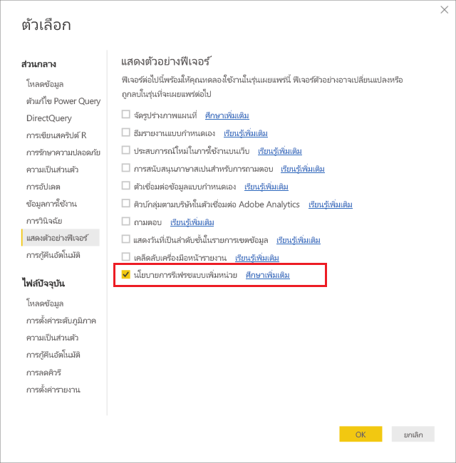
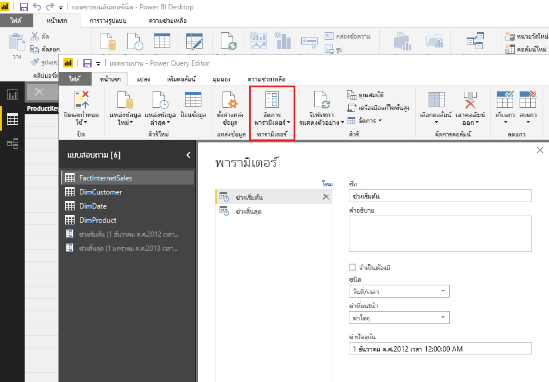
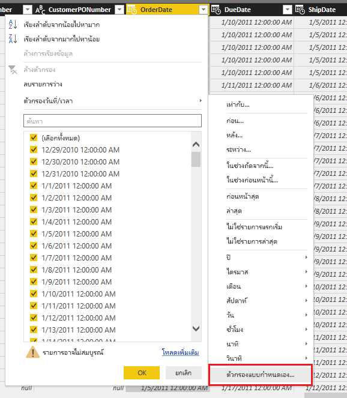
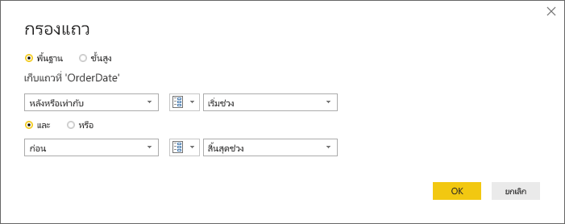
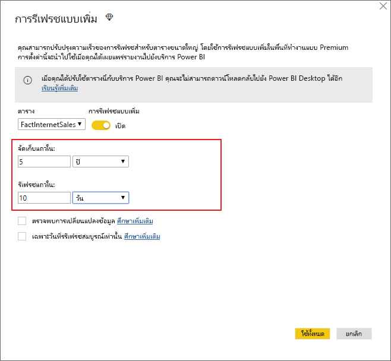
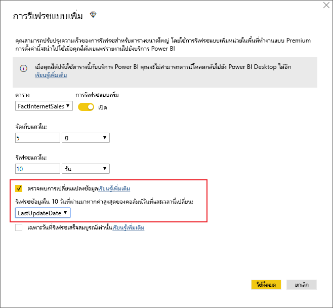
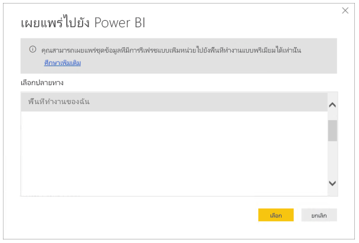

# <a name="incremental-refresh-in-power-bi-premium"></a>การรีเฟรชแบบเพิ่มหน่วยใน Power BI Premium

การรีเฟรชแบบเพิ่มหน่วยจะทำให้ชุดข้อมูลขนาดใหญ่ในบริการ Power BI Premium มีสิทธิประโยชน์ต่อไปนี้:

- **การรีเฟรชที่เร็วยิ่งขึ้น** ต้องรีเฟรชเฉพาะข้อมูลที่เปลี่ยนแปลงเท่านั้น ตัวอย่างเช่น รีเฟรชเฉพาะข้อมูล 5 วันที่ผ่านมาของชุดข้อมูล 10 ปี

- **รีเฟรชที่มีประสิทธิภาพมากขึ้น** ตัวอย่างเช่น ไม่จำเป็นต้องรักษาการเชื่อมต่อระยะยาวเพื่อเปลี่ยนแปลงระบบแหล่งข้อมูล

- **ลดการใช้งานทรัพยากร** ใช้ข้อมูลในการรีเฟรชน้อยลงเพื่อลดการใช้งานหน่วยความจำและทรัพยากรอื่นๆ โดยรวม

## <a name="how-to-use-incremental-refresh"></a>วิธีการใช้การรีเฟรชแบบเพิ่มหน่วย

นโยบายการรีเฟรชแบบเพิ่มหน่วยจะถูกกำหนดใน Power BI Desktop และนำไปใช้เมื่อเผยแพร่ไปยังบริการ Power BI

เริ่มต้นด้วยการเปลี่ยนใช้การรีเฟรชแบบเพิ่มหน่วยในแสดงตัวอย่างฟีเจอร์



### <a name="filter-large-datasets-in-power-bi-desktop"></a>กรองชุดข้อมูลขนาดใหญ่ใน Power BI Desktop

ชุดข้อมูลขนาดใหญ่ที่อาจมีแถวจำนวนพันล้านแถวอาจไม่เหมาะกับ Power BI Desktop เนื่องจากมีข้อจำกัดตามทรัพยากรที่พร้อมใช้งานบนพีซีเดสก์ท็อปของผู้ใช้ ชุดข้อมูลดังกล่าวจะผ่านการกรองเมื่อนำเข้าไปยัง Power BI Desktop ซึ่งจะดำเนินการเช่นนี้เสมอ ไม่ว่าจะใช้การรีเฟรชแบบเพิ่มหน่วยหรือไม่

#### <a name="rangestart-and-rangeend-parameters"></a>พารามิเตอร์ RangeStart และ RangeEnd

เมื่อต้องการใช้ประโยชน์จากการรีเฟรชแบบเพิ่มหน่วยในบริการ Power BI จะต้องกรองโดยใช้พารามิเตอร์วันที่/เวลาของ Power Query ที่มีชื่อที่จองไว้ โดยต้องตรงตามตัวพิมพ์เล็กใหญ่ **RangeStart** และ **RangeEnd**

ใน Power Query Editor ให้เลือก **จัดการพารามิเตอร์** เพื่อกำหนดพารามิเตอร์ด้วยค่าเริ่มต้น



เมื่อกำหนดพารามิเตอร์ คุณสามารถนำตัวกรองไปใช้ได้โดยการเลือกตัวเลือกเมนู **ตัวกรองแบบกำหนดเอง** สำหรับคอลัมน์



รับรองว่าแถวได้รับการกรองที่ตำแหน่งที่ค่าคอลัมน์*อยู่หลังหรือเท่ากับ* **RangeStart** และ*อยู่ก่อน* **RangeEnd**



> [!TIP]
> แม้ว่าชนิดข้อมูลของพารามิเตอร์จำเป็นต้องเป็นวันที่/เวลา แต่ก็สามารถแปลงให้ตรงกับความต้องการของแหล่งข้อมูล ตัวอย่างเช่น ฟังก์ชัน Power Query ต่อไปนี้จะแปลงค่าวันที่/เวลาให้กับคีย์ตัวแทนจำนวนของรูปแบบ *yyyymmdd* ซึ่งเป็นรูปแบบทั่วไปของคลังข้อมูล สามารถเรียกฟังก์ชันตามขั้นตอนการกรอง
>
> `(x as datetime) => Date.Year(x)*10000 + Date.Month(x)*100 + Date.Day(x)`

เลือก **ปิดและนำไปใช้** จาก Power Query Editor คุณควรมีชุดย่อยของชุดข้อมูลอยู่ใน Power BI Desktop

> [!NOTE]
> เมื่อเผยแพร่แล้ว ค่าพารามิเตอร์จะถูกเขียนทับโดยบริการ Power BI โดยอัตโนมัติ ไม่จำเป็นต้องตั้งค่าในการตั้งค่าชุดข้อมูล

### <a name="define-the-refresh-policy"></a>กำหนดนโยบายการรีเฟรช

การรีเฟรชแบบเพิ่มหน่วยจะพร้อมใช้งานบนเมนูบริบทสำหรับตาราง ยกเว้นสำหรับแบบจำลองการเชื่อมต่อสด


#### <a name="incremental-refresh-dialog"></a>กล่องโต้ตอบการรีเฟรชแบบเพิ่มหน่วย

กล่องโต้ตอบการรีเฟรชแบบเพิ่มหน่วยจะแสดงขึ้น ใช้ตัวสลับเพื่อเปิดใช้งานงานกล่องโต้ตอบ


> [!NOTE]
> ถ้านิพจน์ของ Power Query สำหรับตารางไม่ได้อ้างอิงไปยังพารามิเตอร์ที่มีชื่อที่จองไว้ ตัวสลับจะถูกปิดใช้งาน

ข้อความส่วนหัวจะอธิบายดังต่อไปนี้:

-   การรีเฟรชแบบเพิ่มหน่วยได้รับการสนับสนุนสำหรับพื้นที่ทำงานบนความจุแบบพรีเมียมเท่านั้น นโยบายการรีเฟรชจะถูกกำหนดใน Power BI Desktop ซึ่งจะถูกนำไปใช้โดยการดำเนินการรีเฟรชในบริการ

-   ถ้าคุณสามารถดาวน์โหลดไฟล์ PBIX ที่มีนโยบายการรีเฟรชแบบเพิ่มหน่วยจากบริการ Power BI ไฟล์ดังกล่าวจะไม่เปิดใน Power BI Desktop จากนั้น คุณจะไม่สามารถดาวน์โหลดได้ แม้ว่าจะมีการสนับสนุนในอนาคต ให้จำไว้ว่าชุดข้อมูลเหล่านี้สามารถเพิ่มขนาดขึ้นได้อย่างมาก จึงไม่สามารถดาวน์โหลดละเปิดบนพีซีเดสก์ท็อปทั่วไปได้

#### <a name="refresh-ranges"></a>รีเฟรชช่วง

ตัวอย่างต่อไปนี้จะกำหนดนโยบายการรีเฟรชให้จัดเก็บข้อมูลไว้ทั้งหมด 5 ปี และรีเฟรชข้อมูลที่เพิ่มขึ้นทุกๆ 10 วัน ถ้ารีเฟรชฐานข้อมูลทุกวัน สิ่งต่อไปนี้จะได้รับการจัดการในการดำเนินการรีเฟรชแต่ละครั้ง

-   เพิ่มข้อมูลของวันใหม่

-   รีเฟรชข้อมูล 10 วันจนถึงวันที่ปัจจุบัน

-   ลบปีปฏิทินที่เก่ากว่า 5 ปีก่อนวันที่ปัจจุบัน ตัวอย่างเช่น หากวันที่ปัจจุบันคือ 1 มกราคม 2019 ปี 2013 จะถูกลบ

การรีเฟรชครั้งแรกในบริการ Power BI อาจใช้เวลานานในการนำเข้าข้อมูลทั้งหมดใน 5 ปี การรีเฟรชครั้งต่อมาอาจเสร็จสิ้นในเวลาที่เร็วกว่านั้น



**คำจำกัดความของช่วงเหล่านี้คือสิ่งเดียวที่คุณต้องการ ในกรณีที่คุณสามารถไปยังขั้นตอนการเผยแพร่ด้านล่างได้ รายการดรอปดาวน์อื่นๆ มีไว้สำหรับฟีเจอร์ขั้นสูง**

#### <a name="detect-data-changes"></a>ตรวจพบการเปลี่ยนแปลงข้อมูล

การรีเฟรชแบบเพิ่มหน่วยทุกๆ 10 วันที่ประสิทธิภาพมากกว่าการรีเฟรชทั้ง 5 ปี อย่างก็ตาม เราอาจสามารถทำได้ดีกว่านั้น ถ้าคุณเลือกกล่องกาเครื่องหมาย **ตรวจพบการเปลี่ยนแปลงข้อมูล** คุณสามารถเลือกคอลัมน์วันที่/เวลาที่ใช้ในการระบุและรีเฟรชเฉพาะวันที่ข้อมูลถูกเปลี่ยนแปลง ซึ่งสมมติว่าคอลัมน์ดังกล่าวอยู่ในระบบแหล่งข้อมูล ซึ่งมีไว้สำหรับวัตถุประสงค์การตรวจสอบ ค่าสูงสุดของคอลัมน์นี้จะได้รับการประเมินสำหรับแต่ละช่วงเวลาในช่วงที่เพิ่มขึ้น หากไม่มีการเปลี่ยนแปลงตั้งแต่การรีเฟรชครั้งล่าสุด ไม่จำเป็นต้องรีเฟรชช่วงเวลา ในตัวอย่าง จะลดจำนวนวันจากการรีเฟรชทุกๆ 10 วันเป็น 2 วัน



> [!TIP]
> การออกแบบปัจจุบันจำเป็นต้องให้คอลัมน์ตรวจหาว่าการเปลี่ยนแปลงข้อมูลยังคงเหมือนเดิมและแคชลงในหน่วยความจำ คุณอาจต้องการพิจารณาใช้หนึ่งในเทคนิคต่อไปนี้เพื่อลดการใช้งานข้อมูลในชุดและหน่วยความจำ
>
> คงไว้เฉพาะค่าสูงสุดของคอลัมน์นี้เมื่อรีเฟรช อาจใช้ฟังก์ชันของ Power Query
>
> ลดความแม่นยำเป็นระดับที่ยอมรับได้ของความต้องการความถี่การรีเฟรชของคุณ
>
> เราวางแผนที่จะอนุญาตคำจำกัดความของคิวรีแบบกำหนดเองสำหรับการตรวจหาการเปลี่ยนแปลงข้อมูลในอนาคต ซึ่งอาจใช้ในการหลีกเลี่ยงการคงค่าคอลัมน์ไว้

#### <a name="only-refresh-complete-periods"></a>รีเฟรชช่วงเวลาที่เสร็จสมบูรณ์เท่านั้น

สมมติว่าการรีเฟรชของคุณมีกำหนดการที่ 4:00 น. ของทุกๆ เช้า ถ้าข้อมูลปรากฏในระบบแหล่งข้อมูลระหว่าง 4 ชั่วโมงนั้น คุณอาจไม่ต้องการลบ เมทริกซ์ธุรกิจบางอย่าง -- เช่น ถังต่อวันในอุตสาหกรรมน้ำมันและแก๊ส -- จะไม่สามารถเข้าใจได้ในบางส่วนของวัน

อีกตัวอย่างหนึ่งคือการรีเฟรชข้อมูลจากระบบการเงินที่ข้อมูลจากเดือนที่แล้วได้รับการอนุมัติเมื่อวันที่ 12 ของเดือน คุณสามารถตั้งค่าการเว้นช่วงเป็น 1 เดือนและจัดกำหนดการให้เรียกใช้ใยวันที่ 12 ของทุกเดือน เมื่อเลือกตัวเลือกนี้ จะรีเฟรชข้อมูลของเดือนมกราคมในวันที่ 12 กุมภาพันธ์


> [!NOTE]
> การดำเนินการรีเฟรชในบริการจะเรียกใช้ภายใต้เวลา UTC ซึ่งสามารถกำหนดวันที่มีผลและจะส่งผลต่อช่วงเวลาที่เสร็จสมบูรณ์ เราวางแผนที่จะเพิ่มความสามารถในการใช้ถ้อยคำทับวันที่มีผลสำหรับการดำเนินการรีเฟรช

## <a name="publish-to-the-service"></a>เผยแพร่ไปยังบริการ

เนื่องจากการรีเฟรชแบบเพิ่มหน่วยคือฟีเจอร์ระดับพรีเมียมเท่านั้น กล่องโต้ตอบการเผยแพร่จะอนุญาตเฉพาะการเลือกพื้นที่ทำงานบนความจุแบบพรีเมียม



ในตอนนี้ คุณสามารถรีเฟรชแบบจำลองได้ การรีเฟรชครั้งแรกอาจใช้เวลานานในการนำเข้าข้อมูลประวัติ การรีเฟรชครั้งต่อมาจะเร็วกว่าครั้งแรกมาก เนื่องจากใช้การรีเฟรชแบบเพิ่มหน่วย

## <a name="query-timeouts"></a>หมดเวลาคิวรี

บทความ[การแก้ไขปัญหาการรีเฟรช](https://docs.microsoft.com/power-bi/refresh-troubleshooting-refresh-scenarios)จะอธิบายว่าการดำเนินการรีเฟรชในบริการ Power BI อาจหมดเวลาได้ คิวรียังสามารถถูกจำกัดโดยการหมดเวลาเริ่มต้นสำหรับแหล่งข้อมูล แหล่งข้อมูลที่เกี่ยวข้องส่วนใหญ่จะอนุญาตการใช้ถ้อยคำทับการหมดเวลาในนิพจน์ M ตัวอย่างเช่น นิพจน์ด้านล่างจะใช้[ฟังก์ชันเข้าถึงข้อมูล SQL Server](https://msdn.microsoft.com/query-bi/m/sql-database)เพื่อตั้งค่าให้เป็น 2 ชั่วโมง แต่ละช่วงเวลาจะถูกกำหนดโดยนโยบายการส่งคิวรีที่สังเกตการตั้งค่าการหมดเวลาคำสั่ง

```
let
    Source = Sql.Database("myserver.database.windows.net", "AdventureWorks", [CommandTimeout=#duration(0, 2, 0, 0)]),
    dbo_Fact = Source{[Schema="dbo",Item="FactInternetSales"]}[Data],
    #"Filtered Rows" = Table.SelectRows(dbo_Fact, each [OrderDate] >= RangeStart and [OrderDate] < RangeEnd)
in
    #"Filtered Rows"
```
