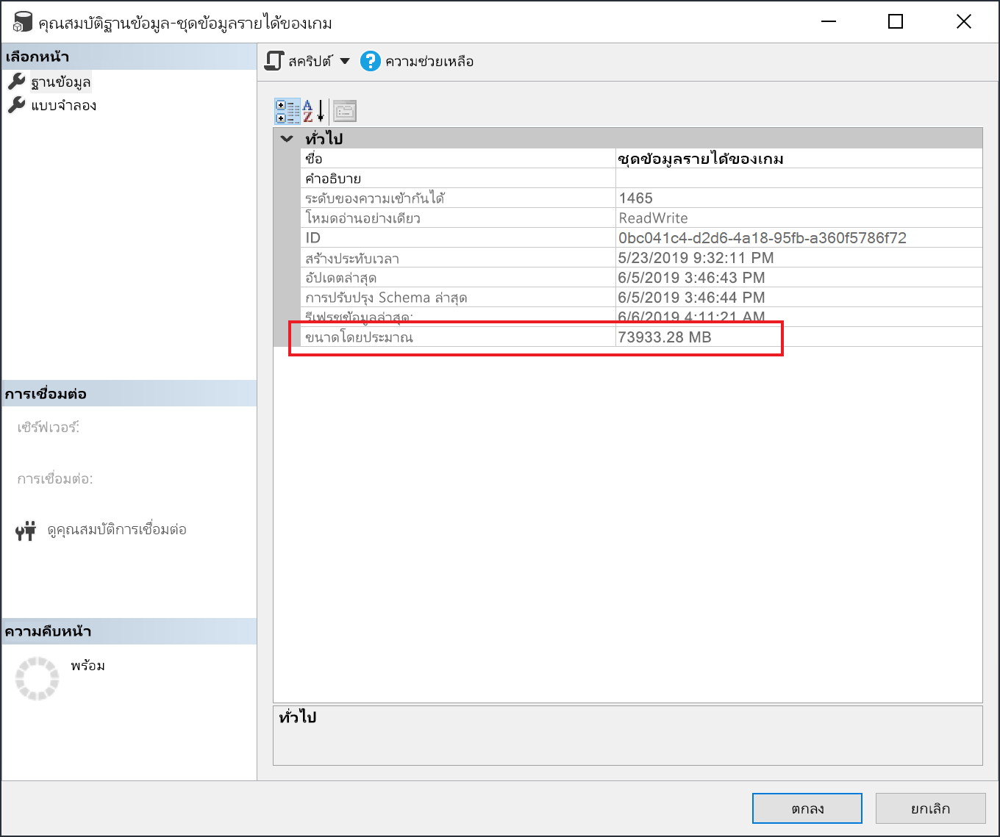

# <a name="large-models-in-power-bi-premium-preview"></a>แบบจำลองขนาดใหญ่ใน Power BI Premium (ตัวอย่าง)

ชุดข้อมูล Power BI สามารถเก็บข้อมูลในแคชที่บีบอัดสูง แคชในหน่วยความจำสำหรับประสิทธิภาพการค้นหาที่ดีที่สุดเพื่อเปิดใช้งานการโต้ตอบกับผู้ใช้อย่างรวดเร็วบนชุดข้อมูลขนาดใหญ่ คุณลักษณะแบบจำลองขนาดใหญ่ช่วยให้ชุดข้อมูลใน Power BI Premium ขยายขนาดเกิน 10 GB ได้ ขนาดของชุดข้อมูลนั้นถูกจำกัดด้วยขนาดความจุแบบ Power BI Premium ซึ่งคล้ายกับที่ Azure Analysis Services ทำงานในแง่ของข้อจำกัดขนาดของโมเดล สำหรับข้อมูลเพิ่มเติมเกี่ยวกับขนาดความจุใน Power BI Premium โปรดดูที่โหนดความจุ คุณสามารถตั้งค่าแบบจำลองขนาดใหญ่สำหรับ Premium P SKU และ Embedded A SKU ทั้งหมดได้ แต่จะใช้ได้กับ [พื้นที่ทำงานใหม่](service-create-the-new-workspaces.md) เท่านั้น

แบบจำลองขนาดใหญ่จะไม่ส่งผลกระทบต่อขนาดการอัปโหลด PBIX ซึ่งยังจำกัดอยู่ที่ 10 GB แต่ชุดข้อมูลในบริการจะขยายเกินกว่า 10 GB เมื่อรีเฟรช คุณสามารถใช้การรีเฟรชแบบเพิ่มหน่วยเพื่อกำหนดค่าชุดข้อมูลให้ขยายเกิน 10 GB

## <a name="enable-large-models"></a>เปิดใช้งานแบบจำลองขนาดใหญ่

เมื่อต้องการสร้างชุดข้อมูลที่ขยายเกิน 10 GB ให้ทำตามขั้นตอนต่อไปนี้:

1. สร้างชุดข้อมูลใน Power BI Desktop และกำหนดค่า [การรีเฟรชแบบเพิ่มหน่วย](service-premium-incremental-refresh.md)

1. เผยแพร่ชุดข้อมูลไปยังบริการ Power BI Premium

1. เปิดใช้งานชุดข้อมูลสำหรับแบบจำลองขนาดใหญ่โดยการเรียกใช้ cmdlet ของ PowerShell ด้านล่าง cmdlets เหล่านี้ทำให้ Power BI เก็บชุดข้อมูลบน Azure Premium Files และไม่บังคับใช้ขีดจำกัด 10 GB

1. เรียกใช้การรีเฟรชเพื่อโหลดข้อมูลที่ถูกเก็บมาก่อนหน้าโดยยึดตามนโยบายการรีเฟรชแบบเพิ่มหน่วย การรีเฟรชครั้งแรกอาจใช้เวลาสักครู่เพื่อโหลดประวัติ การรีเฟรชที่ตามมาจะเร็วขึ้นเนื่องจากเป็นการรีเฟรชแบบเพิ่มหน่วย

### <a name="powershell-cmdlets"></a>Cmdlet ของ PowerShell

ในแบบจำลองขนาดใหญ่เวอร์ชันปัจจุบัน ให้เปิดใช้งานชุดข้อมูลสำหรับที่เก็บข้อมูล Premium Files โดยใช้ cmdlets ของ PowerShell คุณต้องมีสิทธิ์ของผู้ดูแลความจุและผู้ดูแลพื้นที่ทำงานของเพื่อเรียกใช้ cmdlet ของ PowerShell

1. ค้นหา ID ของชุดข้อมูล (GUID) บนแท็บ **ชุดข้อมูล** สำหรับพื้นที่ทำงานภายใต้การตั้งค่าชุดข้อมูล คุณสามารถดู ID ใน URL ได้

    

1. จากพร้อมท์ผู้ดูแลระบบ PowerShell ให้ติดตั้งโมดูล [MicrosoftPowerBIMgmt](/powershell/module/microsoftpowerbimgmt.data/)

    ```powershell
    Install-Module -Name MicrosoftPowerBIMgmt
    ```

1. เรียกใช้ cmdlets ต่อไปนี้เพื่อลงชื่อเข้าใช้และตรวจสอบโหมดที่เก็บชุดข้อมูล

    ```powershell
    Login-PowerBIServiceAccount

    (Get-PowerBIDataset -Scope Organization -Id <Dataset ID> -Include actualStorage).ActualStorage
    ```

    การตอบสนองควรเป็นดังต่อไปนี้ โหมดที่เก็บข้อมูลเป็น ABF (ไฟล์สำรองข้อมูล Analysis Services) ซึ่งเป็นค่าเริ่มต้น

    ```
    Id                   StorageMode

    --                   -----------

    <Dataset ID>         Abf
    ```

1. เรียกใช้ cmdlets ต่อไปนี้เพื่อตั้งค่าโหมดที่เก็บข้อมูลเป็น Premium Files และตรวจสอบ อาจใช้เวลาสองถึงสามวินาทีในการแปลงเป็น Premium Files

    ```powershell
    Set-PowerBIDataset -Id <Dataset ID> -TargetStorageMode PremiumFiles

    (Get-PowerBIDataset -Scope Organization -Id <Dataset ID> -Include actualStorage).ActualStorage
    ```

    การตอบสนองควรเป็นดังต่อไปนี้ ขณะนี้โหมดที่เก็บข้อมูลถูกตั้งค่าเป็น Premium Files

    ```
    Id                   StorageMode
    
    --                   -----------
    
    <Dataset ID>         PremiumFiles
    ```

คุณสามารถตรวจสอบสถานะของการแปลงชุดข้อมูลไปยังและจากไฟล์พรีเมียมโดยใช้ cmdlet [Get-PowerBIWorkspaceMigrationStatus](/powershell/module/microsoftpowerbimgmt.workspaces/get-powerbiworkspacemigrationstatus)

## <a name="dataset-eviction"></a>การลดสัดส่วนชุดข้อมูล

Power BI ใช้การจัดการหน่วยความจำแบบไดนามิกเพื่อลดสันส่วนชุดข้อมูลที่ไม่ใช้งานจากหน่วยความจำ Power BI ลดสันส่วนชุดข้อมูลเพื่อให้สามารถโหลดชุดข้อมูลอื่น ๆ เพื่อจัดการกับคิวรีของผู้ใช้ การจัดการหน่วยความจำแบบไดนามิกช่วยให้ผลรวมของขนาดชุดข้อมูลมากกว่าหน่วยความจำที่มีอยู่ในความจุอย่างมีนัยสำคัญ แต่ชุดข้อมูลเดียวจะต้องพอดีกับหน่วยความจำ สำหรับข้อมูลเพิ่มเติมเกี่ยวกับการจัดการหน่วยความจำแบบไดนามิก โปรดดูที่ [วิธีการทำงานของความจุ](service-premium-what-is.md#how-capacities-function)

คุณควรพิจารณาผลกระทบของการลดสัดส่วนในแบบจำลองขนาดใหญ่ แม้ว่าเวลาโหลดชุดข้อมูลจะค่อนข้างเร็ว แต่ก็อาจมีความล่าช้าที่เห็นได้ชัดสำหรับผู้ใช้หากต้องรอการโหลดชุดข้อมูลขนาดใหญ่ที่ถูกตัดออก ด้วยเหตุผลนี้ ในรูปแบบปัจจุบัน ฟีเจอร์โมเดลขนาดใหญ่จึงเป็นที่แนะนำอย่างมากสำหรับความจุที่เฉพาะกับข้อกำหนด BI ขององค์กรแทนอันที่ผสมกับข้อกำหนด BI แบบบริการตนเอง ความจุที่เฉพาะกับข้อกำหนดด้าน BI ขององค์กรมีโอกาสน้อยที่จะทำให้เกิดการลดสัดส่วนข้อมูลและต้องการโหลดชุดข้อมูลซ้ำ ในทางกลับกันความจุสำหรับ BI แบบบริการตนเองอาจมีชุดข้อมูลขนาดเล็กจำนวนมากที่โหลดเข้าและออกจากหน่วยความจำบ่อยกว่า

## <a name="checking-dataset-size"></a>ตรวจสอบขนาดของชุดข้อมูล

หลังจากโหลดข้อมูลที่ถูกเก็บมาก่อนหน้าแล้ว คุณสามารถใช้ [SSMS](https://docs.microsoft.com/sql/ssms/download-sql-server-management-studio-ssms) ถึง [จุดปลายทาง XMLA](service-premium-connect-tools.md) เพื่อตรวจสอบขนาดชุดข้อมูลโดยประมาณในหน้าต่างคุณสมบัติของแบบจำลอง



คุณยังสามารถตรวจสอบขนาดของชุดข้อมูลโดยการเรียกใช้คิวรี DMV ต่อไปนี้จาก SSMS ได้อีกด้วย รวมขคอลัมน์ DICTIONARY\_SIZE และ USED\_SIZE จากผลผลิตเพื่อดูขนาดของชุดข้อมูลเป็นหน่วยไบต์

```sql
SELECT * FROM SYSTEMRESTRICTSCHEMA
($System.DISCOVER_STORAGE_TABLE_COLUMNS,
 [DATABASE_NAME] = '<Dataset Name>') //Sum DICTIONARY_SIZE (bytes)

SELECT * FROM SYSTEMRESTRICTSCHEMA
($System.DISCOVER_STORAGE_TABLE_COLUMN_SEGMENTS,
 [DATABASE_NAME] = '<Dataset Name>') //Sum USED_SIZE (bytes)
```

## <a name="limitations-and-considerations"></a>ข้อจำกัดและข้อควรพิจารณา

โปรดคำนึงถึงข้อจำกัดต่อไปนี้เมื่อใช้แบบจำลองขนาดใหญ่:

- **นำการเข้ารหัส BYOK สำหรับคีย์ของคุณมาเอง** : ชุดข้อมูลที่เปิดใช้งานสำหรับ Premium Files ไม่มีการเข้ารหัสโดย [BYOK](service-encryption-byok.md)
- **การสนับสนุน Multi-geo** : ชุดข้อมูลที่เปิดใช้งานสำหรับ Premium Files จะล้มเหลวในความจุที่มีการเปิดใช้งาน [Multi-geo](service-admin-premium-multi-geo.md)

- **ดาวน์โหลดไปยัง Power BI Desktop** : ถ้ามีการจัดเก็บชุดข้อมูลบน Premium Files [การดาวน์โหลดเป็นไฟล์ .pbix](service-export-to-pbix.md) จะล้มเหลว
- **ภูมิภาคที่รองรับ**: รุ่นขนาดใหญ่ได้รับการสนับสนุนในภูมิภาค Azure ทั้งหมดที่สนับสนุนการจัดเก็บไฟล์ Premium หากต้องการเรียนรู้เพิ่มเติม โปรดดู[ผลิตภัณฑ์ที่พร้อมใช้งานตามภูมิภาค](https://azure.microsoft.com/global-infrastructure/services/?products=storage)และดูตารางในส่วนต่อไปนี้


## <a name="availability-in-regions"></a>ความพร้อมใช้งานในแต่ละภูมิภาค

แบบจำลองขนาดใหญ่ใน Power BI สามารถใช้งานได้ในเฉพาะในภูมิภาคของ Azure ที่รองรับ[ที่เก็บข้อมูลไฟล์ Azure Premium](https://docs.microsoft.com/azure/storage/files/storage-files-planning#file-share-performance-tiers)

รายการต่อไปนี้แสดงภูมิภาคที่มีโมเดลขนาดใหญ่ใน Power BI ภูมิภาคที่ไม่ได้อยู่ในรายการต่อไปนี้ไม่ได้รับการรองรับสำหรับโมเดลที่มีขนาดใหญ่:


|ภูมิภาค Azure  |ตัวย่อภูมิภาคของ Azure  |
|---------|---------|
|ออสเตรเลียตะวันออก     | ออสเตรเลียตะวันออก        |
|ออสเตรเลียตะวันออกเฉียงใต้     | ออสเตรเลียตะวันออกเฉียงใต้        |
|สหรัฐอเมริกาตอนกลาง     | สหรัฐอเมริกาตอนกลาง        |
|เอเชียตะวันออก     | เอเชียตะวันออก        |
|สหรัฐอเมริกาฝั่งตะวันออก     | สหรัฐอเมริกาตะวันออก        |
|สหรัฐอเมริกาฝั่งตะวันออก 2     | สหรัฐอเมริกาตะวันออก 2        |
|ญี่ปุ่นฝั่งตะวันออก     | ญี่ปุ่นตะวันออก        |
|ญี่ปุ่นตะวันตก     | ญี่ปุ่นตะวันออก        |
|เกาหลีตอนกลาง     | เกาหลีตอนกลาง        |
|เกาหลีตอนใต้     | เกาหลีตอนใต้        |
|สหรัฐอเมริกาตอนกลางทางเหนือ     | สหรัฐอเมริกากลางตอนเหนือ        |
|ยุโรปเหนือ     | ยุโรปตอนเหนือ        |
|สหรัฐอเมริกาตอนกลางทางใต้     | สหรัฐอเมริกากลางตอนใต้        |
|เอเชียตะวันออกเฉียงใต้     | เอเชียตะวันออกเฉียงใต้        |
|สหราชอาณาจักรตอนใต้     | สหราชอาณาจักรตอนใต้        |
|สหราชอาณาจักรตะวันตก     | สหราชอาณาจักรตะวันตก        |
|ยุโรปตะวันตก     | ยุโรปตะวันตก        |
|สหรัฐอเมริกาตะวันตก     | สหรัฐอเมริกาตะวันตก        |
|US 2 ตะวันตก     | สหรัฐอเมริกาตะวันตก 2        |


## <a name="next-steps"></a>ขั้นตอนถัดไป

ลิงก์ต่อไปนี้จะให้ข้อมูลที่มีประโยชน์สำหรับการทำงานกับโมเดลขนาดใหญ่:

* [ที่เก็บไฟล์ Azure Premium](https://docs.microsoft.com/azure/storage/files/storage-files-planning#file-share-performance-tiers)
* [กำหนดค่าการรองรับ Multi-Geo สำหรับ Power BI Premium](service-admin-premium-multi-geo.md)
* [นำคีย์การเข้ารหัสลับของคุณเองมาใช้กับ Power BI](service-encryption-byok.md)
* [วิธีการทำงานของความจุ](service-premium-what-is.md#how-capacities-function)
* [การรีเฟรชแบบเพิ่มหน่วย](service-premium-incremental-refresh.md)