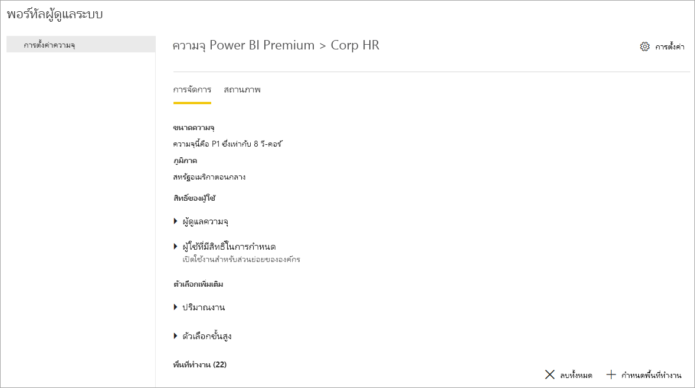
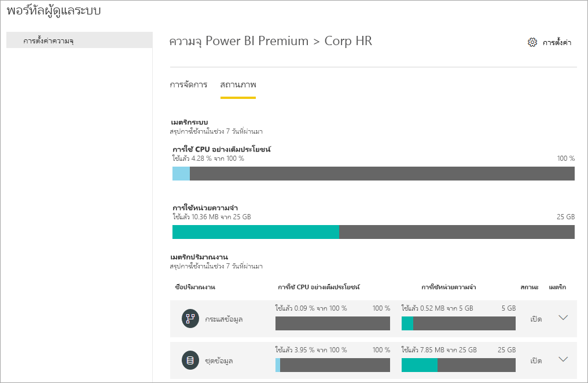
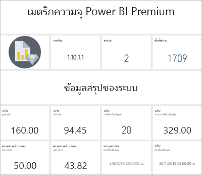
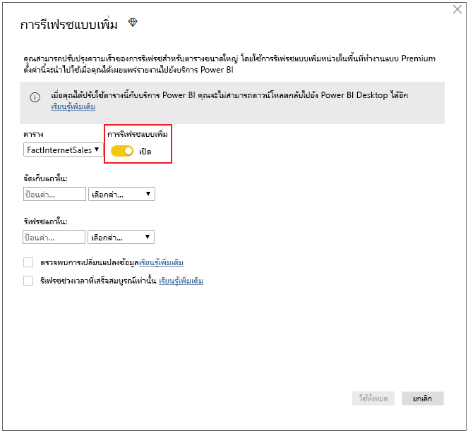
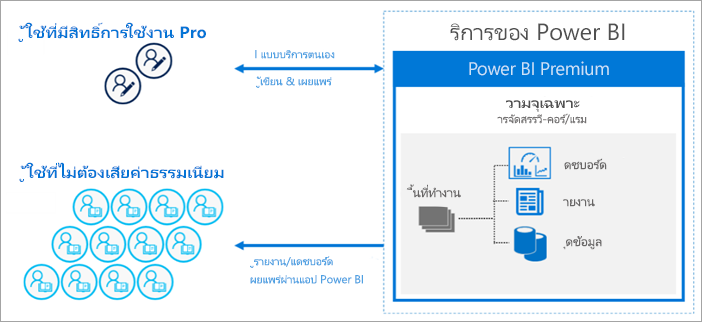
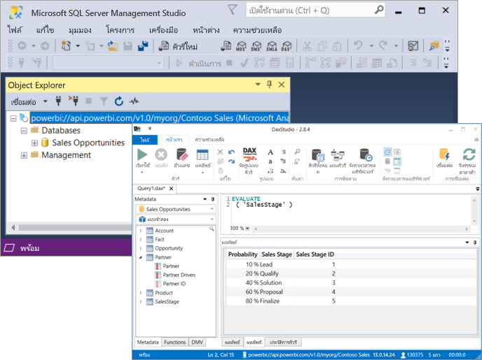

# Power BI Premium คืออะไร?

Power BI Premium มีทรัพยากรเฉพาะและผ่านการปรับปรุงเพื่อเรียกใช้บริการ Power BI สำหรับองค์กรของคุณ ตัวอย่างเช่น:

> [!div class="checklist"]
> * ขนาดและประสิทธิภาพการทำงานที่ดีขึ้น
> * ความยืดหยุ่นในสิทธิการใช้งานตามความจุ
> * รวมการบริการตนเองเข้ากับ BI ขององค์กร
> * ขยาย BI ในองค์กรด้วยเซิร์ฟเวอร์รายงาน Power BI
> * การสนับสนุนสำหรับการเก็บข้อมูลตามภูมิภาค (Multi-Geo่)
> * แชร์ข้อมูลกับผู้อื่นโดยไม่ต้องซื้อสิทธิการใช้งานต่อจำนวนผู้ใช้

บทความนี้แนะนำคุณสมบัติที่สำคัญใน Power BI Premium กรณีจำเป็น ให้ลิงก์ไปยังบทความเพิ่มเติมที่มีรายละเอียดมากกว่า

## การสมัครใช้งานและสิทธิการใช้งาน

Power BI Premium คือการสมัครใช้งาน Office 365 ระดับผู้เช่าที่มีอยู่ในสองกลุ่ม SKU (Stock-Keeping Unit) ได้แก่:

- **EM** SKU (EM1-EM3) สำหรับการฝัง ซึ่งมีสัญญาผูกมัดรายปี และมีการเรียกเก็บเงินรายเดือน SKU ของ EM1 และ EM2 สามารถใช้ได้ผ่านแผนการให้สิทธิการใช้งานจำนวนมากเท่านั้น คุณไม่สามารถซื้อได้โดยตรง
- **P** SKU (P1-P3) สำหรับการฝังและคุณลักษณะสำหรับองค์กร ซึ่งมีสัญญาผูกมัดแบบรายเดือนหรือรายปี มีการเรียกเก็บเงินรายเดือน และมีสิทธิการใช้งานการติดตั้งเซิร์ฟเวอร์รายงาน Power BI ภายในองค์กร

วิธีอื่นคือการซื้อการสมัครใช้งานของ**Azure Power BI Embedded** ซึ่งมี **A**  SKU (A1 A6) กลุ่มเดียวสำหรับการฝังตัวและการทดสอบความจุเท่านั้น SKU ทั้งหมดจะส่งต่อวี-คอร์เพื่อสร้างความจุ แต่ EM SKU จะถูกจำกัดไว้สำหรับการฝังมาตราส่วนขนาดเล็ก SKU ของ EM1, EM2, A1 และ A2 ที่มีน้อยกว่าสี่วี-คอร์ไม่ได้ทำงานบนโครงสร้างพื้นฐานเฉพาะ

ในขณะที่บทความนี้เน้นไปที่ P SKU แต่สิ่งที่กล่าวถึงส่วนใหญ่นั้นเกี่ยวข้องกับ A SKU ด้วยเช่นกัน Azure SKU ไม่มีสัญญาผูกมัดด้านเวลาและมีการเรียกเก็บเงินเป็นรายชั่วโมง ซึ่งตรงกันข้ามกับ SKUs ของการสมัครใช้งานระดับ Premium ซึ่งมีความยืดหยุ่นเต็มที่โดยช่วยให้สามารถขยายขนาด ลดขนาด หยุดชั่วคราว ดำเนินต่อ และลบได้ 

Azure Power BI Embedded ส่วนใหญ่อยู่นอกขอบเขตสำหรับบทความนี้ แต่มีการกล่าวถึงในหัวข้อ [วิธีการทดสอบ](service-premium-capacity-optimize.md#testing-approaches) ของบทความการเพิ่มประสิทธิภาพความจุแบบพรีเมียม ซึ่งเป็นตัวเลือกที่ใช้ได้จริงและประหยัดในการทดสอบและวัดปริมาณงาน เมื่อต้องการเรียนรู้เพิ่มเติมเกี่ยวกับ Azure SKU โปรดดู [เอกสารคู่มือของ Azure Power BI Embedded](https://azure.microsoft.com/services/power-bi-embedded/)

### การซื้อ

ผู้ดูแลระบบในศูนย์การจัดการ Microsoft 365 จะซื้อการสมัครใช้งาน Power BI Premium เฉพาะผู้ดูแลระบบส่วนกลางของ Office 365 หรือผู้ดูแลระบบการเรียกเก็บเงินเท่านั้นที่สามารถซื้อ SKU ได้ เมื่อซื้อแล้ว ผู้เช่าจะได้รับหมายเลขที่สอดคล้องกันของวี-คอร์เพื่อกำหนดความจุ ซึ่งเรียกว่า*การจัดทำแหล่งรวมวี-คอร์* ตัวอย่างเช่น การซื้อ P3 SKU มีผู้เช่าที่มี 32 วี-คอร์ หากต้องการเรียนรู้เพิ่มเติม ดู[วิธีการซื้อ Power BI Premium](service-admin-premium-purchase.md)

## ความจุเฉพาะ

ด้วย Power BI Premium คุณจะได้รับ*ความจุเฉพาะ* ความจุเฉพาะสำหรับใช้งานที่เฉพาะเจาะจงในองค์กร ซึ่งตรงกันข้ามกับความจุที่ใช้ร่วมกันที่ปริมาณงานจะเรียกใช้งานบนทรัพยากรการคำนวณที่ใช้ร่วมกับลูกค้ารายอื่น ซึ่งจะแยกจากกันกับทรัพยากรการคำนวณแบบเฉพาะที่มีประสิทธิภาพที่เชื่อถือได้ และสอดคล้องกันสำหรับเนื้อหาที่เป็นโฮสต์ 

พื้นที่ทำงานอยู่ภายในความจุ ผู้ใช้ Power BI แต่ละคนมีพื้นที่ทำงานส่วนบุคคลเรียกว่า**พื้นที่ทำงานของฉัน** พื้นที่ทำงานเพิ่มเติมหรือที่เรียกว่า**พื้นที่ทำงาน**สามารถสร้างขึ้นเพื่อช่วยในการทำงานร่วมกัน ตามค่าเริ่มต้นพื้นที่ทำงาน รวมถึงพื้นที่ทำงานส่วนบุคคลจะถูกสร้างขึ้นในความจุที่ใช้ร่วมกัน เมื่อคุณมีความจุแบบพรีเมียม สามารถกำหนดทั้งพื้นที่ทำงานของฉันและพื้นที่ทำงานไว้ในความจุแบบพรีเมียม

### โหนดความจุ

ตามที่อธิบายไว้ในหัวข้อ [การสมัครใช้งานและสิทธิการใช้งาน](#subscriptions-and-licensing) Power BI Premium SKU มีสองกลุ่มได้แก่: **EM**และ**P** Power BI Premium SKU ทั้งหมดสามารถใช้เป็น *โหนด*ความจุที่แต่ละ SKU แสดงถึงจำนวนชุดทรัพยากรที่ประกอบด้วยตัวประมวลผล หน่วยความจำ และที่เก็บข้อมูล นอกเหนือจากทรัพยากร SKU แต่ละรายการมีขีดจำกัดในการใช้งานเกี่ยวกับจำนวน DirectQuery และ Live Connection ต่อวินาที และจำนวนการรีเฟรชของแบบจำลองแบบขนาน

ตัวประมวลผลจะทำตามจำนวนชุดของวี-คอร์ ซึ่งแบ่งออกเท่า ๆ กันระหว่าง Frontend และ Backend

**วี-คอร์ Backend** รับผิดชอบสำหรับฟังก์ชันการทำงานของ Power BI รวมถึงการประมวลผลคิวรี การจัดการแคช การเรียกใช้การบริการ R การรีเฟรชแบบจำลอง การประมวลผลภาษาธรรมชาติ (ถามตอบ) และการแสดงผลฝั่งเซิร์ฟเวอร์ในรูปแบบรายงานและรูป วี-คอร์ Backend จะกำหนดจำนวนหน่วยความจำแบบคงที่ที่นำมาใช้ในการโฮสต์แบบจำลองเป็นหลัก ซึ่งจะเรียกว่าชุดข้อมูลที่ใช้งานอยู่

**วี-คอร์ Frontend** รับผิดชอบบริการเว็บ แดชบอร์ด และการจัดการเอกสารรายงาน การจัดการสิทธิการเข้าถึง การจัดกำหนดการ API การอัปโหลดและการดาวน์โหลด และโดยทั่วไปนั้นเพื่อทุกอย่างที่เกี่ยวกับประสบการณ์การใช้งานของผู้ใช้

ตั้งค่าที่เก็บข้อมูลเป็น **100 TB ต่อโหนดความจุ**

ทรัพยากรและข้อจำกัดของ SKU พรีเมียมแต่ละรายการ (และขนาดที่เทียบเท่า A SKU) มีการอธิบายไว้ในตารางต่อไปนี้

| โหนดความจุ | วี-คอร์รวม | Backend v-cores | RAM (GB) | Frontend v-cores | DirectQuery/Live Connection (ต่อวินาที) | การรีเฟรชแบบจำลองแบบคู่ขนาน |
| --- | --- | --- | --- | --- | --- | --- |
| EM1/A1 | 1 | 0.5 | 3 | 0.5 | 3.75 | 1 |
| EM2/A2 | 2 | 1 | 5 | 1 | 7.5 | 2 |
| EM3/A3 | 4 | 2 | 10 | 2 | 15 | 3 |
| P1/A4 | 8 | 4 | 25 | 4 | 30 | 6 |
| P2/A5 | 16 | 8 | 50 | 8 | 60 | 12 |
| P3/A6 | 32 | 16 | 100 | 16 | 120 | 24 |
| | | | | | | |

### ปริมาณงานสำหรับความจุ

ปริมาณงานสำหรับความจุเป็นบริการที่กำหนดไว้สำหรับผู้ใช้ โดยค่าเริ่มต้นแล้ว ความจุแบบพรีเมียมและ Azure จะรองรับเฉพาะปริมาณงานของชุดข้อมูลที่เชื่อมโยงกับการเรียกใช้คิวรี Power BI ไม่สามารถปิดใช้งานปริมาณงานของชุดข้อมูลได้ สามารถปิดใช้งานปริมาณงานเพิ่มเติมสำหรับ[AI (Cognitive Services)](https://powerbi.microsoft.com/blog/easy-access-to-ai-in-power-bi-preview/) [กระแสข้อมูล](service-dataflows-overview.md#dataflow-capabilities-on-power-bi-premium) และ[รายงานที่มีการแบ่งหน้า](paginated-reports-save-to-power-bi-service.md)ได้ ปริมาณงานเหล่านี้ได้รับการสนับสนุนในการสมัครใช้งานแบบพรีเมียมเท่านั้น 

ปริมาณงานเพิ่มเติมแต่ละรายการสามารถกำหนดค่าหน่วยความจำสูงสุด (เป็นเปอร์เซ็นต์ของผลรวมหน่วยความจำที่พร้อมใช้งาน) ที่สามารถใช้ได้ตามปริมาณงาน ค่าเริ่มต้นสำหรับหน่วยความจำสูงสุดจะถูกกำหนดโดย SKU คุณสามารถเพิ่มทรัพยากรที่มีอยู่ของความจุได้สูงสุดโดยการเปิดใช้งานเฉพาะปริมาณงานเพิ่มเติมเหล่านั้นเมื่อใช้งาน และคุณสามารถเปลี่ยนการตั้งค่าหน่วยความจำเมื่อคุณเห็นว่าการตั้งค่าเริ่มต้นไม่ตอบสนองต่อความต้องการของทรัพยากรความจุ คุณสามารถเปิดใช้งานและกำหนดค่าปริมาณงานสำหรับผู้ดูแลระบบความจุโดยใช้**การตั้งค่าความจุ** ใน[พอร์ทัลผู้ดูแลระบบ](service-admin-portal.md) หรือ โดยใช้ [REST API ของความจุ ](https://docs.microsoft.com/rest/api/power-bi/capacities)ได้  

เมื่อต้องการเรียนรู้เพิ่มเติม โปรดดู[กำหนดค่าปริมาณงานในความจุแบบพรีเมียม](service-admin-premium-workloads.md) 

### วิธีการทำงานของความจุ

บริการของ Power BI จะทำให้การใช้งานทรัพยากรความจุมีประสิทธิภาพสูงสุดโดยที่ไม่เกินขีดจำกัดที่กำหนดไว้สำหรับความจุ

การทำงานของความจุจะถูกจัดประเภทเป็นการทำงาน *แบบโต้ตอบ* หรือ *การทำงานแบบเบื้องหลัง* การทำงานแบบโต้ตอบประกอบด้วยการแสดงคำขอ และการตอบสนองโต้ตอบกับผู้ใช้ (การกรอง การคิวรีถามตอบ และอื่น ๆ) โดยทั่วไปแล้ว การคิวรีแบบจำลองการนำเข้าจะใช้ทรัพยากรหน่วยความจำมากในขณะที่การคิวรีแบบจำลอง DirectQuery และ Live Connection จะใช้ CPU สูง การทำงานแบบเบื้องหลังประกอบด้วยกระแสข้อมูลและการรีเฟรชแบบจำลองการนำเข้า และการแคชคิวรีของแดชบอร์ด

คุณจะต้องเข้าใจว่าการทำงานแบบโต้ตอบจะมีความสำคัญมากกว่าการทำงานแบบเบื้องหลัง เพื่อให้แน่ใจว่าผู้ใช้จะได้รับประสบการณ์การใช้งานที่ดีที่สุด ถ้ามีทรัพยากรไม่เพียงพอ การทำงานแบบเบื้องหลังจะถูกเพิ่มไปยังคิวสำหรับการประมวลผลเมื่อเพิ่มแหล่งข้อมูล การทำงานแบบเบื้องหลังเช่น การรีเฟรชชุดข้อมูล สามารถหยุดกลางกระบวนการได้โดยบริการของ Power BI และเพิ่มลงในคิว

ต้องโหลดแบบจำลองการนำเข้าทั้งหมดลงในหน่วยความจำเพื่อที่จะสามารถคิวรีหรือรีเฟรชได้ บริการของ Power BI จะจัดการการใช้งานหน่วยความจำโดยใช้อัลกอริทึมที่ซับซ้อน เพื่อให้แน่ใจว่าจะสามารถใช้งานหน่วยความจำที่มีอยู่ให้ได้มากที่สุด และอาจทำให้เกินขีดจำกัดความจุ: ในขณะที่อาจเป็นไปได้สำหรับความจุในการจัดเก็บข้อมูลแบบจำลองการนำเข้าหลายแบบ (สูงสุด 100 TB ต่อความจุแบบพรีเมียม) เมื่อที่เก็บข้อมูลของดิสก์รวมเกินหน่วยความจำที่สนับสนุน (และหน่วยความจำเพิ่มเติมจำเป็นสำหรับการคิวรีและรีเฟรช) จากนั้นจะไม่สามารถโหลดแบบจำลองทั้งหมดลงในหน่วยความจำพร้อมกันได้

ดังนั้นแบบจำลองการนำเข้าจะถูกโหลดลงและลบออกจากหน่วยความจำตามการใช้งาน แบบจำลองการนำเข้าจะถูกโหลดลงเมื่อมีการคิวรีแล้ว (การทำงานแบบโต้ตอบ) และยังไม่ได้โหลดลงในหน่วยความจำ หรือเมื่อต้องทำการรีเฟรช (การทำงานแบบเบื้องหลัง)

การลบแบบจำลองจากหน่วยความจำจะเรียกว่า *การลดสัดส่วน* ซึ่งการทำงานของ Power BI สามารถดำเนินการได้อย่างรวดเร็วโดยขึ้นอยู่กับขนาดของแบบจำลองได้ หากความจุนั้นไม่พบความต้องการใช้งานหน่วยความจำใด ๆ แบบจำลองถูกโหลดลงในหน่วยความจำและยังคงอยู่ที่นั่น อย่างไรก็ตาม เมื่อมีหน่วยความจำไม่เพียงพอในการโหลดแบบจำลอง บริการของ Power BI จะต้องเพิ่มหน่วยความจำก่อน ซึ่งจะเพิ่มหน่วยความจำโดยการตรวจสอบแบบจำลองที่ไม่ได้ใช้งาน โดยการค้นหาแบบจำลองซึ่งยังไม่ได้ใช้งานในสามนาทีที่ผ่านมา \[[1](#endnote-1)\]และจากนั้นลดสัดส่วนแบบจำลองเหล่านั้น ถ้าไม่มีแบบจำลองที่ไม่ได้ใช้งานที่จะลดสัดส่วน บริการของ Power BI จะค้นหาเพื่อลดสัดส่วนแบบจำลองที่โหลดสำหรับการทำงานแบบเบื้องหลัง วิธีสุดท้ายหลังจาก 30 วินาทีของความพยายามที่ล้มเหลว \[[1](#endnote-1)\] คือการทำให้การทำงานแบบโต้ตอบไม่เป็นผล ในกรณีนี้ ผู้ใช้รายงานจะได้รับแจ้งเกี่ยวกับความล้มเหลว พร้อมด้วยคำแนะนำให้ลองอีกครั้งในอีกสักครู่ ในบางกรณี แบบจำลองอาจถูกยกเลิกการโหลดจากหน่วยความจำเนื่องจากการดำเนินการให้บริการ

สิ่งสำคัญคือต้องเน้นว่าการลดสัดส่วนชุดข้อมูลนั้นเป็นลักษณะการทำงานตามปกติและคาดว่าจะเกิดขึ้น ซึ่งเป็นความพยายามที่จะเพิ่มการใช้งานหน่วยความจำให้สูงสุดโดยการโหลดและการยกเลิกการโหลดแบบจำลองที่มีขนาดรวมกันเกินกว่าหน่วยความจำที่มีอยู่ โดยเป็นไปตามการออกแบบและเปิดเผยอย่างตรงไปตรงมาต่อผู้ใช้รายงาน อัตราการลดสัดส่วนข้อมูลสูงไม่ได้หมายความว่าความจุมีปริมาณไม่เพียงพอ อย่างไรก็ตามอาจกลายเป็นข้อจำกัดได้หากการตอบสนองของการคิวรีและการรีเฟรชจะได้รับผลกระทบเนื่องจากอัตราการลดสัดส่วนข้อมูลสูง

การรีเฟรชของแบบจำลองการนำเข้าจะต้องใช้หน่วยความจำมากเนื่องจากต้องโหลดแบบจำลองลงในหน่วยความจำ ต้องใช้หน่วยความจำเพิ่มเติมสำหรับการประมวลผล การรีเฟรชเต็มรูปแบบอาจใช้จำนวนหน่วยความจำเป็นสองเท่าโดยประมาณตามที่แบบจำลองกำหนด ซึ่งต้องให้แน่ใจว่าแบบจำลองสามารถคิวรีได้แม้ในขณะที่กำลังประมวลผล เพราะคิวรีจะถูกส่งไปยังแบบจำลองที่มีอยู่จนกว่าการรีเฟรชจะเสร็จสมบูรณ์ และข้อมูลแบบจำลองใหม่พร้อมใช้งาน การรีเฟรชแบบเพิ่มทีละส่วนจะต้องการหน่วยความจำน้อยกว่า และอาจทำให้เสร็จสมบูรณ์ได้อย่างรวดเร็ว และจึงสามารถลดแรงกดดันบนแหล่งทรัพยากรความจุ นอกจากนี้ การรีเฟรชยังอาจใช้ CPU สูงสำหรับแบบจำลอง โดยเฉพาะการรีเฟรชที่มีการเปลี่ยนแปลงของ Power Query ซับซ้อน หรือตาราง/คอลัมน์จากการคำนวณที่ซับซ้อนหรือยึดตามตารางขนาดใหญ่ได้

การรีเฟรชเช่น คิวรี จำเป็นต้องโหลดแบบจำลองลงในหน่วยความจำ ถ้ามีหน่วยความจำไม่เพียงพอ บริการของ Power BI จะพยายามทำการลดสัดส่วนแบบจำลองที่ไม่ได้ใช้งาน และถ้าไม่เป็นไปได้ (แบบจำลองทั้งหมดมีการใช้งานอยู่) งานการรีเฟรชถูกจัดคิวไว้ การรีเฟรชโดยทั่วไปใช้งาน CPU สูง มากยิ่งกว่าการคิวรี ด้วยเหตุนี้จึงมีข้อจำกัดด้านความจุของจำนวนการรีเฟรชพร้อมกัน ซึ่งตั้งค่าเป็น 1.5 x จำนวนวี-คอร์ Backend โดยการปัดเศษขึ้น ถ้ามีการรีเฟรชพร้อมกันมากเกินไป การรีเฟรชตามกำหนดเวลาจะถูกจัดคิวไว้ เมื่อสถานการณ์เหล่านี้เกิดขึ้น การรีเฟรชจะใช้เวลานานจึงจะเสร็จสมบูรณ์ การรีเฟรชตามความต้องการเช่น การรีเฟรชที่ทริกเกอร์โดยคำขอของผู้ใช้ หรือการเรียกใช้ API จะลองซ้ำสามครั้ง \[[1](#endnote-1)\] หากยังมีทรัพยากรไม่เพียงพอ การรีเฟรชจะล้มเหลว

บันทึกย่อของหัวข้อ:   
\[1\] อาจเปลี่ยนแปลง

### การสนับสนุนระดับภูมิภาค

เมื่อสร้างความจุใหม่ ผู้ดูแลระบบส่วนกลางของ Office 365 และผู้ดูแลระบบบริการของ Power BI สามารถระบุภูมิภาคที่มีพื้นที่ทำงานที่กำหนดไว้ในความจุ ซึ่งเรียกว่า **Multi-Geo** ด้วย Multi-Geo องค์กรสามารถดำเนินการตามข้อกำหนดการเก็บข้อมูลโดยการปรับใช้เนื้อหาในศูนย์ข้อมูลในภูมิภาคที่เฉพาะเจาะจงแม้ว่าจะแตกต่างจากภูมิภาคที่มีการสมัครใช้งาน Office 365 อยู่ เมื่อต้องการเรียนรู้เพิ่มเติม ดูที่ [การสนับสนุนแบบ Multi-Geo สำหรับ Power BI Premium](service-admin-premium-multi-geo.md)

### การจัดการความจุ

การจัดการความจุแบบพรีเมียมเกี่ยวข้องกับการสร้างหรือการลบความจุ การกำหนดผู้ดูแลระบบ การกำหนดพื้นที่ทำงาน การกำหนดปริมาณงาน การตรวจสอบและการปรับเปลี่ยนเพื่อปรับปรุงประสิทธิภาพการทำงานของความจุให้เหมาะสม 

ผู้ดูแลระบบส่วนกลางของ Office 365 หรือผู้ดูแลระบบบริการของ Power BI สามารถสร้างความจุแบบพรีเมียมจากวี-คอร์ที่พร้อมใช้งาน หรือปรับเปลี่ยนความจุแบบพรีเมียมที่มีอยู่ เมื่อสร้างความจุแล้ว ต้องระบุขนาดความจุและภูมิภาคทางภูมิศาสตร์ และกำหนดผู้ดูแลระบบความจุอย่างน้อยหนึ่งคน 

เมื่อสร้างความจุแล้ว ต้องกรอกข้อมูลงานการดูแลระบบที่สำคัญใน [พอร์ทัลผู้ดูแลระบบ](service-admin-portal.md) ให้สมบูรณ์

ผู้ดูแลระบบความจุสามารถกำหนดพื้นที่ทำงานในความจุ จัดการสิทธิของผู้ใช้ และกำหนดผู้ดูแลระบบอื่น ๆ นอกจากนี้ ผู้ดูแลระบบความจุยังสามารถกำหนดปริมาณงาน ปรับการปันหน่วยความจำ และถ้าจำเป็น รีสตาร์ทความจุ รีเซ็ตการทำงานที่เกินขีดจำกัดของความจุ

ผู้ดูแลระบบความจุยังสามารถตรวจสอบให้แน่ใจว่าการทำงานของความจุเป็นไปอย่างราบรื่น โดยพวกเขาสามารถตรวจสอบสถานะความจุที่ถูกต้องได้ในพอร์ทัลผู้ดูแลระบบหรือด้วยแอปเมตริกความจุแบบพรีเมียม

เมื่อต้องการเรียนรู้เพิ่มเติมเกี่ยวกับการสร้างความจุ การกำหนดผู้ดูแลระบบ และการกำหนดพื้นที่ทำงาน ดูที่[การจัดการความจุแบบพรีเมียม](service-premium-capacity-manage.md) เมื่อต้องการเรียนรู้เพิ่มเติมเกี่ยวกับบทบาท ดูที่[บทบาทผู้ดูแลระบบที่เกี่ยวข้องกับ Power BI](service-admin-administering-power-bi-in-your-organization.md#administrator-roles-related-to-power-bi)

### การตรวจสอบ

การตรวจสอบความจุแบบพรีเมียมช่วยให้ผู้ดูแลระบบเข้าใจถึงวิธีการทำงานของความจุ สามารถตรวจสอบความจุได้ในพอร์ทัลผู้ดูแลระบบหรือด้วยแอป[เมตริกความจุ Power BI Premium ](https://app.powerbi.com/groups/me/getapps/services/capacitymetrics)

การตรวจสอบในพอร์ทัลมีมุมมองด่วนที่มีเมตริกระดับสูง ซึ่งระบุการโหลดที่กำหนดไว้และทรัพยากรที่ความจุของคุณใช้โดยเฉลี่ยในช่วงเจ็ดวันที่ผ่านมา 

แอป**เมตริกความจุ Power BI Premium** มีข้อมูลเชิงลึกมากที่สุดเกี่ยวกับวิธีการใช้งานความจุของคุณ แอปมีแดชบอร์ดระดับสูงและรายงานที่ละเอียดมากขึ้น

จากแดชบอร์ดของแอป คุณสามารถคลิกเซลล์เมตริกเพื่อเปิดรายงานที่มีข้อมูลเชิงลึก รายงานมีเมตริกเชิงลึกและความสามารถในการกรองเพื่อเจาะลึกเกี่ยวกับข้อมูลที่สำคัญที่สุดที่คุณจำเป็นต้องมีเพื่อให้ความจุของคุณทำงานได้อย่างราบรื่น

เมื่อต้องการเรียนรู้เพิ่มเติมเกี่ยวกับการตรวจสอบความจุ ดูที่[การตรวจสอบในพอร์ทัลผู้ดูแลระบบ Power BI](service-admin-premium-monitor-portal.md)และ[การตรวจสอบ ด้วยแอปเมตริกความจุ Power BI Premium ](service-admin-premium-monitor-capacity.md)

### การปรับความจุให้เหมาะสม

การทำให้ความจุของคุณสามารถใช้งานได้ดีที่สุดนั้นมีความสำคัญเพื่อทำให้ผู้ใช้มีความมั่นใจในประสิทธิภาพและคุณจะได้รับความคุ้มค่าสูงสุดสำหรับการลงทุนระดับพรีเมียม ผู้ดูแลระบบสามารถกำหนดวิธีที่ดีที่สุดเพื่อแก้ไขปัญหาคอขวด และดำเนินการที่จำเป็นโดยการตรวจสอบเมตริกหลัก เมื่อต้องการเรียนรู้เพิ่มเติม ดูที่[การปรับความจุแบบพรีเมียมให้เหมาะสม](service-premium-capacity-optimize.md)และ[สถานการณ์จำลองของความจุแบบพรีเมียม](service-premium-capacity-scenarios.md)

### REST API ของความจุ

Power BI REST API รวมคอลเลกชัน [API ของความจุ](https://docs.microsoft.com/rest/api/power-bi/capacities). ด้วย API ผู้ดูแลระบบสามารถจัดการลักษณะต่าง ๆ ของความจุแบบพรีเมียมได้โดยทางโปรแกรม รวมถึงการเปิดใช้งานและปิดใช้งานปริมาณงาน การกำหนดพื้นที่ทำงานในความจุ และอื่น ๆ

## ชุดข้อมูลขนาดใหญ่

Power BI Premium รองรับการอัปโหลดไฟล์แบบจำลอง Power BI Desktop (.pbix) ขนาดสูงสุด **10 GB** ขึ้นอยู่กับ SKU เมื่อโหลดแล้ว แบบจำลองสามารถเผยแพร่ไปยังพื้นที่ทำงานที่กำหนดไว้ในความจุแบบพรีเมียม จากนั้นสามารถรีเฟรชชุดข้อมูลได้ขนาดสูงสุด **12 GB**

### ข้อควรพิจารณาเกี่ยวกับขนาด

แบบจำลองขนาดใหญ่อาจใช้ทรัพยากรมาก คุณควรมีอย่างน้อย P1 SKU สำหรับแบบจำลองที่มีขนาดใหญ่กว่า 1 GB แม้ว่าการเผยแพร่แบบจำลองขนาดใหญ่ไปยังพื้นที่ทำงานที่ได้รับการสนับสนุนจาก A SKU จนถึง A3 อาจทำงาน แต่การรีเฟรชเหล่านั้นจะไม่เกิดขึ้น

ตารางต่อไปนี้อธิบายถึง SKU ที่แนะนำสำหรับขนาด.pbix ต่าง ๆ

   |SKU  |ขนาดของ.pbix   |
   |---------|---------|
   |P1    | < 3 GB        |
   |P2    | < 6 GB        |
   |P3, P4, P5    | สูงสุด 10 GB   |

Power BI Embedded A4 SKU มีค่าเท่ากับ P1 SKU, A5 = P2 และ A6 = P3 การเผยแพร่แบบจำลองขนาดใหญ่ไปยัง A SKU และ EM SKU อาจส่งคืนข้อผิดพลาดที่ไม่ได้ระบุถึงข้อผิดพลาดด้านข้อจำกัดของขนาดแบบจำลองในความจุที่ใช้ร่วมกัน ข้อผิดพลาดในการรีเฟรชของแบบจำลองขนาดใหญ่ใน A SKU และ EM SKU อาจเน้นไปที่ช่วงหมดเวลา 

ไฟล์นามสกุล .pbix แสดงข้อมูลใน*สถานะที่มีการบีบอัดสูง* ข้อมูลจะมีแนวโน้มว่าจะขยายหลาย ๆ ครั้งเมื่อโหลดในหน่วยความจำ และจากที่นั่น อาจจะขยายหลายครั้งในระหว่างการรีเฟรชข้อมูล

การรีเฟรชตามกำหนดเวลาของชุดข้อมูลขนาดใหญ่สามารถใช้เวลานานและใช้ทรัพยากรมาก สิ่งสำคัญคืออย่ากำหนดเวลาการรีเฟรชที่ซ้อนทับกันมากเกินไป เราขอแนะนำให้กำหนดค่า [การรีเฟรชแบบเพิ่มทีละส่วน](service-premium-incremental-refresh.md) เนื่องจากมีความรวดเร็วกว่า น่าเชื่อถือกว่า และใช้ทรัพยากรน้อยลง

การโหลดรายงานเริ่มต้นของชุดข้อมูลขนาดใหญ่อาจใช้เวลานาน ถ้าเลยระยะเวลาหนึ่งแล้วตั้งแต่ครั้งสุดท้ายที่ใช้ชุดข้อมูล แถบโหลดสำหรับรายงานยาวการโหลดแสดงความคืบหน้าของการโหลด

ในขณะที่หน่วยความจำและเวลาสำหรับแต่ละคิวรีสูงกว่าความจุพรีเมียม เราขอแนะนำให้คุณใช้ตัวกรองและตัวแบ่งส่วนข้อมูล เพื่อจำกัดวิชวลให้แสดงเฉพาะสิ่งที่จำเป็น

## การรีเฟรชแบบเพิ่ม

การรีเฟรชแบบเพิ่มทีละส่วนมีส่วนสำคัญของการสร้างและการรักษาชุดข้อมูลขนาดใหญ่ใน Power BI Premium การรีเฟรชแบบเพิ่มทีละส่วนมีประโยชน์มากมาย ตัวอย่างเช่น การรีเฟรชจะเร็วขึ้นเนื่องจากจะรีเฟรชเฉพาะข้อมูลที่มีการเปลี่ยนแปลงเท่านั้น การรีเฟรชน่าเชื่อถือมากขึ้นเพราะไม่จำเป็นต้องรักษาการเชื่อมต่อระยะยาวกับแหล่งข้อมูลที่ผันผวน ปริมาณการใช้ทรัพยากรลดลงเพราะต้องรีเฟรชข้อมูลน้อยลง ทำให้ปริมาณการใช้โดยรวมของความจำและทรัพยากรอื่นๆ ลดลงด้วย นโยบายการรีเฟรชแบบเพิ่มทีละส่วนถูกกำหนดไว้ใน **Power BI Desktop** และนำไปใช้เมื่อเผยแพร่ไปยังพื้นที่ทำงานในความจุแบบพรีเมียม 

เมื่อต้องการเรียนรู้เพิ่มเติม ดูที่[การรีเฟรชแบบเพิ่มทีละส่วนใน Power BI Premium](service-premium-incremental-refresh.md)

## รายงานที่มีการแบ่งหน้า

รายงานที่มีการแบ่งหน้าที่ได้รับการสนับสนุนบน P1-P3 and A4_A6 SKU จะใช้เทคโนโลยี Report Definition Language (RDL) ใน SQL Server Reporting Services ในขณะที่ใช้เทคโนโลยี RDL มันจะไม่เหมือนกับเซิร์ฟเวอร์รายงาน Power BI ซึ่งเป็นแพลตฟอร์มการรายงานที่สามารถดาวน์โหลดได้ที่คุณสามารถติดตั้งภายในองค์กร ยังมาพร้อมกับ Power BI Premium รายงานที่มีการแบ่งหน้าถูกจัดรูปแบบให้พอดีกับหน้าที่สามารถพิมพ์หรือใช้ร่วมกัน ข้อมูลจะแสดงในตารางแม้ว่าตารางนั้นต้องใช้พื้นที่หลายหน้า ผู้ใช้สามารถสร้างรายงานที่มีการแบ่งหน้าและเผยแพร่ไปยังบริการโดยใช้แอปพลิเคชัน Windows Desktop ของ [**Power BI Report Builder**](https://go.microsoft.com/fwlink/?linkid=2086513) ฟรี

ใน Power BI Premium รายงานที่มีการแบ่งหน้าเป็นปริมาณงานที่ต้องเปิดใช้งานสำหรับความจุโดยใช้พอร์ทัลผู้ดูแลระบบ ผู้ดูแลระบบความจุสามารถเปิดใช้งานและระบุจำนวนหน่วยความจำเป็นเปอร์เซ็นต์ทรัพยากรหน่วยความจำโดยรวมของความจุ Power BI Premium จะเรียกใช้รายงานที่มีการแบ่งหน้าในช่องว่างที่มีอยู่ภายในความจุ ซึ่งไม่เหมือนกับปริมาณประเภทอื่น หน่วยความจำสูงสุดที่ระบุไว้ในช่องว่างนี้จะถูกนำมาใช้ ไม่ว่าจะใช้ปริมาณงานอยู่หรือไม่ ค่าเริ่มต้นคือ 20% 

เมื่อต้องการเรียนรู้เพิ่มเติม ดูที่[รายงานที่มีการแบ่งหน้าใน Power BI Premium](paginated-reports-report-builder-power-bi.md) เมื่อต้องการเรียนรู้เพิ่มเติมเกี่ยวกับการเปิดใช้งานปริมาณงานของรายงานที่มีการแบ่งหน้า ดูที่[กำหนดค่าปริมาณงาน](service-admin-premium-workloads.md)

## เซิร์ฟเวอร์รายงาน Power BI
 
เมื่อรวมกับ Power BI Premium เซิร์ฟเวอร์รายงาน Power BI จะเป็นเซิร์ฟเวอร์รายงาน*ภายในองค์กร*ที่มีพอร์ทัลของเว็บ คุณสามารถสร้างสภาพแวดล้อม BI ภายในองค์กรและแจกจ่ายรายงานที่แฝงไฟร์วอลล์ขององค์กร เซิร์ฟเวอร์รายงานช่วยให้ผู้ใช้สามารถเข้าถึงความสามารถในการรายงานที่สมบูรณ์แบบ โต้ตอบได้ และใช้งานสำหรับองค์กรของ SQL Server Reporting Services ผู้ใช้สามารถสำรวจข้อมูลภาพ และค้นหารูปแบบเพื่อการตัดสินใจที่ดีขึ้นและรวดเร็วขึ้น เซิร์ฟเวอร์รายงานมีการกำกับดูแลตามข้อกำหนดของคุณเอง ถ้าและเมื่อเวลานั้นมาถึงเซิร์ฟเวอร์รายงาน Power BI ช่วยให้สามารถโยกย้ายไปยังคลาวด์ได้อย่างง่ายดายซึ่งองค์กรของคุณสามารถใช้ประโยชน์จากฟังก์ชันการทำงาน Power BI Premium ทั้งหมดได้อย่างเต็มที่

หากต้องการเรียนรู้เพิ่มเติม โปรดดู [เซิร์ฟเวอร์รายงาน Power BI](report-server/get-started.md)

## การแชร์เนื้อหาที่ไม่จำกัด

ด้วยความเป็นพรีเมียม ทุกคนไม่ว่าพวกเขาจะอยู่ภายในหรือภายนอกองค์กรของคุณสามารถดูเนื้อหา Power BI ของคุณ รวมถึงรายงานที่มีการแบ่งหน้าและรายงานแบบอินเทอร์แอคทีฟได้โดยไม่ต้องซื้อสิทธิการใช้งานเฉพาะ 

ความเป็นพรีเมียมช่วยให้ผู้ใช้แบบ Pro สามารถกระจายเนื้อหาได้อย่างกว้างขวางโดยผู้รับไม่ต้องมีใบอนุญาต Pro ในการดูเนื้อหา ผู้สร้างเนื้อหาต้องมีสิทธิการใช้งานแบบ Pro ผู้สร้างจะเชื่อมต่อกับแหล่งข้อมูล ข้อมูลแบบจำลอง และสร้างรายงานและแดชบอร์ดที่รวมเป็นแอปพื้นที่ทำงาน 

เมื่อต้องการเรียนรู้เพิ่มเติม ดู[สิทธิการใช้งาน Power BI](service-admin-licensing-organization.md)

## การเชื่อมต่อเครื่องมือ (ตัวอย่าง)

ภายใต้การปรับปรุงอะไรหลายอย่าง โปรแกรม Microsoft **Analysis Services Vertipaq** ที่องค์กรให้การรับรองจะเป็นกำลังเสริมให้กับชุดข้อมูล Power BI บริการการวิเคราะห์มีความสามารถในการเขียนโปรแกรมและแอปพลิเคชันไคลเอ็นต์และการสนับสนุนเครื่องมือผ่านไลบรารีไคลเอ็นต์และ API ที่สนับสนุนโปรโตคอล XMLA แบบมาตรฐานเปิด ปัจจุบัน ชุดข้อมูล Power BI Premium รองรับการทำงาน*แบบอ่านอย่างเดียว* จาก Microsoft และแอปพลิเคชันไคลเอ็นต์ของบุคคลที่สาม และเครื่องมือผ่าน**ตำแหน่งข้อมูลของ XMLA** 

เครื่องมือ Microsoft เช่น SQL Server Management Studio และตัวสร้างโปรไฟล์ของ SQL Server และแอปของบุคคลที่สามเช่น DAX Studio และแอปพลิเคชันการจัดรูปแบบการแสดงข้อมูล สามารถเชื่อมต่อกับ และคิวรีชุดข้อมูลแบบพรีเมียมโดยใช้เหตุการณ์ของ XMLA, DAX, MDX, DMV และ Trace 

เมื่อต้องการเรียนรู้เพิ่มเติม ดูที่[เชื่อมต่อกับชุดข้อมูลที่มีแอปพลิเคชันไคลเอ็นต์และเครื่องมือ](service-premium-connect-tools.md)

## ขั้นตอนถัดไป

> [!div class="nextstepaction"]
> [การจัดการความจุแบบพรีเมียม](service-premium-capacity-manage.md)

มีคำถามเพิ่มเติมหรือไม่? [ลองถามชุมชน Power BI](https://community.powerbi.com/)

||||||
