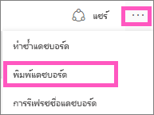
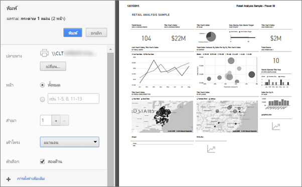
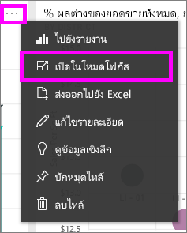
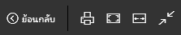
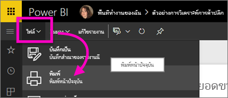

# พิมพ์จาก Power BI service
พิมพ์แดชบอร์ดทั้ง แดชบอร์ดไทล์ หน้ารายงาน หรือรูปรายงานจาก Power BI service รายงานสามารถพิมพ์ออกมาหนึ่งหน้าในแต่ละครั้งเท่านั้น คุณไม่สามารถพิมพ์รายงานทั้งหมดในครั้งเดียว

> [!NOTE]
> Power BI service พิมพ์ได้และ Power BI Desktop พิมพ์ไม่ได้
> 
> 

ดู Amanda พิมพ์แดชบอร์ดและรายงานของเธอ แล้ว ทำตามคำแนะนำทีละขั้นตอนด้านล่างวิดีโอเพื่อลองทำด้วยตนเอง

<iframe width="560" height="315" src="https://www.youtube.com/embed/jtlLGRKBvXY" frameborder="0" allowfullscreen></iframe>

## พิมพ์แดชบอร์ด
1. เปิดแดชบอร์ดที่คุณต้องการพิมพ์
2. ที่มุมบนขวา เลือกจุดไข่ปลา (...) แล้วเลือก**พิมพ์แดชบอร์ด**
   
    
3. หน้าต่างการพิมพ์สำหรับเบราว์เซอร์ของคุณเปิดขึ้น เลือกตั้งค่าและปลายทางของการพิมพ์ และเลือก**พิมพ์**
   
   > [!NOTE]
   > คุณเห็นกล่องโต้ตอบเกี่ยวกับการพิมพ์ ซึ่งจะขึ้นอยู่กับเบราว์เซอร์ที่คุณกำลังใช้
   > 
   
    

## พิมพ์แดชบอร์ดไทล์
1. [เปิดไทล์ในโหมดโฟกัส](service-focus-mode.md)โดยการเลือกจุดไข่ปลา แล้วเลือกไอคอนโฟกัส
   
    
2. เปิดไทล์ใน[โหมดเต็มหน้าจอ](service-fullscreen-mode.md)โดยการเลือกไอคอนเต็มหน้าจอจากแถบนำทางด้านบน
3. ลากเคอร์เซอร์เหนือไทล์เพื่อเปิดเมนูตัวเลือก
   
    
4. เลือกไอคอนพิมพ์     
   
   > [!NOTE]
   > คุณเห็นกล่องโต้ตอบเกี่ยวกับการพิมพ์ ซึ่งจะขึ้นอยู่กับเบราว์เซอร์ที่คุณกำลังใช้
   > 
   > 

## พิมพ์หน้ารายงาน
รายงานสามารถพิมพ์ออกมาหนึ่งหน้าในแต่ละครั้ง

1. เปิดรายงาน ในมุมมองการอ่าน หรือมุมมองการแก้ไข
2. เลือก**แฟ้ม** > **พิมพ์**เมื่อต้องพิมพ์หน้ารายงานปัจจุบัน
   
    
3. หน้าต่างการพิมพ์สำหรับเบราว์เซอร์ของคุณเปิดขึ้น
   
   > [!NOTE]
   > คุณเห็นกล่องโต้ตอบเกี่ยวกับการพิมพ์ ซึ่งจะขึ้นอยู่กับเบราว์เซอร์ที่คุณกำลังใช้
   > 
   > 

## พิมพ์รูปแบบรายงาน
1. [เปิดภาพในโหมดโฟกัส](service-focus-mode.md)โดยลากเคอร์เซอร์เหนือไทล์ แล้วเลือกไอคอนโฟกัสจากมุมบนขวา
2. ทำตามขั้นตอน 2-3 ภายใต้*พิมพ์หน้ารายงาน*ด้านบน

## ข้อควรพิจารณาและการแก้ไขปัญหา
* Q:ฉันไม่สามารถค้นหาปุ่ม**พิมพ์**ได้    
* A:ถ้าคุณกำลังใช้ Power BI Desktop จะพิมพ์ไม่ได้  Power BI service พิมพ์ได้เท่านั้น
* Q:ฉันไม่สามารถพิมพ์หน้ารายงานทั้งหมดในครั้งเดียว    
* A:ถูกต้องแล้ว หน้ารายงานพิมพ์ได้เพียงหนึ่งหน้ากระดาษต่อการพิมพ์แต่ละครั้ง
* Q:ฉันไม่สามารถพิมพ์เป็น PDF    
* A:คุณจะเห็นตัวเลือกนี้ ถ้าคุณได้กำหนดค่าไดรเวอร์ PDF ในเบราว์เซอร์ของคุณ    
* Q:สิ่งที่ฉันเห็นเมื่อฉันเลือก**พิมพ์**ไม่ตรงกับสิ่งที่คุณกำลังแสดงให้ฉันที่นี่    
* A:พิมพ์หน้าจอแตกต่างกันไปตามเบราว์เซอร์และรุ่นของซอฟต์แวร์
* Q:สิ่งพิมพ์ไม่ถูกปรับขนาดอย่างถูกต้อง  แดชบอร์ดของฉันไม่พอดีกับหน้า คำถามอื่นๆ เกี่ยวกับอัตราส่วนและทิศทาง    
* A:เราไม่สามารถรับประกันได้ว่า สำเนาที่พิมพ์จะตรงที่ตามที่ปรากฏใน Power BI service สิ่งต่าง ๆ เช่นมาตราส่วน ระยะขอบ รายละเอียดรูป วางแนว และขนาดจะไม่ถูกควบคุมโดย Power BI สำหรับความช่วยเหลือเกี่ยวกับปัญหาดังนี้ ให้อ้างอิงถึงเอกสารประกอบของเบราว์เซอร์ของคุณ      

## ขั้นตอนถัดไป
[แชร์แดชบอร์ดและรายงานกับเพื่อนร่วมงานและผู้อื่น](service-share-dashboards.md)

มีคำถามเพิ่มเติมหรือไม่ [ลองไปที่ชุมชน Power BI](http://community.powerbi.com/)

