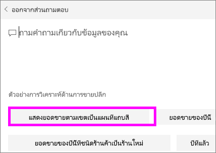
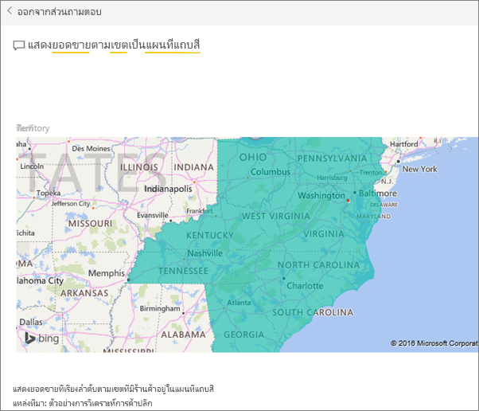

# สร้างคำถามที่น่าสนใจสำหรับ Power BI Q&A
ถ้าคุณเป็นเจ้าของชุดข้อมูล คุณสามารถเพิ่มคำถามที่แนะนำของคุณเองในชุดข้อมูลนั้น  และ Power BI Q&A จะแสดงคำถามเหล่านั้นให้เพื่อนร่วมงานที่ใช้ (*บริโภค*) ชุดข้อมูลของคุณ  คำถามที่แนะนำนั้นเพื่อให้เพื่อนร่วมงานของคุณมีความคิดเบื้องต้น เกี่ยวกับชนิดของคำถามที่พวกเขาสามารถสอบถามเกี่ยวกับชุดข้อมูล คำถามที่น่าสนใจที่คุณเพิ่มนั้นขึ้นกับคุณ -- เพิ่มคำถามยอดนิยม คำถามที่แสดงผลลัพธ์ที่น่าสนใจ หรือคำถามที่อาจเป็นเรื่องยากที่จะเขียนเป็นวลี

ดู Will เพิ่มคำถามที่แนะนำบางตัวเมื่อต้องการถาม Power BI Q&A จากนั้น ใช้คำถามที่แนะนำเหล่านั้นเพื่อสำรวจชุดข้อมูลของเขา แล้วทำตามคำแนะนำทีละขั้นตอนด้านล่างวิดีโอเพื่อลองทำด้วยตนเอง

<iframe width="560" height="315" src="https://www.youtube.com/embed/E1mIAyEXuF4" frameborder="0" allowfullscreen></iframe>

> [!NOTE]
> คำถามที่แนะนำของ Q&A จะพร้อมใช้งานใน[แอป Microsoft Power BI สำหรับ iOS บน iPads, iPhones และอุปกรณ์ iPod Touch](consumer/mobile/mobile-apps-ios-qna.md)และ Power BI Desktop Q&A แต่สร้างคำถามที่พร้อมใช้งานใน Power BI service (app.powerbi.com) เท่านั้น
> 

บทเรียนนี้ใช้[ตัวอย่างการวิเคราะห์การค้าปลีก](sample-datasets.md)

1. บนแดชบอร์ด เลือกกล่องคำถาม Q&A   โปรดสังเกตว่า Q&A ที่มีอยู่มีประโยชน์เพราะแสดงรายการของคำที่ปรากฏในชุดข้อมูล
2. เพื่อเพิ่มลงในรายการนี้ ให้เลือกไอคอนเฟืองที่มุมขวาบนของ Power BI  
   
3. เลือก**ตั้งค่า** &gt; **ชุดข้อมูล** &gt; **ตัวอย่างการวิเคราะห์ร้านค้าปลีก** &gt; **คำถามที่แนะนำใน Q&A**   
4. เลือก**เพิ่มคำถาม**
   
   
5. พิมพ์คำถามของคุณในกล่องข้อความ และเลือก**นำไปใช้**   อีกทางหนึ่งคือเพิ่มคำถามอื่น โดยการเลือก**เพิ่มคำถาม**  
   
6. นำทางกลับไปยังแดชบอร์ด Power BI สำหรับตัวอย่างการวิเคราะห์ร้านค้าปลีก และวางเคอร์เซอร์ของคุณในกล่องคำถาม Q&A   
   
7. คำถามแนะนำใหม่**ยอดขายตามเขตแบบแผนที่** เป็นสิ่งแรกในรายการ เลือกมัน  
8. คำตอบแสดงเป็นการแสดงภาพแผนที่ที่มีการเติม  
   

### ขั้นตอนถัดไป
[Q&A ใน Power BI](consumer/end-user-q-and-a.md)  
[บทเรียน บทนำสู Power BI Q&A](power-bi-visualization-introduction-to-q-and-a.md)  
[Power BI แนวคิดพื้นฐาน](consumer/end-user-basic-concepts.md)  
มีคำถามเพิ่มเติมหรือไม่ [ลองไปที่ชุมชน Power BI](http://community.powerbi.com/)

