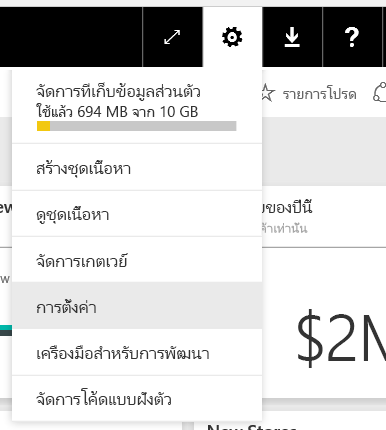
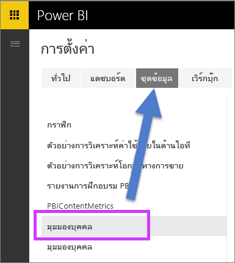
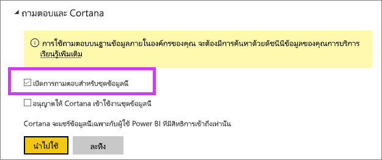

# เปิดใช้งาน Q&A สำหรับการเชื่อมต่อแบบไลฟ์
## เกตเวย์ข้อมูลภายในองค์กรคืออะไร  เชื่อมแบบไลฟ์คืออะไร
ชุดข้อมูลใน Power BI สามารถนำเข้ามาใน Power BI หรือคุณสามารถสร้างการเชื่อมต่อแบบไลฟ์ไปยังพวกนั้นได้ การเชื่อมต่อชุดข้อมูลจะมักเรียกว่าแบบ "ภายในองค์กร" การเชื่อมต่อแบบไลฟ์ถูกจัดการโดยใช้[เกตเวย์](service-gateway-onprem.md)และข้อมูลและคิวรี่ถูกส่งกลับไปกลับมาโดยใช้คิวรแบบไลฟ์

## Q&A สำหรับชุดข้อมูลเกตเวย์ของข้อมูลภายในองค์กร
ถ้าคุณต้องการใช้ Q&A ที่มีชุดข้อมูลที่คุณเข้าถึงผ่านเกตเวย์ คุณจะต้องเปิดใช้งานมันก่อน

เมื่อเปิดใช้งาน Power BI สร้างดัชนีของแหล่งข้อมูลของคุณและอัปโหลดเซตย่อยของข้อมูลนั้นไปยัง Power BI เพื่อเปิดการใช้งานการถามคำถาม ซึ่งอาจใช้เวลาหลายนาทีในการสร้างดัชนีเริ่มต้น และ Power BI รักษาและปรับปรุงดัชนีโดยอัตโนมัติเนื่องจากการเปลี่ยนแปลงของข้อมูลของคุณ ใช้ Q&A กับชุดข้อมูลเหล่านี้ซึ่งทำงานเหมือนกับข้อมูลที่เผยแพร่ที่ Power BI ชุดฟีเจอร์ที่พร้อมใช้งานในประสบการณ์ Q&A รองรับทั้งสองกรณี รวมถึงการใช้แหล่งข้อมูลพร้อมกับ Cortana

ขณะที่คุณถามคำถามใน Power BI Q&A กำหนดภาพที่ดีที่สุดเพื่อสร้างหรือรายงานแผ่นงานที่จะใช้เพื่อให้สามารถตอบคำถามของคุณโดยใช้ดัชนีของชุดข้อมูลของคุณ หลังจากพิจารณาคำตอบที่เป็นไปได้ที่ดีที่สุด Q&A ใช้ DirectQuery เพื่อดึงข้อมูลสดจากแหล่งข้อมูลผ่านทางเกตเวย์เพื่อวางข้อมูลในแผนภูมิและกราฟ สิ่งนี้รับรองว่าผลลัพธ์ของ Power BI Q&A จะแสดงข้อมูลล่าสุดได้โดยตรงจากแหล่งข้อมูลที่เกี่ยวข้องเสมอ

เนื่องจาก Power BI Q&A ใช้ข้อความและค่าโครงสร้างจากแหล่งข้อมูลของคุณเพื่อกำหนดวิธีการคิวรี่แบบจำลองที่เกี่ยวข้องเพื่อหาคำตอบ ค้นหาค่าข้อความโเฉพาะแบบใหม่ หรือลบค่าข้อความ (เช่นการสอบถามรายชื่อลูกค้าที่เกี่ยวข้องกับรายการข้อความที่เพิ่งเพิ่มเข้ามา) ขึ้นกับว่าอัชนีนั้นถูกอัปเดตด้วยค่าล่าสุดหรือไม่ Power BI เก็บดัชนีข้อความและโครงสร้างแบบล่าสุดภายในหน้าต่าง 60 นาทีของการเปลี่ยนแปลงโดยอัตโนมัติ

สำหรับข้อมูลเพิ่มเติม ให้ด:

* อะไรคือ [เกตเวย์ข้อมูลภายในองค์กร](service-gateway-onprem.md)
* [แนะนำ Power BI Q&A](power-bi-q-and-a.md)

## เปิดใช้งาน Q&A
เมื่อคุณได้ติดตั้งเกตเวย์ข้อมูล ให้เชื่อมต่อกับข้อมูลของคุณจาก Power BI  สร้างแดชบอร์ดโดยใช้ข้อมูลภายในองค์กรของคุณ หรืออัปโหลดไฟล์.pbix ที่ใช้ข้อมูลภายในองค์กร  คุณอาจยังมีข้อมูลภายในองค์กรในแดชบอร์ด รายงาน และชุดข้อมูลที่แชร์กับคุณ

1. ที่มุมขวาบนของ Power BI เลือกไอคอนเฟืองและเลือก**ตั้งค่า**
   
   
2. เลือก**ชุดข้อมูล**และเลือกชุดข้อมูลเพื่อเปิดการใช้งาน Q&A
   
   
3. ขยาย**Q&A และ Cortana** เลือกกล่องกาเครื่องหมายเพื่อ**เปิดใช้งาน Q&A สำหรับชุดข้อมูลนี้**แล้วเลือก**นำไปใช้**
   
    

## มีแคชข้อมูลอะไร และวิธีการป้องกันความเป็นส่วนตัวอย่างไร
เมื่อคุณเปิดใช้งาน Q&A สำหรับข้อมูลภายในองค์กรของคุณ เซตย่อยของข้อมูลของคุณจะถูกเก็บไว้ในเซอร์วิซ สิ่งนี้ถูกทำเพื่อให้แน่ใจว่า Q&A สามารถทำงานอย่างมีประสิทธิภาพการที่เหมาะสม Power BI แยกค่าที่ยาวกว่า 24 อักขระออกจากแคช แคชจะถูกลบภายในไม่กี่ชั่วโมงเมื่อคุณปิดใช้งาน Q&A โดยการยกเลิก**เปิดใช้งาน Q&A สำหรับข้อมูลนี้**หรือเมื่อคุณลบชุดข้อมูลของคุณ

## ข้อควรพิจารณาและการแก้ไขปัญหา
ในระหว่างขั้นตอนการแสดงตัวอย่างของฟีเจอร์นี้ จึงมีข้อจำกัดหลายประการ

* โดยเริ่มต้นฟีเจอร์เฉพาะสำหรับแหล่งข้อมูล SQL Server 2016 Analysis Services แบบตาราง ฟีเจอร์ที่ปรับให้เหมาะสมเพื่อทำงานกับข้อมูลแบบตาราง ฟังก์ชันบางอย่างจะพร้อมใช้งานกับแหล่งข้อมูลหลายมิติ แต่ประสบการณ์การใช้งาน Q&A จะยังไม่รองรับแบบหลายมิติ แหล่งข้อมูลเพิ่มเติมที่ได้รับการรองรับ โดยเกตเวย์ข้อมูลในองค์กรจะมีเผยแพร่เมื่อเวลาผ่านไป
* การรองรับแบบเต็มสำหรับความปลอดภัยระดับแถวถูกกำหนดไว้ใน SQL Server Analysis Services นั้นเบื้องต้นไม่สามารถใช้งานในการแสดงตัวอย่างแบบสาธารณะได้ ในขณะที่การถามคำถามใน Q&A การ"เติมคำ-แบบอัตโนมัติ" ของคำถามในขณะที่พิมพ์สามารถแสดงค่าสตรงที่ิผู้ใช้ไม่สามารถเข้าถึงได้ อย่างไรก็ตาม RLS ที่กำหนดไว้ในแบบจำลองจะถูกทำในรายงานและแผนภูมิภาพเพื่อให้สามารถแสดงข้อมูลเป็นตัวเลขที่ไม่มีขีดเส้นใต้ ตัวเลือกเพื่อควบคุมลักษณะการทำงานนี้จะถูกเผยแพร่ในการปรับปรุงที่จะมาถึง
* เชื่อมต่อแบบไลฟ์เท่านั้นที่ได้รองรับเกตเวย์ข้อมูลในองค์กร ผลที่ได้ สิ่งนี้ไม่สามารถใช้กับเกตเวย์ส่วนบุคคล

## ขั้นตอนถัดไป
[เกตเวย์ข้อมูลภายในองค์กร](service-gateway-onprem.md)  
[จัดการแหล่งข้อมูลของคุณ - Analysis Services](service-gateway-enterprise-manage-ssas.md)  
[Power BI แนวคิดพื้นฐาน](service-basic-concepts.md)  
[ภาพรวม Power BI Q&A](power-bi-q-and-a.md)  

มีคำถามเพิ่มเติมหรือไม่ [ลองถามชุมชน Power BI](http://community.powerbi.com/)

