# การสตรีมในเวลาจริงใน Power BI
ด้วยการสตรีมในเวลาจริงใน Power BI คุณสามารถสตรีมข้อมูล และปรับปรุงแดชบอร์ดในเวลาจริง วิชวลหรือแดชบอร์ดใด ๆ ที่สามารถสร้างใน Power BI ยังสามารถสร้างเพื่อแสดงและปรับปรุง ข้อมูลและวิชวลในเวลาจริง อุปกรณ์และแหล่งข้อมูลการสตรีมอาจเป็น เซนเซอร์โรงงาน แหล่งข้อมูลจากสื่อทางสังคม เมตริกการใช้บริการ และข้อมูลอื่น ๆ ที่สามารถรวบรวมหรือส่งข้อมูลที่ไวต่อเวลาได้

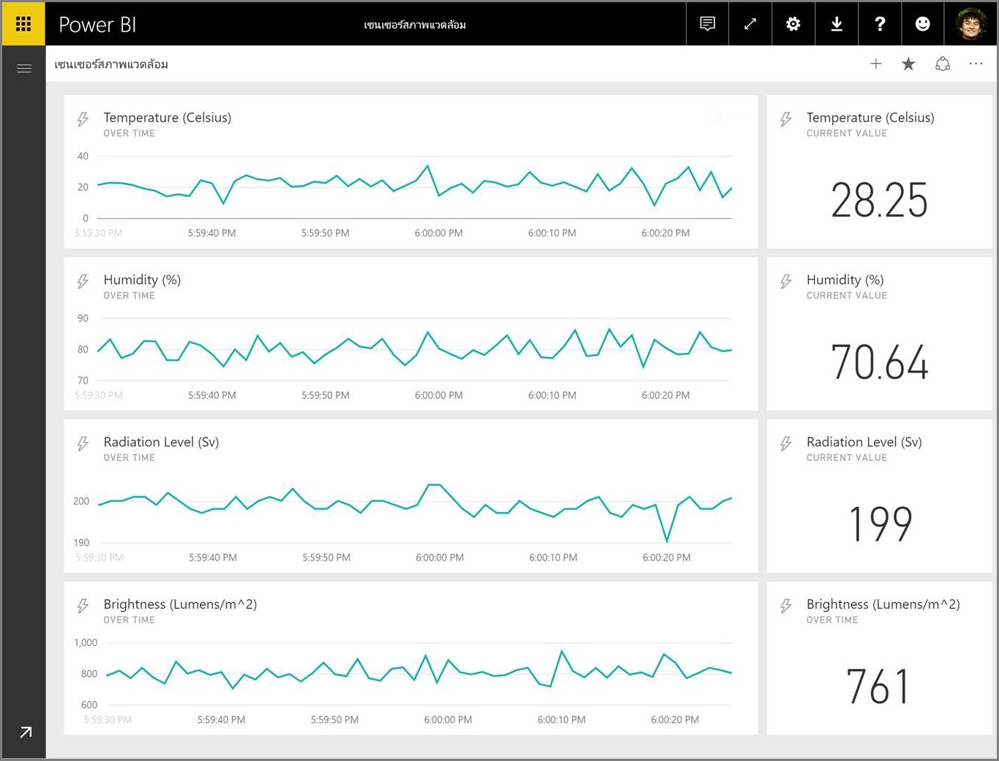

บทความนี้แสดงให้เห็นว่า การตั้งค่าการสตรีมข้อมูลในเวลาจริงทำได้อย่างไรใน Power BI แต่ก่อนที่เราจะไปถึงที่นั่น การทำความเข้าใจชนิดของชุดข้อมูลในเวลาจริง ที่ถูกออกแบบมาเพื่อแสดงผลในไทล์ (และแดชบอร์ด) และการชุดข้อมูลเหล่านั้นแตกต่างกันอย่างไร เป็นเรื่องสำคัญ

## ชนิดของชุดข้อมูลในเวลาจริง
มีชุดข้อมูลในเวลาจริงสามชนิด ที่ถูกออกแบบมาสำหรับการแสดงผลบนแดชบอร์ดในเวลาจริง:

* ชุดข้อมูลการพุช
* ชุดข้อมูลการสตรีม
* ชุดข้อมูลการสตรีม PubNub

เริ่มแรก เรามาทำความเข้าใจว่าชุดข้อมูลเหล่านี้ต่างกันอย่างไร (ในส่วนนี้) จากนั้นเราจะกล่าวถึงวิธีการพุชข้อมูลลงชุดข้อมูลเหล่านี้

### ชุดข้อมูลการพุช
ด้วย**ชุดข้อมูลการพุช** ข้อมูลจะถูกผลักไปยังบริการ Power BI เมื่อชุดข้อมูลถูกสร้างขึ้น บริการของ Power BI จะสร้างฐานข้อมูลใหม่ในบริการเพื่อจัดเก็บข้อมูลโดยอัตโนมัติ เนื่องจากมีฐานข้อมูลเบื้องต้นที่จัดเก็บข้อมูลที่เข้ามาต่อเนื่อง คุณสามารถสร้างรายงานด้วยข้อมูลนั้น รายงานเหล่านี้และวิชวลในรายงาน จะเหมือนกับวิชวลในรายงานอื่น ซึ่งหมายถึงคุณสามารถใช้คุณลักษณะการสร้างรายงานทั้งหมดของ Power BI เพื่อสร้างวิชวล รวมไปถึงวิชวลแบบกำหนดเอง การแจ้งเตือนข้อมูล ไทล์แดชบอร์ดที่ปักหมุด ฯลฯ

เมื่อรายงานถูกสร้างโดยใช้ชุดข้อมูลการพุชแล้ว วิชวลใด ๆ ในนั้นสามารถปักหมุดไปยังแดชบอร์ดได้ บนแดชบอร์ด วิชวลจะปรับปรุงในเวลาจริง เมื่อใดก็ตามที่มีการปรับปรุงข้อมูล ภายในบริการ แดชบอร์ดจะทริกเกอร์การรีเฟรชไทล์ทุกครั้งที่ได้รับข้อมูลใหม่

มีข้อควรพิจารณาสองข้อ เกี่ยวกับไทล์ที่ปักหมุดจากชุดข้อมูลการพุช:

* การปักหมุดทั้งรายงานโดยใช้ตัวเลือก*ปักหมุดหน้านี้* จะส่งผลให้ข้อมูล**ไม่**ถูกปรับปรุงโดยอัตโนมัติ
* เมื่อวิชวลถูกปักหมุดไปยังแดชบอร์ด คุณสามารถใช้**ถามตอบ**เพื่อถามคำถามของชุดข้อมูลการพุชด้วยภาษาธรรมชาติได้ เมื่อคุณทำการ**ถามตอบ**คิวรี คุณสามารถปักหมุดวิชวลที่เป็นผลลัพธ์กลับไปยังแดชบอร์ด และแดชบอร์ดจะ*ยังคง*ปรับปรุงในเวลาจริงได้

### ชุดข้อมูลการสตรีม
ด้วย**ชุดข้อมูลการสตรีม** ข้อมูลยังถูกผลักลงในบริการของ Power BI แต่มีความแตกต่างที่สำคัญ: Power BI เก็บข้อมูลลงในแคชชั่วคราวเท่านั้น ซึ่งหมดอายุได้อย่างรวดเร็ว แคชชั่วคราวใช้เพื่อแสดงวิชวลที่เก็บประวัติไม่นาน เช่น แผนภูมิเส้นที่มีข้อมูลย้อนหลังหนึ่งชั่วโมง

ด้วย**ชุดข้อมูลการสตรีม** จะ*ไม่มี*ฐานข้อมูลเบื้องต้น ดังนั้นคุณ*ไม่*สามารถสร้างวิชวลรายงานโดยใช้ข้อมูลที่เข้ามาจากสตรีมได้ ด้วยเหตุนี้ คุณไม่สามารถใช้ฟังก์ชันของรายงาน เช่น การกรอง วิชวลแบบกำหนดเอง และฟังก์ชันรายงานอื่น ๆ

มีวิธีเดียวที่แสดงชุดข้อมูลการสตรีม คือการเพิ่มไทล์ และใช้ข้อมูลการสตรีมเป็นแหล่งข้อมูลของ**ข้อมูลการสตรีมแบบกำหนดเอง** ไทล์สตรีมแบบกำหนดเองที่มาจาก**ชุดข้อมูลการสตรีม** ถูกปรับให้เหมาะสำหรับการแสดงข้อมูลในเวลาจริงได้อย่างรวดเร็ว มีเวลาแฝงระหว่างเมื่อข้อมูลถูกส่งไปยังบริการของ Power BI และเมื่อวิชวลถูกอัปเดตน้อยมาก เนื่องจากไม่จำเป็นต้องเก็บข้อมูลลงไป หรืออ่านข้อมูลจากฐานข้อมูล

ในทางปฏิบัติ ชุดข้อมูลสตรีมและวิชวลที่เกี่ยวข้องกับสตรีม เหมาะที่สุดสำหรับสถานการณ์ที่ต้องการลดเวลาแฝงให้เหลือน้อยที่สุด ระหว่างเวลาที่ข้อมูลถูกพุช และเวลาที่แสดงในวิชวล นอกจากนี้ จะเป็นการดีที่สุด ถ้าข้อมูลถูกผลักในรูปที่สามารถนำมาแสดงผลได้ทันที โดยไม่มีการรวมใด ๆ เพิ่มเติม ตัวอย่างของข้อมูลที่พร้อมใช้งานทันที่ เช่น อุณหภูมิ และค่าเฉลี่ยที่คำนวนไว้ล่วงหน้าแล้ว

### ชุดข้อมูลการสตรีม PubNub
ด้วยการสตรีมชุดข้อมูล **PubNub** ไคลเอ็นต์เว็บ Power BI ใช้ PubNub SDK ในการอ่านสตรีมข้อมูล PubNub ที่มีอยู่แล้ว และไม่มีการเก็บข้อมูลโดยบริการของ Power BI

เช่นเดียวกับ**ชุดข้อมูลการสตรีม** จะไม่มีฐานข้อมูลพื้นฐานใน Power BI สำหรับเก็บ**ชุดข้อมูลการสตรีม PubNub** ดังนั้นคุณไม่สามารถสร้างวิชวลรายงานกับข้อมูลที่เข้ามา และไม่สามารถใช้ประโยชน์จากความสามารถด้านรายงาน เช่น การกรอง วิชวลแบบกำหนดเอง ฯลฯ ด้วยเหตุนี้ **ชุดข้อมูลการสตรีม PubNub** สามารถแสดงได้โดยการเพิ่มไทล์ไปยังแดชบอร์ด และกำหนดค่าข้อมูลสตรีม PubNub เป็นแหล่งข้อมูลเท่านั้น

ไทล์จาก**ชุดข้อมูลการสตรีม PubNub** ถูกปรับให้เหมาะสำหรับการแสดงข้อมูลในเวลาจริงได้อย่างรวดเร็ว เนื่องจาก Power BI เชื่อมต่อโดยตรงกับสตรีมข้อมูล PubNub มีเวลาแฝงเพียงเล็กน้อยระหว่าง เวลาที่ข้อมูลถูกผลักไปในบริการของ Power BI และเวลาที่วิชวลมีการปรับปรุง

### เมทริกซ์ชุดข้อมูลการสตรีม
ตาราง (หรือเมทริกซ์) ต่อไปนี้ อธิบายชุดข้อมูลสำหรับสตรีมในเวลาจริงสามชนิด และรายการความสามารถและขีดจำกัดของแต่ละชุดข้อมูล

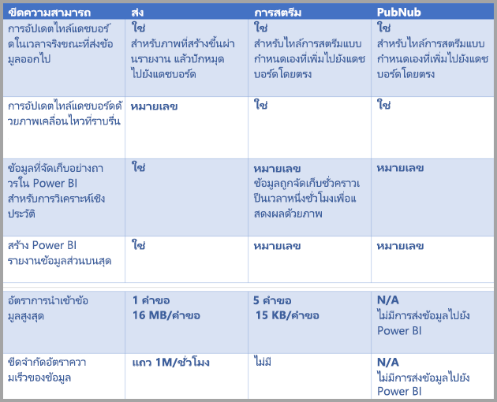

> [!NOTE]
> ดู[บทความ MSDN นี้](https://msdn.microsoft.com/library/dn950053.aspx) สำหรับข้อมูลขีดจำกัดของการ**พุช** ว่าสามารถผลักข้อมูลได้มากแค่ไหน
> 
> 

## การพุชข้อมูลไปยังชุดข้อมูล
ส่วนก่อนหน้านี้ อธิบายชุดข้อมูลในเวลาจริงสามชนิดหลัก ที่คุณสามารถใช้ในการสตรีมในเวลาจริง และความแตกต่างกันของแต่ละชนิด ในส่วนนี้ จะอธิบายวิธีการสร้างและพุชข้อมูลลงในชุดข้อมูลเหล่านั้น

คุณสามารถพุชข้อมูลลงในชุดข้อมูลได้สามวิธีหลัก ๆ ได้แก่:

* การใช้ Power BI REST API
* การใช้ส่วนติดต่อผู้ใช้ ชุดข้อมูลสตรีมมิ่ง
* การใช้ Azure Stream Analytics

เรามาดูวิธีเหล่านั้นทีละวิธี

### การใช้ Power BI REST API เพื่อพุชข้อมูล
**Power BI REST API** สามารถใช้สร้างและส่งข้อมูลไปยังชุดข้อมูลการ**พุช** และชุดข้อมูลการ**สตรีม**ได้ เมื่อคุณสร้างชุดข้อมูลด้วย Power BI REST API ค่าสถานะ *defaultMode* ระบุว่าเป็นชุดข้อมูลการพุช หรือการสตรีม ถ้าไม่มีมีค่าสถานะ *defaultMode* ค่าเริ่มต้นของชุดข้อมูลเป็นชุดข้อมูลการ**พุช**

ถ้า *defaultMode* ตั้งค่าเป็น *pushStreaming* ชุดข้อมูลจะเป็นทั้งการ**พุช***และการ***สตรีม** ทำให้ได้ประโยชน์ของทั้งสองชนิด [บทความสำหรับ**สร้างชุดข้อมูล**](https://msdn.microsoft.com/library/mt203562.aspx) ด้วย REST API สาธิตการสร้างชุดข้อมูลการสตรีม และแสดงการทำงานของค่าสถานะ *defaultMode*

> [!NOTE]
> เมื่อใช้ชุดข้อมูลที่มีค่าสถานะ *defaultMode* เป็น *pushStreaming* ถ้าคำขอมีขนาดเกินขีดจำกัด 15Kb สำหรับชุดข้อมูลการ**สตรีม** แต่จะน้อยกว่าขีดจำกัด 16MB ของชุดข้อมูลการ**พุช** คำขอจะประสบผลสำเร็จ และข้อมูลจะถูกปรับปรุงในชุดข้อมูลการพุช อย่างไรก็ตาม ไทล์การสตรีมใด ๆ จะล้มเหลวชั่วคราว
> 
> 

เมื่อสร้างชุดข้อมูลแล้ว ใช้ REST API เพื่อพุชข้อมูลโดยใช้ [API **เพิ่มแถว**](https://msdn.microsoft.com/library/mt203561.aspx) ดังที่[สาธิตในบทความนี้](https://msdn.microsoft.com/library/mt203561.aspx)

คำร้องขอทั้งหมดที่ไปยัง REST API ถูกรักษาความปลอดภัยด้วย **Azure AD OAuth**

### การใช้ส่วนติดต่อผู้ใช้ ชุดข้อมูลการสตรีม เพื่อพุชข้อมูล
ในบริการของ Power BI คุณสามารถสร้างชุดข้อมูล โดยการเลือก **API** ดังแสดงในรูปต่อไปนี้

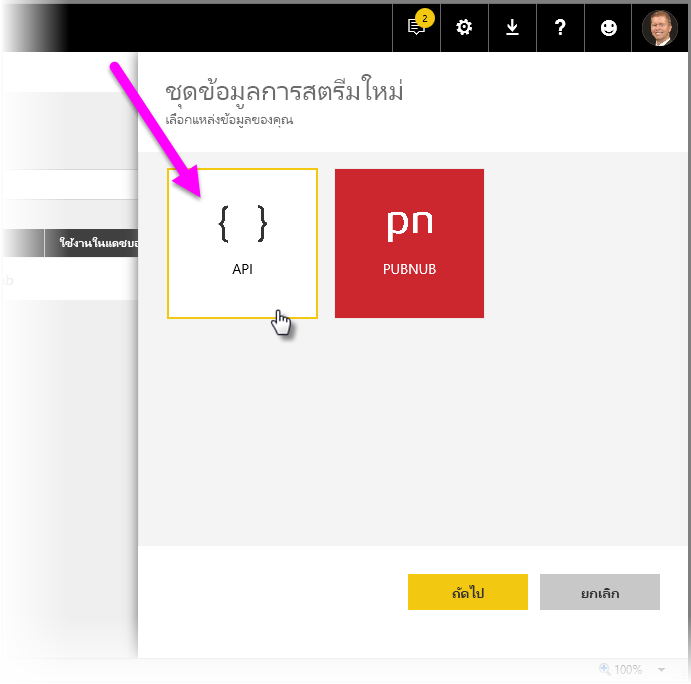

เมื่อสร้างชุดข้อมูลการสตรีมใหม่ คุณสามารถเลือกเปิดใช้งาน**การวิเคราะห์ข้อมูลในอดีต** ตามที่แสดงด้านล่าง ซึ่งมีผลที่สำคัญ

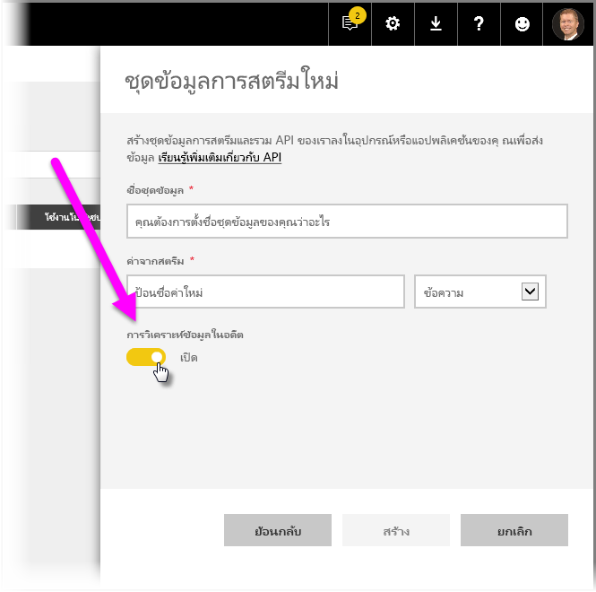

เมื่อ**การวิเคราะห์ข้อมูลในอดีต**ถูกปิดใช้งาน (ซึ่งเป็นค่าเริ่มต้น) คุณสามารถสร้าง**ชุดข้อมูลการสตรีม** ตามที่อธิบายไว้ก่อนหน้าในบทความนี้ เมื่อ**การวิเคราะห์ข้อมูลในอดีต**ถูก*เปิดใช้งาน* ชุดข้อมูลที่สร้างขึ้นเป็นทั้ง**ชุดข้อมูลการสตรีม** และ**ชุดข้อมูลการพุช** นี่คือเทียบเท่ากับการใช้ Power BI REST API สร้างชุดข้อมูลที่มีค่าของ *defaultMode* เป็น *pushStreaming* ตามที่อธิบายไว้ก่อนหน้าในบทความนี้

> [!NOTE]
> สำหรับชุดข้อมูลการสตรีม ที่สร้างขึ้นด้วยส่วนติดต่อผู้ใช้ในบริการของ Power BI UI ตามที่อธิบายไว้ในย่อหน้าที่แล้ว การรับรองความถูกต้องของ Azure AD เป็นเรื่องไม่จำเป็น ในชุดข้อมูลดังกล่าว เจ้าของชุดข้อมูลจะได้รับ URL ที่มี rowkey ซึ่งอนุญาตให้ผู้ร้องขอ พุชข้อมูลลงในชุดข้อมูลโดยไม่ต้องมีโทเค็น Azure AD OAuth ของแบเรอร์ ให้ทราบว่าวิธี Azure AD (AAD) ยังคงใช้การกับพุชข้อมูลลงในชุดข้อมูลได้
> 
> 

### การใช้ Azure Stream Analytics เพื่อพุชข้อมูล
คุณสามารถเพิ่ม Power BI เป็นเอาท์พุทภายใน **Azure Stream Analytics** (ASA) จากนั้น แสดงผลสตรีมข้อมูลเหล่านั้นในบริการของ Power BI ในเวลาจริงได้ ส่วนนี้อธิบายจะรายละเอียดทางเทคนิคเกี่ยวกับวิธีดำเนินการนั้น

Azure Stream Analytics ใช้ Power BI REST API เพื่อสร้างสตรีมของข้อมูลผลลัพธ์ไปยัง Power BI ด้วย *defaultMode* ตั้งค่าเป็น *pushStreaming* (ดูส่วนก่อนหน้าในบทความนี้ สำหรับข้อมูลเกี่ยวกับ *defaultMode*) ซึ่งทำให้ชุดข้อมูลสามารถใช้ประโยชน์จากทั้งการ**พุช**และการ**สตรีม** ในระหว่างการสร้างชุดข้อมูล Azure Stream Analytics ยังตั้งค่าสถานะ **retentionPolicy* เป็น *basicFIFO* ด้วยการตั้งค่านั้น ฐานข้อมูลที่สนับสนุนการพุชชุดข้อมูล จะเก็บข้อมูลได้ 200,000 แถว และเมื่อถึงขีดจำกัดดังกล่าว แถวจะถูกลบทิ้งไปในแบบ เข้าก่อน ออกก่อน (FIFO)

> [!CAUTION]
> ถ้าคิวรี Azure Stream Analytics ของคุณ ให้มีผลลัพธ์ที่ถี่มากไปยัง Power BI (เช่น หนึ่งหรือสองครั้งต่อวินาที) Azure Stream Analytics จะเริ่มรวมผลลัพธ์เหล่านั้นลงในคำร้องขอเดียว ซึ่งอาจทำให้ขนาดของคำขอ เกินขีดจำกัดของไทล์การสตรีม ตามที่ได้กล่าวถึงในส่วนก่อนหน้า ในกรณีนี้ ไทล์การสตรีมจะไม่แสดงผล แนวทางปฏิบัติที่ดีที่สุดคือ การลดอัตราการส่งผลลัพธ์ข้อมูลไปยัง Power BI เช่น แทนที่จะส่งค่าทุก ๆ วินาที ตั้งค่าเป็นสูงสุดหนึ่งค่าทุก ๆ 10 วินาที
> 
> 

## ตั้งค่าชุดข้อมูลการสตรีมในเวลาจริง ใน Power BI
ตอนนี้เราได้ครอบคลุมเนื้อหาชุดข้อมูลสตรีมในเวลาจริงสามชนิดหลัก และอีกสามวิธีหลักที่คุณสามารถพุชลงในชุดข้อมูล เรามาทำให้ชุดข้อมูลการสตรีมในเวลาจริงของคุณ ทำงานใน Power BI

เพื่อเริ่มต้นใช้งานสตรีมในเวลาจริง คุณจำเป็นต้องเลือกหนึ่งในสองวิธีที่จะใช้ข้อมูลการสตรีมใน Power BI:

* **ไทล์**ด้วยวิชวลจากข้อมูลการสตรีม
* **ชุดข้อมูล**สร้างขึ้นจากข้อมูลการสตรีมที่บันทึกใน Power BI

ไม่ว่าคุณจะเลือกวิธีใด คุณต้องตั้งค่า**ข้อมูลการสตรีม**ใน Power BI ไว้ก่อนแล้ว เพื่อการตั้งค่านี้ ในแดชบอร์ดของคุณ (แดชบอร์ดเดิมที่มีอยู่ หรือแดชบอร์ดใหม่) เลือก**เพิ่มไทล์** แล้วเลือก**ข้อมูลการสตรีมแบบกำหนดเอง**

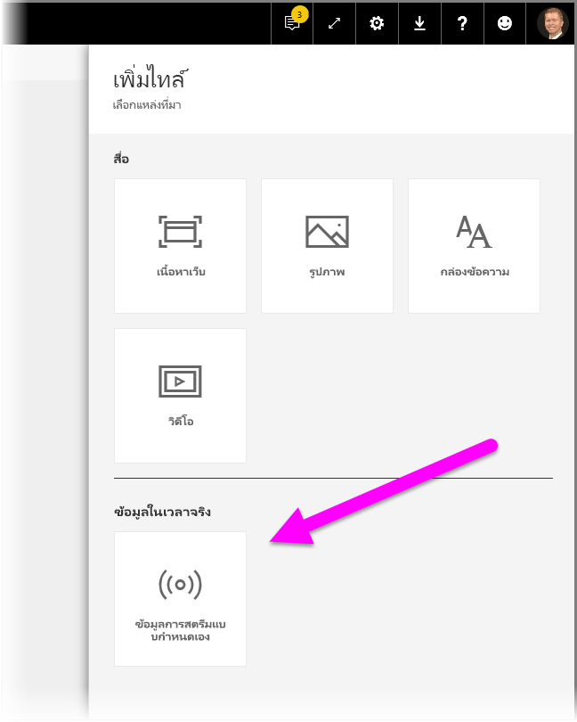

ถ้าคุณยังไม่มีการตั้งค่าข้อมูลการสตรีม ไม่ต้องกังวล - คุณสามารถเลือก**จัดการข้อมูล**เพื่อเริ่มต้น

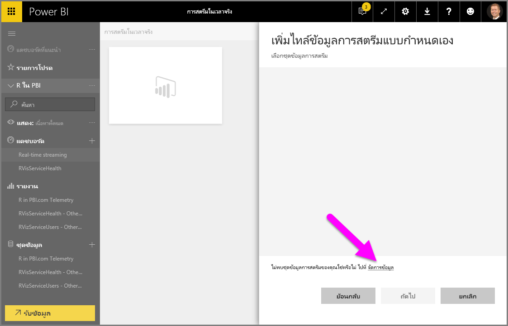

บนหน้านี้ คุณสามารถป้อนค่าจุดสิ้นสุดของข้อมูลการสตรีมของคุณ ถ้าคุณได้สร้างไว้ก่อนแล้ว (ลงในกล่องข้อความ) ถ้าคุณยังไม่มีชุดข้อมูลการสตรีม เลือกไอคอนเครื่องหมายบวก ( **+** ) ที่มุมบนขวา เพื่อดูตัวเลือกที่มีสำหรับสร้างชุดข้อมูลการสตรีม

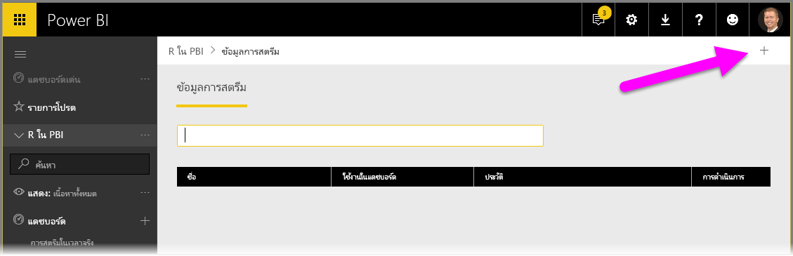

เมื่อคุณคลิกบนไอคอน **+** คุณเห็นตัวเลือกสองตัว:

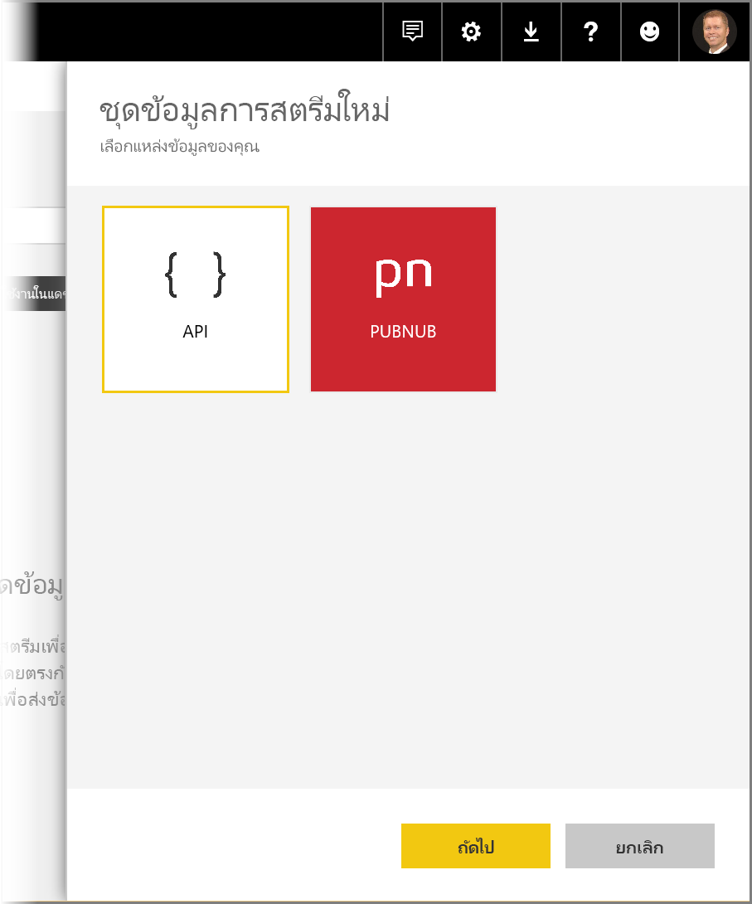

ในส่วนถัดไปจะอธิบายเกี่ยวกับตัวเลือกเหล่านี้ และการเข้าไปในรายละเอียดเพิ่มเติมเกี่ยวกับ วิธีการสร้าง**ไทล์**การสตรีม หรือวิธีการสร้างการ**ชุดข้อมูล**จากแหล่งข้อมูลการสตรีม ซึ่งคุณสามารถใช้ในภายหลังเพื่อสร้างรายงาน

## สร้างข้อมูลการสตรีมของคุณ ด้วยตัวเลือกที่คุณชอบที่สุด
การสร้างสตรีมข้อมูลในเวลาจริง ที่สามารถใช้และดูได้จาก Power BI มีอยู่ด้วยกันสองวิธี:

* **Power BI REST API** โดยใช้จุดสิ้นสุดการสตรีมในเวลาจริง
* **PubNub**

ส่วนถัดไปจะดูทีละตัวเลือก

### การใช้ POWER BI REST API
**Power BI REST API** - การปรับปรุงล่าสุดของ Power BI REST API ออกแบบให้การสตรีมในเวลาจริงทำได้ง่ายขึ้นสำหรับนักพัฒนา เมื่อคุณเลือก **API** จากหน้าต่าง**สร้างชุดข้อมูลการสตรีมใหม่** คุณจะเห็นรายการการตั้งค่าเพื่อให้ Power BI เชื่อมต่อ และใช้จุดสิ้นสุดของคุณ:

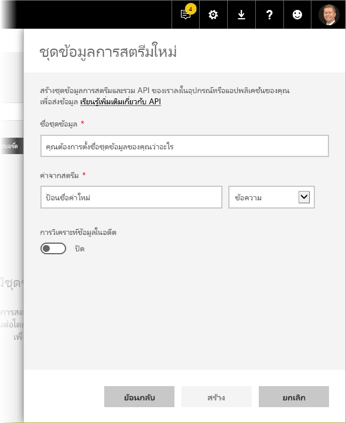

ถ้าคุณต้องการให้ Power BI จัดเก็บข้อมูลที่ส่งผ่านสตรีมข้อมูลนี้ เปิดใช้งาน*การวิเคราะห์ข้อมูลในอดีต* แล้วคุณจะสามารถสร้างรายงานและวิเคราะห์ข้อมูลที่รวบรวมจากสตรีม คุณยังสามารถ[เรียนรู้เพิ่มเติมเกี่ยวกับ API](https://msdn.microsoft.com/library/dn877544.aspx) ได้

เมื่อคุณสร้างสตรีมของข้อมูลคุณเรียบร้อยแล้ว คุณจะได้จุดสิ้นสุด REST API URL ซึ่งแอปพลิเคชันคุณสามารถใช้การร้องขอ *POST* เพื่อพุชข้อมูลของคุณไปยัง**ชุดข้อมูลการสตรีม** Power BI ที่คุณสร้างขึ้น

เมื่อทำการร้องขอ *POST* คุณควรตรวจสอบว่า เนื้อหาของคำขอตรงกับตัวอย่าง JSON ที่ให้มาโดยส่วนติดต่อผู้ใช้ Power BI ตัวอย่างเช่น ใส่วัตถุ JSON ของคุณไว้ในอาร์เรย์

### การใช้ PubNub
ด้วยการรวมเอาการสตรีม **PubNub** มาไว้ใน Power BI คุณสามารถใช้สตรีมของข้อมูล **PubNub** (หรือสร้างสตรีมใหม่) ที่มีเวลาแฝงต่ำ และใช้งานใน Power BI ได้ เมื่อคุณเลือก **PubNub** แล้วเลือก**ถัดไป** คุณจะเห็นหน้าต่างต่อไปนี้:

> [!WARNING]
> แชนเนล PubNub สามารถทำให้ปลอดภัย ด้วยคีย์การรับรองความถูกต้อง PubNub Access Manager (PAM) คีย์นี้จะแชร์กับผู้ใช้ทั้งหมดที่มีสิทธิ์เข้าถึงแดชบอร์ด คุณสามารถ[เรียนรู้เพิ่มเติมเกี่ยวกับการควบคุมการเข้าถึง PubNub](https://www.pubnub.com/docs/web-javascript/pam-security) ได้
> 
> 

สตรีมข้อมูล **PubNub** มักมีปริมาณมาก และมักไม่เหมาะสมที่จะจัดเก็บและวิเคราะห์อดีต ด้วยข้อมูลต้นฉบับ เพื่อใช้ Power BI สำหรับการวิเคราะห์ในอดีต ด้วยข้อมูล PubNub คุณจะต้องรวมสตรีม PubNub ดิบ แล้วส่งไปยัง Power BI วิธีหนึ่งในการดำเนินดังกล่าวคือ [Azure Stream Analytics](https://azure.microsoft.com/services/stream-analytics/)

## ตัวอย่างการใช้การสตรีมในเวลาจริงใน Power BI
นี่คือตัวอย่างเร็ว ๆ ที่แสดงให้เห็นว่าการสตรีมในเวลาจริงใน Power BI ทำงานอย่างไร คุณสามารถทำตามตัวอย่างนี้ เพื่อเห็นคุณค่าของการสตรีมในเวลาจริงด้วยตัวคุณเอง

ในตัวอย่างนี้ เราจะใช้สตรีมสาธารณชนจาก **PubNub** ต่อไปนี้คือขั้นตอน:

1. ใน**บริการของ Power BI** เลือกแดชบอร์ด (หรือสร้างขึ้นใหม่) และเลือก**เพิ่มไทล์** > **ข้อมูลการสตรีมแบบกำหนดเอง** แล้วเลือกปุ่ม**ถัดไป**
   
   
2. ถ้าคุณยังไม่มีแหล่งข้อมูลการสตรีมได้ เลือกลิงก์**จัดการข้อมูล** (เหนือปุ่ม**ถัดไป**) จากนั้นเลือก **+ เพิ่มข้อมูลการสตรีม** จากลิงก์ในมุมบนขวาของหน้าต่าง เลือก **PubNub** แล้วเลือก**ถัดไป**
3. ใส่ชื่อสำหรับชุดข้อมูลของคุณ จากนั้นวางค่าต่อไปนี้ลงในหน้าต่างที่ปรากฏขึ้น แล้วเลือก**ถัดไป**:
   
   *คีย์ย่อย:*
   
       sub-c-5f1b7c8e-fbee-11e3-aa40-02ee2ddab7fe
   *ชื่อช่อง:*
   
       pubnub-sensor-network
   
   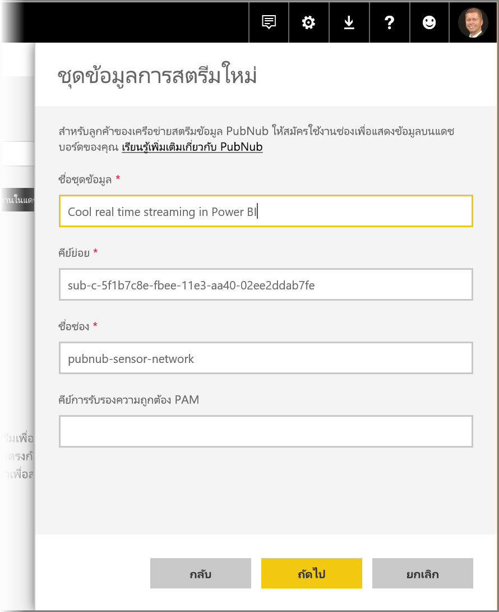
4. ในหน้าต่างต่อไปนี้ เพียงเลือกค่าเริ่มต้น (ซึ่งมีข้อมูลให้โดยอัตโนมัติ) แล้วเลือก**สร้าง**
   
   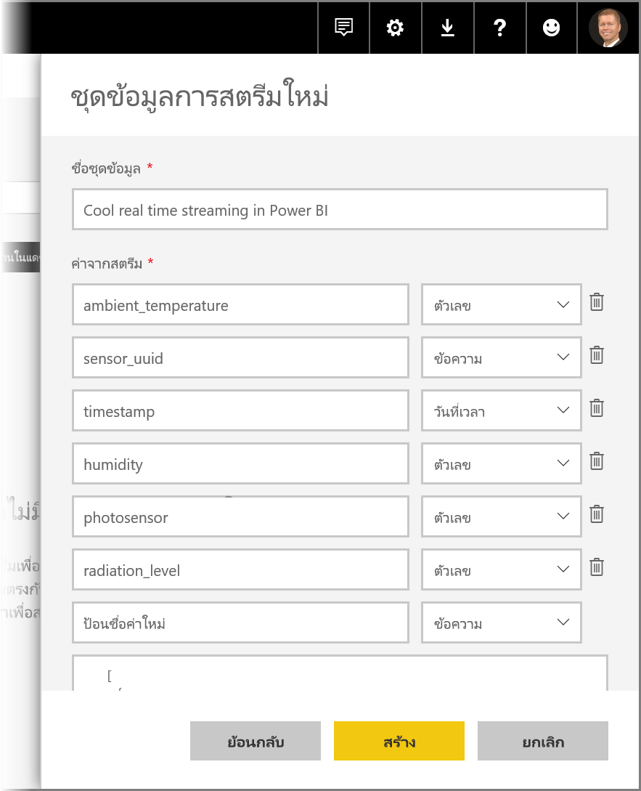
5. กลับไปในพื้นที่ทำงานของ Power BI สร้างแดชบอร์ดใหม่ จากนั้นเพิ่มไทล์ (ดูด้านบนสำหรับขั้นตอน ถ้าคุณต้องการ) คราวนี้ เมื่อคุณสร้างไทล์และเลือก**ข้อมูลการสตรีมแบบกำหนดเอง** คุณมีชุดข้อมูลการสตรีมที่ทำงานด้วยแล้ว ลองทำและเล่นกับมันดู เพิ่มเขตข้อมูล*ตัวเลข*ลงในแผนภูมิเส้น จากนั้นเพิ่มไทล์อื่น ๆ คุณสามารถแดชบอร์ดเวลาจริงที่ดูเหมือนต่อไปนี้ได้:
   
   

ลองทำดู และเล่นกับชุดข้อมูลตัวอย่าง จากนั้น ไปสร้างชุดข้อมูลของคุณเอง และสตรีมข้อมูลสดไปยัง Power BI

## คำถามและคำตอบ
ต่อไปนี้เป็นคำถามทั่วไปเกี่ยวกับการสตรีมในเวลาจริงใน Power BI และคำตอบ

#### ฉันสามารถใช้ตัวกรองบนชุดข้อมูลการพุชได้หรือไม่? แล้วทำได้กับชุดข้อมูลการสตรีมหรือไม่?
โชคร้ายที่ ชุดข้อมูลการสตรีมไม่สนับสนุนการกรอง สำหรับชุดข้อมูลการพุช คุณสามารถสร้างรายงาน กรองรายงาน แล้วปักหมุดวิชวลที่ถูกกรองไปยังแดชบอร์ดได้ อย่างไรก็ตาม ไม่มีวิธีแก้ไขตัวกรองบนวิชวลหลังจากอยู่บนแดชบอร์ดแล้ว

อีกทางหนึ่ง คุณสามารถปักหมุดไทล์รายงานสดไปยังแดชบอร์ด ในกรณีนี้ คุณสามารถแก้ไขตัวกรอง อย่างไรก็ตาม ไทล์รายงานสดจะไม่ปรับปรุงในเวลาจริง เมื่อมีข้อมูลใหม่ผลักเข้ามา – คุณจะต้องอัปเดตวิชวลด้วยตนเอง โดยใช้ตัวเลือก*รีเฟรชแดชบอร์ด*ในเมนู**เพิ่มเติม**

เมื่อใช้ตัวกรองเพื่อพุชชุดข้อมูลที่มีเขตข้อมูล*วันที่และเวลา* ที่มีความแม่นยำระดับมิลลิวินาที ตัวดำเนินการ*เทียบเท่า*จะไม่ได้รับการสนับสนุน อย่างไรก็ตาม ตัวดำเนินการเช่นมากกว่า (>) หรือน้อยกว่า (<) ทำงานอย่างถูกต้อง

#### ฉันสามารถดูค่าล่าสุดในชุดข้อมูลที่พุชได้อย่างไร? แล้วทำได้กับชุดข้อมูลการสตรีมหรือไม่?
ชุดข้อมูลการสตรีมถูกออกแบบมาสำหรับแสดงข้อมูลล่าสุด คุณสามารถใช้**การ์ด**วิชวลการสตรีม เพื่อดูค่าล่าสุดได้อย่างง่ายดาย ขออภัยที่ การ์ดไม่สนับสนุนข้อมูลชนิด*วันที่และเวลา* หรือ*ข้อความ*
สำหรับชุดข้อมูลการพุช สมมติว่าคุณมีการประทับเวลาใน schema คุณสามารถลองสร้างวิชวลรายงานด้วยตัวกรอง N ล่าสุด

#### ฉันสามารถเชื่อมต่อเพื่อพุชหรือสตรีมชุดข้อมูลใน Power BI Desktop หรือไม่?
ขออภัย ขณะนี้ยังไม่พร้อมให้ใช้งาน

#### จากคำถามก่อนหน้า ฉันสามารถสร้างรูปแบบใด ๆ บนชุดข้อมูลในเวลาจริงได้อย่างไร?
การสร้างรูปแบบทำไม่ได้ในชุดข้อมูลการสตรีม เนื่องจากข้อมูลไม่ได้ถูกเก็บถาวร สำหรับชุดข้อมูลการพุช คุณสามารถใช้ REST API ปรับปรุงชุดข้อมูล/ตาราง เพื่อเพิ่มหน่วยวัดและความสัมพันธ์ คุณสามารถรับข้อมูลเพิ่มเติมจาก[บทความอัปเดต schema ของตาราง](https://msdn.microsoft.com/library/mt203560.aspx) และ[บทความคุณสมบัติชุดข้อมูล](https://msdn.microsoft.com/library/mt742155.aspx)ได้

#### ฉันจะล้างค่าทั้งหมดในชุดข้อมูลการพุชได้อย่างไร? แล้วทำได้กับชุดข้อมูลการสตรีมหรือไม่?
บนชุดข้อมูลการพุช คุณสามารถลบแถวโดยการเรียก REST API คุณยังสามารถใช้ประโยชน์เครื่องมือนี้ ซึ่งเป็น wrapper รอบ REST API ขณะนี้ยังไม่มีวิธีล้างข้อมูลจากชุดข้อมูลการสตรีม แม้ว่าข้อมูลจะล้างตัวเองหลังจากผ่านไปหนึ่งชั่วโมง

#### ฉันตั้งค่าเอาท์พุทจาก Azure Stream Analytics ไปยัง Power BI แต่ฉันไม่เห็นใน Power BI – มีอะไรผิดพลาด?
นี่คือรายการตรวจสอบที่คุณสามารถใช้เพื่อแก้ไขปัญหา:

1. รีสตาร์ตงาน Azure Stream Analytics (งานที่สร้างขึ้นก่อนการเผยแพร่ทั่วไปสำหรับการสตรีม จำเป็นต้องรีสตาร์ต)
2. ลองอนุมัติการเชื่อมต่อ Power BI ใน Azure Stream Analytics อีกครั้ง
3. พื้นที่ทำงานไหนที่คุณระบุในเอาท์พุทของ Azure Stream Analytics ในบริการของ Power BI คุณได้ตรวจสอบว่าเป็นพื้นที่ทำงานนั้น (เดียวกัน) หรือไม่?
4. คิวรี Azure Stream Analytics ระบุไว้ชัดเจนว่าส่งผลลัพธ์ไปยัง Power BI หรือไม่? (โดยใช้คำสำคัญ INTO)
5. งาน Azure Stream Analytics มีข้อมูลไหลผ่านหรือไม่? ชุดข้อมูลจะถูกสร้างเมื่อมีข้อมูลส่งเข้ามาเท่านั้น
6. คุณสามารถดูบันทึกของ Azure Stream Analytics ว่ามีคำเตือนหรือข้อผิดพลาดใด ๆ หรือไม่?

## ขั้นตอนถัดไป
นี่คือบางลิงก์อาจเป็นประโยชน์กับคุณ เมื่อทำงานกับการสตรีมในเวลาจริงใน Power BI:

* [ภาพรวมของ Power BI REST API กับข้อมูลในเวลาจริง](https://msdn.microsoft.com/library/dn877544.aspx)
* [ข้อจำกัดของ Power BI REST API](https://msdn.microsoft.com/library/dn950053.aspx)
* [บทความ REST API สำหรับ**สร้างชุดข้อมูล**](https://msdn.microsoft.com/library/mt203562.aspx)
* [Power BI REST API **เพิ่มแถว**](https://msdn.microsoft.com/library/mt203561.aspx)
* [Azure Stream Analytics](https://azure.microsoft.com/services/stream-analytics/)

