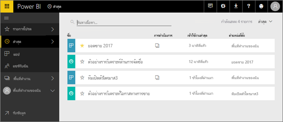
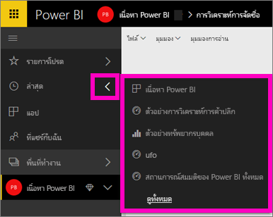
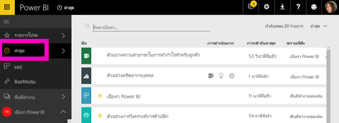

# เนื้อหา**ล่าสุด**ในบริการ Power BI

## เนื้อหาล่าสุดคืออะไร
เนื้อหาล่าสุดคือรายการสุดท้ายที่คุณเข้าชมไม่เกิน 20 รายการ  ซึ่งรวมถึง แดชบอร์ด รายงาน แอป และเวิร์กบุ๊กทั้งหมดของพื้นที่ทำงานของคุณ

ให้ดู Amanda สาธิตว่ารายการ**ล่าสุด**นั้นเติมข้อมูลอย่างไรจ ากนั้นทำตามคำแนะนำแบบทีละขั้นตอนตามด้านล่างวิดีโอเพื่อลองใช้งานด้วยตัวคุณเอง

<iframe width="560" height="315" src="https://www.youtube.com/embed/G26dr2PsEpk" frameborder="0" allowfullscreen></iframe>

## แสดงเนื้อหาล่าสุด
หากคุณต้องการดูห้ารายการที่เข้าชมล่าสุด ให้ไปยังเมนูนำทางด้านซ้ายมือแล้วเลือกลูกศรไปทางขวาของ**ล่าสุด**  จากที่นี่ คุณสามารถเลือกเนื้อหาล่าสุดเมื่อต้องเปิด แสดงเฉพาะห้ารายการล่าสุด

ถ้าคุณมีรายการที่เยี่ยมชมล่าสุดมากกว่าห้ารายการ ให้เลือก**ดูทั้งหมด**เพื่อเปิดหน้าจอล่าสุด (ดูด้านล่าง) คุณยังสามารถเลือก**ล่าสุด**หรือ จากเมนูด้านซ้าย

จากที่นี่ คุณสามารถโต้ตอบกับเนื้อหา ตามที่คุณต้องการบนแต่ละ[ **แดชบอร์ด**](service-dashboards.md), [ **รายงาน**](service-reports.md)และ **เวิร์กบุ๊ก**แท็บ และคง[ **แอป** ](service-install-use-apps.md)หน้าจอ

## ขั้นตอนถัดไป
[แอปบริการของ power BI](service-install-use-apps.md)

มีคำถามเพิ่มเติมหรือไม่ [ลองไปที่ชุมชน Power BI](http://community.powerbi.com/)

