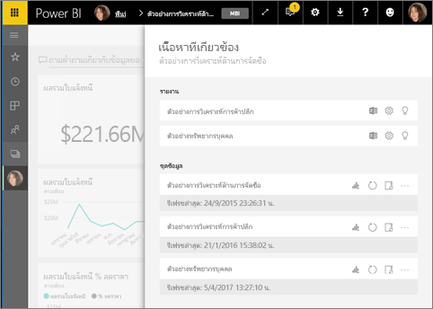
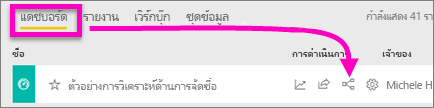
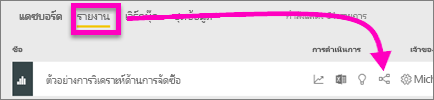
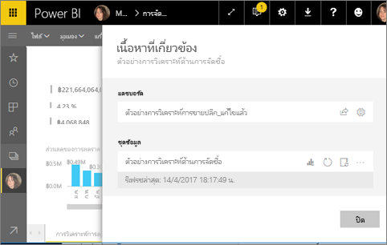
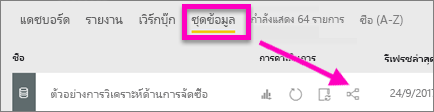
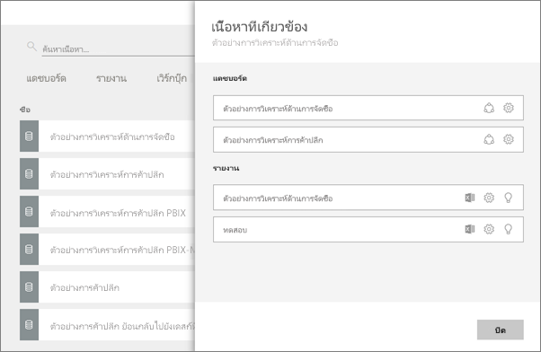

# ดูเนื้อหาที่เกี่ยวข้องในบริการ Power BI
บานหน้าต่าง**เนื้อหาที่เกี่ยวข้อง**แสดงว่าเนื้อหาPower BI service แดชบอร์ด รายงาน และชุดข้อมูลของคุณเชื่อมต่อกันอย่างไร  และก็ดียิ่งขึ้น จากบานหน้าต่างนี้คุณสามารถดำเนินการงานทั่วไปเช่นการรีเฟรช เปลี่ยนชื่อ สร้างข้อมูลเชิงลึก และอื่น ๆ อีกมาก เลือกรายงานที่เกี่ยวข้องหรือแดชบอร์ด และจะเปิดในพื้นที่ทำงานของ Power BI ขึ้น   

อย่างที่คุณอาจเคยสังเกคว่ารายงานจะถูกสร้างบนชุดข้อมูล แสดงภาพรายงานแล้วปักหมุดอยู่บนแดชบอร์ด และภาพแดชบอร์ดก็ลิงก์กลับไปยังรายงาน แต่คุณจะทราบได้อย่างไรว่าแดชบอร์ดไหนแสดงภาพจากรายงานทางการตลาดของคุณ และคุณจะค้นหาแดชบอร์ดเหล่านั้นได้อย่างไร แดชบอร์ดของการจัดซื้อของคุณกำลังใช้การแสดงภาพจากชุดข้อมูลมากกว่าหนึ่งรายการหรือไม่ ถ้าเป็นเช่นนั้น พวกเขาตั้งชื่ออะไร และวิธีสามารถเปิดและแก้ไขเอกสารนั้นได้อย่างไร ชุดข้อมูล HR ของคุณที่กำลังใช้งานในรายงานหรือแดชบอร์ดใด ๆ คุณสามารถย้ายโดยไม่ต้องทำให้เกิลิงค์เสียหรือไม่ คำถามเหล่านี้ทั้งหมดสามารถได้รับการตอบบนบานหน้าต่าง**เนื้อหาที่เกี่ยวข้อง**  ไม่เพียงไม่บานหน้าต่างแสดงเนื้อหาที่เกี่ยวข้อง ยังอนุญาตให้คุณดำเนินการกับเนื้อหา และเปิดเนื้อหาที่เกี่ยวข้องได้อย่างง่ายดาย

> [!NOTE]
> ลักษณะการทำงานเนื้อหาที่เกี่ยวข้องไม่สามารถใช้งานได้สำหรับชุดข้อมูลแบบสตรีม
> 
> 

## ดูเนื้อหาที่เกี่ยวข้องของแดชบอร์ดหนึ่ง
ดูเนื้อหาที่เกี่ยวข้องของแดชบอร์ด จากนั้นให้ทำตามขั้นตอนด้านล่างวิดีโอแบบขั้นต่อขั้น เพื่อลองด้วยตนเองโดยใช้ชุดข้อมูลตัวอย่างการวิเคราะห์การจัดซื้อ

<iframe width="560" height="315" src="https://www.youtube.com/embed/B2vd4MQrz4M#t=3m05s" frameborder="0" allowfullscreen></iframe>

คุณจะต้องใช้อย่างน้อย สิทธิ์*ดู*เพื่อเปิดบานหน้าต่าง**เนื้อหาที่เกี่ยวข้อง** ในตัวอย่างนี้ เราใช้[ตัวอย่างการวิเคราะห์การจัดซื้อ](sample-procurement.md)

**วิธีที่ 1**

ในพื้นที่ทำงาน เลือกแท็บ **แดชบอร์ด** จากนั้นเลือกการ**มุมมองที่เกี่ยวข้อง**ไอคอน

 

**วิธีที่ 2**

ด้วยแดชบอร์ดเปิด เลือก    จากแถบเมนูด้านบน

บานหน้าต่าง**เนื้อหาที่เกี่ยวข้อง**เปิดขึ้น ซึ่งแสดงรายงานทั้งหมดที่มีการแสดงภาพที่ปักหมุดที่แดชบอร์ดและชุดข้อมูลที่เชื่อมโยงของพวกเขา สำหรับแดชบอร์ดนี้ มีการแสดงภาพปักหมุดจากรายงานที่แตกต่างกัน 3 รายงานและรายงานเหล่านั้นจะขึ้นอยู่กับชุดข้อมูลที่แตกต่างกัน 3 ชุด

จากที่นี่ คุณสามารถดำเนินการโดยตรงกับเนื้อหาที่เกี่ยวข้อง  ตัวอย่างเช่น เปลี่ยนชื่อรายงานเพื่อเปิด  สำหรับรายงานที่แสดงในรายการ ให้เลือกไอคอนเพื่อ[วิเคราะห์ใน Excel](service-analyze-in-excel.md) [เปลี่ยนชื่อ](service-rename.md)หรือ[รับข้อมูลเชิงลึก](service-insights.md) สำหรับชุดข้อมูล ให้เลือกไอคอนเพื่อ[สร้างรายงานใหม่](service-report-create-new.md), [รีเฟรช](refresh-data.md)เปลี่ยนชื่อ[วิเคราะห์ใน Excel](service-analyze-in-excel.md) [รับข้อมูลเชิงลึก](service-insights.md)หรือเปิดหน้าต่าง **ตั้งค่า**ชุดข้อมูล  

## ดูเนื้อหาที่เกี่ยวข้องของรายงาน
คุณจะต้องใช้อย่างน้อย สิทธิ์*ดู*เพื่อเปิดบานหน้าต่าง**เนื้อหาที่เกี่ยวข้อง** ในตัวอย่างนี้ เราใช้[ตัวอย่างการวิเคราะห์การจัดซื้อ](sample-procurement.md)

**วิธีที่ 1**

ในพื้นที่ทำงาน ให้เลือกแท็บ **รายงาน**จากนั้นเลือกการ**มุมมองที่เกี่ยวข้อง**ไอคอน

 

**วิธีที่ 2**

เปิดรายงานใน[มุมมองการอ่าน](service-reading-view-and-editing-view.md)และเลือกจากแถบเมนูด้านบน

บานหน้าต่าง**เนื้อหาที่เกี่ยวข้อง**เปิดขึ้น จะแสดงชุดข้อมูลเกี่ยวข้องและแดชบอร์ดทั้งหมดที่มีอย่างน้อยหนึ่งไทล์ที่ปักหมุดจากรายงาน สำหรับรายงานนี้ มีการจัดรูปแบบข้อมูลปักหมุดแดชบอร์ดแตกต่างกัน 2 ตัว

จากที่นี่ คุณสามารถดำเนินการโดยตรงกับเนื้อหาที่เกี่ยวข้อง  ตัวอย่างเช่น เลือกชื่อแดชบอร์ดเพื่อเปิด  สำหรับแดชบอร์ดใด ๆ ในรายการ ให้เลือกไอคอนเพื่อ[แชร แดชบอร์ดกับผู้อื่น](service-share-dashboards.md)หรือเปิดหน้าต่าง**การตั้งค่า**สำหรับแดชบอร์ด สำหรับชุดข้อมูล ให้เลือกไอคอนเพื่อ[สร้างรายงานใหม่](service-report-create-new.md) [รีเฟรช](refresh-data.md)เปลี่ยนชื่อ[วิเคราะห์ใน Excel](service-analyze-in-excel.md) [รับข้อมูลเชิงลึก](service-insights.md)หรือเปิดหน้าต่าง **การตั้งค่า**สำหรับชุดข้อมูล  

## ดูเนื้อหาที่เกี่ยวข้องกับชุดข้อมูล
คุณจะต้องใช้อย่างน้อย สิทธิ์*ดู*เพื่อเปิดบานหน้าต่าง**เนื้อหาที่เกี่ยวข้อง** ในตัวอย่างนี้ เราใช้[ตัวอย่างการวิเคราะห์การจัดซื้อ](sample-procurement.md)

ในพื้นที่ทำงาน ให้เลือกแท็บ**ชุดข้อมูล** และค้นหา**มุมมองที่เกี่ยวข้อง**ไอคอน

เลือกไอคอนเพื่อเปิดบานหน้าต่าง**เนื้อหาที่เกี่ยวข้อง**

จากที่นี่ คุณสามารถดำเนินการโดยตรงกับเนื้อหาที่เกี่ยวข้อง  ตัวอย่างเช่น เลือกชื่อแดชบอร์ดหรือรายงานเมื่อต้องการเปิด  สำหรับแดชบอร์ดใด ๆ ในรายการ ให้เลือกไอคอนเพื่อ[แชร แดชบอร์ดกับผู้อื่น](service-share-dashboards.md)หรือเปิดหน้าต่าง**การตั้งค่า**สำหรับแดชบอร์ด สำหรับรายงาน ให้เลือกไอคอนเพื่อ[วิเคราะห์ใน Excel](service-analyze-in-excel.md) [เปลี่ยนชื่อ](service-rename.md)หรือ[รับข้อมูลเชิงลึก](service-insights.md)  

## ข้อจำกัดและการแก้ไขปัญหา
* ถ้าเบราว์เซอร์ของคุณไม่มีพื้นที่เพียงพอ คุณจะไม่เห็นตัวเลือก**มุมมองที่เกี่ยวข้อง**แต่คุณจะยังคงเห็นไอคอนที่เกี่ยวข้องกับมุมมอง เลือกไอคอนเพื่อเปิดบานหน้าต่าง**เนื้อหาที่เกี่ยวข้อง**
* เมื่อต้องเปิดเนื้อหาที่เกี่ยวข้องสำหรับรายงาน คุณจำเป็นต้องอยู่ใน[มุมมองการอ่าน](service-reading-view-and-editing-view.md)
* เนื้อหาที่เกี่ยวข้องจะใช้งานใน Power BI Desktop ไม่ได้
* ลักษณะการทำงานเนื้อหาที่เกี่ยวข้องไม่สามารถใช้งานได้สำหรับชุดข้อมูลแบบสตรีม

## ขั้นตอนถัดไป
* [เริ่มต้นใช้งานบริการ Power BI](service-get-started.md)
* มีคำถามเพิ่มเติมหรือไม่ [ลองไปที่ชุมชน Power BI](http://community.powerbi.com/)

