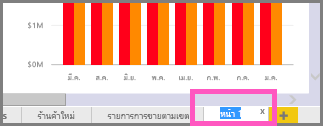

# เปลี่ยนชื่อเกือบทุกสิ่งใน Power BI service
บทความนี้สอนวิธีการเปลี่ยนชื่อแดชบอร์ด รายงาน หน้ารายงาน เวิร์กบุ๊ก ชุดข้อมูล แอปฯ และพื้นที่ทำงานในบริการ Power BI service

**ฉันสามารถเปลี่ยนชื่อได้อย่างไร**

| ชนิดเนื้อหา | ฉันเป็นผู้เขียนหรือผู้สร้าง | ที่แชร์กับฉัน |
| --- | --- | --- |
| แดชบอร์ดในพื้นที่ทำงาน |ใช่ |ไม่ใช่ |
| รายงานในพื้นที่ทำงาน |ใช่ |ไม่ใช่ |
| สมุดงานในพื้นที่ทำงาน |ใช่ |ไม่ใช่ |
| ชุดข้อมูลในพื้นที่ทำงาน |ใช่ |ไม่ใช่ |
| พื้นที่ทำงานของแอป |ใช่ ถ้าคุณเป็นเจ้าของ หรือมีสิทธิ์ระดับผู้ดูแลระบบ |ไม่ใช่ |
| แอปที่เผยแพร่แล้ว |ไม่ใช่จากหน้าจอแอป แต่ชื่อแอปสามารถเปลี่ยนจากพื้นที่ทำงานแอป และเผยแพร่ใหม่ด้วยชื่อใหม่ถ้าคุณมีสิทธิ์ระดับผู้ดูแลระบบ |ไม่ใช่ |
| เนื้อหาของแอป (แดชบอร์ด รายงาน เวิร์กบุ๊ก ชุดข้อมูล) |ไม่ใช่จากหน้าจอแอป แต่ชื่อแอปสามารถเปลี่ยนจากพื้นที่ทำงานแอป และเผยแพร่ใหม่ด้วยชื่อใหม่ถ้าคุณมีสิทธิ์ระดับผู้ดูแลระบบ |ไม่ใช่ |
| เนื้อหาใน**แชร์กับฉัน** |ไม่ใช่ |ไม่ใช่ |

## เปลี่ยนชื่อแดชบอร์ด รายงาน หรือเวิร์กบุ๊ก
1. เริ่มต้นในพื้นที่ทำงานและเลือก**แดชบอร์ด** **รายงาน**หรือแท็บ**สมุดงาน** เลื่อนเมาส์หนือรายการที่จะเปลี่ยนชื่อ แล้วเลือกไอคอนรูปเฟือง ถ้าไม่มีไม่มีไอคอนรูปเฟือง คุณไม่มีสิทธิ์ในการเปลี่ยนชื่อ
   
   
2. บนหน้าการตั้งค่า พิมพ์ชื่อใหม่ แล้วเลือก**บันทึก**
   
   

## เปลี่ยนชื่อชุดข้อมูล
1. เริ่มต้นในพื้นที่ทำงานและเลือกแท็บ**ชุดข้อมูล**
   
   
2. เลื่อนเมาส์เหนือรายการที่จะเปลี่ยนชื่อ เลือกจุดไข่ปลา (...), และเลือก**เปลี่ยนชื่อ**  
   
      
   
   > [!NOTE]
   > ตัวเลือกในดรอปดาวน์ลงจะแตกต่างออกไป
   > 
   > 
3. บนหน้าการตั้งค่า พิมพ์ชื่อใหม่ แล้วเลือก**บันทึก**
   
     

## เปลี่ยนชื่อพื้นที่ทำงานของแอป
ทุกคนที่มีสิทธิ์ระดับผู้ดูแลระบบสามารถเปลี่ยนชื่อพื้นที่ทำงานของแอปได้

1. เริ่มในพื้นที่ทำงานแอปฯที่คุณต้องการเปลี่ยนชื่อ
2. ในมุมบนขวา เลือกจุดไข่ปลา (...) แล้วเลือก**แก้ไขพื้นที่ทำงาน** ถ้าคุณไม่เห็นตัวเลือกนี้ คุณไม่มีสิทธิ์ในการเปลี่ยนชื่อพื้นที่ทำงานนี้ 
   
    
3. พิมพ์ชื่อพื้นที่ทำงานใหม่ และเลือก**บันทึก**
   
   

## เปลี่ยนชื่อหน้าในรายงาน
ไม่ชอบชื่อของหน้าในรายงาน Power BI ของคุณใช่ไหม  เปลี่ยนชื่อใหม่ เพียงคลิกเดียว สามารถเปลี่ยนชื่อใน[มุมมองการแก้ไขรายงาน](service-interact-with-a-report-in-editing-view.md)ได้

1. เปิดรายงานใน[มุมมองการแก้ไข](consumer/end-user-reading-view.md)
2. ค้นหาแท็บหน้ารายงานที่ด้านล่างของหน้าต่าง Power BI
   
    
3. เปิดหน้ารายงานที่คุณต้องการเปลี่ยนชื่อ โดยเลือกแท็บ
4. ดับเบิลคลิกชื่อบนแท็บเพื่อไฮไลต์  
   
    
5. พิมพ์ชื่อหน้ารายงานใหม่ แล้วเลือก ENTER
   
    

## ข้อควรพิจารณาและการแก้ไขปัญหา
* ถ้ารายการที่ถูกเปลี่ยนชื่อได้แชร์กับคุณ หรือเป็นส่วนหนึ่งของชุดเนื้อหา คุณจะไม่เห็นไอคอนรูปเฟือง และคุณจะไม่สามารถเข้าถึงการตั้งค่า
* บนแท็บ**ชุดข้อมูล**แท็บ ถ้าคุณไม่เห็นจุดไข่ปลา (...) ให้ขยายหน้าต่างเบราว์เซอร์ของคุณ

มีคำถามเพิ่มเติมหรือไม่ [ลองไปที่ชุมชน Power BI](http://community.powerbi.com/)

