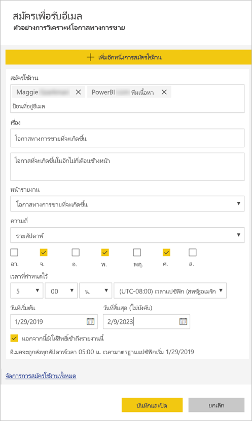

# สมัครใช้งานรายงานและแดชบอร์ดในบริการ Power BI สำหรับตัวคุณเองและผู้อื่น

คุณสามารถสมัครใช้งานสำหรับคุณเองและเพื่อนร่วมงานในหน้ารายงาน แดชบอร์ด และรายงานที่มีการแบ่งหน้าที่สำคัญที่สุดสำหรับคุณ Power BI ส่งอีเมลสแนปช็อตไปยังกล่องจดหมายของคุณ คุณแจ้งความถี่ในการรับอีเมลให้ Power BI ทราบ: รายวัน รายสัปดาห์  รายชั่วโมง รายเดือน หรือวันละครั้งหลังจากรีเฟรชข้อมูลเริ่มต้น  หากคุณเลือกรายวัน รายสัปดาห์ รายชั่วโมง หรือรายเดือน คุณสามารถเลือกเวลาที่คุณต้องการให้สมัครใช้งานได้  โดยรวมแล้ว คุณสามารถตั้งค่าการสมัครใช้งานได้มากถึง 24 รายการต่อรายงานหรือแดชบอร์ด

 

คุณสามารถสร้างการสมัครใช้งานในบริการ Power BI เท่านั้น คุณได้รับอีเมลพร้อมสแน็ปช็อตของหน้ารายงานหรือแดชบอร์ดพร้อมลิงก์เพื่อเปิดรายงานหรือแดชบอร์ด บนอุปกรณ์เคลื่อนท่ีที่่ติดตั้งแอป Power BI ให้เลือกลิงก์นี้เพื่อเปิดใช้ Power BI แทนการเปิดรายงานหรือแดชบอร์ดบนเว็บไซต์ Power BI)

## ข้อกำหนด

**สร้าง**การสมัครใช้งานสามารถทำได้โดย:

- ผู้ใช้ต้องมีสิทธิ์การใช้งาน Pro
- ผู้ใช้ที่ดูเนื้อหาในพื้นที่ทำงาน Premium หรือแอปอาจยังเป็นสมาชิกที่ใช้งานอยู่แม้ว่าจะไม่มีสิทธิ์การใช้งาน Power BI Pro

คุณไม่จำเป็นต้องแก้ไขการอนุญาตในเนื้อหา (แดชบอร์ดหรือรายงาน) เพื่อสร้างการสมัครใช้งานสำหรับตัวคุณเอง แต่คุณต้องมีสิทธิ์แก้ไขเพื่อสร้างการสมัครใช้งานสำหรับผู้อื่น 

## สมัครใช้งานในแดชบอร์ด หน้ารายงาน หรือรายงานที่มีการแบ่งหน้า

ไม่ว่าคุณจะสมัครใช้งานในแดชบอร์ด รายงาน หรือรายงานที่มีการแบ่งหน้า กระบวนการจะคล้ายกัน ปุ่มเดียวกันนี้ช่วยให้คุณสามารถบอกรับแดชบอร์ดหรือรายงานของบริการ Power BI

การสมัครใช้งานในรายงานที่มีการแบ่งหน้าจะแตกต่างกันเล็กน้อย ดูที่ [สมัครใช้งานในรายงานที่มีการแบ่งหน้าสำหรับตัวคุณเองและผู้อื่นในบริการของ Power BI](paginated-reports-subscriptions.md) สำหรับรายละเอียด
 
.

1. เปิดแดชบอร์ดหรือรายงาน
2. จากแถบเมนูด้านบน ให้เลือก**สมัครใช้งาน**หรือเลือกไอคอนซองจดหมาย
   
   

3. ใช้แถบเลื่อนสีเหลืองเพื่อเปิดการสมัครใช้งานและปิด  ตั้งค่าแถบเลื่อนเป็น**ปิด**จะไม่ลบการสมัครใช้งาน เมื่อต้องลบการสมัครใช้งาน เลือกไอคอนถังขยะ

4. อีเมลของคุณอยู่ในช่อง  **สมัครใช้งาน** แล้ว คุณสามารถเพิ่มที่อยู่อีเมลอื่นในการสมัครใช้งานได้เช่นกัน แต่จะอยู่ในโดเมนเดียวกันเท่านั้น ถ้ารายงานหรือแดชบอร์ดได้รับการโฮสต์[ความจุพรีเมียม](service-premium-what-is.md) คุณจะสามารถสมัครใช้งานสำหรับผู้อื่น ได้โดยใช้แต่ละที่อยู่อีเมลและนามแฝงของกลุ่ม ถ้ารายงานหรือแดชบอร์ดไม่ได้รับการโฮสต์ในความจุพรีเมียม คุณสามารถสมัครใช้งานสำหรับคนอื่นได้ แต่พวกเขาก็ต้องมีสิทธิ์การใช้งาน Power BI Pro ด้วย โปรดดู [ข้อควรพิจารณาและการแก้ไขปัญหา](#considerations-and-troubleshooting) ด้านล่างสำหรับรายละเอียดเพิ่มเติม 

5. กรอกรายละเอียดอีเมล **หัวเรื่อง** และ **ข้อความ** 

5. เลือก **ความถี่** สำหรับการสมัครใช้งาน: **รายวัน**, **รายชั่วโมง**, **รายสัปดาห์**, **รายเดือน** หรือ **หลังจากรีเฟรชข้อมูล (รายวัน)**  หากต้องการรับอีเมลการสมัครสมาชิกเฉพาะในบางวัน ให้เลือก **รายวัน** หรือ **รายสัปดาห์** แล้วเลือกวันที่คุณต้องการรับ  ตัวอย่างเช่น หากคุณต้องการรับอีเมลการสมัครรับข้อมูลในวันทำงานเท่านั้น ให้เลือก **รายสัปดาห์** และยกเลิกการเลือกช่องสำหรับ**เสาร์**และ**อาทิตย์**  ถ้าคุณเลือก**รายเดือน** ให้ใส่วันของเดือนที่คุณต้องการรับอีเมลที่สมัครใช้งาน  

6. หากคุณเลือก **รายวัน**, **รายชั่วโมง**, **รายเดือน**, หรือ**รายสัปดาห์** คุณสามารถเลือก **เวลาตามกำหนดการ** สำหรับการสมัครใช้งานได้  คุณใช้เวลาเป็นชั่วโมงหรือเมื่อ 15, 30 หรือ 45 นาทีที่ผ่านมา  เลือกเช้า (AM) หรือบ่าย/เย็น (PM) คุณยังสามารถระบุโซนเวลาได้อีกด้วย  หากคุณเลือก **รายชั่วโมง** ให้เลือก **เวลาตามกำหนดการ** ที่คุณต้องการให้การสมัครใช้งานเริ่มต้น และจะเรียกใช้ทุก ๆ ชั่วโมงหลังจากนั้น

7. ตามค่าเริ่มต้น วันเริ่มต้นสำหรับการสมัครใช้งานคือ วันที่คุณสร้าง คุณมีตัวเลือกเพื่อเลือกวันที่สิ้นสุด หากคุณไม่ได้กำหนดวันที่สิ้นสุด วันที่สิ้นสุดจะเป็นไปโดยอัตโนมัติหนึ่งปีหลังจากวันที่เริ่มต้น คุณสามารถเปลี่ยนเป็นวันใดก็ได้ในอนาคต (สูงสุด 9999 ปี) ได้ตลอดเวลาก่อนที่การสมัครใช้งานจะสิ้นสุดลง เมื่อการสมัครใช้งานถึงวันที่สิ้นสุด การทำงานจะหยุดจนกว่าคุณจะเปิดใช้งานอีกครั้ง คุณจะได้รับการแจ้งเตือนก่อนวันที่สิ้นสุดตามกำหนดเพื่อถามว่าคุณต้องการที่จะขยายเวลาออกไปไหม    

    ในภาพถ่ายหน้าจอด้านล่างนี้ โปรดสังเกตว่า เมื่อคุณสมัครใช้งานรายงานหนึ่ง จริง ๆ แล้วคุณกำลังสมัครใช้งานไปยัง*หน้า*รายงาน  เมื่อต้องการสมัครใช้งานมากกว่าหนึ่งหน้าในรายงาน ให้เลือก**เพิ่มการสมัครใช้งานอื่น**และเลือกหน้าอื่น 
      
     

7. เลือก **บันทึกและปิด** ผู้สมัครใช้งานจะได้รับอีเมลและภาพรวมของหน้าแดชบอร์ดหรือหน้ารายงานสำหรับความถี่และเวลาที่คุณเลือก โดยรวมคุณสามารถสร้างการสมัครใช้งานได้ถึง 24 รายการต่อรายงานหรือแดชบอร์ดและสามารถให้ผู้รับ เวลา และความถี่ที่ไม่ซ้ำสำหรับแต่ละการสมัครใช้งานได้  การสมัครใช้งานทั้งหมดตั้งค่าเป็น **หลังจากรีเฟรชข้อมูล** สำหรับแดชบอร์ดหรือรายงานของคุณจะยังคงส่งอีเมลหลังจากรีเฟรชตามกำหนดเวลาครั้งแรกเท่านั้น   
      
   > [!TIP]
   > ต้องการส่งอีเมลจากการสมัครใช้งานทันทีหรือตามความต้องการได้ทุกเวลาหรือไม่ เลือก**เรียกใช้ทันที**สำหรับการสมัครใช้งานสำหรับแดชบอร์ดหรือรายงานที่คุณต้องการส่ง คุณจะเห็นการแจ้งเตือนว่าอีเมลที่กำลังจะมาถึงทุกคนสำหรับการสมัครใช้งานเฉพาะ  การดำเนินการนี้จะไม่นับรวมขีดจำกัดของการเรียกใช้การสมัครใช้งานตามกำหนดการ 24 ต่อวันต่อรายงานหรือแดชบอร์ด จะไม่ทริกเกอร์การรีเฟรชข้อมูลของชุดข้อมูลเบื้องต้น 
   > 
   > 
   
## ภาษาของอีเมล

อีเมลและสแนปช็อตจะใช้ภาษาที่ถูกตั้งในการตั้งค่า Power BI (ดู[ภาษาที่รองรับและประเทศ/ภูมิภาคสำหรับ Power BI](supported-languages-countries-regions.md)) ถ้าไม่กำหนดภาษา Power BI จะใช้ภาษาตามการตั้งค่าตำแหน่งที่ตั้งในเบราว์เซอร์ปัจจุบันของคุณ เมื่อต้องการดู หรือตั้งค่าการกำหนดลักษณะภาษาของคุณ ให้เลือกไอคอนรูปเฟือง   >  **ตั้งค่า > ทั่วไป > ภาษา** 

## จัดการการสมัครใช้งานของคุณ
เฉพาะบุคคลที่สร้างการสมัครใช้งานเท่านั้นที่สามารถจัดการได้  มีสองเส้นทางที่จะไปยังหน้าจอสำหรับการจัดการการสมัครใช้งาน  สิ่งแรกคือเลือก**จัดการการสมัครใช้งานทั้งหมด**จาก**สมัครใช้งานอีเมล่**ที่กล่องโต้ตอบ (ดูภาพถ่ายหน้าจอด้านล่าง ขั้นตอนที่ 4 ด้านบน) ที่สองคือ เลือกไอคอนฟันเฟือง Power BIจากแถบเมนูด้านบน แล้วเลือก**การตั้งค่า**

การสมัครใช้งานแบบเฉพาะที่ปรากฏ จะขึ้นอยู่กับพื้นที่ทำงานที่กำลังใช้งานอยู่  เพื่อดูการสมัครใช้งานสำหรับพื้นที่ทำงานทั้งหมดในครั้งเดียว ให้ดูให้แน่ใจว่า**พื้นที่ทำงานของฉัน**นั้นเปิดใช้งานอยู่ เพื่อทำความเข้าใจพื้นที่ทำงาน ให้ดู[พื้นที่ทำงานใน Power BI](service-create-workspaces.md)

การสมัครใช้งานจะสิ้นสุดลง ถ้าสิทธิ์การใช้งาน Pro หมดอายุ เจ้าของจะลบแดชบอร์ดหรือรายงาน หรือบัญชีผู้ใช้ที่ใช้ในการสมัครใช้งานจะถูกลบ

## ข้อควรพิจารณาและการแก้ไขปัญหา

* แดชบอร์ดที่มีไทล์ปักหมุดมากกว่า 25 หมุดหรือมี 4 หมุดปักที่หน้ารายงานสด อาจไม่แสดงข้อมูลอย่างสมบูรณ์ในอีเมลที่สมัครใช้งานที่ส่งถึงผู้ใช้  การสมัครใช้งานในแดชบอร์ดเกินไทล์จำนวนเหล่านี้จะไม่ถูกบล็อก อย่างไรก็ตาม อาจไม่ได้รับการสนับสนุนถ้าคุณประสบกับปัญหา พิจารณาปรับเปลี่ยนให้เหมาะสมเพื่อให้อยู่ภายในการสนับสนุน
* ในบางโอกาส การสมัครใช้งานทางอีเมลอาจใช้เวลานานกว่าสิบห้านาทีในการส่งมอบให้กับผู้รับ ในกรณีนี้ เราขอแนะนำให้ใช้งานการรีเฟรชข้อมูล และสมัครใช้งานทางอีเมลในเวลาอื่นเพื่อให้แน่ใจว่าจะสามารถส่งได้ทันเวลา ถ้าปัญหายังคงอยู่ ติดต่อฝ่ายสนับสนุน Power BI
* สำหรับการสมัครใช้งานทางอีเมลของแดชบอร์ด ไทล์ใดก็ตามที่ใช้ความปลอดภัยระดับแถว (RLS) จะไม่แสดงขึ้นมา  
* สำหรับการสมัครใช้งานทางอีเมลของรายงาน ถ้าชุดข้อมูลใช้ RLS คุณจะสามารถสร้างการสมัครใช้งานสำหรับตัวคุณเอง คุณไม่สามารถสมัครใช้งานผู้อื่นไปยังรายงานที่มีการรักษาความปลอดภัยระดับแถว (RLS) เว้นแต่ว่าคุณกำลังใช้รายงานที่มีการแบ่งหน้าซึ่งจะช่วยให้คุณส่งการสมัครสมาชิกไปยังผู้อื่นโดยใช้บริบทความปลอดภัยของคุณ 
* การสมัครใช้งานหน้ารายงานจะถูกผูกกับชื่อของหน้ารายงาน ถ้าคุณสมัครใช้งานหน้ารายงาน และเปลี่ยนชื่อ หลังจากนั้นคุณจะต้องสร้างการสมัครใช้งานใหม่
* องค์กรของคุณอาจกำหนดการตั้งค่าบางอย่างใน Azure Active Directory ซึ่งอาจจำกัดความสามารถในการใช้การบอกรับอีเมลใน Power BI  ขีดจำกัดความสามารถเหล่านี้รวมถึงแต่ไม่จำกัดเพียง การรับรองความถูกต้องแบบหลายปัจจัยหรือข้อจำกัดช่วง IP เมื่อเข้าถึงแหล่งข้อมูล
* ขณะนี้การสมัครใช้งานทางอีเมลสำหรับรายงาน / แดชบอร์ดที่ใช้ชุดข้อมูลการเชื่อมต่อสดไม่ได้รับการสนับสนุนเมื่อสมัครใช้งานผู้ใช้อื่นนอกเหนือจากตัวคุณเอง ยกเว้นว่าคุณกำลังใช้รายงานที่มีการแบ่งหน้าซึ่งจะช่วยให้คุณส่งการสมัครใช้งานไปยังผู้อื่นโดยใช้บริบทความปลอดภัยของคุณ 
* การสมัครใช้งานด้วยอีเมลไม่รองรับ[รูปแบบกำหนดเอง](power-bi-custom-visuals.md)ส่วนใหญ่  ข้อยกเว้นหนึ่งคือ รูปแบบกำหนดเองเหล่านั้น[ได้รับการรับรอง](power-bi-custom-visuals-certified.md)  
* การสมัครใช้งานด้วยอีเมลไม่รองรับรูปแบบ R วิชวลแบบกำหนดเองส่วนใหญ่  
* สมัครใช้งานด้วยอีเมล จะได้รับตัวกรองรายงานสถานะเริ่มต้นและตัวแบ่งส่วนข้อมูล การเปลี่ยนแปลงใด ๆ กับค่าเริ่มต้นที่คุณทำหลังการสมัครใช้งานจะไม่แสดงในอีเมล  รายงานที่มีการแบ่งหน้าจะสนับสนุนความสามารถนี้และอนุญาตให้คุณตั้งค่าพารามิเตอร์เฉพาะต่อการสมัครใช้งานได้   
* การสมัครใช้งานแดชบอร์ด โดยเฉพาะ บางชนิดของไทล์จะไม่รองรับ  ซึ่งรวมถึง สตรีมไทล์ วิดีโอไทล์ ไทล์เนื้อหาเว็บแบบกำหนดเอง     
* ถ้าคุณแชร์แดชบอร์ดกับเพื่อนร่วมงานภายนอกผู้เช่าของคุณ คุณจะไม่สามารถสร้างการสมัครใช้งานสำหรับเพื่อนร่วมงานนั้นด้วยเช่นกัน ดังนั้น ถ้าคุณคือ aaron@xyz.com คุณสามารถแชร์กับanyone@ABC.com ได้ แต่คุณยังไม่สามารถสมัครใช้งานสำหรับanyone@ABC.comได้ และพวกเขาไม่สามารถสมัครใช้งานไปยังเนื้อหาที่ใช้ร่วมกันได้      
* Power BI หยุดรีเฟรชชั่วคราวบนชุดข้อมูลที่เกี่ยวข้องกับแดชบอร์ดและรายงานที่มีการเยี่ยมชมในมากกว่าสองเดือน โดยอัตโนมัติ  อย่างไรก็ตาม ถ้าคุณเพิ่มการสมัครใช้งานแดชบอร์ดหรือรายงาน จะไม่สามารถหยุดชั่วคราวถึงแม้ว่าจะไม่ได้เข้าเยี่ยมชม    
* ถ้าคุณไม่ได้รับอีเมลสมัครใช้งาน ให้ตรวจสอบว่า User Principal Name (UPN) สามารถรับอีเมลได้ 
* ถ้าแดชบอร์ดหรือรายงานของคุณอยู่ในความจุพรีเมียม คุณสามารถใช้นามแฝงอีเมลของกลุ่มสำหรับการสมัครใช้งานแทนการสมัครใช้งานเพื่อนร่วมงานต่าง ๆ ด้วยหนึ่งที่อยู่อีเมลในแต่ละครั้งได้ นามแฝงเป็นไปตามการไดเรกทอรีที่ใช้งานปัจจุบัน 

## ขั้นตอนถัดไป

- [สมัครใช้งานในรายงานที่มีการแบ่งหน้าสำหรับตัวคุณเองและผู้อื่นในบริการของ Power BI](paginated-reports-subscriptions.md)
- มีคำถามเพิ่มเติมหรือไม่? [ลองถามชุมชน Power BI](http://community.powerbi.com/)    
- [อ่านโพสต์ในบล็อก](https://powerbi.microsoft.com/blog/introducing-dashboard-email-subscriptions-a-360-degree-view-of-your-business-in-your-inbox-every-day/)
