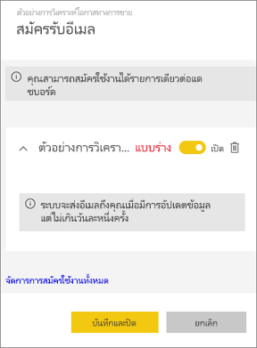
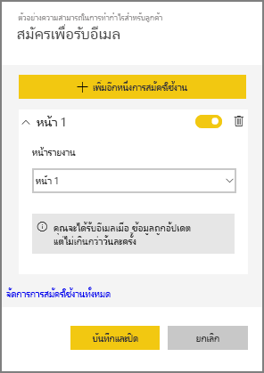
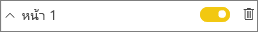
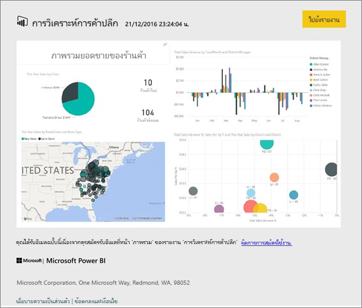
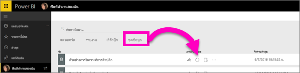

# สมัครใช้งานรายงานและแดชบอร์ดในบริการ Power BI (app.powerbi.com)
ไม่เคยที่จะเท่าทันแดชบอร์ดและรายงานที่สำคัญที่สุดของคุณอย่างนี้มาก่อน สมัครใช้งานหน้ารายงานและแดชบอร์ดที่สำคัญที่สุดคุณ และ Power BI จะส่งอีเมสแนปช็อตถึงคุณ คุณบอก Power BI ความถี่ที่คุณต้องการรับอีเมล จากวันละครั้งถึงหนึ่งครั้งต่อสัปดาห์ 

อีเมลและสแนปช็อตจะใช้ภาษาที่ถูกตั้งในการตั้งค่า Power BI (ดู[ภาษาที่รองรับและประเทศ/ภูมิภาคสำหรับ Power BI](supported-languages-countries-regions.md)) ถ้าไม่กำหนดภาษา Power BI จะใช้ภาษาตามการตั้งค่าตำแหน่งที่ตั้งในเบราว์เซอร์ปัจจุบันของคุณ เมื่อต้องการดู หรือตั้งค่าการกำหนดลักษณะภาษาของคุณ ให้เลือกไอคอนรูปเฟือง  **> ตั้งค่า > ทั่วไป > ภาษา** 

> [!NOTE]
> สามารถสร้างการสมัครใช้งานบริการ Power BI เท่านั้น เมื่อคุณได้รับอีเมล จะรวมถึงลิงก์ "ไปยังรายงาน/แดชบอร์ด" บนอุปกรณ์เคลื่อนท่ีที่่ติดตั้งแอป Power BI ให้เลือกลิงก์นี้เพื่อเปิดใช้แอป (โดยเป็นค่าตรงข้ามกับค่าเริ่มต้นการดำเนินการเปิดรายงานหรือแดชบอร์ดบนเว็บไซต์ Power BI)
> 
> 

ดู Sirui ตั้งค่าการสมัครใช้งานอีเมลสำหรับรายงาน แล้ว ทำตามคำแนะนำทีละขั้นตอนด้านล่างวิดีโอเพื่อลองทำด้วยตนเอง

<iframe width="560" height="315" src="https://www.youtube.com/embed/saQx7G0pxhc" frameborder="0" allowfullscreen></iframe>

## ความต้องการ
การ**สร้าง** การสมัครใช้งานเป็นฟีเจอร์ของ Power BI Pro และคุณต้องมีสิทธิ์ดู หรือแก้ไขเนื้อหา (แดชบอร์ดหรือรายงาน)

## สมัครใช้งานแดชบอร์ด

1. เปิดแดชบอร์ด
2. จากแถบเมนูด้านบน ให้เลือก**สมัครใช้งาน**หรือเลือกไอคอนซองจดหมาย
   
   
3. ใช้แถบเลื่อนสีเหลืองเพื่อเปิดการสมัครใช้งานและปิด  ตั้งค่าแถบเลื่อนเป็นปิดจะไม่ลบการสมัครใช้งาน เมื่อต้องลบการสมัครใช้งาน เลือกไอคอนถังขยะ
   
   
4. ให้เลือก**บันทึกและปิด**เมื่อต้องบันทึกการสมัครใช้งาน คุณจะได้รับอีเมลสแนปช็อตของแดชบอร์ดแต่ละครั้งที่มีการเปลี่ยนแปลงใด ๆ ของชุดข้อมูลพื้นฐาน ถ้าแดชบอร์ด่รีเฟรชมากกว่าหนึ่งครั้งต่อวัน คุณจะได้รับสแนปช็อตอีเมลที่ได้หลังจากรีเฟรชแรกเท่านั้น
   
   
   
   > [!TIP]
   > ต้องการดูอีเมลที่ทันทีหรือไม่ ทริกเกอร์อีเมลโดยการรีเฟรชหนึ่งของชุดข้อมูลเกี่ยวข้องกับแดชบอร์ด (ถ้าคุณไม่มีสิทธิ์ในการแก้ไขชุดข้อมูล คุณจะต้องขอให้บุคคลที่มีสิทธิ์เหล่านั้นทำให้คุณ) เมื่อต้องการตรวจสอบชุดข้อมูลว่าูกใช้ในการสร้างแดชบอร์ด จากแดชบอร์ด ให้เลือกแบบ**มุมมองที่เกี่ยวข้อง**ไอคอนเพื่อเปิด**เนื้อหาที่เกี่ยวข้อง**แล้ว เลือกไอคอนรีเฟรช 
   > 
   > 
   
   

## สมัครใช้งานหน้ารายงาน
1. เปิดรายงานใน[มุมมองการอ่าน](service-reading-view-and-editing-view.md)
2. จากแถบเมนูด้านบน เลือก**สมัครใช้งาน**
   
   
3. คุณสามารถสมัครใช้งานรายงานหนึ่งหน้าในแต่ละครั้ง เลือกหน้ารายงานเฉพาะจากรายการดร๊อปดาวน์
   
   
   
   ดำเนินต่อเพื่อเพิ่มหน้ารายงาน
4. ใช้แถบเลื่อนสีเหลืองเพื่อเปลี่ยนการสมัครใช้งานในแต่ละหน้า  ตั้งค่าแถบเลื่อนเป็นปิดจะไม่ลบการสมัครใช้งาน เมื่อต้องลบการสมัครใช้งาน เลือกไอคอนถังขยะ
   
   
5. ให้เลือก**บันทึกและปิด**เมื่อต้องบันทึกการสมัครใช้งาน คุณจะได้รับสแนปช็อตอีเมลของแต่ละหน้ารายงานเมื่อรายงานถูกรีเฟรช ถ้ารายงานไม่รีเฟรช คุณจะไม่ได้รับอีเมลที่เป็นสแนปช็อตในวันนั้น  ถ้ารายงานรีเฟรชมากกว่าหนึ่งครั้งต่อวัน คุณเท่านั้นจะได้รับอีเมลสแนปช็อตหลังจากรีเฟรชแรก
   
   
   
   > [!TIP]
   > ต้องการดูอีเมลที่ทันทีหรือไม่ ทริกเกอร์อีเมล โดยการเปิดชุดข้อมูลของคุณ แล้วเลือก**รีเฟรชทันที** ถ้าคุณไม่มีสิทธิ์ในการแก้ไขเมื่อต้องการชุดข้อมูล คุณจะต้องขอให้บุคคลที่มีสิทธิทำให้คุณ
   > 
   > 
   > 
   > 

## วิธีกำหนดกำหนดการของอีเมลสำหรับรายงานของคุณ
ตารางต่อไปนี้อธิบายความถี่ของที่คุณจะได้รับ tuทั้งหมดขึ้นอยู่กับวิธีการเชื่อมต่อของชุดข้อมูล ว่าแดชบอร์ดหรือรายงานใดถูกอ้าง (DirectQuery การเชื่อมต่อสด นำเข้าไปยัง Power BI หรือ Excel ใน OneDrive หรือ SharePoint Online) และในการสมัครใช้งานตัวเลือกพร้อมใช้งานและถูกเลือก (รายวัน ทุกสัปดาห์ หรือไม่มี)

|  | **DirectQuery** | **เชื่อมต่อแบบสด** | **รีเฟรชตามกำหนดกเวลา (นำเข้า)** | **ไฟล์ Excel ใน OneDrive/SharePoint Online** |
| --- | --- | --- | --- | --- |
| **ความถีที่่รายงาน/แดชบอร์ดจะได้รับการรีเฟรช** |ทุกๆ 15 นาที |Power BI จะตรวจสอบทุก 15 นาที และถ้ามีการเปลี่ยนแปลงชุดข้อมูล รายงานจะถูกรีเฟรช |ผู้ใช้เลือก ไม่ ทุกวัน หรือทุกสัปดาห์ ทุกวันไดจะได้ถึง 8 ครั้ง ทุกสัปดาห์ ที่จริงเป็นการกำหนดการรายสัปดาห์ที่ผู้ใชจะ้สร้างและตั้งค่าการเป็นสัปดาห์ละครั้งสองสามครั้ง และมักจะเป็นแบบทุกวัน |ทุกชั่วโมง |
| **มีการไม่ให้ผู้ใช้อีเมลสมัครเกินใช้งานได้อย่างไร** |มีตัวเลือก รายวัน หรือรายสัปดาห์ |ไม่มีตัวเลือก ผู้ใช้จะถูกส่งอีเมล้ารายงานรีเฟรชแต่ไม่มีมากกว่าหนึ่งครั้งต่อวัน |ถ้ากำหนดการรีเฟรชเป็นรายวัน ตัวเลือกคือรายสัปดาห์และรายวัน  ถ้ากำหนดการรีเฟรชเป็นรายสัปดาห์ ตัวเลือกคือรายสัปดาหเท่านั้น |ไม่มีตัวเลือก ผู้ใช้จะได้รับอีเมลเมื่อใดก็ ตามที่มีการปรับปรุงชุดข้อมูล แต่ไม่มากกว่าหนึ่งครั้งต่อวัน |

## จัดการการสมัครใช้งานของคุณ
มี 2 เส้นทางที่จะไปยังหน้าจอสำหรับการจัดการการสมัครใช้งาน  สิ่งแรกคือเลือก**จัดการการสมัครใช้งานทั้งหมด**จาก**สมัครใช้งานอีเมล่**ที่กล่องโต้ตอบ (ดูขั้นตอนที่ 3 ด้านบน) ที่สองคือ เลือกไอคอนฟันเฟือง Power BIจากแถบเมนูด้านบน แล้วเลือก**การตั้งค่า**

การสมัครใช้งานแบบเฉพาะที่ปรากฏ จะขึ้นอยู่กับพื้นที่ทำงานที่กำลังใช้งานอยู่  เพื่อดูการสมัครใช้งานสำหรับพื้นที่ทำงานทั้งหมดในครั้งเดียว ให้ดูให้แน่ใจว่า**พื้นที่ทำงานของฉัน**นั้นเปิดใช้งานอยู่ เพื่อทำความเข้าใจพื้นที่ทำงาน ให้ดู[พื้นที่ทำงานใน Power BI](service-create-distribute-apps.md)

การสมัครใช้งานจะสิ้นสุดลง ถ้าสิทธิ์การใช้งาน Pro หมดอายุ แดชบอร์ดหรือรายงานจะถูกลบโดยเจ้าของ บัญชีผู้ใช้ที่ใช้ในการสมัครใช้งานจะถูกลบ

## ข้อควรพิจารณาและการแก้ไขปัญหา
* ในเวลาปัจจุบัน สมัครใช้งานแดชบอร์ดหรือรายงานที่มาจากชุดเนื้อหาหรือแอป Power BI ไม่ได้ แต่ยังมีวิธีแก้ปัญหา ให้ทำสำเนาของรายงาน/แดชบอร์ด และเพิ่มการสมัครใช้งานไปยังเวอร์ชันนั้นแทน
* การสมัครใช้งานหน้ารายงานจะถูกผูกกับชื่อของหน้ารายงาน ถ้าคุณสมัครใช้งานหน้ารายงาน และเปลี่ยนชื่อ คุณจะต้องสร้างการสมัครใช้งานใหม่
* สำหรับการสมัครใช้งานโดยใช้อีเมลบนชุดข้อมูลที่เชื่อมต่อสด คุณจะได้รับอีเมลเมื่อข้อมูลมีการเปลี่ยนแปลง ดังนั้น ถ้าเกิดรีเฟรชขึ้นแต่ไม่มีการเปลี่ยนแปลงข้อมูล Power BI จะไม่ส่งอีเมล
* การสมัครใช้งานด้วยอีเมล่ไม่รองรับ[รูปแบบกำหนดเอง](power-bi-custom-visuals.md)ส่วนใหญ่  ข้อยกเว้นหนึ่งคือ รูปแบบกำหนดเองเหล่านั้น[ได้รับการรับรอง](power-bi-custom-visuals-certified.md)  
* สมัครใช้งานด้วยอีเมล จะได้รับตัวกรองรายงานสถานะเริ่มต้นและตัวแบ่งส่วนข้อมูล การเปลี่ยนแปลงใด ๆ กับค่าเริ่มต้นที่คุณทำก่อนการสมัครใช้งานจะไม่แสดงในอีเมล    
* การสมัครใช้งานอีเมลที่ไม่รองรับหน้ารายงานที่สร้าง โดย Power BI Desktop ที่เชื่อมต่อกับบริการของฟีเจอร์    
* การสมัครใช้งานแดชบอร์ด โดยเฉพาะ บางชนิดของไทล์จะไมรองรับ  ซึ่งรวมถึง สตรีมไทล์ วิดีโอไทล์ ไทล์เนื้อหาเว็บแบบกำหนดเอง     
* ถ้าคุณแชร์แดชบอร์ดกับเพื่อนร่วมงานภายนอกผู้เช่าของคุณ พวกเขาจะไม่สามารถสมัครใช้งานแดชบอร์ดหรือหน้าของรายงานที่เกี่ยวข้อง ดังนั้นถ้าคุณaaron@xyz.comคุณสามารถแชร์ร่วมกับanyone@ABC.com  แต่anyone@ABC.comไม่สามารถสมัครสมาชิกเนื้อหาที่ใช้ร่วมกันได้    
* การสมัครใช้งานอาจใช้ไม่ได้บนแดชบอร์ดหรือรายงานที มีรูปภาพมีขนาดใหญ่มาก เนื่องจากอีเมลจำกัดความจุ    
* Power BI หยุดรีเฟรชชั่วคราวบนชุดข้อมูลที่เกี่ยวข้องกับแดชบอร์ดและรายงานที่มีการเยี่ยมชมในมากกว่า 2 เดือน โดยอัตโนมัติ  อย่างไรก็ตาม ถ้าคุณเพิ่มการสมัครใช้งานแดชบอร์ดหรือรายงาน จะไม่สามารถหยุดชั่วคราวถึงแม้ว่าจะไม่ได้เข้าเยี่ยมชม    
* ถ้าคุณไม่ได้รับอีเมลสมัครใช้งาน ให้ตรวจสอบว่า User Principal Name (UPN) สามารถรับอีเมลได้ [ทีม Power BI กำลังดำเนินการผ่อนปลนข้อกำหนดนี้](https://community.powerbi.com/t5/Issues/No-Mail-from-Cloud-Service/idc-p/205918#M10163) ขอให้ติดตามต่อไป 
* ส่งรายงานและแดชบอร์ดใช้การตั้งค่าภาษาใน Power BI ของคุณ ภาษาเริ่มต้นเป็นภาษาอังกฤษ เมื่อต้องการดู หรือตั้งค่าการกำหนดลักษณะภาษาของคุณ ให้เลือกไอคอนรูปเฟือง  **> ตั้งค่า > ทั่วไป > ภาษา**

## ขั้นตอนถัดไป
* มีคำถามเพิ่มเติมหรือไม่ [ลองถามชุมชน Power BI](http://community.powerbi.com/)    
* [อ่านโพสต์ในบล็อก](https://powerbi.microsoft.com/blog/introducing-dashboard-email-subscriptions-a-360-degree-view-of-your-business-in-your-inbox-every-day/)

