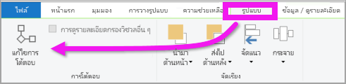
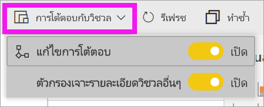
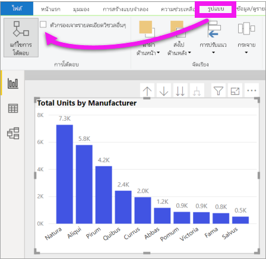

# เปลี่ยนวิธีการที่การแสดงผลด้วยภาพโต้ตอบในรายงาน Power BI
ถ้าคุณมีสิทธิ์ในการแก้ไขรายงาน คุณสามารถใช้**โต้ตอบแบบภาพ**เพื่อเปลี่ยนวิธีแสดงภาพบนหน้ารายงานมีผลกระทบต่อกันได้ 

## บทนำสู่การโต้ตอบกับภาพ
ตามค่าเริ่มต้น สามารถใช้การแสดงภาพบนหน้ารายงานเพื่อกรองแบบไขว้และไฮไลท์ข้ามไปยังแสดงภาพอื่น ๆ ในหน้าดังกล่าว
ตัวอย่างเช่น เลือกหนึ่งสถานะในการแสดงภาพของแผนที่เน้นแผนภูมิคอลัมน์และตัวกรองแผนภูมิเส้นเพื่อให้แสดงเฉพาะข้อมูลที่นำไปใช้กับหนึ่งสถานะดังกล่าว
ดู[เกี่ยวกับการกรองและการเน้น](power-bi-reports-filters-and-highlighting.md) และหากคุณมีการแสดงภาพที่สนับสนุน[การเข้าถึงรายละเอียด](consumer/end-user-drill.md)ตามค่าเริ่มต้น การเข้าถึงรายละเอียดข้อมูลแสดงภาพหนึ่งไม่มีผลกระทบต่อการแสดงภาพอื่น ๆ บนหน้ารายงานดังกล่าว แต่ลักษณะการทำงานที่เป็นค่าเริ่มต้นทั้งสองนี้สามารถแทนที่ได้ และโต้ตอบมีการตั้งค่าในแบบต่อหนึ่งการแสดงภาพ

บทความนี้แสดงให้เห็นว่าคุณจะใช้ **การโต้ตอบกับภาพ** ใน Power BI Desktop ได้อย่างไร กระบวนการจะเหมือนกันกับในบริการ[มุมมองการแก้ไข](service-interact-with-a-report-in-editing-view.md)ของ Power BI ถ้ามีการแชร์รายงานกับคุณ คุณจะไม่สามารถเปลี่ยนการตั้งค่าการโต้ตอบแบบภาพได้

คำศัพท์*ตัวกรองไขว้*และ*ไฮไลท์ข้าม*จะนำมาใช้เพื่อแยกความแตกต่างลักษณะการทำงานที่อธิบายไว้ที่นี่สำหรับสิ่งที่เกิดขึ้นเมื่อคุณใช้การพื้นที่**ตัวกรอง**เพื่อกรองและเน้นการแสดงภาพ  

> [!NOTE]
> วิดีโอนี้ใช้เวอร์ชันเก่าของ Power BI Desktop และบริการของ Power BI 
>
>

<iframe width="560" height="315" src="https://www.youtube.com/embed/N_xYsCbyHPw?list=PL1N57mwBHtN0JFoKSR0n-tBkUJHeMP2cP" frameborder="0" allowfullscreen></iframe>

## เปิดใช้งานตัวควบคุมการโต้ตอบกับภาพ
หากคุณมีสิทธิ์แก้ไขรายงาน คุณสามารถเปิดการควบคุมการโต้ตอบกับภาพและกำหนดวิธีการแสดงภาพประกอบเพลงในตัวกรองหน้ารายงานของคุณและไฮไลท์ซึ่งกันและกัน 

1. เลือกการแสดงภาพเพื่อเปิดใช้งาน  
2. แสดงตัวเลือก**การโต้ตอบแบบภาพ**
    

    - ที่เดสก์ท็อป เลือก**รูปแบบ > การโต้ตอบ**

        

    - ในบริการ Power BI ให้เปิดรายงานในมุมมองการแก้ไขและเลือกรายการแบบเลื่อนลงจากแถบเมนูรายงาน

        

3. เมื่อต้องการแสดงตัวควบคุมการแสดงภาพโต้ตอบ เลือก**แก้ไขการโต้ตอบ** Power BI เพิ่มตัวกรองและไฮไลท์ข้ามไปยังการแสดงภาพอื่นๆ ทั้งหมดบนหน้ารายงาน ตอนนี้คุณสามารถเปลี่ยนวิธีการสร้างภาพข้อมูลที่เลือกโต้ตอบกับการสร้างภาพข้อมูลอื่นๆ ในหน้ารายงานได้
   
    

## เปลี่ยนลักษณะการทำงานของการโต้ตอบ
ทำความคุ้นเคยกับการสร้างภาพข้อมูลของคุณโดยการเลือกการสร้างภาพแต่ละภาพในหน้ารายงานของคุณทีละครั้ง  เลือกจุดข้อมูลหรือแถบหรือรูปร่างและดูผลกระทบต่อการสร้างภาพข้อมูลอื่นๆ หากลักษณะการทำงานที่คุณเห็นไม่ใช่สิ่งที่คุณต้องการ คุณสามารถเปลี่ยนการโต้ตอบ การเปลี่ยนแปลงเหล่านี้จะถูกบันทึกไว้ในรายงาน ดังนั้นคุณและผู้บริโภครายงานของคุณจะได้รับประสบการณ์การโต้ตอบกับภาพเดียวกัน

พิจารณาว่าอะไรที่ส่งผลกระทบต่อการสร้าง**ภาพข้อมูลที่เลือก**  และมีอีกหนึ่งทางเลือกคือ ทำซ้ำสำหรับแสดงภาพอื่น ๆ ทั้งหมดบนหน้ารายงาน
   
   * หากควรมีการใช้ตัวกรองข้ามสำหรับการแสดงภาพ ให้เลือกไอคอน**ตัวกรอง**
   * หากควรมีการใช้ไฮไลท์ข้ามสำหรับการแสดงภาพ ให้เลือกไอคอน**ไฮไลท์**
   * หากไม่ต้องการให้มีผลกระทบ เลือกไอคอน**ไม่มีผลกระทบ**

## เปลี่ยนการโต้ตอบของการแสดงภาพที่สามารถเจาะได้
[การแสดงภาพ Power BI บางอย่างสามารถเจาะได้](consumer/end-user-drill.md) ตามค่าเริ่มต้นเมื่อคุณเจาะการสร้างภาพข้อมูลนั้นจะไม่มีผลกระทบต่อการสร้างภาพข้อมูลอื่นๆ ในหน้ารายงาน แต่ลักษณะการทำงานนั้นสามารถเปลี่ยนแปลงได้ 

1. บรรยายภาพที่เจาะได้เพื่อให้ใช้งานได้ 

> [!TIP]
> ลองด้วยตัวคุณเองโดยใช้[ไฟล์ PBIX ตัวอย่างทรัพยากรบุคคล](https://download.microsoft.com/download/6/9/5/69503155-05A5-483E-829A-F7B5F3DD5D27/Human%20Resources%20Sample%20PBIX.pbix) มีแผนภูมิคอลัมน์พร้อมดริลล์ดาวน์บนแท็บ**จ้างใหม่**
>

2. จากแถบเมนู ให้เลือก**รูปแบบ** > **การเจาะตัวกรองภาพอื่น ๆ**  ในตอนนี้เมื่อคุณเจาะลึกลงรายละเอียด (และเจาะขึ้นมา) ในการแสดงภาพ การแสดงภาพอื่น ๆ บนหน้ารายงานจะเปลี่ยนเพื่อแสดงเลือกการเจาะลงรายละเอียดปัจจุบันของคุณ 

    .
    
## ขั้นตอนถัดไป
[ตัวกรองและการไฮไลท์ในรายงาน Power BI](power-bi-reports-filters-and-highlighting.md)