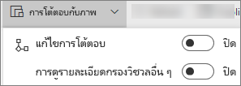
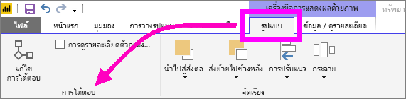

# การโต้ตอบแบบการแสดงภาพในรายงาน Power BI
ถ้าคุณมีสิทธิ์ในการแก้ไขรายงาน คุณสามารถใช้**โต้ตอบแบบภาพ**เพื่อเปลี่ยนวิธีแสดงภาพบนหน้ารายงานมีผลกระทบต่อกันได้ 

ตามค่าเริ่มต้น สามารถใช้การแสดงภาพบนหน้ารายงานเพื่อกรองแบบไขว้และไฮไลท์ข้ามไปยังแสดงภาพอื่น ๆ ในหน้าดังกล่าว
ตัวอย่างเช่น เลือกหนึ่งสถานะในการแสดงภาพของแผนที่เน้นแผนภูมิคอลัมน์และตัวกรองแผนภูมิเส้นเพื่อให้แสดงเฉพาะข้อมูลที่นำไปใช้กับหนึ่งสถานะดังกล่าว
ดู[เกี่ยวกับการกรองและการเน้น](power-bi-reports-filters-and-highlighting.md) และหากคุณมีการแสดงภาพที่สนับสนุน[การเข้าถึงรายละเอียด](consumer/end-user-drill.md)ตามค่าเริ่มต้น การเข้าถึงรายละเอียดข้อมูลแสดงภาพหนึ่งไม่มีผลกระทบต่อการแสดงภาพอื่น ๆ บนหน้ารายงานดังกล่าว แต่ลักษณะการทำงานที่เป็นค่าเริ่มต้นทั้งสองนี้สามารถแทนที่ได้ และโต้ตอบมีการตั้งค่าในแบบต่อหนึ่งการแสดงภาพ

บทความนี้แสดงวิธีใช้**การโต้ตอบภาพ**ในบริการ Power BI [มุมมองการแก้ไข](service-interact-with-a-report-in-editing-view.md)และใน Power BI Desktop ถ้ามีการแชร์รายงานกับคุณ คุณจะไม่สามารถเปลี่ยนการตั้งค่าการโต้ตอบแบบภาพได้

> [!NOTE]
> คำศัพท์*ตัวกรองไขว้*และ*ไฮไลท์ข้าม*จะนำมาใช้เพื่อแยกความแตกต่างลักษณะการทำงานที่อธิบายไว้ที่นี่สำหรับสิ่งที่เกิดขึ้นเมื่อคุณใช้การพื้นที่**ตัวกรอง**เพื่อกรองและเน้นการแสดงภาพ  
> 
> 

<iframe width="560" height="315" src="https://www.youtube.com/embed/N_xYsCbyHPw?list=PL1N57mwBHtN0JFoKSR0n-tBkUJHeMP2cP" frameborder="0" allowfullscreen></iframe>

1. เลือกการแสดงภาพเพื่อเปิดใช้งาน  
2. แสดงตัวเลือก**การโต้ตอบแบบภาพ**
    - ในบริการ Power BI เลือกรายการแบบเลื่อนลงจากแถบเมนูรายงาน

       

    - ที่เดสก์ท็อป เลือก**รูปแบบ > การโต้ตอบ**

        

3. เมื่อต้องการเปิดใช้งานตัวควบคุมการแสดงภาพโต้ตอบ เลือก**แก้ไขการโต้ตอบ** Power BI เพิ่มไอคอนตัวกรองข้าม และไฮไลท์ข้ามไปยังการแสดงภาพอื่น ๆ ทั้งหมดบนหน้ารายงาน
   
    
3. กำหนดว่ารายการใดควรมีผลกระทบต่อผู้อื่นสำหรับการแสดงภาพที่เลือก  และมีอีกหนึ่งทางเลือกคือ ทำซ้ำสำหรับแสดงภาพอื่น ๆ ทั้งหมดบนหน้ารายงาน
   
   * หากควรมีการใช้ตัวกรองข้ามสำหรับการแสดงภาพ ให้เลือกไอคอน**ตัวกรอง**
   * หากควรมีการใช้ไฮไลท์ข้ามสำหรับการแสดงภาพ ให้เลือกไอคอน**ไฮไลท์**
   * หากไม่ต้องการให้มีผลกระทบ เลือกไอคอน**ไม่มีผลกระทบ**

4. เมื่อต้องการเปิดใช้งานตัวควบคุมการเข้าถึงรายละเอียด เลือก**ตัวกรองการเข้าถึงรายละเอียดสำหรับภาพอื่น ๆ**  ในตอนนี้เมื่อคุณเจาะลึกลงรายละเอียด (และเจาะขึ้นมา) ในการแสดงภาพ การแสดงภาพอื่น ๆ บนหน้ารายงานจะเปลี่ยนเพื่อแสดงเลือกการเจาะลงรายละเอียดปัจจุบันของคุณ 

   

