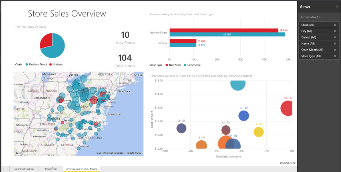

# รายงานใน Power BI
## รายงาน Power BI คืออะไร?
***รายงาน*** Power BI เป็นมุมมองแบบหลากหลายมุมมองในชุดข้อมูล มีการแสดงภาพที่แสดงถึงการค้นพบและข้อมูลเชิงลึกที่แตกต่างกันจากชุดข้อมูลนั้น  รายงานสามารถมีการแสดงภาพเดียวหรือมีหน้าที่เต็มไปด้วยการแสดงภาพ คุณอาจเป็นบุคคลที่*สร้าง*รายงานและ/หรือคุณอาจเป็นบุคคลที่*เรียกใช้*หรือใช้รายงานได้ ทั้งนี้ขึ้นอยู่กับบทบาทของคุณงาน

รายงานนี้มี 3 หน้า (หรือแท็บ) และเรากำลังดูหน้าภาพรวมของยอดขายของร้านค้า ในหน้านี้จะมีการแสดงภาพที่แตกต่างกัน 6 ภาพและชื่อเรื่องของหน้า สามารถ*ปักหมุด*การแสดงภาพไปยังแดชบอร์ดได้ และเมื่อมีการเลือกการแสดงภาพที่ปักหมุดไว้ จะเป็นการเปิดรายงานที่มีการปักหมุดภาพไว้

ถ้าคุณไม่คุ้นเคยกับ Power BI คุณสามารถเรียนรู้ข้อมูลพื้นฐานได้โดยการอ่าน[แนวคิดพื้นฐานของ Power BI](service-basic-concepts.md)

รายงานเป็นคุณลักษณะของบริการ Power BI และ Power BI Desktop ประสบการณ์การทำงานกับรายงานจะเหมือนกันเกือบทุกประการ อย่างไรก็ตาม สำหรับมือถือ คุณไม่สามารถสร้างรายงานได้ แต่คุณสามารถ[ดู แชร์ และใส่คำอธิบายประกอบรายงาน](mobile-reports-in-the-mobile-apps.md)ได้

## ข้อดีของรายงาน
รายงานจะขึ้นอยู่กับชุดข้อมูลเดียว แสดงภาพในรายงานแต่ละหมายถึง nugget ของข้อมูล และการแสดงภาพจะไม่คงที่ คุณสามารถเพิ่ม และลบข้อมูล เปลี่ยนประเภทการแสดงภาพ และใช้ตัวกรองและตัวแบ่งส่วนข้อมูล ตามที่คุณเจาะลึกข้อมูลเพื่อค้นหาข้อมูลเชิงลึกและค้นหาคำตอบ เหมือนกับแดชบอร์ดแต่มีมากกว่า รายงานเป็นแบบสามารถโต้ตอบได้สูง และกำหนดเองได้สูง และการแสดงภาพจะอัปเดตเมื่อมีการเปลี่ยนแปลงข้อมูลพื้นฐาน

## แดชบอร์ดเทียบกับรายงาน
มักสับสนระหว่าง[แดชบอร์ด](service-dashboards.md)กับรายงานเนื่องจากทั้งสองเป็นพื้นที่ที่กรอกข้อมูลด้วยการแสดงภาพเหมือนกัน แต่แดชบอร์ดกับรายงานมีความแตกต่างที่สำคัญบางประการ  

| **ขีดความสามารถ** | **แดชบอร์ด** | **รายงาน** |
| --- | --- | --- |
| หน้า |หนึ่งหน้า |อย่างน้อยหนึ่งหน้า |
| แหล่งข้อมูล |อย่างน้อยหนึ่งรายงานและอย่างน้อยหนึ่งชุดข้อมูลต่อแดชบอร์ด |ชุดข้อมูลเดียวต่อรายงาน |
| พร้อมใช้งานใน Power BI Desktop |ไม่ใช่ |ใช่ สามารถสร้างและดูรายงานในเดสก์ท็อป |
| ปักหมุด |สามารถปักหมุดการแสดงภาพที่มีอยู่ (ไทล์) ไปยังแดชบอร์ดอื่น ๆ ของคุณได้จากแดชบอร์ดปัจจุบันเท่านั้น |สามารถปักหมุดการแสดงภาพ (เป็นไทล์) ไปยังแดชบอร์ดอื่น ๆ ของคุณได้ สามารถปักหมุดทั้งหน้ารายงานไปยังแดชบอร์ดใด ๆ ของคุณได้ |
| สมัครสมาชิก |ไม่สามารถสมัครสมาชิกไปยังแดชบอร์ด |สามารถสมัครใช้งานไปยังหน้ารายงานได้ |
| กำลังกรอง |ไม่สามารถกรองหรือแบ่งส่วนได้ |มีหลายวิธีในการกรอง ทำไฮไลท์ และแบ่งส่วน |
| ตั้งค่าการแจ้งเตือน |สามารถสร้างการแจ้งเตือนไปยังอีเมลของคุณเมื่อเป็นไปตามเงื่อนไขบางประการ |ไม่ใช่ |
| คุณลักษณะ |สามารถตั้งค่าแดชบอร์ดหนึ่งเป็นแดชบอร์ด "แนะนำ" ของคุณได้ |ไม่สามารถสร้างรายงานที่แนะนำได้ |
| สอบถามภาษาธรรมชาติ |พร้อมใช้งานจากแดชบอร์ด |ไม่พร้อมใช้งานจากรายงาน |
| สามารถเปลี่ยนประเภทการแสดงภาพ |หมายเลข อันที่จริงแล้ว หากเจ้าของรายงานเปลี่ยนประเภทการแสดงภาพในรายงาน การแสดงภาพที่ปักหมุดอยู่ในแดชบอร์ดจะไม่อัปเดต |ใช่ |
| สามารถดูตารางชุดข้อมูลพื้นฐานและพื้นที่ข้อมูลได้ |หมายเลข สามารถส่งออกข้อมูล แต่ไม่สามารถมองเห็นตารางและช่องข้อมูลในแดชบอร์ด |ใช่ สามารถดูตารางชุดข้อมูล ช่องข้อมูล และค่าได้ |
| สามารถสร้างการแสดงภาพได้ |จำกัดสำหรับการเพิ่มวิดเจ็ตไปยังแดชบอร์ดโดยใช้ "เพิ่มไทล์" |สามารถสร้างชนิดต่าง ๆ ของภาพ เพิ่มภาพแบบกำหนดเอง แก้ไขภาพและอื่น ๆ อีกมากได้ด้วยสิทธิ์การแก้ไข |
| การเลือกกำหนด |สามารถทำสิ่งต่าง ๆ ด้วยการแสดงภาพ (ไทล์) เช่น การย้ายและจัดเรียง ปรับขนาด เพิ่มการเชื่อมโยง เปลี่ยนชื่อ ลบ และแสดงเต็มหน้าจอ แต่ข้อมูลและการแสดงภาพเป็นแบบอ่านอย่างเดียว |ในมุมมองการอ่าน คุณสามารถเผยแพร่ ฝัง กรอง ส่งออก ดาวน์โหลดเป็น .pbix ดูเนื้อหาที่เกี่ยวข้อง สร้างรหัส QR วิเคราะห์ใน Excel และอื่น ๆ ได้  ในมุมมองการแก้ไข คุณสามารถทำทุกสิ่งที่กล่าวมาแล้วได้และสามารถทำสิ่งอื่น ๆ ได้อีกมาก |

## ***ผู้สร้าง***รายงานและ***ผู้บริโภค***รายงาน
คุณอาจเป็นผู้ที่สร้างรายงานเพื่อใช้งานด้วยตนเอง หรือเพื่อแชร์กับเพื่อนร่วมงาน ทั้งนีี้ขึ้นอยู่กับบทบาทของคุณ คุณต้องการเรียนรู้วิธีการสร้างและแชร์รายงาน หรือคุณอาจเป็นบุคคลที่ได้รับรายงานจากผู้อื่น คุณต้องการเรียนรู้วิธีการทำความเข้าใจและโต้ตอบกับรายงาน

ต่อไปนี้คือหัวข้อที่แยกตามบทบาทเพื่อช่วยให้คุณเริ่มต้นใช้งาน

### ถ้าคุณเป็นผู้สร้างและการแชร์รายงาน
* เริ่มต้นด้วยการ[สำรวจบริการ Power BI](service-basic-concepts.md) เพื่อให้คุณทราบตำแหน่งที่จะค้นหารายงานและเครื่องมือรายงาน
* สำรวจ[ตัวแก้ไขรายงาน](service-the-report-editor-take-a-tour.md)
* เรียนรู้วิธีการ[สร้างรายงานจากชุดข้อมูล](service-report-create-new.md)
* [เรียนรู้วิธีใช้การแสดงภาพ หน้า และตัวกรองระดับรายงาน](power-bi-how-to-report-filter.md)
* ค้นหาวิธีที่แตกต่างกันทั้งหมดที่คุณสามารถ[แชร์รายงานกับเพื่อนร่วมงาน](service-share-dashboards.md)

### ถ้าคุณจะได้รับและใช้รายงาน
* เริ่มต้นด้วยการ[สำรวจบริการ Power BI](service-basic-concepts.md) เพื่อให้คุณทราบตำแหน่งที่จะค้นหารายงานและเครื่องมือรายงาน
* เรียนรู้วิธีการ[เปิดรายงาน](service-report-open.md)และการโต้ตอบทั้งหมดที่พร้อมใช้งานใน[มุมมองการอ่าน](service-reading-view-and-editing-view.md)
* สร้างความคุ้นเคยกับรายงานโดยเข้าดูหนึ่งใน[ตัวอย่าง](sample-tutorial-connect-to-the-samples.md)ของเรา  
* ไม่ต้องการรายงานอีกต่อไป? คุณสามารถ[ลบออก](service-delete.md)ได้
* การดูชุดข้อมูลที่รายงานใช้ และดูว่าแดชบอร์ดใดที่มีไทล์ปักหมุดจากรายงาน [ดูเนื้อหาที่เกี่ยวข้อง](service-related-content.md)

> [!TIP]
> ถ้าคุณไม่พบสิ่งที่คุณกำลังค้นหาที่นี่ ใช้ตารางเนื้อหาทางด้านซ้ายเพื่อเรียกดูหัวข้อ*รายงาน*ทั้งหมด
> 
> 

## ขั้นตอนถัดไป
[เริ่มต้นใช้งาน Power BI](service-get-started.md) 

[Power BI - แนวคิดพื้นฐาน](service-basic-concepts.md)

มีคำถามเพิ่มเติมหรือไม่? [ลองไปที่ชุมชน Power BI](http://community.powerbi.com/)

