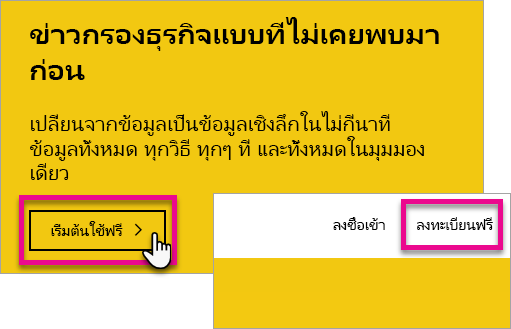
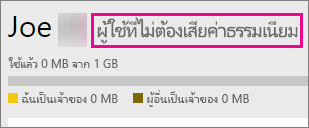

# ลงทะเบียนสำหรับ Power BI เป็นรายบุคคล
เรียนรู้วิธีการลงทะเบียนสำหรับ Power BI และเริ่มต้นใช้งานสำหรับความต้องรายงานและการแสดงภาพส่วนบุคคลของคุณ

Power BI สามารถรายงานส่วนบุคคลและเครื่องมือการแสดงของคุณ และยังสามารถทำหน้าที่เป็นกลไกจัดการการวิเคราะห์และการตัดสินใจอยู่เบื้องหลังโครงการแบบกลุ่ม ส่วน หรือบริษัททั้งหมด

บทความนี้จะแนะนำคุณผ่านตัวเลือกของคุณเกี่ยวกับวิธีการลงทะเบียน และเริ่มต้นใช้บริการ Power BI สำหรับข้อมูลเกี่ยวกับความแตกต่างระหว่าง Power BI ฟรีและ Pro ดู[เปรียบเทียบกับ Power BI ฟรี Pro](service-free-vs-pro.md)

## คุณมีตัวเลือกอยู่สองสามข้อด้วยกัน
ในฐานะที่เป็นรายบุคคล คุณมีตัวเลือกมากมายเพื่อลงทะเบียน และเริ่มต้นใช้งาน Power BI คุณสามารถเลือกที่จะลงทะเบียนฟรี หรือคุณสามารถซื้อการสมัครใช้งาน Power BI Pro ถ้าคุณลงทะเบียนสำหรับบัญชีผู้ใช้แบบฟรี เมื่อคุณอยู่ในบริการแล้ว คุณสามารถเลือกลงในการทดลองใช้ฟรี 60 วันของ Power BI Pro

ถ้าคุณเป็นส่วนหนึ่งขององค์กรที่ใช้ Office 365 คุณก็ยังสามารถลงทะเบียนสำหรับบัญชีผู้ใช้ฟรีได้ นอกจากนี้ผู้ดูแลระบบ IT ของคุณยังมีตัวเลือกบางอย่างเพื่อซื้อ Power BI Pro และมอบหมายสิทธิ์การใช้งาน สำหรับข้อมูลเพิ่มเติมเกี่ยวกับตัวเลือกที่พร้อมใช้งานในฐานะผู้ดูแลระบบ IT ดู[ซื้อ Power BI Pro](service-admin-purchasing-power-bi-pro.md)

> [!NOTE]
> ถ้าคุณอยู่ในองค์กร ลงชื่อเข้าใช้รายบุคคลอาจถูกปิดใช้งาน ถ้าคุณได้รับการแจ้งข้อผิดพลาดที่ระบุว่า การลงทะเบียนถูกปิดใช้งาน ติดต่อแผนก IT ของคุณสำหรับข้อมูลเพิ่มเติม

## สิ่งที่คุณจำเป็นต้องลงทะเบียน

เมื่อต้องลงทะเบียนสำหรับ Power BI คุณต้องใช้ที่อยู่อีเมลที่ทำงาน ที่อยู่อีเมลส่วนบุคคลจะใช้ลงทะเบียนสำหรับ Power BI ไม่ได้

### ที่อยู่อีเมลใดที่สามารถใช้กับ Power BI ได้
Power BI จำเป็นต้องให้คุณใช้ที่อยู่อีเมลที่ทำงาน หรือที่อยู่อีเมลโรงเรียนในการลงทะเบียน คุณไม่สามารถลงทะเบียน Power BI ที่ใช้โดยบริการอีเมลของผู้บริโภคหรือผู้ให้บริการระบบโทรคมนาคมที่อยู่อีเมลที่ได้รับได้ ซึ่งรวมถึง outlook.com, hotmail.com, gmail.com และอื่น ๆ

ถ้าคุณพยายามลงทะเบียน ด้วยอยู่อีเมลส่วนบุคคล คุณจะได้รับข้อความระบุเมื่อต้องใช้ทำงาน หรือโรงเรียนที่อยู่อีเมล

> [!NOTE]
> คุณสามารถลงทะเบียนสำหรับ Power BI ด้วยที่อยู่ .gov หรือ .mil ดูรายละเอียดได้ที่ [สมัครองค์กรรัฐบาลสหรัฐฯ ในบริการ Power BI](https://docs.microsoft.com/en-us/power-bi/service-govus-signup)
>

> [!NOTE]
> หลังจากที่คุณลงทะเบียนคุณสามารถ[เชิญผู้ใช้เป็นผู้เยี่ยมชม](https://docs.microsoft.com/en-us/azure/active-directory/active-directory-b2b-what-is-azure-ad-b2b)เพื่อดูเนื้อหาในผู้เช่า Power BI ของคุณ มีที่อยู่อีเมลใด ๆ รวมทั้งบัญชีส่วนบุคคล
>

## คุณต้องใช้อันไหน
คุณสามารถกำหนดใบอนุญาตที่คุณต้องใช้ได้โดยการตรวจสอบสิ่งที่มากับชนิดของใบอนุญาต ผู้ใช้ฟรีมีฟังก์ชันการทำงานของบริการส่วนใหญ่ ยกเว้น การแชร์ และทำงานร่วมกัน ผู้ใช้ Power BI Pro สามารถทำให้ใช้คุณลักษณะทั้งหมดในบริการ แต่ไม่ได้ฟรี ถ้าคุณไม่มีความต้องการแชร์เนื้อหาใด ๆ ฟรีอาจเป็นเส้นทางการสำหรับคุณได้ คุณสามารถเรียนรู้เพิ่มเติมบนการ[Power BI ราคาหน้า](https://powerbi.microsoft.com//pricing/)ได้

ส่วนที่เหลือในบทความนี้จะที่วิธีการลงทะเบียนสำหรับแต่ละตัวเลือก

## ลงทะเบียนสำหรับ Power BI (ฟรี) เป็นรายบุคคล
วิธีรวดเร็วที่สุดในการลงทะเบียนสำหรับ Power BI จะลงทะเบียนสำหรับบัญชี Power BI (ฟรี) ไม่มีค่าใช้จ่ายบัญชีนี้ และยังช่วยให้คุณใช้ฟีเจอร์พร้อมใช้งานในบริการจำนวนมาก

> [!NOTE]
> ถ้าคุณได้รับข้อความว่าเรารู้จักคุณแล้ว ให้ลองนำทางไปยัง https://app.powerbi.com และลงชื่อเข้าใช้
> 
> 

เมื่อต้องลงทะเบียนสำหรับ Power BI คุณสามารถทำต่อไปนี้

1. ดำเนินการต่อไปยัง[ powerbi.com](https://powerbi.microsoft.com)
2. เลือก**เริ่มต้นฟรี**หรือ**ลงทะเบียนฟรี**

    
3. บนหน้าเริ่มต้นทำงานได้ เลือก**ทดลองใช้ฟรี >** ภายใต้ Power BI

    
4. ใส่อยู่อีเมลของคุณจะลงทะเบียนกับ และจากนั้น เลือก**ลงทะเบียน** ตรวจสอบให้แน่ใจว่า ที่อยู่อีเมลของคุณได้รับอนุญาตสำหรับการลงทะเบียน สำหรับข้อมูลเพิ่มเติม ดู[ที่อยู่อีเมลใดที่สามารถใช้กับ Power BI ได้](#what-email-address-can-be-used-with-power-bi)

    
5. คุณจะได้รับข้อความระบุเมื่อต้องการตรวจสอบอีเมลของคุณ

    
6. เลือกการเชื่อมโยงภายในอีเมลเพื่อตรวจสอบที่อยู่อีเมลของคุณ ซึ่งจะนำคุณกลับเข้าสู่ขั้นตอนการลงทะเบียน คุณอาจจำเป็นต้องใส่ข้อมูลบางอย่างเพิ่มเติมเกี่ยวกับตัวคุณเอง
7. คุณจะถูกนำไปที่ https://app.powerbi.com และคุณสามารถเริ่มต้นใช้งาน Power BI แบบผู้ใช้ฟรี

### มันมีลักษณะอย่างไรในบริการ
เมื่อคุณอยู่ในบริการ คุณสามารถตรวจสอบว่า คุณมีบัญชีผู้ใช้ฟรี โดยไปที่ไอคอน**เฟือง**และเลือก**จัดการที่เก็บข้อมูลส่วนบุคคล**ได้

### เกิดอะไรขึ้นถ้าคุณอยู่ส่วนหนึ่งขององค์กรที่มีอยู่หรือไม่
ถ้าบัญชีของคุณเป็นส่วนหนึ่งขององค์กรที่มีอยู่ คุณจะได้รับข้อความขอให้คุณลงชื่อเข้าใช้บัญชีผู้ใช้นั้น เลือก**ดำเนินการต่อ**และลงชื่อเข้าใช้เข้าสู่ระบบ Office 365 ของคุณ

จากนั้นคุณจะเห็นข้อความขอให้คุณเลือก**เริ่มต้น**

## ทดลองใช้งาน 60 วัน in-service Power BI Pro
หลังจากที่คุณได้ลงทะเบียนสำหรับบัญชีฟรีของคุณ นอกจากนี้คุณสามารถเลือกเพื่อทดลองใช้งาน Pro ฟรี 60 วัน คุณจะสามารถเข้าถึงคุณลักษณะ Pro ทั้งหมดในระยะเวลาการทดลองใช้ Power BI Pro มีคุณลักษณะทั้งหมดของ Power BI เวอร์ชันทดลองใช้ฟรี และการใช้งานร่วมกันเพิ่มเติมและคุณลักษณะการทำงานร่วมกัน สำหรับข้อมูลเพิ่มเติม ให้ดู [ข้อมูลราคา](https://powerbi.microsoft.com/pricing) เมื่อต้องลองทดลองใช้ฟรี 60 วันของ Power BI Pro ลงชื่อเข้า Power BI ใช้ และลองใช้คุณลักษณะ Power BI Pro เหล่านี้:

* [สร้างพื้นที่ทำงานสำหรับแอป](service-create-distribute-apps.md)
* [แชร์แดชบอร์ด](service-share-dashboards.md)

เมื่อคุณลอง ใด ๆ ของฟีเจอร์เหล่านี้คุณจะได้รับการพร้อมท์เมื่อต้องเริ่มการทดลองใช้ฟรี คุณยังสามารถเลือกที่จะทำให้ใช้ได้ โดยไปไอคอนรูปเฟือง แล้วเลือก**จัดการที่เก็บข้อมูลส่วนบุคคล**ได้ แล้ว เลือก**ลอง Pro สำหรับฟรี**ทางด้านขวา

จาก นั้นคุณสามารถเลือก**เริ่มทดลองใช้**

>[!NOTE]
>ผู้ใช้ที่ใช้ประโยชน์จากการทดลองใช้ Power BI Pro ในผลิตภัณฑ์นี้ไม่ปรากฏในพอร์ทัลผู้ดูแลระบบ Office 365 เป็นผู้ใช้ Power BI Pro รุ่นทดลองใช้ (พวกเขาปรากฏเป็นผู้ใช้ฟรี Power BI) อย่างไรก็ตาม มันจะแสดงเป็นผู้ใช้ Power BI Pro รุ่นทดลองใช้ในการ**จัดการที่เก็บข้อมูล**หน้าใน Power BI

>[!NOTE]
>ถ้าคุณเป็นผู้ดูแลระบบ IT ที่ขอได้รับ และปรับใช้สิทธิ์การใช้งานเวอร์ชันทดลองใช้ Power BI ผู้ใช้หลายคนในองค์กรของคุณ โดยไม่ใช้แต่ละคนที่ยอมรับเงื่อนไขการทดลองใช้ทีละคน คุณสามารถลงทะเบียนสำหรับการ[Power BI Pro สมัครใช้งานเวอร์ชันทดลองใช้](https://portal.office.com/Signup/MainSignup15.aspx?OfferId=d59682f3-3e3b-4686-9c00-7c7c1c736085&dl=POWER_BI_PRO). คุณจะต้องเป็นผู้ดูแลระบบส่วนกลางของ Office 365 หรือการเรียกเก็บเงิน หรือสร้างลูกค้าใหม่ในการลงทะเบียนเป็นผู้ดูแลระบบเวอร์ชันทดลองใช้ สำหรับข้อมูลเพิ่มเติม ดู[ซื้อ Power BI Pro](service-admin-purchasing-power-bi-pro.md)
> 
> [!NOTE]
> ด้วยความพร้อมใช้งานของ Power BI Premium และการเปลี่ยนแปลงข้อเสนอ Power BI ฟรีวันที่ 1 มิถุนายน 2017 คุณอาจมีสิทธิ์สำหรับการขยาย Pro เวอร์ชันทดลองใช้ สำหรับข้อมูลเพิ่มเติม ดู[เปิดใช้งานการขยายเวลาทดลองใช้งาน Pro](service-extended-pro-trial.md)
> 
> 

### มันมีลักษณะอย่างไรในบริการ
เมื่อคุณอยู่ในบริการ คุณสามารถตรวจสอบว่า คุณมีบัญชีผู้ใช้ Pro ทดลองฟรี โดยไปที่ไอคอน<strong>เฟือง* และเลือก **จัดการที่เก็บข้อมูลส่วนบุคคล</strong>

## เกิดอะไรขึ้นถ้าคุณต้องการแบบเต็ม Power BI Pro หรือไม่
ไม่มีวิธีการรับสิทธิ์การใช้งาน Power BI Pro เป็นรายบุคคล คุณจะต้องพูดคุยกับผู้ดูแลระบบ IT ของคุณเพื่อสั่งซื้อ และกำหนดสิทธิ์การใช้งานบัญชีของคุณ สำหรับข้อมูลเพิ่มเติม ดู[ซื้อ Power BI Pro](service-admin-purchasing-power-bi-pro.md)

## การแก้ไขปัญหา
ในหลายกรณี การลงทะเบียนสำหรับ Power BI สามารถทำได้ โดยทำตามขั้นตอนการลงทะเบียนแบบบริการตนเองอย่างง่ายที่แสดงไว้ด้านบน อย่างไรก็ตาม มีหลายสาเหตุที่คุณอาจไม่สามารถลงทะเบียนแบบบริการตนเองให้เสร็จสมบูรณ์  ตารางด้านล่างสรุปบางสาเหตุทั่วไปส่วนใหญ่ที่คุณอาจไม่สามารถสมัครใช้งานและวิธีที่คุณสามารถแก้ไขปัญหาชั่วคราวปัญหาเหล่านี้

|                                                                                                                                                                                                                          **อาการ / ข้อความแสดงข้อผิดพลาด**                                                                                                                                                                                                                           |                                                                                                                                                                                                                                                                                                                                                **สาเหตุและวิธีแก้ปัญหา**                                                                                                                                                                                                                                                                                                                                                |
|--------------------------------------------------------------------------------------------------------------------------------------------------------------------------------------------------------------------------------------------------------------------------------------------------------------------------------------------------------------------------------------------------------------------------------------------------------------------------------|------------------------------------------------------------------------------------------------------------------------------------------------------------------------------------------------------------------------------------------------------------------------------------------------------------------------------------------------------------------------------------------------------------------------------------------------------------------------------------------------------------------------------------------------------------------------------------------------------------------------------------------------------------------------------------------------------------------------|
| <strong>ที่อยู่อีเมลส่วนบุคคล (ตัวอย่างเช่นnancy@gmail.com)</strong>คุณได้รับข้อความต่อไปนี้ในระหว่างการลงทะเบียน:    *คุณใส่อยู่อีเมลส่วนบุคคล: โปรดป้อนที่อยู่อีเมลที่ทำงานของคุณเพื่อให้เราสามารถจัดเก็บข้อมูลของบริษัทของคุณได้อย่างปลอดภัย*    หรือ    *ที่มีลักษณะเหมือนอยู่อีเมลส่วนบุคคล ใส่ที่อยู่ทำงานของคุณเพื่อให้เราสามารถเชื่อมต่อคุณกับผู้อื่นในบริษัทของคุณ และไม่ต้องกังวล เราจะไม่ใช้ร่วมกันที่อยู่ของคุณกับทุกคน* |                          คุณไม่สามารถลงทะเบียน Power BI ที่ใช้โดยบริการอีเมลของผู้บริโภคหรือผู้ให้บริการระบบโทรคมนาคมที่อยู่อีเมลที่ได้รับได้    เมื่อต้องการลงทะเบียนให้เสร็จสมบูรณ์ ลองอีกครั้ง โดยใช้อยู่อีเมลที่กำหนดให้ทำงานหรือโรงเรียนของคุณ    ถ้าคุณยังคงไม่สามารถลงทะเบียน และบีบเพื่อเสร็จสิ้นกระบวนการตั้งค่าขั้นสูงเพิ่มเติมหรือไม่ คุณสามารถ[ลงทะเบียนสำหรับการสมัครใช้งานเวอร์ชันทดลองใช้ Office 365 ใหม่และใช้อีเมลแอดเดรสเพื่อลงทะเบียน](service-admin-signing-up-for-power-bi-with-a-new-office-365-trial.md)ได้    มีบัญชีผู้ใช้ถูกเชิญเป็นผิด[ผู้เยี่ยมชม Azure B2B](https://docs.microsoft.com/en-us/azure/active-directory/active-directory-b2b-what-is-azure-ad-b2b)                           |
|            **ยังไม่เปิดการใช้งานการลงทะเบียนด้วยตนเอง**คุณได้รับข้อความต่อไปนี้ในระหว่างการลงทะเบียน:    *เราไม่สามารถเสร็จสิ้นการลงชื่อคุณขึ้น แผนก IT ของคุณได้ปิดใช้งานการลงทะเบียนสำหรับ Microsoft Power BI ติดต่อพวกเขาเพื่อลงทะเบียนเสร็จสมบูรณ์*    หรือ    *ที่มีลักษณะเหมือนอยู่อีเมลส่วนบุคคล ใส่ที่อยู่ทำงานของคุณเพื่อให้เราสามารถเชื่อมต่อคุณกับผู้อื่นในบริษัทของคุณ และไม่ต้องกังวล เราจะไม่ใช้ร่วมกันที่อยู่ของคุณกับทุกคน*             |                             ขององค์กรของคุณผู้ดูแลระบบ IT ได้ปิดใช้งานการลงทะเบียนแบบบริการตนเองสำหรับ Power BI    เมื่อต้องการลงทะเบียนให้เสร็จสมบูรณ์ ติดต่อผู้ดูแลระบบ IT ของคุณ และขอให้พวกเขาทำตามคำแนะนำบนหน้าด้านล่างเพื่ออนุญาตให้ผู้ใช้ที่มีอยู่เมื่อต้อง การลงทะเบียนสำหรับ Power BI และ การอนุญาตให้ผู้ใช้ใหม่เข้าร่วมผู้เช่าของคุณที่มีอยู่    นอกจากนี้คุณอาจประสบปัญหานี้ถ้าคุณลงทะเบียนสำหรับ Office 365 ผ่านคู่ค้า [ศึกษาเพิ่มเติม](service-admin-syndication-partner.md)    [Power BI สำหรับองค์กรของคุณ](https://support.office.com/en-ca/article/Power-BI-in-your-Organization-d7941332-8aec-4e5e-87e8-92073ce73dc5#BKMK_HowCanIAllowO365Tenant)                              |
|                                                                                          **ที่อยู่อีเมลไม่ใช่ ID ของ Office 365**คุณได้รับข้อความต่อไปนี้ในระหว่างการลงทะเบียน:    *เราไม่สามารถค้นหาคุณที่ contoso.com  คุณใช้รหัส ID ที่โรงเรียนหรือที่ทำงานแตกต่างไปหรือไม่    ลองลงชื่อเข้าใช้ ด้วยที่ และถ้าจะไม่ทำงาน ที่ติดต่อแผนก IT ของคุณ*                                                                                           | องค์กรของคุณใช้รหัสเพื่อลงชื่อเข้าใช้ Office 365 และบริการอื่น ๆ ของ Microsoft ที่จะแตกต่างจากที่อยู่อีเมลของคุณ  ตัวอย่างเช่น ที่อยู่อีเมลของคุณอาจNancy.Smith@contoso.comแต่ ID ของคุณคือnancys@contoso.comได้    เมื่อต้องการลงทะเบียนให้เสร็จสมบูรณ์ ใช้ ID ที่องค์กรของคุณได้กำหนดให้กับสำหรับลงชื่อเข้าใช้ Office 365 หรือบริการอื่น ๆ ของ Microsoft  ถ้าคุณไม่ทราบว่านี่คือ ติดต่อผู้ดูแลระบบ IT ของคุณ    ถ้าคุณยังคงไม่สามารถลงทะเบียน และบีบเพื่อเสร็จสิ้นกระบวนการตั้งค่าขั้นสูงเพิ่มเติมหรือไม่ คุณสามารถ[ลงทะเบียนสำหรับการสมัครใช้งานเวอร์ชันทดลองใช้ Office 365 ใหม่และใช้อีเมลแอดเดรสเพื่อลงทะเบียน](service-admin-signing-up-for-power-bi-with-a-new-office-365-trial.md)ได้ |

## ขั้นตอนถัดไป
[Power BI (ฟรี) ในองค์กรของคุณ](service-admin-service-free-in-your-organization.md)  
[ซื้อ Power BI Pro](service-admin-purchasing-power-bi-pro.md)  
[ข้อตกลงการให้บริการ Power BI สำหรับแต่ละผู้ใช้](https://powerbi.microsoft.com/terms-of-service/)  
[Power BI Premium คืออะไร](service-premium.md)  
[เอกสารทางเทคนิคของ Power BI Premium](https://aka.ms/pbipremiumwhitepaper)  

มีคำถามเพิ่มเติมหรือไม่ [ลองถามชุมชน Power BI](http://community.powerbi.com/)

