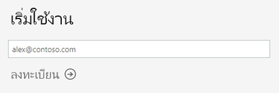
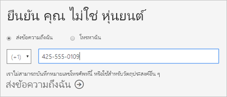
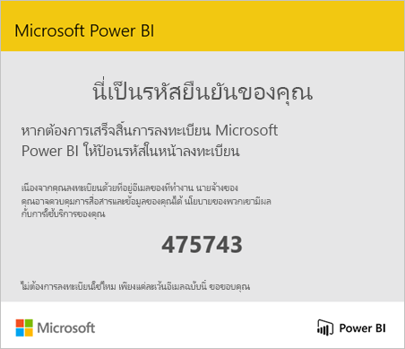
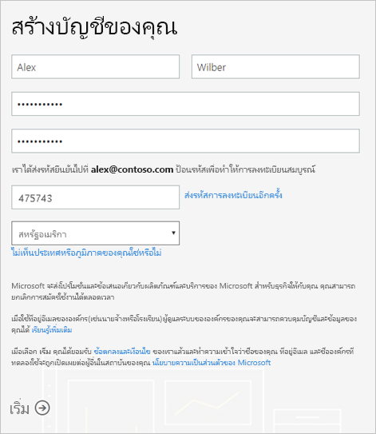
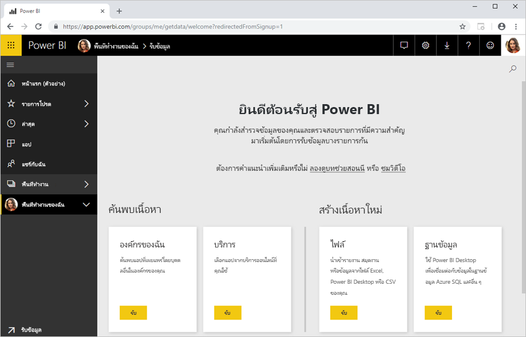

# ลงทะเบียนใช้งาน Power BI เป็นรายบุคคล

Power BI สามารถเป็นเครื่องมือการวิเคราะห์ข้อมูลส่วนบุคคลและเครื่องมือการแสดงภาพของคุณ และยังสามารถทำหน้าที่เป็นกลไกจัดการการวิเคราะห์และการตัดสินใจอยู่เบื้องหลังโครงการของกลุ่มบริษัท แผนก หรือบริษัททั้งหมด บทความนี้อธิบายวิธีการลงทะเบียนใช้งาน Power BI เป็นรายบุคคล ถ้าคุณเป็นผู้ดูแลระบบ Power BI โปรดดู[การออกใบอนุญาต Power BI ในองค์กรของคุณ](service-admin-licensing-organization.md)

## ที่อยู่อีเมลที่สนับสนุน

ก่อนที่คุณจะเริ่มขั้นตอนการลงทะเบียน คุณจำเป็นต้องเรียนรู้ประเภทของที่อยู่อีเมลที่คุณสามารถใช้ในการลงทะเบียนสำหรับ Power BI:

* Power BI กำหนดให้คุณใช้ที่อยู่อีเมลที่ทำงาน หรือที่อยู่อีเมลโรงเรียนในการลงทะเบียน คุณไม่สามารถลงทะเบียนโดยใช้ที่อยู่อีเมลที่จัดหาให้ตามการบริการอีเมลของผู้ใช้งานหรือผู้ให้บริการระบบโทรคมนาคมได้ ซึ่งรวมถึง outlook.com, hotmail.com, gmail.com และอื่น ๆ

* หลังจากที่คุณลงทะเบียน คุณสามารถ[เชิญผู้ใช้เป็นผู้เยี่ยมชม](https://docs.microsoft.com/azure/active-directory/active-directory-b2b-what-is-azure-ad-b2b)เพื่อดูเนื้อหา Power BI ของคุณด้วยที่อยู่อีเมลใด ๆ รวมทั้งบัญชีส่วนบุคคล

* คุณสามารถลงทะเบียน Power BI ด้วยที่อยู่ gov หรือ. mil ได้ แต่ต้องใช้กระบวนการอื่น สำหรับข้อมูลเพิ่มเติม ดู [ลงทะเบียนหน่วยงานราชการของรัฐบาลสหรัฐในบริการของ Power BI](service-govus-signup.md)

## ลงทะเบียนสำหรับบัญชี Power BI

ทำตามขั้นตอนต่อไปนี้เพื่อลงทะเบียนบัญชี Power BI เมื่อคุณเสร็จสิ้นกระบวนการนี้ คุณจะมีสิทธิ์การใช้งาน Power BI (ฟรี) ที่คุณสามารถใช้เพื่อลอง Power BI ด้วยตนเองโดยใช้พื้นที่ทำงานของฉัน ซึ่งต้องอาศัยเนื้อหาจากพื้นที่ทำงาน Power BI ที่กำหนดไว้สำหรับความจุ Power BI Premium หรือเริ่มใช้ Power BI Pro รุ่นทดลองใช้เป็นรายบุคคล ดูข้อมูลเพิ่มเติมได้ที่ [คุณลักษณะของ Power BI ตามประเภทใบอนุญาตการใช้งาน](service-features-license-type.md) 

1. ไปที่[หน้าลงทะเบียน](https://signup.microsoft.com/signup?sku=a403ebcc-fae0-4ca2-8c8c-7a907fd6c235)

1. ป้อนที่อยู่อีเมลของคุณ จากนั้นเลือก**ลงทะเบียน**

    

1. ถ้าคุณได้รับข้อความเช่นนี้ เลือกตัวเลือกเพื่อรับรหัสการตรวจสอบ จากนั้นทำตามขั้นตอนถัดไปในกระบวนการนี้

    

    ถ้าคุณได้รับข้อความเช่นนี้ ทำตามขั้นตอนในการลงทะเบียนให้เสร็จและใช้ Power BI

    

1. ป้อนรหัสที่คุณได้รับ จากนั้นเลือก**ลงทะเบียน**

    

1. ตรวจสอบอีเมลของคุณสำหรับข้อความเช่นนี้

    

1. บนหน้าจอถัดไป กรุณาป้อนข้อมูลของคุณและรหัสการตรวจสอบจากอีเมล เลือกภูมิภาค ตรวจทานนโยบายที่เชื่อมโยงจากหน้าจอนี้ จากนั้นเลือก**เริ่ม**

    

1. จากนั้น คุณจะถูกนำไปยัง[หน้าลงทะเบียน Power BI](https://powerbi.microsoft.com/landing/signin/) และคุณสามารถเริ่มใช้ Power BI ได้

    

## การหมดอายุของเวอร์ชันทดลอง

หลังจากเสร็จสิ้นขั้นตอนการลงทะเบียน คุณสามารถลงทะเบียนสำหรับการทดลองใช้ Power BI Pro ในบริการของ Power BI เมื่อการทดลองใช้หมดอายุ สิทธิ์การใช้งานของคุณจะเปลี่ยนกลับเป็นสิทธิ์การใช้งาน Power BI (ฟรี) หลังจากเกิดกรณีนี้ คุณจะไม่สามารถเข้าถึงคุณลักษณะที่จำเป็นต้องมีสิทธิ์การใช้งาน Power BI Pro ได้ สำหรับข้อมูลเพิ่มเติม โปรดดู [คุณลักษณะตามประเภทสิทธิ์การใช้งาน](service-features-license-type.md)

ถ้าสิทธิ์การใช้งาน Power BI (ฟรี) เพียงพอ คุณไม่จำเป็นต้องทำอะไรอีก หากต้องการใช้ประโยชน์จากคุณลักษณะ Power BI Pro กรุณาติดต่อผู้ดูแลระบบ IT ของคุณเกี่ยวกับการซื้อสิทธิ์การใช้งาน Power BI Pro

## การแก้ไขปัญหากระบวนการลงทะเบียน

ในกรณีส่วนใหญ่ คุณสามารถลงทะเบียน Power BI โดยทำตามขั้นตอนที่ได้อธิบายไว้ต่อไปนี้ ปัญหาบางอย่างที่อาจทำให้คุณไม่สามารถลงทะเบียนได้จะมีการอธิบายไว้ในตารางต่อไปนี้โดยมีการแก้ไขปัญหาที่เป็นไปได้

| อาการ/ข้อความแสดงข้อผิดพลาด | สาเหตุและวิธีแก้ปัญหา |
| ----------------------- | -------------------- |
| <strong>ที่อยู่อีเมลส่วนบุคคล (ตัวอย่างเช่น nancy@gmail.com)</strong> คุณจะได้รับข้อความที่คล้ายกับรายการนี้ในระหว่างการลงทะเบียน:    *คุณใส่ที่อยู่อีเมลส่วนบุคคล: โปรดป้อนที่อยู่อีเมลที่ทำงานของคุณเพื่อให้เราสามารถจัดเก็บข้อมูลของบริษัทของคุณได้อย่างปลอดภัย*    หรือ    *ที่มีลักษณะเหมือนอยู่อีเมลส่วนบุคคล ใส่ที่อยู่ทำงานของคุณเพื่อให้เราสามารถเชื่อมต่อคุณกับผู้อื่นในบริษัทของคุณ และไม่ต้องกังวล เราจะไม่ใช้ร่วมกันที่อยู่ของคุณกับทุกคน* | Power BI ไม่รองรับอีเมลของการบริการอีเมล์ของลูกค้าหรือจากผู้ให้บริการโทรคมนาคม    หากต้องการลงทะเบียนให้เสร็จสมบูรณ์ ลองอีกครั้งโดยใช้ที่อยู่อีเมลที่ที่ทำงานหรือโรงเรียนของคุณกำหนดไว้    ถ้าคุณยังคงไม่สามารถลงทะเบียน และบีบเพื่อเสร็จสิ้นกระบวนการตั้งค่าขั้นสูงเพิ่มเติมหรือไม่ คุณสามารถ[ลงทะเบียนสำหรับการสมัครใช้งานเวอร์ชันทดลองใช้ Office 365 ใหม่และใช้อีเมลแอดเดรสเพื่อลงทะเบียน](service-admin-signing-up-for-power-bi-with-a-new-office-365-trial.md)ได้    นอกจากนี้คุณยังสามารถอนุญาตให้ผู้ใช้ที่มีอยู่ [เชิญคุณเป็นผู้เยี่ยมชม](service-admin-azure-ad-b2b.md)ได้ |
| **การลงทะเบียนด้วยตนเองถูกปิดใช้งาน**: คุณจะได้รับข้อความเช่นนี้ในระหว่างการลงทะเบียน:    *เราไม่สามารถดำเนินการการลงทะเบียนของคุณให้แล้วเสร็จได้ แผนก IT ของคุณได้ปิดใช้งานการลงทะเบียนสำหรับ Microsoft Power BI ติดต่อแผนก IT เพื่อลงทะเบียนให้เสร็จสมบูรณ์*    หรือ    *ที่มีลักษณะเหมือนอยู่อีเมลส่วนบุคคล ใส่ที่อยู่ทำงานของคุณเพื่อให้เราสามารถเชื่อมต่อคุณกับผู้อื่นในบริษัทของคุณ และไม่ต้องกังวล เราจะไม่ใช้ร่วมกันที่อยู่ของคุณกับทุกคน* | ผู้ดูแลระบบ IT ในองค์กรของคุณได้ปิดใช้งานการลงทะเบียนด้วยตนเองสำหรับ Power BI    หากต้องการลงทะเบียนให้เสร็จสมบูรณ์ กรุณาติดต่อผู้ดูแลระบบ IT ของคุณ และขอให้พวกเขา[ทำตามคำแนะนำเพื่อเปิดใช้งานการลงทะเบียน](service-admin-licensing-organization.md#enable-or-disable-individual-user-sign-up-in-azure-active-directory)    นอกจากนี้คุณอาจประสบปัญหานี้ถ้าคุณ[ลงทะเบียนสำหรับ Office 365 ผ่านคู่ค้า](service-admin-syndication-partner.md) |
| **ที่อยู่อีเมลไม่ใช่ ID ของ Office 365**คุณได้รับข้อความเช่นนี้ในระหว่างการลงทะเบียน:    *เราไม่พบคุณที่ contoso.com  คุณใช้รหัส ID ที่โรงเรียนหรือที่ทำงานแตกต่างไปหรือไม่    ลองลงชื่อเข้าใช้ ด้วยที่ และถ้าจะไม่ทำงาน ที่ติดต่อแผนก IT ของคุณ* | องค์กรของคุณใช้รหัสเพื่อลงชื่อเข้าใช้ Office 365 และบริการอื่น ๆ ของ Microsoft ที่จะแตกต่างจากที่อยู่อีเมลของคุณ  ตัวอย่างเช่น ที่อยู่อีเมลของคุณอาจNancy.Smith@contoso.comแต่ ID ของคุณคือnancys@contoso.comได้    หากต้องการลงทะเบียนให้เสร็จสมบูรณ์ ให้ใช้ ID ที่องค์กรของคุณกำหนดให้คุณสำหรับการลงชื่อเข้าใช้ Office 365 หรือบริการอื่น ๆ ของ Microsoft  ถ้าคุณไม่ทราบว่านี่คืออะไร กรุณาติดต่อผู้ดูแลระบบ IT ของคุณ    ถ้าคุณยังคงไม่สามารถลงทะเบียน และบีบเพื่อเสร็จสิ้นกระบวนการตั้งค่าขั้นสูงเพิ่มเติมหรือไม่ คุณสามารถ[ลงทะเบียนสำหรับการสมัครใช้งานเวอร์ชันทดลองใช้ Office 365 ใหม่และใช้อีเมลแอดเดรสเพื่อลงทะเบียน](service-admin-signing-up-for-power-bi-with-a-new-office-365-trial.md)ได้ |

## ขั้นตอนถัดไป

[ซื้อ Power BI Pro](service-admin-purchasing-power-bi-pro.md)  
[บริการข้อตกลง Power BI สำหรับผู้ใช้แต่ละราย](https://powerbi.microsoft.com/terms-of-service/)  

มีคำถามเพิ่มเติมหรือไม่ [ลองถามชุมชน Power BI](https://community.powerbi.com/)
