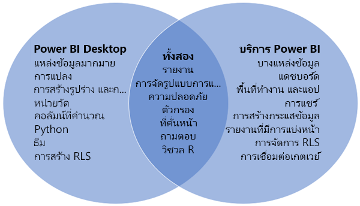
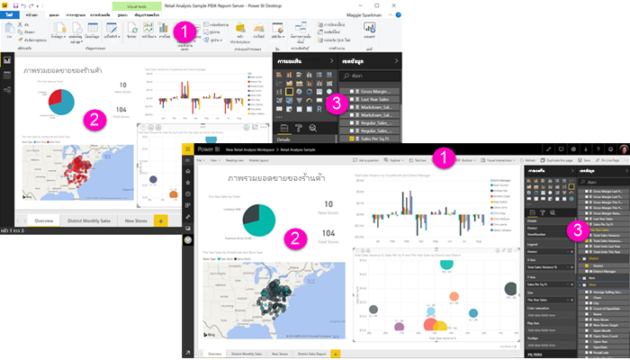

# การเปรียบเทียบ Power BI Desktop และบริการ Power BI

ในแผนภาพเวนน์ที่เปรียบเทียบ Power BI Desktop และบริการ Power BI พื้นที่ตรงกลางจะแสดงให้เห็นว่าทั้งสองทับซ้อนกันอย่างไร งานบางอย่างที่คุณสามารถทำได้ทั้งใน Power BI Desktop หรือบริการ แต่ทั้งสองด้านของแผนภาพเวนน์ แต่ละแอปพลิเคชันและบริการมีคุณสมบัติที่เป็นเอกลักษณ์  

**Power BI Desktop** เป็นการวิเคราะห์ข้อมูลและเครื่องมือสร้างรายงานที่สมบูรณ์ เมื่อคุณติดตั้งแอปพลิเคชันฟรีบนคอมพิวเตอร์ของคุณ คุณสามารถเชื่อมต่อกับแหล่งข้อมูลที่แตกต่างกันมากมายและรวมเข้าด้วยกัน (มักเรียกว่าการสร้างแบบจำลอง) ลงในแบบจำลองข้อมูล [แนวทางการเริ่มใช้งาน Power BI Desktop](desktop-getting-started.md) ผ่านกระบวนการต่างๆ

**บริการ Power BI** เป็นบริการออนไลน์บนคลาวด์สำหรับการแก้ไขรายงานและความร่วมมือกับทีมและองค์กร คุณสามารถเชื่อมต่อกับแหล่งข้อมูลในบริการ Power BI ได้เช่นกัน แต่การสร้างแบบจำลองจะถูกจำกัดไว้ 

ผู้ออกแบบรายงานส่วนใหญ่ที่ทำงานในโครงการข่าวกรองธุรกิจ ใช้ **Power BI Desktop** เพื่อสร้างรายงาน จากนั้นจึงใช้**บริการของ Power BI** เพื่อแชร์รายงานของพวกเขาให้กับผู้อื่น

## การแก้ไขรายงาน

ทั้งในแอปพลิเคชันและบริการ คุณสามารถสร้างและแก้ไข *รายงาน* ได้ รายงานสามารถมีตั้งแต่หนึ่งหน้าขึ้นไปได้ พร้อมด้วยวิชวลและชุดของวิชวล คุณสามารถเพิ่มบุ๊กมาร์ก ปุ่ม ตัวกรอง และการเจาะลึกข้อมูลเพื่อปรับปรุงการนำทางในรายงานของคุณ

เครื่องมือแก้ไขรายงานใน Power BI Desktop และในบริการมีความคล้ายคลึงกัน โดยมีการสร้างขึ้นจากสามส่วน:  

1. แถบการนำทางด้านบนแตกต่างกันใน Power BI Desktop และบริการ    
2. พื้นที่รายงาน     
3. **ช่องข้อมูล** **การแสดงภาพ**และพื้นที่**ตัวกรอง**

วิดีโอนี้แสดงเครื่องมือแก้ไขรายงานใน Power BI Desktop 

<iframe width="560" height="315" src="https://www.youtube.com/embed/IkJda4O7oGs" frameborder="0" allowfullscreen></iframe>

## ทำงานร่วมกันในบริการ Power BI

หลังจากที่คุณสร้างรายงาน คุณสามารถบันทึกลง *พื้นที่ทำงาน* ใน **บริการ Power BI** ซึ่งคุณและเพื่อนร่วมงานของคุณทำงานร่วมกันได้ คุณสร้าง *แดชบอร์ด* ด้านบนของรายงานเหล่านั้น จากนั้น คุณแชร์แดชบอร์ดและรายงานเหล่านั้นกับผู้ใช้รายงานภายในและภายนอกองค์กรของคุณ ผู้ใช้รายงานของคุณดูรายงานเหล่านั้นในบริการ Power BI ใน [มุมมองการอ่าน](consumer/end-user-reading-view.md) ไม่ใช่มุมมองการแก้ไข พวกเขาไม่มีการเข้าถึงคุณลักษณะทั้งหมดที่พร้อมใช้งานสำหรับผู้สร้างรายงาน 

## ขั้นตอนถัดไป

[Power BI Desktop คืออะไร](desktop-what-is-desktop.md)

[สร้างรายงาน](service-report-create-new.md)นี้ในบริการของ Power BI

[แนวคิดพื้นฐานสำหรับนักออกแบบรายงาน](service-basic-concepts.md)

มีคำถามเพิ่มเติมหรือไม่? [ลองไปที่ชุมชน Power BI](http://community.powerbi.com/)

