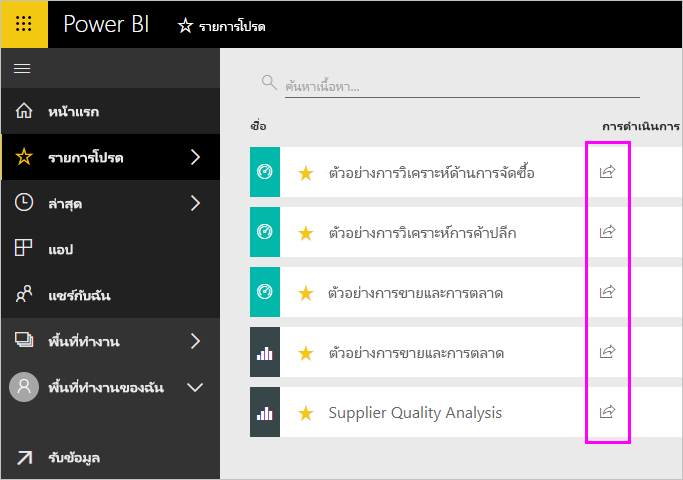
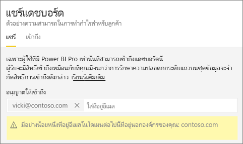
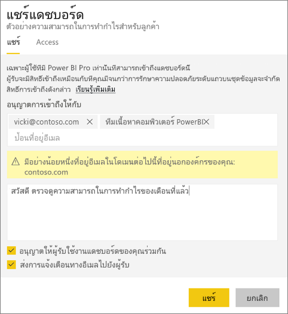
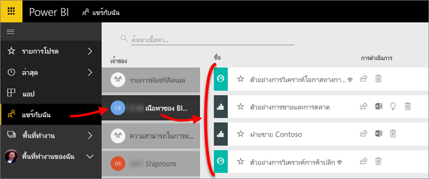
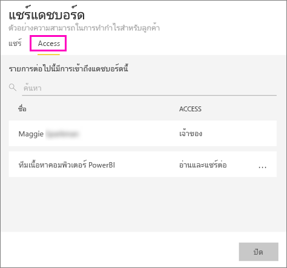
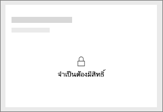
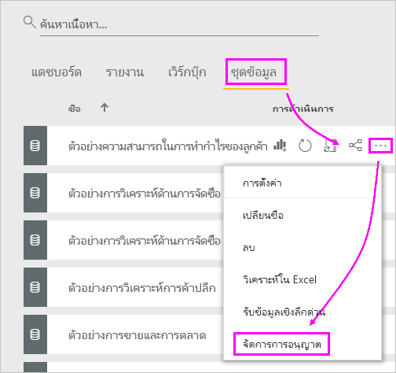
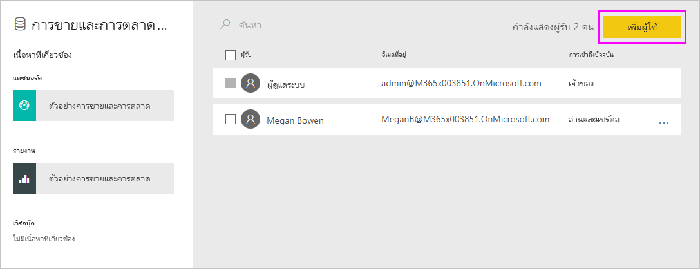
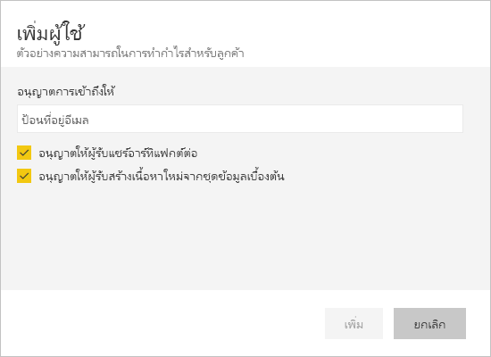

# แชร์แดชบอร์ด Power BI และรายงานกับเพื่อนร่วมงานและคนอื่นๆ
*แชร์*เป็นวิธีที่ดีเมื่อต้องให้บางคนสามารถเข้าถึงแดชบอร์ดและรายงานของคุณ Power BI ยังมี[หลายวิธีอื่นๆ เพื่อที่จะทำงานร่วมกันและเผยแพร่แดชบอร์ดและรายงาน](service-how-to-collaborate-distribute-dashboards-reports.md)

ด้วยการใช้งานร่วมกัน ไม่ว่าคุณแชร์เนื้อหาภายใน หรือภายนอกองค์กร คุณจำเป็นต้องมี[สิทธิ์การใช้งาน Power BI Pro](service-features-license-type.md) ผู้รับของคุณยังจำเป็นสิทธิ์การใช้งาน Power BI Pro เว้นแต่ว่าเนื้อหาอยู่ในการ[ความจุ Premium](service-premium-what-is.md) 

คุณสามารถแชร์แดชบอร์ดและรายงานจากสถานที่ส่วนใหญ่ในบริการ Power BI: รายการโปรด ล่าสุด การแชร์กับฉัน (ถ้าเจ้าของอนุญาต), My Workspace หรือพื้นที่ทำงานอื่น ๆ เมื่อคุณแชร์แดชบอร์ดหรือรายงาน ซึ่งคนที่คุณแชรให้จะสามารถดูและโต้ตอบกับมันได้ แต่ไม่สามารถแก้ไขมันได้ พวกเขาจะเห็นข้อมูลเดียวกันกับที่คุณเห็นในแดชบอร์ดหรือรายงาน เว้นแต่ว่า[ระดับแถวความปลอดภัย (RLS)](service-admin-rls.md)ได้ถูกใช้ เหล่าเพื่อนร่วมงานที่คุณแชร์กับสามารถใช้ร่วมกับเพื่อนร่วมงานของพวกเขา ถ้าคุณอนุญาต บุคคลภายนอกองค์กรของคุณสามารถยังดู และโต้ตอบกับแดชบอร์ดหรือรายงาน แต่ไม่สามารถแชร์ 

คุณยังสามารถ[แชร์แดชบอร์ดจากแอป Power BI จากอุปกรณ์เคลื่อนใด ๆ](consumer/mobile/mobile-share-dashboard-from-the-mobile-apps.md)ได้ อย่างไรก็ตาม คุณไม่สามารถแชร์แดชบอร์ดจาก Power BI Desktop

## วิดีโอ: แชร์แดชบอร์ด
ดู Amanda แชร์แดชบอร์ดของเธอกับเพื่อนร่วมงานภายในและภายนอกบริษัทของเธอ แล้วทำตามคำแนะนำทีละขั้นตอนด้านล่างวิดีโอเพื่อลองทำด้วยตนเอง

<iframe width="560" height="315" src="https://www.youtube.com/embed/0tUwn8DHo3s?list=PL1N57mwBHtN0JFoKSR0n-tBkUJHeMP2cP" frameborder="0" allowfullscreen></iframe>

## แชร์แดชบอร์ดหรือรายงาน

1. ในรายการของแดชบอร์ดหรือรายงาน หรือในแดชบอร์ดหรือรายงานที่เปิด ให้เลือก**แชร์** 

2. ในกล่องทางด้านบน ใส่อยู่อีเมลแบบเต็มสำหรับแต่ละบุคคล กลุ่มการแจกจ่ายหรือกลุ่มความปลอดภัย คุณไม่สามารถใช้ร่วมกับรายการการแจกแจงแบบไดนามิก 
   
   คุณสามารถใช้ร่วมกันกับบุคคลที่มีอยู่ภายนอกองค์กรของคุณ แต่คุณจะเห็นคำเตือน
   
    
 
   >[!NOTE]
   >กล่องป้อนข้อมูลสนับสนุน มากที่สุด 100 ผู้ใช้หรือกลุ่ม ถ้าคุณต้องการแชร์กับผู้ใช้จำนวนมาก พิจารณาการสร้างแดชบอร์ดในพื้นที่ทำงาน และ[แจกจ่ายเป็นแอ](service-create-distribute-apps.md)
   > 
   > 

3. เพิ่มข้อความถ้าคุณต้องการ เลือกหรือไม่เลือกก็ได้
4. เมื่อต้องให้เพื่อนร่วมงานของคุณแชร์เนื้อหาของคุณกับผู้อื่น ตรวจสอบ**อนุญาตให้ผู้รับแชร์แดชบอร์ดของคุณ (หรือรายงาน)**
   
   อนุญาตให้ผู้อื่นแชร์นั้นถูกเรียกว่า*resharing* ถ้าคุณให้อนุญาตพวกเขา พวกเขาสามารถแชร์ต่อจาก Power BI service และแอปสำหรับอุปกรณ์เคลื่อน หรือส่งต่ออีเมลเชิญให้กับผู้อื่นในองค์กรของคุณ คำเชิญจะหมดอายุในอีกหนึ่งเดือน บุคคลภายนอกองค์กรของคุณไม่สามารถแชร์ต่อได้ ในฐานะเจ้าของเนื้อหา คุณสามารถปิดการแชร์ซ้ำ หรือเพิกถอนการแชร์ซ้ำบนแต่ละเซลล์ ดู[หยุดการแชร์ หรือหยุดไม่ให้ผู้อื่นแชร์](#stop-sharing-or-stop-others-from-sharing)

5. เลือก**แชร์**
   
     
   
   Power BI ส่งอีเมลคำเชิญบุคคล แต่ไม่ สามารถจัด กลุ่ม ด้วยลิงก์ไปยังเนื้อหาที่แชร์ คุณดูแจ้งเตือนที่**ประสบความสำเร็จ** 
   
   เมื่อผู้รับในองค์กรของคุณคลิกลิงก์ Power BI เพิ่มแดชบอร์ดหรือรายงานหน้ารายการ**แชร์กับฉัน**ของพวกเขา พวกเขาสามารถเลือกชื่อของคุณเมื่อต้องการดูเนื้อหาทั้งหมดที่คุณได้่แชร์กับพวกเขา 
   
   
   
   เมื่อผู้รับภายนอกองค์กรของคุณคลิกลิงก์ พวกเขาจะเห็นแดชบอร์ดหรือรายงาน แต่ไม่ใช่ในพอร์ทัล Power BI ปกติ สำหรับข้อมูลเพิ่มเติม ดู[แชร์แดชบอร์ดหรือรายงานกับบุคคลภายนอกองค์กรของคุณ](#share-a-dashboard-or-report-with-people-outside-your-organization)

## ใครสามารถเข้าถึงแดชบอร์ดหรือรายงานที่คุณแชร์ได้บ้าง
ในบางครั้งคุณจำเป็นต้องดูบุคคลที่คุณได้แชร์กับ และดูว่าพวกเขาได้แชร์กับใคร:

1. ในรายการของแดชบอร์ดและรายงาน หรือในแดชบอร์ดหรือรายงานเอง ให้เลือก**แชร์**  
2. ในการ**แชร์แดชบอร์ด**หรือ**แชร์รายงาน**กล่องโต้ตอบ เลือก**Access**
   
    

    บุคคลภายนอกองค์กรของคุณได้แสดงอยู่ในขณะ**ผู้เยี่ยมชม**

## หยุดการแชร์หรือหยุดไม่ให้ผู้อื่นทำการแชร์
เฉพาะแดชบอร์ดหรือเจ้าของรายงานที่สามารถเปิดหรือปิดการแชร์ต่อได้

### ถ้าคุณยังไม่ได้ส่งคำเชิญการแชร์
* ล้างการ**อนุญาตให้ผู้รับแชร์แดชบอร์ดของคุณ (หรือรายงาน)** กล่องกาเครื่องหมายที่ด้านล่างของคำเชิญก่อนที่จะส่ง

### ถ้าคุณเคยแชร์แดชบอร์ดหรือรายงาน
1. ในรายการของแดชบอร์ดและรายงาน หรือในแดชบอร์ดหรือรายงานเอง ให้เลือก**แชร์**  
2. ในการ**แชร์แดชบอร์ด**หรือ**แชร์รายงาน**กล่องโต้ตอบ เลือก**Access**
   
    
3. เลือกจุดไข่ปลา ( **...** ) ถัดจาก**อ่านและแชร์ต่อ**และเลือก
   
   
   
   * **อ่าน**เพื่อป้องกันไม่ให้บุคคลที่ใช้ร่วมกันกับผู้อื่น
   * **ลบการเข้าถึง**เพื่อป้องกันไม่ให้บุคคลที่มองเห็นเนื้อหาที่แชร์ทั้งหมด

4. ในการ**ลบการเข้าถึง**โต้ตอบกล่อง ตัดสินใจถ้า คุณยังต้องการลบการเข้าถึงเนื้อหาที่เกี่ยวข้อง เช่นรายงานและชุดข้อมูล ถ้าคุณลบรายการที่ มีไอคอนคำเตือนจะดีการเอาเนื้อหาที่เกี่ยวข้องยัง เนื่องจากจะไม่แสดงอย่างถูกต้อง

    

## แชร์แดชบอร์ดหรือรายงานที่มีบุคคลภายนอกองค์กรของคุณ
เมื่อคุณแชร์กับบุคคลภายนอกองค์กรของคุณ พวกเขาได้รับอีเมลที่ มีลิงก์การแชร์แดชบอร์ดหรือรายงาน ซึ่งพวกเขาต้องลงชื่อเข้าใช้ Power BI เพื่อดู ถ้าพวกเขาไม่มีสิทธิ์ใช้งาน Power BI Pro พวกเขาสามารถลงทะเบียนขอสิทธิ์การใช้งานหลังจากคลิกที่ลิงค์

หลังจากที่พวกเขาลงชื่อเข้าใช้ พวกเขาเห็นแชร์แดชบอร์ดหรือรายงาน ในหน้าต่างเบราว์เซอร์ของตนเอง ไม่ได้อยู่ ในพอร์ทัล Power BI ปกติของพวกเขา ในภายหลังเข้าถึงแดชบอร์ดหรือรายงานนี้ พวกเขาต้องบุ๊กมาร์กลิงก์

พวกเขาจะไม่สามารถแก้ไขเนื้อหาใดๆ ในแดชบอร์ดหรือรายงานนี้ได้ แม้ว่าพวกเขาสามารถโต้ตอบกับแผนภูมิ และเปลี่ยนตัวกรองหรือตัวแบ่งส่วนข้อมูล พวกเขาไม่สามารถบันทึกการเปลี่ยนแปลงของพวกเขา 

เฉพาะผู้รับโดยตรงของคุณเท่านั้นที่สามารถดูแดชบอร์ดหรือรายงานที่แชร์ได้ ตัวอย่างเช่น ถ้าคุณส่งอีเมลไปยังVicki@contoso.comมีเพียง Vicki เท่านั้นที่สามารถมองเห็นแดชบอร์ด ไม่มีใครสามารถดูแดชบอร์ด แม้ว่าพวกเขามีลิงค์ Vicki ต้องใช้อยู่อีเมเดียวกันเพื่อเข้าถึง ถ้าเธอลงทะเบียน ด้วยอยู่อีเมอื่น ๆ เธอจะไม่สามารถเข้าถึงแดชบอร์ด

บุคคลภายนอกองค์กรของคุณไม่เห็นข้อมูลใด ๆ ถ้าดำเนินการรักษาความปลอดภัยระดับบทบาท หรือแถวบนแบบจำลองแบบตาราง Analysis Services ภายในองค์กร

ถ้าคุณส่งลิงก์จากแอปสำหรับอุปกรณ์เคลื่อน Power BI ไปยังบุคคลภายนอกองค์กรของคุณ คลิกลิงก์เปิดแดชบอร์ด ในเบราว์เซอร์ ไม่ได้อยู่ ในแอปสำหรับอุปกรณ์เคลื่อน Power BI

ถ้าคุณ[อนุญาตให้ผู้เยี่ยมชมภายนอกเพื่อแก้ไข และจัดการเนื้อหาในองค์กร](service-admin-portal.md#export-and-sharing-settings)ค่าเริ่มต้นใช้งานเท่านั้นประสบการณ์การใช้งานไม่นำไปใช้ [เรียนรู้เพิ่มเติม](service-admin-azure-ad-b2b.md)

## ข้อจำกัดและข้อควรพิจารณา
สิ่งที่ควรทราบเกี่ยวกับการแชร์แดชบอร์ดและรายงาน

* โดยทั่วไป คุณและเพื่อนร่วมงานของคุณเห็นข้อมูลเดียวกันในแดชบอร์ดหรือรายงาน ดังนั้น ถ้าคุณมีสิทธิ์ในการดูข้อมูลเพิ่มเติมมากกว่าที่พวกเขาดูได้ พวกเขาจะสามารถดูข้อมูลของคุณทั้งหมดในแดชบอร์ดหรือรายงาน อย่างไรก็ตาม ถ้า[การรักษาความปลอดภัยระดับแถว (RLS)](service-admin-rls.md)ถูกนำไปใช้กับชุดข้อมูลในแดชบอร์ดหรือรายงาน ดังนั้นข้อมูลประจำตัวของทุกคนที่จะถูกใช้เพื่อกำหนดว่าข้อมูลใดที่พวกเขาสามารถเข้าถึงได้
* คุณแชร์แดชบอร์ดของคุณกับทุกคนสามารถดู และโต้ตอบกับรายงานที่เกี่ยวข้องใน[มุมมองการอ่าน](consumer/end-user-reading-view.md#reading-view)ได้ ไม่สามารถสร้างรายงาน หรือบันทึกการเปลี่ยนแปลงการรายงานที่มีอยู่ได้
* แม้ว่าไม่มีใครสามารถดู หรือดาวน์โหลดชุดข้อมูล พวกเขาสามารถเข้าถึงชุดข้อมูลโดยตรง โดยใช้การวิเคราะห์ใน Excel คุณลักษณะ ผู้ดูแลระบบสามารถจำกัดความสามารถในการใช้การวิเคราะห์ใน Excel สำหรับทุกคนในกลุ่ม อย่างไรก็ตาม การกำหนดขอบเขตของคนภายในกลุ่มนั้น จะเป็นเพียงข้อจำกัดสำหรับพื้นที่ทำงานที่เป็นของสมาชิกกลุ่มเท่านั้น
* ทุกคนสามารถ[รีเฟรชข้อมูล](refresh-data.md)ได้ด้วยตนเอง
* ถ้าคุณใช้ Office 365 สำหรับอีเมล คุณสามารถแชร์กับสมาชิกของกลุ่มการเผยแพร่ โดยการใส่อยู่อีเมลที่เชื่อมโยงกับกลุ่มการเผยแพร่
* เพื่อนร่วมงานที่แชร์โดเมนของคุณอีเมล และเพื่อนร่วมงานที่มีโดเมนจะแตกต่างกัน แต่ลงทะเบียนภายในผู้เช่าเดียวกัน สามารถแชร์แดชบอร์ดกับผู้อื่น ตัวอย่าง ถ้าโดเมน contoso.com และ contoso2.com ลงทะเบียนในผู้เช่าเดียวกันและที่อยู่อีเมลของคุณ คือkonrads@contoso.comแล้วทั้งravali@contoso.comและgustav@contoso2.comสามารถแชร์ ตราบใดที่คุณมอบให้พวกเขาสิทธิ์การใช้ร่วมกันได้
* ถ้าเพื่อนร่วมงานของคุณมีสิทธิ์เข้าถึงแดชบอร์ดเฉพาะหรือรายงาน คุณสามารถส่งลิงก์โดยตรง โดยการคัดลอก URL เมื่อคุณอยู่บนแดชบอร์ดหรือรายงาน ตัวอย่างเช่น: `https://powerbi.com/dashboards/g12466b5-a452-4e55-8634-xxxxxxxxxxxx`
* ในทำนองเดียวกัน ถ้าเพื่อนร่วมงานของคุณมีสิทธิ์เข้าถึงแดชบอร์ดระบุ คุณสามารถ[ส่งลิงก์โดยตรงไปยังรายงานพื้นฐาน](service-share-reports.md)ได้ 
* คุณสามารถใช้ร่วมกับ ที่ most, 100 ผู้ใช้หรือกลุ่มการดำเนินการเดียวที่ใช้ร่วมกัน อย่างไรก็ตาม คุณสามารถให้การเข้าถึงหน่วยข้อมูลแก่ผู้ใช้ได้มากกว่า 500 คน เมื่อต้องการทำเช่นนั้น แชร์หลายครั้ง โดยการระบุผู้ใช้ทีละ หรือแชร์กับกลุ่มผู้ใช้ที่ประกอบด้วยผู้ใช้ทั้งหมด

## การแก้ไขปัญหาการแชร์

### ผู้รับแดชบอร์ดของฉันเห็นไอคอนล็อกในไทล์หรือข้อความ "ต้องมีการให้อนุญาต"

บุคคลที่คุณแชรให้อาจเห็นไทล์ในแดชบอร์ด หรือข้อความ "ต้องมีการให้อนุญาต" ถูกล็อก เมื่อพวกเขาพยายามดูรายงาน

ถ้าเป็นเช่นนั้น คุณจำเป็นต้องให้สิทธิ์ในชุดข้อมูลเบื้องต้น:

1. ไปที่แท็บ**ชุดข้อมูล**ในรายการของคุณเนื้อหา

1. เลือกจุดไข่ปลา ( **...** ) ถัดจากชุดข้อมูล แล้วเลือก**จัดการสิทธิ์**

    

1. เลือก**เพิ่มผู้ใช้**

    

1. ใส่อยู่อีเมลแบบเต็มของบุคคล กลุ่มการเผยแพร่หรือกลุ่มความปลอดภัยของคุณ คุณไม่สามารถใช้ร่วมกับรายการการแจกแจงแบบไดนามิก

    

1. เลือก**เพิ่ม**

### ฉันไม่สามารถแชร์แดชบอร์ดหรือรายงาน

เมื่อต้องแชร์แดชบอร์ดหรือรายงาน ที่คุณต้องการให้สิทธิ์ในการแชร์เนื้อหาพื้นฐาน นั่นคือ ใด ๆ ที่เกี่ยวข้องกับรายงานและชุดข้อมูล ถ้าคุณเห็นข้อความว่า คุณไม่สามารถใช้ร่วมกัน ขอให้ผู้เขียนรายงานเพื่อให้ คุณแชร์สิทธิ์สำหรับรายงานและชุดข้อมูลเหล่านั้น

## ขั้นตอนถัดไป
* มีคำติชมหรือไม่? ไปที่[ไซต์ชุมชน Power BI](https://community.powerbi.com/)พร้อมกับคำแนะนำของคุณ
* [ฉันควรทำงานร่วมกัน และแชร์แดชบอร์ดและรายงานได้อย่างไร](service-how-to-collaborate-distribute-dashboards-reports.md)
* [แชร์รายงาน Power BI ที่ถูกกรอง](service-share-reports.md)
* มีคำถามหรือไม่ [ลองไปที่ชุมชน Power BI](http://community.powerbi.com/)

