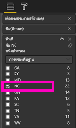
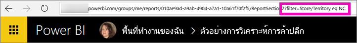
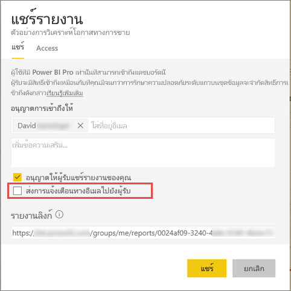

# แชร์รายงาน Power BI ที่ถูกกรองร่วมกับเพื่อนร่วมงานของคุณ
*แชร์*เป็นวิธีที่ดีเมื่อต้องให้บางคนสามารถเข้าถึงแดชบอร์ดและรายงานของคุณ Power BI ยังนำเสนอ[หลายวิธีอื่นๆ เพื่อที่จะทำงานร่วมกันและเผยแพร่แดชบอร์ดและรายงาน](service-how-to-collaborate-distribute-dashboards-reports.md)

ด้วยการแชร์ คุณและผู้รับของคุณต้องมี[สิทธิ์การใช้งาน Power BI Pro](service-free-vs-pro.md)หรือเนื้อหาจำเป็นต้องเป็นแบบ[ความจุพรีเมียม](service-premium.md) มีข้อเสนอแนะไหม ทีม Power BI สนใจคำติชมของคุณเสมอ ดังนั้นให้ไปที่[ไซต์ชุมชน Power BI](https://community.powerbi.com/)

คุณสามารถแชร์รายงานกับผู้ร่วมงานในโดเมนอีเมลเดียวกับคุณ จากสถานที่ส่วนใหญ่ใน Power BI service เช่น รายการโปรด ล่าสุด แชร์กับฉัน (ถ้าเจ้าของอนุญาต) My Workspace หรือพื้นที่ทำงานอื่นๆของคุณได้ เมื่อคุณแชร์แดชบอร์ดหรือรายงาน ซึ่งคนที่คุณแชรให้จะสามารถดูและโต้ตอบกับมันได้ แต่ไม่สามารถแก้ไขมันได้ พวกเขาจะเห็นข้อมูลเดียวกันกับที่คุณเห็นในแดชบอร์ดหรือรายงาน เว้นแต่ว่า[ระดับแถวความปลอดภัย (RLS)](service-admin-rls.md)จะถูกใช้ 

## กรองข้อมูลและแชร์รายงาน
จะเกิดอะไรขึ้นถ้าคุณต้องการแชร์รายงานที่ถูกกรอง อาจรายงานที่แสดงเฉพาะข้อมูลสำหรับเมือง หรือพนักงานขาย หรือปีที่เฉพาะเจาะจง คุณทำสิ่งนี้ โดยการสร้าง URL แบบกำหนดเอง

1. เปิดรายงานใน[มุมมองการแก้ไข](consumer/end-user-reading-view.md) ให้ใช้ตัวกรอง และบันทึกรายงาน
   
   ในตัวอย่างนี้ เรากำลังกรอง[ตัวอย่างการวิเคราะห์ร้านค้าปลีก](sample-tutorial-connect-to-the-samples.md)เพื่อแสดงเฉพาะค่าที่**Territory**เท่ากับ**NC**
   
   
2. เพิ่มต่อไปนี้ลงในส่วนท้ายของ URL ของหน้ารายงาน
   
   ?filter=*tablename*/*fieldname* eq *value*
   
    เขตข้อมูลต้องเป็นชนิด**สตริง**และทั้ง*tablename*หรือ*fieldname*ไม่สามารถประกอบด้วยช่องว่างได้
   
   ในตัวอย่างของเรา ชื่อของตารางคือ**Store**ชื่อของเขตข้อมูลคือ**Territory**และค่าเราต้องการกรองคืิิอ**NC**:
   
    ?filter=Store/Territory eq 'NC'
   
   
   
   เบราว์เซอร์ของคุณเพิ่มอักขระพิเศษเพื่อแสดงเครื่องหมายทับ ช่องว่าง และเครื่องหมายบุพบท ดังนั้นคุณมี
   
   app.powerbi.com/groups/me/reports/010ae9ad-a9ab-4904-a7a1-xxxxxxxxxxxx/ReportSection2?filter=Store%252FTerritory%20eq%20%27NC%27

3. [แชร์รายงาน](service-share-dashboards.md)แต่ล้างเช็คบ๊อกซ์**ส่งอีเมลแจ้งเตือนไปยังผู้รับ** 

    

4. ส่งลิงค์กับตัวกรองที่คุณสร้างไว้ก่อนหน้านี้

## ขั้นตอนถัดไป
* มีคำติชมหรือไม่? ไปที่[ไซต์ชุมชน Power BI](https://community.powerbi.com/)พร้อมกับคำแนะนำของคุณ
* [ฉันควรทำงานร่วมกัน และแชร์แดชบอร์ดและรายงานได้อย่างไร](service-how-to-collaborate-distribute-dashboards-reports.md)
* [แชร์แดชบอร์ด](service-share-dashboards.md)
* มีคำถามเพิ่มเติมหรือไม่ [ลองไปที่ชุมชน Power BI](http://community.powerbi.com/)

