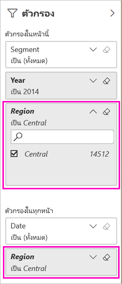

# สองวิธีการในการแชร์รายงาน Power BI ที่กรองแล้ว
*แชร์*เป็นวิธีที่ดีเมื่อต้องให้บางคนสามารถเข้าถึงแดชบอร์ดและรายงานของคุณ จะเกิดอะไรขึ้นถ้าคุณต้องการแชร์รายงานที่ถูกกรอง อาจรายงานที่แสดงเฉพาะข้อมูลสำหรับเมือง หรือพนักงานขาย หรือปีที่เฉพาะเจาะจง ลองกรองรายงานและแชร์ หรือสร้าง URL แบบกำหนดเอง รายงานถูกกรองเมื่อผู้รับเปิดเป็นครั้งแรก ผู้รับสามารถลบตัวกรองโดยการปรับเปลี่ยน URL 

Power BI ยังนำเสนอ[วิธีอื่นๆ เพื่อที่จะทำงานร่วมกันและเผยแพร่แดชบอร์ดและรายงาน](service-how-to-collaborate-distribute-dashboards-reports.md) ด้วยการแชร์ คุณและผู้รับของคุณต้องมี[สิทธิ์การใช้งาน Power BI Pro](service-features-license-type.md)หรือเนื้อหาจำเป็นต้องเป็นแบบ[ความจุพรีเมียม](service-premium-what-is.md) 

## สองวิธีการในการกรองรายงาน

สำหรับเทคนิคการกรองทั้งสองวิธี เราจะใช้แอปแม่แบบตัวอย่างการตลาดและการขาย ต้องการลองใช้หรือไม่ คุณสามารถติดตั้ง[แอปแม่แบบตัวอย่างการตลาดและการขาย](https://appsource.microsoft.com/product/power-bi/microsoft-retail-analysis-sample.salesandmarketingsample?tab=Overview)ได้เช่นกัน

### ตั้งค่าตัวกรอง

เปิดรายงานใน[มุมมองการแก้ไข](consumer/end-user-reading-view.md)และใช้ตัวกรอง

ในตัวอย่างนี้ เรากำลังกรองหน้าประเภท YTD ของแอปแม่แบบตัวอย่างการตลาดและการขายเพื่อแสดงเฉพาะค่าที่**ภูมิภาค**นั้นคือ**ภาคกลาง** 
 

บันทึกรายงาน

### สร้างตัวกรองใน URL

เมื่อคุณเพิ่มตัวกรองลงในส่วนท้ายของ URL หน้ารายงาน ลักษณะการทำงานนั้นจะแตกต่างกันไปเล็กน้อย หน้าที่กรองแล้วมีลักษณะเหมือนกัน อย่างไรก็ตาม Power BI จะเพิ่มตัวกรองไปยังรายงานทั้งหมด และลบค่าอื่น ๆ ออกจากบานหน้าต่างตัวกรอง  

เพิ่มต่อไปนี้ลงในส่วนท้ายของ URL ของหน้ารายงาน
   
    ?filter=*tablename*/*fieldname* eq *value*
   
เขตข้อมูลต้องเป็นประเภทตัวเลข วันที่เวลา หรือสตริง ค่าใน *tablename* หรือ *fieldname* ไม่สามารถประกอบด้วยช่องว่างได้
   
ในตัวอย่างของเรา ชื่อของตารางคือ **Geo** ชื่อของเขตข้อมูลคือ **Region** และค่าที่เราต้องการกรองคือ **Central**:
   
    ?filter=Geo/Region eq 'Central'

เบราว์เซอร์ของคุณเพิ่มอักขระพิเศษเพื่อแสดงเครื่องหมายทับ ช่องว่าง และเครื่องหมายบุพบท ดังนั้นคุณต้องลงท้ายด้วย:
   
    app.powerbi.com/groups/xxxx/reports/xxxx/ReportSection4d00c3887644123e310e?filter=Geo~2FRegion%20eq%20'Central'

บันทึกรายงาน

ดูรายละเอียดเพิ่มมากขึ้นได้ในบทความ [กรองรายงานโดยใช้พารามิเตอร์ของสตริงคิวรีใน URL](service-url-filters.md)

## แชร์รายงานี่กรองแล้ว

1. เมื่อคุณ[แชร์รายงาน](service-share-dashboards.md) และล้างกล่องกาเครื่องหมาย **ส่งอีเมลแจ้งเตือนไปยังผู้รับ**

    

4. ส่งลิงค์กับตัวกรองที่คุณสร้างไว้ก่อนหน้านี้

## ขั้นตอนถัดไป
* [วิธีการแชร์งานของคุณใน Power BI](service-how-to-collaborate-distribute-dashboards-reports.md)
* [แชร์แดชบอร์ด](service-share-dashboards.md)
* มีคำถามเพิ่มเติมหรือไม่ [ลองไปที่ชุมชน Power BI](https://community.powerbi.com/)
* มีคำติชมหรือไม่? ไปที่[ไซต์ชุมชน Power BI](https://community.powerbi.com/) พร้อมกับคำแนะนำของคุณ

