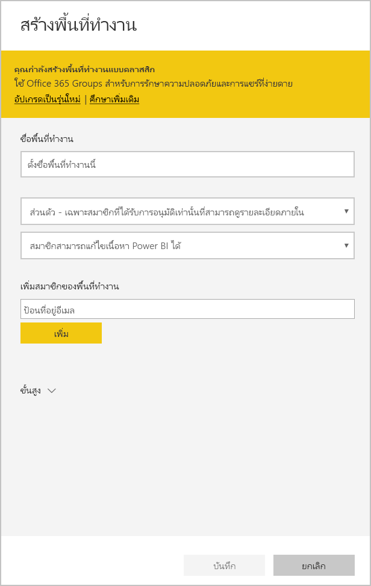

# สร้างแอปแม่แบบใน Power BI

แอป*แม่แบบ Power BI*ใหม่เปิดให้คู่ค้า Power BI สร้างแอป Power BI ด้วยโค๊ดเพียงเล็กน้อยหรือไม่มีเลย และปรับใช้กับลูกค้า Power BI ทุกท่าน  บทความนี้ประกอบด้วยคำแนะนำทีละขั้นตอนเพื่อสร้างแอปแม่แบบ Power BI

คุณสามารถสร้างรายงาน Power BI และแดชบอร์ด คุณสามารถทำการ*สร้างแอปแม่แบบ*และสร้าง และวิเคราะห์เนื้อหาลงในแพคเก*แอป*ได้ คุณสามารถปรับใช้แอปของคุณกับผู้เช่า Power BI อื่น ๆ ผ่านใด ๆ มีแพลตฟอร์ม เช่น AppSource หรือใช้ในบริการเว็บของคุณเอง ในฐานะตัวสร้าง คุณสามารถสร้างแพคเกจวิเคราะห์ได้รับการป้องกันสำหรับการแจกแจง

ผู้เช่า power BI ผู้ดูแลระบบควบคุม และควบคุมว่าใครในองค์กรของพวกเขาสามารถสร้างแอปแม่แบบ และผู้ที่สามารถติดตั้ง ผู้ใช้เหล่านั้นที่ได้รับอนุญาตสามารถติดตั้งแอปแม่แบบ จาก นั้นปรับเปลี่ยน และแจกจ่ายให้กับผู้ใช้ Power BI ในองค์กรของพวกเขา

## ข้อกำหนดเบื้องต้น

นี่คือข้อกำหนดสำหรับการสร้างแอปแม่แบบ:  

- [ใบอนุญาต Power BI pro ](service-self-service-signup-for-power-bi.md)
- แอ[ติดตั้ง Power BI Desktop](desktop-get-the-desktop.md) (ไม่บังคับ)
- ความชำนาญกับ[แนวคิดพื้นฐานของ Power BI](service-basic-concepts.md)
- สิทธิ์ในการแชร์แอปแม่แบบเป็นสาธารณะ ดู[พอร์ทัลของผู้ดูแลระบบ Power BI การตั้งค่าแอปแม่แบบ](service-admin-portal.md#template-apps-settings)สำหรับรายละเอียด

## สร้างพื้นที่ทำงานของแม่แบบ

เมื่อต้องสร้างแอปแม่แบบที่คุณสามารถแจกจ่ายให้กับผู้เช่า Power BI อื่น ๆ คุณต้องสร้างแอปในพื้นที่ใดพื้นที่หนึ่งของพื้นที่ทำงานใหม่

1. ในการบริการของ Power BI ให้เลือก**พื้นที่ทำงาน** > **สร้างพื้นที่ทำงาน**

    

2. ใน**สร้างพื้นที่ทำงาน** ให้เลือก**อัปเกรดเป็นใหม่**

    

3. ใส่ชื่อ คำอธิบาย (ไม่บังคับ), และภาพโลโก้ (ไม่บังคับ) สำหรับพื้นที่ทำงาน

4. ขยายหัวข้อ **ขั้นสูง** แล้วเลือก **พัฒนาแอปเทมเพลต**

    

5. เลือก**บันทึก**
>[!NOTE]
>คุณต้องมีสิทธิ์จากผู้ดูแลระบบ Power BI เพื่อเลื่อนระดับแอปเทมเพลต

## สร้างเนื้อหาในแอปแม่แบบของคุณ

เช่นเดียวกับพื้นที่ทำงานของ Power BI ขั้นตอนต่อไปของคุณคือการสร้างเนื้อหาในพื้นที่ทำงาน  

- [สร้างเนื้อหา Power BI ](index.yml)ในพื้นที่ทำงาน

ถ้าคุณกำลังใช้พารามิเตอร์ใน Power Query ตรวจสอบว่า พวกเขามีชนิดที่กำหนดไว้อย่างดี (ตัวอย่าง ข้อความ) ชนิดใด ๆ และไบนารีไม่รองรับ

[เคล็ดลับสำหรับการเขียนแอปแม่แบบใน Power BI](service-template-apps-tips.md) มีคำแนะนำเพื่อพิจารณาเมื่อสร้างรายงานและแดชบอร์ดสำหรับแอปแม่แบบของคุณ

## พื้นที่ทำงานของแอปแม่แบบ (ตัวอย่าง)

หลังจากที่คุณมีเนื้อหาในพื้นที่ทำงานของคุณ คุณก็พร้อมที่จะจัดแพคเกจในแอปแม่แบบ ขั้นตอนแรกคือการ สร้างแอแม่แบบทดสอบ เข้าถึงได้เท่านั้นจากภายในองค์กรของคุณในผู้เช่าของคุณ

1. ในพื้นที่ทำงานแม่แบบ ให้เลือก**สร้างแอป**

    

    ที่นี่ คุณกรอกตัวเลือกการสร้างเพิ่มเติมสำหรับแอปเทมเพลต ห้าประเภท

    **การกำหนดตราสินค้า**

    
    - ชื่อแอปฯ
    - คำอธิบาย
    - เว็บไซต์การสนับสนุน (ลิงก์จะแสดงใต้ข้อมูลแอปหลังจากแจกจ่ายแอปเทมเพลตเป็นแอปองค์กรซ้ำ)
    - โลโก้แอป (ขีดจำกัดขนาดไฟล์ 45K อัตราส่วนกว้างยาว 1:1, รูปแบบ .png .jpg .jpeg)
    - สีธีมของแอป

    **การสืบค้นเนื้อหา**

    เปิดใช้งาน **ระบบจัดทำส่วนการสืบค้นใหม่**โดยคุณสามารถกำหนดรายละเอียดหน้าต่างนำทางของแอป (ดูรายละเอียดในหัวข้อ [ออกแบบรูปแบบการสืบค้น](service-create-distribute-apps.md#design-the-navigation-experience) ในบทความนี้)

   
    
    **หน้าเริ่มต้นของแอป:** หากคุณตัดสินใจไม่ใช้ระบบจัดทำส่วนการสืบึ้น คุณสามารถเลือกหน้าเชื่อมโยงของแอปดังกล่าวได้ กำหนดรายงานหรือแดชบอร์ดเป็น เพจเริ่มต้นของแอปของคุณ ใช้หน้าเชื่อมโยงเพื่อจะทำให้เกิดความน่าสนใจมากที่สุด

    **ควบคุม**

    กำหนดขีดจำกัดและข้อจำกัดที่ผู้ใช้แอปพลิเคชันของคุณจะต้องใช้กับเนื้อหาของแอปพลิเคชันของคุณ คุณสามารถใช้ตัวควบคุมนี้เพื่อปกป้องทรัพย์สินทางปัญญาในแอปของคุณ

    

    >[!NOTE]
    >การส่งออกเป็นรูปแบบ .pbix จะถูกบล็อกเสมอสำหรับผู้ใช้ที่ติดตั้งแอป

    **พารามิเตอร์**

    ใช้ประเภทนี้เพื่อจัดการลักษณะการทำงานของพารามิเตอร์เมื่อเชื่อมต่อกับแหล่งข้อมูล เรียนรู้เพิ่มเติมเกี่ยวกับ[การสร้างพารามิเตอร์การสอบถาม](https://powerbi.microsoft.com/blog/deep-dive-into-query-parameters-and-power-bi-templates/)

    
    - **ค่า**: ค่าพารามิเตอร์เริ่มต้น
    - **จำเป็นต้องมี**: ใช้ข้อมูลนี้เพื่อกำหนดตัวติดตั้งเพื่อป้อนค่าพารามิเตอร์เฉพาะผู้ใช้
    - **ล็อก**: การล็อกจะช่วยป้องกันไม่ให้ตัวติดตั้งอัปเดตพารามิเตอร์

    **สิทธิ์การเข้าถึง**ในขั้นตอนการทดสอบ ตัดสินใจว่า ผู้อื่นในองค์กรของคุณสามารถติดตั้ง และทดสอบแอปของคุณ ไม่ต้องกังวล คุณสามารถกลับมาเปลี่ยนการตั้งค่าเหล่านี้ในภายหลัง (การตั้งค่าไม่มีผลต่อสิทธิ์การเข้าถึงแอปเทมเพลตที่แจกจ่าย)

2. เลือก**สร้างแอป**

    คุณเห็นข้อความทดสอบแอปพร้อม มีลิงก์เพื่อคัดลอก และแชร์กับแอปทดสอบของคุณ

    

    นอกจากนี้คุณได้ทำขั้นตอนแรกของกระบวนการจัดการวางจำหน่าย ซึ่งตามหลัง

## จัดการการเผยแพร่แอปแม่แบบ

ก่อนที่คุณเผยแพร่แอปนี้แม่แบบสาธารณะ คุณต้องการให้แน่ใจว่า จะพร้อมใช้งาน Power BI ได้สร้างบานหน้าต่างการจัดการวางจำหน่าย ที่คุณสามารถติดตาม และตรวจสอบเส้นทางการเผยแพร่แอปเต็มรูปแบบ คุณยังสามารถจุดชนวนการเปลี่ยนจากขั้นตอนหนึ่งไปอีกขั้น ขั้นตอนทั่วไปคือ:

- สร้างแอปทดสอบ: สำหรับการทดสอบเท่านั้นในองค์กรของคุณ
- เลื่อนระดับแพคเกจทดสอบถึงขั้นตอนก่อนการผลิต: ทดสอบภายนอกองค์กรของคุณ
- เลื่อนระดับแพคเกจก่อนการผลิตไปยังการผลิต: เวอร์ชันการผลิต
- ลบแพคเกจใด หรือเริ่มต้นจากขั้นตอนก่อนหน้า

URL ไม่เปลี่ยนแปลงเมื่อคุณย้ายระหว่างขั้นตอนการเผยแพร่ การเพิ่มระดับไม่มีผลต่อ URL เอง

ลองดูขั้นตอนต่าง ๆ:

1. ในพื้นที่ทำงานแม่แบบ เลือก**การจัดการวางจำหน่าย**

    

2. เลือก**สร้างแอป**

    ถ้าคุณสร้างแอปทดสอบใน**สร้างแอปแม่แบบทดสอบ**ด้านบน จุดสีเหลืองอยู่ถัดจาก**การทดสอบ** และคุณไม่จำเป็นต้องเลือก**สร้างแอป**ต่อไปนี้ ถ้าคุณเลือก คุณกลับไปในกระบวนการสร้างแอปแม่แบบ

3. เลือก**รับลิงก์**

    

4. เมื่อต้องทดสอบประสบการณ์การใช้งานการติดตั้งแอป คัดลอกลิงก์ในหน้าต่างการแจ้งเตือน และวางลงในหน้าต่างเบราว์เซอร์ใหม่

    จากที่นี่ คุณกำลังติดตามลูกค้าของคุณจะทำตามขั้นตอนเดียว ดูที่ [แจกจ่ายแอปแม่แบบในองค์กรของคุณ - Power BI (ตัวอย่าง)](service-template-apps-install-distribute.md) สำหรับเวอร์ชันดังกล่าว

5. ในกล่องโต้ตอบ ให้เลือก **ติดตั้ง**

    เมื่อการติดตั้งสำเร็จ คุณจะเห็นการแจ้งเตือนว่าแอปใหม่ของคุณพร้อมแล้ว

6. เลือก**ไปยังแอป**
7. ใน**เริ่มต้นใช้งานแอปของคุณใหม่**คุณดูแอปของคุณเป็นลูกค้าของคุณจะเห็น

    
8. เลือก**สำรวจแอป**เพื่อตรวจสอบแอปทดสอบด้วยข้อมูลตัวอย่าง
9. เมื่อต้องทำการเปลี่ยนแปลง ย้อนกลับไปยังแอปในพื้นที่ทำงานเดิม ปรับปรุงแอปทดสอบจนกว่าคุณจะพอใจ
10. เมื่อคุณพร้อมที่จะเลื่อนระดับแอปของคุณไปยังการผลิตล่วงหน้าสำหรับการทดสอบภายนอกผู้เช่าของคุณเพิ่มเติม ย้อนกลับไป**การจัดการวางจำหน่าย**บานหน้าต่างและเลือก**เลื่อนแอป** 

    
    >[!NOTE]
    > เมื่อเลื่อนระดับแอปแล้ว แอปจะอยู่ในรูปแบบสาธารณะที่พร้อมใช้งานภายนอกองค์กรของคุณ

    ถ้าคุณไม่เห็นตัวเลือกนั้น ติดต่อผู้ดูแลระบบ Power BI ของคุณเพื่อให้สิทธิ์แก่[สิทธิ์สำหรับการพัฒนาแอปแม่แบบ](service-admin-portal.md#template-apps-settings)ในพอร์ทัลผู้ดูแล
11. เลือก**เลื่อน**เพื่อยืนยันตัวเลือกของคุณ
12. คัดลอก URL นี้ใหม่เมื่อต้องแชร์ภายนอกผู้เช่าของคุณสำหรับการทดสอบ ลิงก์นี้ยังเป็นลิงก์ที่คุณส่งเพื่อเริ่มกระบวนการแจกจ่ายแอปของคุณบน AppSource โดยการสร้าง [ข้อเสนอพอร์ทัล Cloud Partner ใหม่](https://docs.microsoft.com/azure/marketplace/cloud-partner-portal/power-bi/cpp-publish-offer) ส่งลิงก์ก่อนการผลิตไปยังพอร์ทัล Cloud Partner เท่านั้น หลังจากที่อนุมัติแอปและคุณได้รับแจ้งเตือนว่า มีการเผยแพร่ใน AppSource แล้วเท่านั้น คุณจึงจะสามารถเลื่อนระดับแพคเกจนี้ไปเป็นการผลิตใน Power BI
13. เมื่อแอปของคุณพร้อมสำหรับการผลิตหรือการแชร์ผ่าน AppSource ย้อนกลับไป**การจัดการวางจำหน่าย**บานหน้าต่างและเลือก**เลื่อนแอป**ถัดจาก**ก่อนการผลิต**
14. เลือก**เลื่อน**เพื่อยืนยันตัวเลือกของคุณ

    ตอนนี้ แอปของคุณอยู่ ในการ ผลิต และพร้อมสำหรับการแจกแจง

    

เพื่อให้แอปของคุณพร้อมใช้งานทั่วไปหลายพันของผู้ใช้ Power BI ในโลก เราขอแนะนำให้คุณส่งไปยัง AppSource ดู[ข้อเสนอแอปพลิเคชันPower BI](https://docs.microsoft.com/azure/marketplace/cloud-partner-portal/power-bi/cpp-power-bi-offer)สำหรับรายละเอียด

## ขั้นตอนถัดไป

ดูวิธีการที่ลูกค้าของคุณโต้ตอบกับแอปแม่แบบของคุณใน[ติดตั้ง กำหนดเอง และเผยแพรแอปแม่แบบในองค์กรของคุณ](service-template-apps-install-distribute.md)

ดู[ข้อเสนอแอปพลิเคชัน BI Power](https://docs.microsoft.com/azure/marketplace/cloud-partner-portal/power-bi/cpp-power-bi-offer)สำหรับรายละเอียดเกี่ยวกับการแจกจ่ายแอปของคุณ
