# เคล็ดลับสำหรับการเขียนแอปแม่แบบใน Power BI (ตัวอย่าง)

แอป*แม่แบบ Power BI*ใหม่เปิดให้คู่ค้า Power BI สร้างแอป Power BI ด้วยโค๊ดเพียงเล็กน้อยหรือไม่มีเลย และปรับใช้กับลูกค้า Power BI ทุกท่าน  บทความนี้ประกอบด้วยคำแนะนำทีละขั้นตอนเพื่อสร้างแอปแม่แบบ Power BI

คุณสามารถสร้างรายงาน Power BI และแดชบอร์ด คุณสามารถทำการ*สร้างแอปเทมเพล*รุ่น และวิเคราะห์เนื้อหาลงในแพคเกจการ*แอ*ได้ คุณอาจปรับใช้แอปของคุณกับผู้เช่า Power BI อื่น ๆ ผ่านใด ๆ มีแพลตฟอร์ม เช่น AppSource หรือใช้ในบริการเว็บของคุณเอง เป็นตัวสร้าง คุณจึงสามารถสร้างแพคเกจวิเคราะห์ได้รับการป้องกันสำหรับการแจกแจง

ผู้เช่า power BI ผู้ดูแลระบบควบคุม และควบคุมว่าใครในองค์กรของพวกเขาสามารถสร้างแอปแม่แบบ และผู้ที่สามารถติดตั้ง ผู้ใช้ที่ได้รับอนุญาตสามารถติดตั้งแอปเทมเพล จาก นั้นปรับเปลี่ยน และแจกจ่ายให้กับผู้ใช้ Power BI ในองค์กรของพวกเขา

## ข้อกำหนดเบื้องต้น

นี่คือข้อกำหนดสำหรับการสร้างแอปแม่แบบ:  

- [ใบอนุญาต Power BI pro ](service-self-service-signup-for-power-bi.md)
- แอ[ติดตั้ง Power BI Desktop](desktop-get-the-desktop.md) (ไม่บังคับ)
- ความคุ้นเคยกับการ[แนวคิดพื้นฐานของ Power BI](service-basic-concepts.md)
- สิทธิ์ในการสร้างแอปแม่แบบ ดู[พอร์ทัลของผู้ดูแลระบบ Power BI การตั้งค่าแอปแม่แบบ](service-admin-portal.md#template-apps-settings-preview)สำหรับรายละเอียด

## เปิดใช้งานโหมดนักพัฒนาแอป

เมื่อต้องสร้างแอปแม่แบบ คุณสามารถแจกจ่ายให้กับผู้เช่า Power BI อื่น ๆ คุณต้องอยู่ในโหมดนักพัฒนาแอป มิฉะนั้น คุณเพิ่งสร้างแอสำหรับผู้บริโภค Power BI ในองค์กรของคุณเอง

1. บริการ Power BI ในเบราว์เซอร์
2. ไปยัง**ตั้งค่า** > **ทั่วไป** > **นักพัฒนา** > **เปิดใช้งานโหมดพัฒนาแอปแม่แบบ**.

    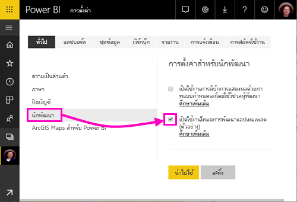

    ถ้าคุณไม่เห็นตัวเลือกนั้น ติดต่อผู้ดูแลระบบ Power BI ของคุณเพื่อให้สิทธิ์แก่[สิทธิ์สำหรับการพัฒนาแอปแม่แบบ](service-admin-portal.md#template-apps-settings-preview)ในพอร์ทัลผู้ดูแล

3. เลือก**นำไปใช้**

## พื้นที่ทำงานของแอปแม่แบบ (ตัวอย่าง)

เมื่อต้องสร้างแอปแม่แบบ คุณสามารถแจกจ่ายให้กับผู้เช่า Power BI อื่น ๆ คุณต้องอยู่ในโหมดนักพัฒนาแอป

1. ในการบริการ Power BI service, เลือก **พื้นที่การทำงาน** > **สร้างพื้นที่ทำงานแอป**.

    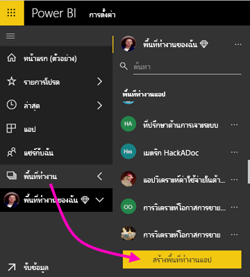

2. ใน**สร้างพื้นที่ทำงานแอ**ใน**แสดงตัวอย่างพื้นที่ทำงานที่ปรับปรุง**เลือก**ลองใช้ทันที**

    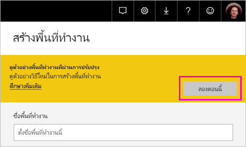

3. ใส่ชื่อ คำอธิบาย (ไม่บังคับ), และโลโก้รูป (ไม่บังคับ) สำหรับพื้นที่ทำงานของแอป

4. เลือก**พัฒนาแอปแม่แบบ**

    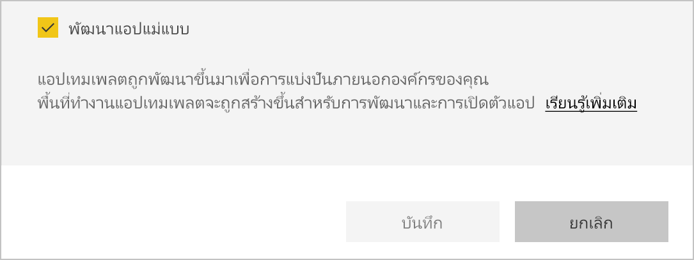

5. เลือก**บันทึก**
>[!NOTE]
>คุณต้องมีสิทธิ์จากผู้ดูแลระบบ Power BI ของคุณเพื่อเลื่อนระดับแอปเทมเพลต

## สร้างเนื้อหาในแอปแม่แบบของคุณ

เป็นปกติ Power BI app พื้นที่ทำงาน ขั้นตอนถัดไปของคุณมีการ สร้างเนื้อหาในพื้นที่ทำงาน  ในเวอร์ชันนี้ตัวอย่างของแอปแม่แบบ เราสนับสนุนเฉพาะถึงหนึ่งในแต่ละชนิด: ชุดข้อมูลหนึ่ง รายงานหนึ่ง และแดชบอร์ดเดียว

- [สร้างเนื้อหา Power BI ของคุณ](power-bi-creator-landing.md)ในพื้นที่ทำงานของแอป

ถ้าคุณกำลังใช้พารามิเตอร์ใน Power Query ตรวจสอบว่า พวกเขามีชนิดที่กำหนดไว้อย่างดี (ตัวอย่าง ข้อความ) ชนิดใด ๆ และไบนารีไม่รองรับ

[เคล็ดลับสำหรับการเขียนแอปแม่แบบใน Power BI (ตัวอย่าง)](service-template-apps-tips.md)มีคำแนะนำเพื่อพิจารณาเมื่อสร้างรายงานและแดชบอร์ดสำหรับแอปของคุณแม่แบบ

## พื้นที่ทำงานของแอปแม่แบบ (ตัวอย่าง)

หลังจากที่คุณมีเนื้อหาในพื้นที่ทำงานของคุณ คุณก็พร้อมที่จะจัดแพคเกจในแอปแม่แบบ ขั้นตอนแรกคือการ สร้างแอแม่แบบทดสอบ เข้าถึงได้เท่านั้นจากภายในองค์กรของคุณในผู้เช่าของคุณ

1. ในพื้นที่ทำงานแอปแม่แบบ เลือก**สร้างแอป**

    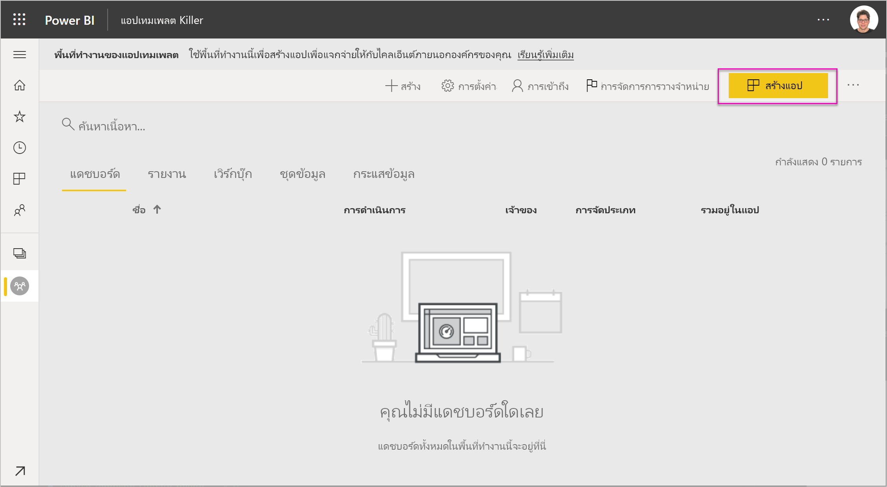

    ที่นี่ คุณกรอกตัวเลือกเพิ่มเติมสร้างสำหรับเทมเพลแอ ห้าประเภท:

    **การกำหนดตราสินค้า**

    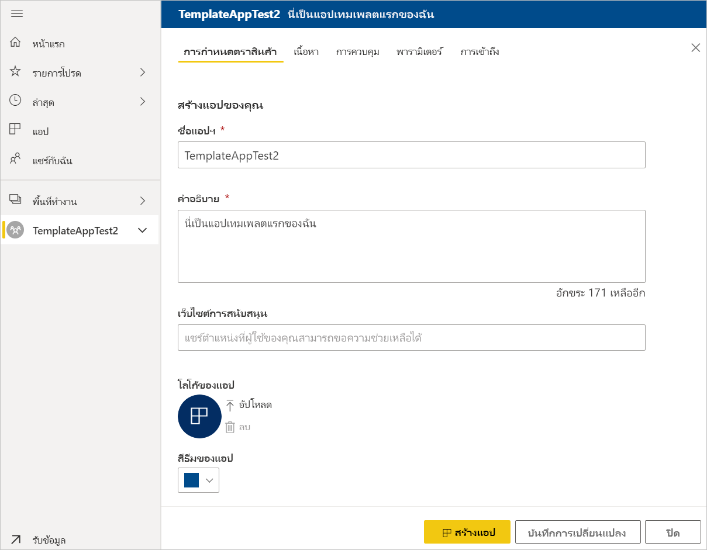
    - ชื่อแอปฯ
    - คำอธิบาย
    - ไซต์การสนับสนุน (ลิงก์จะแสดงภายใต้ข้อมูลแอหลัง redistributing เทมเพลแอปเป็นแอองค์กร)
    - โลโก้ของแอป (ขีดจำกัดขนาดไฟล์ 45K อัตราส่วนกว้างยาว 1:1, .png .jpg .jpeg รูป)
    - สีชุดรูปแบบแอป

    **เนื้อหา**

    **เพจเริ่มต้นแอป:** กำหนดรายงานหรือแดชบอร์ดเป็นเพจเริ่มต้นของแอปของคุณ ใช้เพจเริ่มต้นที่จะช่วยให้เข้าใจขวา:

    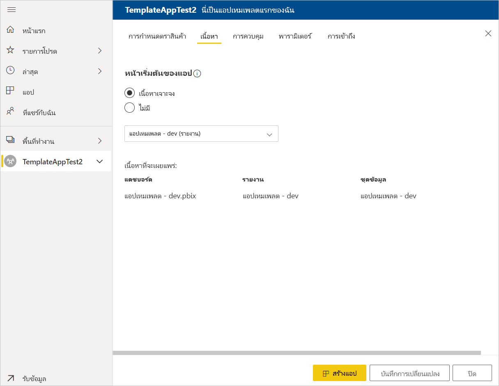

    **ควบคุม**

    ตั้งค่าขีดจำกัดและข้อจำกัดที่ผู้ใช้แอปพลิเคชันของคุณจะพบกับเนื้อหาของแอปพลิเคชันของคุณ คุณสามารถใช้ตัวควบคุมนี้เพื่อปกป้องทรัพย์สินทางปัญญาในแอปของคุณ

    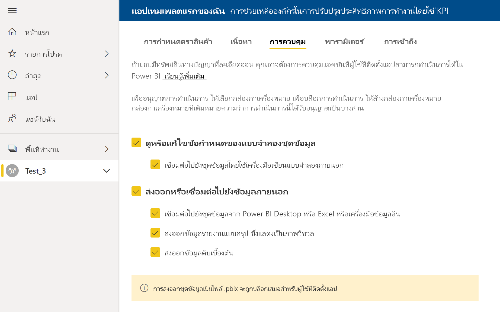

    >[!NOTE]
    >ส่งออกเป็นรูปแบบ.pbix เสมอถูกบล็อกสำหรับผู้ใช้ที่ติดตั้งแอป

    **พารามิเตอร์**

    ใช้ประเภทนี้เพื่อจัดการพารามิเตอร์ลักษณะการทำงานเมื่อเชื่อมต่อกับแหล่งข้อมูล เรียนรู้เพิ่มเติมเกี่ยวกับ[สร้างพารามิเตอร์แบบสอบถาม](https://powerbi.microsoft.com/blog/deep-dive-into-query-parameters-and-power-bi-templates/)

    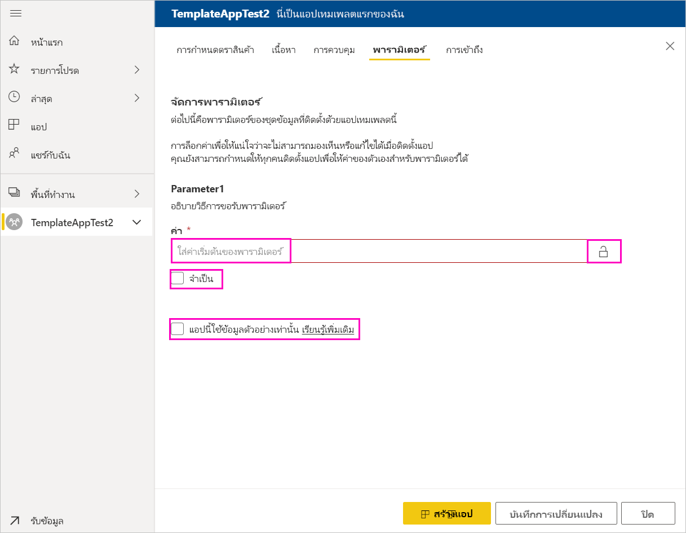
    - **ค่า**: พารามิเตอร์ค่าเริ่มต้น
    - **จำเป็นต้องมี**: ใช้ข้อมูลนี้เพื่อติดตั้งเพื่อป้อนค่าพารามิเตอร์เฉพาะผู้ใช้จำเป็นต้อง
    - **ล็อก**: ล็อกป้องกันไม่ให้ตัวติดตั้งอัปเดพารามิเตอร์
    - **คง**: เปิดใช้งานในกรณีที่ประกอบด้วยแอ*เฉพาะ*ข้อมูลตัวอย่าง เมื่อคุณเลือก**สแตติก**ตัวช่วยสร้างการติดตั้งไม่ขอให้ผู้ใช้เชื่อมต่อแหล่งข้อมูล

    **เข้าถึง**ในขั้นตอนการทดสอบ ตัดสินใจว่า ผู้อื่นในองค์กรของคุณสามารถติดตั้ง และทดสอบแอปของคุณ ไม่ต้องกังวล คุณสามารถกลับมา และเปลี่ยนการตั้งค่าเหล่านี้ในภายหลัง (ตั้งค่าไม่มีผลต่อการเข้าถึงของแอแม่แบบกระจาย)

2. เลือก**สร้างแอป**

    คุณเห็นข้อความทดสอบแอปพร้อม มีลิงก์เพื่อคัดลอก และแชร์กับแอปทดสอบของคุณ

    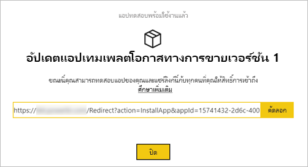

    นอกจากนี้คุณได้ทำขั้นตอนแรกของกระบวนการจัดการวางจำหน่าย ซึ่งตามหลัง

## จัดการการเผยแพร่แอปแม่แบบ

ก่อนที่คุณเผยแพร่แอปนี้แม่แบบสาธารณะ คุณต้องการให้แน่ใจว่า จะพร้อมใช้งาน Power BI ได้สร้างบานหน้าต่างการจัดการวางจำหน่าย ที่คุณสามารถติดตาม และตรวจสอบเส้นทางการเผยแพร่แอปเต็มรูปแบบ คุณยังสามารถจุดชนวนการเปลี่ยนจากขั้นตอนหนึ่งไปอีกขั้น ขั้นตอนทั่วไปคือ:

- สร้างแอปทดสอบ: สำหรับการทดสอบเท่านั้นในองค์กรของคุณ
- เลื่อนระดับแพคเกจทดสอบถึงขั้นตอนก่อนการผลิต: ทดสอบภายนอกองค์กรของคุณ
- เลื่อนระดับแพคเกจก่อนการผลิตไปยังการผลิต: เวอร์ชันการผลิต
- ลบแพคเกจใด หรือเริ่มต้นจากขั้นตอนก่อนหน้า

URL ไม่เปลี่ยนแปลงเมื่อคุณย้ายระหว่างขั้นตอนการเผยแพร่ โปรโมชันไม่มีผลต่อ URL นั้น

ลองไปขั้นตอน:

1. ในพื้นที่ทำงานแอปแม่แบบ เลือก**การจัดการวางจำหน่าย**

    

2. เลือก**สร้างแอป**

    ถ้าคุณสร้างแอปทดสอบใน**สร้างแอปแม่แบบทดสอบ**ด้านบน จุดสีเหลืองอยู่ถัดจาก**การทดสอบ** และคุณไม่จำเป็นต้องเลือก**สร้างแอป**ต่อไปนี้ ถ้าคุณเลือก คุณกลับไปในกระบวนการสร้างแอปแม่แบบ

3. เลือก**รับลิงก์**

    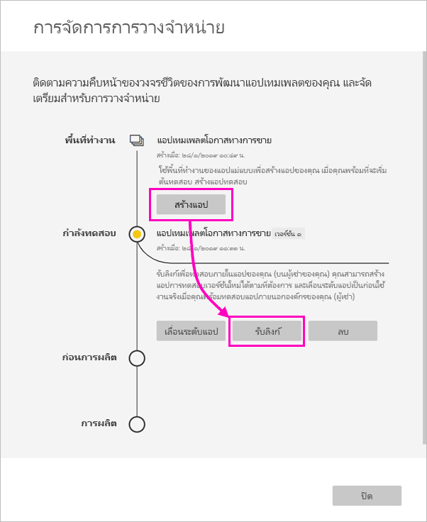

4. เมื่อต้องทดสอบประสบการณ์การใช้งานการติดตั้งแอป คัดลอกลิงก์ในหน้าต่างการแจ้งเตือน และวางลงในหน้าต่างเบราว์เซอร์ใหม่

    จากที่นี่ คุณกำลังติดตามลูกค้าของคุณจะทำตามขั้นตอนเดียว ดูที่ [แจกจ่ายแอปแม่แบบในองค์กรของคุณ - Power BI (ตัวอย่าง)](service-template-apps-install-distribute.md) สำหรับเวอร์ชันดังกล่าว

5. ในกล่องโต้ตอบ ให้เลือก **ติดตั้ง**

    เมื่อการติดตั้งสำเร็จ คุณจะเห็นการแจ้งเตือนว่าแอปใหม่ของคุณพร้อมแล้ว

6. เลือก**ไปยังแอป**
7. ใน**เริ่มต้นใช้งานแอปของคุณใหม่**คุณดูแอปของคุณเป็นลูกค้าของคุณจะเห็น

    
8. เลือก**สำรวจแอป**เพื่อตรวจสอบแอปทดสอบด้วยข้อมูลตัวอย่าง
9. เมื่อต้องทำการเปลี่ยนแปลง ย้อนกลับไปยังแอปในพื้นที่ทำงานเดิม ปรับปรุงแอปทดสอบจนกว่าคุณจะพอใจ
10. เมื่อคุณพร้อมที่จะเลื่อนระดับแอปของคุณไปยังการผลิตล่วงหน้าสำหรับการทดสอบภายนอกผู้เช่าของคุณเพิ่มเติม ย้อนกลับไป**จัดการการเผยแพร่**บานหน้าต่างและเลือก**เลื่อนแอ** 

    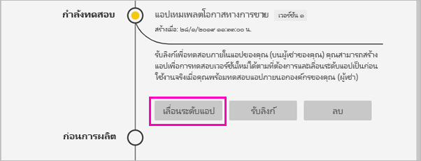

    >[!NOTE]
    > เมื่อแอถูกเลื่อนระดับ แบบสาธารณะพร้อมใช้งานภายนอกองค์กรของคุณ

11. เลือก**เลื่อน**เพื่อยืนยันตัวเลือกของคุณ
12. คัดลอก URL นี้ใหม่เมื่อต้องแชร์ภายนอกผู้เช่าของคุณสำหรับการทดสอบ ยังมีลิงก์นี้คุณส่งเพื่อเริ่มกระบวนการของการแจกจ่ายแอปของคุณใน AppSource โดยการสร้างตัว[ข้อเสนอพอร์ทัลค้า Cloud ใหม่](https://docs.microsoft.com/azure/marketplace/cloud-partner-portal/power-bi/cpp-publish-offer) ส่งลิงก์เท่านั้นก่อนการผลิตไปยังพอร์ทัลค้า Cloud เฉพาะหลังจากที่มีอนุมัติแอป และคุณได้รับแจ้งเตือนว่า มีการเผยแพร่ใน AppSource จาก นั้นคุณสามารถเลื่อนระดับแพคเกจนี้ไปยังการผลิตใน Power BI
13. เมื่อแอปของคุณพร้อมสำหรับการผลิตหรือการแชร์ผ่าน AppSource ย้อนกลับไป**การจัดการวางจำหน่าย**บานหน้าต่างและเลือก**เลื่อนแอป**ถัดจาก**ก่อนการผลิต**
14. เลือก**เลื่อน**เพื่อยืนยันตัวเลือกของคุณ

    ตอนนี้ แอปของคุณอยู่ ในการ ผลิต และพร้อมสำหรับการแจกแจง

    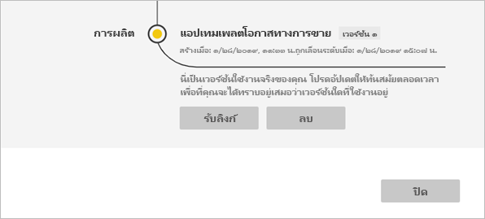

เพื่อให้แอปของคุณพร้อมใช้งานทั่วไปหลายพันของผู้ใช้ Power BI ในโลก เราขอแนะนำให้คุณส่งไปยัง AppSource ดู[ข้อเสนอแอปพลิเคชันPower BI](https://docs.microsoft.com/azure/marketplace/cloud-partner-portal/power-bi/cpp-power-bi-offer)สำหรับรายละเอียด

## อัปเดตแอปของคุณ

หลังจากที่แอปของคุณอยู่ในผลิต คุณสามารถเริ่มต้นในขั้นตอนการทดสอบโดยไม่รบกวนแอปในการผลิต

1. ในบานหน้าต่าง **การจัดการวางจำหน่าย** เลือก**สร้างแอป**
2. ย้อนกลับผ่านขั้นตอนการสร้างแอป
3. หลังจากที่คุณได้ตั้งค่า**Branding**, **เนื้อหา**, **ควบคุม**และ**Access**คุณเลือก**สร้างแอ**.
4. เลือก **ปิด** และกลับไปยัง**การจัดการวางจำหน่าย**

   คุณเห็นว่าคุณมีสองเวอร์ชันในขณะนี้: เวอร์ชันในผลิต รวมถึงเวอร์ชันใหม่ในการทดสอบ

    

5. เมื่อคุณพร้อมที่จะเลื่อนระดับแอปของคุณไปยังการผลิตล่วงหน้าสำหรับการทดสอบภายนอกผู้เช่าของคุณเพิ่มเติม กลับไปยังบานหน้าต่างการจัดการการเผยแพร่ แล้วเลือก**เลื่อนแอ**ถัดจาก**Testing**
6. ลิงก์ของคุณในขณะนี้กำลังถ่ายทอดสด ส่งอีกครั้งไปยังพอร์ทัลค้า Cloud โดยทำตามขั้นตอน[แอป Power BI ปรับปรุงข้อเสนอ](https://docs.microsoft.com/azure/marketplace/cloud-partner-portal/power-bi/cpp-update-existing-offer)

>[!NOTE]
>เลื่อนระดับแอปของคุณถึงขั้นตอนการผลิตเฉพาะหลังจากที่แอปของคุณจะได้รับอนุมัติ โดยพอร์ทัลค้าระบบคลาวด์ และคุณเผยแพร่

## ขั้นตอนถัดไป

ดูวิธีการที่ลูกค้าของคุณโต้ตอบกับแอปแม่แบบของคุณใน[ติดตั้ง กำหนดเอง และเผยแพรแอปแม่แบบในองค์กรของคุณ](service-template-apps-install-distribute.md)

ดู[ข้อเสนอแอปพลิเคชัน BI Power](https://docs.microsoft.com/azure/marketplace/cloud-partner-portal/power-bi/cpp-power-bi-offer)สำหรับรายละเอียดเกี่ยวกับการแจกจ่ายแอปของคุณ
