# ติดตั้งและแจกจ่ายแอปแม่แบบในองค์กรของคุณ - Power BI (ตัวอย่าง)

คุณเป็นนักวิเคราะห์ Power BI หรือไม่ ถ้าใช่ บทความนี้จะอธิบายวิธีการติดตั้ง*แอปเทมเพลต*เพื่อเชื่อมต่อกับบริการมากมายที่คุณใช้เพื่อดำเนินธุรกิจ เช่น Salesforce, Microsoft Dynamics และ Google Analytics คุณสามารถปรับเปลี่ยนแดชบอร์ดและรายงานตามความต้องการขององค์กรของคุณ และแจกจ่ายให้เพื่อนร่วมงานของคุณเป็น*แอป*ได้ 

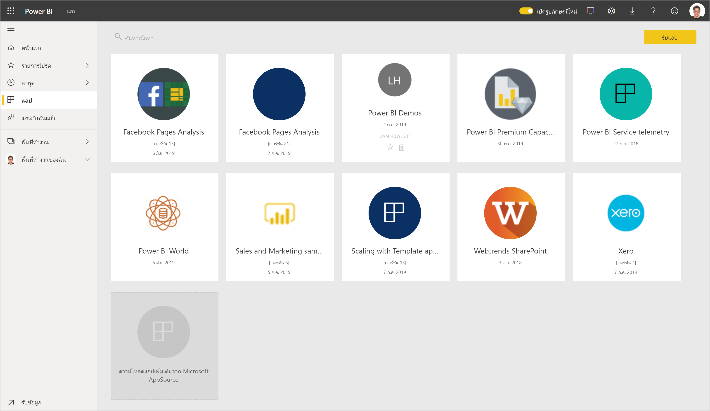

ถ้าคุณสนใจในการสร้างแอปแม่แบบเพื่อกระจายด้วยตนเอง ดู[สร้างแอปแม่แบบใน Power BI](service-template-apps-create.md) คู่ค้า Power BI สามารถสร้างแอป Power BI ด้วยโค๊ดเพียงเล็กน้อยหรือไม่มีเลย และปรับใช้กับลูกค้า Power BI ได้ 

## ข้อกำหนดเบื้องต้น  

นี่คือข้อกำหนดสำหรับการติดตั้ง กำหนดเอง และการแจกจ่ายแอปแม่แบบ: 

- [ใบอนุญาต Power BI pro](service-self-service-signup-for-power-bi.md)
- ความชำนาญกับ[แนวคิดพื้นฐานของ Power BI ](service-basic-concepts.md)
- ลิงก์ติดตั้งที่ถูกต้องจากผู้สร้างแอปแม่แบบหรือ AppSource 
- สิทธิ์ในการติดตั้งแอปแม่แบบ 

## สร้างแอปแม่แบบ

คุณอาจได้รับลิงก์ไปยังแอปแม่แบบ ไม่เช่นนั้น คุณสามารถค้นหา AppSource สำหรับแอปแม่แบบที่คุณสนใจได้ ใช้วิธีใด หลังจากที่คุณติดตั้ง คุณสามารถปรับเปลี่ยน และแจกจ่ายให้กับองค์กรของคุณเองได้

### ค้นหา AppSource จากเบราว์เซอร์

ในเบราว์เซอร์ เลือกลิงก์นี้เพื่อเปิด AppSource ให้ถูกกรองไปยังแอป Power BI:

- https://appsource.microsoft.com/marketplace/apps?product=power-bi

### ค้นหา AppSource จากบริการ Power BI

1. ในบานหน้าต่างนำทางของบริการ Power BI เลือก**แอป** > **รับแอป**

    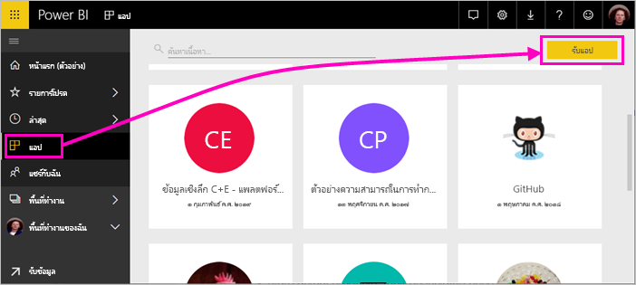

2. ใน AppSource เลือก**แอป**

    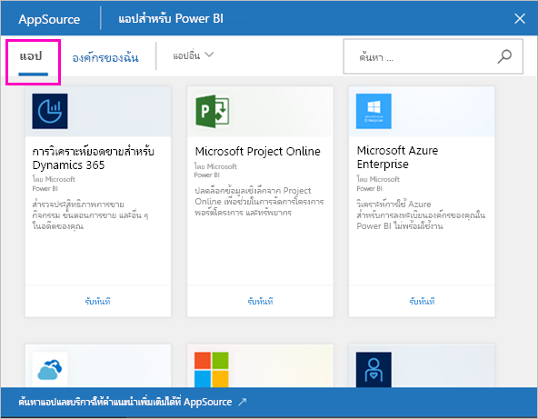

3. เรียกดูหรือค้นหาแอป จากนั้นเลือก**รับทันที**

4. ในกล่องโต้ตอบ ให้เลือก **ติดตั้ง**

    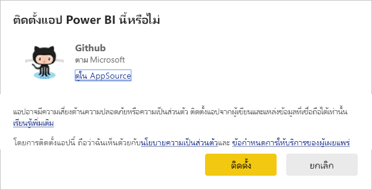ถ้าคุณมีสิทธิ์ในการเข้าใช้งาน Power BI Pro จะมีการติดตั้งแอปพร้อมกับพื้นที่ทำงานที่เกี่ยวข้อง คุณกำหนดค่าแอปในพื้นที่ทำงานเกี่ยวข้อง

    เมื่อการติดตั้งสำเร็จ คุณจะเห็นการแจ้งเตือนว่า แอปใหม่ของคุณพร้อมแล้ว
4. เลือก**ไปยังแอป**
5. ใน**เริ่มต้นใช้งานแอปใหม่ของคุณ**เลือกหนึ่งในสามตัวเลือก:

    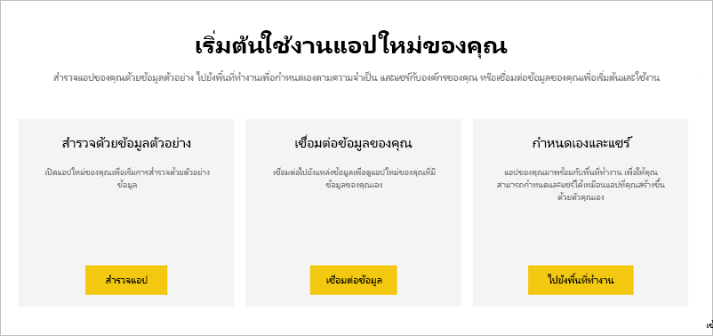

    - **สำรวจแอป**: สำรวจข้อมูลพื้นฐานตัวอย่าง เริ่มที่นี่เพื่อสัมผัสรูปลักษณ์ของแอป 
    - **เชื่อมต่อข้อมูล**: เปลี่ยนแหล่งข้อมูลจากข้อมูลตัวอย่างไปเป็นแหล่งข้อมูลของคุณเอง คุณสามารถกำหนดชุดข้อมูลพารามิเตอร์และแหล่งข้อมูลประจำตัวใหม่ได้ ดู[ข้อจำกัดที่ทราบแล้ว](service-template-apps-tips.md#known-limitations)ในบทความเคล็ดลับของแอปแม่แบบ 
    - **ไปยังพื้นที่ทำงาน**(ตัวเลือกที่ทันสมัยที่สุด): คุณสามารถอนุญาตให้มีการเปลี่ยนแปลงใดๆ ก็ได้โดยตัวสร้างแอป

    หรือข้ามกล่องโต้ตอบนี้ และเข้าถึงพื้นที่ทำงานที่เกี่ยวข้องโดยตรงผ่านทาง**พื้นที่ทำงาน**ในบานหน้าต่างนำทาง
    >[!NOTE]
    >การติดตั้งแอปแม่แบบที่ติดตั้งทั้ง *แอปองค์กร*และ*พื้นที่ทำงาน* อ่านเพิ่มเติมเกี่ยวกับ [กระจายแอปใน Power BI](service-create-distribute-apps.md)
 
6. ก่อนที่คุณแชร์กับเพื่อนร่วมงานของคุณ คุณจะต้องเชื่อมต่อกับข้อมูลของคุณเองก่อน คุณอาจต้องการปรับเปลี่ยนรายงานหรือแดชบอร์ดเพื่อทำให้ทำงานสำหรับองค์กรของคุณ คุณยังสามารถเพิ่มรายงานหรือแดชบอร์ดอื่นๆ ในตอนนี้

   ถ้าคุณเลือกลิงก์การติดตั้งสำหรับแอปที่ไม่ได้แสดงอยู่บน AppSource คุณจะได้รับกล่องโต้ตอบการตรวจสอบความถูกต้องโดยขอให้คุณยืนยันตัวเลือกของคุณ

   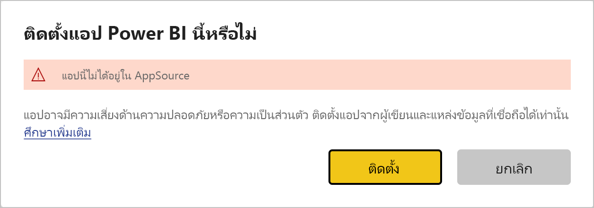

   >[!NOTE]
   >เมื่อต้องการติดตั้งแอปแม่แบบซึ่งจะแสดงอยู่บน AppSource คุณจำเป็นต้องขอสิทธิ์จากผู้ดูแลระบบของคุณ ดู[พอร์ทัลของผู้ดูแลระบบ Power BI การตั้งค่าแอปแม่แบบ](service-admin-portal.md#template-apps-settings)สำหรับรายละเอียด

## กำหนดค่าและเผยแพร่แอพ

หลังจากที่คุณได้ปรับปรุงแอปสำหรับองค์กรของคุณแล้ว คุณก็พร้อมที่จะเผยแพร่ได้ ขั้นตอนจะเหมือนกับการเผยแพร่แอปอื่นๆ

1. เมื่อคุณเสร็จสิ้นการกำหนดเอง ในมุมมองรายการพื้นที่ทำงานเลือก**อัปเดตแอป**ในมุมขวาบน  

    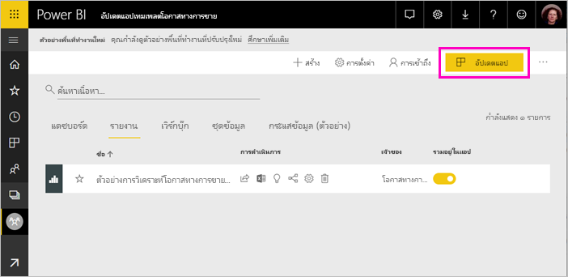

2. ใน**รายละเอียด** คุณสามารถปรับเปลี่ยนคำอธิบายและสีพื้นหลังได้

   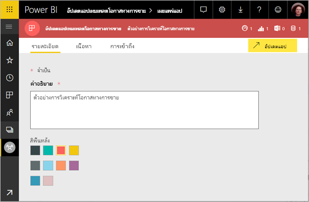

3. จาก **การนำทาง** คุณสามารถใช้ระบบจัดทำข้อมูลนำทางใหม่สำหรับแอพของคุณ หรือเลือกแดชบอร์ดหรือรายงานสำหรับหน้าเชื่อมโยง ดูรายละเอียดใน [ออกแบบรูปแบบการนำทาง](service-create-distribute-apps.md#design-the-navigation-experience)

   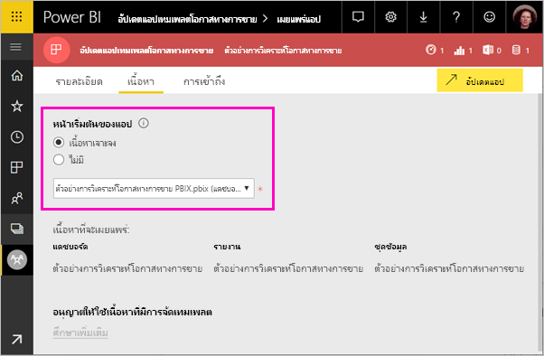

4. ใน**เข้าถึง** คุณให้การเข้าถึงโดยการเลือกผู้ใช้งานหรือบุคคลในองค์กรของคุณทั้งหมดอย่างใดอย่างหนึ่ง  

   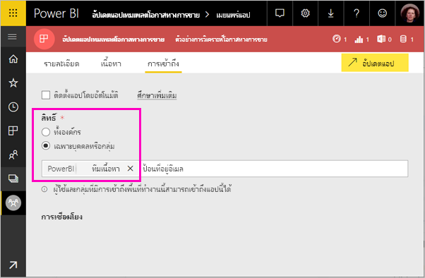

5. เลือก**อัปเดตแอป** 

6. หลังจากเผยแพร่เรียบร้อยแล้ว คุณสามารถคัดลอกลิงก์และแชร์กับใครก็ได้ตามคุณต้องการให้เข้าถึง ถ้าคุณได้แชร์แอปกับผู้อื่นแล้ว ผู้อื่นจะแอปบนแท็บ**องค์กรของฉัน**ใน AppSource

## อัปเดตแอปเทมเพลต

แอปเทมเพลตสามารถเผยแพร่เวอร์ชั่นใหม่สำหรับแอปเทมเพลตของตนผ่าน AppSource หรือลิงค์โดยตรง ในกรณีนี้ คุณจะสามารถอัพเดตแอปเทมเพลตได้เมื่อทำการติดตั้งแอพใหม่ที่มีเวอร์ชั่นเหมือนกันหรือใหม่กว่า

  >[!NOTE]
  >การติดตั้งเวอร์ชั่นใหม่จะเป็นการเขียนทับการเปลี่ยนแปลงใด ๆ ที่คุณมีกับรายงานดังกล่าวและแดชบอร์ด เก็บรายงานและแดชบอร์ดที่มีการอัปเดตโดยบันทึกไว้ในชื่อหรือตำแหน่งอื่นก่อนทำการติดตั้ง

- **เขียนทับเวอร์ชั่นปัจจุบัน:** เขียนทับพื้นที่ทำงานเป็นเวอร์ชั่นอัปเดตของแอปเทมเพลต

   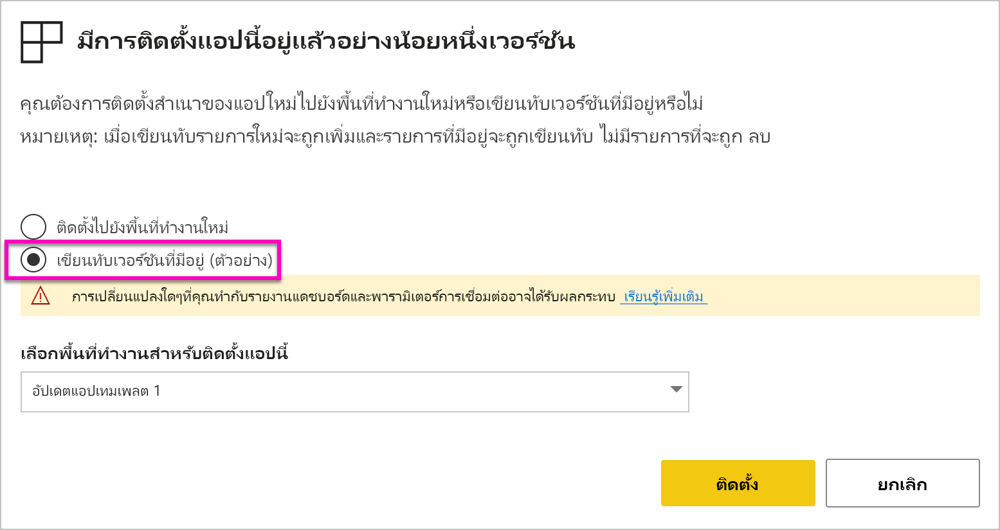

- **ติดตั้งไปยังพื้นที่ทำงานใหม่:** ติดตั้งพื้นที่ทำงานและแอพเวอร์ชั่นใหม่ที่คุณต้องการกำหนดค่าใหม่

### รูปแบบการเขียนทับ

* เขียนทับข้อมูลอัปเดตรายงาน แดชบอร์ดและชุดข้อมูบภายใน*พื้นที่ทำงาน* ไม่ใช่แอพ การเขียนทับไม่ได้เป็นการเปลี่ยนการนำทางของแอพ การตั้งค่าและสิทธิ์อนุญาต
* หลังจากอัปเดตพื้นที่ทำงาน คุณจะต้อง*อัปเดตแอพ*เพื่อปรับใช้การเปลี่ยนแปลงจากพื้นที่ทำงานดังกล่าวไปยังแอป
* การเขียนทับจะยังคงเก็บค่าพารามิเตอร์และการตรวจรับรองที่กำหนดค่าไว้ หลังการอัปเดต การรีเฟรชชุดข้อมูลอัตโนมัติจะเริ่มต้นขึ้น ระหว่างนี้ แอปของหน่วยงาน รายงานและแดชบอร์ดจะนำเสนอ*ข้อมูลตัวอย่าง*
  
* การเขียนทับจะเป็นการนำเสนอข้อมูลตัวอย่างจนกว่าการรีเฟรชจะเสร็จสิ้น หากผู้สร้างแอปเทมเพลตทำการแก้ไขชุดข้อมูลหรือพารามิเตอร์ ผู้ใช้พื้นที่ทำงานและแอพดังกล่าวจะยังคงเห็น*ข้อมูลตัวอย่าง*ดังกล่าว
* การเขียนทับไม่ได้เป็นการลบรายงานหรือแดชบอร์ด*ใหม่*ที่คุณเพิ่งเพิ่มไปยังพื้นที่ทำงาน โดยจะเป็นการเขียนทับรายงานและแดชบอร์ดเดิม พร้อมการเปลี่ยนแปลงจากผู้สร้างเดิม

>[!IMPORTANT]
>อย่าลืม[อัปเดตแอป](#customize-and-publish-the-app)หลังจากเขียนทับเพื่อปรับใช้การเปลี่ยนแปลงกับรายงานและแดชบอร์ดสำหรับผู้ใช้แอพหน่วยงานของคุณ

## ขั้นตอนถัดไป

[สร้างพื้นที่ทำงานกับเพื่อนร่วมงานของคุณใน Power BI](service-create-workspaces.md)
