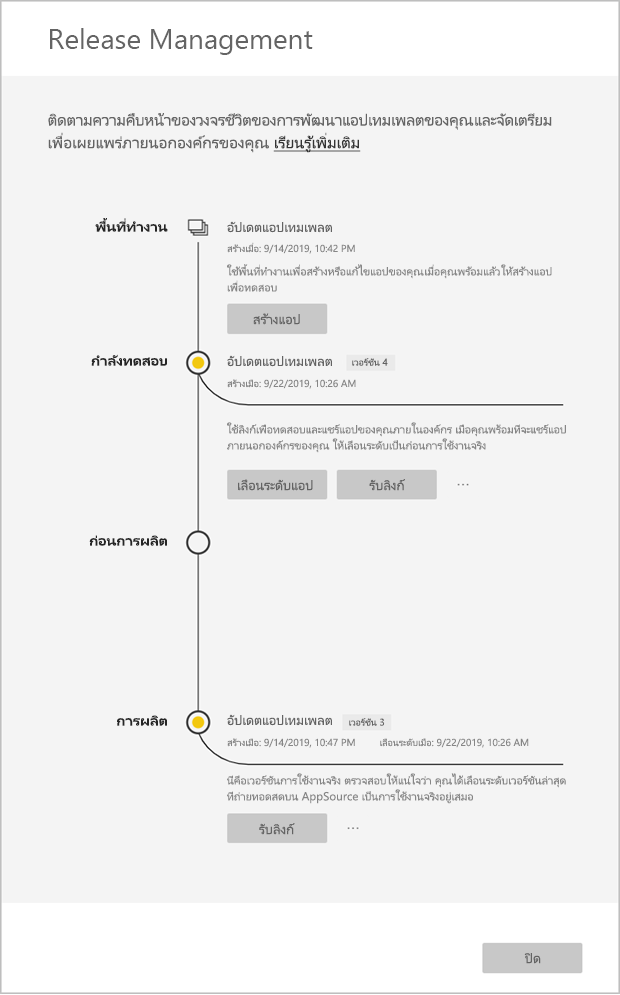
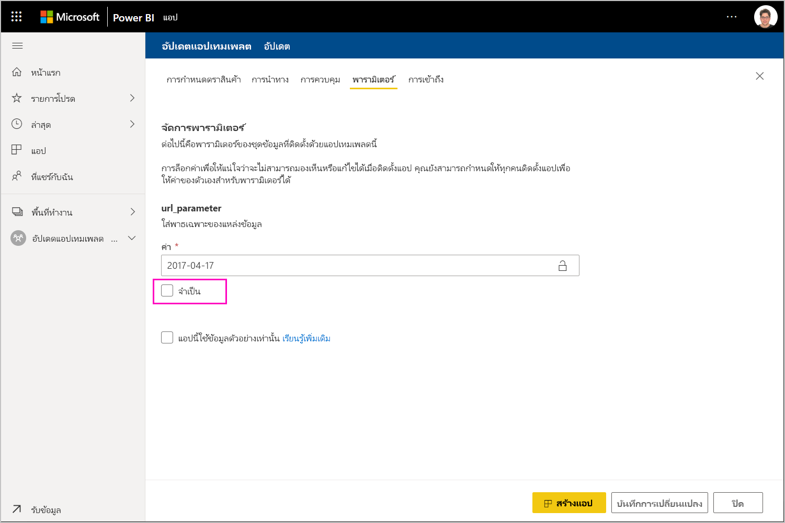

# อัปเดต ลบ และแยกแอปแม่แบบ

หลังจากที่แอปของคุณอยู่ในผลิต คุณสามารถเริ่มต้นในขั้นตอนการทดสอบโดยไม่รบกวนแอปในการผลิต
## อัปเดตแอปของคุณ

หากคุณทำการแก้ไขเดสก์ทอป Power BI ให้เริ่มจากขั้นตอนที่ (1) หากคุณไม่ได้ทำการเปลี่ยนแปลงใด ๆ ในเดสก์ทอป Power BI ให้เริ่มขั้นตอนที่ (4)

1. อัปโหลดชุดข้อมูลที่อัปเดตแล้วและเขียนทับชุดข้อมูลที่มีอยู่ **อย่าลืมใช้ชื่อชุดข้อมูลให้เหมือนกัน** การใช้ชื่ออื่นจะทำให้เกิดชุดข้อมูลใหม่สำหรับผู้ใช้ที่กำลังอัปเดตแอพ

1. นำเข้าไฟล์ pbix จากคอมพิวเตอร์ของคุณ

1. ยืนยันการเขียนทับ

1. ในบานหน้าต่าง **การจัดการวางจำหน่าย** เลือก**สร้างแอป**
1. ย้อนกลับผ่านขั้นตอนการสร้างแอป
1. หลังจากที่คุณได้ตั้งค่า**Branding**, **เนื้อหา**, **ควบคุม**และ**Access**คุณเลือก**สร้างแอป**อีกครั้ง
1. เลือก **ปิด** และกลับไปยัง**การจัดการวางจำหน่าย**

   คุณเห็นว่าคุณมีสองเวอร์ชันในขณะนี้: เวอร์ชันในผลิต รวมถึงเวอร์ชันใหม่ในการทดสอบ

    

5. เมื่อคุณพร้อมที่จะเลื่อนระดับแอปของคุณไปยังการผลิตล่วงหน้าสำหรับการทดสอบภายนอกผู้เช่าของคุณเพิ่มเติม **ย้อนกลับไปที่บานหน้าต่างการจัดการวางจำหน่าย** **และเลือก เลื่อนแอป ถัดจากการทดสอบ**
6. ขณะนี้ลิงก์ของคุณได้ออนไลน์แล้ว ส่งไปยังพอร์ทัล Cloud Partner (CPP) อีกครั้งโดยทำตามขั้นตอนที่ [การอัปเดตข้อเสนอของแอป Power BI](https://docs.microsoft.com/azure/marketplace/cloud-partner-portal/power-bi/cpp-update-existing-offer)
7. จากไซต์ Cloud Parnter คุณจะต้อง**เผยแพร่**ข้อเสนอของคุณอีกครั้งเพื่อให้มีการยืนยัน

   >[!NOTE]
   >เลื่อนระดับแอปของคุณไปเป็นขั้นตอนการผลิตเฉพาะหลังจากที่แอปของคุณจะได้รับอนุมัติโดยพอร์ทัล Cloud Partner และคุณเผยแพร่แล้วเท่านั้น

### อัปเดตพฤติกรรม

1. การอัปเดตแอปจะช่วยให้ผู้ติดตั้งแอปเทมเพลตสามารถ[อัปเดตแอปเทมเพลต](service-template-apps-install-distribute.md#update-a-template-app)ในพื้นที่ทำงานที่ติดตั้งไว้แล้วโดยที่การกำหนดค่าการเชื่อมต่อไม่หายไป
1. ดูใน[รูปแบบการเขียนทับ](service-template-apps-install-distribute.md#overwrite-behavior)ของตัวติดตั้งเพื่อเรียนรู้เกี่ยวกับการปรับเปลี่ยนในชุดข้อมูลที่จะมีผลต่อแอปเทมเพลตที่ติดตั้ง
1. ขณะอัปเดต (เขียนทับ) แอปเทเพลต จะมีการย้อนกลับไปที่ข้อมูลตัวอย่างและทำการเชื่อมต่อใหม่อัตโนมัติกับการกำหนดค่าของผู้ใช้ (พารามิเตอร์และการรับรองความถูกต้อง) จนกว่าการรีเฟรชจะเสร็จสิ้น รายงาน แดชบอร์ดและแอปของหน่วยงานจะมีมีอยู่ในแบนเนอร์ข้อมูลตัวอย่าง
1. หากคุณเพิ่มพารามิเตอร์การสืบค้นไปยังชุดข้อมูลที่อัพปเดตที่ต้องการข้อมูลจากผู้ใช้ - คุณจะต้องทำเครื่องหมายในช่อง*จำเป็น* ซึ่งจะเป็นการแจ้งตัวติดตั้งในสตริงการเชื่อมต่อหลังจากทำการอัปเดตแอพ
 

## แยกพื้นที่ทำงาน
ด้วยความสามารถในการแยกการย้อนกลับเป็นเวอร์ชันก่อนหน้าของแอปเทมเพลตสามารถทำได้ง่ายขึ้น ขั้นตอนต่อไปนี้จะแยกเวอร์ชันแอปเฉพาะจากขั้นตอนต่าง ๆ ที่เผยแพร่ลงในพื้นที่ทำงานใหม่:

1. ในบานหน้าต่างการจัดการแผยแพร่ กด **(...)** เพิ่มจากนั้น**แยก**

     
2. ในกล่องโต้ตอบ ใส่ชื่อสำหรับพื้นที่ทำงานที่จะแยกออกมา พื้นที่ทำงานใหม่จะถูกเพิ่ม

รีเซ็ตการกำหนดรุ่นของพื้นที่ทำงานใหม่ของคุณ คุณสามารถพัฒนาและกระจายแอปเทมเพลตจากพื้นที่ทำงานใหม่แยกออกมา

## ลบเวอรชันแอปเทมเพลต
เทมแพลตพื้นที่ทำงานเป็นแหล่งข้อมูลของแอปเทมเพลตแบบกระจายที่ใช้งานอยู่ เพื่อปกป้องผู้ใช้แอปเทมเพลต ผู้ใช้จะไม่สามารถลบพื้นที่ทำงานโดยไม่ต้องลบเวอร์ชันแอปที่สร้างขึ้นทั้งหมดในพื้นที่ทำงานก่อนหน้านี้ได้
การลบเวอร์ชันแอปยังเป็นการลบลบ URL ของแอปที่ไม่ทำงานอีกแล้วไปด้วย

1. ในบานหน้าต่างการจัดการเผยแพร่ กดเลือกจุดไข่ปลา **(...)** จากนั้น**ลบ**
 
  

>[!NOTE]
>ต้องแน่ใจว่าจะไม่ลบเวอร์ชันแอปหรือ**AppSource**ที่ลูกค้ากำลังใช้งานอยู่หรือแอปเหล่านั้นไม่สามารถใช้งานได้อีกต่อไป

## ขั้นตอนถัดไป

ดูวิธีการที่ลูกค้าของคุณโต้ตอบกับแอปแม่แบบของคุณใน[ติดตั้ง กำหนดเอง และเผยแพรแอปแม่แบบในองค์กรของคุณ](service-template-apps-install-distribute.md)

ดู[ข้อเสนอแอปพลิเคชัน BI Power](https://docs.microsoft.com/azure/marketplace/cloud-partner-portal/power-bi/cpp-power-bi-offer)สำหรับรายละเอียดเกี่ยวกับการแจกจ่ายแอปของคุณ
